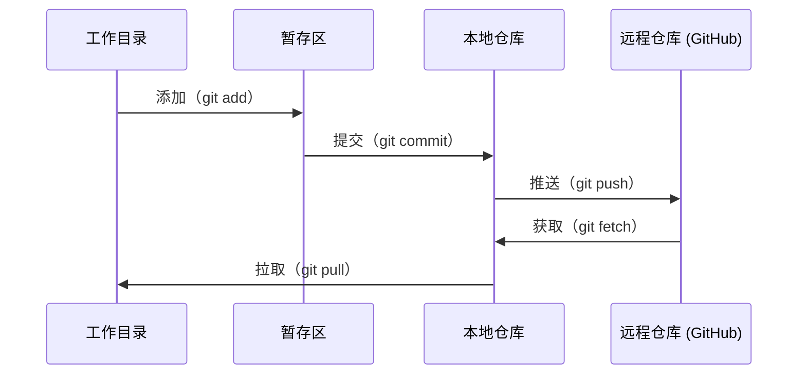

# Git 与协作

> 版本控制 (version control) 不是可选项。你在这里做的每个实验、每个模型、每节课，都会被跟踪。

**类型：** 学习
**语言：** --
**前置条件：** 阶段 0，第 01 课
**时间：** ~30 分钟

## 学习目标

- 配置 git 身份信息，并掌握 add、commit、push 的日常工作流
- 为隔离实验创建并合并分支，而不破坏 main
- 编写一个 `.gitignore`，排除模型 checkpoint 和大型二进制文件
- 使用 `git log` 浏览提交历史，理解项目是如何演进的

## 问题

你即将跨越 20 个阶段编写数百个代码文件。没有版本控制，你会丢失工作成果、弄坏后无法撤销的内容，也没有办法与他人协作。

Git 是工具。GitHub 是代码所在之处。本课只讲你完成本课程所需的内容，不多不少。

## 概念



记住三件事：
1. 经常保存（`git commit`）
2. 推送到远程仓库（`git push`）
3. 做实验时使用分支（`git checkout -b experiment`）

## 动手构建

### 第 1 步：配置 git

```bash
git config --global user.name "Your Name"
git config --global user.email "you@example.com"
```

### 第 2 步：日常工作流

```bash
git status
git add file.py
git commit -m "Add perceptron implementation"
git push origin main
```

### 第 3 步：为实验创建分支

```bash
git checkout -b experiment/new-optimizer

# ... make changes, commit ...

git checkout main
git merge experiment/new-optimizer
```

### 第 4 步：在本课程仓库中工作

```bash
git clone https://github.com/rohitg00/ai-engineering-from-scratch.git
cd ai-engineering-from-scratch

git checkout -b my-progress
# work through lessons, commit your code
git push origin my-progress
```

## 使用它

对于本课程，你只需要这些命令：

| 命令 | 何时使用 |
|---------|------|
| `git clone` | 获取课程仓库 |
| `git add` + `git commit` | 保存你的工作 |
| `git push` | 备份到 GitHub |
| `git checkout -b` | 在不破坏 main 的情况下尝试新东西 |
| `git log --oneline` | 看看你做过什么 |

就这些。本课程不需要 rebase、cherry-pick 或 submodules。

## 练习

1. 克隆这个仓库，创建一个名为 `my-progress` 的分支，建立一个文件，提交并推送它
2. 创建一个 `.gitignore`，排除模型 checkpoint 文件（`.pt`、`.pth`、`.safetensors`）
3. 用 `git log --oneline` 查看这个仓库的提交历史，并阅读课程是如何被添加进去的

## 关键术语

| 术语 | 人们常说 | 实际含义 |
|------|----------------|----------------------|
| 提交 (Commit) | “保存” | 在某个时间点对整个项目拍摄的一张快照 |
| 分支 (Branch) | “一个副本” | 指向某个提交的指针，会随着你的工作向前移动 |
| 合并 (Merge) | “合并代码” | 将一个分支的更改取出并应用到另一个分支 |
| 远程仓库 (Remote) | “云端” | 托管在其他地方（GitHub、GitLab）的仓库副本 |
