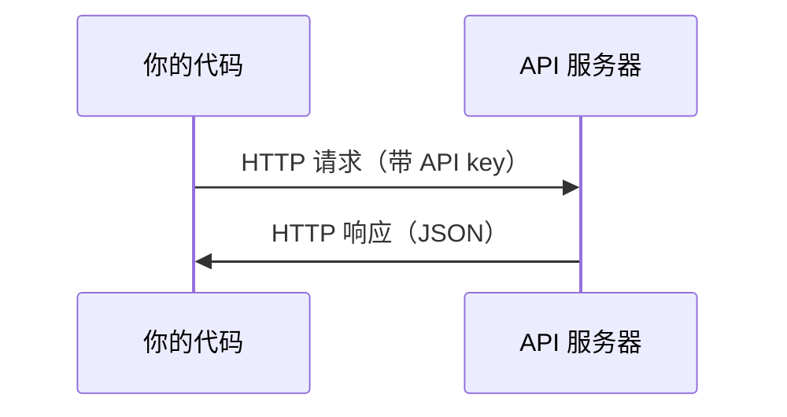

# API 与密钥

> 每个 AI API 的工作方式都一样：发送请求，得到响应。细节会变，模式不变。

**类型：** 构建
**语言：** Python, TypeScript
**前置条件：** 阶段 0，第 01 课
**时间：** ~30 分钟

## 学习目标

- 使用环境变量和 `.env` 文件安全地存储 API key
- 分别使用 Anthropic Python SDK 和原始 HTTP 发起一次 LLM API 调用
- 对比基于 SDK 与原始 HTTP 的请求/响应格式，以便调试
- 识别并处理常见 API 错误，包括身份验证和速率限制

## 问题

从阶段 11 开始，你将调用 LLM API（Anthropic、OpenAI、Google）。在阶段 13-16 中，你将构建会在循环中使用这些 API 的智能体。你需要知道 API key 如何工作、如何安全存储它们，以及如何发起第一次 API 调用。

## 概念



每一次 API 调用都包含：
1. 一个端点 (endpoint / URL)
2. 一个 API key（身份验证）
3. 一个请求体 (request body)（你想要什么）
4. 一个响应体 (response body)（你得到什么）

## 动手构建

### 第 1 步：安全存储 API key

绝不要把 API key 写进代码中。请使用环境变量 (environment variables)。

```bash
export ANTHROPIC_API_KEY="sk-ant-..."
export OPENAI_API_KEY="sk-..."
```

或者使用 `.env` 文件（把它加入 `.gitignore`）：

```
ANTHROPIC_API_KEY=sk-ant-...
OPENAI_API_KEY=sk-...
```

### 第 2 步：第一次 API 调用（Python）

```python
import anthropic

client = anthropic.Anthropic()

response = client.messages.create(
    model="claude-sonnet-4-20250514",
    max_tokens=256,
    messages=[{"role": "user", "content": "What is a neural network in one sentence?"}]
)

print(response.content[0].text)
```

### 第 3 步：第一次 API 调用（TypeScript）

```typescript
import Anthropic from "@anthropic-ai/sdk";

const client = new Anthropic();

const response = await client.messages.create({
  model: "claude-sonnet-4-20250514",
  max_tokens: 256,
  messages: [{ role: "user", content: "What is a neural network in one sentence?" }],
});

console.log(response.content[0].text);
```

### 第 4 步：原始 HTTP（不使用 SDK）

```python
import os
import urllib.request
import json

url = "https://api.anthropic.com/v1/messages"
headers = {
    "Content-Type": "application/json",
    "x-api-key": os.environ["ANTHROPIC_API_KEY"],
    "anthropic-version": "2023-06-01",
}
body = json.dumps({
    "model": "claude-sonnet-4-20250514",
    "max_tokens": 256,
    "messages": [{"role": "user", "content": "What is a neural network in one sentence?"}],
}).encode()

req = urllib.request.Request(url, data=body, headers=headers, method="POST")
with urllib.request.urlopen(req) as resp:
    result = json.loads(resp.read())
    print(result["content"][0]["text"])
```

这就是 SDK 在底层所做的事情。理解原始 HTTP 调用有助于调试。

## 使用它

对于本课程：

| API | 何时需要 | 免费额度 |
|-----|-----------------|-----------|
| Anthropic (Claude) | 阶段 11-16（智能体、工具） | 注册赠送 $5 额度 |
| OpenAI | 阶段 11（对比） | 注册赠送 $5 额度 |
| Hugging Face | 阶段 4-10（模型、数据集） | 免费 |

你现在不需要把它们全部准备好。在课程需要时再进行配置即可。

## 交付

本课会产出：
- `outputs/prompt-api-troubleshooter.md` - 诊断常见 API 错误

## 练习

1. 获取一个 Anthropic API key，并发起你的第一次 API 调用
2. 试试原始 HTTP 版本，并把响应格式与 SDK 版本进行比较
3. 故意使用错误的 API key，并阅读错误信息

## 关键术语

| 术语 | 人们常说 | 实际含义 |
|------|----------------|----------------------|
| API 密钥 (API key) | “API 的密码” | 用于标识你的账户并授权请求的唯一字符串 |
| 速率限制 (Rate limit) | “他们在限流我” | 每分钟/每小时允许的最大请求数，用于防止滥用并确保公平使用 |
| Token | “一个词”（在 API 语境中） | 一种计费单位：输入和输出 token 会分别计数并收费 |
| 流式输出 (Streaming) | “实时响应” | 按词逐步获取响应，而不是等待完整响应返回 |
