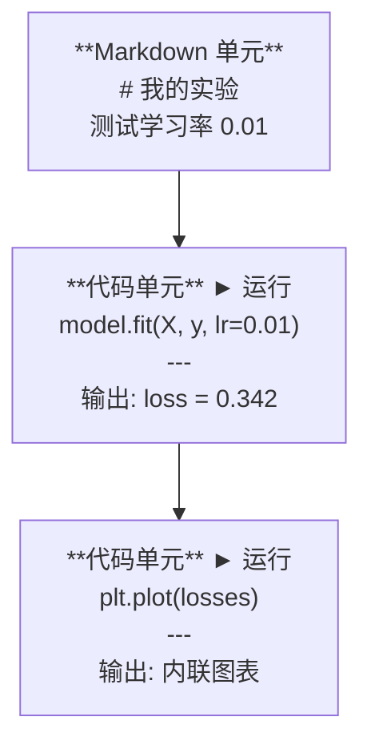
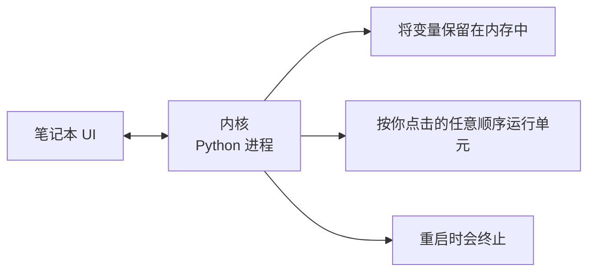

# Jupyter 笔记本 (Jupyter Notebooks)

> 笔记本是 AI 工程的实验台。你在这里做原型验证，然后把可行的内容迁移到生产环境。

**类型:** 构建
**语言:** Python
**前置条件:** 第 0 阶段，第 01 课
**时间:** ~30 分钟

## 学习目标

- 安装并启动 JupyterLab、Jupyter Notebook，或安装了 Jupyter 扩展的 VS Code
- 使用魔法命令 (magic commands)，如 `%timeit`、`%%time`、`%matplotlib inline`，进行基准测试并内联可视化
- 区分何时使用笔记本 (notebooks) 与脚本，并应用“在笔记本中探索，在脚本中交付”的工作流
- 识别并避免笔记本的常见陷阱：乱序执行、隐藏状态和内存泄漏

## 问题

每一篇 AI 论文、教程和 Kaggle 竞赛几乎都会用到 Jupyter 笔记本。它让你可以分块运行代码、内联查看输出、把代码和说明混排在一起，并快速迭代。如果你想学 AI 却不用笔记本，就像做数学作业却没有草稿纸。

但笔记本也有真实的陷阱。很多人把它用于所有事情，包括那些它根本不擅长的场景。知道什么时候该用笔记本、什么时候该用脚本，能帮你避免日后的调试噩梦。

## 概念

笔记本由一系列单元 (cells) 组成。每个单元要么是代码，要么是文本。



内核 (kernel) 是一个在后台运行的 Python 进程。当你运行某个单元时，它会把代码发送给内核；内核执行后再把结果返回。所有单元共享同一个内核，所以变量会在单元之间持续存在。



“按你点击的任意顺序”这一点，既是它的超能力，也是最容易伤到自己的地方。

## 动手实践

### 第 1 步：选择你的界面

三种选择，一种格式：

| 界面 | 安装 | 最适合 |
|-----------|---------|----------|
| JupyterLab | `pip install jupyterlab`，然后运行 `jupyter lab` | 完整 IDE 体验、多标签页、文件浏览器、终端 |
| Jupyter Notebook | `pip install notebook`，然后运行 `jupyter notebook` | 简单、轻量、一次只开一个笔记本 |
| VS Code | 安装 "Jupyter" 扩展 | 已经在你的编辑器里、git 集成、可调试 |

这三者读写的都是同一个 `.ipynb` 文件。选你喜欢的就好。JupyterLab 是 AI 工作中最常见的选择。

```bash
pip install jupyterlab
jupyter lab
```

### 第 2 步：重要的键盘快捷键

你会在两种模式之间操作。按 `Escape` 进入命令模式（左侧蓝条），按 `Enter` 进入编辑模式（绿色条）。

**命令模式（最常用）：**

| 按键 | 操作 |
|-----|--------|
| `Shift+Enter` | 运行单元并移动到下一个 |
| `A` | 在上方插入单元 |
| `B` | 在下方插入单元 |
| `DD` | 删除单元 |
| `M` | 转为 markdown |
| `Y` | 转为代码 |
| `Z` | 撤销单元操作 |
| `Ctrl+Shift+H` | 显示所有快捷键 |

**编辑模式：**

| 按键 | 操作 |
|-----|--------|
| `Tab` | 自动补全 |
| `Shift+Tab` | 显示函数签名 |
| `Ctrl+/` | 切换注释 |

`Shift+Enter` 是你每天会按上千次的那个快捷键。先把它练熟。

### 第 3 步：单元类型

**代码单元** 运行 Python 并显示输出：

```python
import numpy as np
data = np.random.randn(1000)
data.mean(), data.std()
```

输出：`(0.0032, 0.9987)`

**Markdown 单元** 会渲染格式化文本。用它来记录你在做什么，以及为什么这么做。它支持标题、粗体、斜体、LaTeX 数学公式 (`$E = mc^2$`)、表格和图片。

### 第 4 步：魔法命令

这些不是 Python。它们是 Jupyter 专用命令，以 `%`（行级魔法，line magic）或 `%%`（单元级魔法，cell magic）开头。

**为代码计时：**

```python
%timeit np.random.randn(10000)
```

输出：`45.2 us +/- 1.3 us per loop`

```python
%%time
model.fit(X_train, y_train, epochs=10)
```

输出：`Wall time: 2.34 s`

`%timeit` 会运行多次并取平均值。`%%time` 只运行一次。微基准测试用 `%timeit`，训练任务用 `%%time`。

**启用内联图表：**

```python
%matplotlib inline
```

现在，每个 `plt.plot()` 或 `plt.show()` 都会直接渲染在笔记本中。

**无需离开笔记本即可安装包：**

```python
!pip install scikit-learn
```

前缀 `!` 可以运行任意 shell 命令。

**检查环境变量：**

```python
%env CUDA_VISIBLE_DEVICES
```

### 第 5 步：内联显示富输出

笔记本会自动显示单元中的最后一个表达式。但你也可以自己控制：

```python
import pandas as pd

df = pd.DataFrame({
    "model": ["Linear", "Random Forest", "Neural Net"],
    "accuracy": [0.72, 0.89, 0.94],
    "training_time": [0.1, 2.3, 45.6]
})
df
```

这里渲染出来的是格式化的 HTML 表格，而不是纯文本转储。图表也是一样：

```python
import matplotlib.pyplot as plt

plt.figure(figsize=(8, 4))
plt.plot([1, 2, 3, 4], [1, 4, 2, 3])
plt.title("Inline Plot")
plt.show()
```

图表会直接出现在该单元下方。这就是为什么笔记本在 AI 工作中占据主导地位：你可以同时看到数据、图表和代码。

对于图像：

```python
from IPython.display import Image, display
display(Image(filename="architecture.png"))
```

### 第 6 步：Google Colab

Colab 是运行在云端的免费 Jupyter 笔记本。它提供 GPU、预装库以及 Google Drive 集成。不需要任何本地配置。

1. 打开 [colab.research.google.com](https://colab.research.google.com)
2. 上传本课程中的任意 `.ipynb` 文件
3. Runtime > Change runtime type > T4 GPU（免费）

Colab 与本地 Jupyter 的区别：
- 文件不会在会话之间持久保存（保存到 Drive 或下载到本地）
- 预装：numpy、pandas、matplotlib、torch、tensorflow、sklearn
- `from google.colab import files` 用于上传/下载文件
- `from google.colab import drive; drive.mount('/content/drive')` 用于持久化存储
- 空闲 90 分钟后会话会超时（免费层）

## 开始使用

### 笔记本与脚本：分别在何时使用

| 适合用笔记本的场景 | 适合用脚本的场景 |
|-------------------|-----------------|
| 探索数据集 | 训练流水线 |
| 为模型做原型验证 | 可复用工具 |
| 结果可视化 | 任何带 `if __name__` 的代码 |
| 解释你的工作 | 按计划调度运行的代码 |
| 快速实验 | 生产代码 |
| 课程练习 | 包和库 |

规则只有一条：**在笔记本中探索，在脚本中交付**。

AI 中常见的工作流是：
1. 在笔记本中探索数据
2. 在笔记本中为模型做原型验证
3. 一旦验证可行，就把代码迁移到 `.py` 文件中
4. 再把这些 `.py` 文件导回笔记本中继续做实验

### 常见陷阱

**乱序执行。** 你先运行第 5 个单元，再运行第 2 个，然后运行第 7 个。这个笔记本在你的机器上能跑，但别人从头到尾运行时就会坏掉。修复方法：分享前执行 `Kernel > Restart & Run All`。

**隐藏状态。** 你删除了一个单元，但它创建的变量仍然留在内存里。笔记本看起来很干净，实际上却依赖一个“幽灵单元”。修复方法：定期重启内核。

**内存泄漏。** 先加载一个 4GB 数据集，再训练模型，又加载另一个数据集。没有任何东西被释放。修复方法：使用 `del variable_name` 和 `gc.collect()`，或者直接重启内核。

## 交付成果

本课会产出：
- `outputs/prompt-notebook-helper.md`，用于调试笔记本问题

## 练习

1. 打开 JupyterLab，创建一个笔记本，并使用 `%timeit` 比较列表推导式 (list comprehension) 与 numpy 在创建 100,000 个随机数数组时的性能
2. 创建一个同时包含 markdown 和代码单元的笔记本：加载一个 CSV、显示一个数据框 (dataframe)，并绘制一张图表。然后执行 `Kernel > Restart & Run All`，验证它能从头到尾运行
3. 取出 `code/notebook_tips.py` 中的代码，粘贴到 Colab 笔记本里，并在免费 GPU 上运行它

## 关键术语

| 术语 | 人们常说 | 实际含义 |
|------|----------------|----------------------|
| 内核 (Kernel) | “运行我代码的那个东西” | 一个独立的 Python 进程，负责执行单元并把变量保留在内存中 |
| 单元 (Cell) | “一个代码块” | 笔记本中可独立运行的基本单元，可以是代码，也可以是 markdown |
| 魔法命令 (Magic command) | “Jupyter 小技巧” | 以 `%` 或 `%%` 为前缀、用于控制笔记本环境的特殊命令 |
| `.ipynb` | “笔记本文件” | 一个包含单元、输出和元数据的 JSON 文件，名称来自 IPython Notebook |

## 延伸阅读

- [JupyterLab 文档](https://jupyterlab.readthedocs.io/) 了解完整功能集
- [Google Colab FAQ](https://research.google.com/colaboratory/faq.html) 了解 Colab 特有的限制与功能
- [28 个 Jupyter Notebook 技巧](https://www.dataquest.io/blog/jupyter-notebook-tips-tricks-shortcuts/) 学习进阶快捷键
