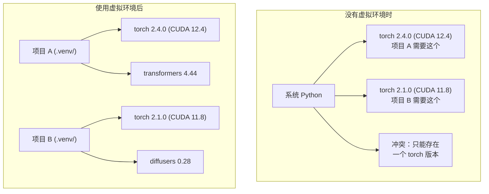

# Python 环境 (Python Environments)

> 依赖地狱确实存在。虚拟环境就是解药。

**类型:** 构建
**语言:** Shell
**前置条件:** 第 0 阶段，第 01 课
**时间:** ~30 分钟

## 学习目标

- 使用 `uv`、`venv` 或 `conda` 创建隔离的虚拟环境 (virtual environments)
- 编写带有可选依赖组的 `pyproject.toml`，并生成锁文件 (lockfiles) 以确保可复现性
- 诊断并修复常见陷阱：全局安装 (global installs)、混用 pip/conda、CUDA 版本不匹配
- 为存在冲突依赖的项目实现按阶段划分的环境策略

## 问题

你为一个微调项目安装了 PyTorch 2.4。下周，另一个项目需要 PyTorch 2.1，因为它固定绑定了某个 CUDA 构建版本。你在全局环境里升级后，第一个项目坏了；你再降级，第二个项目又坏了。

这就是依赖地狱。在 AI/ML 工作中，这种情况会反复发生，因为：

- PyTorch、JAX 和 TensorFlow 都各自携带自己的 CUDA 绑定
- 模型库会固定特定的框架版本
- 一次全局 `pip install` 会覆盖之前已经装好的内容
- CUDA 11.8 构建不能和 CUDA 12.x 驱动一起工作（反过来也一样）

解决方法：每个项目都使用自己独立的隔离环境，并拥有各自的包。

## 概念



## 动手实践

### 选项 1：uv venv（推荐）

`uv` 是速度最快的 Python 包管理器（比 pip 快 10-100 倍）。它用一个工具就能处理虚拟环境、Python 版本和依赖解析。

```bash
curl -LsSf https://astral.sh/uv/install.sh | sh

uv python install 3.12

cd your-project
uv venv
source .venv/bin/activate
```

安装包：

```bash
uv pip install torch numpy
```

一步创建带有 `pyproject.toml` 的项目：

```bash
uv init my-ai-project
cd my-ai-project
uv add torch numpy matplotlib
```

### 选项 2：venv（内置）

如果你不能安装 `uv`，Python 自带 `venv`：

```bash
python3 -m venv .venv
source .venv/bin/activate  # Linux/macOS
.venv\Scripts\activate     # Windows

pip install torch numpy
```

它比 `uv` 慢一些，但只要装了 Python 的地方都能用。

### 选项 3：conda（在需要时使用）

Conda 可以管理像 CUDA 工具包 (toolkits)、cuDNN 和 C 库这样的非 Python 依赖。出现以下情况时使用它：

- 你需要某个特定版本的 CUDA 工具包 (toolkit)，但又不想在系统范围内安装它
- 你在共享集群上工作，无法安装系统包
- 某个库的安装说明明确写着“use conda”

```bash
# Install miniconda (not the full Anaconda)
curl -LsSf https://repo.anaconda.com/miniconda/Miniconda3-latest-Linux-x86_64.sh -o miniconda.sh
bash miniconda.sh -b

conda create -n myproject python=3.12
conda activate myproject

conda install pytorch torchvision torchaudio pytorch-cuda=12.4 -c pytorch -c nvidia
```

一条规则：如果你在某个环境里用了 conda，就在这个环境里一直用 conda 安装所有包。把 `pip install` 混进 conda 环境，会造成非常痛苦的依赖冲突调试过程。

### 针对本课程：按阶段划分的策略

你完全可以为整门课程只建一个环境。但别这么做。不同阶段需要不同的依赖，而且这些依赖有时还会互相冲突。

策略：

```
ai-engineering-from-scratch/
├── .venv/                    <-- shared lightweight env for phases 0-3
├── phases/
│   ├── 04-neural-networks/
│   │   └── .venv/            <-- PyTorch env
│   ├── 05-cnns/
│   │   └── .venv/            <-- same PyTorch env (symlink or shared)
│   ├── 08-transformers/
│   │   └── .venv/            <-- might need different transformer versions
│   └── 11-llm-apis/
│       └── .venv/            <-- API SDKs, no torch needed
```

`code/env_setup.sh` 中的脚本会为本课程创建基础环境。

## `pyproject.toml` 基础

每个 Python 项目都应该有一个 `pyproject.toml`。它把 `setup.py`、`setup.cfg` 和 `requirements.txt` 的职责合并到了一个文件里。

```toml
[project]
name = "ai-engineering-from-scratch"
version = "0.1.0"
requires-python = ">=3.11"
dependencies = [
    "numpy>=1.26",
    "matplotlib>=3.8",
    "jupyter>=1.0",
    "scikit-learn>=1.4",
]

[project.optional-dependencies]
torch = ["torch>=2.3", "torchvision>=0.18"]
llm = ["anthropic>=0.39", "openai>=1.50"]
```

然后安装：

```bash
uv pip install -e ".[torch]"    # base + PyTorch
uv pip install -e ".[llm]"     # base + LLM SDKs
uv pip install -e ".[torch,llm]" # everything
```

## 锁文件 (Lockfiles)

锁文件会把每一个依赖（包括传递依赖）固定到精确版本。这能保证可复现性：任何人只要从锁文件安装，就会得到完全相同的包。

```bash
# uv generates uv.lock automatically when using uv add
uv add numpy

# pip-tools approach
uv pip compile pyproject.toml -o requirements.lock
uv pip install -r requirements.lock
```

把锁文件提交到 git。当别人克隆仓库后，他们从锁文件安装，就能得到完全一致的版本。

## 常见错误

### 1. 全局安装

```bash
pip install torch  # BAD: installs to system Python

source .venv/bin/activate
pip install torch  # GOOD: installs to virtual environment
```

检查你的包到底装到了哪里：

```bash
which python       # should show .venv/bin/python, not /usr/bin/python
which pip           # should show .venv/bin/pip
```

### 2. 混用 pip 和 conda

```bash
conda create -n myenv python=3.12
conda activate myenv
conda install pytorch -c pytorch
pip install some-other-package   # BAD: can break conda's dependency tracking
conda install some-other-package # GOOD: let conda manage everything
```

如果你确实必须在 conda 里用 pip（有些包只有 pip 版本），先把所有 conda 包装完，再把 pip 包放到最后安装。

### 3. 忘记激活环境

```bash
python train.py           # uses system Python, missing packages
source .venv/bin/activate
python train.py           # uses project Python, packages found
```

你的 shell 提示符应该显示环境名称：

```
(.venv) $ python train.py
```

### 4. 把 .venv 提交到 git

```bash
echo ".venv/" >> .gitignore
```

虚拟环境通常有 200MB-2GB。它们是本地的，也无法在不同机器之间直接移植。应该提交的是 `pyproject.toml` 和锁文件，而不是 `.venv`。

### 5. CUDA 版本不匹配

```bash
nvidia-smi                # shows driver CUDA version (e.g., 12.4)
python -c "import torch; print(torch.version.cuda)"  # shows PyTorch CUDA version

# These must be compatible.
# PyTorch CUDA version must be <= driver CUDA version.
```

## 开始使用

运行设置脚本来创建你的课程环境：

```bash
bash phases/00-setup-and-tooling/06-python-environments/code/env_setup.sh
```

这会在仓库根目录创建一个 `.venv`，并安装、验证核心依赖。

## 练习

1. 运行 `env_setup.sh`，并确认所有检查都通过
2. 再创建第二个虚拟环境，在其中安装不同版本的 numpy，并确认两个环境彼此隔离
3. 为一个同时需要 PyTorch 和 Anthropic SDK 的项目编写 `pyproject.toml`
4. 故意在全局环境里安装一个包（不激活 venv），看看它被装到了哪里，然后再把它卸载掉

## 关键术语

| 术语 | 人们常说 | 实际含义 |
|------|----------------|----------------------|
| 虚拟环境 (Virtual environment) | “一个 venv” | 一个隔离目录，里面包含 Python 解释器和相关包，并与系统 Python 分离 |
| 锁文件 (Lockfile) | “固定依赖版本” | 一个列出每个包及其精确版本的文件，能保证不同机器上的安装结果一致 |
| pyproject.toml | “新的 setup.py” | Python 项目的标准配置文件，用来替代 setup.py/setup.cfg/requirements.txt |
| 传递依赖 (Transitive dependency) | “依赖的依赖” | 包 B 依赖 C；如果你安装了依赖 B 的 A，那么 C 就是 A 的传递依赖 |
| CUDA 版本不匹配 (CUDA mismatch) | “我的 GPU 不能用” | PyTorch 编译所针对的 CUDA 版本，与 GPU 驱动支持的版本不同 |
