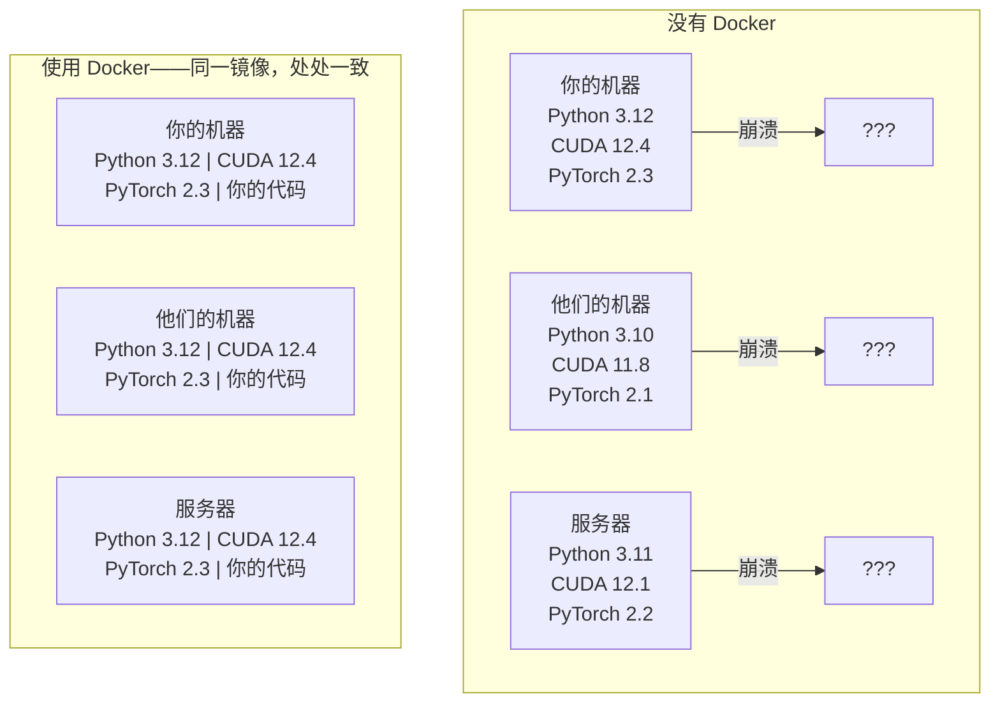

# 面向 AI 的 Docker

> 容器让“在我机器上能跑”成为过去式。

**类型：** 构建
**语言：** Docker
**前置要求：** 第 0 阶段，第 01 和 03 课
**时间：** ~60 分钟

## 学习目标

- 使用 Dockerfile 构建包含 CUDA、PyTorch 和 AI 库的 GPU Docker 镜像
- 将主机目录挂载为数据卷(volume)，在容器重建后仍保留模型、数据集和代码
- 配置 NVIDIA Container Toolkit，让容器内部可以访问 GPU
- 使用 Docker Compose 编排多服务 AI 应用（推理服务器 + 向量数据库）

## 问题

你在笔记本上用 PyTorch 2.3、CUDA 12.4 和 Python 3.12 训练了一个模型。你的同事用的是 PyTorch 2.1、CUDA 11.8 和 Python 3.10。你的模型在他们的机器上崩溃了。而你的 Dockerfile 在两台机器上都能工作。

AI 项目的依赖往往像噩梦。一个典型栈会包含 Python、PyTorch、CUDA 驱动、cuDNN、系统级 C 库，以及像 flash-attn 这样需要精确编译器版本的专用包。Docker 把这一切打包成单个镜像，使其在任何地方都能以相同方式运行。

## 概念

Docker 把你的代码、运行时(runtime)、库和系统工具封装进一个名为容器(container)的隔离单元。你可以把它理解为轻量级虚拟机，只不过它共享主机 OS 内核，而不是运行自己的内核，因此启动只需要几秒而不是几分钟。



### 为什么 AI 项目比大多数项目更需要 Docker

1. **GPU 驱动很脆弱。** CUDA 12.4 的代码无法在 CUDA 11.8 上运行。Docker 通过 NVIDIA Container Toolkit 共享主机 GPU 驱动，同时把 CUDA toolkit 隔离在容器内。

2. **模型权重(model weights)很大。** 一个 7B 参数模型在 fp16 下有 14 GB。你不会想每次重建都重新下载它。Docker 数据卷(volume)让你可以从主机挂载 models 目录。

3. **多服务架构很常见。** 真实的 AI 应用不只是一个 Python 脚本。它通常包含推理服务器、用于 RAG 的向量数据库(vector database)，也许还有 Web 前端。Docker Compose 用一条命令把这些全部编排起来。

### 关键术语

| 术语 | 含义 |
|------|------|
| 镜像(Image) | 只读模板。你的配方。由 Dockerfile 构建而来。 |
| 容器(Container) | 镜像的运行实例。你的厨房。 |
| Dockerfile | 构建镜像的指令。逐层构建。 |
| 数据卷(Volume) | 在容器重启后依然保留的持久化存储。 |
| docker-compose | 用 YAML 定义多容器应用的工具。 |

### AI 中常见的容器模式

```
Dev Container
  Full toolkit. Editor support. Jupyter. Debugging tools.
  Used during development and experimentation.

Training Container
  Minimal. Just the training script and dependencies.
  Runs on GPU clusters. No editor, no Jupyter.

Inference Container
  Optimized for serving. Small image. Fast cold start.
  Runs behind a load balancer in production.
```

## 构建它

### 第 1 步：安装 Docker

```bash
# macOS
brew install --cask docker
open /Applications/Docker.app

# Ubuntu
curl -fsSL https://get.docker.com | sh
sudo usermod -aG docker $USER
# Log out and back in for group change to take effect
```

验证：

```bash
docker --version
docker run hello-world
```

### 第 2 步：安装 NVIDIA Container Toolkit（Linux + NVIDIA GPU）

这会让 Docker 容器可以访问你的 GPU。macOS 和 Windows（WSL2）用户可以跳过这一步；Docker Desktop 在这些平台上的 GPU 透传方式不同。

```bash
distribution=$(. /etc/os-release;echo $ID$VERSION_ID)
curl -fsSL https://nvidia.github.io/libnvidia-container/gpgkey | sudo gpg --dearmor -o /usr/share/keyrings/nvidia-container-toolkit-keyring.gpg
curl -s -L https://nvidia.github.io/libnvidia-container/$distribution/libnvidia-container.list | \
    sed 's#deb https://#deb [signed-by=/usr/share/keyrings/nvidia-container-toolkit-keyring.gpg] https://#g' | \
    sudo tee /etc/apt/sources.list.d/nvidia-container-toolkit.list

sudo apt-get update
sudo apt-get install -y nvidia-container-toolkit
sudo nvidia-ctk runtime configure --runtime=docker
sudo systemctl restart docker
```

在容器内测试 GPU 访问：

```bash
docker run --rm --gpus all nvidia/cuda:12.4.1-base-ubuntu22.04 nvidia-smi
```

如果你看到了 GPU 信息，说明 toolkit 工作正常。

### 第 3 步：理解基础镜像

选对基础镜像，能帮你省下数小时的调试时间。

```
nvidia/cuda:12.4.1-devel-ubuntu22.04
  Full CUDA toolkit. Compilers included.
  Use for: building packages that need nvcc (flash-attn, bitsandbytes)
  Size: ~4 GB

nvidia/cuda:12.4.1-runtime-ubuntu22.04
  CUDA runtime only. No compilers.
  Use for: running pre-built code
  Size: ~1.5 GB

pytorch/pytorch:2.3.1-cuda12.4-cudnn9-runtime
  PyTorch pre-installed on top of CUDA.
  Use for: skipping the PyTorch install step
  Size: ~6 GB

python:3.12-slim
  No CUDA. CPU only.
  Use for: inference on CPU, lightweight tools
  Size: ~150 MB
```

### 第 4 步：为 AI 开发编写 Dockerfile

下面是 `code/Dockerfile` 中的 Dockerfile。逐段看看它：

```dockerfile
FROM nvidia/cuda:12.4.1-devel-ubuntu22.04

ENV DEBIAN_FRONTEND=noninteractive
ENV PYTHONUNBUFFERED=1

RUN apt-get update && apt-get install -y --no-install-recommends \
    python3.12 \
    python3.12-venv \
    python3.12-dev \
    python3-pip \
    git \
    curl \
    build-essential \
    && rm -rf /var/lib/apt/lists/*

RUN update-alternatives --install /usr/bin/python python /usr/bin/python3.12 1

RUN python -m pip install --no-cache-dir --upgrade pip setuptools wheel

RUN python -m pip install --no-cache-dir \
    torch==2.3.1 \
    torchvision==0.18.1 \
    torchaudio==2.3.1 \
    --index-url https://download.pytorch.org/whl/cu124

RUN python -m pip install --no-cache-dir \
    numpy \
    pandas \
    scikit-learn \
    matplotlib \
    jupyter \
    transformers \
    datasets \
    accelerate \
    safetensors

WORKDIR /workspace

VOLUME ["/workspace", "/models"]

EXPOSE 8888

CMD ["python"]
```

构建它：

```bash
docker build -t ai-dev -f phases/00-setup-and-tooling/07-docker-for-ai/code/Dockerfile .
```

第一次构建会比较慢（需要下载 CUDA 基础镜像和 PyTorch）。后续构建会复用缓存层。

运行它：

```bash
docker run --rm -it --gpus all \
    -v $(pwd):/workspace \
    -v ~/models:/models \
    ai-dev python -c "import torch; print(f'PyTorch {torch.__version__}, CUDA: {torch.cuda.is_available()}')"
```

在容器内运行 Jupyter：

```bash
docker run --rm -it --gpus all \
    -v $(pwd):/workspace \
    -v ~/models:/models \
    -p 8888:8888 \
    ai-dev jupyter notebook --ip=0.0.0.0 --port=8888 --no-browser --allow-root
```

### 第 5 步：为数据和模型挂载数据卷

数据卷挂载对 AI 工作至关重要。没有它们，当容器停止时，你下载的 14 GB 模型就会消失。

```bash
# Mount your code
-v $(pwd):/workspace

# Mount a shared models directory
-v ~/models:/models

# Mount datasets
-v ~/datasets:/data
```

在你的训练脚本中，从挂载路径加载：

```python
from transformers import AutoModel

model = AutoModel.from_pretrained("/models/llama-7b")
```

模型存放在你的主机文件系统上。你可以随意重建容器，而不必重新下载。

### 第 6 步：为多服务 AI 应用使用 Docker Compose

一个真实的 RAG 应用需要推理服务器和向量数据库。Docker Compose 用一条命令同时运行两者。

请看 `code/docker-compose.yml`：

```yaml
services:
  ai-dev:
    build:
      context: .
      dockerfile: Dockerfile
    deploy:
      resources:
        reservations:
          devices:
            - driver: nvidia
              count: all
              capabilities: [gpu]
    volumes:
      - ../../../:/workspace
      - ~/models:/models
      - ~/datasets:/data
    ports:
      - "8888:8888"
    stdin_open: true
    tty: true
    command: jupyter notebook --ip=0.0.0.0 --port=8888 --no-browser --allow-root

  qdrant:
    image: qdrant/qdrant:v1.12.5
    ports:
      - "6333:6333"
      - "6334:6334"
    volumes:
      - qdrant_data:/qdrant/storage

volumes:
  qdrant_data:
```

启动所有服务：

```bash
cd phases/00-setup-and-tooling/07-docker-for-ai/code
docker compose up -d
```

现在，你的 AI 开发容器可以通过服务名访问 `http://qdrant:6333` 上的向量数据库。Docker Compose 会自动创建共享网络。

在 AI 容器内部测试连接：

```python
from qdrant_client import QdrantClient

client = QdrantClient(host="qdrant", port=6333)
print(client.get_collections())
```

停止所有服务：

```bash
docker compose down
```

加上 `-v` 还能同时删除 qdrant 数据卷：

```bash
docker compose down -v
```

### 第 7 步：AI 工作中实用的 Docker 命令

```bash
# List running containers
docker ps

# List all images and their sizes
docker images

# Remove unused images (reclaim disk space)
docker system prune -a

# Check GPU usage inside a running container
docker exec -it <container_id> nvidia-smi

# Copy a file from container to host
docker cp <container_id>:/workspace/results.csv ./results.csv

# View container logs
docker logs -f <container_id>
```

## 使用它

现在你已经有了一个可复现的 AI 开发环境。在本课程的剩余部分中：

- 使用 `docker compose up` 一起启动你的开发环境和向量数据库
- 把代码、模型和数据作为数据卷挂载，这样在重建之间不会丢失任何内容
- 当某节课需要新的 Python 包时，把它加入 Dockerfile 并重新构建
- 把你的 Dockerfile 分享给队友。他们将获得完全相同的环境。

### 没有 GPU？

移除 `--gpus all` 标志和 NVIDIA deploy 配置块即可。容器仍然可以用于基于 CPU 的课程。PyTorch 会检测到没有 CUDA，并自动回退到 CPU。

## 练习

1. 构建这个 Dockerfile，并在容器内运行 `python -c "import torch; print(torch.__version__)"`
2. 启动 docker-compose 栈，并验证 AI 容器可以通过 `http://qdrant:6333/collections` 访问 Qdrant
3. 把 `flask` 加入 Dockerfile，重新构建，并在 5000 端口运行一个简单的 API 服务器。使用 `-p 5000:5000` 映射端口
4. 使用 `docker images` 测量镜像大小。尝试把基础镜像从 `devel` 改为 `runtime`，并比较大小

## 关键术语

| 术语 | 人们怎么说 | 实际含义 |
|------|------------|----------|
| 容器(Container) | “轻量级 VM” | 一个使用主机内核、拥有自己文件系统和网络的隔离进程 |
| 镜像层(Image layer) | “缓存步骤” | 每条 Dockerfile 指令都会创建一层。未变化的层会被缓存，因此重建很快。 |
| NVIDIA Container Toolkit | “Docker 里的 GPU” | 一个运行时钩子，通过 `--gpus` 标志把主机 GPU 暴露给容器 |
| 数据卷挂载(Volume mount) | “共享文件夹” | 主机上的一个目录被映射进容器。容器停止后，改动仍然保留。 |
| 基础镜像(Base image) | “起点” | 你的 Dockerfile 所基于的 `FROM` 镜像。它决定了预装了什么。 |
