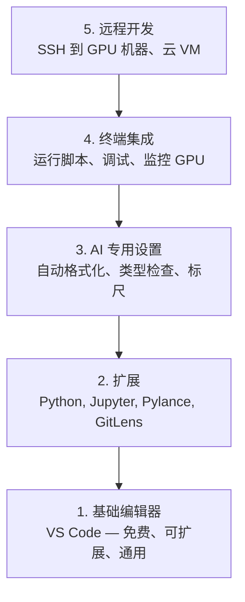

# 编辑器设置

> 你的编辑器就是你的副驾驶。一次配置好，让它不再碍事，并开始真正帮你分担工作。

**类型：** 构建
**语言：** --
**前置要求：** 第 0 阶段，第 01 课
**时间：** ~20 分钟

## 学习目标

- 安装 VS Code，并配置适用于 Python、Jupyter、linting 和远程 SSH 的核心扩展
- 为 AI 工作流配置保存时格式化、类型检查和 notebook 输出滚动
- 配置 Remote SSH，像在本地一样编辑和调试远程 GPU 机器上的代码
- 评估编辑器替代方案（Cursor、Windsurf、Neovim）及其在 AI 工作中的权衡

## 问题

你会在编辑器里花上成千上万小时，编写 Python、运行 notebooks、调试训练循环，还要 SSH 到 GPU 机器上。一个配置糟糕的编辑器会让每次会话都充满阻力：没有自动补全、没有类型提示、没有内联错误、格式化全靠手动，终端工作流也很笨重。

正确的配置只需要 20 分钟。跳过它，每天都会多花你 20 分钟。

## 概念

AI 工程的编辑器配置需要五样东西：



## 构建它

### 第 1 步：安装 VS Code

VS Code 是推荐的编辑器。它免费、支持所有主流 OS、对 Jupyter notebook 提供一流支持，而且扩展生态几乎覆盖了 AI 工作所需的一切。

从 [code.visualstudio.com](https://code.visualstudio.com/) 下载它。

在终端中验证：

```bash
code --version
```

如果在 macOS 上找不到 `code`，打开 VS Code，按 `Cmd+Shift+P`，输入 "Shell Command"，然后选择 "Install 'code' command in PATH"。

### 第 2 步：安装必备扩展

在 VS Code 中打开集成终端（`Ctrl+`` ` 或 `` Cmd+` ``），然后安装这些对 AI 工作最重要的扩展：

```bash
code --install-extension ms-python.python
code --install-extension ms-python.vscode-pylance
code --install-extension ms-toolsai.jupyter
code --install-extension eamodio.gitlens
code --install-extension ms-vscode-remote.remote-ssh
code --install-extension ms-python.debugpy
code --install-extension ms-python.black-formatter
code --install-extension charliermarsh.ruff
```

各自的作用：

| 扩展 | 作用 |
|-----------|-----|
| Python | 语言支持、虚拟环境检测、运行/调试 |
| Pylance | 快速类型检查、自动补全、导入解析 |
| Jupyter | 在 VS Code 中运行 notebooks、变量浏览器 |
| GitLens | 查看是谁改了什么、内联 git blame |
| Remote SSH | 像操作本地目录一样打开远程 GPU 机器上的文件夹 |
| Debugpy | Python 单步调试 |
| Black Formatter | 保存时自动格式化、统一风格 |
| Ruff | 快速 linting，捕获常见错误 |

本课中的文件 `code/.vscode/extensions.json` 包含完整的推荐列表。当你打开项目文件夹时，VS Code 会提示你安装它们。

### 第 3 步：配置设置

复制本课 `code/.vscode/settings.json` 中的设置，或通过 `Settings > Open Settings (JSON)` 手动应用。

AI 工作最关键的设置：

```jsonc
{
    "python.analysis.typeCheckingMode": "basic",
    "editor.formatOnSave": true,
    "editor.rulers": [88, 120],
    "notebook.output.scrolling": true,
    "files.autoSave": "afterDelay"
}
```

它们为什么重要：

- **把类型检查设为 basic**：在运行之前就能抓住错误的参数类型。对 tensor 形状不匹配和错误 API 参数，这能节省大量调试时间。
- **保存时格式化**：再也不用想着格式化。Black 会处理它。
- **在 88 和 120 列放置标尺**：Black 会在 88 列换行。120 列标记可以提醒你 docstring 和注释是否过长。
- **Notebook 输出滚动**：训练循环会打印成千上万行。没有滚动时，输出面板会直接失控。
- **自动保存**：你会忘记保存。你的训练脚本会运行旧代码。自动保存能避免这种情况。

### 第 4 步：终端集成

VS Code 的集成终端是你运行训练脚本、监控 GPU 和管理环境的地方。

正确配置如下：

```jsonc
{
    "terminal.integrated.defaultProfile.osx": "zsh",
    "terminal.integrated.defaultProfile.linux": "bash",
    "terminal.integrated.fontSize": 13,
    "terminal.integrated.scrollback": 10000
}
```

实用快捷键：

| 操作 | macOS | Linux/Windows |
|--------|-------|---------------|
| 切换终端 | `` Ctrl+` `` | `` Ctrl+` `` |
| 新建终端 | `Ctrl+Shift+`` ` | `Ctrl+Shift+`` ` |
| 分屏终端 | `Cmd+\` | `Ctrl+\` |

分屏终端非常有用：一个用来跑脚本，另一个用 `nvidia-smi -l 1` 或 `watch -n 1 nvidia-smi` 监控 GPU。

### 第 5 步：远程开发（SSH 到 GPU 机器）

这是 AI 工作里最重要的扩展。你会在远程机器（云 VM、实验室服务器、Lambda、Vast.ai）上运行训练。Remote SSH 让你像本地一样打开远程文件系统、编辑文件、运行终端并调试。

配置步骤：

1. 安装 Remote SSH 扩展（已在第 2 步完成）。
2. 按 `Ctrl+Shift+P`（或 `Cmd+Shift+P`），输入 "Remote-SSH: Connect to Host"。
3. 输入 `user@your-gpu-box-ip`。
4. VS Code 会自动在远程机器上安装它的 server 组件。

如果想免密访问，请配置 SSH keys：

```bash
ssh-keygen -t ed25519 -C "your-email@example.com"
ssh-copy-id user@your-gpu-box-ip
```

为了更方便，把 host 加到 `~/.ssh/config`：

```
Host gpu-box
    HostName 203.0.113.50
    User ubuntu
    IdentityFile ~/.ssh/id_ed25519
    ForwardAgent yes
```

现在，`Remote-SSH: Connect to Host > gpu-box` 就能立即连接。

## 其他选择

### Cursor

[cursor.com](https://cursor.com) 是 VS Code 的一个分支，内置了 AI 代码生成能力。它使用同样的扩展生态和设置格式。如果你使用 Cursor，本课中的所有内容依然适用。导入同样的 `settings.json` 和 `extensions.json` 即可。

### Windsurf

[windsurf.com](https://windsurf.com) 是另一个 AI 优先的 VS Code 分支。情况也一样：相同的扩展、相同的设置格式、相同的 Remote SSH 支持。

### Vim/Neovim

如果你已经在用 Vim 或 Neovim，并且效率很高，那就继续用。AI Python 工作的最低配置包括：

- **pyright** 或 **pylsp** 用于类型检查（通过 Mason 或手动安装）
- **nvim-lspconfig** 用于语言服务器集成
- **jupyter-vim** 或 **molten-nvim** 用于类似 notebook 的执行体验
- **telescope.nvim** 用于文件/符号搜索
- **none-ls.nvim** 搭配 black 和 ruff 做格式化/linting

如果你现在还没有使用 Vim，不要从今天开始。学习曲线会和 AI 工程学习相互争夺注意力。请用 VS Code。

## 使用它

有了这套配置，你的日常工作流会是这样：

1. 在 VS Code 中打开项目文件夹（或通过 Remote SSH 连接到 GPU 机器）。
2. 在编辑器中编写 Python，享受自动补全、类型提示和内联错误。
3. 用 Jupyter 扩展内联运行 Jupyter notebooks。
4. 使用集成终端来运行训练脚本、`uv pip install` 和监控 GPU。
5. 提交前用 GitLens 审查改动。

## 练习

1. 安装 VS Code 以及第 2 步列出的所有扩展
2. 把本课的 `settings.json` 复制到你的 VS Code 配置中
3. 打开一个 Python 文件，验证 Pylance 会显示类型提示，且 Black 会在保存时自动格式化
4. 如果你能访问远程机器，配置 Remote SSH 并在其上打开一个文件夹

## 关键术语

| 术语 | 人们怎么说 | 实际含义 |
|------|----------------|----------------------|
| LSP | “自动补全引擎” | Language Server Protocol：编辑器从特定语言服务获取类型信息、补全和诊断的标准 |
| Pylance | “Python 插件” | Microsoft 的 Python 语言服务，使用 Pyright 提供类型检查和 IntelliSense |
| Remote SSH | “在服务器上工作” | 一个 VS Code 扩展，会在远程机器上运行轻量服务端组件，并把 UI 流式传到本地编辑器 |
| 保存时格式化(Format on save) | “自动美化” | 每次保存时，编辑器都会运行格式化工具（Black、Ruff），因此代码风格始终一致 |
