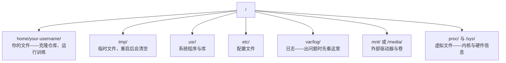

# AI 工程中的 Linux

> 大多数 AI 都跑在 Linux 上。你需要知道足够多的内容，才不会被卡住。

**类型：** 学习
**语言：** --
**前置要求：** 第 0 阶段，第 01 课
**时长：** ~30 分钟

## 学习目标

- 从命令行导航 Linux 文件系统，并完成关键的文件操作
- 使用 `chmod` 和 `chown` 管理文件权限，解决 “Permission denied” 错误
- 使用 `apt` 安装系统包，并为 AI 工作配置一台全新的 GPU 机器
- 识别 macOS 与 Linux 之间那些最容易让远程开发者踩坑的差异

## 问题

你也许在 macOS 或 Windows 上开发。但一旦你通过 SSH 登录云 GPU 机器、租用 Lambda 实例，或者启动一台 EC2 机器，你落地的就是 Ubuntu。终端是你唯一的界面。没有 Finder，没有 Explorer，也没有 GUI。如果你不能通过命令行导航文件系统、安装软件包、管理进程，你就只能一边为闲置的 GPU 小时付费，一边搜索 “how to unzip a file in Linux”。

这是一份生存指南。它只覆盖你在远程 Linux 机器上做 AI 工作时真正需要的内容，不多不少。

## 文件系统布局

Linux 把所有内容都组织在单一根目录 `/` 下。没有 `C:\`，也没有 `/Volumes`。你真正会接触的目录如下：



你的主目录是 `~` 或 `/home/your-username`。你做的几乎所有事情都发生在这里。

## 核心命令

下面这 15 个命令，覆盖了你在远程 GPU 机器上 95% 的操作。

### 目录导航

```bash
pwd                         # Where am I?
ls                          # What's here?
ls -la                      # What's here, including hidden files with details?
cd /path/to/dir             # Go there
cd ~                        # Go home
cd ..                       # Go up one level
```

### 文件与目录

```bash
mkdir my-project            # Create a directory
mkdir -p a/b/c              # Create nested directories in one shot

cp file.txt backup.txt      # Copy a file
cp -r src/ src-backup/      # Copy a directory (recursive)

mv old.txt new.txt          # Rename a file
mv file.txt /tmp/           # Move a file

rm file.txt                 # Delete a file (no trash, it's gone)
rm -rf my-dir/              # Delete a directory and everything inside
```

`rm -rf` 是永久删除。没有撤销。敲回车前先再检查一遍路径。

### 读取文件

```bash
cat file.txt                # Print entire file
head -20 file.txt           # First 20 lines
tail -20 file.txt           # Last 20 lines
tail -f log.txt             # Follow a log file in real time (Ctrl+C to stop)
less file.txt               # Scroll through a file (q to quit)
```

### 搜索

```bash
grep "error" training.log           # Find lines containing "error"
grep -r "learning_rate" .           # Search all files in current directory
grep -i "cuda" config.yaml          # Case-insensitive search

find . -name "*.py"                 # Find all Python files under current dir
find . -name "*.ckpt" -size +1G     # Find checkpoint files larger than 1GB
```

## 权限

Linux 中的每个文件都有所有者和权限位。你会在脚本无法执行，或者不能向某个目录写入时碰到它。

```bash
ls -l train.py
# -rwxr-xr-- 1 user group 2048 Mar 19 10:00 train.py
#  ^^^             owner permissions: read, write, execute
#     ^^^          group permissions: read, execute
#        ^^        everyone else: read only
```

常见修复：

```bash
chmod +x train.sh           # Make a script executable
chmod 755 deploy.sh         # Owner: full, others: read+execute
chmod 644 config.yaml       # Owner: read+write, others: read only

chown user:group file.txt   # Change who owns a file (needs sudo)
```

当你看到 “Permission denied” 时，几乎总是权限问题。大多数情况用 `chmod +x` 或 `sudo` 就能解决。

## 包管理（apt）

Ubuntu 使用 `apt`。这就是你安装系统级软件的方式。

```bash
sudo apt update             # Refresh the package list (always do this first)
sudo apt install -y htop    # Install a package (-y skips confirmation)
sudo apt install -y build-essential  # C compiler, make, etc. Needed by many Python packages
sudo apt install -y tmux    # Terminal multiplexer (keep sessions alive after disconnect)

apt list --installed        # What's installed?
sudo apt remove htop        # Uninstall
```

一台全新的 GPU 机器上，你常装的软件包包括：

```bash
sudo apt update && sudo apt install -y \
    build-essential \
    git \
    curl \
    wget \
    tmux \
    htop \
    unzip \
    python3-venv
```

## 用户与 sudo

你通常是以普通用户身份登录的。有些操作需要 root（管理员）权限。

```bash
whoami                      # What user am I?
sudo command                # Run a single command as root
sudo su                     # Become root (exit to go back, use sparingly)
```

在云 GPU 实例上，你通常是唯一用户，而且已经有 sudo 权限。不要把所有事情都用 root 来跑。只在需要时使用 sudo。

## 进程与 systemd

当你的训练卡住，或者你需要查看当前有什么在运行时：

```bash
htop                        # Interactive process viewer (q to quit)
ps aux | grep python        # Find running Python processes
kill 12345                  # Gracefully stop process with PID 12345
kill -9 12345               # Force kill (use when graceful doesn't work)
nvidia-smi                  # GPU processes and memory usage
```

systemd 负责管理服务（后台守护进程）。如果你运行推理服务器，就会用到它：

```bash
sudo systemctl start nginx          # Start a service
sudo systemctl stop nginx           # Stop it
sudo systemctl restart nginx        # Restart it
sudo systemctl status nginx         # Check if it's running
sudo systemctl enable nginx         # Start automatically on boot
```

## 磁盘空间

GPU 机器的磁盘空间通常有限。模型和数据集很快就能把它塞满。

```bash
df -h                       # Disk usage for all mounted drives
df -h /home                 # Disk usage for /home specifically

du -sh *                    # Size of each item in current directory
du -sh ~/.cache             # Size of your cache (pip, huggingface models land here)
du -sh /data/checkpoints/   # Check how big your checkpoints are

# Find the biggest space hogs
du -h --max-depth=1 / 2>/dev/null | sort -hr | head -20
```

常见的省空间做法：

```bash
# Clear pip cache
pip cache purge

# Clear apt cache
sudo apt clean

# Remove old checkpoints you don't need
rm -rf checkpoints/epoch_01/ checkpoints/epoch_02/
```

## 网络

你会在命令行里下载模型、传输文件，并调用 API。

```bash
# Download files
wget https://example.com/model.bin                   # Download a file
curl -O https://example.com/data.tar.gz              # Same thing with curl
curl -s https://api.example.com/health | python3 -m json.tool  # Hit an API, pretty-print JSON

# Transfer files between machines
scp model.bin user@remote:/data/                     # Copy file to remote machine
scp user@remote:/data/results.csv .                  # Copy file from remote to local
scp -r user@remote:/data/checkpoints/ ./local-dir/   # Copy directory

# Sync directories (faster than scp for large transfers, resumes on failure)
rsync -avz --progress ./data/ user@remote:/data/
rsync -avz --progress user@remote:/results/ ./results/
```

凡是体量大的传输，一律优先用 `rsync`。它只会传输发生变化的字节，而且能处理中断连接。

## tmux：让会话保持存活

当你通过 SSH 连接到远程机器时，合上笔记本就可能直接把训练任务杀掉。tmux 可以避免这种情况。

```bash
tmux new -s train           # Start a new session named "train"
# ... start your training, then:
# Ctrl+B, then D            # Detach (training keeps running)

tmux ls                     # List sessions
tmux attach -t train        # Reattach to session

# Inside tmux:
# Ctrl+B, then %            # Split pane vertically
# Ctrl+B, then "            # Split pane horizontally
# Ctrl+B, then arrow keys   # Switch between panes
```

长时间训练任务一定要放在 tmux 里。一定要。

## 面向 Windows 用户的 WSL2

如果你使用 Windows，WSL2 能在无需双系统的情况下给你一个真正的 Linux 环境。

```bash
# In PowerShell (admin)
wsl --install -d Ubuntu-24.04

# After restart, open Ubuntu from Start menu
sudo apt update && sudo apt upgrade -y
```

WSL2 运行的是真正的 Linux 内核。本课中的一切都可以在里面工作。在 WSL 内部，你的 Windows 文件位于 `/mnt/c/Users/YourName/`。

只要在 Windows 侧安装好 NVIDIA 驱动，GPU 直通就能工作。安装 Windows 版 NVIDIA 驱动（不是 Linux 版），随后 CUDA 就会在 WSL2 内可用。

## 易踩坑：从 macOS 到 Linux

如果你是从 macOS 过来的，下面这些点很容易绊住你：

| macOS | Linux | 说明 |
|-------|-------|-------|
| `brew install` | `sudo apt install` | 有时软件包名称会不同。`brew install htop` 和 `sudo apt install htop` 的效果一样，但 `brew install readline` 与 `sudo apt install libreadline-dev` 就不是一回事。 |
| `open file.txt` | `xdg-open file.txt` | 但远程机器通常没有 GUI。用 `cat` 或 `less`。 |
| `pbcopy` / `pbpaste` | 不可用 | 通过 SSH 时，无法像本地那样把内容直接管道到/从剪贴板。 |
| `~/.zshrc` | `~/.bashrc` | macOS 默认是 zsh。大多数 Linux 服务器使用 bash。 |
| `/opt/homebrew/` | `/usr/bin/`, `/usr/local/bin/` | 二进制文件所在位置不同。 |
| `sed -i '' 's/a/b/' file` | `sed -i 's/a/b/' file` | macOS 的 sed 在 `-i` 后需要一个空字符串参数，Linux 不需要。 |
| 区分大小写不敏感的文件系统 | 区分大小写敏感的文件系统 | 在 Linux 上，`Model.py` 和 `model.py` 是两个不同文件。 |
| 行结束符 `\n` | 行结束符 `\n` | 这一点相同。但 Windows 使用 `\r\n`，会把 bash 脚本搞坏。用 `dos2unix` 修复。 |

## 速查卡

```
Navigation:     pwd, ls, cd, find
Files:          cp, mv, rm, mkdir, cat, head, tail, less
Search:         grep, find
Permissions:    chmod, chown, sudo
Packages:       apt update, apt install
Processes:      htop, ps, kill, nvidia-smi
Services:       systemctl start/stop/restart/status
Disk:           df -h, du -sh
Network:        curl, wget, scp, rsync
Sessions:       tmux new/attach/detach
```

## 练习

1. 通过 SSH 登录任意一台 Linux 机器（或者打开 WSL2），进入你的主目录。创建一个项目文件夹，用 `touch` 在里面创建三个空文件，然后用 `ls -la` 列出来。
2. 用 apt 安装 `htop`，运行它，并找出哪个进程占用了最多内存。
3. 启动一个 tmux 会话，在里面运行 `sleep 300`，分离会话，列出所有会话，再重新附着。
4. 用 `df -h` 查看可用磁盘空间，再用 `du -sh ~/.cache/*` 找出缓存里是什么在占空间。
5. 用 `scp` 把一个文件从本地机器传到远程机器，再用 `rsync` 做同样的传输，对比一下体验。

