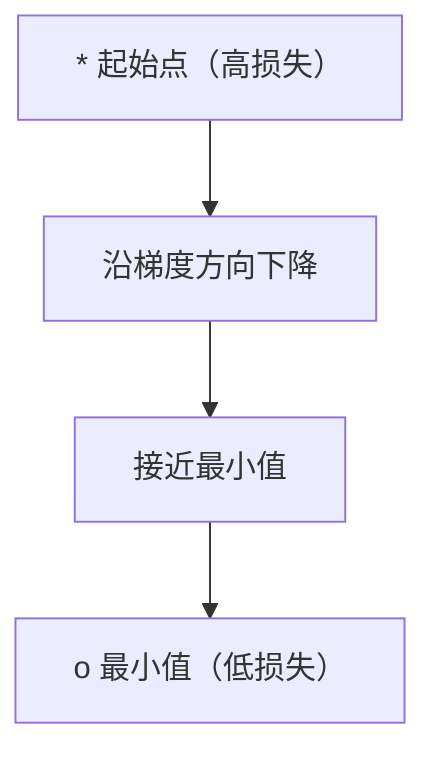
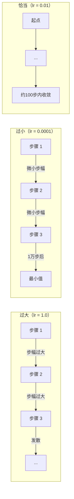
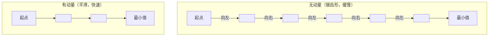
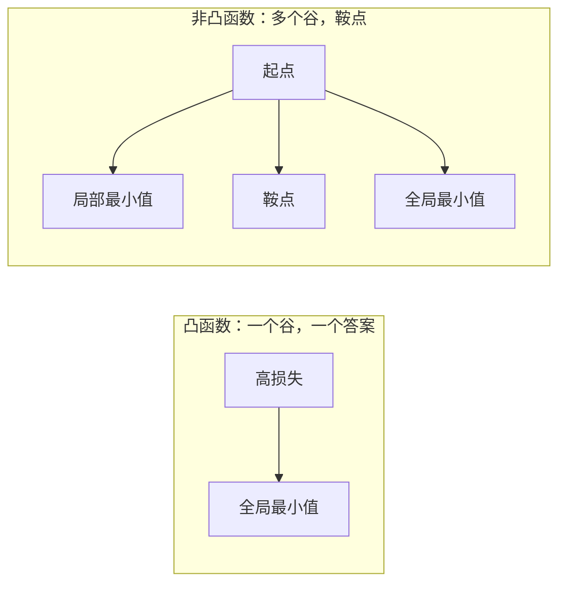
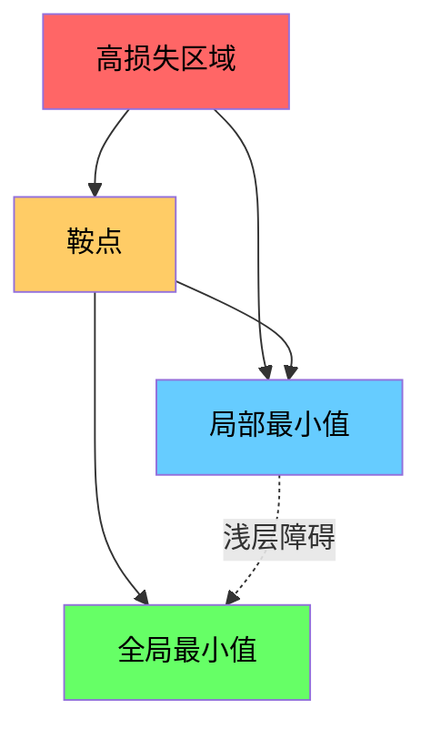

# 优化 (Optimization)

> 训练神经网络，不过是找到一个山谷的谷底。

**类型：** 构建
**语言：** Python
**前置知识：** 第一阶段，第04-05课（导数、梯度）
**时间：** ~75 分钟

## 学习目标

- 从头实现原始梯度下降（gradient descent）、带动量的随机梯度下降（SGD with momentum）和 Adam 优化器
- 在 Rosenbrock 函数上比较优化器收敛情况，解释为何 Adam 对每个权重自适应调整学习率
- 区分凸函数（convex）与非凸函数（non-convex）的损失曲面，解释鞍点（saddle point）在高维空间中的作用
- 配置学习率调度（步衰减、余弦退火、预热）以提升训练稳定性

## 问题所在

你有一个损失函数，它告诉你模型有多糟糕；你有梯度，它告诉你哪个方向会让损失变大。现在你需要一个向下走的策略。

最朴素的做法很简单：朝梯度的反方向移动，以某个称为学习率（learning rate）的数字来缩放步长，然后重复。这就是梯度下降，它有效。但"有效"是有条件的：学习率太大会直接越过谷底，在两侧来回弹跳；太小又会花费数千步才能抵达答案；一旦陷入鞍点，即使还没找到最小值也会停止移动。

深度学习中的每一个优化器，都是对同一个问题的回答：如何更快、更可靠地到达谷底？

## 概念讲解

### 优化的含义 (What Optimization Means)

优化（optimization）是找到使函数最小化（或最大化）的输入值。在机器学习中，函数是损失，输入是模型的权重，训练就是优化。

```
minimize L(w) where:
  L = loss function
  w = model weights (could be millions of parameters)
```

### 梯度下降（原始版）(Gradient Descent, Vanilla)

最简单的优化器。计算损失关于每个权重的梯度，每个权重沿梯度反方向移动，步长由学习率缩放。

```
w = w - lr * gradient
```

整个算法就是这一行。



### 学习率：最重要的超参数 (Learning Rate: The Most Important Hyperparameter)

学习率控制步长，决定了收敛的一切。



没有公式能给出正确的学习率，只能通过实验来找。常见起点：Adam 用 0.001，带动量的 SGD 用 0.01。

### SGD、批量与小批量 (SGD vs Batch vs Mini-Batch)

原始梯度下降在整个数据集上计算梯度后再迈出一步，称为批量梯度下降（batch gradient descent），稳定但慢。

随机梯度下降（SGD，stochastic gradient descent）在单个随机样本上计算梯度并立即更新，快但噪声大。

小批量梯度下降（mini-batch gradient descent）折中：在一小批样本（32、64、128、256）上计算梯度后更新，这是实际使用的方式。

| 变体 | 批量大小 | 梯度质量 | 每步速度 | 噪声 |
|---------|-----------|-----------------|---------------|-------|
| 批量梯度下降 | 整个数据集 | 精确 | 慢 | 无 |
| SGD | 1 个样本 | 噪声很大 | 快 | 高 |
| 小批量 | 32-256 | 良好估计 | 均衡 | 中等 |

SGD 和小批量中的噪声不是缺陷，它有助于逃出浅层局部最小值和鞍点。

### 动量：滚下山的球 (Momentum: The Ball Rolling Downhill)

原始梯度下降只看当前梯度。若梯度呈锯齿形（在窄谷中常见），进展缓慢。动量（momentum）通过将历史梯度积累为速度项来解决这一问题。

```
v = beta * v + gradient
w = w - lr * v
```

类比：一个滚下山的球，不会在每个颠簸处停下重新出发，而是在持续方向上积累速度，并衰减振荡。



`beta`（通常为 0.9）控制保留多少历史信息。beta 越大，动量越强，路径越平滑，但对方向变化的响应越慢。

### Adam：自适应学习率 (Adam: Adaptive Learning Rates)

不同的权重需要不同的学习率。一个很少获得大梯度的权重，偶尔出现大梯度时应该迈更大的步；一个持续获得大梯度的权重应该迈更小的步。

Adam（自适应矩估计，Adaptive Moment Estimation）对每个权重追踪两件事：

1. 一阶矩（m）：梯度的滑动平均（类似动量）
2. 二阶矩（v）：梯度平方的滑动平均（梯度量级）

```
m = beta1 * m + (1 - beta1) * gradient
v = beta2 * v + (1 - beta2) * gradient^2

m_hat = m / (1 - beta1^t)    bias correction
v_hat = v / (1 - beta2^t)    bias correction

w = w - lr * m_hat / (sqrt(v_hat) + epsilon)
```

除以 `sqrt(v_hat)` 是关键洞察：梯度大的权重除以一个大数（有效步长小），梯度小的权重除以一个小数（有效步长大），每个权重获得自己的自适应学习率。

默认超参数：`lr=0.001, beta1=0.9, beta2=0.999, epsilon=1e-8`。这些默认值对大多数问题效果良好。

### 学习率调度 (Learning Rate Schedules)

固定学习率是一种妥协。训练初期需要大步快速推进，训练后期需要小步在最小值附近微调。

常见调度方案：

| 调度方案 | 公式 | 使用场景 |
|----------|---------|----------|
| 步衰减（step decay） | 每 N 个 epoch 乘以衰减因子 | 简单，手动控制 |
| 指数衰减（exponential decay） | lr = lr_0 * decay^t | 平滑递减 |
| 余弦退火（cosine annealing） | lr = lr_min + 0.5 * (lr_max - lr_min) * (1 + cos(pi * t / T)) | Transformer、现代训练 |
| 预热 + 衰减（warmup + decay） | 先线性升温，再衰减 | 大模型，防止早期不稳定 |

### 凸函数与非凸函数 (Convex vs Non-Convex)

凸函数（convex function）只有一个最小值，梯度下降总能找到它。如 `f(x) = x^2` 是凸的。

神经网络的损失函数是非凸的（non-convex），有许多局部最小值、鞍点和平坦区域。



在实践中，高维神经网络中的局部最小值很少是问题——大多数局部最小值的损失值接近全局最小值。鞍点（在某些方向平坦，在另一些方向弯曲）才是真正的障碍，动量和小批量噪声有助于逃脱鞍点。

### 损失曲面可视化 (Loss Landscape Visualization)

损失是所有权重的函数。对于一个拥有 100 万个权重的模型，损失曲面（loss landscape）生活在 1,000,001 维空间中。我们通过在权重空间中选取两个随机方向并绘制沿这两个方向的损失，生成一个二维曲面来可视化它。



尖锐最小值（sharp minima）泛化能力差，平坦最小值（flat minima）泛化能力好。这也是带动量的 SGD 在最终测试精度上常优于 Adam 的原因之一：其噪声能防止陷入尖锐最小值。

## 动手实现

### 第一步：定义测试函数

Rosenbrock 函数是经典的优化基准测试，其最小值在 (1, 1) 处，位于一个狭窄弯曲的山谷内——容易找到但难以沿着走。

```
f(x, y) = (1 - x)^2 + 100 * (y - x^2)^2
```

```python
def rosenbrock(params):
    x, y = params
    return (1 - x) ** 2 + 100 * (y - x ** 2) ** 2

def rosenbrock_gradient(params):
    x, y = params
    df_dx = -2 * (1 - x) + 200 * (y - x ** 2) * (-2 * x)
    df_dy = 200 * (y - x ** 2)
    return [df_dx, df_dy]
```

### 第二步：原始梯度下降

```python
class GradientDescent:
    def __init__(self, lr=0.001):
        self.lr = lr

    def step(self, params, grads):
        return [p - self.lr * g for p, g in zip(params, grads)]
```

### 第三步：带动量的 SGD

```python
class SGDMomentum:
    def __init__(self, lr=0.001, momentum=0.9):
        self.lr = lr
        self.momentum = momentum
        self.velocity = None

    def step(self, params, grads):
        if self.velocity is None:
            self.velocity = [0.0] * len(params)
        self.velocity = [
            self.momentum * v + g
            for v, g in zip(self.velocity, grads)
        ]
        return [p - self.lr * v for p, v in zip(params, self.velocity)]
```

### 第四步：Adam

```python
class Adam:
    def __init__(self, lr=0.001, beta1=0.9, beta2=0.999, epsilon=1e-8):
        self.lr = lr
        self.beta1 = beta1
        self.beta2 = beta2
        self.epsilon = epsilon
        self.m = None
        self.v = None
        self.t = 0

    def step(self, params, grads):
        if self.m is None:
            self.m = [0.0] * len(params)
            self.v = [0.0] * len(params)

        self.t += 1

        self.m = [
            self.beta1 * m + (1 - self.beta1) * g
            for m, g in zip(self.m, grads)
        ]
        self.v = [
            self.beta2 * v + (1 - self.beta2) * g ** 2
            for v, g in zip(self.v, grads)
        ]

        m_hat = [m / (1 - self.beta1 ** self.t) for m in self.m]
        v_hat = [v / (1 - self.beta2 ** self.t) for v in self.v]

        return [
            p - self.lr * mh / (vh ** 0.5 + self.epsilon)
            for p, mh, vh in zip(params, m_hat, v_hat)
        ]
```

### 第五步：运行并比较

```python
def optimize(optimizer, func, grad_func, start, steps=5000):
    params = list(start)
    history = [params[:]]
    for _ in range(steps):
        grads = grad_func(params)
        params = optimizer.step(params, grads)
        history.append(params[:])
    return history

start = [-1.0, 1.0]

gd_history = optimize(GradientDescent(lr=0.0005), rosenbrock, rosenbrock_gradient, start)
sgd_history = optimize(SGDMomentum(lr=0.0001, momentum=0.9), rosenbrock, rosenbrock_gradient, start)
adam_history = optimize(Adam(lr=0.01), rosenbrock, rosenbrock_gradient, start)

for name, history in [("GD", gd_history), ("SGD+M", sgd_history), ("Adam", adam_history)]:
    final = history[-1]
    loss = rosenbrock(final)
    print(f"{name:6s} -> x={final[0]:.6f}, y={final[1]:.6f}, loss={loss:.8f}")
```

预期输出：Adam 收敛最快，带动量的 SGD 路径更平滑，原始梯度下降沿着窄谷缓慢前进。

## 实际使用

在实践中，使用 PyTorch 或 JAX 的优化器，它们处理参数组、权重衰减、梯度裁剪和 GPU 加速。

```python
import torch

model = torch.nn.Linear(784, 10)

sgd = torch.optim.SGD(model.parameters(), lr=0.01, momentum=0.9)
adam = torch.optim.Adam(model.parameters(), lr=0.001)
adamw = torch.optim.AdamW(model.parameters(), lr=0.001, weight_decay=0.01)

scheduler = torch.optim.lr_scheduler.CosineAnnealingLR(adam, T_max=100)
```

实用经验：

- 从 Adam（lr=0.001）开始，无需调参即可应对大多数问题。
- 需要最佳最终精度且能承担更多调参成本时，切换到带动量的 SGD（lr=0.01, momentum=0.9）。
- Transformer 使用 AdamW（带解耦权重衰减的 Adam）。
- 训练轮次超过几个 epoch 时，始终使用学习率调度。
- 训练不稳定时，降低学习率；训练太慢时，提高学习率。

## 交付成果

本课产出选择优化器的提示词，见 `outputs/prompt-optimizer-guide.md`。

此处构建的优化器类将在第三阶段从头训练神经网络时再次用到。

## 练习

1. **学习率扫描。** 用学习率 [0.0001, 0.0005, 0.001, 0.005, 0.01] 在 Rosenbrock 函数上运行原始梯度下降。打印或绘制每个学习率经过 5000 步后的最终损失。找出仍能收敛的最大学习率。

2. **动量对比。** 用动量值 [0.0, 0.5, 0.9, 0.99] 在 Rosenbrock 函数上运行 SGD，追踪每步损失。哪个动量值收敛最快？哪个过冲？

3. **鞍点逃脱。** 定义函数 `f(x, y) = x^2 - y^2`（原点处有鞍点），从 (0.01, 0.01) 出发。比较原始梯度下降、带动量的 SGD 和 Adam 的行为，哪个能逃脱鞍点？

4. **实现学习率衰减。** 向 GradientDescent 类添加指数衰减调度：`lr = lr_0 * 0.999^step`。在 Rosenbrock 函数上比较有无衰减时的收敛情况。

## 关键术语

| 术语 | 常见说法 | 实际含义 |
|------|----------------|----------------------|
| 梯度下降 (gradient descent) | "向下走" | 通过减去学习率缩放的梯度来更新权重，最基本的优化器 |
| 学习率 (learning rate) | "步长" | 控制每次更新移动权重距离的标量，过大导致发散，过小浪费计算 |
| 动量 (momentum) | "保持滚动" | 将历史梯度积累到速度向量中，衰减振荡并加速持续方向上的移动 |
| SGD（随机梯度下降）(SGD) | "随机采样" | 在随机子集而非完整数据集上计算梯度，实践中几乎总指小批量 SGD |
| 小批量 (mini-batch) | "一块数据" | 用于估计梯度的小型训练数据子集（32-256 个样本），平衡速度与梯度精度 |
| Adam | "默认优化器" | 自适应矩估计（Adaptive Moment Estimation），追踪每个权重梯度和梯度平方的滑动平均，为每个权重提供自适应学习率 |
| 偏差校正 (bias correction) | "修正冷启动" | Adam 的一阶矩和二阶矩初始化为零，偏差校正通过除以 (1 - beta^t) 来补偿早期步骤 |
| 学习率调度 (learning rate schedule) | "随时间改变学习率" | 训练过程中调整学习率的函数，早期大步，后期小步 |
| 凸函数 (convex function) | "一个山谷" | 任何局部最小值就是全局最小值的函数，梯度下降总能找到它，神经网络损失不是凸的 |
| 鞍点 (saddle point) | "平坦但非最小值" | 梯度为零，但在某些方向是最小值、在其他方向是最大值的点，高维空间中常见 |
| 损失曲面 (loss landscape) | "地形图" | 损失函数在权重空间上的图，通过沿两个随机方向切片来可视化 |
| 收敛 (convergence) | "到达目的地" | 优化器已到达进一步迭代不再明显减少损失的点 |

## 延伸阅读

- [Sebastian Ruder：梯度下降优化算法综述](https://ruder.io/optimizing-gradient-descent/) —— 所有主要优化器的全面综述
- [动量的真正原理（Distill）](https://distill.pub/2017/momentum/) —— 动量动力学的交互式可视化
- [Adam：随机优化方法（Kingma & Ba, 2014）](https://arxiv.org/abs/1412.6980) —— 原始 Adam 论文，易读且简短
- [神经网络损失曲面可视化（Li 等，2018）](https://arxiv.org/abs/1712.09913) —— 展示尖锐与平坦最小值的论文
