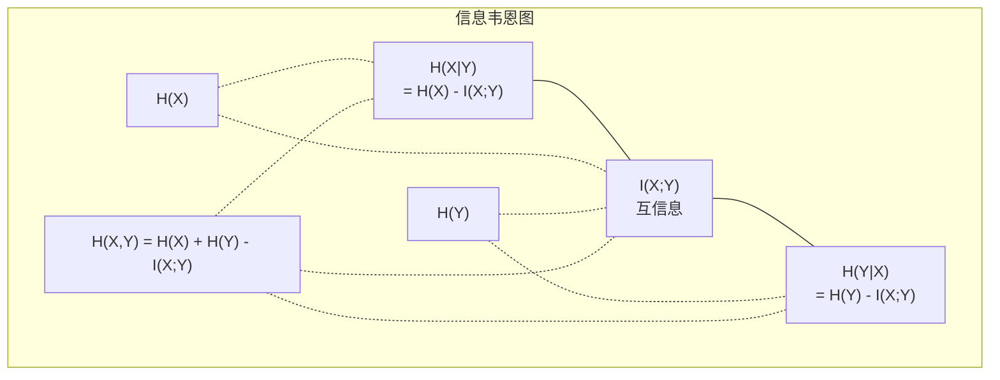

# 信息论（Information Theory）

> 信息论衡量惊奇度。损失函数正是建立在它之上的。

**类型：** 学习（Learn）
**语言：** Python
**前置条件：** 第一阶段，第06课（概率论）
**时间：** 约60分钟

## 学习目标

- 从零实现熵（entropy）、交叉熵（cross-entropy）和KL散度（KL divergence），并解释它们之间的关系
- 推导出最小化交叉熵损失等价于最大化对数似然的原理
- 计算特征与目标变量之间的互信息（mutual information），以对特征重要性进行排序
- 解释困惑度（perplexity）作为语言模型选择词汇的有效词表大小的含义

## 问题背景

你在每个分类模型中都会调用 `CrossEntropyLoss()`。你在每篇语言模型论文中都会看到"困惑度"。你在变分自编码器（VAE）、知识蒸馏（distillation）和RLHF中都会读到KL散度。这些并非孤立的概念——它们都是同一个思想披着不同的外衣。

信息论为你提供了推理不确定性、压缩和预测的语言。克劳德·香农（Claude Shannon）于1948年发明了它，用于解决通信问题。事实证明，训练神经网络也是一个通信问题：模型试图通过学习权重这条嘈杂的信道来传递正确的标签。

本课将从零推导每一个公式，让你看清它们的来源以及它们为何有效。

## 核心概念

### 信息量（Surprise，自信息）

当不太可能发生的事情发生时，它携带更多的信息。硬币正面朝上？不令人惊讶。彩票中奖？非常令人惊讶。

概率为 p 的事件的信息量为：

```
I(x) = -log(p(x))
```

以2为底的对数给出比特（bits）。以自然对数给出奈特（nats）。思路相同，单位不同。

```
Event              Probability    Surprise (bits)
Fair coin heads    0.5            1.0
Rolling a 6        0.167          2.58
1-in-1000 event    0.001          9.97
Certain event      1.0            0.0
```

确定发生的事件携带零信息。你早就知道它会发生。

### 熵（Entropy，平均惊奇度）

熵是分布所有可能结果的期望惊奇度。

```
H(P) = -sum( p(x) * log(p(x)) )  for all x
```

对于二元变量，公平硬币具有最大熵：1比特。有偏硬币（99%正面朝上）熵很低：0.08比特。你已经知道会发生什么，因此每次翻转几乎不告诉你任何新信息。

```
Fair coin:    H = -(0.5 * log2(0.5) + 0.5 * log2(0.5)) = 1.0 bit
Biased coin:  H = -(0.99 * log2(0.99) + 0.01 * log2(0.01)) = 0.08 bits
```

熵衡量分布中不可消除的不确定性。你无法将其压缩到熵以下。

### 交叉熵（Cross-Entropy，你每天使用的损失函数）

交叉熵衡量当你使用分布 Q 来编码实际来自分布 P 的事件时的平均惊奇度。

```
H(P, Q) = -sum( p(x) * log(q(x)) )  for all x
```

P 是真实分布（标签），Q 是模型的预测。如果 Q 完美匹配 P，交叉熵等于熵。任何不匹配都会使其增大。

在分类中，P 是独热向量（one-hot vector，真实类别概率为1，其余为0）。这将交叉熵简化为：

```
H(P, Q) = -log(q(true_class))
```

这就是分类交叉熵损失的完整公式。最大化正确类别的预测概率。

### KL散度（KL Divergence，分布间的距离）

KL散度衡量使用 Q 代替 P 所带来的额外惊奇度。

```
D_KL(P || Q) = sum( p(x) * log(p(x) / q(x)) )  for all x
             = H(P, Q) - H(P)
```

交叉熵等于熵加上KL散度。由于训练过程中真实分布的熵是常数，最小化交叉熵等价于最小化KL散度。你在将模型的分布推向真实分布。

KL散度不是对称的：D_KL(P || Q) != D_KL(Q || P)。它不是一个真正的距离度量。

### 互信息（Mutual Information）

互信息衡量知道一个变量能告诉你多少关于另一个变量的信息。

```
I(X; Y) = H(X) - H(X|Y)
        = H(X) + H(Y) - H(X, Y)
```

如果 X 和 Y 相互独立，互信息为零。知道一个并不能告诉你另一个的信息。如果它们完全相关，互信息等于任一变量的熵。

在特征选择中，特征与目标之间的高互信息意味着该特征有用。低互信息意味着它是噪声。

### 条件熵（Conditional Entropy）

H(Y|X) 衡量在观测到 X 之后，Y 中剩余的不确定性。

```
H(Y|X) = H(X,Y) - H(X)
```

两种极端情况：
- 如果 X 完全决定了 Y，则 H(Y|X) = 0。知道 X 消除了关于 Y 的所有不确定性。例如：X 是摄氏温度，Y 是华氏温度。
- 如果 X 对 Y 没有任何提示，则 H(Y|X) = H(Y)。知道 X 完全不减少你对 Y 的不确定性。例如：X 是抛硬币结果，Y 是明天的天气。

条件熵始终非负，且不超过 H(Y)：

```
0 <= H(Y|X) <= H(Y)
```

在机器学习中，条件熵出现在决策树（decision tree）中。在每次分裂时，算法选择能最小化 H(Y|X) 的特征 X——即能最大程度消除标签 Y 不确定性的特征。

### 联合熵（Joint Entropy）

H(X,Y) 是 X 和 Y 联合分布的熵。

```
H(X,Y) = -sum sum p(x,y) * log(p(x,y))   for all x, y
```

关键性质：

```
H(X,Y) <= H(X) + H(Y)
```

当 X 和 Y 相互独立时等号成立。如果它们共享信息，联合熵小于各自熵之和。"缺失"的熵恰好就是互信息。



各关系式：
- H(X,Y) = H(X) + H(Y|X) = H(Y) + H(X|Y)
- I(X;Y) = H(X) - H(X|Y) = H(Y) - H(Y|X)
- H(X,Y) = H(X) + H(Y) - I(X;Y)

### 互信息（深入探讨）

互信息 I(X;Y) 量化了知道一个变量能减少多少关于另一个变量的不确定性。

```
I(X;Y) = H(X) - H(X|Y)
       = H(Y) - H(Y|X)
       = H(X) + H(Y) - H(X,Y)
       = sum sum p(x,y) * log(p(x,y) / (p(x) * p(y)))
```

性质：
- I(X;Y) >= 0 始终成立。观测某事件永远不会损失信息。
- I(X;Y) = 0 当且仅当 X 和 Y 相互独立。
- I(X;Y) = I(Y;X)。它是对称的，与KL散度不同。
- I(X;X) = H(X)。变量与自身共享全部信息。

**互信息用于特征选择。** 在机器学习中，你希望特征对目标具有信息量。互信息为特征排序提供了一种有原则的方法：

1. 对每个特征 X_i，计算 I(X_i; Y)，其中 Y 是目标变量。
2. 按互信息得分对特征排序。
3. 保留前 k 个特征。

这适用于特征与目标之间的任何关系——线性的、非线性的、单调的或非单调的。相关系数只能捕捉线性关系，而互信息能捕捉所有关系。

| 方法 | 可检测的关系 | 计算代价 | 支持类别变量？ |
|--------|---------|-------------------|---------------------|
| 皮尔逊相关系数（Pearson correlation） | 线性关系 | O(n) | 否 |
| 斯皮尔曼相关系数（Spearman correlation） | 单调关系 | O(n log n) | 否 |
| 互信息（Mutual information） | 任意统计依赖关系 | O(n log n)（含分箱） | 是 |

### 标签平滑（Label Smoothing）与交叉熵

标准分类使用硬标签：[0, 0, 1, 0]。真实类别概率为1，其余为0。标签平滑用软标签替代：

```
soft_target = (1 - epsilon) * hard_target + epsilon / num_classes
```

当 epsilon = 0.1，类别数为4时：
- 硬标签：[0, 0, 1, 0]
- 软标签：[0.025, 0.025, 0.925, 0.025]

从信息论角度来看，标签平滑增加了目标分布的熵。独热硬标签的熵为0——没有不确定性。软标签具有正熵。

这样做的好处：
- 防止模型将对数几率（logits）推向极端值（完美匹配独热标签的交叉熵需要无穷大的对数几率）
- 作为正则化：模型不能100%自信
- 改善校准（calibration）：预测概率更好地反映真实不确定性
- 减小训练行为与推理行为之间的差距

带标签平滑的交叉熵损失变为：

```
L = (1 - epsilon) * CE(hard_target, prediction) + epsilon * H_uniform(prediction)
```

第二项惩罚偏离均匀分布的预测——是对置信度的直接正则化。

### 为什么交叉熵是分类任务的首选损失

三种视角，同一个结论。

**信息论视角。** 交叉熵衡量使用模型分布而非真实分布所浪费的比特数。最小化它使模型成为现实最高效的编码器。

**最大似然视角。** 对于 N 个训练样本，真实类别为 y_i：

```
Likelihood     = product( q(y_i) )
Log-likelihood = sum( log(q(y_i)) )
Negative log-likelihood = -sum( log(q(y_i)) )
```

最后一行就是交叉熵损失。最小化交叉熵 = 最大化训练数据在模型下的似然。

**梯度视角。** 交叉熵关于对数几率的梯度就是（预测值 - 真实值）。简洁、稳定，计算速度快。这就是它与 softmax 完美搭配的原因。

### 比特（Bits）与奈特（Nats）

唯一的区别是对数的底。

```
log base 2   -> bits      (information theory tradition)
log base e   -> nats      (machine learning convention)
log base 10  -> hartleys  (rarely used)
```

1奈特 = 1/ln(2) 比特 = 1.4427 比特。PyTorch 和 TensorFlow 默认使用自然对数（奈特）。

### 困惑度（Perplexity）

困惑度是交叉熵的指数。它告诉你模型在不确定时等效地从多少个等可能选项中进行选择。

```
Perplexity = 2^H(P,Q)   (if using bits)
Perplexity = e^H(P,Q)   (if using nats)
```

困惑度为50的语言模型，平均而言就像是在50个可能的下一个词元中均匀地随机选择。越低越好。

GPT-2 在常见基准测试上达到约30的困惑度。现代模型在表示充分的领域中已进入个位数。

## 动手实现

### 第一步：信息量与熵

```python
import math

def information_content(p, base=2):
    if p <= 0 or p > 1:
        return float('inf') if p <= 0 else 0.0
    return -math.log(p) / math.log(base)

def entropy(probs, base=2):
    return sum(
        p * information_content(p, base)
        for p in probs if p > 0
    )

fair_coin = [0.5, 0.5]
biased_coin = [0.99, 0.01]
fair_die = [1/6] * 6

print(f"Fair coin entropy:   {entropy(fair_coin):.4f} bits")
print(f"Biased coin entropy: {entropy(biased_coin):.4f} bits")
print(f"Fair die entropy:    {entropy(fair_die):.4f} bits")
```

### 第二步：交叉熵与KL散度

```python
def cross_entropy(p, q, base=2):
    total = 0.0
    for pi, qi in zip(p, q):
        if pi > 0:
            if qi <= 0:
                return float('inf')
            total += pi * (-math.log(qi) / math.log(base))
    return total

def kl_divergence(p, q, base=2):
    return cross_entropy(p, q, base) - entropy(p, base)

true_dist = [0.7, 0.2, 0.1]
good_model = [0.6, 0.25, 0.15]
bad_model = [0.1, 0.1, 0.8]

print(f"Entropy of true dist:     {entropy(true_dist):.4f} bits")
print(f"CE (good model):          {cross_entropy(true_dist, good_model):.4f} bits")
print(f"CE (bad model):           {cross_entropy(true_dist, bad_model):.4f} bits")
print(f"KL divergence (good):     {kl_divergence(true_dist, good_model):.4f} bits")
print(f"KL divergence (bad):      {kl_divergence(true_dist, bad_model):.4f} bits")
```

### 第三步：交叉熵作为分类损失

```python
def softmax(logits):
    max_logit = max(logits)
    exps = [math.exp(z - max_logit) for z in logits]
    total = sum(exps)
    return [e / total for e in exps]

def cross_entropy_loss(true_class, logits):
    probs = softmax(logits)
    return -math.log(probs[true_class])

logits = [2.0, 1.0, 0.1]
true_class = 0

probs = softmax(logits)
loss = cross_entropy_loss(true_class, logits)

print(f"Logits:      {logits}")
print(f"Softmax:     {[f'{p:.4f}' for p in probs]}")
print(f"True class:  {true_class}")
print(f"Loss:        {loss:.4f} nats")
print(f"Perplexity:  {math.exp(loss):.2f}")
```

### 第四步：交叉熵等价于负对数似然

```python
import random

random.seed(42)

n_samples = 1000
n_classes = 3
true_labels = [random.randint(0, n_classes - 1) for _ in range(n_samples)]
model_logits = [[random.gauss(0, 1) for _ in range(n_classes)] for _ in range(n_samples)]

ce_loss = sum(
    cross_entropy_loss(label, logits)
    for label, logits in zip(true_labels, model_logits)
) / n_samples

nll = -sum(
    math.log(softmax(logits)[label])
    for label, logits in zip(true_labels, model_logits)
) / n_samples

print(f"Cross-entropy loss:      {ce_loss:.6f}")
print(f"Negative log-likelihood: {nll:.6f}")
print(f"Difference:              {abs(ce_loss - nll):.2e}")
```

### 第五步：互信息

```python
def mutual_information(joint_probs, base=2):
    rows = len(joint_probs)
    cols = len(joint_probs[0])

    margin_x = [sum(joint_probs[i][j] for j in range(cols)) for i in range(rows)]
    margin_y = [sum(joint_probs[i][j] for i in range(rows)) for j in range(cols)]

    mi = 0.0
    for i in range(rows):
        for j in range(cols):
            pxy = joint_probs[i][j]
            if pxy > 0:
                mi += pxy * math.log(pxy / (margin_x[i] * margin_y[j])) / math.log(base)
    return mi

independent = [[0.25, 0.25], [0.25, 0.25]]
dependent = [[0.45, 0.05], [0.05, 0.45]]

print(f"MI (independent): {mutual_information(independent):.4f} bits")
print(f"MI (dependent):   {mutual_information(dependent):.4f} bits")
```

## 实践应用

使用NumPy的相同概念——这是你在实践中使用的方式：

```python
import numpy as np

def np_entropy(p):
    p = np.asarray(p, dtype=float)
    mask = p > 0
    result = np.zeros_like(p)
    result[mask] = p[mask] * np.log(p[mask])
    return -result.sum()

def np_cross_entropy(p, q):
    p, q = np.asarray(p, dtype=float), np.asarray(q, dtype=float)
    mask = p > 0
    return -(p[mask] * np.log(q[mask])).sum()

def np_kl_divergence(p, q):
    return np_cross_entropy(p, q) - np_entropy(p)

true = np.array([0.7, 0.2, 0.1])
pred = np.array([0.6, 0.25, 0.15])
print(f"Entropy:    {np_entropy(true):.4f} nats")
print(f"Cross-ent:  {np_cross_entropy(true, pred):.4f} nats")
print(f"KL div:     {np_kl_divergence(true, pred):.4f} nats")
```

你从零构建了 `torch.nn.CrossEntropyLoss()` 内部的原理。现在你明白了为什么训练期间损失会下降：模型的预测分布正在逼近真实分布，以奈特为单位衡量浪费的信息量。

## 练习题

1. 假设英文字母均匀分布（26个字母），计算其熵。再使用实际字母频率估算熵。哪个更高？为什么？

2. 模型对某样本输出对数几率 [5.0, 2.0, 0.5]，真实类别为1。手动计算交叉熵损失，再用你的 `cross_entropy_loss` 函数验证。什么样的对数几率会得到零损失？

3. 证明KL散度不是对称的。选取两个分布 P 和 Q，分别计算 D_KL(P || Q) 和 D_KL(Q || P)，并解释为何它们不同。

4. 构建一个计算词元预测序列困惑度的函数。给定一组（真实词元索引, 预测对数几率）对，返回该序列的困惑度。

## 关键术语

| 术语 | 常见说法 | 实际含义 |
|------|----------------|----------------------|
| 信息量（Information content） | "惊奇度" | 编码一个事件所需的比特数（或奈特数）：-log(p) |
| 熵（Entropy） | "随机性" | 分布所有结果的平均惊奇度。衡量不可消除的不确定性。 |
| 交叉熵（Cross-entropy） | "损失函数" | 使用模型分布 Q 编码来自真实分布 P 的事件时的平均惊奇度。 |
| KL散度（KL divergence） | "分布间的距离" | 使用 Q 代替 P 所浪费的额外比特数。等于交叉熵减去熵。不对称。 |
| 互信息（Mutual information） | "X和Y有多相关" | 知道 Y 后对 X 不确定性的减少量。零表示相互独立。 |
| Softmax | "将对数几率转为概率" | 取指数并归一化。将任意实值向量映射为有效的概率分布。 |
| 困惑度（Perplexity） | "模型有多困惑" | 交叉熵的指数。模型在每一步从中选择的有效词表大小。 |
| 比特（Bits） | "香农的单位" | 以2为底的对数度量的信息量。1比特解决一次公平硬币翻转。 |
| 奈特（Nats） | "机器学习的单位" | 以自然对数度量的信息量。PyTorch和TensorFlow默认使用。 |
| 负对数似然（Negative log-likelihood） | "NLL损失" | 对独热标签而言与交叉熵损失等价。最小化它等价于最大化正确预测的概率。 |

## 延伸阅读

- [Shannon 1948: A Mathematical Theory of Communication](https://people.math.harvard.edu/~ctm/home/text/others/shannon/entropy/entropy.pdf) - 原始论文，至今仍可读
- [Visual Information Theory (Chris Olah)](https://colah.github.io/posts/2015-09-Visual-Information/) - 关于熵和KL散度的最佳视觉化解释
- [PyTorch CrossEntropyLoss docs](https://pytorch.org/docs/stable/generated/torch.nn.CrossEntropyLoss.html) - 框架如何实现你刚刚构建的内容
