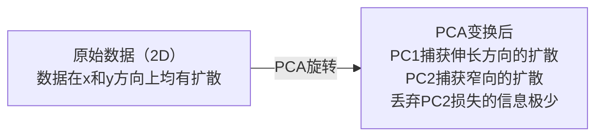

# 降维（Dimensionality Reduction）

> 高维数据具有结构。从正确的角度观察，你就能发现它。

**类型：** 构建（Build）
**语言：** Python
**前置条件：** 第一阶段，第01课（线性代数直觉）、第02课（向量、矩阵与运算）、第03课（特征值与特征向量）、第06课（概率与分布）
**时间：** 约90分钟

## 学习目标

- 从零实现主成分分析（PCA）：中心化数据、计算协方差矩阵、特征分解并投影
- 使用解释方差比（explained variance ratio）和肘部法则（elbow method）选择主成分数量
- 比较PCA、t-SNE和UMAP在2D可视化MNIST数字时的效果，并解释各自的权衡
- 应用核PCA（kernel PCA）与RBF核来分离标准PCA无法处理的非线性数据结构

## 问题背景

你有一个每个样本784个特征的数据集。也许是手写数字的像素值。也许是基因表达水平。也许是用户行为信号。你无法可视化784个维度。你无法绘制它们。你甚至无法思考它们。

但那784个特征中的大多数是冗余的。真正的信息存在于一个小得多的曲面上。手写的"7"不需要784个独立的数字来描述它。它只需要几个：笔画的角度、横线的长度、倾斜程度。其余都是噪声。

降维可以找到那个更小的曲面。它将你的784维数据压缩到2、10或50维，同时保留重要的结构。

## 核心概念

### 维度灾难（Curse of Dimensionality）

高维空间是反直觉的。随着维度增长，三件事会出问题。

**距离变得无意义。** 在高维空间中，任意两个随机点之间的距离会趋于相同的值。如果每个点与其他点的距离大致相同，最近邻搜索就会失效。

```
Dimension    Avg distance ratio (max/min between random points)
2            ~5.0
10           ~1.8
100          ~1.2
1000         ~1.02
```

**体积集中在角落。** d维单位超立方体有 2^d 个角落。在100维中，几乎所有的体积都在角落，远离中心。数据点向边缘扩散，模型在内部区域陷入数据稀缺。

**需要指数级更多的数据。** 为了在空间中维持相同的样本密度，从2D到20D意味着你需要多出 10^18 倍的数据。你永远不会有足够的数据。降维将数据密度恢复到可操作的水平。

### 主成分分析（PCA）：找到重要的方向

主成分分析（Principal Component Analysis，PCA）找到数据变化最大的轴。它旋转坐标系，使第一个轴捕获最大方差，第二个轴捕获次大方差，以此类推。

算法步骤：

```
1. Center the data        (subtract the mean from each feature)
2. Compute covariance     (how features move together)
3. Eigendecomposition     (find the principal directions)
4. Sort by eigenvalue     (biggest variance first)
5. Project               (keep top k eigenvectors, drop the rest)
```

为什么要做特征分解？协方差矩阵是对称半正定的。其特征向量是特征空间中的正交方向。特征值告诉你每个方向捕获了多少方差。具有最大特征值的特征向量指向最大方差的方向。



- **PCA之前：** 数据云斜向分布在x轴和y轴上
- **PCA之后：** 坐标系旋转，PC1与最大方差方向（伸长方向）对齐，PC2与最小方差方向（窄向）对齐
- **降维：** 去掉PC2将数据投影到PC1上，损失的信息极少

### 解释方差比（Explained Variance Ratio）

每个主成分捕获总方差的一部分。解释方差比告诉你具体比例。

```
Component    Eigenvalue    Explained ratio    Cumulative
PC1          4.73          0.473              0.473
PC2          2.51          0.251              0.724
PC3          1.12          0.112              0.836
PC4          0.89          0.089              0.925
...
```

当累计解释方差达到0.95时，你知道这些主成分捕获了95%的信息。之后的成分基本上是噪声。

### 选择主成分数量

三种策略：

1. **阈值法。** 保留足够多的成分以解释90-95%的方差。
2. **肘部法则（Elbow method）。** 绘制每个成分的解释方差。寻找急剧下降的位置。
3. **下游性能法。** 将PCA作为预处理步骤，扫描 k 值并测量模型精度。精度趋于平稳的地方就是最佳 k。

### t-SNE：保留邻域关系

t分布随机邻域嵌入（t-Distributed Stochastic Neighbor Embedding，t-SNE）专为可视化设计。它将高维数据映射到2D（或3D），同时保留哪些点彼此邻近的关系。

直觉：在原始空间中，根据点对之间的距离计算概率分布。相近的点概率高，遥远的点概率低。然后找到一种2D排列，使相同的概率分布成立。784维空间中的邻居在2D中仍然是邻居。

t-SNE的关键特性：
- 非线性。它可以展开PCA无法处理的复杂流形（manifold）。
- 随机性。不同运行产生不同的布局。
- 困惑度（Perplexity）参数控制考虑的邻居数量（典型范围：5-50）。
- 输出中簇之间的距离没有意义。只有簇本身才有意义。
- 在大型数据集上速度慢。默认为 O(n^2)。

### UMAP：更快，更好地保留全局结构

均匀流形近似与投影（Uniform Manifold Approximation and Projection，UMAP）与t-SNE工作原理类似，但有两个优势：
- 更快。它使用近似最近邻图，而不是计算所有点对距离。
- 更好的全局结构。输出中簇的相对位置往往比t-SNE更有意义。

UMAP在高维空间中构建加权图（"模糊拓扑表示"），然后找到尽可能保留该图的低维布局。

关键参数：
- `n_neighbors`：定义局部结构的邻居数量（类似于困惑度）。较高的值保留更多全局结构。
- `min_dist`：输出中点的聚集程度。较低的值产生更密集的簇。

### 何时使用哪种方法

| 方法 | 使用场景 | 保留特性 | 速度 |
|--------|----------|-----------|-------|
| PCA | 训练前的预处理 | 全局方差 | 快（精确），支持百万级样本 |
| PCA | 快速探索性可视化 | 线性结构 | 快 |
| t-SNE | 发表质量的2D图 | 局部邻域 | 慢（理想情况 &lt; 1万样本） |
| UMAP | 大规模2D可视化 | 局部+部分全局结构 | 中等（支持百万级） |
| PCA | 模型的特征降维 | 方差排序的特征 | 快 |
| t-SNE / UMAP | 理解聚类结构 | 簇的分离 | 中等到慢 |

经验法则：用PCA进行预处理和数据压缩；需要2D可视化结构时使用t-SNE或UMAP。

### 核PCA（Kernel PCA）

标准PCA寻找线性子空间。它旋转坐标系并丢弃轴。但如果数据位于非线性流形上怎么办？2D中的圆不能被任何直线分隔。标准PCA无能为力。

核PCA在由核函数诱导的高维特征空间中应用PCA，而无需显式计算该空间中的坐标。这就是核技巧（kernel trick）——与支持向量机（SVM）相同的思想。

算法：
1. 计算核矩阵 K，其中 K_ij = k(x_i, x_j)
2. 在特征空间中对核矩阵进行中心化
3. 对中心化核矩阵进行特征分解
4. 前几个特征向量（乘以 1/sqrt(特征值)）就是投影结果

常见核函数：

| 核 | 公式 | 适用场景 |
|--------|---------|----------|
| RBF（高斯核） | exp(-gamma * \|\|x - y\|\|^2) | 大多数非线性数据、平滑流形 |
| 多项式核（Polynomial） | (x · y + c)^d | 多项式关系 |
| Sigmoid核 | tanh(alpha * x · y + c) | 类神经网络的映射 |

核PCA与标准PCA的使用场景对比：

| 标准 | 标准PCA | 核PCA |
|-----------|-------------|------------|
| 数据结构 | 线性子空间 | 非线性流形 |
| 速度 | O(min(n^2 d, d^2 n)) | O(n^2 d + n^3) |
| 可解释性 | 成分是特征的线性组合 | 成分缺乏直接的特征解释 |
| 可扩展性 | 支持百万级样本 | 核矩阵为 n×n，受内存限制 |
| 重建 | 支持直接逆变换 | 需要预图像近似 |

经典示例：2D中的同心圆。两个点环，一个在另一个内部。标准PCA将两者投影到同一条线上——对分类毫无用处。RBF核的核PCA将内圆和外圆映射到不同区域，使它们线性可分。

### 重建误差（Reconstruction Error）

你的降维效果如何？你将784维压缩到了50维。损失了什么？

测量重建误差：
1. 将数据投影到 k 维：X_reduced = X @ W_k
2. 重建：X_hat = X_reduced @ W_k^T
3. 计算均方误差（MSE）：mean((X - X_hat)^2)

对于PCA，重建误差与解释方差有简洁的关系：

```
Reconstruction error = sum of eigenvalues NOT included
Total variance = sum of ALL eigenvalues
Fraction lost = (sum of dropped eigenvalues) / (sum of all eigenvalues)
```

每个成分的解释方差比为：

```
explained_ratio_k = eigenvalue_k / sum(all eigenvalues)
```

绘制累计解释方差与成分数量的关系图，得到"肘部"曲线。合适的成分数量在以下位置：
- 曲线趋于平缓（边际收益递减）
- 累计方差超过你的阈值（通常为0.90或0.95）
- 下游任务性能趋于平稳

重建误差不仅用于选择 k，还可用于异常检测：重建误差高的样本是不符合已学子空间的离群点。这是生产系统中基于PCA的异常检测的基础。

## 动手实现

### 第一步：从零实现PCA

```python
import numpy as np

class PCA:
    def __init__(self, n_components):
        self.n_components = n_components
        self.components = None
        self.mean = None
        self.eigenvalues = None
        self.explained_variance_ratio_ = None

    def fit(self, X):
        self.mean = np.mean(X, axis=0)
        X_centered = X - self.mean

        cov_matrix = np.cov(X_centered, rowvar=False)

        eigenvalues, eigenvectors = np.linalg.eigh(cov_matrix)

        sorted_idx = np.argsort(eigenvalues)[::-1]
        eigenvalues = eigenvalues[sorted_idx]
        eigenvectors = eigenvectors[:, sorted_idx]

        self.components = eigenvectors[:, :self.n_components].T
        self.eigenvalues = eigenvalues[:self.n_components]
        total_var = np.sum(eigenvalues)
        self.explained_variance_ratio_ = self.eigenvalues / total_var

        return self

    def transform(self, X):
        X_centered = X - self.mean
        return X_centered @ self.components.T

    def fit_transform(self, X):
        self.fit(X)
        return self.transform(X)
```

### 第二步：在合成数据上测试

```python
np.random.seed(42)
n_samples = 500

t = np.random.uniform(0, 2 * np.pi, n_samples)
x1 = 3 * np.cos(t) + np.random.normal(0, 0.2, n_samples)
x2 = 3 * np.sin(t) + np.random.normal(0, 0.2, n_samples)
x3 = 0.5 * x1 + 0.3 * x2 + np.random.normal(0, 0.1, n_samples)

X_synthetic = np.column_stack([x1, x2, x3])

pca = PCA(n_components=2)
X_reduced = pca.fit_transform(X_synthetic)

print(f"Original shape: {X_synthetic.shape}")
print(f"Reduced shape:  {X_reduced.shape}")
print(f"Explained variance ratios: {pca.explained_variance_ratio_}")
print(f"Total variance captured: {sum(pca.explained_variance_ratio_):.4f}")
```

### 第三步：MNIST数字的2D可视化

```python
from sklearn.datasets import fetch_openml

mnist = fetch_openml("mnist_784", version=1, as_frame=False, parser="auto")
X_mnist = mnist.data[:5000].astype(float)
y_mnist = mnist.target[:5000].astype(int)

pca_mnist = PCA(n_components=50)
X_pca50 = pca_mnist.fit_transform(X_mnist)
print(f"50 components capture {sum(pca_mnist.explained_variance_ratio_):.2%} of variance")

pca_2d = PCA(n_components=2)
X_pca2d = pca_2d.fit_transform(X_mnist)
print(f"2 components capture {sum(pca_2d.explained_variance_ratio_):.2%} of variance")
```

### 第四步：与sklearn对比

```python
from sklearn.decomposition import PCA as SklearnPCA
from sklearn.manifold import TSNE

sklearn_pca = SklearnPCA(n_components=2)
X_sklearn_pca = sklearn_pca.fit_transform(X_mnist)

print(f"\nOur PCA explained variance:     {pca_2d.explained_variance_ratio_}")
print(f"Sklearn PCA explained variance: {sklearn_pca.explained_variance_ratio_}")

diff = np.abs(np.abs(X_pca2d) - np.abs(X_sklearn_pca))
print(f"Max absolute difference: {diff.max():.10f}")

tsne = TSNE(n_components=2, perplexity=30, random_state=42)
X_tsne = tsne.fit_transform(X_mnist)
print(f"\nt-SNE output shape: {X_tsne.shape}")
```

### 第五步：UMAP对比

```python
try:
    from umap import UMAP

    reducer = UMAP(n_components=2, n_neighbors=15, min_dist=0.1, random_state=42)
    X_umap = reducer.fit_transform(X_mnist)
    print(f"UMAP output shape: {X_umap.shape}")
except ImportError:
    print("Install umap-learn: pip install umap-learn")
```

## 实践应用

将PCA作为分类器的预处理步骤：

```python
from sklearn.decomposition import PCA as SklearnPCA
from sklearn.linear_model import LogisticRegression
from sklearn.model_selection import train_test_split
from sklearn.metrics import accuracy_score

X_train, X_test, y_train, y_test = train_test_split(
    X_mnist, y_mnist, test_size=0.2, random_state=42
)

results = {}
for k in [10, 30, 50, 100, 200]:
    pca_k = SklearnPCA(n_components=k)
    X_tr = pca_k.fit_transform(X_train)
    X_te = pca_k.transform(X_test)

    clf = LogisticRegression(max_iter=1000, random_state=42)
    clf.fit(X_tr, y_train)
    acc = accuracy_score(y_test, clf.predict(X_te))
    var_captured = sum(pca_k.explained_variance_ratio_)
    results[k] = (acc, var_captured)
    print(f"k={k:>3d}  accuracy={acc:.4f}  variance={var_captured:.4f}")
```

性能在远低于784维时就趋于平稳。那个平稳点就是你的工作点。

## 输出产物

本课产出：
- `outputs/skill-dimensionality-reduction.md` - 为给定任务选择合适降维技术的技能文档

## 练习题

1. 修改PCA类以支持 `inverse_transform`。分别用10、50和200个主成分重建MNIST数字。打印每种情况的重建误差（与原始数据的均方差）。

2. 用困惑度值5、30和100对同一MNIST子集运行t-SNE。描述输出如何变化。为什么困惑度会影响簇的紧密程度？

3. 选取一个只有5个有信息特征的50特征数据集（用 `sklearn.datasets.make_classification` 生成）。应用PCA，检验解释方差曲线是否正确识别出数据实际上是5维的。

## 关键术语

| 术语 | 常见说法 | 实际含义 |
|------|----------------|----------------------|
| 维度灾难（Curse of dimensionality） | "特征太多" | 随着维度增长，距离、体积和数据密度都会表现出反直觉的特性。模型需要指数级更多的数据来弥补。 |
| 主成分分析（PCA） | "降维" | 旋转坐标系使轴与最大方差方向对齐，然后丢弃低方差轴。 |
| 主成分（Principal component） | "一个重要的方向" | 协方差矩阵的特征向量。特征空间中数据变化最大的方向。 |
| 解释方差比（Explained variance ratio） | "这个成分有多少信息" | 一个主成分捕获的总方差比例。将前 k 个比例相加，可以看出 k 个成分保留了多少信息。 |
| 协方差矩阵（Covariance matrix） | "特征如何相关" | 对称矩阵，(i,j) 位置的元素衡量特征 i 和特征 j 的共同变化程度。对角线元素是各特征的方差。 |
| t-SNE | "那个聚类图" | 通过保留点对邻域概率将高维数据映射到2D的非线性方法。适合可视化，不适合预处理。 |
| UMAP | "更快的t-SNE" | 基于拓扑数据分析的非线性方法。同时保留局部和部分全局结构。比t-SNE扩展性更好。 |
| 困惑度（Perplexity） | "t-SNE的一个旋钮" | 控制每个点考虑的有效邻居数量。低困惑度聚焦于非常局部的结构；高困惑度捕捉更广泛的模式。 |
| 流形（Manifold） | "数据所在的曲面" | 嵌入在高维空间中的低维曲面。在3D中揉皱的一张纸是一个2D流形。 |

## 延伸阅读

- [A Tutorial on Principal Component Analysis](https://arxiv.org/abs/1404.1100)（Shlens）- 从基础推导PCA的清晰教程
- [How to Use t-SNE Effectively](https://distill.pub/2016/misread-tsne/)（Wattenberg等）- t-SNE陷阱与参数选择的交互式指南
- [UMAP documentation](https://umap-learn.readthedocs.io/) - UMAP作者的理论与实践指南
