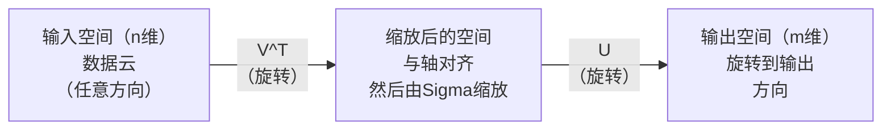
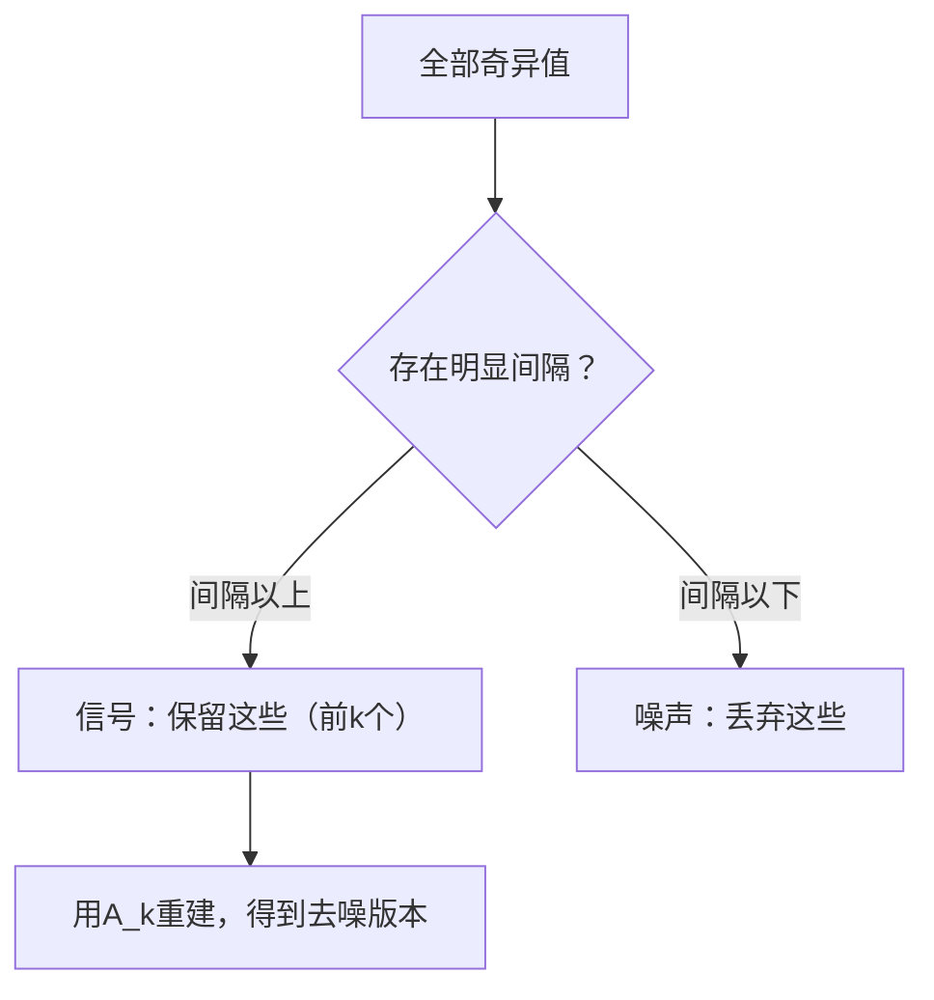

# 奇异值分解（Singular Value Decomposition）

> SVD是线性代数的瑞士军刀。每个矩阵都有一个。每位数据科学家都需要掌握。

**类型：** 构建（Build）
**语言：** Python、Julia
**前置条件：** 第一阶段，第01课（线性代数直觉）、第02课（向量与矩阵运算）、第03课（矩阵变换）
**时间：** 约120分钟

## 学习目标

- 通过幂迭代（power iteration）实现SVD，并解释 U、Σ 和 V^T 的几何含义
- 应用截断SVD（truncated SVD）进行图像压缩，并测量压缩比与重建误差
- 通过SVD计算摩尔-彭若斯伪逆（Moore-Penrose pseudoinverse），求解超定最小二乘系统
- 将SVD与主成分分析（PCA）、推荐系统（潜在因子）以及自然语言处理中的潜在语义分析（LSA）相联系

## 问题背景

你有一个1000×2000的矩阵。也许是用户-电影评分矩阵，也许是文档-词频表，也许是图像的像素值。你需要压缩它、去噪它、在其中找出隐藏的结构，或用它求解最小二乘系统。特征分解（eigendecomposition）只适用于方阵，即便如此，也需要矩阵具有完整的线性无关特征向量集。

SVD适用于任何矩阵。任意形状，任意秩，无任何条件。它将矩阵分解为三个因子，揭示矩阵对空间所做操作的几何本质。它是所有线性代数中最通用、最有用的分解。

## 核心概念

### SVD的几何意义

每个矩阵，无论形状如何，都按顺序执行三个操作：旋转、缩放、旋转。SVD使这种分解显式化。

```
A = U * Sigma * V^T

      m x n     m x m    m x n    n x n
     (any)    (rotate)  (scale)  (rotate)
```

对任意矩阵 A，SVD将其分解为：
- V^T 旋转输入空间（n维）中的向量
- Sigma 沿每条轴缩放（拉伸或压缩）
- U 将结果旋转到输出空间（m维）



这样理解：你把矩阵交给SVD，它告诉你："这个矩阵先用 V^T 旋转输入球体，再用 Sigma 将其拉伸为椭球体，然后用 U 旋转椭球体。"奇异值就是椭球体各轴的长度。

### 完整分解

对于形状为 m×n 的矩阵 A：

```
A = U * Sigma * V^T

where:
  U     is m x m, orthogonal (U^T U = I)
  Sigma is m x n, diagonal (singular values on the diagonal)
  V     is n x n, orthogonal (V^T V = I)

The singular values sigma_1 >= sigma_2 >= ... >= sigma_r > 0
where r = rank(A)
```

U 的列称为左奇异向量（left singular vectors），V 的列称为右奇异向量（right singular vectors），Sigma 的对角元素称为奇异值（singular values）。奇异值始终非负，按惯例降序排列。

### 左奇异向量、奇异值、右奇异向量

SVD的每个组成部分都有独特的几何含义。

**右奇异向量（V的列）：** 它们构成输入空间（R^n）的标准正交基。它们是输入空间中被矩阵映射到输出空间正交方向的方向。将其视为域的自然坐标系。

**奇异值（Sigma的对角元素）：** 这些是缩放因子。第 i 个奇异值告诉你矩阵沿第 i 个右奇异向量拉伸向量的程度。奇异值为零意味着矩阵完全压缩了该方向。

**左奇异向量（U的列）：** 它们构成输出空间（R^m）的标准正交基。第 i 个左奇异向量是第 i 个右奇异向量（经过缩放后）在输出空间中落点的方向。

它们之间的关系：

```
A * v_i = sigma_i * u_i

The matrix A takes the i-th right singular vector v_i,
scales it by sigma_i, and maps it to the i-th left singular vector u_i.
```

这为你提供了任意矩阵操作的逐坐标图像。

### 外积形式

SVD可以写成秩-1矩阵的求和：

```
A = sigma_1 * u_1 * v_1^T + sigma_2 * u_2 * v_2^T + ... + sigma_r * u_r * v_r^T

Each term sigma_i * u_i * v_i^T is a rank-1 matrix (an outer product).
The full matrix is the sum of r such matrices, where r is the rank.
```

这种形式是低秩近似的基础。每一项都增加一层结构。第一项捕获单一最重要的模式，第二项捕获次重要的模式，依此类推。截断这个求和就给你在任意给定秩下的最佳近似。

```
Rank-1 approx:    A_1 = sigma_1 * u_1 * v_1^T
                  (captures the dominant pattern)

Rank-2 approx:    A_2 = sigma_1 * u_1 * v_1^T + sigma_2 * u_2 * v_2^T
                  (captures the two most important patterns)

Rank-k approx:    A_k = sum of top k terms
                  (optimal by the Eckart-Young theorem)
```

### 与特征分解的关系

SVD与特征分解有深刻联系。A的奇异值和奇异向量直接来自于 A^T A 和 A A^T 的特征值和特征向量。

```
A^T A = V * Sigma^T * U^T * U * Sigma * V^T
      = V * Sigma^T * Sigma * V^T
      = V * D * V^T

where D = Sigma^T * Sigma is a diagonal matrix with sigma_i^2 on the diagonal.

So:
- The right singular vectors (V) are eigenvectors of A^T A
- The singular values squared (sigma_i^2) are eigenvalues of A^T A

Similarly:
A A^T = U * Sigma * V^T * V * Sigma^T * U^T
      = U * Sigma * Sigma^T * U^T

So:
- The left singular vectors (U) are eigenvectors of A A^T
- The eigenvalues of A A^T are also sigma_i^2
```

这种联系告诉你三件事：
1. 奇异值始终是实数且非负的（它们是半正定矩阵特征值的平方根）。
2. 你可以通过 A^T A 的特征分解来计算SVD，但这会使条件数（condition number）平方，从而降低数值精度。专用SVD算法可以避免这一问题。
3. 当 A 是方对称半正定矩阵时，SVD与特征分解是同一回事。

### 截断SVD：低秩近似

Eckart-Young-Mirsky定理指出，A 的最佳秩-k近似（在Frobenius范数和谱范数两者下）通过仅保留前 k 个奇异值及其对应向量得到：

```
A_k = U_k * Sigma_k * V_k^T

where:
  U_k     is m x k  (first k columns of U)
  Sigma_k is k x k  (top-left k x k block of Sigma)
  V_k     is n x k  (first k columns of V)

Approximation error = sigma_{k+1}  (in spectral norm)
                    = sqrt(sigma_{k+1}^2 + ... + sigma_r^2)  (in Frobenius norm)
```

这不仅仅是"一个好的"近似。它是秩-k范围内可证明最优的近似。没有其他秩-k矩阵比它更接近 A。

| 分量 | 相对大小 | 是否保留在秩-3近似中？ |
|-----------|-------------------|------------------------|
| sigma_1 | 最大 | 是 |
| sigma_2 | 大 | 是 |
| sigma_3 | 中等偏大 | 是 |
| sigma_4 | 中等 | 否（误差项） |
| sigma_5 | 中等偏小 | 否（误差项） |
| sigma_6 | 小 | 否（误差项） |
| sigma_7 | 很小 | 否（误差项） |
| sigma_8 | 极小 | 否（误差项） |

保留前3个：A_3 捕获三个最大的奇异值。误差 = 剩余值（sigma_4 到 sigma_8）。

如果奇异值衰减很快，小 k 就能捕获矩阵的大部分信息。如果衰减缓慢，矩阵没有低秩结构。

### 用SVD进行图像压缩

灰度图像是像素强度的矩阵。一张800×600的图像有480,000个值。SVD让你用少得多的数据近似它。

```
Original image: 800 x 600 = 480,000 values

SVD with rank k:
  U_k:      800 x k values
  Sigma_k:  k values
  V_k:      600 x k values
  Total:    k * (800 + 600 + 1) = k * 1401 values

  k=10:   14,010 values   (2.9% of original)
  k=50:   70,050 values  (14.6% of original)
  k=100: 140,100 values  (29.2% of original)

  The compression ratio improves as k gets smaller,
  but visual quality degrades.
```

关键洞察：自然图像的奇异值衰减很快。前几个奇异值捕获大致结构（形状、梯度）。后面的捕获细节和噪声。在秩50处截断通常产生与原图几乎无法区分的图像，同时节省85%的存储空间。

### SVD在推荐系统中的应用

Netflix大奖赛使这一方法广为人知。你有一个用户-电影评分矩阵，其中大多数条目缺失。

```
             Movie1  Movie2  Movie3  Movie4  Movie5
  User1      [  5      ?       3       ?       1  ]
  User2      [  ?      4       ?       2       ?  ]
  User3      [  3      ?       5       ?       ?  ]
  User4      [  ?      ?       ?       4       3  ]

  ? = unknown rating
```

核心思想：这个评分矩阵是低秩的。用户的品味并不完全独立。少数几个潜在因子（action vs. drama、老片vs.新片、烧脑vs.轻松）就能解释大部分偏好。

对（填充后的）评分矩阵进行SVD，得到：
- U：用户在潜在因子空间中的档案
- Sigma：每个潜在因子的重要性
- V^T：电影在潜在因子空间中的档案

用户对电影的预测评分是其用户档案与电影档案的点积（以奇异值为权重）。低秩近似填充了缺失的条目。

在实践中，使用诸如Simon Funk的增量SVD或ALS（alternating least squares，交替最小二乘）等变体，可以直接处理缺失数据。但核心思想是相同的：通过SVD进行潜在因子分解。

### SVD在自然语言处理中的应用：潜在语义分析

潜在语义分析（Latent Semantic Analysis，LSA），也称为潜在语义索引（Latent Semantic Indexing，LSI），将SVD应用于词-文档矩阵（term-document matrix）。

```
             Doc1   Doc2   Doc3   Doc4
  "cat"      [  3      0      1      0  ]
  "dog"      [  2      0      0      1  ]
  "fish"     [  0      4      1      0  ]
  "pet"      [  1      1      1      1  ]
  "ocean"    [  0      3      0      0  ]

After SVD with rank k=2:

  Each document becomes a point in 2D "concept space."
  Each term becomes a point in the same 2D space.
  Documents about similar topics cluster together.
  Terms with similar meanings cluster together.

  "cat" and "dog" end up near each other (land pets).
  "fish" and "ocean" end up near each other (water concepts).
  Doc1 and Doc3 cluster if they share similar topics.
```

LSA是最早从原始文本中捕获语义相似性的成功方法之一。它之所以有效，是因为同义词往往出现在相似的文档中，所以SVD将它们分组到相同的潜在维度。现代词嵌入（Word2Vec、GloVe）可以看作是这一思想的后裔。

### SVD用于噪声消除

噪声数据的信号集中在前几个奇异值中，噪声分散在所有奇异值上。截断可以消除噪声底噪。

**纯净信号的奇异值：**

| 分量 | 大小 | 类型 |
|-----------|-----------|------|
| sigma_1 | 非常大 | 信号 |
| sigma_2 | 大 | 信号 |
| sigma_3 | 中等 | 信号 |
| sigma_4 | 接近零 | 可忽略 |
| sigma_5 | 接近零 | 可忽略 |

**含噪信号的奇异值（噪声使所有奇异值增大）：**

| 分量 | 大小 | 类型 |
|-----------|-----------|------|
| sigma_1 | 非常大 | 信号 |
| sigma_2 | 大 | 信号 |
| sigma_3 | 中等 | 信号 |
| sigma_4 | 小 | 噪声 |
| sigma_5 | 小 | 噪声 |
| sigma_6 | 小 | 噪声 |
| sigma_7 | 小 | 噪声 |



这一方法用于信号处理、科学测量和数据清洗。每当你有受加性噪声污染的矩阵时，截断SVD就是将信号与噪声分离的有原则方法。

### 通过SVD计算伪逆

摩尔-彭若斯伪逆（Moore-Penrose pseudoinverse）A+ 将矩阵求逆推广到非方阵和奇异矩阵。SVD使其计算变得简单。

```
If A = U * Sigma * V^T, then:

A+ = V * Sigma+ * U^T

where Sigma+ is formed by:
  1. Transpose Sigma (swap rows and columns)
  2. Replace each non-zero diagonal entry sigma_i with 1/sigma_i
  3. Leave zeros as zeros

For A (m x n):      A+ is (n x m)
For Sigma (m x n):  Sigma+ is (n x m)
```

伪逆解决最小二乘问题。如果 Ax = b 没有精确解（超定系统），则 x = A+ b 是最小二乘解（最小化 ||Ax - b||）。

```
Overdetermined system (more equations than unknowns):

  [1  1]         [3]
  [2  1] x   =   [5]       No exact solution exists.
  [3  1]         [6]

  x_ls = A+ b = V * Sigma+ * U^T * b

  This gives the x that minimizes the sum of squared residuals.
  Same result as the normal equations (A^T A)^(-1) A^T b,
  but numerically more stable.
```

### 数值稳定性优势

计算 A^T A 的特征分解会使奇异值平方（A^T A 的特征值为 sigma_i^2）。这使条件数平方，放大了数值误差。

```
Example:
  A has singular values [1000, 1, 0.001]
  Condition number of A: 1000 / 0.001 = 10^6

  A^T A has eigenvalues [10^6, 1, 10^{-6}]
  Condition number of A^T A: 10^6 / 10^{-6} = 10^{12}

  Computing SVD directly: works with condition number 10^6
  Computing via A^T A:     works with condition number 10^{12}
                           (6 extra digits of precision lost)
```

现代SVD算法（Golub-Kahan双对角化）直接作用于 A，从不构造 A^T A。这就是为什么你应该始终优先选择 `np.linalg.svd(A)` 而不是 `np.linalg.eig(A.T @ A)`。

### 与PCA的关系

PCA就是对中心化数据的SVD。这不是类比，而是字面意义上的同一种计算。

```
Given data matrix X (n_samples x n_features), centered (mean subtracted):

Covariance matrix: C = (1/(n-1)) * X^T X

PCA finds eigenvectors of C. But:

  X = U * Sigma * V^T    (SVD of X)

  X^T X = V * Sigma^2 * V^T

  C = (1/(n-1)) * V * Sigma^2 * V^T

So the principal components are exactly the right singular vectors V.
The explained variance for each component is sigma_i^2 / (n-1).

In sklearn, PCA is implemented using SVD, not eigendecomposition.
It is faster and more numerically stable.
```

这意味着你在第10课中学到的关于降维的一切，底层都是SVD。PCA是机器学习中最常见的SVD应用。

## 动手实现

### 第一步：使用幂迭代从零实现SVD

思路：用幂迭代法在 A^T A（或 A A^T）上找到最大奇异值及其向量，然后对矩阵进行压缩，重复以上过程找到下一个奇异值。

```python
import numpy as np

def power_iteration(M, num_iters=100):
    n = M.shape[1]
    v = np.random.randn(n)
    v = v / np.linalg.norm(v)

    for _ in range(num_iters):
        Mv = M @ v
        v = Mv / np.linalg.norm(Mv)

    eigenvalue = v @ M @ v
    return eigenvalue, v

def svd_from_scratch(A, k=None):
    m, n = A.shape
    if k is None:
        k = min(m, n)

    sigmas = []
    us = []
    vs = []

    A_residual = A.copy().astype(float)

    for _ in range(k):
        AtA = A_residual.T @ A_residual
        eigenvalue, v = power_iteration(AtA, num_iters=200)

        if eigenvalue < 1e-10:
            break

        sigma = np.sqrt(eigenvalue)
        u = A_residual @ v / sigma

        sigmas.append(sigma)
        us.append(u)
        vs.append(v)

        A_residual = A_residual - sigma * np.outer(u, v)

    U = np.column_stack(us) if us else np.empty((m, 0))
    S = np.array(sigmas)
    V = np.column_stack(vs) if vs else np.empty((n, 0))

    return U, S, V
```

### 第二步：测试并与NumPy对比

```python
np.random.seed(42)
A = np.random.randn(5, 4)

U_ours, S_ours, V_ours = svd_from_scratch(A)
U_np, S_np, Vt_np = np.linalg.svd(A, full_matrices=False)

print("Our singular values:", np.round(S_ours, 4))
print("NumPy singular values:", np.round(S_np, 4))

A_reconstructed = U_ours @ np.diag(S_ours) @ V_ours.T
print(f"Reconstruction error: {np.linalg.norm(A - A_reconstructed):.8f}")
```

### 第三步：图像压缩演示

```python
def compress_image_svd(image_matrix, k):
    U, S, Vt = np.linalg.svd(image_matrix, full_matrices=False)
    compressed = U[:, :k] @ np.diag(S[:k]) @ Vt[:k, :]
    return compressed

image = np.random.seed(42)
rows, cols = 200, 300
image = np.random.randn(rows, cols)

for k in [1, 5, 10, 20, 50]:
    compressed = compress_image_svd(image, k)
    error = np.linalg.norm(image - compressed) / np.linalg.norm(image)
    original_size = rows * cols
    compressed_size = k * (rows + cols + 1)
    ratio = compressed_size / original_size
    print(f"k={k:>3d}  error={error:.4f}  storage={ratio:.1%}")
```

### 第四步：噪声消除

```python
np.random.seed(42)
clean = np.outer(np.sin(np.linspace(0, 4*np.pi, 100)),
                 np.cos(np.linspace(0, 2*np.pi, 80)))
noise = 0.3 * np.random.randn(100, 80)
noisy = clean + noise

U, S, Vt = np.linalg.svd(noisy, full_matrices=False)
denoised = U[:, :5] @ np.diag(S[:5]) @ Vt[:5, :]

print(f"Noisy error:    {np.linalg.norm(noisy - clean):.4f}")
print(f"Denoised error: {np.linalg.norm(denoised - clean):.4f}")
print(f"Improvement:    {(1 - np.linalg.norm(denoised - clean) / np.linalg.norm(noisy - clean)):.1%}")
```

### 第五步：伪逆

```python
A = np.array([[1, 1], [2, 1], [3, 1]], dtype=float)
b = np.array([3, 5, 6], dtype=float)

U, S, Vt = np.linalg.svd(A, full_matrices=False)
S_inv = np.diag(1.0 / S)
A_pinv = Vt.T @ S_inv @ U.T

x_svd = A_pinv @ b
x_lstsq = np.linalg.lstsq(A, b, rcond=None)[0]
x_pinv = np.linalg.pinv(A) @ b

print(f"SVD pseudoinverse solution:  {x_svd}")
print(f"np.linalg.lstsq solution:   {x_lstsq}")
print(f"np.linalg.pinv solution:    {x_pinv}")
```

## 实践应用

完整的工作示例在 `code/svd.py` 中。运行它可以看到SVD应用于图像压缩、推荐系统、潜在语义分析和噪声消除。

```bash
python svd.py
```

Julia版本在 `code/svd.jl` 中，使用Julia原生的 `svd()` 函数和 `LinearAlgebra` 包演示了相同的概念。

```bash
julia svd.jl
```

## 输出产物

本课产出：
- `outputs/skill-svd.md` - 在实际项目中知道何时以及如何应用SVD的技能文档

## 练习题

1. 不使用幂迭代，从零实现完整SVD。改为计算 A^T A 的特征分解以得到 V 和奇异值，然后计算 U = A V Sigma^{-1}。与幂迭代版本和NumPy进行数值精度对比。

2. 加载一张真实的灰度图像（或将彩色图像转换为灰度）。分别以秩1、5、10、25、50、100进行压缩。对每个秩计算压缩比和相对误差。找到图像在视觉上可接受的秩。

3. 构建一个迷你推荐系统。创建一个10×8的用户-电影评分矩阵，部分条目已知。用行均值填充缺失条目。计算SVD并重建秩-3近似。用重建矩阵预测缺失评分，验证预测结果是否合理。

4. 创建一个包含3个合成主题的100×50文档-词矩阵。每个主题有5个关联词。添加噪声。应用SVD，验证前3个奇异值是否远大于其余值。将文档投影到3D潜在空间，检验同一主题的文档是否聚集在一起。

5. 生成一个纯净的低秩矩阵（秩3，大小50×40），并在不同噪声水平（sigma = 0.1、0.5、1.0、2.0）下添加高斯噪声。对每个噪声水平，通过将 k 从1扫描到40并测量与纯净矩阵的重建误差，找到最优截断秩。绘制最优 k 随噪声水平变化的图表。

## 关键术语

| 术语 | 常见说法 | 实际含义 |
|------|----------------|----------------------|
| SVD（奇异值分解） | "分解任意矩阵" | 将 A 分解为 U Sigma V^T，其中 U 和 V 是正交矩阵，Sigma 是对角矩阵且对角元素非负。适用于任意形状的矩阵。 |
| 奇异值（Singular value） | "这个分量有多重要" | Sigma 的第 i 个对角元素。衡量矩阵沿第 i 个主方向拉伸向量的程度。始终非负，降序排列。 |
| 左奇异向量（Left singular vector） | "输出方向" | U 的一列。第 i 个右奇异向量（经 sigma_i 缩放后）在输出空间中落点的方向。 |
| 右奇异向量（Right singular vector） | "输入方向" | V 的一列。矩阵映射到第 i 个左奇异向量（经 sigma_i 缩放后）的输入空间方向。 |
| 截断SVD（Truncated SVD） | "低秩近似" | 仅保留前 k 个奇异值及其向量。产生可证明的最佳秩-k近似（Eckart-Young定理）。 |
| 秩（Rank） | "真实维度" | 非零奇异值的数量。告诉你矩阵实际使用了多少个独立方向。 |
| 伪逆（Pseudoinverse） | "广义逆" | V Sigma+ U^T。对非零奇异值求倒数，零保持为零。解决非方阵或奇异矩阵的最小二乘问题。 |
| 条件数（Condition number） | "对误差的敏感程度" | sigma_max / sigma_min。条件数大意味着小的输入变化会引起大的输出变化。SVD直接揭示了这一点。 |
| 潜在因子（Latent factor） | "隐藏变量" | SVD发现的低秩空间中的维度。在推荐系统中，潜在因子可能对应于类型偏好；在自然语言处理中，可能对应于话题。 |
| Frobenius范数（Frobenius norm） | "矩阵的总大小" | 所有元素平方和的平方根。等于奇异值平方和的平方根。用于衡量近似误差。 |
| Eckart-Young定理 | "SVD给出最佳压缩" | 对于任意目标秩 k，截断SVD在所有可能的秩-k矩阵中使近似误差最小。 |
| 幂迭代（Power iteration） | "找最大特征向量" | 反复将随机向量乘以矩阵并归一化。收敛到具有最大特征值的特征向量。是许多SVD算法的基本构件。 |

## 延伸阅读

- [Gilbert Strang: Linear Algebra and Its Applications, Chapter 7](https://math.mit.edu/~gs/linearalgebra/) - 对SVD及其应用的深入讲解
- [3Blue1Brown: But what is the SVD?](https://www.youtube.com/watch?v=vSczTbgc8Rc) - SVD的几何直觉
- [We Recommend a Singular Value Decomposition](https://www.ams.org/publicoutreach/feature-column/fcarc-svd) - 美国数学学会的通俗概述
- [Netflix Prize and Matrix Factorization](https://sifter.org/~simon/journal/20061211.html) - Simon Funk关于SVD用于推荐系统的原始博客文章
- [Latent Semantic Analysis](https://en.wikipedia.org/wiki/Latent_semantic_analysis) - SVD在自然语言处理中的原始应用
- [Numerical Linear Algebra by Trefethen and Bau](https://people.maths.ox.ac.uk/trefethen/text.html) - 理解SVD算法及其数值特性的黄金标准
