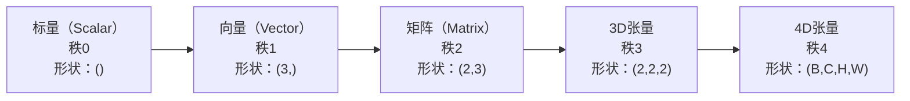
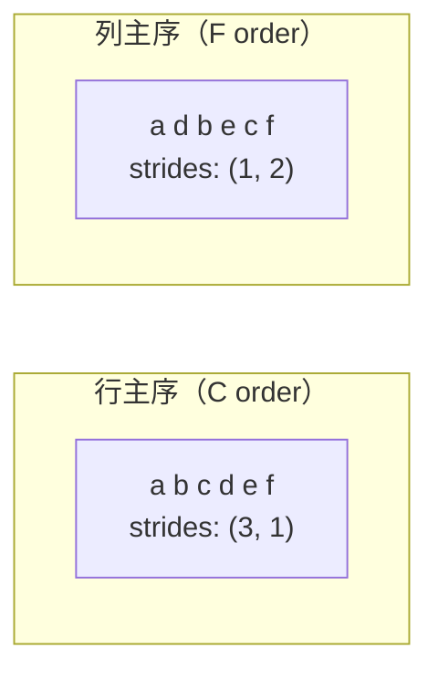
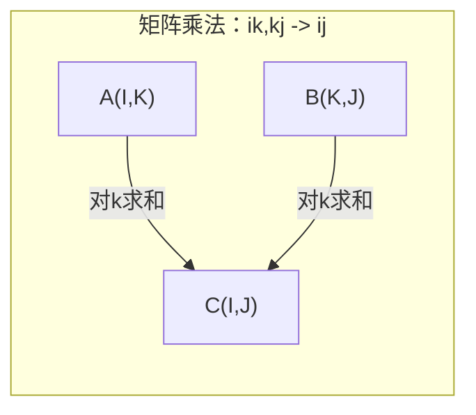

# 张量运算（Tensor Operations）

> 张量是数据与深度学习之间的通用语言。每张图像、每个句子、每个梯度都流经它。

**类型：** 构建（Build）
**语言：** Python
**前置条件：** 第一阶段，第01课（线性代数直觉）、第02课（向量、矩阵与运算）
**时间：** 约90分钟

## 学习目标

- 从零实现一个具有形状（shape）、步幅（strides）、重塑（reshape）、转置（transpose）和逐元素运算（element-wise operations）的张量类
- 应用广播（broadcasting）规则在不复制数据的情况下对不同形状的张量进行运算
- 编写用于点积、矩阵乘法、外积和批量运算的爱因斯坦求和（einsum）表达式
- 追踪多头注意力（multi-head attention）每一步的精确张量形状

## 问题背景

你在构建一个Transformer。前向传播看起来很整洁。运行后得到：`RuntimeError: mat1 and mat2 shapes cannot be multiplied (32x768 and 512x768)`。你盯着这些形状看。你尝试转置。现在它说 `Expected 4D input (got 3D input)`。你加了一个unsqueeze，其他地方又出问题了。

形状错误是深度学习代码中最常见的bug。它们在概念上并不难——每个运算都有形状约束——但错误会快速叠加。一个Transformer有几十个重塑、转置和广播串联在一起。一个轴搞错了，错误就会级联传播。更糟糕的是，有些形状错误根本不抛出异常，而是默默地通过沿错误维度广播或对错误轴求和来产生垃圾结果。

矩阵处理两组事物之间的成对关系。真实数据不适合放入两个维度。一批32张224×224的RGB图像是4D张量：`(32, 3, 224, 224)`。12头的自注意力也是4D：`(batch, heads, seq_len, head_dim)`。你需要一种能推广到任意维度数的数据结构，其运算可以在所有维度上干净地组合。这种结构就是张量。掌握它的运算，形状错误就会变得轻而易举地可调试。

## 核心概念

### 什么是张量

张量（tensor）是一个具有统一数据类型的多维数字数组。维度数称为**秩（rank）**或**阶（order）**，每个维度称为一个**轴（axis）**，**形状（shape）**是列出每个轴大小的元组。



总元素数 = 所有大小的乘积。形状 `(2, 3, 4)` 包含 `2 * 3 * 4 = 24` 个元素。

### 深度学习中的张量形状

不同类型的数据按惯例对应特定的张量形状。

```mermaid
graph TD
    subgraph 视觉（Vision）
        V1["(B, C, H, W)<br/>32, 3, 224, 224"]
    end
    subgraph 自然语言处理（NLP）
        N1["(B, T, D)<br/>16, 128, 768"]
    end
    subgraph 注意力（Attention）
        A1["(B, H, T, D)<br/>16, 12, 128, 64"]
    end
    subgraph 权重（Weights）
        W1["线性层：(out, in)<br/>Conv2D：(out_c, in_c, kH, kW)<br/>嵌入层：(vocab, dim)"]
    end
```

PyTorch使用NCHW（通道优先）格式。TensorFlow默认使用NHWC（通道最后）格式。布局不匹配会导致静默的速度下降或错误。

### 内存布局原理

内存中的二维数组是一维字节序列。**步幅（Strides）**告诉你沿每个轴前进一步需要跳过多少个元素。



转置不移动数据，而是交换步幅，使张量变为**非连续的（non-contiguous）**——一行的元素在内存中不再相邻。

### 广播规则（Broadcasting Rules）

广播让你在不复制数据的情况下对不同形状的张量进行运算。从右对齐形状，两个维度兼容的条件是它们相等或其中一个为1。维度较少的张量在左侧用1填充。

```
Tensor A:     (8, 1, 6, 1)
Tensor B:        (7, 1, 5)
Padded B:     (1, 7, 1, 5)
Result:       (8, 7, 6, 5)
```

### 爱因斯坦求和（Einsum）：通用张量运算

爱因斯坦求和用字母标记每个轴。出现在输入但不出现在输出中的轴会被求和。两者都有的轴则保留。



常见模式：`i,i->` （点积），`i,j->ij` （外积），`ii->` （迹），`ij->ji` （转置），`bij,bjk->bik` （批量矩阵乘法），`bhtd,bhsd->bhts` （注意力分数）。

## 动手实现

代码位于 `code/tensors.py`。每个步骤都对应那里的具体实现。

### 第一步：张量存储与步幅

张量存储一个扁平的数字列表加上形状元数据。步幅告诉索引逻辑如何将多维索引映射到扁平位置。

```python
class Tensor:
    def __init__(self, data, shape=None):
        if isinstance(data, (list, tuple)):
            self._data, self._shape = self._flatten_nested(data)
        elif isinstance(data, np.ndarray):
            self._data = data.flatten().tolist()
            self._shape = tuple(data.shape)
        else:
            self._data = [data]
            self._shape = ()

        if shape is not None:
            total = reduce(lambda a, b: a * b, shape, 1)
            if total != len(self._data):
                raise ValueError(
                    f"Cannot reshape {len(self._data)} elements into shape {shape}"
                )
            self._shape = tuple(shape)

        self._strides = self._compute_strides(self._shape)

    @staticmethod
    def _compute_strides(shape):
        if len(shape) == 0:
            return ()
        strides = [1] * len(shape)
        for i in range(len(shape) - 2, -1, -1):
            strides[i] = strides[i + 1] * shape[i + 1]
        return tuple(strides)
```

对于形状 `(3, 4)`，步幅为 `(4, 1)`——前进一行需要跳过4个元素，前进一列需要跳过1个元素。

### 第二步：重塑、压缩（Squeeze）与扩展（Unsqueeze）

重塑（reshape）在不改变元素顺序的情况下改变形状。总元素数必须保持不变。对一个维度使用 `-1` 可以自动推断其大小。

```python
t = Tensor(list(range(12)), shape=(2, 6))
r = t.reshape((3, 4))
r = t.reshape((-1, 3))
```

Squeeze（压缩）移除大小为1的轴，Unsqueeze（扩展）则插入一个大小为1的轴。Unsqueeze对于广播至关重要——将偏置向量 `(D,)` 加到批量数据 `(B, T, D)` 需要先将其扩展为 `(1, 1, D)`。

```python
t = Tensor(list(range(6)), shape=(1, 3, 1, 2))
s = t.squeeze()
v = Tensor([1, 2, 3])
u = v.unsqueeze(0)
```

### 第三步：转置（Transpose）与排列（Permute）

转置交换两个轴，排列重新排列所有轴。这就是在NCHW和NHWC之间转换的方法。

```python
mat = Tensor(list(range(6)), shape=(2, 3))
tr = mat.transpose(0, 1)

t4d = Tensor(list(range(24)), shape=(1, 2, 3, 4))
perm = t4d.permute((0, 2, 3, 1))
```

转置或排列后，张量在内存中是非连续的。在PyTorch中，`view` 在非连续张量上会失败——需要使用 `reshape` 或先调用 `.contiguous()`。

### 第四步：逐元素运算与归约

逐元素运算（加、乘、减）独立作用于每个元素并保持形状。归约（sum、mean、max）折叠一个或多个轴。

```python
a = Tensor([[1, 2], [3, 4]])
b = Tensor([[10, 20], [30, 40]])
c = a + b
d = a * 2
s = a.sum(axis=0)
```

CNN中的全局平均池化（Global average pooling）：`(B, C, H, W).mean(axis=[2, 3])` 产生 `(B, C)`。自然语言处理中的序列均值池化（Sequence mean pooling）：`(B, T, D).mean(axis=1)` 产生 `(B, D)`。

### 第五步：使用NumPy进行广播

`tensors.py` 中的 `demo_broadcasting_numpy()` 函数展示了核心广播模式。

```python
activations = np.random.randn(4, 3)
bias = np.array([0.1, 0.2, 0.3])
result = activations + bias

images = np.random.randn(2, 3, 4, 4)
scale = np.array([0.5, 1.0, 1.5]).reshape(1, 3, 1, 1)
result = images * scale

a = np.array([1, 2, 3]).reshape(-1, 1)
b = np.array([10, 20, 30, 40]).reshape(1, -1)
outer = a * b
```

通过广播计算成对距离：将 `(M, 2)` 重塑为 `(M, 1, 2)`，将 `(N, 2)` 重塑为 `(1, N, 2)`，相减、平方、沿最后一轴求和，再取平方根。结果形状为 `(M, N)`。

### 第六步：爱因斯坦求和（Einsum）运算

`demo_einsum()` 和 `demo_einsum_gallery()` 函数逐一演示所有常见模式。

```python
a = np.array([1.0, 2.0, 3.0])
b = np.array([4.0, 5.0, 6.0])
dot = np.einsum("i,i->", a, b)

A = np.array([[1, 2], [3, 4], [5, 6]], dtype=float)
B = np.array([[7, 8, 9], [10, 11, 12]], dtype=float)
matmul = np.einsum("ik,kj->ij", A, B)

batch_A = np.random.randn(4, 3, 5)
batch_B = np.random.randn(4, 5, 2)
batch_mm = np.einsum("bij,bjk->bik", batch_A, batch_B)
```

一次收缩的计算代价等于所有索引大小的乘积（包括保留的和求和的）。对于 `bij,bjk->bik`，B=32, I=128, J=64, K=128：`32 * 128 * 64 * 128 = 33,554,432` 次乘加运算。

### 第七步：通过爱因斯坦求和实现注意力机制

`demo_attention_einsum()` 函数端到端地实现了多头注意力。

```python
B, H, T, D = 2, 4, 8, 16
E = H * D

X = np.random.randn(B, T, E)
W_q = np.random.randn(E, E) * 0.02

Q = np.einsum("bte,ek->btk", X, W_q)
Q = Q.reshape(B, T, H, D).transpose(0, 2, 1, 3)

scores = np.einsum("bhtd,bhsd->bhts", Q, K) / np.sqrt(D)
weights = softmax(scores, axis=-1)
attn_output = np.einsum("bhts,bhsd->bhtd", weights, V)

concat = attn_output.transpose(0, 2, 1, 3).reshape(B, T, E)
output = np.einsum("bte,ek->btk", concat, W_o)
```

每一步都是一个张量运算：投影（通过einsum的矩阵乘法）、头部分割（重塑+转置）、注意力分数（通过einsum的批量矩阵乘法）、加权求和（通过einsum的批量矩阵乘法）、头部合并（转置+重塑）、输出投影（通过einsum的矩阵乘法）。

## 实践应用

### 手写实现 vs NumPy

| 运算 | 手写（Tensor类） | NumPy |
|---|---|---|
| 创建 | `Tensor([[1,2],[3,4]])` | `np.array([[1,2],[3,4]])` |
| 重塑 | `t.reshape((3,4))` | `a.reshape(3,4)` |
| 转置 | `t.transpose(0,1)` | `a.T` 或 `a.transpose(0,1)` |
| 压缩 | `t.squeeze(0)` | `np.squeeze(a, 0)` |
| 求和 | `t.sum(axis=0)` | `a.sum(axis=0)` |
| 爱因斯坦求和 | N/A | `np.einsum("ij,jk->ik", a, b)` |

### 手写实现 vs PyTorch

```python
import torch

t = torch.tensor([[1, 2, 3], [4, 5, 6]], dtype=torch.float32)
t.shape
t.stride()
t.is_contiguous()

t.reshape(3, 2)
t.unsqueeze(0)
t.transpose(0, 1)
t.transpose(0, 1).contiguous()

torch.einsum("ik,kj->ij", A, B)
```

PyTorch增加了自动微分（autograd）、GPU支持和优化的BLAS内核。形状语义完全相同。如果你理解了手写版本，PyTorch的形状错误就变得可读了。

### 每个神经网络层作为张量运算

| 运算 | 张量形式 | 爱因斯坦求和 |
|---|---|---|
| 线性层（Linear layer） | `Y = X @ W.T + b` | `"bd,od->bo"` + 偏置 |
| 注意力QKV投影 | `Q = X @ W_q` | `"btd,dh->bth"` |
| 注意力分数 | `Q @ K.T / sqrt(d)` | `"bhtd,bhsd->bhts"` |
| 注意力输出 | `softmax(scores) @ V` | `"bhts,bhsd->bhtd"` |
| 批归一化（Batch norm） | `(X - mu) / sigma * gamma` | 逐元素 + 广播 |
| Softmax | `exp(x) / sum(exp(x))` | 逐元素 + 归约 |

## 输出产物

本课产出两个可复用的提示词：

1. **`outputs/prompt-tensor-shapes.md`** -- 用于调试张量形状不匹配的系统化提示词。包含每种常见运算（matmul、broadcast、cat、Linear、Conv2d、BatchNorm、softmax）的决策表和修复查找表。

2. **`outputs/prompt-tensor-debugger.md`** -- 当形状错误让你卡住时，粘贴到任意AI助手的逐步调试提示词。输入错误信息和张量形状，得到精确的修复方案。

## 练习题

1. **简单——重塑往返验证。** 取形状为 `(2, 3, 4)` 的张量，将其重塑为 `(6, 4)`，再到 `(24,)`，最后回到 `(2, 3, 4)`。通过打印每步的扁平数据，验证元素顺序在每一步都被保留。

2. **中等——实现广播。** 扩展 `Tensor` 类，添加 `broadcast_to(shape)` 方法，将大小为1的维度扩展以匹配目标形状。然后修改 `_elementwise_op` 在运算前自动广播。用形状 `(3, 1)` 和 `(1, 4)` 测试，验证结果为 `(3, 4)`。

3. **困难——从零构建爱因斯坦求和。** 实现一个基础的 `einsum(subscripts, *tensors)` 函数，至少处理：点积（`i,i->`）、矩阵乘法（`ij,jk->ik`）、外积（`i,j->ij`）和转置（`ij->ji`）。解析下标字符串，识别收缩索引，遍历所有索引组合。将你的结果与 `np.einsum` 对比。

4. **困难——注意力形状追踪器。** 编写一个函数，以 `batch_size`、`seq_len`、`embed_dim` 和 `num_heads` 为输入，打印多头注意力每一步的精确形状：输入、Q/K/V投影、头部分割、注意力分数、softmax权重、加权求和、头部合并、输出投影。与 `demo_attention_einsum()` 的输出对比验证。

## 关键术语

| 术语 | 常见说法 | 实际含义 |
|---|---|---|
| 张量（Tensor） | "维度更多的矩阵" | 具有统一类型、定义形状、步幅和运算的多维数组 |
| 秩（Rank） | "维度数" | 轴的数量。矩阵的秩为2，而非其矩阵秩 |
| 形状（Shape） | "张量的大小" | 列出每个轴大小的元组。`(2, 3)` 表示2行3列 |
| 步幅（Stride） | "内存的布局方式" | 沿每个轴前进一个位置需要跳过的元素数 |
| 广播（Broadcasting） | "形状不同时也能运算" | 严格的规则集：从右对齐，维度必须相等或其中一个为1 |
| 连续性（Contiguous） | "张量是正常的" | 元素在内存中连续存储，与逻辑布局没有间隙或重排 |
| 爱因斯坦求和（Einsum） | "花哨的矩阵乘法写法" | 一种通用记法，可以用一行表达任意张量收缩、外积、迹或转置 |
| 视图（View） | "与reshape相同" | 共享相同内存缓冲区但具有不同形状/步幅元数据的张量。在非连续数据上会失败 |
| 收缩（Contraction） | "对一个索引求和" | 张量间共享索引被相乘后求和的通用运算，产生秩更低的结果 |
| NCHW / NHWC | "PyTorch vs TensorFlow格式" | 图像张量的内存布局惯例。NCHW将通道放在空间维度之前，NHWC将其放在之后 |

## 延伸阅读

- [NumPy Broadcasting](https://numpy.org/doc/stable/user/basics.broadcasting.html) -- 附有视觉示例的规范规则
- [PyTorch Tensor Views](https://pytorch.org/docs/stable/tensor_view.html) -- 视图何时有效，何时会复制数据
- [einops](https://github.com/arogozhnikov/einops) -- 使张量重塑可读且安全的库
- [The Illustrated Transformer](https://jalammar.github.io/illustrated-transformer/) -- 可视化流经注意力机制的张量形状
- [Einstein Summation in NumPy](https://numpy.org/doc/stable/reference/generated/numpy.einsum.html) -- 附示例的完整einsum文档
