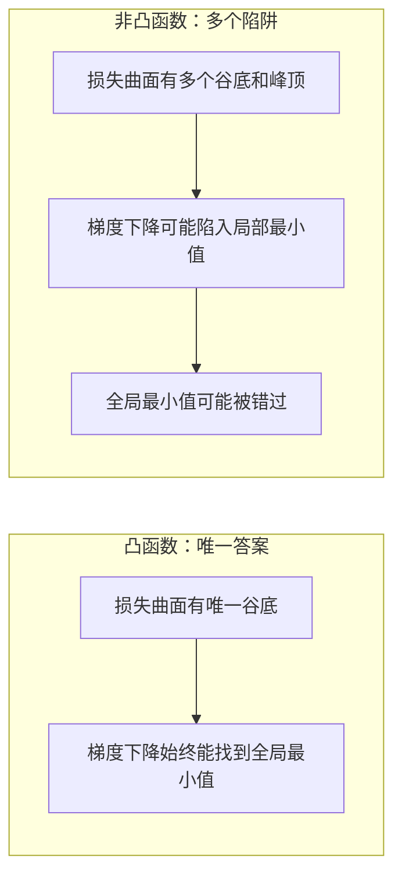
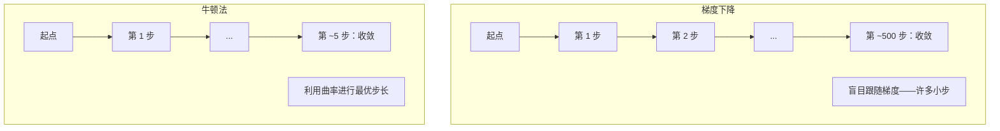
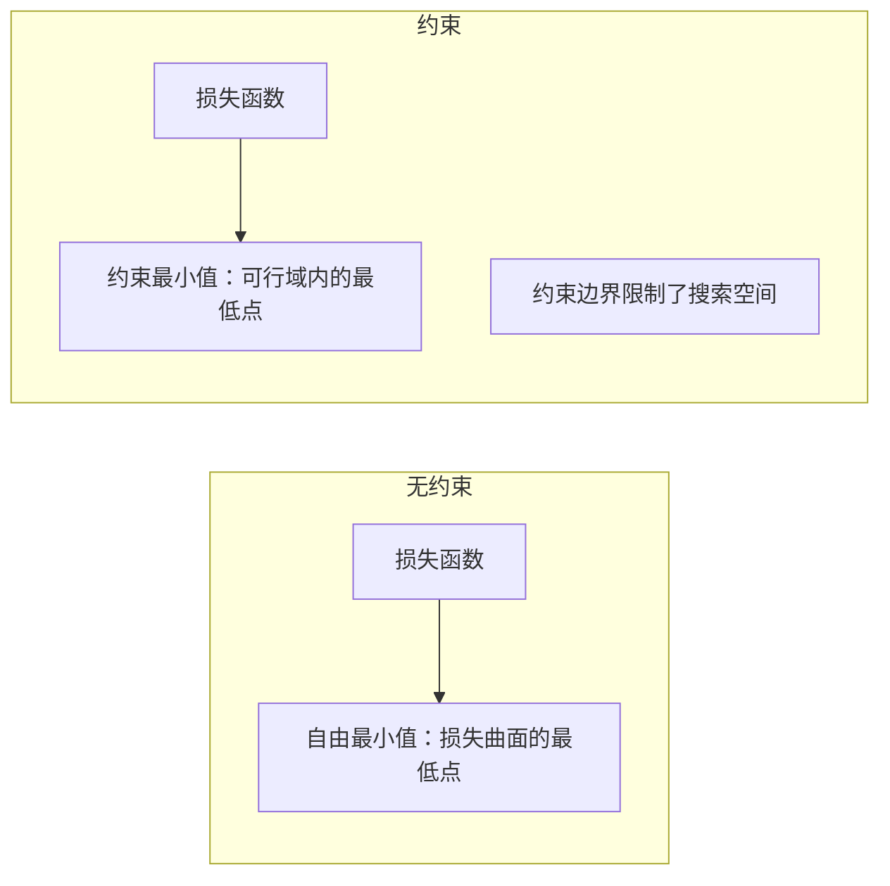
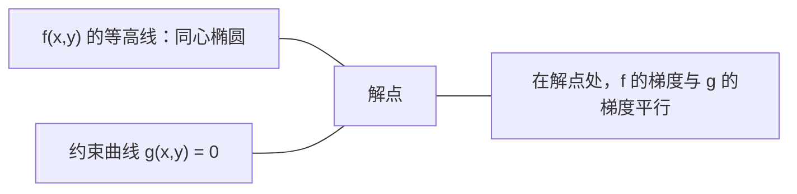

# 凸优化

> 凸问题只有一个谷底。神经网络有数百万个。了解二者的区别至关重要。

**类型：** 构建（Build）
**语言：** Python
**前置条件：** 第一阶段，第 04 课（机器学习微积分）、第 08 课（优化）
**时长：** ~90 分钟

## 学习目标

- 使用定义、二阶导数和黑塞矩阵准则检验函数的凸性
- 实现牛顿法（Newton's method）并与梯度下降的二次收敛速度进行比较
- 用拉格朗日乘数法（Lagrange multipliers）求解约束优化问题，并解释 KKT 条件
- 解释为何神经网络损失曲面是非凸的，而随机梯度下降（SGD）仍能找到良好解

## 问题

第 08 课介绍了梯度下降（gradient descent）、动量（momentum）和 Adam。这些优化器可在任意曲面上下山行走，但不提供任何保证。在非凸曲面上，梯度下降可能陷入糟糕的局部最小值，卡在鞍点上，或永远振荡。尽管如此，你仍然使用它，因为神经网络是非凸的，别无选择。

但机器学习中有许多问题是凸的（convex）：线性回归（linear regression）、逻辑回归（logistic regression）、支持向量机（SVM, Support Vector Machine）、LASSO、岭回归（ridge regression）。对于这些问题，存在更强大的工具：带有数学保证的优化。凸问题只有一个谷底。任何下坡行走的算法都会到达全局最小值（global minimum），无需重启，无需学习率调度，无需祈祷。

理解凸性带来三点好处。第一，它告诉你问题是简单的（凸）还是困难的（非凸）。第二，它为凸问题提供了更快的工具，如牛顿法。第三，它解释了贯穿整个机器学习的概念：正则化（regularization）作为约束、支持向量机中的对偶性（duality）、以及为何深度学习在违反凸性所有优良性质的情况下仍然有效。

## 概念

### 凸集

如果集合 S 中任意两点之间的线段也完全位于 S 内，则该集合 S 是凸集（convex set）。

| 凸集 | 非凸集 |
|---|---|
| **矩形**：内部任意两点之间的线段始终在内部 | **星形/月牙形**：某些内点之间的连线可能穿出集合 |
| **三角形**：所有内点均满足该性质 | **甜甜圈/环形**：中间的孔使某些线段离开集合 |
| 任意两点之间的线段始终位于集合内 | 某些点对之间的线段会离开集合 |

形式化检验：对于 S 中的任意点 x, y 以及任意 t ∈ [0, 1]，点 tx + (1-t)y 也在 S 内。

凸集示例：
- 直线、平面、整个 R^n
- 球（圆、球面、超球面）
- 半空间：{x : a^T x &lt;= b}
- 任意数量凸集的交集

非凸集示例：
- 甜甜圈（环形）
- 两个不相交圆的并集
- 任何有"凹陷"或"孔"的集合

### 凸函数

如果函数 f 的定义域是凸集，且对定义域内的任意两点 x, y 以及任意 t ∈ [0, 1]，满足：

```
f(tx + (1-t)y) <= t*f(x) + (1-t)*f(y)
```

则称 f 为凸函数（convex function）。

几何含义：图像上任意两点之间的线段位于图像上方或图像上。

| 属性 | 凸函数 | 非凸函数 |
|---|---|---|
| **线段检验** | 图像上任意两点之间的线段位于曲线**上方或曲线上** | 图像上某些点之间的线段**低于**曲线 |
| **形状** | 单一碗形/谷底，向上弯曲 | 多个峰谷，曲率混合 |
| **局部最小值** | 每个局部最小值都是全局最小值 | 可能存在不同高度的多个局部最小值 |

常见凸函数：
- f(x) = x^2（抛物线）
- f(x) = |x|（绝对值）
- f(x) = e^x（指数函数）
- f(x) = max(0, x)（ReLU，虽然是分段线性）
- f(x) = -log(x)，x > 0（负对数）
- 任何线性函数 f(x) = a^T x + b（既是凸函数也是凹函数）

### 凸性检验

三种实用检验方法，由易到严。

**检验一：二阶导数检验（一维）。** 若对所有 x 有 f''(x) >= 0，则 f 是凸函数。

- f(x) = x^2：f''(x) = 2 >= 0。凸函数。
- f(x) = x^3：f''(x) = 6x。当 x &lt; 0 时为负。非凸函数。
- f(x) = e^x：f''(x) = e^x > 0。凸函数。

**检验二：黑塞矩阵检验（多变量）。** 若黑塞矩阵（Hessian matrix）H(x) 对所有 x 均为正半定（positive semidefinite），则 f 是凸函数。黑塞矩阵是由二阶偏导数构成的矩阵。

**检验三：定义检验。** 直接验证不等式 f(tx + (1-t)y) &lt;= t*f(x) + (1-t)*f(y)。适用于导数难以计算的函数。

### 凸性的重要性

凸优化的核心定理：

**对于凸函数，每个局部最小值都是全局最小值。**

这意味着梯度下降不会被困住。任何下坡路径都通向同一个答案。算法保证收敛到最优解。



推论：
- 无需随机重启
- 无需复杂的学习率调度
- 收敛证明是可能的（速率取决于函数性质）
- 解是唯一的（平坦区域除外）

### 机器学习中的凸与非凸

| 问题 | 凸？ | 原因 |
|---------|---------|-----|
| 线性回归（MSE） | 是 | 损失对权重是二次的 |
| 逻辑回归 | 是 | 对数损失对权重是凸的 |
| 支持向量机（合页损失） | 是 | 线性函数的最大值 |
| LASSO（L1 回归） | 是 | 凸函数之和仍是凸函数 |
| 岭回归（L2） | 是 | 二次函数加二次函数仍是凸函数 |
| 神经网络（任意损失） | 否 | 非线性激活函数产生非凸曲面 |
| k-均值聚类（k-means clustering） | 否 | 离散分配步骤 |
| 矩阵分解（matrix factorization） | 否 | 未知量的乘积 |

带凸损失的线性模型是凸的。一旦添加带有非线性激活函数的隐藏层，凸性就会被破坏。

### 黑塞矩阵

函数 f: R^n -> R 的黑塞矩阵（Hessian matrix）H 是由二阶偏导数构成的 n×n 矩阵。

```
H[i][j] = d^2 f / (dx_i dx_j)
```

对于 f(x, y) = x^2 + 3xy + y^2：

```
df/dx = 2x + 3y       d^2f/dx^2 = 2      d^2f/dxdy = 3
df/dy = 3x + 2y       d^2f/dydx = 3      d^2f/dy^2 = 2

H = [ 2  3 ]
    [ 3  2 ]
```

黑塞矩阵描述曲率（curvature）信息：
- 特征值全为正：函数在每个方向向上弯曲（该点是凸的）
- 特征值全为负：函数在每个方向向下弯曲（凹函数，局部最大值）
- 特征值正负混合：鞍点（某些方向向上，某些方向向下）
- 零特征值：该方向是平坦的（退化）

对于凸性，黑塞矩阵必须在所有地方（不仅仅是某一点）均为正半定。

### 牛顿法

梯度下降使用一阶信息（梯度）。牛顿法（Newton's method）使用二阶信息（黑塞矩阵）。它在当前点拟合一个二次近似，并直接跳到该二次函数的最小值。

```
更新规则：
  x_new = x - H^(-1) * gradient

与梯度下降对比：
  x_new = x - lr * gradient
```

牛顿法用逆黑塞矩阵代替标量学习率，根据局部曲率自动调整步长和方向。



优点：
- 在最小值附近二次收敛（误差每步平方）
- 无需调整学习率
- 尺度不变（无论如何参数化问题都有效）

缺点：
- 计算黑塞矩阵需要 O(n^2) 内存，求逆需要 O(n^3)
- 对于拥有 100 万个权重的神经网络，这意味着 10^12 个元素和 10^18 次运算
- 不适用于深度学习

### 约束优化

无约束优化：在所有 x 上最小化 f(x)。
约束优化（constrained optimization）：在约束条件下最小化 f(x)。

实际问题都有约束。你希望最小化成本，但预算有限。你希望最小化误差，但模型复杂度受限。



### 拉格朗日乘数法

拉格朗日乘数法（Lagrange multipliers）将约束问题转化为无约束问题。

问题：在 g(x) = 0 的约束下最小化 f(x)。

解法：引入新变量（拉格朗日乘数 lambda）并求解无约束问题：

```
L(x, lambda) = f(x) + lambda * g(x)
```

在最优解处，L 的梯度为零：

```
dL/dx = df/dx + lambda * dg/dx = 0
dL/dlambda = g(x) = 0
```

几何直觉：在约束最小值处，f 的梯度必须与约束 g 的梯度平行。若不平行，则可沿约束曲面移动并进一步减小 f。



示例：在 x + y = 1 的约束下最小化 f(x,y) = x^2 + y^2。

```
L = x^2 + y^2 + lambda(x + y - 1)

dL/dx = 2x + lambda = 0  =>  x = -lambda/2
dL/dy = 2y + lambda = 0  =>  y = -lambda/2
dL/dlambda = x + y - 1 = 0

From first two: x = y
Substituting: 2x = 1, so x = y = 0.5, lambda = -1
```

原点到直线 x + y = 1 的最近点是 (0.5, 0.5)。

### KKT 条件

KKT 条件（Karush-Kuhn-Tucker conditions）将拉格朗日乘数法推广到不等式约束。

问题：在 g_i(x) &lt;= 0（i = 1, ..., m）的约束下最小化 f(x)。

KKT 条件（最优性的必要条件）：

```
1. Stationarity:    df/dx + sum(lambda_i * dg_i/dx) = 0
2. Primal feasibility:  g_i(x) <= 0  for all i
3. Dual feasibility:    lambda_i >= 0  for all i
4. Complementary slackness:  lambda_i * g_i(x) = 0  for all i
```

互补松弛性（complementary slackness）是关键洞见：要么约束是活跃的（g_i = 0，解在边界上），要么乘数为零（约束不起作用）。不影响解的约束其 lambda = 0。

KKT 条件是支持向量机（SVM）的核心。支持向量（support vectors）是约束活跃的数据点（lambda > 0）。所有其他数据点的 lambda = 0，不影响决策边界。

### 正则化作为约束优化

L1 和 L2 正则化不是任意的技巧，而是伪装成约束优化问题。

**L2 正则化（岭回归，Ridge）：**

```
minimize  Loss(w)  subject to  ||w||^2 <= t

Equivalent unconstrained form:
minimize  Loss(w) + lambda * ||w||^2
```

约束 ||w||^2 &lt;= t 定义了一个球（二维中的圆，三维中的球面）。解是损失等高线与球第一次接触的点。

**L1 正则化（LASSO）：**

```
minimize  Loss(w)  subject to  ||w||_1 <= t

Equivalent unconstrained form:
minimize  Loss(w) + lambda * ||w||_1
```

约束 ||w||_1 &lt;= t 定义了一个菱形（二维中的旋转正方形）。

| 属性 | L2 约束（圆形） | L1 约束（菱形） |
|---|---|---|
| **约束形状** | 圆（高维中的球面） | 菱形（二维中的旋转正方形） |
| **损失等高线接触位置** | 平滑边界——圆上的任意点 | 角点——与某个轴对齐 |
| **解的特性** | 权重小但非零 | 某些权重恰好为零（稀疏） |
| **结果** | 权重收缩 | 特征选择 |

这解释了为何 L1 产生稀疏模型（特征选择）而 L2 只是收缩权重。菱形的角点与轴对齐，损失等高线更可能接触角点，将一个或多个权重恰好设为零。

### 对偶性

每个约束优化问题（原始问题，primal）都有一个伴随问题（对偶问题，dual）。对于凸问题，原始问题和对偶问题具有相同的最优值，这称为强对偶性（strong duality）。

拉格朗日对偶函数：

```
Primal: minimize f(x) subject to g(x) <= 0
Lagrangian: L(x, lambda) = f(x) + lambda * g(x)
Dual function: d(lambda) = min_x L(x, lambda)
Dual problem: maximize d(lambda) subject to lambda >= 0
```

对偶性的意义：
- 对偶问题有时比原始问题更容易求解
- 支持向量机（SVM）在对偶形式下求解，问题取决于数据点之间的内积（使核技巧成为可能）
- 对偶问题为原始最优值提供下界，可用于检验解的质量

对于支持向量机，具体来说：

```
Primal: find w, b that maximize the margin 2/||w|| subject to
        y_i(w^T x_i + b) >= 1 for all i

Dual:   maximize sum(alpha_i) - 0.5 * sum_ij(alpha_i * alpha_j * y_i * y_j * x_i^T x_j)
        subject to alpha_i >= 0 and sum(alpha_i * y_i) = 0

The dual only involves dot products x_i^T x_j.
Replace x_i^T x_j with K(x_i, x_j) to get the kernel trick.
```

### 为何深度学习在非凸情况下仍然有效

神经网络的损失函数极度非凸。从所有经典标准来看，对它进行优化应该会失败。然而，随机梯度下降（SGD）可靠地找到好的解。以下几个因素解释了这一现象。

**大多数局部最小值足够好。** 在高维空间中，随机临界点（梯度为零的点）压倒性地是鞍点（saddle points），而不是局部最小值。极少数存在的局部最小值往往具有接近全局最小值的损失值。当参数空间有数百万维度时，陷入糟糕的局部最小值极不可能发生。

**鞍点，而非局部最小值，才是真正的障碍。** 在具有 n 个参数的函数中，鞍点在某些方向上有正曲率，在其他方向上有负曲率。对于高维中的随机临界点，所有 n 个特征值均为正（局部最小值）的概率约为 2^(-n)。几乎所有临界点都是鞍点。SGD 的噪声有助于逃离它们。

**过参数化（overparameterization）使曲面更平滑。** 参数多于训练样本的网络具有更平滑、更连通的损失曲面。较宽的网络具有更少的不良局部最小值。这与直觉相反，但实验上是一致的。

**损失曲面结构：**

| 属性 | 低维空间 | 高维空间 |
|---|---|---|
| **曲面** | 许多孤立的峰谷 | 平滑连通的谷地 |
| **最小值** | 许多孤立的局部最小值 | 极少不良局部最小值；大多数接近最优 |
| **导航** | 难以找到全局最小值 | 许多路径通向好的解 |
| **临界点** | 局部最小值和鞍点混合 | 压倒性是鞍点，而非局部最小值 |

**随机噪声充当隐式正则化。** 小批量 SGD 添加的噪声防止陷入尖锐最小值。尖锐最小值会过拟合；平坦最小值具有更好的泛化能力。噪声使优化偏向于损失曲面的平坦区域。

### 实践中的二阶方法

纯牛顿法对大型模型不实用。有几种近似方法使二阶信息可用。

**L-BFGS（有限内存 BFGS，Limited-memory BFGS）：** 使用最近 m 次梯度差异近似逆黑塞矩阵。需要 O(mn) 内存而不是 O(n^2)。适用于参数最多约 10,000 的问题。用于经典机器学习（逻辑回归、CRF），但不用于深度学习。

**自然梯度（Natural gradient）：** 使用费雪信息矩阵（Fisher information matrix，对数似然的期望黑塞矩阵）代替标准黑塞矩阵。这考虑了概率分布的几何结构。K-FAC（Kronecker-Factored Approximate Curvature）将费雪矩阵近似为 Kronecker 乘积，使其适用于神经网络。

**无黑塞矩阵优化（Hessian-free optimization）：** 使用共轭梯度法求解 Hx = g，无需显式构造 H。只需黑塞矩阵-向量乘积，可通过自动微分在 O(n) 时间内计算。

**对角近似：** Adam 的二阶矩是黑塞矩阵对角线的对角近似。AdaHessian 通过 Hutchinson 估计器使用实际黑塞矩阵对角线元素进行扩展。

| 方法 | 内存 | 每步开销 | 适用场景 |
|--------|--------|--------------|-------------|
| 梯度下降 | O(n) | O(n) | 基准，大型模型 |
| 牛顿法 | O(n^2) | O(n^3) | 小型凸问题 |
| L-BFGS | O(mn) | O(mn) | 中型凸问题 |
| Adam | O(n) | O(n) | 深度学习默认 |
| K-FAC | O(n) | 每层 O(n) | 研究，大批量训练 |

## 构建

### 第一步：凸性检验器

构建一个函数，通过采样点并检查定义来实验性地检验凸性。

```python
import random
import math

def check_convexity(f, dim, bounds=(-5, 5), samples=1000):
    violations = 0
    for _ in range(samples):
        x = [random.uniform(*bounds) for _ in range(dim)]
        y = [random.uniform(*bounds) for _ in range(dim)]
        t = random.uniform(0, 1)
        mid = [t * xi + (1 - t) * yi for xi, yi in zip(x, y)]
        lhs = f(mid)
        rhs = t * f(x) + (1 - t) * f(y)
        if lhs > rhs + 1e-10:
            violations += 1
    return violations == 0, violations
```

### 第二步：二维牛顿法

使用显式黑塞矩阵实现牛顿法。与梯度下降的收敛速度进行比较。

```python
def newtons_method(f, grad_f, hessian_f, x0, steps=50, tol=1e-12):
    x = list(x0)
    history = [x[:]]
    for _ in range(steps):
        g = grad_f(x)
        H = hessian_f(x)
        det = H[0][0] * H[1][1] - H[0][1] * H[1][0]
        if abs(det) < 1e-15:
            break
        H_inv = [
            [H[1][1] / det, -H[0][1] / det],
            [-H[1][0] / det, H[0][0] / det],
        ]
        dx = [
            H_inv[0][0] * g[0] + H_inv[0][1] * g[1],
            H_inv[1][0] * g[0] + H_inv[1][1] * g[1],
        ]
        x = [x[0] - dx[0], x[1] - dx[1]]
        history.append(x[:])
        if sum(gi ** 2 for gi in g) < tol:
            break
    return history
```

### 第三步：拉格朗日乘数求解器

使用对拉格朗日函数的梯度下降求解约束优化问题。

```python
def lagrange_solve(f_grad, g_val, g_grad, x0, lr=0.01,
                   lr_lambda=0.01, steps=5000):
    x = list(x0)
    lam = 0.0
    history = []
    for _ in range(steps):
        fg = f_grad(x)
        gv = g_val(x)
        gg = g_grad(x)
        x = [
            xi - lr * (fgi + lam * ggi)
            for xi, fgi, ggi in zip(x, fg, gg)
        ]
        lam = lam + lr_lambda * gv
        history.append((x[:], lam, gv))
    return history
```

### 第四步：一阶与二阶方法比较

在相同的二次函数上运行梯度下降和牛顿法。统计收敛所需步骤数。

```python
def quadratic(x):
    return 5 * x[0] ** 2 + x[1] ** 2

def quadratic_grad(x):
    return [10 * x[0], 2 * x[1]]

def quadratic_hessian(x):
    return [[10, 0], [0, 2]]
```

牛顿法将在 1 步内收敛（对二次函数精确）。梯度下降将需要数百步，因为黑塞矩阵的特征值相差 5 倍，形成一个拉长的谷地。

## 使用

凸性分析在选择机器学习模型和求解器时直接适用。

对于凸问题（逻辑回归、支持向量机、LASSO）：
- 使用专用求解器（liblinear、CVXPY、scipy.optimize.minimize 方法 'L-BFGS-B'）
- 期望有唯一的全局解
- 二阶方法实用且快速

对于非凸问题（神经网络）：
- 使用一阶方法（SGD、Adam）
- 接受解依赖于初始化和随机性
- 使用过参数化、噪声和学习率调度作为隐式正则化
- 不要浪费时间寻找全局最小值，一个好的局部最小值就足够了

```python
from scipy.optimize import minimize

result = minimize(
    fun=lambda w: sum((y - X @ w) ** 2) + 0.1 * sum(w ** 2),
    x0=np.zeros(d),
    method='L-BFGS-B',
    jac=lambda w: -2 * X.T @ (y - X @ w) + 0.2 * w,
)
```

对于支持向量机，对偶形式允许使用核技巧（kernel trick）：

```python
from sklearn.svm import SVC

svm = SVC(kernel='rbf', C=1.0)
svm.fit(X_train, y_train)
print(f"Support vectors: {svm.n_support_}")
```

## 练习

1. **凸性大图鉴。** 使用凸性检验器测试以下函数：f(x) = x^4、f(x) = sin(x)、f(x,y) = x^2 + y^2、f(x,y) = x*y、f(x) = max(x, 0)。解释每个结果的原因。

2. **牛顿法与梯度下降竞速。** 从起点 (10, 10) 对 f(x,y) = 50*x^2 + y^2 运行两种方法。各需多少步才能使损失 &lt; 1e-10？当条件数（黑塞矩阵最大与最小特征值之比）增大时，梯度下降会发生什么？

3. **拉格朗日乘数的几何意义。** 在 x + 2y = 4 的约束下最小化 f(x,y) = (x-3)^2 + (y-3)^2。通过验证在解处 f 的梯度与 g 的梯度平行来确认结果。

4. **正则化约束。** 实现 L1 约束优化：在 |x| + |y| &lt;= 1 的约束下最小化 (x-3)^2 + (y-2)^2。证明解中有一个坐标等于零（来自菱形约束的稀疏性）。

5. **黑塞矩阵特征值分析。** 计算 Rosenbrock 函数在 (1,1) 和 (-1,1) 处的黑塞矩阵。计算两点的特征值。特征值告诉你最小值处与远离最小值处的曲率有何不同？

## 关键术语

| 术语 | 含义 |
|------|---------------|
| 凸集（Convex set） | 集合内任意两点之间的线段完全位于集合内 |
| 凸函数（Convex function） | 图像上任意两点之间的线段位于图像上方或图像上。等价地，黑塞矩阵在所有地方均为正半定 |
| 局部最小值（Local minimum） | 比所有附近点更低的点。对于凸函数，每个局部最小值都是全局最小值 |
| 全局最小值（Global minimum） | 函数在整个定义域内的最低点 |
| 黑塞矩阵（Hessian matrix） | 所有二阶偏导数构成的矩阵，编码曲率信息 |
| 正半定（Positive semidefinite） | 特征值全为非负的矩阵，是"二阶导数 >= 0"的多维类比 |
| 条件数（Condition number） | 黑塞矩阵最大与最小特征值之比。条件数高意味着拉长的谷地和缓慢的梯度下降 |
| 牛顿法（Newton's method） | 使用逆黑塞矩阵确定步长和方向的二阶优化器。在最小值附近二次收敛 |
| 拉格朗日乘数（Lagrange multiplier） | 为将约束优化问题转化为无约束问题而引入的变量 |
| KKT 条件（KKT conditions） | 不等式约束最优性的必要条件，是拉格朗日乘数法的推广 |
| 互补松弛性（Complementary slackness） | 在解处，约束要么是活跃的，要么其乘数为零，二者不同时非零 |
| 对偶性（Duality） | 每个约束问题都有一个伴随对偶问题。对于凸问题，两者具有相同的最优值 |
| 强对偶性（Strong duality） | 原始和对偶最优值相等。对于满足 Slater 条件的凸问题成立 |
| L-BFGS | 近似二阶方法，存储最近 m 次梯度差异而不是完整黑塞矩阵 |
| 鞍点（Saddle point） | 梯度为零，但在某些方向上是最小值、在其他方向上是最大值的点 |
| 过参数化（Overparameterization） | 使用比训练样本更多的参数，使损失曲面更平滑，减少不良局部最小值 |

## 延伸阅读

- [Boyd & Vandenberghe: Convex Optimization](https://web.stanford.edu/~boyd/cvxbook/) - 标准教材，可在线免费获取
- [Bottou, Curtis, Nocedal: Optimization Methods for Large-Scale Machine Learning (2018)](https://arxiv.org/abs/1606.04838) - 连接凸优化理论与深度学习实践
- [Choromanska et al.: The Loss Surfaces of Multilayer Networks (2015)](https://arxiv.org/abs/1412.0233) - 为何非凸神经网络曲面没有看起来那么糟糕
- [Nocedal & Wright: Numerical Optimization](https://link.springer.com/book/10.1007/978-0-387-40065-5) - 牛顿法、L-BFGS 和约束优化的全面参考
