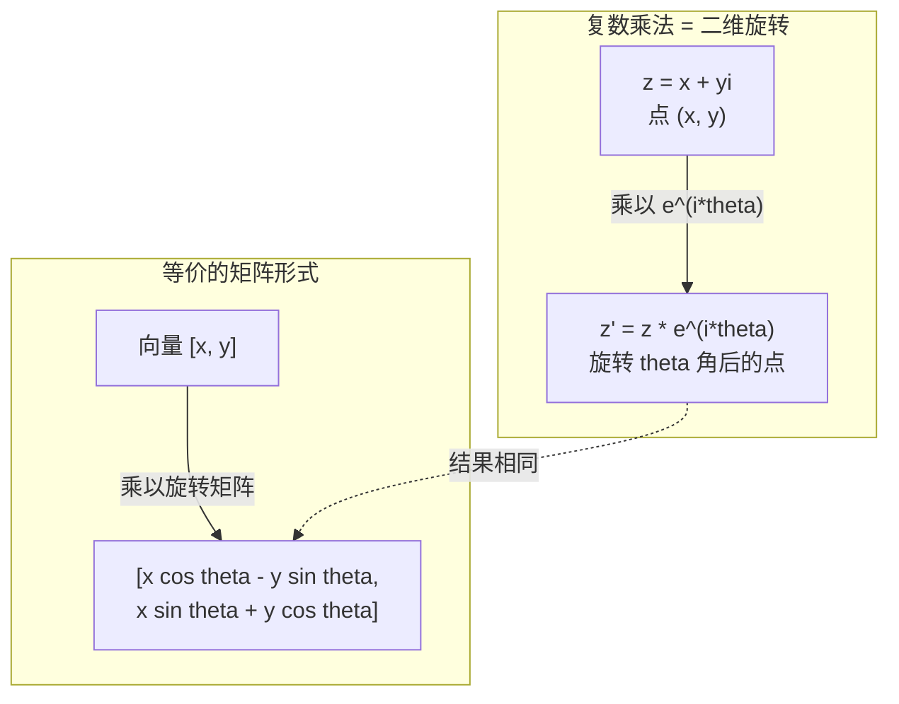
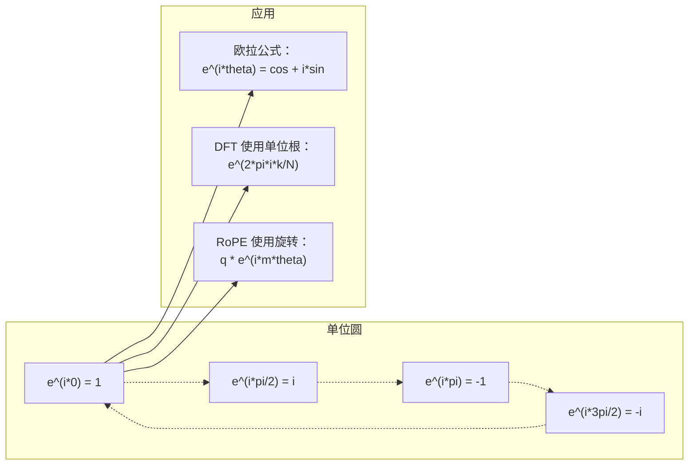

# 面向 AI 的复数

> -1 的平方根并不是虚构的。它是旋转、频率以及半个信号处理领域的关键所在。

**类型：** 学习（Learn）
**语言：** Python
**前置条件：** 第一阶段，第 01–04 课（线性代数、微积分）
**时长：** ~60 分钟

## 学习目标

- 以直角坐标形式和极坐标形式执行复数运算（加法、乘法、除法、共轭）
- 应用欧拉公式在复指数与三角函数之间相互转换
- 利用单位根（roots of unity）实现离散傅里叶变换
- 解释复旋转如何支撑 Transformer 中的旋转位置编码（RoPE）和正弦位置编码

## 问题

你打开一篇关于傅里叶变换的论文，随处可见 `i`。你查看 Transformer 的位置编码，看到不同频率的 `sin` 和 `cos`——它们是复指数的实部和虚部。你阅读量子计算，发现所有内容都用复向量空间表达。

复数看起来很抽象。基于 -1 的平方根构建的数字系统感觉像是一个数学把戏。但它不是把戏，而是旋转（rotation）和振荡（oscillation）的自然语言。每当某些东西旋转、振动或摆动时，复数就是正确的工具。

不理解复数，就无法理解离散傅里叶变换（DFT），无法理解 FFT，无法理解旋转位置编码（RoPE, Rotary Position Embedding）在现代语言模型中的工作原理，也无法理解为何原始 Transformer 论文中的正弦位置编码使用那样的频率。

本课从零开始构建复数算术，将其与几何联系起来，并展示复数在机器学习中出现的确切位置。

## 概念

### 什么是复数？

复数（complex number）由两部分组成：实部和虚部。

```
z = a + bi

where:
  a is the real part
  b is the imaginary part
  i is the imaginary unit, defined by i^2 = -1
```

就这些。你将数轴扩展成一个平面。实数位于一条轴上，虚数位于另一条轴上。每个复数都是这个平面上的一个点。

### 复数运算

**加法。** 实部相加，虚部相加。

```
(a + bi) + (c + di) = (a + c) + (b + d)i

Example: (3 + 2i) + (1 + 4i) = 4 + 6i
```

**乘法。** 使用分配律，并记住 i^2 = -1。

```
(a + bi)(c + di) = ac + adi + bci + bdi^2
                 = ac + adi + bci - bd
                 = (ac - bd) + (ad + bc)i

Example: (3 + 2i)(1 + 4i) = 3 + 12i + 2i + 8i^2
                            = 3 + 14i - 8
                            = -5 + 14i
```

**共轭（conjugate）。** 翻转虚部的符号。

```
conjugate of (a + bi) = a - bi
```

一个复数与其共轭的乘积始终是实数：

```
(a + bi)(a - bi) = a^2 + b^2
```

**除法。** 将分子和分母同时乘以分母的共轭。

```
(a + bi) / (c + di) = (a + bi)(c - di) / (c^2 + d^2)
```

这消除了分母中的虚部，给出一个干净的复数。

### 复平面

复平面（complex plane）将每个复数映射到一个二维点。水平轴是实轴，垂直轴是虚轴。

```
z = 3 + 2i  corresponds to the point (3, 2)
z = -1 + 0i corresponds to the point (-1, 0) on the real axis
z = 0 + 4i  corresponds to the point (0, 4) on the imaginary axis
```

复数同时是一个点和从原点出发的向量。这种双重解释使复数在几何上非常有用。

### 极坐标形式

平面上的任意点都可以用它到原点的距离和与正实轴的角度来描述。

```
z = r * (cos(theta) + i*sin(theta))

where:
  r = |z| = sqrt(a^2 + b^2)     (magnitude, or modulus)
  theta = atan2(b, a)             (phase, or argument)
```

直角坐标形式（a + bi）适合加法。极坐标形式（polar form）(r, theta) 适合乘法。

**极坐标形式中的乘法。** 模相乘，角度相加。

```
z1 = r1 * e^(i*theta1)
z2 = r2 * e^(i*theta2)

z1 * z2 = (r1 * r2) * e^(i*(theta1 + theta2))
```

这就是为什么复数非常适合旋转。乘以模为 1 的复数就是纯旋转。

### 欧拉公式

复指数与三角学之间的桥梁：

```
e^(i*theta) = cos(theta) + i*sin(theta)
```

这是本课最重要的公式。当 theta = pi 时：

```
e^(i*pi) = cos(pi) + i*sin(pi) = -1 + 0i = -1

Therefore: e^(i*pi) + 1 = 0
```

五个基本常数（e、i、π、1、0）用一个等式联系在一起。

### 欧拉公式（Euler's formula）对机器学习的意义

欧拉公式表明 `e^(i*theta)` 随着 theta 变化沿单位圆运动。theta = 0 时，在 (1, 0) 处；theta = π/2 时，在 (0, 1) 处；theta = π 时，在 (-1, 0) 处；theta = 3π/2 时，在 (0, -1) 处。完整旋转一圈是 theta = 2π。

这意味着复指数就是旋转。旋转在信号处理和机器学习中无处不在。

### 与二维旋转的联系

将复数 (x + yi) 乘以 e^(i*theta) 就是将点 (x, y) 绕原点旋转角度 theta。

```
Rotation via complex multiplication:
  (x + yi) * (cos(theta) + i*sin(theta))
  = (x*cos(theta) - y*sin(theta)) + (x*sin(theta) + y*cos(theta))i

Rotation via matrix multiplication:
  [cos(theta)  -sin(theta)] [x]   [x*cos(theta) - y*sin(theta)]
  [sin(theta)   cos(theta)] [y] = [x*sin(theta) + y*cos(theta)]
```

两者产生相同的结果。复数乘法就是二维旋转。旋转矩阵只是用矩阵符号写出的复数乘法。



### 相量（Phasor）与旋转信号

复指数 e^(i*omega*t) 是一个以角频率 omega 绕单位圆旋转的点。随着 t 增大，该点沿圆周运动。

该旋转点的实部是 cos(omega*t)，虚部是 sin(omega*t)。正弦信号是旋转复数的"投影"。

```
e^(i*omega*t) = cos(omega*t) + i*sin(omega*t)

Real part:      cos(omega*t)    -- a cosine wave
Imaginary part: sin(omega*t)    -- a sine wave
```

这就是相量表示法。与其追踪一个起伏的正弦波，不如追踪一个平滑旋转的箭头。相位偏移变成角度偏移，振幅变化变成模的变化，信号相加变成向量相加。

### 单位根

N 次单位根（roots of unity）是单位圆上均匀分布的 N 个点：

```
w_k = e^(2*pi*i*k/N)    for k = 0, 1, 2, ..., N-1
```

对于 N = 4，单位根是：1, i, -1, -i（四个罗盘方位）。
对于 N = 8，得到四个罗盘方位加上四个对角方向。

单位根是离散傅里叶变换（DFT, Discrete Fourier Transform）的基础。DFT 将信号分解为这 N 个等间距频率的分量。

### 与 DFT 的联系

信号 x[0], x[1], ..., x[N-1] 的离散傅里叶变换为：

```
X[k] = sum_{n=0}^{N-1} x[n] * e^(-2*pi*i*k*n/N)
```

每个 X[k] 衡量信号与第 k 个单位根的相关程度——即频率为 k 的复正弦波。DFT 将信号分解为 N 个旋转相量，并告诉你每个相量的振幅和相位。

### 为何 i 并不是"虚构的"

"虚数（imaginary）"这个词是历史上的偶然。笛卡尔曾轻蔑地使用它。但 i 并不比人们最初拒绝负数时更"虚构"。负数回答"3 减 5 等于什么"；虚数单位回答"什么数的平方等于 -1"。

更实用地说：i 是一个 90 度旋转算子（rotation operator）。将实数乘以 i 一次，旋转 90 度到虚轴。再乘以 i（即 i^2），再旋转 90 度——现在指向负实轴方向。这就是 i^2 = -1 的原因。这并不神秘，而是两次 90 度旋转合成的 180 度旋转。

这就是为什么复数在工程中无处不在。任何旋转的事物——电磁波、量子态、信号振荡、位置编码——都可以用复数自然描述。

### 复指数与三角函数

在欧拉公式之前，工程师将信号写成 A*cos(omega*t + phi)——振幅 A、频率 omega、相位 phi。这虽然可行，但算术很麻烦。将两个不同相位的余弦相加需要三角恒等式。

用复指数，同一信号写成 A*e^(i*(omega*t + phi))。两个信号相加只是两个复数相加。乘法（调制）只是模相乘、角度相加。相位偏移变成角度相加，频率偏移变成乘以相量。

整个信号处理领域转向复指数符号，因为这样的数学更简洁。"真实信号"始终只是复数表示的实部。虚部被携带作为记账工具，使所有代数自然成立。

### 与 Transformer 的联系

**正弦位置编码（Sinusoidal positional encodings）**（原始 Transformer 论文）：

```
PE(pos, 2i) = sin(pos / 10000^(2i/d))
PE(pos, 2i+1) = cos(pos / 10000^(2i/d))
```

sin 和 cos 对是不同频率复指数的实部和虚部。每个频率为编码位置提供不同的"分辨率"。低频变化缓慢（粗略位置），高频变化迅速（精细位置）。它们共同赋予每个位置唯一的频率指纹。

**旋转位置编码（RoPE, Rotary Position Embedding）** 更进一步。它显式地将查询向量和键向量乘以复旋转矩阵。两个词元之间的相对位置变成旋转角度。注意力（attention）使用这些旋转后的向量计算，通过复数乘法使模型对相对位置敏感。

| 运算 | 代数形式 | 几何含义 |
|-----------|---------------|-------------------|
| 加法 | (a+c) + (b+d)i | 平面内的向量加法 |
| 乘法 | (ac-bd) + (ad+bc)i | 旋转并缩放 |
| 共轭 | a - bi | 关于实轴的反射 |
| 模（Magnitude） | sqrt(a^2 + b^2) | 到原点的距离 |
| 辐角（Phase） | atan2(b, a) | 与正实轴的夹角 |
| 除法 | 乘以共轭 | 反向旋转并重新缩放 |
| 幂 | r^n * e^(i*n*theta) | 旋转 n 次，缩放 r^n 倍 |



## 构建

### 第一步：Complex 类

构建一个支持算术、模、辐角以及直角坐标与极坐标相互转换的复数类。

```python
import math

class Complex:
    def __init__(self, real, imag=0.0):
        self.real = real
        self.imag = imag

    def __add__(self, other):
        return Complex(self.real + other.real, self.imag + other.imag)

    def __mul__(self, other):
        r = self.real * other.real - self.imag * other.imag
        i = self.real * other.imag + self.imag * other.real
        return Complex(r, i)

    def __truediv__(self, other):
        denom = other.real ** 2 + other.imag ** 2
        r = (self.real * other.real + self.imag * other.imag) / denom
        i = (self.imag * other.real - self.real * other.imag) / denom
        return Complex(r, i)

    def magnitude(self):
        return math.sqrt(self.real ** 2 + self.imag ** 2)

    def phase(self):
        return math.atan2(self.imag, self.real)

    def conjugate(self):
        return Complex(self.real, -self.imag)
```

### 第二步：极坐标转换与欧拉公式

```python
def to_polar(z):
    return z.magnitude(), z.phase()

def from_polar(r, theta):
    return Complex(r * math.cos(theta), r * math.sin(theta))

def euler(theta):
    return Complex(math.cos(theta), math.sin(theta))
```

验证：`euler(theta).magnitude()` 应始终为 1.0。`euler(0)` 应给出 (1, 0)。`euler(pi)` 应给出 (-1, 0)。

### 第三步：旋转

将点 (x, y) 旋转角度 theta 只需一次复数乘法：

```python
point = Complex(3, 4)
rotated = point * euler(math.pi / 4)
```

模保持不变，只有角度改变。

### 第四步：用复数算术实现 DFT

```python
def dft(signal):
    N = len(signal)
    result = []
    for k in range(N):
        total = Complex(0, 0)
        for n in range(N):
            angle = -2 * math.pi * k * n / N
            total = total + Complex(signal[n], 0) * euler(angle)
        result.append(total)
    return result
```

这是 O(N^2) 的 DFT。每个输出 X[k] 是信号样本与单位根相乘的总和。

### 第五步：逆 DFT

逆 DFT 从频谱重建原始信号。与正向 DFT 的唯一区别：指数符号取反，并除以 N。

```python
def idft(spectrum):
    N = len(spectrum)
    result = []
    for n in range(N):
        total = Complex(0, 0)
        for k in range(N):
            angle = 2 * math.pi * k * n / N
            total = total + spectrum[k] * euler(angle)
        result.append(Complex(total.real / N, total.imag / N))
    return result
```

这实现了完美重建。先应用 DFT，再应用逆 DFT，即可以机器精度恢复原始信号，不丢失任何信息。

### 第六步：单位根

```python
def roots_of_unity(N):
    return [euler(2 * math.pi * k / N) for k in range(N)]
```

验证两个性质：
- 每个单位根的模恰好为 1。
- 所有 N 个单位根之和为零（它们因对称性而相互抵消）。

这些性质使 DFT 可逆。单位根构成频域的正交基（orthogonal basis）。

## 使用

Python 内置复数支持，字面量 `j` 表示虚数单位。

```python
z = 3 + 2j
w = 1 + 4j

print(z + w)
print(z * w)
print(abs(z))

import cmath
print(cmath.phase(z))
print(cmath.exp(1j * cmath.pi))
```

对于数组，numpy 原生支持复数：

```python
import numpy as np

z = np.array([1+2j, 3+4j, 5+6j])
print(np.abs(z))
print(np.angle(z))
print(np.conj(z))
print(np.real(z))
print(np.imag(z))

signal = np.sin(2 * np.pi * 5 * np.linspace(0, 1, 128))
spectrum = np.fft.fft(signal)
freqs = np.fft.fftfreq(128, d=1/128)
```

## 交付

运行 `code/complex_numbers.py` 以生成 `outputs/skill-complex-arithmetic.md`。

## 练习

1. **手算复数运算。** 计算 (2 + 3i) * (4 - i) 并用代码验证。再计算 (5 + 2i) / (1 - 3i)。在复平面上画出两个结果，并验证乘法旋转并缩放了第一个数。

2. **旋转序列。** 从点 (1, 0) 开始。连续乘以 e^(i*π/6) 十二次。验证 12 次乘法后回到 (1, 0)。打印每步的坐标，确认它们描绘出一个正十二边形。

3. **已知信号的 DFT。** 创建一个在 32 个点上采样的信号 sin(2*π*3*t) + 0.5*sin(2*π*7*t)。运行你的 DFT。验证幅度谱在频率 3 和 7 处有峰值，且频率 7 处的峰值高度是频率 3 处的一半。

4. **单位根可视化。** 计算第 8 个单位根。验证它们之和为零。验证任意单位根乘以本原根 e^(2*π*i/8) 得到下一个单位根。

5. **旋转矩阵等价性。** 对 10 个随机角度和 10 个随机点，验证复数乘法与 2×2 旋转矩阵的矩阵-向量乘法给出相同结果。打印最大数值差。

## 关键术语

| 术语 | 含义 |
|------|---------------|
| 复数（Complex number） | 形如 a + bi 的数，a 是实部，b 是虚部，i^2 = -1 |
| 虚数单位（Imaginary unit） | 数 i，定义为 i^2 = -1。并非哲学意义上的"虚构"——它是一个旋转算子 |
| 复平面（Complex plane） | x 轴为实轴、y 轴为虚轴的二维平面。也称 Argand 平面 |
| 模（Magnitude/modulus） | 到原点的距离：sqrt(a^2 + b^2)。记作 \|z\| |
| 辐角（Phase/argument） | 与正实轴的夹角：atan2(b, a)。记作 arg(z) |
| 共轭（Conjugate） | 关于实轴的镜像：a + bi 的共轭是 a - bi |
| 极坐标形式（Polar form） | 将 z 表示为 r * e^(i*theta) 而非 a + bi，使乘法变得简单 |
| 欧拉公式（Euler's formula） | e^(i*theta) = cos(theta) + i*sin(theta)，连接指数与三角学 |
| 相量（Phasor） | 旋转复数 e^(i*omega*t)，表示正弦信号 |
| 单位根（Roots of unity） | e^(2*pi*i*k/N)（k = 0 到 N-1）的 N 个复数，即单位圆上均匀分布的 N 个点 |
| 离散傅里叶变换（DFT） | Discrete Fourier Transform，利用单位根将信号分解为复正弦分量 |
| 旋转位置编码（RoPE） | Rotary Position Embedding，在 Transformer 注意力中使用复数乘法编码相对位置 |

## 延伸阅读

- [Visual Introduction to Euler's Formula](https://betterexplained.com/articles/intuitive-understanding-of-eulers-formula/) - 无需繁琐符号，建立几何直觉
- [Su et al.: RoFormer (2021)](https://arxiv.org/abs/2104.09864) - 引入旋转位置编码（RoPE）的论文
- [Vaswani et al.: Attention Is All You Need (2017)](https://arxiv.org/abs/1706.03762) - 包含正弦位置编码的原始 Transformer 论文
- [3Blue1Brown: Euler's formula with introductory group theory](https://www.youtube.com/watch?v=mvmuCPvRoWQ) - 直观解释为何 e^(i*pi) = -1
- [Needham: Visual Complex Analysis](https://global.oup.com/academic/product/visual-complex-analysis-9780198534464) - 最佳复数可视化著作，充满几何洞见
- [Strang: Introduction to Linear Algebra, Ch. 10](https://math.mit.edu/~gs/linearalgebra/) - 线性代数与特征值背景下的复数
