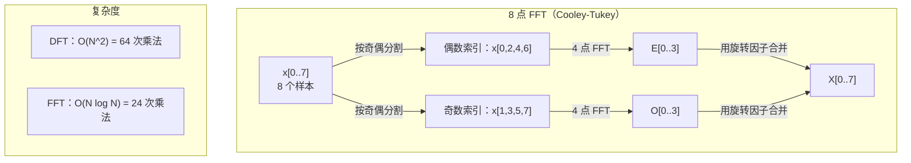
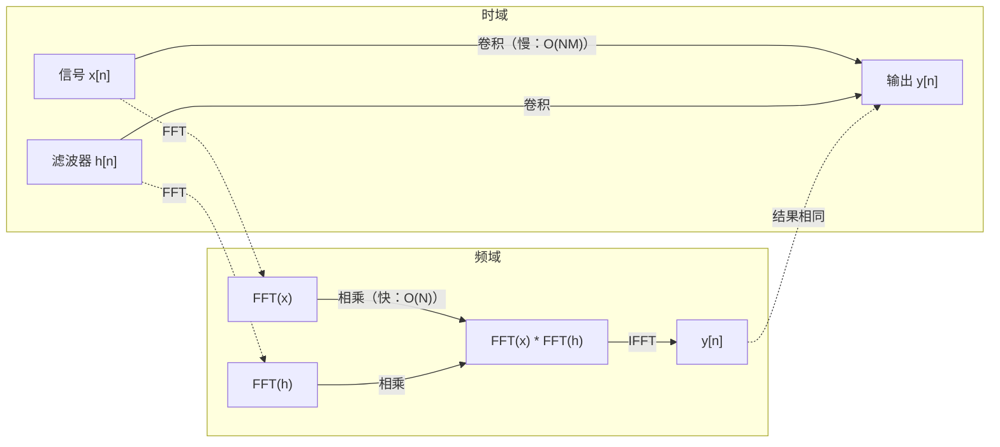

# 傅里叶变换

> 每个信号都是正弦波的叠加。傅里叶变换告诉你是哪些正弦波。

**类型：** 构建（Build）
**语言：** Python
**前置条件：** 第一阶段，第 01–04 课、第 19 课（复数）
**时长：** ~90 分钟

## 学习目标

- 从零实现 DFT，并与 O(N log N) 的 Cooley-Tukey FFT 结果进行验证
- 解读频率系数：从信号中提取振幅、相位和功率谱
- 应用卷积定理通过 FFT 乘法执行卷积
- 将傅里叶频率分解与 Transformer 位置编码和 CNN 卷积层联系起来

## 问题

音频录音是时间序列上的气压测量值。股票价格是日序列上的数值。图像是空间上的像素强度网格。所有这些都是时域（time domain）或空域（space domain）中的数据，你看到的是随某个索引变化的值。

但许多模式在时域中是不可见的。这段音频是纯音还是和弦？这个股票价格有没有周期性规律？这张图像有没有重复纹理？这些问题涉及频率内容，而时域隐藏了它。

傅里叶变换（Fourier transform）将数据从时域转换到频域（frequency domain）。它接收一个信号并将其分解为不同频率的正弦波。每条正弦波都有振幅（amplitude，强度）和相位（phase，起点位置）。傅里叶变换可以同时给出两者。

这对机器学习很重要，因为频域思维无处不在。卷积神经网络（CNN, Convolutional Neural Network）执行卷积，这在频域中就是乘法。Transformer 位置编码使用频率分解来表示位置。音频模型（语音识别、音乐生成）在频谱图（spectrogram）上运行——声音的频率表示。时间序列模型寻找周期性规律。理解傅里叶变换为你提供了处理所有这些问题的词汇。

## 概念

### DFT 的定义

给定 N 个样本 x[0], x[1], ..., x[N-1]，离散傅里叶变换（DFT, Discrete Fourier Transform）产生 N 个频率系数 X[0], X[1], ..., X[N-1]：

```
X[k] = sum_{n=0}^{N-1} x[n] * e^(-2*pi*i*k*n/N)

for k = 0, 1, ..., N-1
```

每个 X[k] 是一个复数。其模 |X[k]| 告诉你频率 k 的振幅，其相位 angle(X[k]) 告诉你该频率的相位偏移。

关键洞见：`e^(-2*pi*i*k*n/N)` 是频率为 k 的旋转相量（rotating phasor）。DFT 计算信号与 N 个等间距频率中每个频率的相关性。如果信号在频率 k 处有能量，则相关性大；否则接近零。

### 每个系数的含义

**X[0]：直流分量（DC component）。** 这是所有样本之和——与均值成比例。它表示信号的常数（零频率）偏移。

```
X[0] = sum_{n=0}^{N-1} x[n] * e^0 = sum of all samples
```

**X[k]（1 &lt;= k &lt;= N/2）：正频率。** X[k] 表示每 N 个样本 k 个周期的频率。k 越大，频率越高（振荡越快）。

**X[N/2]：奈奎斯特频率（Nyquist frequency）。** N 个样本能表示的最高频率。超过此频率会产生混叠——高频伪装成低频。

**X[k]（N/2 &lt; k &lt; N）：负频率。** 对于实值信号，X[N-k] = conj(X[k])。负频率是正频率的镜像。这就是为什么有用信息在前 N/2 + 1 个系数中。

### 逆 DFT

逆 DFT（Inverse DFT）从频率系数重建原始信号：

```
x[n] = (1/N) * sum_{k=0}^{N-1} X[k] * e^(2*pi*i*k*n/N)

for n = 0, 1, ..., N-1
```

与正向 DFT 的唯一区别：指数中的符号为正（而非负），并有 1/N 归一化因子。

逆 DFT 是完美重建——没有信息丢失。你可以从时域到频域再返回，完全没有误差。DFT 是一种基变换（change of basis），用不同的坐标系重新表达相同的信息。

### FFT：加速计算

如上定义的 DFT 是 O(N^2)：对于 N 个输出系数中的每一个，都要对 N 个输入样本求和。对于 N = 100 万，这意味着 10^12 次操作。

快速傅里叶变换（FFT, Fast Fourier Transform）以 O(N log N) 计算相同的结果。对于 N = 100 万，约需 2000 万次操作而非万亿次。这使频率分析在实践中成为可能。

Cooley-Tukey 算法（最常见的 FFT）采用分治策略：

1. 将信号分为偶数索引和奇数索引的样本。
2. 递归计算每一半的 DFT。
3. 使用"旋转因子（twiddle factors）"e^(-2*pi*i*k/N) 合并两个半长 DFT。

```
X[k] = E[k] + e^(-2*pi*i*k/N) * O[k]          for k = 0, ..., N/2 - 1
X[k + N/2] = E[k] - e^(-2*pi*i*k/N) * O[k]    for k = 0, ..., N/2 - 1

where E = DFT of even-indexed samples
      O = DFT of odd-indexed samples
```

对称性使每层递归完成 O(N) 的工作，共有 log2(N) 层。总计：O(N log N)。



FFT 要求信号长度为 2 的幂次。在实践中，信号被零填充到下一个 2 的幂次。

### 频谱分析

**功率谱（power spectrum）** 是 |X[k]|^2——每个频率系数的模的平方。它显示各频率处的能量分布。

**相位谱（phase spectrum）** 是 angle(X[k])——每个频率分量的相位偏移。大多数分析任务只关心功率谱，忽略相位。

```
Power at frequency k:  P[k] = |X[k]|^2 = X[k].real^2 + X[k].imag^2
Phase at frequency k:  phi[k] = atan2(X[k].imag, X[k].real)
```

### 频率分辨率

DFT 的频率分辨率（frequency resolution）取决于样本数 N 和采样率 fs。

```
Frequency of bin k:      f_k = k * fs / N
Frequency resolution:    delta_f = fs / N
Maximum frequency:       f_max = fs / 2  (Nyquist)
```

要分辨两个相近的频率，需要更多样本。要捕捉高频，需要更高的采样率。

### 卷积定理

这是信号处理中最重要的结论之一，与 CNN 直接相关。

**时域的卷积等于频域的逐点乘法。**

```
x * h = IFFT(FFT(x) . FFT(h))

where * is convolution and . is element-wise multiplication
```

为何重要：

- 长度为 N 和 M 的两个信号的直接卷积需要 O(N*M) 次操作。
- 基于 FFT 的卷积需要 O(N log N)：变换两者，相乘，再变换回来。
- 对于大型卷积核，基于 FFT 的卷积要快得多。
- 这正是具有大感受野的卷积层中发生的事情。

注意：DFT 计算的是循环卷积（circular convolution，信号绕回）。对于线性卷积（无绕回），在计算前将两个信号零填充到长度 N + M - 1。



### 加窗

DFT 假设信号是周期性的——它将 N 个样本视为无限重复信号的一个周期。如果信号的起点和终点值不同，就会在边界产生不连续性，表现为虚假的高频内容，称为频谱泄漏（spectral leakage）。

加窗（windowing）通过在计算 DFT 前将信号两端逐渐衰减至零来减少泄漏。

常用窗函数：

| 窗函数 | 形状 | 主瓣宽度 | 旁瓣电平 | 适用场景 |
|--------|-------|----------------|-----------------|----------|
| 矩形（Rectangular） | 平坦（无窗） | 最窄 | 最高（-13 dB） | 信号在 N 个样本内恰好是周期性的 |
| 汉宁（Hann） | 升余弦 | 适中 | 低（-31 dB） | 通用频谱分析 |
| 汉明（Hamming） | 修正余弦 | 适中 | 较低（-42 dB） | 音频处理、语音分析 |
| 布莱克曼（Blackman） | 三重余弦 | 宽 | 很低（-58 dB） | 旁瓣抑制要求严格时 |

```
Hann window:    w[n] = 0.5 * (1 - cos(2*pi*n / (N-1)))
Hamming window: w[n] = 0.54 - 0.46 * cos(2*pi*n / (N-1))
```

将窗函数与信号逐元素相乘后再做 DFT：`X = DFT(x * w)`。

### DFT 性质

| 性质 | 时域 | 频域 |
|----------|-------------|-----------------|
| 线性（Linearity） | a*x + b*y | a*X + b*Y |
| 时移（Time shift） | x[n - k] | X[f] * e^(-2*pi*i*f*k/N) |
| 频移（Frequency shift） | x[n] * e^(2*pi*i*f0*n/N) | X[f - f0] |
| 卷积（Convolution） | x * h | X * H（逐点） |
| 乘法（Multiplication） | x * h（逐点） | X * H（循环卷积，缩放 1/N） |
| 帕塞瓦尔定理（Parseval's theorem） | sum \|x[n]\|^2 | (1/N) * sum \|X[k]\|^2 |
| 共轭对称性（Conjugate symmetry，实数输入） | x[n] 为实数 | X[k] = conj(X[N-k]) |

帕塞瓦尔定理说明两个域中的总能量相同，变换前后能量守恒。

### 与位置编码的联系

原始 Transformer 使用正弦位置编码：

```
PE(pos, 2i)   = sin(pos / 10000^(2i/d_model))
PE(pos, 2i+1) = cos(pos / 10000^(2i/d_model))
```

每对维度 (2i, 2i+1) 以不同频率振荡。频率从高（维度 0,1）到低（最后几个维度）按几何级数排列。这使每个位置在所有频率带上都有唯一的模式——类似于傅里叶系数唯一标识一个信号。

这提供的关键性质：

- **唯一性：** 没有两个位置具有相同的编码。
- **有界值：** sin 和 cos 始终在 [-1, 1] 内。
- **相对位置：** 位置 p+k 的编码可以表示为位置 p 处编码的线性函数，模型可以学习关注相对位置。

### 与 CNN 的联系

卷积层通过在信号或图像上滑动学习到的滤波器（卷积核）来应用它。从数学上讲，这就是卷积运算。

根据卷积定理，这等价于：
1. 对输入做 FFT
2. 对卷积核做 FFT
3. 在频域相乘
4. 对结果做逆 FFT

标准 CNN 实现使用直接卷积（对于小的 3x3 卷积核更快）。但对于大卷积核或全局卷积，基于 FFT 的方法要快得多。某些架构（如 FNet）完全用 FFT 替代注意力机制，以 O(N log N) 而非 O(N^2) 的复杂度实现具有竞争力的精度。

### 频谱图（Spectrogram）与短时傅里叶变换（STFT）

单次 FFT 给出整个信号的频率内容，但不告诉你这些频率在何时出现。一个调频信号（频率随时间增加）和一个和弦（所有频率同时存在）可能具有相同的幅度谱。

短时傅里叶变换（STFT, Short-Time Fourier Transform）通过在信号的重叠窗口上计算 FFT 来解决这个问题。结果是频谱图：一个二维表示，一个轴是时间，另一个轴是频率。每个点的强度显示该时刻该频率的能量。

```
STFT procedure:
1. Choose a window size (e.g., 1024 samples)
2. Choose a hop size (e.g., 256 samples -- 75% overlap)
3. For each window position:
   a. Extract the windowed segment
   b. Apply a Hann/Hamming window
   c. Compute FFT
   d. Store the magnitude spectrum as one column of the spectrogram
```

频谱图是音频机器学习模型的标准输入表示。语音识别模型（Whisper、DeepSpeech）使用梅尔频谱图（mel-spectrogram）——将频率映射到梅尔刻度（更符合人类音调感知）的频谱图。

### 混叠（Aliasing）

如果信号包含高于 fs/2（奈奎斯特频率）的频率，以 fs 采样则会产生混叠副本。以 100 Hz 采样的 90 Hz 信号与 10 Hz 信号看起来完全相同，仅凭样本无法区分它们。

```
Example:
  True signal: 90 Hz sine wave
  Sampling rate: 100 Hz
  Apparent frequency: 100 - 90 = 10 Hz

  The samples from the 90 Hz signal at 100 Hz sampling rate
  are identical to the samples from a 10 Hz signal.
  No amount of math can recover the original 90 Hz.
```

这就是模数转换器（ADC）在采样前包含抗混叠滤波器（anti-aliasing filter）以去除奈奎斯特频率以上分量的原因。在机器学习中，无适当低通滤波的下采样特征图也会出现混叠——某些架构用抗混叠池化层来解决这个问题。

### 零填充不能提高频率分辨率

一个常见误解：在 FFT 前对信号进行零填充（zero-padding）可以提高频率分辨率。实际上不能。零填充在现有频率仓之间插值，使频谱看起来更平滑，但无法揭示原始样本中不存在的频率细节。

真正的频率分辨率仅取决于观测时间 T = N / fs。要分辨相差 delta_f 的两个频率，至少需要 T = 1 / delta_f 秒的数据。任何零填充都无法改变这个基本限制。

## 构建

### 第一步：从零实现 DFT

O(N^2) 的 DFT 直接按定义实现。

```python
import math

class Complex:
    ...

def dft(x):
    N = len(x)
    result = []
    for k in range(N):
        total = Complex(0, 0)
        for n in range(N):
            angle = -2 * math.pi * k * n / N
            w = Complex(math.cos(angle), math.sin(angle))
            xn = x[n] if isinstance(x[n], Complex) else Complex(x[n])
            total = total + xn * w
        result.append(total)
    return result
```

### 第二步：逆 DFT

结构相同，指数符号为正，除以 N。

```python
def idft(X):
    N = len(X)
    result = []
    for n in range(N):
        total = Complex(0, 0)
        for k in range(N):
            angle = 2 * math.pi * k * n / N
            w = Complex(math.cos(angle), math.sin(angle))
            total = total + X[k] * w
        result.append(Complex(total.real / N, total.imag / N))
    return result
```

### 第三步：FFT（Cooley-Tukey）

递归 FFT 要求长度为 2 的幂次。分成奇偶两部分，递归处理，用旋转因子合并。

```python
def fft(x):
    N = len(x)
    if N <= 1:
        return [x[0] if isinstance(x[0], Complex) else Complex(x[0])]
    if N % 2 != 0:
        return dft(x)

    even = fft([x[i] for i in range(0, N, 2)])
    odd = fft([x[i] for i in range(1, N, 2)])

    result = [Complex(0)] * N
    for k in range(N // 2):
        angle = -2 * math.pi * k / N
        twiddle = Complex(math.cos(angle), math.sin(angle))
        t = twiddle * odd[k]
        result[k] = even[k] + t
        result[k + N // 2] = even[k] - t
    return result
```

### 第四步：频谱分析辅助函数

```python
def power_spectrum(X):
    return [xk.real ** 2 + xk.imag ** 2 for xk in X]

def convolve_fft(x, h):
    N = len(x) + len(h) - 1
    padded_N = 1
    while padded_N < N:
        padded_N *= 2

    x_padded = x + [0.0] * (padded_N - len(x))
    h_padded = h + [0.0] * (padded_N - len(h))

    X = fft(x_padded)
    H = fft(h_padded)

    Y = [xk * hk for xk, hk in zip(X, H)]

    y = idft(Y)
    return [y[n].real for n in range(N)]
```

## 使用

实际工作中，使用 numpy 的 FFT，它由高度优化的 C 库支持。

```python
import numpy as np

signal = np.sin(2 * np.pi * 5 * np.arange(256) / 256)
spectrum = np.fft.fft(signal)
freqs = np.fft.fftfreq(256, d=1/256)

power = np.abs(spectrum) ** 2

positive_freqs = freqs[:len(freqs)//2]
positive_power = power[:len(power)//2]
```

对于加窗和更高级的频谱分析：

```python
from scipy.signal import windows, stft

window = windows.hann(256)
windowed = signal * window
spectrum = np.fft.fft(windowed)
```

对于卷积：

```python
from scipy.signal import fftconvolve

result = fftconvolve(signal, kernel, mode='full')
```

对于频谱图：

```python
from scipy.signal import stft

frequencies, times, Zxx = stft(signal, fs=sample_rate, nperseg=256)
spectrogram = np.abs(Zxx) ** 2
```

频谱图矩阵的形状为 (n_frequencies, n_time_frames)。每一列是一个时间窗口处的功率谱，这正是音频机器学习模型接收的输入。

## 交付

运行 `code/fourier.py` 以生成 `outputs/prompt-spectral-analyzer.md`。

## 练习

1. **纯音识别。** 创建一个在 128 Hz 采样率下采样 1 秒、频率未知（1 到 50 Hz 之间）的单正弦波信号。用你的 DFT 识别频率并验证答案。再加入标准差为 0.5 的高斯噪声并重复。噪声如何影响频谱？

2. **FFT 与 DFT 验证。** 生成长度为 64 的随机信号，分别计算 DFT（O(N^2)）和 FFT。验证所有系数在 1e-10 以内一致。对长度为 256、512、1024 和 2048 的信号分别计时，绘制 DFT 耗时与 FFT 耗时之比。

3. **卷积定理示例证明。** 创建信号 x = [1, 2, 3, 4, 0, 0, 0, 0] 和滤波器 h = [1, 1, 1, 0, 0, 0, 0, 0]。用嵌套循环直接计算循环卷积，再用 FFT（变换、相乘、逆变换）计算，验证结果一致。再通过适当零填充做线性卷积。

4. **加窗效果。** 创建一个 10 Hz 和 12 Hz 两个正弦波叠加的信号（频率非常接近），在 128 Hz 采样率下采样 1 秒。分别用无窗、汉宁窗和汉明窗计算功率谱。哪种窗函数最容易区分两个峰值？为什么？

5. **位置编码分析。** 生成 d_model = 128、max_pos = 512 的正弦位置编码。对每对位置 (p1, p2)，计算其编码的点积。证明点积只取决于 |p1 - p2|，而与绝对位置无关。随着距离增大，点积如何变化？

## 关键术语

| 术语 | 含义 |
|------|---------------|
| 离散傅里叶变换（DFT） | 将 N 个时域样本转换为 N 个频域系数。每个系数是信号与该频率复正弦波的相关性 |
| 快速傅里叶变换（FFT） | 计算 DFT 的 O(N log N) 算法。Cooley-Tukey 算法递归地按奇偶索引分割 |
| 逆 DFT（Inverse DFT） | 从频率系数重建时域信号。与 DFT 公式相同，但指数符号取反，并乘以 1/N |
| 频率仓（Frequency bin） | DFT 输出中的每个索引 k 代表频率 k*fs/N Hz。"仓"是离散的频率槽 |
| 直流分量（DC component） | X[0]，零频率系数，与信号均值成比例 |
| 奈奎斯特频率（Nyquist frequency） | fs/2，在采样率 fs 下能表示的最高频率。超过此频率的信号会产生混叠 |
| 功率谱（Power spectrum） | \|X[k]\|^2，每个频率系数的模的平方，显示各频率的能量分布 |
| 相位谱（Phase spectrum） | angle(X[k])，每个频率分量的相位偏移，分析中通常忽略 |
| 频谱泄漏（Spectral leakage） | 将非周期信号视为周期信号而产生的虚假频率内容，通过加窗减少 |
| 窗函数（Window function） | 在 DFT 前应用的渐变函数（汉宁、汉明、布莱克曼），用于减少频谱泄漏 |
| 旋转因子（Twiddle factor） | FFT 蝶形计算中用于合并子 DFT 的复指数 e^(-2*pi*i*k/N) |
| 卷积定理（Convolution theorem） | 时域的卷积等于频域的逐点乘法，是信号处理和 CNN 的基础 |
| 循环卷积（Circular convolution） | 信号绕回的卷积，这是 DFT 自然计算的结果 |
| 线性卷积（Linear convolution） | 无绕回的标准卷积，通过在 DFT 前零填充实现 |
| 帕塞瓦尔定理（Parseval's theorem） | 傅里叶变换前后总能量守恒：sum \|x[n]\|^2 = (1/N) sum \|X[k]\|^2 |
| 混叠（Aliasing） | 由于采样率不足，高于奈奎斯特频率的信号以低频形式出现 |

## 延伸阅读

- [Cooley & Tukey: An Algorithm for the Machine Calculation of Complex Fourier Series (1965)](https://www.ams.org/journals/mcom/1965-19-090/S0025-5718-1965-0178586-1/) - 改变计算领域的原始 FFT 论文
- [3Blue1Brown: But what is the Fourier Transform?](https://www.youtube.com/watch?v=spUNpyF58BY) - 傅里叶变换最佳可视化入门
- [Lee-Thorp et al.: FNet: Mixing Tokens with Fourier Transforms (2021)](https://arxiv.org/abs/2105.03824) - 在 Transformer 中用 FFT 替代自注意力
- [Smith: The Scientist and Engineer's Guide to Digital Signal Processing](http://www.dspguide.com/) - 免费在线教材，深入讲解 FFT、加窗和频谱分析
- [Vaswani et al.: Attention Is All You Need (2017)](https://arxiv.org/abs/1706.03762) - 源自傅里叶频率分解的正弦位置编码
- [Radford et al.: Whisper (2022)](https://arxiv.org/abs/2212.04356) - 使用梅尔频谱图作为输入表示的语音识别
