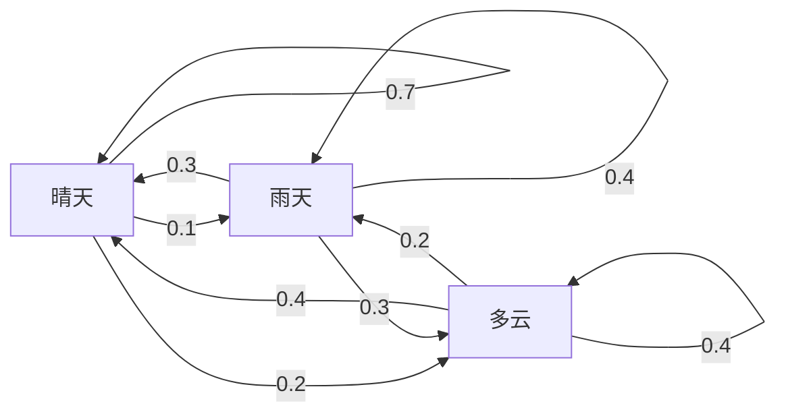
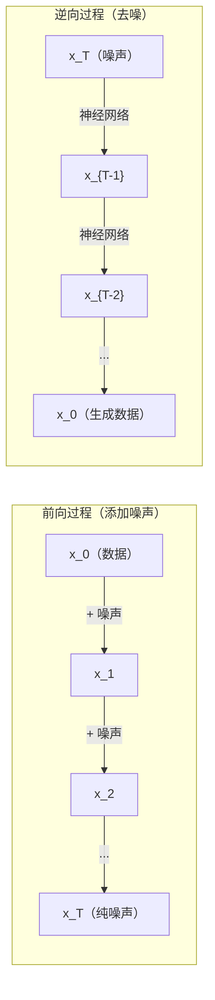

# 随机过程

> 有结构的随机性。随机游走、马尔可夫链和扩散模型背后的数学。

**类型：** 学习（Learn）
**语言：** Python
**前置条件：** 第一阶段，第 06–07 课（概率论、贝叶斯）
**时长：** ~75 分钟

## 学习目标

- 模拟一维和二维随机游走，并验证位移的 sqrt(n) 缩放规律
- 构建马尔可夫链模拟器，并通过特征分解计算其稳态分布
- 实现 Metropolis-Hastings MCMC 和朗之万动力学，用于从目标分布中采样
- 将前向扩散过程与布朗运动联系起来，解释逆过程如何生成数据

## 问题

许多 AI 系统涉及随时间演变的随机性——不是静态的随机性，而是有结构的、序列性的随机性，其中每一步都取决于之前发生的事情。

语言模型逐个生成词元（token）。每个词元依赖于前面的上下文。模型输出一个概率分布，从中采样，然后继续。这是一个随机过程（stochastic process）。

扩散模型（diffusion model）逐步向图像添加噪声，直到变成纯静态噪声，然后逆转该过程，逐步去噪直到生成新图像。前向过程是马尔可夫链（Markov chain），逆向过程是学习到的反向马尔可夫链。

强化学习（reinforcement learning）智能体在环境中采取行动。每个行动以某种概率导向新状态。智能体遵循随机策略处于随机环境中，整个过程是一个马尔可夫决策过程（Markov decision process）。

马尔可夫链蒙特卡洛（MCMC, Markov Chain Monte Carlo）采样——贝叶斯推断的支柱——构建一个稳态分布为目标后验的马尔可夫链。

所有这些都建立在四个基础概念之上：
1. 随机游走（random walk）——最简单的随机过程
2. 马尔可夫链——带有转移矩阵的有结构随机性
3. 朗之万动力学（Langevin dynamics）——带噪声的梯度下降
4. Metropolis-Hastings——从任意分布中采样

## 概念

### 随机游走

从位置 0 开始。每步抛一枚公平硬币。正面：向右移动（+1）。反面：向左移动（-1）。

经过 n 步后，位置是 n 个随机 +/-1 值之和。期望位置为 0（游走无偏）。但到原点的期望距离随 sqrt(n) 增长。

这有点反直觉。游走是公平的——没有任何方向上的漂移。但随着时间推移，它离起点越来越远。n 步后的标准差是 sqrt(n)。

```
Step 0:  Position = 0
Step 1:  Position = +1 or -1
Step 2:  Position = +2, 0, or -2
...
Step 100: Expected distance from origin ~ 10 (sqrt(100))
Step 10000: Expected distance from origin ~ 100 (sqrt(10000))
```

**在二维中**，游走以相同概率向上、下、左、右移动。相同的 sqrt(n) 缩放规律适用于到原点的距离。路径描绘出分形状的图案。

**为什么是 sqrt(n)？** 每步是 +1 或 -1，概率相等。n 步后的位置 S_n = X_1 + X_2 + ... + X_n，每个 X_i 是 +/-1。每步方差为 1，各步独立，所以 Var(S_n) = n。标准差 = sqrt(n)。由中心极限定理，S_n / sqrt(n) 收敛到标准正态分布。

这个 sqrt(n) 缩放规律在机器学习中无处不在。SGD 噪声随 1/sqrt(batch_size) 缩放。嵌入维度（embedding dimension）随 sqrt(d) 缩放。平方根是独立随机叠加的标志。

**与布朗运动（Brownian motion）的联系。** 取步长为 1/sqrt(n)、每单位时间走 n 步的随机游走。当 n 趋向无穷时，游走收敛到布朗运动 B(t)——一个连续时间过程，其中 B(t) 服从均值为 0、方差为 t 的正态分布。

布朗运动是扩散的数学基础。它模拟流体中粒子的随机抖动、股票价格的波动，以及——关键地——扩散模型中的噪声过程。

**赌徒破产问题（Gambler's ruin）。** 一个从位置 k 出发、在 0 和 N 处有吸收壁的随机游走者。在到达 0 之前到达 N 的概率是多少？对于公平游走：P(到达 N) = k/N。这出人意料地简单而优雅。它与鞅（martingale）理论相关——公平随机游走是一个鞅（期望未来值等于当前值）。

### 马尔可夫链

马尔可夫链（Markov chain）是一个根据固定概率在状态之间转移的系统。关键性质：下一状态只依赖于当前状态，而不依赖于历史。

```
P(X_{t+1} = j | X_t = i, X_{t-1} = ...) = P(X_{t+1} = j | X_t = i)
```

这是马尔可夫性质（Markov property）。意味着你可以用转移矩阵（transition matrix）P 描述所有动态：

```
P[i][j] = probability of going from state i to state j
```

P 的每一行之和为 1（你一定会去某个地方）。

**示例——天气：**

```
States: Sunny (0), Rainy (1), Cloudy (2)

P = [[0.7, 0.1, 0.2],    (if sunny: 70% sunny, 10% rainy, 20% cloudy)
     [0.3, 0.4, 0.3],    (if rainy: 30% sunny, 40% rainy, 30% cloudy)
     [0.4, 0.2, 0.4]]    (if cloudy: 40% sunny, 20% rainy, 40% cloudy)
```

从任何状态出发，经过多次转移后，状态分布收敛到稳态分布（stationary distribution）pi，其中 pi * P = pi。这是 P 对应特征值 1 的左特征向量。

对于天气链，稳态分布可能是 [0.53, 0.18, 0.29]——从长远来看，无论初始状态如何，53% 的时间是晴天。



**计算稳态分布。** 有两种方法：

1. **幂迭代法（Power method）**：将任意初始分布反复乘以 P，经足够次迭代后收敛。
2. **特征值法（Eigenvalue method）**：找到 P 对应特征值 1 的左特征向量，即 P^T 对应特征值 1 的右特征向量。

两种方法都要求马尔可夫链满足收敛条件。

**收敛条件。** 当马尔可夫链满足以下条件时，它收敛到唯一稳态分布：
- **不可约（Irreducible）**：从每个状态都能到达其他所有状态
- **非周期（Aperiodic）**：链不以固定周期循环

机器学习中遇到的大多数链都满足这两个条件。

**吸收状态（Absorbing states）。** 一旦进入就永不离开的状态（P[i][i] = 1）。吸收马尔可夫链模拟有终态的过程——结束的游戏、流失的客户、达到文本结束词元的序列。

**混合时间（Mixing time）。** 链距离稳态分布"足够近"需要多少步？形式上，总变差距离（total variation distance）低于某个阈值所需的步数。混合快意味着所需步数少。P 的谱间隙（spectral gap，1 减去第二大特征值）控制混合时间。谱间隙越大，混合越快。

### 与语言模型的联系

语言模型中的词元生成近似于马尔可夫过程。给定当前上下文，模型输出下一词元的分布。温度（temperature）控制分布的锐利程度：

```
P(token_i) = exp(logit_i / temperature) / sum(exp(logit_j / temperature))
```

- 温度 = 1.0：标准分布
- 温度 &lt; 1.0：更尖锐（更确定性）
- 温度 > 1.0：更平坦（更随机）
- 温度 -> 0：argmax（贪心）

Top-k 采样截取到概率最高的 k 个词元。Top-p（核采样，nucleus sampling）截取到累积概率超过 p 的最小词元集合。两者都修改了马尔可夫转移概率。

### 布朗运动

随机游走的连续时间极限。位置 B(t) 具有三个性质：
1. B(0) = 0
2. B(t) - B(s) 服从均值为 0、方差为 t - s 的正态分布（对 t > s）
3. 不重叠区间上的增量是独立的

布朗运动连续但处处不可微——它在每个尺度上都在抖动。路径在平面上的分形维数为 2。

在离散模拟中，通过以下方式近似布朗运动：

```
B(t + dt) = B(t) + sqrt(dt) * z,    where z ~ N(0, 1)
```

sqrt(dt) 缩放很重要，它来自于对随机游走应用中心极限定理。

### 朗之万动力学

梯度下降找到函数的最小值。朗之万动力学（Langevin dynamics）找到与 exp(-U(x)/T) 成比例的概率分布，其中 U 是能量函数，T 是温度。

```
x_{t+1} = x_t - dt * gradient(U(x_t)) + sqrt(2 * T * dt) * z_t
```

两种力作用于粒子：
1. **梯度力**（-dt * gradient(U)）：推向低能量区域（类似梯度下降）
2. **随机力**（sqrt(2*T*dt) * z）：向随机方向推（探索）

当温度 T = 0 时，这就是纯梯度下降。在高温时，它几乎是随机游走。在适当温度下，粒子探索能量曲面，在低能量区域花费更多时间。

**与扩散模型的联系。** 扩散模型的前向过程是：

```
x_t = sqrt(alpha_t) * x_{t-1} + sqrt(1 - alpha_t) * noise
```

这是一个逐渐将数据与噪声混合的马尔可夫链。经过足够多步后，x_T 是纯高斯噪声。

逆过程——从噪声回到数据——也是一个马尔可夫链，但其转移概率由神经网络学习。网络学习预测每步添加的噪声，然后将其减去。



### MCMC：马尔可夫链蒙特卡洛

有时你需要从一个可以计算（精确到常数）但无法直接采样的分布 p(x) 中采样。贝叶斯后验是经典例子——你知道似然乘以先验，但归一化常数难以处理。

**Metropolis-Hastings** 构建一个稳态分布为 p(x) 的马尔可夫链：

1. 从某个位置 x 开始
2. 从提议分布 Q(x'|x) 提议新位置 x'
3. 计算接受率：a = p(x') * Q(x|x') / (p(x) * Q(x'|x))
4. 以概率 min(1, a) 接受 x'，否则留在 x
5. 重复

如果 Q 是对称的（例如 Q(x'|x) = Q(x|x') = N(x, sigma^2)），比值简化为 a = p(x') / p(x)。你只需要概率之比——归一化常数抵消了。

该链在温和条件下保证收敛到 p(x)。但如果提议太小（随机游走）或太大（高拒绝率），收敛可能很慢。调整提议分布是 MCMC 的艺术。

**为什么它有效。** 接受率确保细致平衡（detailed balance）：处于 x 且移动到 x' 的概率等于处于 x' 且移动到 x 的概率。细致平衡意味着 p(x) 是链的稳态分布。因此经过足够多步后，样本来自 p(x)。

**实践注意事项：**
- **预热（Burn-in）**：丢弃前 N 个样本。链需要时间从起点到达稳态分布。
- **稀疏化（Thinning）**：每隔 k 个样本保留一个，以减少自相关。
- **多条链（Multiple chains）**：从不同起点运行多条链。如果它们收敛到相同分布，则有收敛的证据。
- **接受率（Acceptance rate）**：对于 d 维中的高斯提议，最优接受率约为 23%（Roberts & Rosenthal, 2001）。太高意味着链几乎不移动，太低意味着几乎全部拒绝。

### AI 中的随机过程

| 过程 | AI 应用 |
|---------|---------------|
| 随机游走 | 强化学习中的探索，Node2Vec 嵌入 |
| 马尔可夫链 | 文本生成，MCMC 采样 |
| 布朗运动 | 扩散模型（前向过程） |
| 朗之万动力学 | 基于得分的生成模型，SGLD |
| 马尔可夫决策过程 | 强化学习 |
| Metropolis-Hastings | 贝叶斯推断，后验采样 |

## 构建

### 第一步：随机游走模拟器

```python
import numpy as np

def random_walk_1d(n_steps, seed=None):
    rng = np.random.RandomState(seed)
    steps = rng.choice([-1, 1], size=n_steps)
    positions = np.concatenate([[0], np.cumsum(steps)])
    return positions


def random_walk_2d(n_steps, seed=None):
    rng = np.random.RandomState(seed)
    directions = rng.choice(4, size=n_steps)
    dx = np.zeros(n_steps)
    dy = np.zeros(n_steps)
    dx[directions == 0] = 1   # right
    dx[directions == 1] = -1  # left
    dy[directions == 2] = 1   # up
    dy[directions == 3] = -1  # down
    x = np.concatenate([[0], np.cumsum(dx)])
    y = np.concatenate([[0], np.cumsum(dy)])
    return x, y
```

一维游走存储累积和。每步是 +1 或 -1。n 步后的位置是总和。方差随 n 线性增长，所以标准差随 sqrt(n) 增长。

### 第二步：马尔可夫链

```python
class MarkovChain:
    def __init__(self, transition_matrix, state_names=None):
        self.P = np.array(transition_matrix, dtype=float)
        self.n_states = len(self.P)
        self.state_names = state_names or [str(i) for i in range(self.n_states)]

    def step(self, current_state, rng=None):
        if rng is None:
            rng = np.random.RandomState()
        probs = self.P[current_state]
        return rng.choice(self.n_states, p=probs)

    def simulate(self, start_state, n_steps, seed=None):
        rng = np.random.RandomState(seed)
        states = [start_state]
        current = start_state
        for _ in range(n_steps):
            current = self.step(current, rng)
            states.append(current)
        return states

    def stationary_distribution(self):
        eigenvalues, eigenvectors = np.linalg.eig(self.P.T)
        idx = np.argmin(np.abs(eigenvalues - 1.0))
        stationary = np.real(eigenvectors[:, idx])
        stationary = stationary / stationary.sum()
        return np.abs(stationary)
```

稳态分布是 P 对应特征值 1 的左特征向量。我们通过计算 P^T 的特征向量来求它（转置将左特征向量变为右特征向量）。

### 第三步：朗之万动力学

```python
def langevin_dynamics(grad_U, x0, dt, temperature, n_steps, seed=None):
    rng = np.random.RandomState(seed)
    x = np.array(x0, dtype=float)
    trajectory = [x.copy()]
    for _ in range(n_steps):
        noise = rng.randn(*x.shape)
        x = x - dt * grad_U(x) + np.sqrt(2 * temperature * dt) * noise
        trajectory.append(x.copy())
    return np.array(trajectory)
```

梯度将 x 推向低能量区域，噪声防止其陷入困境。在平衡时，样本的分布与 exp(-U(x)/temperature) 成比例。

### 第四步：Metropolis-Hastings

```python
def metropolis_hastings(target_log_prob, proposal_std, x0, n_samples, seed=None):
    rng = np.random.RandomState(seed)
    x = np.array(x0, dtype=float)
    samples = [x.copy()]
    accepted = 0
    for _ in range(n_samples - 1):
        x_proposed = x + rng.randn(*x.shape) * proposal_std
        log_ratio = target_log_prob(x_proposed) - target_log_prob(x)
        if np.log(rng.rand()) < log_ratio:
            x = x_proposed
            accepted += 1
        samples.append(x.copy())
    acceptance_rate = accepted / (n_samples - 1)
    return np.array(samples), acceptance_rate
```

算法提议新点，检查其概率是否更高（或以与比值成比例的概率接受），然后重复。接受率应在 23–50% 之间以确保良好混合。

## 使用

在实践中，你使用成熟的库实现这些算法。但理解其机制对调试和调优很重要。

```python
import numpy as np

rng = np.random.RandomState(42)
walk = np.cumsum(rng.choice([-1, 1], size=10000))
print(f"Final position: {walk[-1]}")
print(f"Expected distance: {np.sqrt(10000):.1f}")
print(f"Actual distance: {abs(walk[-1])}")
```

### 用 numpy 处理转移矩阵

```python
import numpy as np

P = np.array([[0.7, 0.1, 0.2],
              [0.3, 0.4, 0.3],
              [0.4, 0.2, 0.4]])

distribution = np.array([1.0, 0.0, 0.0])
for _ in range(100):
    distribution = distribution @ P

print(f"Stationary distribution: {np.round(distribution, 4)}")
```

将初始分布反复乘以 P。经过足够次迭代后，无论从哪里开始，它都收敛到稳态分布。这是找到主导左特征向量的幂法。

### 与实际框架的联系

- **PyTorch 扩散模型：** Hugging Face `diffusers` 中的 `DDPMScheduler` 实现了前向和逆向马尔可夫链
- **NumPyro / PyMC：** 使用 MCMC（NUTS 采样器，改进了 Metropolis-Hastings）进行贝叶斯推断
- **Gymnasium（强化学习）：** 环境的 step 函数定义了一个马尔可夫决策过程

### 验证马尔可夫链收敛

```python
import numpy as np

P = np.array([[0.9, 0.1], [0.3, 0.7]])

eigenvalues = np.linalg.eigvals(P)
spectral_gap = 1 - sorted(np.abs(eigenvalues))[-2]
print(f"Eigenvalues: {eigenvalues}")
print(f"Spectral gap: {spectral_gap:.4f}")
print(f"Approximate mixing time: {1/spectral_gap:.1f} steps")
```

谱间隙告诉你链忘记初始状态的速度。间隙为 0.2 意味着大约 5 步可以混合，间隙为 0.01 意味着大约 100 步。在运行长时间模拟前始终检查这一点——混合缓慢的链会浪费算力。

## 交付

本课输出：
- `outputs/prompt-stochastic-process-advisor.md` -- 帮助识别适用于给定问题的随机过程框架的提示词

## 联系

| 概念 | 应用场景 |
|---------|------------------|
| 随机游走 | Node2Vec 图嵌入，强化学习中的探索 |
| 马尔可夫链 | 大语言模型中的词元生成，MCMC 采样 |
| 布朗运动 | DDPM 中的前向扩散过程，基于 SDE 的模型 |
| 朗之万动力学 | 基于得分的生成模型，随机梯度朗之万动力学（SGLD） |
| 稳态分布 | MCMC 收敛目标，PageRank |
| Metropolis-Hastings | 贝叶斯后验采样，模拟退火 |
| 温度 | 大语言模型采样，强化学习中的玻尔兹曼探索，模拟退火 |
| 混合时间 | MCMC 收敛速度，谱间隙分析 |
| 吸收状态 | 序列结束词元，强化学习中的终态 |
| 细致平衡 | MCMC 采样器的正确性保证 |

扩散模型值得特别关注。DDPM（Ho et al., 2020）定义了前向马尔可夫链：

```
q(x_t | x_{t-1}) = N(x_t; sqrt(1-beta_t) * x_{t-1}, beta_t * I)
```

其中 beta_t 是噪声调度。经过 T 步后，x_T 近似为 N(0, I)。逆向过程由预测噪声的神经网络参数化：

```
p_theta(x_{t-1} | x_t) = N(x_{t-1}; mu_theta(x_t, t), sigma_t^2 * I)
```

生成的每一步都是学习到的马尔可夫链中的一步。理解马尔可夫链意味着理解扩散模型如何以及为何能生成数据。

SGLD（随机梯度朗之万动力学，Stochastic Gradient Langevin Dynamics）将小批量梯度下降与朗之万噪声结合。不计算完整梯度，而是使用随机估计并添加校准噪声。随着学习率衰减，SGLD 从优化过渡到采样——你免费获得近似贝叶斯后验样本。这是从神经网络获取不确定性估计的最简单方法之一。

所有这些联系的关键洞见：随机过程不只是理论工具，它们是现代 AI 系统内部的计算机制。当你调整大语言模型的温度时，你在调整一个马尔可夫链；当你训练扩散模型时，你在学习逆转一个类布朗运动过程；当你运行贝叶斯推断时，你在构建一个收敛到后验的链。

## 练习

1. **模拟 1000 次随机游走，每次 10000 步。** 绘制最终位置的分布。验证它近似于均值为 0、标准差为 sqrt(10000) = 100 的高斯分布。

2. **用马尔可夫链构建文本生成器。** 在小型语料库上训练：对每个词，统计到下一个词的转移次数，构建转移矩阵，通过链采样生成新句子。

3. **实现模拟退火**，使用 Metropolis-Hastings。从高温（几乎接受所有提议）开始，逐渐降温（只接受改进）。用它找到具有多个局部最小值的函数的最小值。

4. **比较不同温度下的朗之万动力学。** 从双井势 U(x) = (x^2 - 1)^2 中采样。低温时，样本聚集在一个井中；高温时，它们分布在两个井中。找到链在两个井之间混合的临界温度。

5. **实现前向扩散过程。** 从一维信号（例如正弦波）开始。用线性噪声调度逐步添加噪声，共 100 步。显示信号如何退化为纯噪声。然后实现一个简单的去噪器逆转该过程（即使是一个朴素的只是减去估计噪声的去噪器）。

## 关键术语

| 术语 | 通俗说法 | 实际含义 |
|------|----------------|----------------------|
| 随机游走（Random walk） | "抛硬币运动" | 位置在每步以随机增量变化的过程 |
| 马尔可夫性质（Markov property） | "无记忆性" | 未来只取决于当前状态，而不依赖历史 |
| 转移矩阵（Transition matrix） | "概率表" | P[i][j] = 从状态 i 移动到状态 j 的概率 |
| 稳态分布（Stationary distribution） | "长期平均" | 分布 pi，满足 pi*P = pi——链的平衡态 |
| 布朗运动（Brownian motion） | "随机抖动" | 随机游走的连续时间极限，B(t) ~ N(0, t) |
| 朗之万动力学（Langevin dynamics） | "带噪声的梯度下降" | 结合确定性梯度和随机扰动的更新规则 |
| MCMC | "向目标游走" | 构建稳态分布为目标分布的马尔可夫链 |
| Metropolis-Hastings | "提议与接受/拒绝" | 使用接受率确保收敛的 MCMC 算法 |
| 温度（Temperature） | "随机性旋钮" | 控制探索与利用权衡的参数 |
| 扩散过程（Diffusion process） | "噪声进，噪声出" | 前向：逐渐添加噪声；逆向：逐渐去除噪声，生成数据 |

## 延伸阅读

- **Ho, Jain, Abbeel (2020)** -- "Denoising Diffusion Probabilistic Models"（去噪扩散概率模型）。开启扩散模型革命的 DDPM 论文，清晰推导了前向和逆向马尔可夫链。
- **Song & Ermon (2019)** -- "Generative Modeling by Estimating Gradients of the Data Distribution"。使用朗之万动力学采样的基于得分的方法。
- **Roberts & Rosenthal (2004)** -- "General state space Markov chains and MCMC algorithms"。MCMC 何时以及为何有效的理论基础。
- **Norris (1997)** -- "Markov Chains"（马尔可夫链）。标准教材，涵盖收敛、稳态分布和击中时间。
- **Welling & Teh (2011)** -- "Bayesian Learning via Stochastic Gradient Langevin Dynamics"。将 SGD 与朗之万动力学结合，实现可扩展贝叶斯推断。
