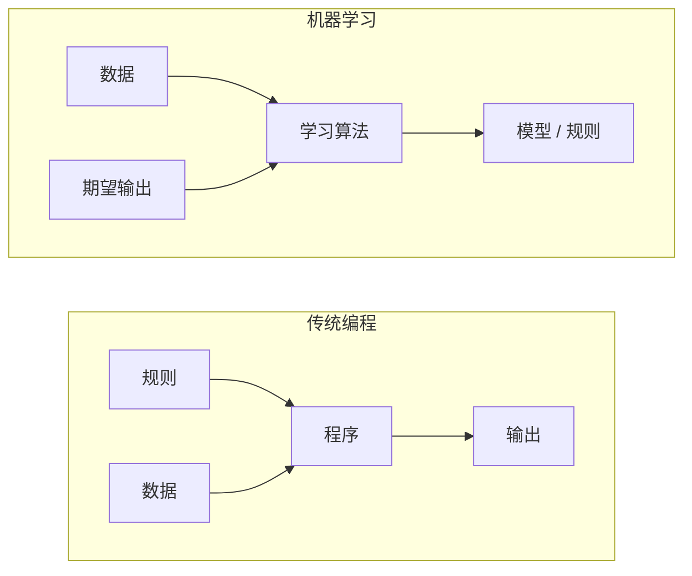
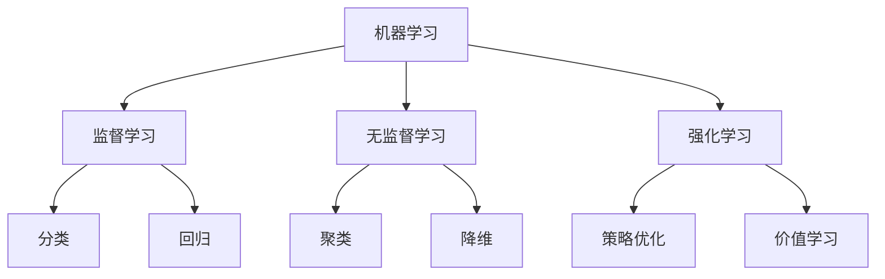
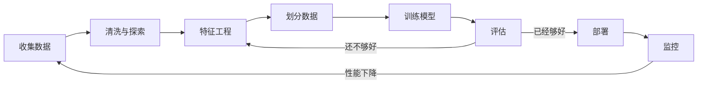
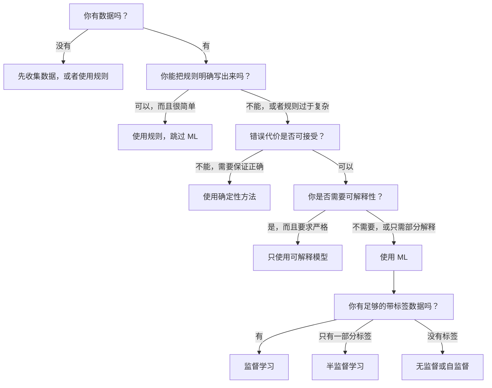

# 什么是机器学习 (Machine Learning)

> 机器学习是让计算机从数据中发现模式，而不是手工编写规则。

**类型：** 学习
**语言：** Python
**先修要求：** 阶段 1（数学基础）
**时间：** ~45 分钟

## 学习目标

- 解释监督学习 (Supervised Learning)、无监督学习 (Unsupervised Learning) 和强化学习 (Reinforcement Learning) 之间的区别，并判断某个问题适用于哪一类
- 从零实现最近质心分类器 (Nearest Centroid Classifier)，并将其与随机基线进行评估比较
- 区分分类任务与回归任务，并为每种任务选择合适的损失函数
- 评估某个业务问题是否适合用 ML 解决，还是更适合用确定性规则处理

## 问题

你想构建一个垃圾邮件过滤器。传统做法是：坐下来手写几百条规则。“如果邮件里包含 ‘FREE MONEY’，就标记为垃圾邮件；如果它有超过 3 个感叹号，也标记为垃圾邮件。”你花上几周写规则。然后垃圾邮件发送者改了措辞。你的规则失效了。你继续补更多规则。这个循环永远不会结束。

机器学习把这件事反了过来。你不再手写规则，而是给计算机成千上万封带标签的邮件（“垃圾邮件”或“非垃圾邮件”），让它自己找出规则。计算机会发现你根本想不到的模式。当垃圾邮件发送者改变策略时，你只需要用新数据重新训练，而不是重写代码。

这种从“编写规则”到“从数据中学习”的转变，就是机器学习的核心。每一个推荐引擎、语音助手、自动驾驶汽车和语言模型，都是这样工作的。

## 概念

### 从数据中学习，而不是从规则中学习

传统编程和机器学习以相反的方向解决问题。



传统编程：你来编写规则，程序将这些规则应用到数据上并产生输出。

机器学习：你提供数据和期望输出，算法自己发现规则。

训练后得到的“模型”本身就是规则，只不过这些规则以数字（权重、参数）的形式被编码。它会从见过的样本中进行泛化，对从未见过的数据作出预测。

### 机器学习的三大类型



**监督学习 (Supervised Learning)：** 你拥有输入-输出对。模型学习如何把输入映射到输出。
- “这里有 10,000 张标注为猫或狗的照片。学会区分它们。”
- “这里有房屋特征和价格。学会预测价格。”

**无监督学习 (Unsupervised Learning)：** 你只有输入，没有标签。模型自行寻找结构。
- “这里有 10,000 条客户购买历史。找出自然形成的群组。”
- “这里有 1,000 个高维数据点。在保留结构的同时把它们降到 2 维。”

**强化学习 (Reinforcement Learning)：** 一个智能体在环境中采取行动，并获得奖励或惩罚。它学习一种策略 (policy) 来最大化总奖励。
- “玩这个游戏。赢了 +1，输了 -1。自己找出策略。”
- “控制这只机械臂。拿起目标物体 +1，每浪费 1 秒 -0.01。”

你在实际工作中构建的大多数系统都使用监督学习。无监督学习常用于预处理和探索分析。强化学习则驱动游戏 AI、机器人，以及语言模型中的 RLHF。

### 三大类型之外

上面这三类划分很清晰，但现实世界里的 ML 往往界限模糊。

**半监督学习 (Semi-supervised Learning)** 会同时使用少量有标签数据和大量无标签数据。比如你可能只有 100 张带标签的医学图像，却有 100,000 张无标签图像。常见技术包括：

- **标签传播 (Label Propagation)：** 构建一张连接相似数据点的图。标签会沿着图从已标注节点传播到未标注邻居。
- **伪标签 (Pseudo-labeling)：** 先用已标注数据训练模型，再让它给无标签数据打标签，最后在全部数据上重新训练。模型会自举出自己的训练集。
- **一致性正则化 (Consistency Regularization)：** 对同一个输入及其轻微扰动版本，模型应该给出相同预测。即使没有标签，这种方法也能发挥作用。

**自监督学习 (Self-supervised Learning)** 会从数据本身中构造监督信号，完全不需要人工标签。模型根据数据结构，为自己创建预测任务。

- **掩码语言建模 (Masked Language Modeling，BERT)：** 把句子中 15% 的词遮住，训练模型预测缺失的词。“标签”直接来自原始文本。
- **对比学习 (Contrastive Learning，SimCLR)：** 取一张图像，生成两个增强版本。训练模型识别它们来自同一张图像，同时把它们与其他图像的增强版本区分开。
- **下一个词元预测 (Next-token Prediction，GPT)：** 给定前面的所有词，预测下一个词。每一份文本都可以变成一个训练样本。

这些并不是独立于三大类型之外的第四类或第五类，而是把监督与无监督思想结合起来的策略。严格来说，自监督学习依然属于监督学习（模型在预测某个目标），只是标签由数据自动生成，而不是由人标注。

### 分类 vs 回归

这是监督学习中最主要的两类任务。

| 方面 | 分类 | 回归 |
|--------|---------------|------------|
| 输出 | 离散类别 | 连续数值 |
| 示例 | “这封邮件是不是垃圾邮件？” | “这套房子会卖多少钱？” |
| 输出空间 | {cat, dog, bird} | 任意实数 |
| 损失函数 | 交叉熵、准确率 | 均方误差、MAE |
| 决策形式 | 类别之间的边界 | 拟合数据的曲线 |

分类回答“属于哪一类？”，回归回答“是多少？”。

有些问题既可以表述为分类，也可以表述为回归。预测股票是涨还是跌是分类；预测精确价格则是回归。

### ML 工作流

每一个机器学习项目都会遵循同样的流程，不管具体算法是什么。



**收集数据：** 收集原始数据。数据越多通常越好，但质量比数量更重要。

**清洗与探索：** 处理缺失值、去重、可视化分布、发现异常。这一步通常会占掉整个项目 60%–80% 的时间。

**特征工程 (Feature Engineering)：** 把原始数据转换成模型可用的特征。比如把日期拆成星期几、标准化数值列、对类别变量做编码。好的特征往往比花哨的算法更重要。

**划分数据：** 把数据分成训练集、验证集和测试集。模型在训练集上学习，你在验证集上调超参数，最后在测试集上报告最终性能。

**训练模型：** 将训练数据送入算法。算法会调整内部参数，以最小化某个损失函数。

**评估：** 在验证集/测试集上衡量性能。如果表现不够理想，就返回去尝试不同的特征、算法或超参数。

**部署：** 将模型放入生产环境，让它对新数据进行预测。

**监控：** 持续跟踪模型表现。数据分布会变化（数据漂移），模型也会退化。一旦性能下降，就要重新训练。

### 训练集、验证集和测试集划分

这是初学者最容易弄错、也最重要的概念。你必须在模型**训练过程中从未见过**的数据上评估它。否则你测到的只是记忆能力，而不是学习能力。

```mermaid
flowchart LR
    subgraph Dataset["完整数据集 (100%)"]
        direction LR
        TR[训练集 (70%)]
        VA[验证集 (15%)]
        TE[测试集 (15%)]
    end

    TR -->|训练模型| M[模型]
    M -->|调节超参数| VA
    VA -->|最终评估| TE
```

| 划分 | 用途 | 使用时机 | 典型比例 |
|-------|---------|-----------|-------------|
| 训练集 | 用于让模型学习 | 训练过程中 | 60-80% |
| 验证集 | 调超参数、比较模型 | 每次训练后 | 10-20% |
| 测试集 | 给出最终、无偏的性能估计 | 只在最后使用一次 | 10-20% |

测试集是神圣不可侵犯的。你只能看它一次。如果你不断根据测试集表现去调整模型，本质上就是在用测试集训练，最后报出来的数字就没有意义了。

对于小数据集，可以使用 k 折交叉验证 (k-fold cross-validation)：把数据分成 k 份，用其中 k-1 份训练，剩下一份验证，轮流进行，最后对结果求平均。

### 过拟合 vs 欠拟合


**欠拟合 (Underfitting)：** 模型过于简单，无法捕捉数据中的模式。就像用一条直线去拟合弯曲关系。训练误差高，测试误差也高。

**过拟合 (Overfitting)：** 模型过于复杂，把训练数据连同噪声一起记住了。就像一条弯弯曲曲的曲线穿过每一个训练点，却无法泛化到新数据。训练误差低，测试误差高。

**拟合良好：** 模型抓住了真实模式，同时没有把噪声也记住。训练误差和测试误差都相对较低。

过拟合的迹象：
- 训练准确率远高于验证准确率
- 模型在训练数据上表现很好，但在新数据上表现很差
- 增加更多训练数据后性能反而提升（说明模型之前是在记忆，不是在学习）

解决过拟合的方法：
- 获取更多训练数据
- 降低模型复杂度（更少参数、更简单结构）
- 正则化 (Regularization)：对过大的权重增加惩罚
- Dropout：训练时随机将部分神经元置零
- 提前停止 (Early Stopping)：当验证误差开始上升时停止训练

解决欠拟合的方法：
- 使用更复杂的模型
- 添加更多特征
- 减弱正则化
- 训练更久

### 偏差-方差权衡

这是解释过拟合与欠拟合的数学框架。

**偏差 (Bias)：** 来自模型错误假设的误差。如果真实关系是非线性的，而你用的是线性模型，那么偏差就会很高。高偏差会导致欠拟合。

**方差 (Variance)：** 来自模型对训练数据微小波动过于敏感的误差。高方差模型在不同训练子集上训练时，预测可能差别很大。高方差会导致过拟合。

| 模型复杂度 | 偏差 | 方差 | 结果 |
|-----------------|------|----------|--------|
| 太低（用线性模型拟合弯曲数据） | 高 | 低 | 欠拟合 |
| 刚刚好 | 中 | 中 | 泛化良好 |
| 太高（对 10 个点拟合 20 次多项式） | 低 | 高 | 过拟合 |

总误差 = Bias^2 + Variance + 不可约噪声

你无法降低不可约噪声（它来自数据本身的随机性）。你要找到的是让 bias^2 + variance 最小的那个平衡点。

### 免费午餐定理

不存在一种算法能在所有问题上都最好。一个在某类问题上表现很好的算法，换到另一类问题上可能表现很差。这就是为什么数据科学家通常会尝试多种算法，然后比较结果。

在实践中，选择取决于：
- 你有多少数据
- 有多少特征
- 关系是线性的还是非线性的
- 你是否需要可解释性
- 你能负担多少计算资源

### 什么时候**不**该使用机器学习

ML 很强大，但并不总是正确的工具。在上模型之前，先问问自己是否真的需要它。

**以下情况不要使用 ML：**

- **规则简单且定义明确。** 比如税费计算、排序算法、单位换算。如果你用几个 if 语句就能写清逻辑，引入模型只会增加复杂度，没有收益。
- **你没有数据，或者数据非常少。** ML 需要样本来学习。只有 10 个数据点时，训练不出任何有意义的东西。先去收集数据。
- **出错代价是灾难性的，而且你需要保证绝对正确。** 例如药物剂量计算、核反应堆控制、密码学验证。ML 模型是概率性的，偶尔一定会错。如果“偶尔错一次”都不能接受，就该使用确定性方法。
- **查表或启发式规则就能解决问题。** 如果一个简单阈值或规则表已经能覆盖 99% 的情况，引入 ML 只会提高维护成本，却几乎没有改进。
- **你必须解释每一次决策，而且可解释性是刚需。** 某些受监管行业（放贷、保险、刑事司法）可能要求每个决策都能完全解释。有些 ML 模型具备可解释性（线性回归、小型决策树），但大多数并不具备。
- **问题变化得比你重训模型还快。** 如果规则每天都在变，而重新训练需要一周，模型永远是过时的。

可以参考下面这个决策流程图：



## 动手构建

`code/ml_intro.py` 中的代码从零实现了一个最近质心分类器，这是最简单的 ML 算法之一。它展示了核心思想：从数据中学习，然后对新数据进行预测。

### 第 1 步：从零实现最近质心分类器

最近质心分类器会计算训练数据中每个类别的中心（均值）。预测时，它把新点分配给距离其中心最近的类别。

```python
class NearestCentroid:
    def fit(self, X, y):
        self.classes = np.unique(y)
        self.centroids = np.array([
            X[y == c].mean(axis=0) for c in self.classes
        ])

    def predict(self, X):
        distances = np.array([
            np.sqrt(((X - c) ** 2).sum(axis=1))
            for c in self.centroids
        ])
        return self.classes[distances.argmin(axis=0)]
```

这就是完整算法。`fit` 只计算两个均值；`predict` 只计算距离。没有梯度下降，没有迭代，也没有超参数。

### 第 2 步：在合成数据上训练

我们生成一个二维分类数据集，其中两个类别有轻微重叠。质心分类器会在两个类别中心之间画出一条线性决策边界。

```python
rng = np.random.RandomState(42)
X_class0 = rng.randn(100, 2) + np.array([1.0, 1.0])
X_class1 = rng.randn(100, 2) + np.array([-1.0, -1.0])
X = np.vstack([X_class0, X_class1])
y = np.array([0] * 100 + [1] * 100)
```

### 第 3 步：和基线比较

每一个 ML 模型都应该和一个极其简单的基线比较。这里的基线会随机预测类别。如果你的 ML 模型连随机猜测都赢不了，那肯定有问题。

```python
baseline_preds = rng.choice([0, 1], size=len(y_test))
baseline_acc = np.mean(baseline_preds == y_test)
```

在这个相对干净的数据集上，质心分类器的准确率应该能达到约 90% 以上；随机基线大约只有 50%。

### 为什么这很重要

最近质心分类器简单得近乎“无聊”。没有超参数、没有迭代、没有梯度下降。但它抓住了 ML 的基本模式：

1. **学习** 训练数据中的一种表示（质心）
2. **预测** 在新数据上利用这种表示（最近距离）
3. **评估** 与基线（随机猜测）进行比较

从逻辑回归到 Transformer，每一种 ML 算法都遵循同样的三步模式。表示会变得越来越复杂，但工作流本身并不会改变。

### 第 4 步：质心分类器做不到什么

最近质心分类器默认每个类别都形成一个单一团块，并且只会画线性决策边界。它会在以下情况失效：

- 类别内部存在多个簇（例如数字 “1” 可能有多种写法）
- 决策边界是非线性的（例如一个类别包裹住另一个类别）
- 特征尺度差异很大（距离会被量纲最大的特征主导）

这些局限性，正是后续你会学习的其他算法存在的原因。K 最近邻能处理多个簇；决策树能处理非线性边界；特征缩放能解决尺度问题。每一课都建立在上一课局限性的基础上。

## 使用它

`sklearn` 提供了 `NearestCentroid` 和合成数据生成器：

```python
from sklearn.neighbors import NearestCentroid
from sklearn.datasets import make_classification
from sklearn.model_selection import train_test_split

X, y = make_classification(
    n_samples=500, n_features=2, n_redundant=0,
    n_clusters_per_class=1, random_state=42
)
X_train, X_test, y_train, y_test = train_test_split(X, y, test_size=0.3)

clf = NearestCentroid()
clf.fit(X_train, y_train)
print(f"Accuracy: {clf.score(X_test, y_test):.3f}")
```

## 交付成果

本课会产出 `outputs/prompt-ml-problem-framer.md` —— 一个把模糊业务问题转成具体 ML 任务的提示词。把问题描述交给它（例如“我们想降低客户流失”或“预测下季度需求”），它会识别学习类型、定义预测目标、列出候选特征、选择成功指标、建立基线，并标出数据泄漏或类别不平衡等陷阱。在任何 ML 项目开始时都可以使用它，避免一开始就做错问题。

## 关键术语

| 术语 | 人们常说 | 实际含义 |
|------|----------------|----------------------|
| 模型 (Model) | “那个 AI” | 一个带有可学习参数的数学函数，用来把输入映射成输出 |
| 训练 (Training) | “教 AI” | 运行优化算法来调整模型参数，使预测尽可能匹配已知输出 |
| 特征 (Feature) | “一个输入列” | 数据中可测量的属性，模型利用它来做预测 |
| 标签 (Label) | “答案” | 训练样本的已知输出，用来计算误差信号 |
| 超参数 (Hyperparameter) | “你调的设置项” | 在训练前设定、控制学习过程的参数（如学习率、层数） |
| 损失函数 (Loss Function) | “模型错了多少” | 一个衡量预测输出与真实输出差距的函数，训练过程会试图将它最小化 |
| 过拟合 (Overfitting) | “它把测试都背下来了” | 模型学到了训练集特有的噪声，而不是真正可泛化的模式，因此在新数据上失败 |
| 欠拟合 (Underfitting) | “它什么都没学到” | 模型过于简单，无法捕捉数据中的真实模式 |
| 泛化 (Generalization) | “它在新数据上也有效” | 模型对未参与训练的数据依然能做出准确预测的能力 |
| 交叉验证 (Cross-validation) | “分不同块来测” | 反复把数据划分成训练/测试折并对结果求平均，从而获得更稳健的性能估计 |
| 正则化 (Regularization) | “让权重别太大” | 在损失函数中加入惩罚项，抑制模型过度复杂 |
| 数据漂移 (Data Drift) | “世界变了” | 随着时间推移，输入数据的统计分布发生变化，导致模型性能下降 |

## 练习

1. 任选一个数据集（例如 Iris、Titanic），按 70/15/15 划分为训练集、验证集、测试集。解释为什么你不应该在测试集上调超参数。
2. 列出三个真实世界问题。对每个问题，判断它属于分类、回归还是聚类，以及它是监督学习还是无监督学习。
3. 一个模型在训练集上达到 99% 准确率，但在测试集上只有 60%。诊断这个问题，并列出三种你会尝试的修复方法。

## 延伸阅读

- [An Introduction to Statistical Learning](https://www.statlearning.com/) - 免费教材，涵盖所有经典 ML 方法，并配有大量实践示例
- [Google's Machine Learning Crash Course](https://developers.google.com/machine-learning/crash-course) - 对 ML 概念的简明可视化入门
- [Scikit-learn User Guide](https://scikit-learn.org/stable/user_guide.html) - 在 Python 中实现 ML 的实用参考手册
