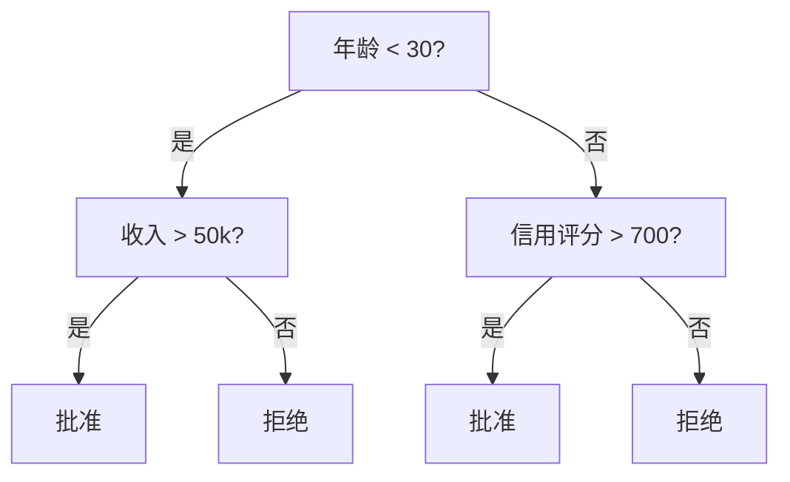
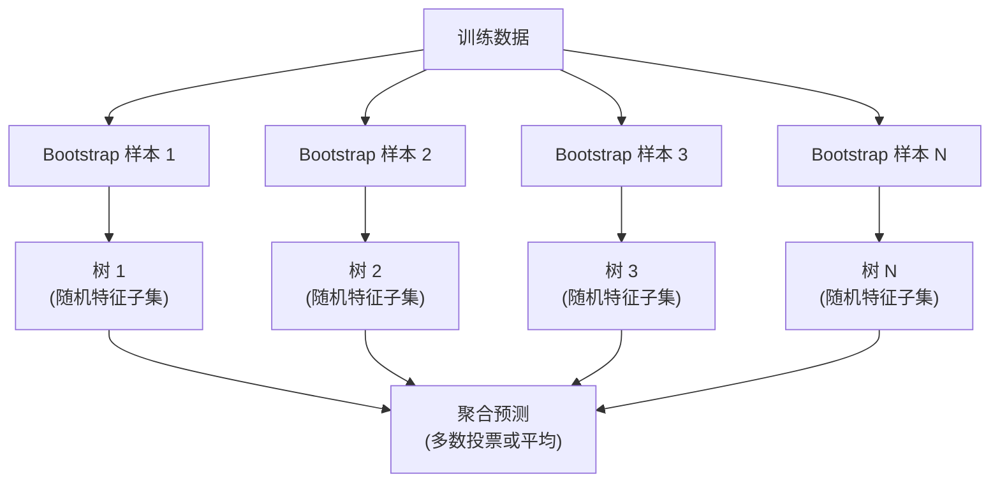

# 决策树 (Decision Trees) 与随机森林 (Random Forests)

> 决策树本质上就是一个流程图。但很多棵树组成的森林，会成为 ML 中最强大的工具之一。

**类型：** 构建
**语言：** Python
**先修要求：** 阶段 1（第 09 课 信息论，第 06 课 概率）
**时间：** ~90 分钟

## 学习目标

- 实现基尼不纯度 (Gini Impurity)、熵 (Entropy) 与信息增益 (Information Gain) 的计算，从而找到最优决策树切分
- 从零构建一个带预剪枝 (Pre-pruning) 控制（最大深度、最小样本数）的决策树分类器
- 使用自助采样 (Bootstrap Sampling) 与特征随机化构建随机森林，并解释它为什么能降低方差
- 比较 MDI 特征重要性与置换重要性 (Permutation Importance)，并识别 MDI 何时会产生偏差

## 问题

你手上有表格数据。每一行是一个样本，每一列是一个特征，还有一列是你想预测的目标。你当然可以直接扔给神经网络。但在表格数据上，树模型（决策树、随机森林、梯度提升树）通常会稳定胜过深度学习。结构化数据上的 Kaggle 比赛，往往是 XGBoost 和 LightGBM 在统治，而不是 Transformer。

为什么？树模型能在无需预处理的情况下同时处理数值特征和类别特征；它们能在无需特征工程的情况下处理非线性关系；而且它们具有可解释性：你可以直接看树的结构，知道一个预测为什么会产生。随机森林则是许多树的平均，它对中等规模数据集上的过拟合有很强的抵抗力。

这一课会先通过递归切分从零构建决策树，然后在此基础上构建随机森林。你会实现切分准则背后的数学（基尼不纯度、熵、信息增益），并理解为什么一组弱学习器组合起来会变成强学习器。

## 概念

### 决策树到底在做什么

决策树通过一连串的“是/否”问题，把特征空间切分成一个个矩形区域。



每个内部节点都会测试某个特征是否超过阈值；每个叶节点给出一个预测。要对一个新样本分类时，你从根节点开始，沿着分支往下走，直到到达某个叶节点。

树是自顶向下构建的：在每个节点上，选择能最好地把数据分开的特征和阈值。“最好”由切分准则来定义。

### 切分准则：如何度量不纯

在每个节点上，我们有一组样本。我们希望把它们切开后，得到的子节点尽可能“纯”，也就是每个子节点里尽量只包含一种类别。

**基尼不纯度 (Gini Impurity)** 衡量的是：如果你按照该节点的类别分布随机给一个样本贴标签，这个样本被错分的概率有多大。

```
Gini(S) = 1 - sum(p_k^2)

where p_k is the proportion of class k in set S.
```

对于纯节点（全是同一类），Gini = 0。对于二分类且类别比例 50/50 的节点，Gini = 0.5。越低越好。

```
Example: 6 cats, 4 dogs

Gini = 1 - (0.6^2 + 0.4^2) = 1 - (0.36 + 0.16) = 0.48
```

**熵 (Entropy)** 衡量节点中的信息量（无序程度）。这在阶段 1 第 09 课中已经讲过。

```
Entropy(S) = -sum(p_k * log2(p_k))
```

对于纯节点，熵 = 0。对于 50/50 的二分类节点，熵 = 1.0。越低越好。

```
Example: 6 cats, 4 dogs

Entropy = -(0.6 * log2(0.6) + 0.4 * log2(0.4))
        = -(0.6 * -0.737 + 0.4 * -1.322)
        = 0.442 + 0.529
        = 0.971 bits
```

**信息增益 (Information Gain)** 是切分前后不纯度（熵或 Gini）的下降量。

```
IG(S, feature, threshold) = Impurity(S) - weighted_avg(Impurity(S_left), Impurity(S_right))

where the weights are the proportions of samples in each child.
```

每个节点上的贪心算法是：枚举每个特征和每个可能的阈值，选择让信息增益最大的那一组 `(feature, threshold)`。

### 切分是如何发生的

对于当前节点上有 `n` 个特征、`m` 个样本的数据集：

1. 对每个特征 `j`（`j = 1` 到 `n`）：
   - 按特征 `j` 的值对样本排序
   - 用相邻且不同的取值中点作为候选阈值逐一尝试
   - 计算每个阈值对应的信息增益
2. 选择信息增益最大的特征和阈值
3. 把数据切分为左子树（`feature <= threshold`）和右子树（`feature > threshold`）
4. 对每个子节点递归重复上述过程

这种贪心方法不能保证找到全局最优树。寻找最优决策树是 NP-hard 问题。但在实践中，贪心切分通常足够有效。

### 停止条件

如果没有停止条件，树会一直生长，直到每个叶节点都是纯的（每个叶子只剩一个样本）。这会把训练数据完美记住，却产生糟糕的泛化能力。

**预剪枝 (Pre-pruning)** 会在树完全长成之前停止：
- 最大深度：当树达到指定深度时停止切分
- 叶节点最小样本数：如果某节点样本数小于 `k`，就停止
- 最小信息增益：若最佳切分带来的不纯度改善低于某阈值，则停止
- 最大叶节点数：限制叶节点总数

**后剪枝 (Post-pruning)** 先让树长满，再回头裁剪：
- 代价复杂度剪枝（`scikit-learn` 使用的方法）：加入与叶节点数成比例的惩罚。惩罚越大，树越小
- 误差减少剪枝：如果删除某个子树不会让验证误差上升，就把它删掉

预剪枝更简单、更快；后剪枝通常能得到更好的树，因为它不会过早终止那些未来可能带来更有效切分的分支。

### 用于回归的决策树

在回归任务中，叶节点的预测值是该叶节点中目标值的均值。切分准则也会变化：

**方差下降 (Variance Reduction)** 用来替代信息增益：

```
VR(S, feature, threshold) = Var(S) - weighted_avg(Var(S_left), Var(S_right))
```

选择能最大程度降低方差的切分。树会把输入空间切成若干区域，并在每个区域输出一个常数（通常是均值）。

### 随机森林：集成的力量

单棵决策树的方差很高。数据稍微变化一点，长出来的树就可能完全不同。随机森林通过对很多棵树求平均来解决这个问题。



有两个随机性来源让这些树彼此不同：

**Bagging（Bootstrap Aggregating）：** 每棵树都在一个 bootstrap 样本上训练，也就是从训练数据中有放回随机采样得到的数据集。平均而言，每个 bootstrap 中大约只会出现原始样本的 63%（其余样本成为 out-of-bag，可用于验证）。

**特征随机化：** 每次切分时，只考虑随机选出的一部分特征。对于分类，默认通常是 `sqrt(n_features)`；对于回归，常见是 `n_features/3`。这样可以避免所有树都依赖同一个主导特征做切分。

关键洞察是：对许多彼此去相关的树求平均，可以在几乎不增加偏差的前提下降低方差。单棵树可能很普通，但整个集成会很强。

### 特征重要性

随机森林天然会给出特征重要性分数。最常见的方法是：

**不纯度平均下降 (Mean Decrease in Impurity, MDI)：** 对每个特征，把它在所有树、所有节点上带来的不纯度下降量加总起来。越早发生、下降越大的切分，其特征越重要。

```
importance(feature_j) = sum over all nodes where feature_j is used:
    (n_samples_at_node / n_total_samples) * impurity_decrease
```

这种方法很快（训练过程中就能得到），但会偏向取值数很多的特征，以及拥有大量候选切分点的特征。

**置换重要性 (Permutation Importance)** 是另一种选择：把某个特征的取值随机打乱，然后测量模型准确率下降了多少。它更可靠，但更慢。

### 什么时候树模型会胜过神经网络

在表格数据上，树和森林通常比神经网络更强。原因包括：

| 因素 | 树模型 | 神经网络 |
|--------|-------|----------------|
| 混合类型（数值 + 类别） | 原生支持 | 需要编码 |
| 小数据集（&lt; 10k 行） | 表现好 | 容易过拟合 |
| 特征交互 | 通过切分自动发现 | 需要手工设计结构 |
| 可解释性 | 完全透明 | 黑盒 |
| 训练时间 | 分钟级 | 小时级 |
| 超参数敏感度 | 低 | 高 |

当数据具有空间结构或序列结构（图像、文本、音频）时，神经网络会胜出。对于扁平的特征表，树模型往往就是默认选项。

## 动手构建

### 第 1 步：基尼不纯度与熵

从零实现这两个切分准则，并验证它们会对“什么是好切分”给出相近判断。

```python
import math

def gini_impurity(labels):
    n = len(labels)
    if n == 0:
        return 0.0
    counts = {}
    for label in labels:
        counts[label] = counts.get(label, 0) + 1
    return 1.0 - sum((c / n) ** 2 for c in counts.values())

def entropy(labels):
    n = len(labels)
    if n == 0:
        return 0.0
    counts = {}
    for label in labels:
        counts[label] = counts.get(label, 0) + 1
    return -sum(
        (c / n) * math.log2(c / n) for c in counts.values() if c > 0
    )
```

### 第 2 步：寻找最佳切分

尝试每个特征和每个阈值，返回信息增益最高的那一个。

```python
def information_gain(parent_labels, left_labels, right_labels, criterion="gini"):
    measure = gini_impurity if criterion == "gini" else entropy
    n = len(parent_labels)
    n_left = len(left_labels)
    n_right = len(right_labels)
    if n_left == 0 or n_right == 0:
        return 0.0
    parent_impurity = measure(parent_labels)
    child_impurity = (
        (n_left / n) * measure(left_labels) +
        (n_right / n) * measure(right_labels)
    )
    return parent_impurity - child_impurity
```

### 第 3 步：构建 `DecisionTree` 类

实现递归切分、预测以及特征重要性跟踪。

```python
class DecisionTree:
    def __init__(self, max_depth=None, min_samples_split=2,
                 min_samples_leaf=1, criterion="gini",
                 max_features=None):
        self.max_depth = max_depth
        self.min_samples_split = min_samples_split
        self.min_samples_leaf = min_samples_leaf
        self.criterion = criterion
        self.max_features = max_features
        self.tree = None
        self.feature_importances_ = None

    def fit(self, X, y):
        self.n_features = len(X[0])
        self.feature_importances_ = [0.0] * self.n_features
        self.n_samples = len(X)
        self.tree = self._build(X, y, depth=0)
        total = sum(self.feature_importances_)
        if total > 0:
            self.feature_importances_ = [
                fi / total for fi in self.feature_importances_
            ]

    def predict(self, X):
        return [self._predict_one(x, self.tree) for x in X]
```

### 第 4 步：构建 `RandomForest` 类

实现 bootstrap 采样、特征随机化和多数投票。

```python
class RandomForest:
    def __init__(self, n_trees=100, max_depth=None,
                 min_samples_split=2, max_features="sqrt",
                 criterion="gini"):
        self.n_trees = n_trees
        self.max_depth = max_depth
        self.min_samples_split = min_samples_split
        self.max_features = max_features
        self.criterion = criterion
        self.trees = []

    def fit(self, X, y):
        n = len(X)
        for _ in range(self.n_trees):
            indices = [random.randint(0, n - 1) for _ in range(n)]
            X_boot = [X[i] for i in indices]
            y_boot = [y[i] for i in indices]
            tree = DecisionTree(
                max_depth=self.max_depth,
                min_samples_split=self.min_samples_split,
                max_features=self.max_features,
                criterion=self.criterion,
            )
            tree.fit(X_boot, y_boot)
            self.trees.append(tree)

    def predict(self, X):
        all_preds = [tree.predict(X) for tree in self.trees]
        predictions = []
        for i in range(len(X)):
            votes = {}
            for preds in all_preds:
                v = preds[i]
                votes[v] = votes.get(v, 0) + 1
            predictions.append(max(votes, key=votes.get))
        return predictions
```

完整实现（含所有辅助方法）见 `code/trees.py`。

## 使用它

使用 `scikit-learn` 时，训练一个随机森林只要三行：

```python
from sklearn.ensemble import RandomForestClassifier
from sklearn.datasets import load_iris
from sklearn.model_selection import train_test_split

X, y = load_iris(return_X_y=True)
X_train, X_test, y_train, y_test = train_test_split(X, y, random_state=42)

rf = RandomForestClassifier(n_estimators=100, random_state=42)
rf.fit(X_train, y_train)
print(f"Accuracy: {rf.score(X_test, y_test):.4f}")
print(f"Feature importances: {rf.feature_importances_}")
```

在实践中，梯度提升树（XGBoost、LightGBM、CatBoost）往往比随机森林更强，因为它们是按顺序构建树，每一棵树都专门去修正前一棵树的错误。但随机森林更不容易被错误配置，几乎不需要太多超参数调优。

## 交付成果

本课会产出 `outputs/prompt-tree-interpreter.md` —— 一个用于向业务相关方解释决策树切分的提示词。把一棵训练好的树结构（深度、特征、切分阈值、准确率）输入进去，它就会把模型翻译成自然语言规则、给出特征重要性排序、指出过拟合或数据泄漏风险，并推荐下一步行动。任何时候只要你需要向不会看代码的人解释树模型，都可以用它。

## 练习

1. 在一个二维、3 类的数据集上训练一棵单独的决策树。手工追踪每一次切分，并画出矩形决策边界。比较 `max_depth=2` 和 `max_depth=10` 时的边界差异。
2. 为回归树实现方差下降切分。生成 `y = sin(x) + noise` 的 200 个点，并拟合你的回归树。把树的分段常数预测与真实曲线画在一起比较。
3. 构建包含 1、5、10、50 和 200 棵树的随机森林。绘制训练准确率和测试准确率随树数量变化的曲线。观察测试准确率会趋于平台，但不会下降（森林对过拟合更有抵抗力）。
4. 在 5 个不同数据集上比较使用基尼不纯度和熵作为切分准则的差异。测量准确率和树深度。大多数情况下，它们的结果几乎一样。解释原因。
5. 实现置换重要性。把它和 MDI 重要性放到同一个数据集上比较：其中有一个特征只是随机噪声，但取值种类很多。MDI 会把这个噪声特征排得很高，置换重要性则不会。

## 关键术语

| 术语 | 人们常说 | 实际含义 |
|------|----------------|----------------------|
| 决策树 (Decision Tree) | “用于预测的流程图” | 通过一连串 if/else 切分，把特征空间划分成矩形区域的模型 |
| 基尼不纯度 (Gini Impurity) | “节点有多混” | 在某节点上随机选一个样本并按该节点分布贴标签时，被错分的概率。0 = 纯，0.5 = 二分类下最不纯 |
| 熵 (Entropy) | “节点中的混乱度” | 节点中的信息量。0 = 纯，1.0 = 二分类下最大不确定性。来自信息论 |
| 信息增益 (Information Gain) | “一个切分有多好” | 切分后不纯度降低的幅度。决策树做贪心选择时的准则 |
| 预剪枝 (Pre-pruning) | “提前让树停下” | 通过设置最大深度、最小样本数或最小增益阈值，在树长满之前就停止生长 |
| 后剪枝 (Post-pruning) | “长完之后再修剪” | 先让树完全长成，再删除那些无法提升验证性能的子树 |
| Bagging | “在随机子集上训练” | Bootstrap Aggregating。每个模型都在不同的有放回随机样本上训练 |
| 随机森林 (Random Forest) | “一堆树” | 由多棵决策树组成的集成，每棵树都使用 bootstrap 样本，并在每次切分时只看随机特征子集 |
| 特征重要性 (MDI) | “哪些特征最重要” | 每个特征在所有树、所有节点上带来的不纯度下降总和 |
| 置换重要性 (Permutation Importance) | “打乱再看影响” | 随机打乱某特征后模型准确率下降的程度。对噪声特征通常比 MDI 更可靠 |
| 方差下降 (Variance Reduction) | “信息增益的回归版” | 回归树中对应信息增益的准则：选择能最大幅度降低目标方差的切分 |
| Bootstrap 样本 | “可重复的随机样本” | 从原始数据集中有放回抽样得到的样本集，大小相同，但会有重复 |

## 延伸阅读

- [Breiman: Random Forests (2001)](https://link.springer.com/article/10.1023/A:1010933404324) - 随机森林的原始论文
- [Grinsztajn et al.: Why do tree-based models still outperform deep learning on tabular data? (2022)](https://arxiv.org/abs/2207.08815) - 严谨比较树模型与神经网络在表格任务上的表现
- [scikit-learn Decision Trees documentation](https://scikit-learn.org/stable/modules/tree.html) - 含可视化工具的实用指南
- [XGBoost: A Scalable Tree Boosting System (Chen & Guestrin, 2016)](https://arxiv.org/abs/1603.02754) - 主导 Kaggle 的梯度提升树经典论文
