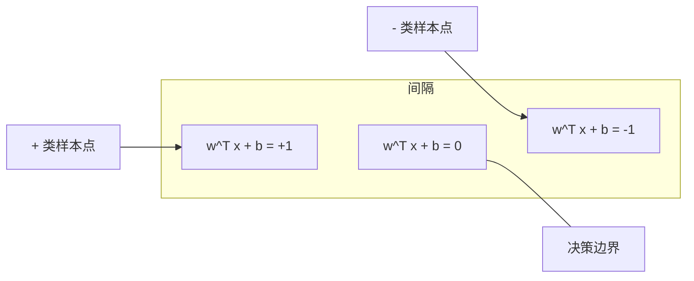
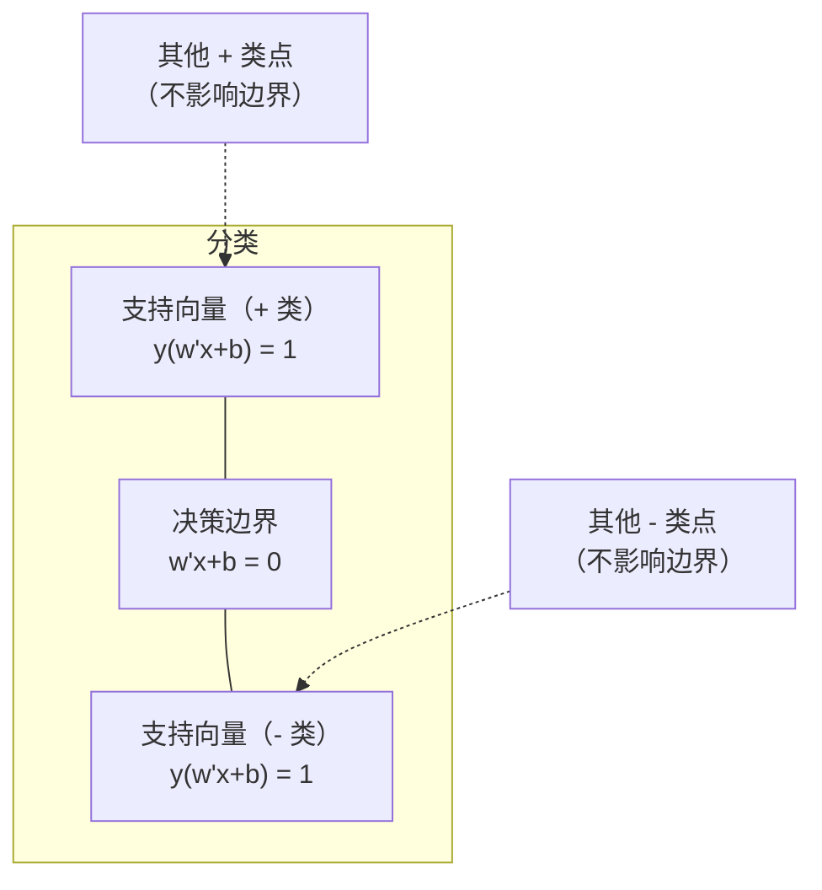
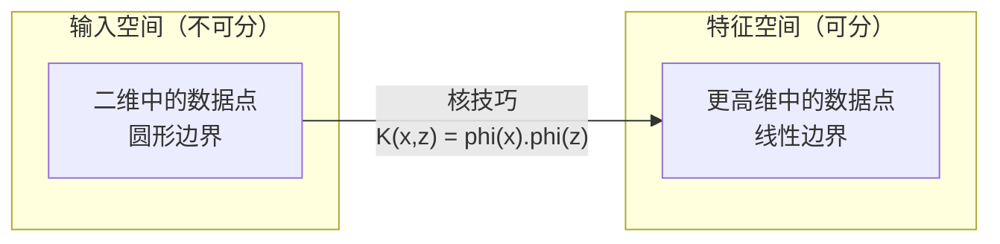

# 支持向量机 (Support Vector Machines)

> 在两类样本之间找到最宽的一条“街道”。这几乎就是全部思想。

**类型：** 构建
**语言：** Python
**先修要求：** 阶段 1（第 08 课 优化、第 14 课 范数与距离、第 18 课 凸优化）
**时间：** ~90 分钟

## 学习目标

- 使用铰链损失 (Hinge Loss) 和原始形式 (Primal Formulation) 上的梯度下降，从零实现线性 SVM
- 解释最大间隔原则 (Maximum Margin Principle)，并从训练后的模型中识别支持向量 (Support Vectors)
- 比较线性核、多项式核和 RBF 核，并解释核技巧 (Kernel Trick) 如何避免显式高维映射
- 评估参数 `C` 在间隔宽度与分类错误之间控制的权衡

## 问题

你有两类数据点，需要画一条线（或者更一般地说，一个超平面）把它们分开。能做到这件事的线有无穷多条。那你该选哪一条？

答案是：选间隔最大的那一条。所谓间隔 (margin)，就是决策边界与两侧最近数据点之间的距离。间隔越宽，分类器越“自信”，在未见数据上的泛化通常也越好。

这种直觉引出了支持向量机，它是 ML 中数学上最优雅的算法之一。在深度学习出现之前，SVM 曾经是最主流的分类方法；即使到了今天，在小数据集、高维数据，以及那些需要理论保证、希望模型严谨可解释的问题上，它依然经常是最佳选择。

SVM 和阶段 1 直接相连：它的优化问题是凸的（第 18 课），间隔用范数来衡量（第 14 课），而核技巧利用点积来处理非线性边界，却完全不需要真的在高维空间里计算。

## 概念

### 最大间隔分类器

给定线性可分的数据，标签 `y_i` 取值为 `{-1, +1}`，特征向量为 `x_i`。我们想找到一个超平面 `w^T x + b = 0`，把两类样本分开。

点 `x_i` 到超平面的距离是：

```
distance = |w^T x_i + b| / ||w||
```

对于一个被正确分类的点，有：`y_i * (w^T x_i + b) > 0`。间隔是超平面到两侧最近点距离的两倍。



优化问题写作：

```
maximize    2 / ||w||     (the margin width)
subject to  y_i * (w^T x_i + b) >= 1  for all i
```

等价地（最小化 `||w||^2` 更容易优化）：

```
minimize    (1/2) ||w||^2
subject to  y_i * (w^T x_i + b) >= 1  for all i
```

这是一个凸二次规划问题。它有唯一的全局解。恰好落在间隔边界上的那些点（即满足 `y_i * (w^T x_i + b) = 1`）就是支持向量。只有这些点决定了决策边界。任意移动或删除非支持向量，边界都不会变化。

### 支持向量：真正关键的少数点



大多数训练点其实都无关紧要。真正重要的只有支持向量。这也是 SVM 在预测阶段更节省内存的原因：你只需要存储支持向量，而不是整个训练集。

支持向量的数量还能给出泛化误差的一个上界。相对于数据集大小来说，支持向量越少，通常意味着泛化越好。

### 软间隔：用 `C` 参数处理噪声

现实数据很少能完美线性可分。有些点可能落在边界另一侧，或者落在间隔内部。软间隔 (Soft Margin) 形式通过引入松弛变量，允许这些违反情况存在。

```
minimize    (1/2) ||w||^2 + C * sum(xi_i)
subject to  y_i * (w^T x_i + b) >= 1 - xi_i
            xi_i >= 0  for all i
```

松弛变量 `xi_i` 衡量的是第 `i` 个点违反间隔约束的程度。`C` 控制权衡：

| `C` 的取值 | 行为 |
|---------|----------|
| 大 `C` | 严厉惩罚违反间隔的点。间隔更窄、误分类更少，但更容易过拟合 |
| 小 `C` | 允许更多违反。间隔更宽、误分类更多，但更容易欠拟合 |

`C` 可以理解为正则化强度的倒数。`C` 大 = 正则化弱；`C` 小 = 正则化强。

### 铰链损失：SVM 的损失函数

软间隔 SVM 还可以改写成无约束优化问题：

```
minimize    (1/2) ||w||^2 + C * sum(max(0, 1 - y_i * (w^T x_i + b)))
```

其中 `max(0, 1 - y_i * f(x_i))` 就是铰链损失。当一个点被正确分类且落在间隔外时，损失为 0；当一个点落在间隔内或者被错分时，损失是线性的。

```
Hinge loss for a single point:

loss
  |
  |   |    |     |      |     \_______________
  |
  +-----|-----|-------->  y * f(x)
       0     1

Zero loss when y*f(x) >= 1 (correctly classified, outside margin).
Linear penalty when y*f(x) < 1.
```

把它和逻辑损失（逻辑回归）比较一下：

```
Hinge:     max(0, 1 - y*f(x))          Hard cutoff at margin
Logistic:  log(1 + exp(-y*f(x)))        Smooth, never exactly zero
```

铰链损失会产生稀疏解（只有支持向量的贡献非零）；逻辑损失则会让所有数据点都参与贡献。这使得 SVM 在预测时通常更节省内存。

### 用梯度下降训练线性 SVM

你可以不去求解受约束的二次规划，而是直接在铰链损失加 L2 正则化上做梯度下降，来训练一个线性 SVM：

```
L(w, b) = (lambda/2) * ||w||^2 + (1/n) * sum(max(0, 1 - y_i * (w^T x_i + b)))

Gradient with respect to w:
  If y_i * (w^T x_i + b) >= 1:  dL/dw = lambda * w
  If y_i * (w^T x_i + b) < 1:   dL/dw = lambda * w - y_i * x_i

Gradient with respect to b:
  If y_i * (w^T x_i + b) >= 1:  dL/db = 0
  If y_i * (w^T x_i + b) < 1:   dL/db = -y_i
```

这叫做原始形式。它每个 epoch 的复杂度是 `O(n * d)`，其中 `n` 是样本数，`d` 是特征数。对于大规模、稀疏、高维数据（如文本分类），这种方法很快。

### 对偶形式与核技巧

SVM 问题的拉格朗日对偶（来自阶段 1 第 18 课，KKT 条件）是：

```
maximize    sum(alpha_i) - (1/2) * sum_ij(alpha_i * alpha_j * y_i * y_j * (x_i . x_j))
subject to  0 <= alpha_i <= C
            sum(alpha_i * y_i) = 0
```

对偶问题只涉及数据点之间的点积 `x_i . x_j`。这就是关键洞察。只要把每一个点积替换成核函数 `K(x_i, x_j)`，SVM 就能在**完全不显式计算**高维变换的情况下学习非线性边界。

```
Linear kernel:      K(x, z) = x . z
Polynomial kernel:  K(x, z) = (x . z + c)^d
RBF (Gaussian):     K(x, z) = exp(-gamma * ||x - z||^2)
```

RBF 核会把数据映射到一个无限维空间。输入空间中彼此接近的点，其核值接近 1；彼此远离的点，其核值接近 0。它可以学习任意平滑的决策边界。



核技巧会直接计算高维空间里的点积，而不需要真的把数据映射到那里。比如在 `D` 维空间里，一个 `d` 次多项式核对应的显式特征空间维度是 `O(D^d)`；但 `K(x, z)` 本身只需要 `O(D)` 时间就能算出来。

### 用于回归的 SVM（SVR）

支持向量回归 (Support Vector Regression, SVR) 会在数据周围拟合一条宽度为 `epsilon` 的“管道”。落在管道内部的点损失为 0，落在外部的点则按线性方式受罚。

```
minimize    (1/2) ||w||^2 + C * sum(xi_i + xi_i*)
subject to  y_i - (w^T x_i + b) <= epsilon + xi_i
            (w^T x_i + b) - y_i <= epsilon + xi_i*
            xi_i, xi_i* >= 0
```

参数 `epsilon` 控制管道宽度。管道越宽 = 支持向量越少 = 拟合更平滑；管道越窄 = 支持向量越多 = 拟合更紧。

### 为什么 SVM 被深度学习超越（以及它何时仍然更强）

从 1990 年代末到 2010 年代初，SVM 几乎统治了 ML。但后来深度学习在多个方面超越了它：

| 因素 | SVM | 深度学习 |
|--------|------|---------------|
| 特征工程 | 需要手工做 | 能自动学习特征 |
| 可扩展性 | 核方法通常是 `O(n^2)` 到 `O(n^3)` | 使用 SGD 时每个 epoch 约为 `O(n)` |
| 图像 / 文本 / 音频 | 需要手工特征 | 能直接从原始数据学习 |
| 大数据集（>100k） | 较慢 | 扩展性好 |
| GPU 加速 | 收益有限 | 提速巨大 |

但在以下场景里，SVM 依然常常更强：
- 小数据集（几百到几千个样本）
- 高维稀疏数据（如带 TF-IDF 特征的文本）
- 需要数学保证（如间隔界）
- 训练时间必须非常短（线性 SVM 非常快）
- 具有清晰间隔结构的二分类问题
- 异常检测（单类 SVM）

## 动手构建

### 第 1 步：铰链损失与梯度

基础部分。先计算一个 batch 上的铰链损失及其梯度。

```python
def hinge_loss(X, y, w, b):
    n = len(X)
    total_loss = 0.0
    for i in range(n):
        margin = y[i] * (dot(w, X[i]) + b)
        total_loss += max(0.0, 1.0 - margin)
    return total_loss / n
```

### 第 2 步：通过梯度下降训练线性 SVM

通过最小化正则化铰链损失来训练。不需要 QP 求解器。

```python
class LinearSVM:
    def __init__(self, lr=0.001, lambda_param=0.01, n_epochs=1000):
        self.lr = lr
        self.lambda_param = lambda_param
        self.n_epochs = n_epochs
        self.w = None
        self.b = 0.0

    def fit(self, X, y):
        n_features = len(X[0])
        self.w = [0.0] * n_features
        self.b = 0.0

        for epoch in range(self.n_epochs):
            for i in range(len(X)):
                margin = y[i] * (dot(self.w, X[i]) + self.b)
                if margin >= 1:
                    self.w = [wj - self.lr * self.lambda_param * wj
                              for wj in self.w]
                else:
                    self.w = [wj - self.lr * (self.lambda_param * wj - y[i] * X[i][j])
                              for j, wj in enumerate(self.w)]
                    self.b -= self.lr * (-y[i])

    def predict(self, X):
        return [1 if dot(self.w, x) + self.b >= 0 else -1 for x in X]
```

### 第 3 步：核函数

实现线性核、多项式核和 RBF 核。

```python
def linear_kernel(x, z):
    return dot(x, z)

def polynomial_kernel(x, z, degree=3, c=1.0):
    return (dot(x, z) + c) ** degree

def rbf_kernel(x, z, gamma=0.5):
    diff = [xi - zi for xi, zi in zip(x, z)]
    return math.exp(-gamma * dot(diff, diff))
```

### 第 4 步：识别间隔与支持向量

训练完成后，识别哪些点是支持向量，并计算间隔宽度。

```python
def find_support_vectors(X, y, w, b, tol=1e-3):
    support_vectors = []
    for i in range(len(X)):
        margin = y[i] * (dot(w, X[i]) + b)
        if abs(margin - 1.0) < tol:
            support_vectors.append(i)
    return support_vectors
```

完整实现与所有演示见 `code/svm.py`。

## 使用它

配合 `scikit-learn` 使用时：

```python
from sklearn.svm import SVC, LinearSVC, SVR
from sklearn.preprocessing import StandardScaler
from sklearn.pipeline import Pipeline

clf = Pipeline([
    ("scaler", StandardScaler()),
    ("svm", SVC(kernel="rbf", C=1.0, gamma="scale")),
])
clf.fit(X_train, y_train)
print(f"Accuracy: {clf.score(X_test, y_test):.4f}")
print(f"Support vectors: {clf['svm'].n_support_}")
```

重要提示：训练 SVM 前一定要做特征缩放。SVM 对特征量级非常敏感，因为间隔依赖于 `||w||`，未缩放的特征会扭曲几何结构。

对于大数据集，优先使用 `LinearSVC`（原始形式，每个 epoch 约 `O(n)`），而不是 `SVC`（对偶形式，通常是 `O(n^2)` 到 `O(n^3)`）：

```python
from sklearn.svm import LinearSVC

clf = Pipeline([
    ("scaler", StandardScaler()),
    ("svm", LinearSVC(C=1.0, max_iter=10000)),
])
```

## 练习

1. 生成一个二维线性可分数据集。训练你的 `LinearSVM`，找出支持向量。验证这些支持向量确实是离决策边界最近的点。

2. 在一个含噪数据集上，把 `C` 从 0.001 调到 1000。绘制每个 `C` 值对应的决策边界。观察从宽间隔（欠拟合）到窄间隔（过拟合）的变化。

3. 构造一个类别边界为圆形而非线性的例子。展示线性 SVM 会失败。计算 RBF 核矩阵，并展示类别如何在核诱导的特征空间中变得可分。

4. 在同一个数据集上比较铰链损失和逻辑损失。分别训练线性 SVM 和逻辑回归。统计有多少训练点真正参与了各自模型的决策边界（支持向量 vs 全部样本点）。

5. 实现 SVR（epsilon-insensitive loss）。在 `y = sin(x) + noise` 上拟合它。画出预测周围的 epsilon 管道，并高亮支持向量（即落在管道外的点）。

## 关键术语

| 术语 | 实际含义 |
|------|----------------------|
| 支持向量 (Support Vectors) | 离决策边界最近的训练点。只有这些点决定超平面 |
| 间隔 (Margin) | 决策边界与最近支持向量之间的距离。SVM 会最大化它 |
| 铰链损失 (Hinge Loss) | `max(0, 1 - y*f(x))`。分类正确且位于间隔外时损失为 0，否则线性惩罚 |
| `C` 参数 | 控制间隔宽度与分类错误之间的权衡。`C` 大 = 间隔窄，`C` 小 = 间隔宽 |
| 软间隔 (Soft Margin) | 允许通过松弛变量违反间隔约束的 SVM 形式。用于不可完全分离的数据 |
| 核技巧 (Kernel Trick) | 在不显式映射到高维空间的前提下，直接计算高维特征空间中的点积 |
| 线性核 (Linear Kernel) | `K(x, z) = x . z`。等价于普通点积。适合线性可分数据 |
| RBF 核 | `K(x, z) = exp(-gamma * \|\|x-z\|\|^2)`。映射到无限维空间，可学习任意平滑边界 |
| 多项式核 (Polynomial Kernel) | `K(x, z) = (x . z + c)^d`。映射到多项式组合构成的特征空间 |
| 对偶形式 (Dual Formulation) | 把 SVM 问题改写成仅依赖样本间点积的形式，从而可以引入核函数 |
| SVR | 支持向量回归。在数据周围拟合一条 epsilon 管道，落在管道内的点损失为 0 |
| 松弛变量 (Slack Variables) | `xi_i`：衡量一个点违反间隔约束的程度。落在间隔外且分类正确时为 0 |
| 最大间隔 (Maximum Margin) | 选择与两类最近点距离最大的超平面的原则 |

## 延伸阅读

- [Vapnik: The Nature of Statistical Learning Theory (1995)](https://link.springer.com/book/10.1007/978-1-4757-3264-1) - SVM 与统计学习理论的奠基性著作
- [Cortes & Vapnik: Support-vector networks (1995)](https://link.springer.com/article/10.1007/BF00994018) - SVM 的原始论文
- [Platt: Sequential Minimal Optimization (1998)](https://www.microsoft.com/en-us/research/publication/sequential-minimal-optimization-a-fast-algorithm-for-training-support-vector-machines/) - 让 SVM 训练变得实用的 SMO 算法
- [scikit-learn SVM documentation](https://scikit-learn.org/stable/modules/svm.html) - 含实现细节的实用指南
- [LIBSVM: A Library for Support Vector Machines](https://www.csie.ntu.edu.tw/~cjlin/libsvm/) - 大多数 SVM 实现背后的 C++ 库
