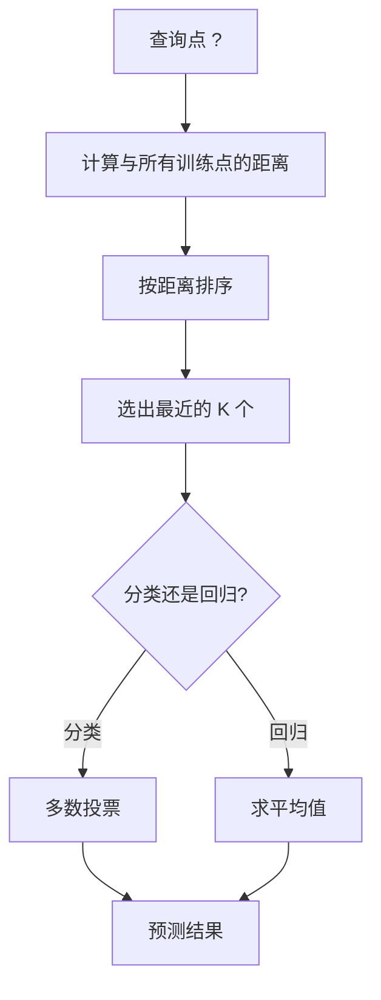
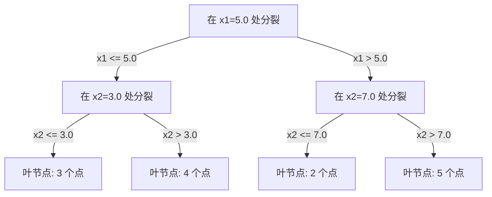

# K 最近邻 (K-Nearest Neighbors) 与距离

> 把所有数据都存起来。预测时看看你的邻居。它是最简单却真的能用的算法之一。

**类型：** 构建
**语言：** Python
**先修要求：** 阶段 1（第 14 课 范数与距离）
**时间：** ~90 分钟

## 学习目标

- 从零实现带可配置 `K` 和按距离加权投票的 KNN 分类与回归
- 比较 L1、L2、余弦距离 (Cosine Distance) 与 Minkowski 距离，并为不同数据类型选择合适的度量
- 解释维度灾难 (Curse of Dimensionality)，并展示为什么 KNN 在高维空间中会退化
- 构建 KD 树 (KD-tree) 来高效搜索最近邻，并分析它何时会优于暴力搜索

## 问题

你有一个数据集。现在来了一个新的数据点。你需要对它进行分类，或者预测它的数值。与其像线性回归或 SVM 那样从数据中学习参数，不如直接找到训练集中距离这个新点最近的 `K` 个点，让它们来投票。

这就是 K 最近邻。它没有训练阶段，没有参数需要学习，也没有要最小化的损失函数。你只需要存下整个训练集，并在预测时计算距离。

听起来简单得过头了。但 KNN 在很多问题上其实非常有竞争力，尤其是在小到中等规模数据集上。更重要的是，深入理解它会让你真正掌握一些基础概念：距离度量的选择（与阶段 1 第 14 课直接相连）、维度灾难，以及惰性学习 (Lazy Learning) 和积极学习 (Eager Learning) 的区别。

KNN 也以不同名字广泛存在于现代 AI 中。向量数据库会在嵌入上做 KNN 搜索；检索增强生成 (RAG) 会找到最接近的 `K` 个文档块；推荐系统会寻找相似用户或相似物品。算法本身没有变，变化的是规模和底层数据结构。

## 概念

### KNN 是如何工作的

给定一个带标签的数据集和一个新的查询点：

1. 计算查询点到数据集中每个点的距离
2. 按距离排序
3. 取距离最近的 `K` 个点
4. 对于分类：在这 `K` 个邻居中做多数投票
5. 对于回归：取这 `K` 个邻居目标值的平均值（或加权平均）



这就是完整算法。没有拟合，没有梯度下降，也没有 epoch。

### 如何选择 `K`

`K` 是唯一的超参数。它控制偏差-方差权衡：

| K | 行为 |
|---|----------|
| `K = 1` | 决策边界会跟着每个点走。训练误差为 0，方差高，容易过拟合 |
| 小 `K`（3-5） | 对局部结构很敏感，能捕捉复杂边界 |
| 大 `K` | 边界更平滑，对噪声更稳健，但可能欠拟合 |
| `K = N` | 对所有点都预测多数类，偏差最大 |

一个常见的起始经验是：对于包含 `N` 个点的数据集，先试 `K = sqrt(N)`。在二分类中常用奇数 `K`，以避免平票。


### 距离度量

距离函数定义了“近”到底是什么意思。不同的度量会带来不同的邻居，也就带来不同的预测。

**L2（欧几里得距离）** 是默认选择，也就是直线距离。

```
d(a, b) = sqrt(sum((a_i - b_i)^2))
```

它对特征尺度很敏感。因此在 KNN 中使用 L2 之前，通常都要先做特征标准化。

**L1（曼哈顿距离）** 把各维的绝对差值相加。相比 L2，它对离群点更稳健，因为不会对差值进行平方。

```
d(a, b) = sum(|a_i - b_i|)
```

**余弦距离 (Cosine Distance)** 衡量的是两个向量之间的夹角，而忽略它们的长度。它对文本和嵌入数据尤其重要。

```
d(a, b) = 1 - (a . b) / (||a|| * ||b||)
```

**Minkowski 距离** 用参数 `p` 把 L1 和 L2 统一起来。

```
d(a, b) = (sum(|a_i - b_i|^p))^(1/p)

p=1: Manhattan
p=2: Euclidean
p->inf: Chebyshev (max absolute difference)
```

该用哪种度量，取决于数据本身：

| 数据类型 | 最佳度量 | 原因 |
|-----------|------------|-----|
| 数值特征，尺度接近 | L2（欧几里得） | 默认选择，适合空间数据 |
| 数值特征，有离群点 | L1（曼哈顿） | 更稳健，不会放大大差异 |
| 文本嵌入 | 余弦 | 长度通常是噪声，方向才代表语义 |
| 高维稀疏数据 | 余弦或 L1 | L2 更容易受到维度灾难影响 |
| 混合类型 | 自定义距离 | 对不同特征类型组合不同度量 |

### 加权 KNN

标准 KNN 会给 `K` 个邻居同样的权重。但距离为 0.1 的邻居显然应该比距离为 5.0 的邻居更重要。

**按距离加权的 KNN (Distance-weighted KNN)** 会让每个邻居的权重与距离成反比：

```
weight_i = 1 / (distance_i + epsilon)

For classification: weighted vote
For regression:     weighted average = sum(w_i * y_i) / sum(w_i)
```

其中 `epsilon` 用来避免当查询点与训练点完全重合时出现除零错误。

加权 KNN 对 `K` 的选择没那么敏感，因为远处的邻居无论如何贡献都很小。

### 维度灾难

KNN 在高维空间中的性能会退化。这不是模糊的担忧，而是数学事实。

**问题 1：距离会趋同。** 随着维度升高，最大距离和最小距离的比值会逼近 1。所有点看起来都会离查询点差不多远。

```
In d dimensions, for random uniform points:

d=2:    max_dist / min_dist = varies widely
d=100:  max_dist / min_dist ~ 1.01
d=1000: max_dist / min_dist ~ 1.001

When all distances are nearly equal, "nearest" is meaningless.
```

**问题 2：体积爆炸。** 为了在固定比例的数据里捕捉到 `K` 个邻居，你必须把搜索半径扩展到覆盖特征空间中大得多的一部分。高维空间中的“邻域”会吞没几乎整个空间。

**问题 3：角落主导。** 在 `d` 维单位超立方体中，大多数体积集中在角落附近，而不是中心。随着 `d` 增大，内接球所占体积会趋近于 0。

实践中的结论是：KNN 在大约 20 到 50 个特征以内通常还比较好用。再往上，你往往需要先做降维（PCA、UMAP、t-SNE），再应用 KNN；或者使用利用数据内在低维结构的树型搜索结构。

### KD 树：更快的最近邻搜索

暴力版 KNN 会对查询点和每个训练点都计算一次距离。每次查询的复杂度是 `O(n * d)`。当数据集很大时，这会太慢。

KD 树会沿着特征轴递归切分空间。每一层都在某一个维度上，按中位数把空间切开。



要找最近邻时，先沿树走到包含查询点的叶节点，然后回溯；只有当相邻分区**可能**包含更近的点时，才去检查它们。

在低维空间中，平均查询时间约为 `O(log n)`。但在高维空间（`d > 20`）里，KD 树会退化到接近 `O(n)`，因为回溯时能排除的分支越来越少。

### Ball Tree：在中等维度下更好

Ball Tree 不是用与坐标轴对齐的盒子来切分，而是把数据划分到一层层嵌套的超球体中。每个节点定义一个球（中心 + 半径），覆盖该子树中的所有点。

相对于 KD 树，它的优势在于：
- 在中等维度（大约到 50 维）表现更好
- 能处理不与坐标轴对齐的数据结构
- 更紧的包围体意味着搜索时可以剪掉更多分支

KD 树和 Ball Tree 都是精确算法。对于真正超大规模的搜索（数百万点、几百维），通常会改用近似最近邻 (Approximate Nearest Neighbor) 方法，比如 HNSW、IVF、乘积量化。这些内容会在阶段 1 第 14 课中展开。

### 惰性学习 vs 积极学习

KNN 是典型的惰性学习器：训练阶段几乎什么都不做，所有计算都放在预测阶段。大多数其他算法（线性回归、SVM、神经网络）则属于积极学习器：训练阶段做大量计算，得到一个紧凑模型，之后预测很快。

| 方面 | 惰性（KNN） | 积极（SVM、神经网络） |
|--------|------------|------------------------|
| 训练时间 | `O(1)`，只是存数据 | `O(n * epochs)` |
| 预测时间 | 每次查询 `O(n * d)` | `O(d)` 或 `O(parameters)` |
| 预测时的内存 | 必须存整个训练集 | 只存模型参数 |
| 适应新数据 | 可以立刻增加新点 | 需要重训模型 |
| 决策边界 | 隐式，按需计算 | 显式，训练后固定 |

惰性学习特别适合这些情况：
- 数据集经常变化（无需重训即可增删样本）
- 只需要对很少几个查询点做预测
- 你希望训练时间几乎为零
- 数据集足够小，暴力搜索也很快

### 用于回归的 KNN

在回归任务中，KNN 不再做多数投票，而是对 `K` 个邻居的目标值求平均。

```
prediction = (1/K) * sum(y_i for i in K nearest neighbors)

Or with distance weighting:
prediction = sum(w_i * y_i) / sum(w_i)
where w_i = 1 / distance_i
```

KNN 回归会产生分段常数预测（如果加权，则更接近平滑的分段函数）。它不能外推到训练数据范围之外。如果训练目标值全在 0 到 100 之间，KNN 永远不会预测 200。

## 动手构建

### 第 1 步：距离函数

实现 L1、L2、余弦和 Minkowski 距离。它们与阶段 1 第 14 课直接对应。

```python
import math

def l2_distance(a, b):
    return math.sqrt(sum((ai - bi) ** 2 for ai, bi in zip(a, b)))

def l1_distance(a, b):
    return sum(abs(ai - bi) for ai, bi in zip(a, b))

def cosine_distance(a, b):
    dot_val = sum(ai * bi for ai, bi in zip(a, b))
    norm_a = math.sqrt(sum(ai ** 2 for ai in a))
    norm_b = math.sqrt(sum(bi ** 2 for bi in b))
    if norm_a == 0 or norm_b == 0:
        return 1.0
    return 1.0 - dot_val / (norm_a * norm_b)

def minkowski_distance(a, b, p=2):
    if p == float('inf'):
        return max(abs(ai - bi) for ai, bi in zip(a, b))
    return sum(abs(ai - bi) ** p for ai, bi in zip(a, b)) ** (1 / p)
```

### 第 2 步：KNN 分类器与回归器

构建完整的 KNN，支持可配置的 `K`、距离度量和可选的距离加权。

```python
class KNN:
    def __init__(self, k=5, distance_fn=l2_distance, weighted=False,
                 task="classification"):
        self.k = k
        self.distance_fn = distance_fn
        self.weighted = weighted
        self.task = task
        self.X_train = None
        self.y_train = None

    def fit(self, X, y):
        self.X_train = X
        self.y_train = y

    def predict(self, X):
        return [self._predict_one(x) for x in X]
```

### 第 3 步：用 KD 树加速搜索

从零实现 KD 树，按每一维的中位数递归切分。

```python
class KDTree:
    def __init__(self, X, indices=None, depth=0):
        # Recursively partition the data
        self.axis = depth % len(X[0])
        # Split on median of the current axis
        ...

    def query(self, point, k=1):
        # Traverse to leaf, then backtrack
        ...
```

完整实现（含辅助方法和演示）见 `code/knn.py`。

### 第 4 步：特征缩放

KNN 需要做特征缩放，因为距离对特征量级非常敏感。取值范围 0 到 1000 的特征会彻底压过取值范围 0 到 1 的特征。

```python
def standardize(X):
    n = len(X)
    d = len(X[0])
    means = [sum(X[i][j] for i in range(n)) / n for j in range(d)]
    stds = [
        max(1e-10, (sum((X[i][j] - means[j]) ** 2 for i in range(n)) / n) ** 0.5)
        for j in range(d)
    ]
    return [[((X[i][j] - means[j]) / stds[j]) for j in range(d)] for i in range(n)], means, stds
```

## 使用它

借助 `scikit-learn`：

```python
from sklearn.neighbors import KNeighborsClassifier
from sklearn.preprocessing import StandardScaler
from sklearn.pipeline import Pipeline

clf = Pipeline([
    ("scaler", StandardScaler()),
    ("knn", KNeighborsClassifier(n_neighbors=5, metric="euclidean")),
])
clf.fit(X_train, y_train)
print(f"Accuracy: {clf.score(X_test, y_test):.4f}")
```

当数据集足够大且维度足够低时，`scikit-learn` 会自动使用 KD 树或 Ball Tree；对于高维数据，则会退回到暴力搜索。你可以通过 `algorithm` 参数来控制这一点。

对于大规模最近邻搜索（数百万向量），可以使用 FAISS、Annoy 或向量数据库：

```python
import faiss

index = faiss.IndexFlatL2(dimension)
index.add(embeddings)
distances, indices = index.search(query_vectors, k=5)
```

## 练习

1. 在一个二维、3 类数据集上实现 KNN 分类。分别绘制 `K=1`、`K=5`、`K=15` 和 `K=N` 时的决策边界，观察从过拟合到欠拟合的变化。
2. 在 2、5、10、50、100 和 500 维空间中分别生成 1000 个随机点。对每个维度，计算最大成对距离与最小成对距离的比值。把这个比值随维度变化画出来，从而直观看到维度灾难。
3. 在一个文本分类问题上，比较 KNN 使用 L1、L2 和余弦距离时的效果（可使用 TF-IDF 向量）。哪种度量准确率最高？为什么余弦在文本任务上通常更强？
4. 实现一个 KD 树，并在 2D、10D 和 50D 的 1k、10k、100k 点数据集上，比较它与暴力搜索的查询时间。在哪个维度开始，KD 树不再比暴力搜索快？
5. 为 `y = sin(x) + noise` 构建一个按距离加权的 KNN 回归器。将它和不加权的 KNN 在 `K=3`、`K=10`、`K=30` 下比较。展示加权方式会产生更平滑的预测，尤其是在 `K` 较大时。

## 关键术语

| 术语 | 实际含义 |
|------|----------------------|
| K 最近邻 (K-nearest neighbors) | 一种非参数算法：通过找到距离查询点最近的 `K` 个训练点来做预测 |
| 惰性学习 (Lazy Learning) | 训练阶段几乎不计算，所有工作都发生在预测阶段。KNN 是最经典的例子 |
| 积极学习 (Eager Learning) | 在训练阶段做大量计算，得到紧凑模型。大多数 ML 算法都属于这一类 |
| 维度灾难 (Curse of Dimensionality) | 在高维空间中，距离会趋同、邻域会膨胀到覆盖大部分空间，导致 KNN 失效 |
| KD 树 (KD-tree) | 沿特征轴递归切分空间的二叉树。在低维空间中查询复杂度约为 `O(log n)` |
| Ball Tree | 由嵌套超球体组成的树。在中等维度下通常比 KD 树更好用 |
| 加权 KNN (Weighted KNN) | 邻居的权重与距离成反比。越近的邻居，对预测影响越大 |
| 特征缩放 (Feature Scaling) | 将特征归一到可比范围。KNN 这类基于距离的方法通常必须做这一步 |
| 多数投票 (Majority Vote) | 在分类中统计 `K` 个邻居里哪个类别最多，并以此作为预测 |
| 暴力搜索 (Brute Force Search) | 对每个训练点都计算距离。每次查询复杂度是 `O(n*d)`。精确但在大 `n` 时较慢 |
| 近似最近邻 (Approximate Nearest Neighbor) | 一类比精确搜索快得多的算法（如 HNSW、LSH、IVF），返回近似最近的点 |
| Voronoi 图 | 把空间划分成若干区域，每个区域里的点都最接近某一个训练点。`K=1` 的 KNN 会产生 Voronoi 边界 |

## 延伸阅读

- [Cover & Hart: Nearest Neighbor Pattern Classification (1967)](https://ieeexplore.ieee.org/document/1053964) - KNN 的奠基论文，证明其错误率至多是贝叶斯最优错误率的两倍
- [Friedman, Bentley, Finkel: An Algorithm for Finding Best Matches in Logarithmic Expected Time (1977)](https://dl.acm.org/doi/10.1145/355744.355745) - KD 树的原始论文
- [Beyer et al.: When Is "Nearest Neighbor" Meaningful? (1999)](https://link.springer.com/chapter/10.1007/3-540-49257-7_15) - 从形式化角度分析维度灾难对最近邻搜索的影响
- [scikit-learn Nearest Neighbors documentation](https://scikit-learn.org/stable/modules/neighbors.html) - 含算法选择建议的实用指南
- [FAISS: A Library for Efficient Similarity Search](https://github.com/facebookresearch/faiss) - Meta 推出的十亿级近似最近邻搜索库
