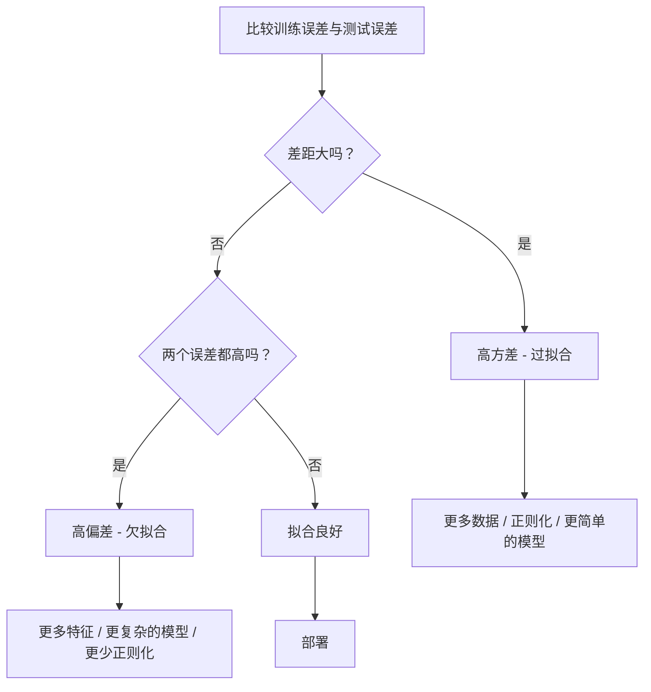
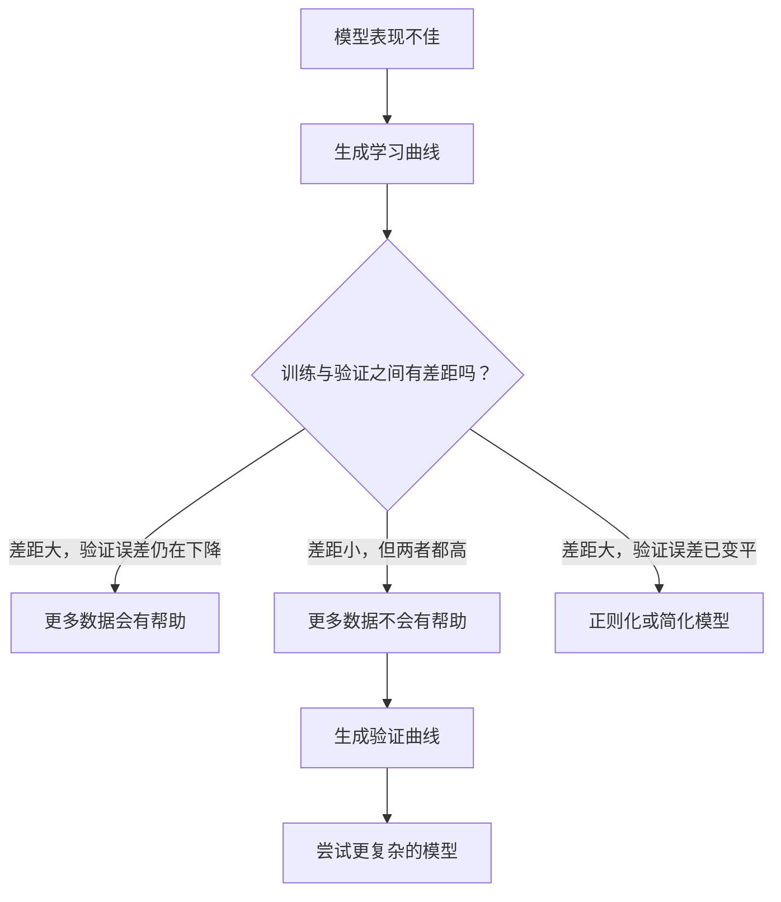

# 偏差-方差权衡（Bias-Variance Tradeoff）

> 每一种模型误差都来自三个来源之一：偏差（bias）、方差（variance）或噪声（noise）。你只能控制前两个。

**类型：** 学习
**语言：** Python
**前置要求：** 第 2 阶段，第 01-09 课（机器学习基础、回归、分类、评估）
**时间：** ~75 分钟

## 学习目标

- 推导期望预测误差的偏差-方差分解（bias-variance decomposition），并解释不可约噪声（irreducible noise）的作用
- 利用训练误差与测试误差的模式，诊断模型是高偏差还是高方差
- 解释正则化技术（regularization techniques）如 L1、L2、随机失活（dropout）和提前停止（early stopping）如何用偏差交换方差
- 实现可视化实验，展示随着模型复杂度上升时的偏差-方差权衡

## 问题

你训练了一个模型。它在测试数据上有一些误差。这个误差究竟来自哪里？

如果你的模型太简单（例如在一个弯曲的数据集上做线性回归），它就会持续错过真实模式。这就是偏差。如果你的模型太复杂（例如在 15 个数据点上拟合 20 次多项式），它会把训练数据拟合得近乎完美，却在新数据上给出剧烈波动的预测。这就是方差。

对于固定的模型容量（capacity），你无法同时把二者都最小化。把偏差压低，方差就会上升；把方差压低，偏差就会上升。理解这种权衡，是机器学习中最有用的诊断能力。它会告诉你，应该把模型做得更复杂还是更简单，应该收集更多数据还是设计更好的特征，应该加强还是减弱正则化。

## 概念

### 偏差：系统性误差

偏差衡量的是：模型平均预测与真实值之间相差多远。假如你从同一分布中抽取许多不同的训练集，用同一个模型反复训练，再把这些预测取平均，偏差就是这个平均预测与真实值之间的差距。

高偏差意味着模型过于僵硬，无法捕捉真实模式。拿一条直线去拟合抛物线，无论你给它多少数据，它都会错过曲线。这就是欠拟合（underfitting）。

```
High bias (underfitting):
  Model always predicts roughly the same wrong thing.
  Training error: HIGH
  Test error: HIGH
  Gap between them: SMALL
```

### 方差：对训练数据的敏感性

方差衡量的是：当你在不同的数据子集上训练时，预测会改变多少。如果训练集发生一点小变化，就会引起模型的大幅变化，那么方差就很高。

高方差意味着模型拟合的是训练数据中的噪声，而不是底层信号。一个 20 次多项式会穿过每一个训练点，却会在它们之间疯狂振荡。这就是过拟合（overfitting）。

```
High variance (overfitting):
  Model fits training data perfectly but fails on new data.
  Training error: LOW
  Test error: HIGH
  Gap between them: LARGE
```

### 分解公式

对于任意一点 x，在平方损失（squared loss）下，期望预测误差可以被精确分解为：

```
Expected Error = Bias^2 + Variance + Irreducible Noise

where:
  Bias^2   = (E[f_hat(x)] - f(x))^2
  Variance = E[(f_hat(x) - E[f_hat(x)])^2]
  Noise    = E[(y - f(x))^2]             (sigma^2)
```

- `f(x)` 是真实函数
- `f_hat(x)` 是你的模型预测
- `E[...]` 是对不同训练集取期望
- `y` 是观测到的标签（真实函数加上噪声）

噪声项是不可约的。对于有噪声的数据，任何模型都不可能把误差做到低于 sigma^2。你的任务是找到 bias^2 与 variance 之间合适的平衡点。

### 模型复杂度与误差


经典的 U 型曲线：

| 复杂度 | 偏差 | 方差 | 总误差 |
|-----------|------|----------|-------------|
| 过低 | 高 | 低 | 高（欠拟合） |
| 刚刚好 | 中等 | 中等 | 最低 |
| 过高 | 低 | 高 | 高（过拟合） |

### 将正则化视为偏差-方差控制器

正则化（regularization）会有意增加偏差，以换取更低的方差。它通过约束模型，让模型无法一路追着噪声跑。

- **L2（Ridge）**：把所有权重都往 0 收缩。保留所有特征，但减弱它们的影响。
- **L1（Lasso）**：把部分权重直接压到 0。能够起到特征选择的作用。
- **随机失活（Dropout）**：在训练过程中随机关闭神经元，迫使模型学到冗余表示。
- **提前停止（Early stopping）**：在模型完全拟合训练数据之前提前停止训练。

正则化强度（lambda、随机失活率（dropout rate）、训练轮数）直接决定你处在偏差-方差曲线的哪个位置。正则化越强，偏差越大，方差越小。

### 双降（Double Descent）：现代视角

经典理论认为：一旦越过最佳平衡点，模型复杂度继续增加只会带来伤害。但 2019 年以来的研究发现了一个出人意料的现象：如果你把模型容量继续提高，远远超过插值阈值（interpolation threshold，即模型参数已经足以完美拟合训练数据的位置），测试误差可能会再次下降。


这个“双降”现象解释了：为什么参数量远大于训练样本数的神经网络，依然能够很好地泛化。经典的偏差-方差权衡并没有错，但对于现代大模型场景来说，它并不完整。

关于双降的关键观察：
- 它会出现在线性模型、决策树和神经网络中
- 在插值区域，更多数据反而可能带来伤害（按样本数观察的双降，sample-wise double descent）
- 更多训练轮次也可能导致它出现（按训练轮数观察的双降，epoch-wise double descent）
- 正则化会让峰值更平滑，但不会消除它

为什么会这样？在插值阈值处，模型的容量刚好只够拟合所有训练点。它被迫进入一种非常特定的解，要穿过每一个点，而数据中的微小扰动就会导致拟合结果发生巨大变化。这正是方差达到峰值的位置。越过这个阈值之后，模型会有许多种都能完美拟合数据的解。学习算法（例如带隐式正则化的梯度下降）往往会从这些解里挑出最简单的那个。这种偏向简单解的隐式偏差（implicit bias），正是过参数化模型仍能泛化的原因。

| 区间 | 参数量与样本量关系 | 行为 |
|--------|----------------------|----------|
| 欠参数化 | p &lt;&lt; n | 经典权衡成立 |
| 插值阈值 | p ~ n | 方差达到峰值，测试误差尖峰上升 |
| 过参数化 | p >> n | 隐式正则化开始发挥作用，测试误差下降 |

从实践角度看：如果你使用的是神经网络或大型树集成模型，不要停在插值阈值附近。要么明显低于它（并配合显式正则化），要么明显高于它。最糟糕的位置，就是正好卡在阈值上。

### 诊断你的模型



| 症状 | 诊断 | 修复方式 |
|---------|-----------|-----|
| 训练误差高，测试误差高 | 偏差 | 更多特征、更复杂的模型、更少正则化 |
| 训练误差低，测试误差高 | 方差 | 更多数据、正则化、更简单的模型、随机失活（dropout） |
| 训练误差低，测试误差低 | 拟合良好 | 可以上线 |
| 训练误差持续下降，测试误差持续上升 | 正在发生过拟合 | 提前停止 |

### 实战策略

**当偏差是问题时：**
- 增加多项式特征或交互特征
- 使用更灵活的模型（例如用树集成代替线性模型）
- 降低正则化强度
- 训练更久一些（如果还没有收敛）

**当方差是问题时：**
- 获取更多训练数据
- 使用装袋法（bagging，如随机森林）
- 增强正则化（更高的 lambda、更多随机失活（dropout））
- 做特征选择（移除有噪声的特征）
- 用交叉验证尽早发现问题

### 集成方法与方差降低

集成方法（ensemble methods）是对抗方差最实用的工具。

**装袋法（Bagging / Bootstrap Aggregating）** 会在训练数据的不同自助采样（bootstrap samples）上训练多个模型，然后对它们的预测做平均。每个单独模型的方差都很高，但平均之后方差会显著降低。随机森林就是把装袋法应用于决策树。

它在数学上为什么有效：如果你对 N 个彼此独立的预测取平均，而每个预测的方差都是 sigma^2，那么平均值的方差就是 sigma^2 / N。这些模型并不真正独立（它们看到的数据相似），所以实际降低幅度不会达到 1/N，但依然很可观。

**提升法（Boosting）** 则通过顺序构建模型来降低偏差，每个新模型都会专门关注当前集成里尚未解决的错误。梯度提升（Gradient boosting）和 AdaBoost 是主要例子。提升法在模型数量过多时也会过拟合，因此需要提前停止（early stopping）或正则化。

| 方法 | 主要作用 | 偏差变化 | 方差变化 |
|--------|---------------|-------------|-----------------|
| 装袋法（Bagging） | 降低方差 | 不变 | 下降 |
| 提升法（Boosting） | 降低偏差 | 下降 | 可能上升 |
| 堆叠法（Stacking） | 两者都降低 | 取决于元学习器 | 取决于基模型 |
| 随机失活（Dropout） | 隐式装袋 | 略微上升 | 下降 |

**实用规则：** 如果你的基础模型方差很高（深树、高阶多项式），用装袋法（bagging）；如果你的基础模型偏差很高（浅树桩、简单线性模型），用提升法（boosting）。

### 学习曲线（Learning Curves）

学习曲线会把训练误差和验证误差画成训练集大小的函数。它们是你手中最实用的诊断工具。与单次训练/测试对比不同，学习曲线会展示模型表现随数据规模变化的轨迹，并告诉你更多数据是否会有帮助。


如何解读：

| 场景 | 训练误差 | 验证误差 | 差距 | 含义 | 该怎么做 |
|----------|---------------|-----------------|-----|---------------|------------|
| 高偏差 | 高 | 高 | 小 | 模型无法捕捉模式 | 更多特征、更复杂的模型、更少正则化 |
| 高方差 | 低 | 高 | 大 | 模型记住了训练数据 | 更多数据、正则化、更简单的模型 |
| 拟合良好 | 中等 | 中等 | 小 | 模型泛化良好 | 可以上线 |
| 高方差，但在改善 | 低 | 随数据增加而下降 | 收缩中 | 这是数据可以修复的方差问题 | 收集更多数据 |
| 高偏差，且曲线平坦 | 高 | 高且平坦 | 小且平坦 | 更多数据**不会**有帮助 | 更换模型结构 |

关键洞见是：如果两条曲线都已经进入平台期，彼此差距很小，但两个误差都很高，那么更多数据是没用的，你需要更好的模型；如果差距很大，而且还在持续缩小，那么更多数据会有帮助。

### 如何生成学习曲线

有两种方法：

**方法 1：固定模型，改变训练集大小。** 保持模型和超参数不变，在越来越大的训练数据子集上训练。分别测量每个规模下的训练误差和验证误差。这就是标准的学习曲线。

**方法 2：固定数据，改变模型复杂度。** 保持数据不变，扫描某个复杂度参数（多项式次数、树深、层数）。测量每个复杂度下的训练误差和验证误差。这叫验证曲线（validation curve），能更直接地展示偏差-方差权衡。

这两种方法彼此互补。第一种告诉你：更多数据是否有帮助；第二种告诉你：换一个模型是否有帮助。在决定下一步之前，两者都应该跑一遍。



## 动手构建

`code/bias_variance.py` 中的代码会运行完整的偏差-方差分解实验。下面按步骤说明其方法。

### 步骤 1：从已知函数生成合成数据

我们使用 `f(x) = sin(1.5x) + 0.5x`，并加入高斯噪声。因为知道真实函数，所以我们可以精确计算偏差和方差。

```python
def true_function(x):
    return np.sin(1.5 * x) + 0.5 * x

def generate_data(n_samples=30, noise_std=0.5, x_range=(-3, 3), seed=None):
    rng = np.random.RandomState(seed)
    x = rng.uniform(x_range[0], x_range[1], n_samples)
    y = true_function(x) + rng.normal(0, noise_std, n_samples)
    return x, y
```

### 步骤 2：Bootstrap 采样与多项式拟合

对于每一个多项式次数，我们都会抽取许多 bootstrap 训练集，拟合多项式，并在固定的测试网格上记录预测值。这样就能为每个测试点得到一个预测分布。

```python
def fit_polynomial(x_train, y_train, degree, lam=0.0):
    X = np.column_stack([x_train ** d for d in range(degree + 1)])
    if lam > 0:
        penalty = lam * np.eye(X.shape[1])
        penalty[0, 0] = 0
        w = np.linalg.solve(X.T @ X + penalty, X.T @ y_train)
    else:
        w = np.linalg.lstsq(X, y_train, rcond=None)[0]
    return w
```

我们会在 200 个不同的 bootstrap 样本上进行拟合。每个 bootstrap 样本都来自同一个底层分布，但包含的点各不相同。

### 步骤 3：计算 Bias^2 与 Variance 分解

在每个测试点上拿到 200 组预测后，我们就可以直接根据定义计算分解：

```python
mean_pred = predictions.mean(axis=0)
bias_sq = np.mean((mean_pred - y_true) ** 2)
variance = np.mean(predictions.var(axis=0))
total_error = np.mean(np.mean((predictions - y_true) ** 2, axis=1))
```

- `mean_pred` 是用 bootstrap 样本估计得到的 E[f_hat(x)]
- `bias_sq` 是平均预测与真实值之间差距的平方
- `variance` 是不同 bootstrap 样本预测结果的平均离散程度
- `total_error` 应该近似等于 bias^2 + variance + noise

### 步骤 4：学习曲线

学习曲线在固定模型复杂度时，扫描训练集大小。它们能显示你的模型是受数据限制，还是受容量限制。

```python
def demo_learning_curves():
    sizes = [10, 15, 20, 30, 50, 75, 100, 150, 200, 300]
    degree = 5

    for n in sizes:
        train_errors = []
        test_errors = []
        for seed in range(50):
            x_train, y_train = generate_data(n_samples=n, seed=seed * 100)
            w = fit_polynomial(x_train, y_train, degree)
            train_pred = predict_polynomial(x_train, w)
            train_mse = np.mean((train_pred - y_train) ** 2)
            test_pred = predict_polynomial(x_test, w)
            test_mse = np.mean((test_pred - y_test) ** 2)
            train_errors.append(train_mse)
            test_errors.append(test_mse)
        # Average over runs gives the learning curve point
```

对于一个高方差模型（小数据下的 5 次多项式），你会看到：
- 训练误差一开始很低，随着更多数据让“死记硬背”变难而上升
- 测试误差一开始很高，随着模型获得更多信号而下降
- 两者之间的差距会随着数据增多而缩小

对于一个高偏差模型（1 次多项式），两种误差会很快收敛到同一个较高值，增加数据也无济于事。

### 步骤 5：正则化扫描

代码里还包含 `demo_regularization_sweep()`：它固定一个高阶多项式（15 次），并把 Ridge 正则化强度从 0.001 扫描到 100。这样就能从另一个角度看到偏差-方差权衡：不是改模型复杂度，而是改约束强度。

```python
def demo_regularization_sweep():
    alphas = [0.001, 0.005, 0.01, 0.05, 0.1, 0.5, 1.0, 5.0, 10.0, 50.0, 100.0]
    for alpha in alphas:
        results = bias_variance_decomposition([15], lam=alpha)
        r = results[15]
        print(f"alpha={alpha:.3f}  bias={r['bias_sq']:.4f}  var={r['variance']:.4f}")
```

当 alpha 很低时，15 次多项式几乎不受约束。由于模型会在每个 bootstrap 样本里追逐噪声，因此方差占主导。当 alpha 很高时，惩罚强到让模型几乎变成常数函数，这时偏差占主导。最佳 alpha 位于这两个极端之间。

这和通过改变多项式次数得到的 U 型曲线是同一件事，只不过现在控制的是一个连续旋钮，而不是离散档位。在实践中，正则化通常是控制这种权衡的首选方式，因为它不需要更改特征集合，就能做到更细粒度的调节。

## 实际使用

sklearn 提供了 `learning_curve` 和 `validation_curve`，无需自己写 bootstrap 循环，就能自动完成这些诊断。

### 验证曲线：扫描模型复杂度

```python
from sklearn.model_selection import validation_curve
from sklearn.pipeline import make_pipeline
from sklearn.preprocessing import PolynomialFeatures
from sklearn.linear_model import Ridge

degrees = list(range(1, 16))
train_scores_all = []
val_scores_all = []

for d in degrees:
    pipe = make_pipeline(PolynomialFeatures(d), Ridge(alpha=0.01))
    train_scores, val_scores = validation_curve(
        pipe, X, y, param_name="polynomialfeatures__degree",
        param_range=[d], cv=5, scoring="neg_mean_squared_error"
    )
    train_scores_all.append(-train_scores.mean())
    val_scores_all.append(-val_scores.mean())
```

这会直接给你偏差-方差权衡曲线。验证分数相对训练分数最差的地方，说明方差占主导；两者都差的地方，说明偏差占主导。

### 学习曲线：扫描训练集大小

```python
from sklearn.model_selection import learning_curve

pipe = make_pipeline(PolynomialFeatures(5), Ridge(alpha=0.01))
train_sizes, train_scores, val_scores = learning_curve(
    pipe, X, y, train_sizes=np.linspace(0.1, 1.0, 10),
    cv=5, scoring="neg_mean_squared_error"
)
train_mse = -train_scores.mean(axis=1)
val_mse = -val_scores.mean(axis=1)
```

把 `train_mse` 和 `val_mse` 画成 `train_sizes` 的函数。曲线的形状会把模型的情况一览无余地展示出来。

### 配合正则化扫描的交叉验证

```python
from sklearn.model_selection import cross_val_score

alphas = [0.001, 0.01, 0.1, 1.0, 10.0, 100.0]
for alpha in alphas:
    pipe = make_pipeline(PolynomialFeatures(10), Ridge(alpha=alpha))
    scores = cross_val_score(pipe, X, y, cv=5, scoring="neg_mean_squared_error")
    print(f"alpha={alpha:>7.3f}  MSE={-scores.mean():.4f} +/- {scores.std():.4f}")
```

这会在固定模型复杂度下扫描正则化强度。你会再次看到同样的偏差-方差权衡：alpha 低意味着高方差，alpha 高意味着高偏差。

### 串起来看：完整的诊断工作流

在实践中，你可以按顺序运行这些诊断：

1. 训练你的模型，计算训练误差和测试误差。
2. 如果二者都高：你面对的是偏差问题，直接跳到第 4 步。
3. 如果训练误差低而测试误差高：你面对的是方差问题。先生成学习曲线，看看更多数据是否有帮助。如果没有，就加正则化。
4. 生成一个扫描主要复杂度参数的验证曲线，找到最佳平衡点。
5. 在最佳平衡点处，再生成学习曲线。如果差距仍然很大，你需要更多数据或更强的正则化。
6. 用 `cross_val_score` 测试不同 alpha 的 Ridge/Lasso，选出交叉验证误差最低的 alpha。

对大多数表格数据集来说，这套流程只需要 10-15 分钟计算时间，却能帮你省下数小时的盲目猜测。

## 交付成果

本课会产出：`outputs/prompt-model-diagnostics.md`

## 练习

1. 在 `noise_std=0`（无噪声）的情况下运行分解实验。不可约误差项会发生什么变化？最佳复杂度会改变吗？

2. 将训练集大小从 30 增加到 300。这会如何影响方差项？最佳多项式次数会移动吗？

3. 给实验加入 L2 正则化（Ridge regression）。固定一个高阶多项式（15 次），把 lambda 从 0 扫到 100。画出 bias^2 和 variance 随 lambda 变化的曲线。

4. 把真实函数从多项式改成 `sin(x)`。偏差-方差分解会如何变化？还会有清晰的最佳次数吗？

5. 实现一个简单的 bootstrap aggregating（bagging）封装：在 bootstrap 样本上训练 10 个模型，并对预测取平均。证明这种做法能在几乎不增加偏差的情况下降低方差。

## 关键术语

| 术语 | 人们常说的话 | 实际含义 |
|------|--------------|----------|
| 偏差（Bias） | “模型太简单了” | 由于错误假设导致的系统性误差。也就是平均模型预测与真实值之间的差距。 |
| 方差（Variance） | “模型过拟合了” | 来自对训练数据敏感性的误差。即不同训练集之间预测变化有多大。 |
| 不可约误差（Irreducible error） | “数据里的噪声” | 来自真实数据生成过程随机性的误差。任何模型都无法消除。 |
| 欠拟合（Underfitting） | “学得还不够” | 模型有高偏差，即使在训练数据上也抓不住真实模式。 |
| 过拟合（Overfitting） | “把数据背下来了” | 模型有高方差，会拟合训练数据中的噪声，而这种拟合无法泛化。 |
| 正则化（Regularization） | “给模型加约束” | 通过添加惩罚项来降低模型复杂度，用更高偏差换取更低方差。 |
| 双降（Double descent） | “更多参数反而有帮助” | 当模型容量远远超过插值阈值后，测试误差会再次下降。 |
| 模型复杂度（Model complexity） | “模型有多灵活” | 模型拟合任意模式的能力。可由架构、特征或正则化控制。 |

## 延伸阅读

- [Hastie, Tibshirani, Friedman: Elements of Statistical Learning, Ch. 7](https://hastie.su.domains/ElemStatLearn/) -- 关于偏差-方差分解的权威论述
- [Belkin et al., Reconciling modern machine learning practice and the bias-variance trade-off (2019)](https://arxiv.org/abs/1812.11118) -- 双降论文
- [Nakkiran et al., Deep Double Descent (2019)](https://arxiv.org/abs/1912.02292) -- 按训练轮次与按样本数观察的双降
- [Scott Fortmann-Roe: Understanding the Bias-Variance Tradeoff](http://scott.fortmann-roe.com/docs/BiasVariance.html) -- 清晰的可视化解释
