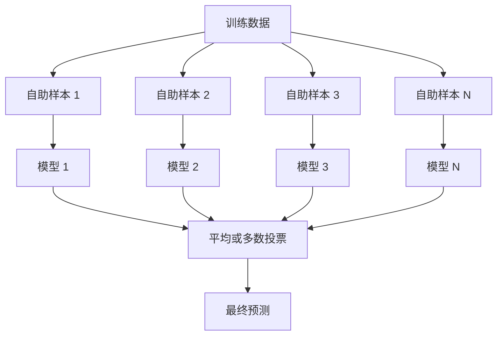
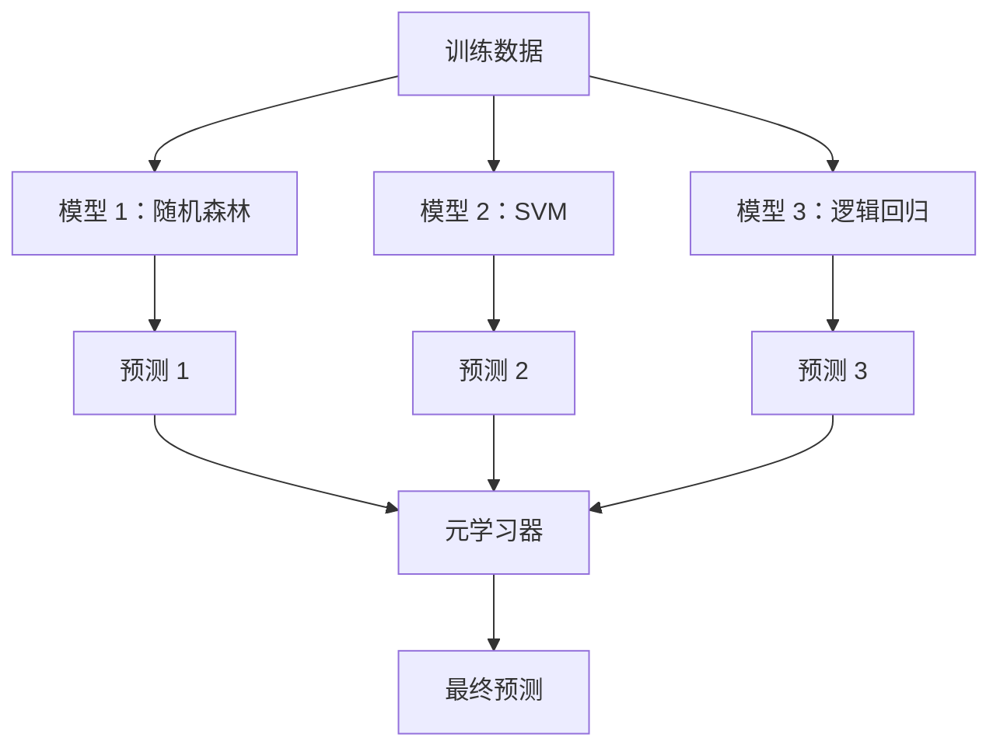

# 集成方法 (Ensemble Methods)

> 一组弱学习器 (weak learners)，只要正确组合，就会变成强学习器 (strong learner)。这不是比喻，而是定理。

**类型：** 构建
**语言：** Python
**先修要求：** 第 2 阶段，第 10 课（偏差-方差权衡 / Bias-Variance Tradeoff）
**时间：** ~120 分钟

## 学习目标

- 从零实现 AdaBoost 和梯度提升 (gradient boosting)，并解释提升如何通过顺序训练来降低偏差
- 构建装袋集成 (bagging ensemble)，展示对去相关模型求平均如何在不增加偏差的情况下降低方差
- 比较装袋法 (bagging)、提升法 (boosting) 和堆叠法 (stacking) 各自主要针对误差的哪个组成部分
- 评估集成多样性 (ensemble diversity)，并解释为什么随着更多相互独立的弱学习器加入，多数投票的准确率会提升

## 问题

单棵决策树 (decision tree) 训练快、易解释，但会过拟合。单个线性模型 (linear model) 在复杂边界上又会欠拟合。你可以花上几天去设计完美的模型架构，也可以把一堆并不完美的模型组合起来，得到比任何单个模型都更好的结果。

集成方法正是这么做的。它们是在表格数据 (tabular data) 上赢得 Kaggle 比赛最可靠的技术，是大多数生产级 ML 系统的核心，也把偏差-方差权衡直观地展示出来。装袋法降低方差，提升法降低偏差，堆叠法学习在什么输入上该信任哪个模型。

## 概念

### 为什么集成有效

假设你有 N 个相互独立的分类器 (classifier)，每个的准确率都是 p > 0.5。多数投票的准确率为：

```
P(majority correct) = sum over k > N/2 of C(N,k) * p^k * (1-p)^(N-k)
```

对于 21 个准确率都是 60% 的分类器，多数投票的准确率大约是 74%。如果是 101 个分类器，会提升到 84%。只要模型犯的是不同的错误，这些错误就会相互抵消。

关键要求是 **多样性 (diversity)**。如果所有模型犯的都是同样的错误，组合起来也不会有帮助。集成之所以有效，是因为它们通过以下方式产生多样化模型：

- 不同的训练子集（装袋法）
- 不同的特征子集（随机森林）
- 顺序式纠错（提升法）
- 不同的模型家族（堆叠法）

### 装袋法 (Bagging / Bootstrap Aggregating)

装袋法通过让每个模型在训练数据的不同自助样本 (bootstrap sample) 上训练来产生多样性。



自助样本是从原始数据中有放回地抽取出来的，大小与原始数据相同。每个自助样本中大约会出现 63.2% 的唯一样本。剩下的 36.8%（袋外样本 / out-of-bag samples）则提供了一个免费的验证集。

装袋法可以在几乎不增加偏差的情况下降低方差。每棵单独的树都会对自己的自助样本过拟合，但每棵树过拟合的方式不同，所以取平均会把噪声抵消掉。

**随机森林 (Random Forests)** 是装袋法再加上一点变化：每次分裂时只考虑一部分随机特征子集。这会进一步强制树之间产生更多多样性。分类任务里典型的候选特征数是 `sqrt(n_features)`，回归任务里通常是 `n_features / 3`。

### 提升法 (Boosting / Sequential Error Correction)

提升法按顺序训练模型。每个新模型都专注于前面模型做错的样本。


提升法降低的是偏差。每个新模型都在修正当前集成里的系统性错误。最终预测是所有模型的加权和，表现更好的模型会获得更高权重。

权衡点在于：如果迭代轮数太多，提升法会过拟合，因为它会不断去拟合更难的样本，而其中一部分可能只是噪声。

### 自适应提升 (AdaBoost)

自适应提升 (AdaBoost, Adaptive Boosting) 是第一个真正实用的提升算法。它可以与任何基学习器 (base learner) 搭配使用，最典型的是决策树桩 (decision stump，也就是深度为 1 的树)。

算法如下：

```
1. Initialize sample weights: w_i = 1/N for all i

2. For t = 1 to T:
   a. Train weak learner h_t on weighted data
   b. Compute weighted error:
      err_t = sum(w_i * I(h_t(x_i) != y_i)) / sum(w_i)
   c. Compute model weight:
      alpha_t = 0.5 * ln((1 - err_t) / err_t)
   d. Update sample weights:
      w_i = w_i * exp(-alpha_t * y_i * h_t(x_i))
   e. Normalize weights to sum to 1

3. Final prediction: H(x) = sign(sum(alpha_t * h_t(x)))
```

误差更低的模型会得到更高的 alpha。被错分的样本会获得更高权重，因此下一个模型会把注意力集中在它们身上。

### 梯度提升 (Gradient Boosting)

梯度提升把提升法推广到了任意损失函数 (loss function)。它不是重新给样本加权，而是让每个新模型去拟合当前集成的残差 (residuals)，也就是损失函数的负梯度。

```
1. Initialize: F_0(x) = argmin_c sum(L(y_i, c))

2. For t = 1 to T:
   a. Compute pseudo-residuals:
      r_i = -dL(y_i, F_{t-1}(x_i)) / dF_{t-1}(x_i)
   b. Fit a tree h_t to the residuals r_i
   c. Find optimal step size:
      gamma_t = argmin_gamma sum(L(y_i, F_{t-1}(x_i) + gamma * h_t(x_i)))
   d. Update:
      F_t(x) = F_{t-1}(x) + learning_rate * gamma_t * h_t(x)

3. Final prediction: F_T(x)
```

对于平方误差损失 (squared error loss)，伪残差其实就是真实残差：`r_i = y_i - F_{t-1}(x_i)`。也就是说，每棵树都在字面意义上拟合前一个集成留下的错误。

学习率 (learning rate，也称 shrinkage) 控制每棵树的贡献有多大。学习率越小，需要的树就越多，但泛化通常更好。常见取值范围是 0.01 到 0.3。

### XGBoost：为何它统治表格数据

XGBoost（eXtreme Gradient Boosting）是在梯度提升之上加入工程优化后的版本，因此速度快、精度高，而且更不容易过拟合：

- **正则化目标函数：** 在叶子权重上加入 L1 和 L2 惩罚，防止单棵树过度自信
- **二阶近似：** 同时使用损失函数的一阶和二阶导数，得到更好的分裂决策
- **稀疏性感知分裂：** 原生处理缺失值，在每次分裂时学习缺失数据应走的最佳方向
- **列采样：** 像随机森林一样，在每次分裂时抽取部分特征以增加多样性
- **加权分位数草图：** 在分布式数据上高效寻找连续特征的分裂点
- **缓存感知块结构：** 为 CPU cache line 优化的内存布局

对于表格数据，XGBoost（以及它的后继者 LightGBM）几乎总是优于神经网络。这种格局短期内不会改变。如果你的数据就是行和列组成的表，先上梯度提升。

### 堆叠法 (Stacking / Meta-Learning)

堆叠法把多个基模型 (base model) 的预测结果作为元学习器 (meta-learner) 的输入特征。



元学习器会学会在什么输入上该信任哪个基模型。如果随机森林在某些区域表现更好，而 SVM 在另外一些区域更强，元学习器就会学会据此进行路由。

为了避免数据泄漏 (data leakage)，基模型的预测必须通过训练集上的交叉验证 (cross-validation) 生成。你绝不能在同一份数据上既训练基模型，又用它生成元特征。

### 投票法 (Voting)

这是最简单的集成方式，直接把预测组合起来即可。

- **硬投票 (hard voting)：** 对类别标签做多数投票。
- **软投票 (soft voting)：** 对预测概率取平均，再选择平均概率最高的类别。通常更好，因为它利用了置信度信息。

## 动手实现

### 第 1 步：决策树桩 (Decision Stump，基学习器)

`code/ensembles.py` 中的代码从零实现了全部内容。我们先从决策树桩开始：也就是只有一次分裂的树。

```python
class DecisionStump:
    def __init__(self):
        self.feature_idx = None
        self.threshold = None
        self.polarity = 1
        self.alpha = None

    def fit(self, X, y, weights):
        n_samples, n_features = X.shape
        best_error = float("inf")

        for f in range(n_features):
            thresholds = np.unique(X[:, f])
            for thresh in thresholds:
                for polarity in [1, -1]:
                    pred = np.ones(n_samples)
                    pred[polarity * X[:, f] < polarity * thresh] = -1
                    error = np.sum(weights[pred != y])
                    if error < best_error:
                        best_error = error
                        self.feature_idx = f
                        self.threshold = thresh
                        self.polarity = polarity

    def predict(self, X):
        n = X.shape[0]
        pred = np.ones(n)
        idx = self.polarity * X[:, self.feature_idx] < self.polarity * self.threshold
        pred[idx] = -1
        return pred
```

### 第 2 步：从零实现 AdaBoost

```python
class AdaBoostScratch:
    def __init__(self, n_estimators=50):
        self.n_estimators = n_estimators
        self.stumps = []
        self.alphas = []

    def fit(self, X, y):
        n = X.shape[0]
        weights = np.full(n, 1 / n)

        for _ in range(self.n_estimators):
            stump = DecisionStump()
            stump.fit(X, y, weights)
            pred = stump.predict(X)

            err = np.sum(weights[pred != y])
            err = np.clip(err, 1e-10, 1 - 1e-10)

            alpha = 0.5 * np.log((1 - err) / err)
            weights *= np.exp(-alpha * y * pred)
            weights /= weights.sum()

            stump.alpha = alpha
            self.stumps.append(stump)
            self.alphas.append(alpha)

    def predict(self, X):
        total = sum(a * s.predict(X) for a, s in zip(self.alphas, self.stumps))
        return np.sign(total)
```

### 第 3 步：从零实现梯度提升

```python
class GradientBoostingScratch:
    def __init__(self, n_estimators=100, learning_rate=0.1, max_depth=3):
        self.n_estimators = n_estimators
        self.lr = learning_rate
        self.max_depth = max_depth
        self.trees = []
        self.initial_pred = None

    def fit(self, X, y):
        self.initial_pred = np.mean(y)
        current_pred = np.full(len(y), self.initial_pred)

        for _ in range(self.n_estimators):
            residuals = y - current_pred
            tree = SimpleRegressionTree(max_depth=self.max_depth)
            tree.fit(X, residuals)
            update = tree.predict(X)
            current_pred += self.lr * update
            self.trees.append(tree)

    def predict(self, X):
        pred = np.full(X.shape[0], self.initial_pred)
        for tree in self.trees:
            pred += self.lr * tree.predict(X)
        return pred
```

### 第 4 步：与 sklearn 对比

代码会验证：我们从零实现的版本是否能达到与 sklearn 的 `AdaBoostClassifier` 和 `GradientBoostingClassifier` 相近的准确率，并把所有方法并排比较。

## 如何使用

### 何时使用每种方法

| 方法 | 主要降低 | 最适合 | 注意事项 |
|--------|---------|----------|---------------|
| 装袋法 / 随机森林 | 方差 | 噪声较多的数据、特征很多的场景 | 对偏差帮助不大 |
| AdaBoost | 偏差 | 干净数据、简单基学习器 | 对离群点和噪声敏感 |
| 梯度提升 | 偏差 | 表格数据、竞赛 | 训练慢，不调参容易过拟合 |
| XGBoost / LightGBM | 两者都能降低 | 生产级表格 ML | 超参数很多 |
| 堆叠法 | 两者都能降低 | 冲最后 1-2% 准确率 | 复杂，元学习器有过拟合风险 |
| 投票法 | 方差 | 快速组合多样化模型 | 只有模型足够多样时才有帮助 |

### 表格数据的生产级组合

对于大多数表格预测问题，建议按这个顺序尝试：

1. 使用默认参数的 **LightGBM 或 XGBoost**
2. 调整 `n_estimators`、`learning_rate`、`max_depth`、`min_child_weight`
3. 如果还需要最后 0.5%，就用 3-5 个多样化模型构建堆叠集成
4. 全程使用交叉验证

尽管研究还在继续尝试，表格数据上的神经网络几乎总是比不上梯度提升。TabNet、NODE 以及类似架构偶尔能追平，但很少能击败调得好的 XGBoost。

## 交付成果

本课会产出 `outputs/prompt-ensemble-selector.md` —— 一个帮助你为给定数据集选择合适集成方法的提示词。描述你的数据（规模、特征类型、噪声水平、类别平衡）以及你要解决的问题。这个提示词会带你走过一份决策清单，推荐合适的方法，给出起步超参数，并提醒该方法的常见错误。还会产出包含完整选择指南的 `outputs/skill-ensemble-builder.md`。

## 练习

1. 修改 AdaBoost 实现，在每一轮后记录训练准确率。绘制“准确率 vs. 基学习器数量”的曲线。它会在什么时候收敛？

2. 通过给回归树加入随机特征子采样，从零实现一个随机森林。训练 100 棵树，使用 `max_features=sqrt(n_features)`，再对预测取平均。把它的方差降低效果与单棵树比较。

3. 在梯度提升实现中加入早停 (early stopping)：记录每一轮后的验证损失，如果连续 10 轮没有改善就停止。它实际上需要多少棵树？

4. 用三个基模型（逻辑回归、决策树、k 近邻）和一个逻辑回归元学习器构建堆叠集成。使用 5 折交叉验证生成元特征。把效果与各个单独的基模型比较。

5. 在同一数据集上使用默认参数运行 XGBoost。把它的准确率与你从零实现的梯度提升比较，并对两者计时。速度差距有多大？

## 关键术语

| 术语 | 人们常说 | 实际含义 |
|------|----------------|----------------------|
| 装袋法 (Bagging) | “在随机子集上训练” | Bootstrap aggregating：在自助样本上训练多个模型，再对预测取平均以降低方差 |
| 提升法 (Boosting) | “专注难样本” | 按顺序训练模型，每个模型都去修正当前集成的错误，从而降低偏差 |
| AdaBoost | “给数据重新加权” | 通过更新样本权重来做提升；被错分的点在下一个学习器中获得更高权重 |
| 梯度提升 (Gradient boosting) | “拟合残差” | 通过让每个新模型拟合损失函数的负梯度来实现提升 |
| XGBoost | “Kaggle 神器” | 带正则化、二阶优化和系统级提速技巧的梯度提升 |
| 堆叠法 (Stacking) | “模型之上再套模型” | 把基模型的预测作为元学习器的输入特征 |
| 随机森林 (Random forest) | “很多随机化的树” | 基于决策树的装袋法，并在每次分裂时加入随机特征子采样来提高多样性 |
| 集成多样性 (Ensemble diversity) | “让模型犯不同的错” | 模型之间的错误必须尽量不相关，集成才能优于单个模型 |
| 袋外误差 (Out-of-bag error) | “免费的验证集” | 没被抽进某次自助采样的样本（约 36.8%）可直接充当验证集，无需额外留出 |

## 延伸阅读

- [Schapire & Freund: Boosting: Foundations and Algorithms](https://mitpress.mit.edu/9780262526036/) -- AdaBoost 作者撰写的经典教材
- [Friedman: Greedy Function Approximation: A Gradient Boosting Machine (2001)](https://statweb.stanford.edu/~jhf/ftp/trebst.pdf) -- 梯度提升的原始论文
- [Chen & Guestrin: XGBoost (2016)](https://arxiv.org/abs/1603.02754) -- XGBoost 论文
- [Wolpert: Stacked Generalization (1992)](https://www.sciencedirect.com/science/article/abs/pii/S0893608005800231) -- 堆叠法的原始论文
- [scikit-learn Ensemble Methods](https://scikit-learn.org/stable/modules/ensemble.html) -- 实用参考资料

