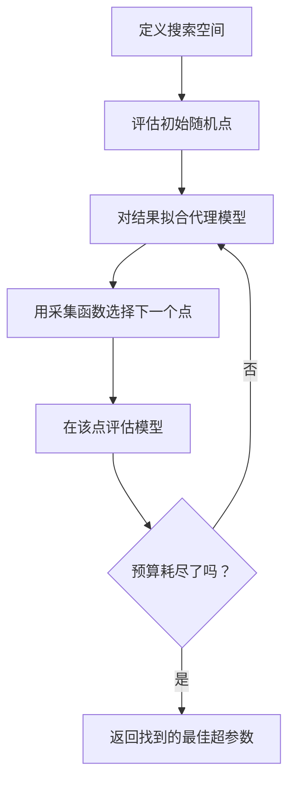
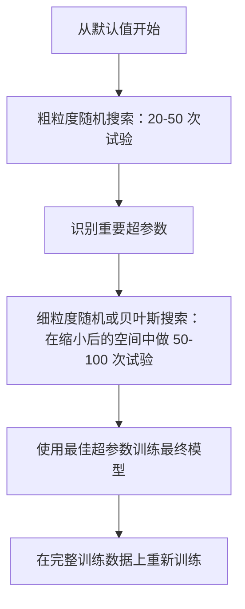

# 超参数调优 (Hyperparameter Tuning)

> 超参数 (hyperparameters) 是训练开始前你要先拧好的旋钮。拧得好不好，决定了模型只是平庸，还是足够优秀。

**类型：** 构建
**语言：** Python
**先修要求：** 第 2 阶段，第 11 课（集成方法 / Ensemble Methods）
**时间：** ~90 分钟

## 学习目标

- 从零实现网格搜索 (grid search)、随机搜索 (random search) 和贝叶斯优化 (Bayesian optimization)，并比较它们的样本效率
- 解释为什么当大多数超参数的有效维度很低时，随机搜索会优于网格搜索
- 使用代理模型 (surrogate model) 和采集函数 (acquisition function) 构建一个贝叶斯优化循环来引导搜索
- 设计一套超参数调优策略，通过正确使用交叉验证避免对验证集过拟合

## 问题

你的梯度提升模型有学习率 (learning rate)、树的数量、最大深度 (max depth)、每个叶节点的最小样本数 (min samples per leaf)、子采样率 (subsample ratio) 和列采样率 (column sample ratio)。这就是 6 个超参数。如果每个超参数都有 5 个合理取值，那么网格共有 5^6 = 15,625 种组合。每次训练耗时 10 秒，全部试完就是 43 小时的计算量。

网格搜索是最显眼的做法，但在规模上来之后也是最差的做法。随机搜索用更少的算力就能做得更好。贝叶斯优化还能通过学习以往评估结果进一步提升效果。知道该用哪种策略、知道哪些超参数真正重要，能帮你省掉好几天被浪费的 GPU 时间。

## 概念

### 参数 vs 超参数

参数 (parameters) 是在训练过程中学出来的（权重、偏置、分裂阈值）。超参数是在训练开始前设定好的，用来控制“如何学习”。

| 超参数 | 它控制什么 | 典型范围 |
|---------------|-----------------|---------------|
| 学习率 | 每次更新的步长 | 0.001 到 1.0 |
| 树的数量 / 训练轮数 | 训练多久 | 10 到 10,000 |
| 最大深度 | 模型复杂度 | 1 到 30 |
| 正则化 (lambda) | 防止过拟合 | 0.0001 到 100 |
| 批大小 (batch size) | 梯度估计噪声 | 16 到 512 |
| Dropout 比率 | 被丢弃的神经元比例 | 0.0 到 0.5 |

### 网格搜索 (Grid Search)

网格搜索会评估指定取值的每一种组合。它穷举、直观，但代价会随着超参数数量呈指数级增长。

```
Grid for 2 hyperparameters:

  learning_rate: [0.01, 0.1, 1.0]
  max_depth:     [3, 5, 7]

  Evaluations: 3 x 3 = 9 combinations

  (0.01, 3)  (0.01, 5)  (0.01, 7)
  (0.1,  3)  (0.1,  5)  (0.1,  7)
  (1.0,  3)  (1.0,  5)  (1.0,  7)
```

网格搜索有一个根本缺陷：如果一个超参数很重要，而另一个并不重要，那么大多数评估都会被浪费。9 次评估里，你只在真正重要的那个参数上看到了 3 个不同取值。

### 随机搜索 (Random Search)

随机搜索不是从网格里枚举，而是从分布中采样超参数。在同样只有 9 次评估预算时，你会为每个超参数拿到 9 个不同的取值。


为什么随机搜索能胜过网格搜索（Bergstra & Bengio, 2012）：

- 大多数超参数的有效维度都很低。对某个具体问题来说，6 个超参数里真正重要的通常只有 1-2 个。
- 网格搜索会把大量评估浪费在不重要的维度上。
- 在相同预算下，随机搜索会更密集地覆盖那些重要维度。
- 如果最优点确实存在于搜索空间中，那么进行 60 次随机试验，你有 95% 的概率找到距离最优值 5% 以内的点。

### 贝叶斯优化 (Bayesian Optimization)

随机搜索不会利用结果。它不会学到“高学习率会发散”，也不会学到“深度 3 始终优于深度 10”。贝叶斯优化会利用过去的评估结果来决定下一步该搜哪里。



两个关键组成部分：

**代理模型：** 一个评估成本很低的模型（通常是高斯过程 / Gaussian process），用来近似昂贵的目标函数。它会在搜索空间中的任意一点给出预测值和不确定性估计。

**采集函数：** 决定下一次去哪里评估，在利用 (exploitation，围绕已知好点搜索) 与探索 (exploration，在高不确定区域搜索) 之间取得平衡。常见选择有：

- **Expected Improvement (EI)：** 在这个点上，我们预期会比当前最优值提升多少？
- **Upper Confidence Bound (UCB)：** 预测值加上若干倍不确定性。UCB 越高，说明这个点要么很有前景，要么还没被充分探索。
- **Probability of Improvement (PI)：** 这个点超过当前最优值的概率有多大？

贝叶斯优化通常能用比随机搜索少 2-5 倍的评估次数，找到更好的超参数。与真实模型训练成本相比，拟合代理模型的开销几乎可以忽略不计。

### 早停 (Early Stopping)

不是每次训练都需要跑到结束。如果某个配置在 10 个 epoch 之后明显很差，就应当立刻停掉，继续下一个配置。这就是超参数搜索语境下的早停。

策略包括：
- **基于耐心值 (patience-based)：** 如果验证损失连续 N 个 epoch 没有改善，就停止
- **中位数剪枝 (median pruning)：** 如果某次试验的中间结果比同一步骤上已完成试验的中位数更差，就停止它
- **Hyperband：** 先给很多配置分配很小的预算，再逐步把更多预算加给表现最好的那些配置

Hyperband 特别有效。它先让 81 个配置各训练 1 个 epoch，保留前三分之一，给它们 3 个 epoch，再保留前三分之一，如此继续。与把所有配置都用完整预算跑完相比，它能快 10-50 倍找到好配置。

### 学习率调度器 (Learning Rate Schedulers)

学习率几乎总是最重要的超参数。与其把它固定住，不如在训练过程中动态调整。

| 调度器 | 公式 | 何时使用 |
|-----------|---------|-------------|
| 阶梯衰减 (step decay) | Multiply by 0.1 every N epochs | 经典 CNN 训练 |
| 余弦退火 (cosine annealing) | lr * 0.5 * (1 + cos(pi * t / T)) | 现代默认选择 |
| 预热 + 衰减 (warmup + decay) | Linear increase then cosine decay | Transformers |
| 单周期 (one-cycle) | Increase then decrease over one cycle | 快速收敛 |
| 平台期下降 (reduce on plateau) | Reduce by factor when metric stalls | 稳妥默认值 |

### 超参数重要性 (Hyperparameter Importance)

并不是所有超参数都同样重要。关于随机森林（Probst et al., 2019）和梯度提升的研究显示出一些稳定规律：

**高重要性：**
- 学习率（永远先调它）
- 估计器数量 / epoch 数（优先用早停代替手动调）
- 正则化强度

**中等重要性：**
- 最大深度 / 层数
- 每个叶节点最小样本数 / 权重衰减
- 子采样率

**低重要性：**
- 最大特征数（针对随机森林）
- 具体激活函数的选择
- 批大小（只要在合理范围内）

先调重要的，把其他参数留在默认值。

### 实用策略



具体工作流如下：

1. **先用库的默认值。** 这些默认值通常由经验丰富的实践者设定，往往已经走完了 80% 的路。
2. **做粗粒度随机搜索。** 用宽范围跑 20-50 次试验。通过早停快速杀掉差配置。
3. **分析结果。** 哪些超参数与性能相关？据此缩小搜索空间。
4. **做精细搜索。** 在缩小后的空间中使用贝叶斯优化或聚焦后的随机搜索。再跑 50-100 次试验。
5. **用找到的最佳超参数在全部训练数据上重新训练。**

### 与交叉验证结合 (Cross-Validation Integration)

只在一次验证集划分上调超参数是有风险的。最优超参数可能只是过拟合了那个特定验证折。嵌套交叉验证 (nested cross-validation) 通过两层循环解决这个问题：

- **外层循环**（评估）：把数据划分为 train+val 和 test，给出无偏性能报告。
- **内层循环**（调优）：再把 train+val 划分为 train 和 val，寻找最佳超参数。

```mermaid
flowchart TD
    D[完整数据集] --> O1[外层折 1：测试集]
    D --> O2[外层折 2：测试集]
    D --> O3[外层折 3：测试集]
    D --> O4[外层折 4：测试集]
    D --> O5[外层折 5：测试集]

    O1 --> I1[在剩余数据上做内层 5 折交叉验证]
    I1 --> T1[折 1 的最佳超参数]
    T1 --> E1[在外层测试折 1 上评估]

    O2 --> I2[在剩余数据上做内层 5 折交叉验证]
    I2 --> T2[折 2 的最佳超参数]
    T2 --> E2[在外层测试折 2 上评估]
```



每个外层折都会独立找到自己的一组最佳超参数。外层得分就是对泛化性能的无偏估计。

使用 sklearn 时：

```python
from sklearn.model_selection import cross_val_score, GridSearchCV
from sklearn.ensemble import GradientBoostingRegressor

inner_cv = GridSearchCV(
    GradientBoostingRegressor(),
    param_grid={
        "learning_rate": [0.01, 0.05, 0.1],
        "max_depth": [2, 3, 5],
        "n_estimators": [50, 100, 200],
    },
    cv=5,
    scoring="neg_mean_squared_error",
)

outer_scores = cross_val_score(
    inner_cv, X, y, cv=5, scoring="neg_mean_squared_error"
)

print(f"Nested CV MSE: {-outer_scores.mean():.4f} +/- {outer_scores.std():.4f}")
```

这会很昂贵（5 个外层折 × 5 个内层折 × 27 个网格点 = 675 次模型拟合），但它能给你一个值得信赖的性能估计。在论文里汇报最终结果，或者决策代价很高时，就该用它。

### 实用建议

**先从学习率开始。** 对梯度类方法来说，它永远是最重要的超参数。学习率一旦选错，其他超参数几乎都失去意义。先把其他参数固定在默认值，只扫学习率。

**对学习率和正则化使用 log-uniform 分布。** 0.001 到 0.01 的差异，与 0.1 到 1.0 的差异同样重要。线性搜索会把预算浪费在数值较大的那一端。

**用早停代替调 `n_estimators`。** 对提升法和神经网络来说，把 `n_estimators` 或 epoch 设得高一些，再让早停决定何时停止。这严格优于把迭代次数当成超参数来调。

**预算分配。** 把 60% 的调参预算花在最重要的前 2 个超参数上，剩下 40% 再分配给其他参数。前 2 个通常解释了绝大多数性能波动。

**尺度很重要。** 永远不要按对数尺度搜索 batch size（16、32、64 这样就很好）。学习率则一定要按对数尺度搜索。搜索分布要匹配超参数影响模型的方式。

| 模型类型 | 最重要的超参数 | 推荐搜索方式 | 预算 |
|-----------|--------------------|--------------------|--------|
| 随机森林 | `n_estimators`、`max_depth`、`min_samples_leaf` | 随机搜索，50 次试验 | 低（训练快） |
| 梯度提升 | `learning_rate`、`n_estimators`、`max_depth` | 贝叶斯优化，100 次试验 + 早停 | 中 |
| 神经网络 | `learning_rate`、`weight_decay`、`batch_size` | 贝叶斯或随机搜索，100+ 次试验 | 高（训练慢） |
| SVM | `C`、`gamma`（RBF kernel） | 对数尺度网格搜索，25-50 次试验 | 低（仅 2 个参数） |
| Lasso/Ridge | `alpha` | 对数尺度上一维搜索，20 次试验 | 很低 |
| XGBoost | `learning_rate`、`max_depth`、`subsample`、`colsample` | 贝叶斯优化，100-200 次试验 + 早停 | 中 |

**拿不准的时候：** 随机搜索，试验次数至少设为“超参数个数的 2 倍”（例如 6 个超参数，至少 12 次试验）。你会惊讶地发现，50 次随机搜索往往就能打败精心设计的网格搜索。

## 动手实现

### 第 1 步：从零实现网格搜索

`code/tuning.py` 中的代码从零实现了网格搜索、随机搜索和一个简单版贝叶斯优化器。

```python
def grid_search(model_fn, param_grid, X_train, y_train, X_val, y_val):
    keys = list(param_grid.keys())
    values = list(param_grid.values())
    best_score = -float("inf")
    best_params = None
    n_evals = 0

    for combo in itertools.product(*values):
        params = dict(zip(keys, combo))
        model = model_fn(**params)
        model.fit(X_train, y_train)
        score = evaluate(model, X_val, y_val)
        n_evals += 1

        if score > best_score:
            best_score = score
            best_params = params

    return best_params, best_score, n_evals
```

### 第 2 步：从零实现随机搜索

```python
def random_search(model_fn, param_distributions, X_train, y_train,
                  X_val, y_val, n_iter=50, seed=42):
    rng = np.random.RandomState(seed)
    best_score = -float("inf")
    best_params = None

    for _ in range(n_iter):
        params = {k: sample(v, rng) for k, v in param_distributions.items()}
        model = model_fn(**params)
        model.fit(X_train, y_train)
        score = evaluate(model, X_val, y_val)

        if score > best_score:
            best_score = score
            best_params = params

    return best_params, best_score, n_iter
```

### 第 3 步：贝叶斯优化（简化版）

核心思想是：对已经观察到的（超参数、得分）对拟合一个高斯过程，然后使用采集函数来决定下一步去哪里搜索。

```python
class SimpleBayesianOptimizer:
    def __init__(self, search_space, n_initial=5):
        self.search_space = search_space
        self.n_initial = n_initial
        self.X_observed = []
        self.y_observed = []

    def _kernel(self, x1, x2, length_scale=1.0):
        dists = np.sum((x1[:, None, :] - x2[None, :, :]) ** 2, axis=2)
        return np.exp(-0.5 * dists / length_scale ** 2)

    def _fit_gp(self, X_new):
        X_obs = np.array(self.X_observed)
        y_obs = np.array(self.y_observed)
        y_mean = y_obs.mean()
        y_centered = y_obs - y_mean

        K = self._kernel(X_obs, X_obs) + 1e-4 * np.eye(len(X_obs))
        K_star = self._kernel(X_new, X_obs)

        L = np.linalg.cholesky(K)
        alpha = np.linalg.solve(L.T, np.linalg.solve(L, y_centered))
        mu = K_star @ alpha + y_mean

        v = np.linalg.solve(L, K_star.T)
        var = 1.0 - np.sum(v ** 2, axis=0)
        var = np.maximum(var, 1e-6)

        return mu, var

    def _expected_improvement(self, mu, var, best_y):
        sigma = np.sqrt(var)
        z = (mu - best_y) / (sigma + 1e-10)
        ei = sigma * (z * norm_cdf(z) + norm_pdf(z))
        return ei

    def suggest(self):
        if len(self.X_observed) < self.n_initial:
            return sample_random(self.search_space)

        candidates = [sample_random(self.search_space) for _ in range(500)]
        X_cand = np.array([to_vector(c) for c in candidates])
        mu, var = self._fit_gp(X_cand)
        ei = self._expected_improvement(mu, var, max(self.y_observed))
        return candidates[np.argmax(ei)]

    def observe(self, params, score):
        self.X_observed.append(to_vector(params))
        self.y_observed.append(score)
```

GP 代理会在每个候选点给出两样东西：预测得分 (`mu`) 和不确定性 (`var`)。Expected Improvement 会在两者之间做平衡：它偏好那些“模型预测得分高”或者“不确定性高”的点。前期大多数点都带着高不确定性，因此优化器会更多探索；后期则会集中到最有希望的区域。

### 第 4 步：比较所有方法

在同一个合成目标函数上运行这三种方法并进行比较。这里的比较使用了一个简化包装器，它直接把目标函数交给每个优化器调用（不涉及模型训练），所以 API 与上面的基于模型的实现略有不同：

```python
def synthetic_objective(params):
    lr = params["learning_rate"]
    depth = params["max_depth"]
    return -(np.log10(lr) + 2) ** 2 - (depth - 4) ** 2 + 10

param_grid = {
    "learning_rate": [0.001, 0.01, 0.1, 1.0],
    "max_depth": [2, 3, 4, 5, 6, 7, 8],
}

grid_best = None
grid_score = -float("inf")
grid_history = []
for combo in itertools.product(*param_grid.values()):
    params = dict(zip(param_grid.keys(), combo))
    score = synthetic_objective(params)
    grid_history.append((params, score))
    if score > grid_score:
        grid_score = score
        grid_best = params

param_dist = {
    "learning_rate": ("log_float", 0.001, 1.0),
    "max_depth": ("int", 2, 8),
}

rand_best = None
rand_score = -float("inf")
rand_history = []
rng = np.random.RandomState(42)
for _ in range(28):
    params = {k: sample(v, rng) for k, v in param_dist.items()}
    score = synthetic_objective(params)
    rand_history.append((params, score))
    if score > rand_score:
        rand_score = score
        rand_best = params

optimizer = SimpleBayesianOptimizer(param_dist, n_initial=5)
bayes_history = []
for _ in range(28):
    params = optimizer.suggest()
    score = synthetic_objective(params)
    optimizer.observe(params, score)
    bayes_history.append((params, score))
bayes_score = max(s for _, s in bayes_history)

print(f"{'Method':<20} {'Best Score':>12} {'Evaluations':>12}")
print("-" * 50)
print(f"{'Grid Search':<20} {grid_score:>12.4f} {len(grid_history):>12}")
print(f"{'Random Search':<20} {rand_score:>12.4f} {len(rand_history):>12}")
print(f"{'Bayesian Opt':<20} {bayes_score:>12.4f} {len(bayes_history):>12}")
```

在相同预算下，贝叶斯优化通常能最快找到最佳得分，因为它不会把评估浪费在明显很差的区域。随机搜索比网格搜索覆盖得更广。只有在超参数非常少、并且你负担得起穷举时，网格搜索才会赢。

## 如何使用

### 实战中的 Optuna

Optuna 是认真做超参数调优时最推荐的库。它开箱即支持剪枝、分布式搜索和可视化。

```python
import optuna

def objective(trial):
    lr = trial.suggest_float("learning_rate", 1e-4, 1e-1, log=True)
    n_est = trial.suggest_int("n_estimators", 50, 500)
    max_depth = trial.suggest_int("max_depth", 2, 10)

    model = GradientBoostingRegressor(
        learning_rate=lr,
        n_estimators=n_est,
        max_depth=max_depth,
    )
    model.fit(X_train, y_train)
    return mean_squared_error(y_val, model.predict(X_val))

study = optuna.create_study(direction="minimize")
study.optimize(objective, n_trials=100)

print(f"Best params: {study.best_params}")
print(f"Best MSE: {study.best_value:.4f}")
```

Optuna 的关键特性：
- `suggest_float(..., log=True)`：适合按对数尺度搜索的参数（学习率、正则化）
- `suggest_int`：用于整数参数
- `suggest_categorical`：用于离散选项
- 内置 `MedianPruner`，可对差试验做早停
- `study.trials_dataframe()`：便于分析

### 带剪枝的 Optuna

剪枝 (pruning) 会尽早停止那些没有希望的试验，节省大量算力。模式如下：

```python
import optuna
from sklearn.model_selection import cross_val_score

def objective(trial):
    params = {
        "learning_rate": trial.suggest_float("lr", 1e-4, 0.5, log=True),
        "max_depth": trial.suggest_int("max_depth", 2, 10),
        "n_estimators": trial.suggest_int("n_estimators", 50, 500),
        "subsample": trial.suggest_float("subsample", 0.5, 1.0),
    }

    model = GradientBoostingRegressor(**params)
    scores = cross_val_score(model, X_train, y_train, cv=3,
                             scoring="neg_mean_squared_error")
    mean_score = -scores.mean()

    trial.report(mean_score, step=0)
    if trial.should_prune():
        raise optuna.TrialPruned()

    return mean_score

pruner = optuna.pruners.MedianPruner(n_startup_trials=10, n_warmup_steps=5)
study = optuna.create_study(direction="minimize", pruner=pruner)
study.optimize(objective, n_trials=200)
```

`MedianPruner` 会在某次试验的中间值比同一步骤下所有已完成试验的中位数还差时停止它。使用剪枝时，必须调用 `trial.report()` 上报中间指标，再调用 `trial.should_prune()` 判断是否该停。`n_startup_trials=10` 保证在剪枝开始前，至少有 10 次试验完整跑完。这样通常能节省 40-60% 的总算力。

### sklearn 内置调参器

对于快速实验，sklearn 提供了 `GridSearchCV`、`RandomizedSearchCV` 和 `HalvingRandomSearchCV`：

```python
from sklearn.model_selection import RandomizedSearchCV
from scipy.stats import loguniform, randint

param_dist = {
    "learning_rate": loguniform(1e-4, 0.5),
    "max_depth": randint(2, 10),
    "n_estimators": randint(50, 500),
}

search = RandomizedSearchCV(
    GradientBoostingRegressor(),
    param_dist,
    n_iter=100,
    cv=5,
    scoring="neg_mean_squared_error",
    random_state=42,
    n_jobs=-1,
)
search.fit(X_train, y_train)
print(f"Best params: {search.best_params_}")
print(f"Best CV MSE: {-search.best_score_:.4f}")
```

对学习率和正则化请使用 scipy 的 `loguniform`。对整数型超参数使用 `randint`。`n_jobs=-1` 会把搜索并行到所有 CPU 核心。

### 超参数调优中的常见错误

**预处理导致的数据泄漏。** 如果你在交叉验证前就在完整数据集上拟合了 scaler，验证折中的信息就会泄漏进训练过程。一定要把预处理放进 `Pipeline`，这样它只会在训练折上拟合。

**对验证集过拟合。** 跑成千上万次试验，本质上就是在验证集上训练。要么用嵌套交叉验证来做最终性能评估，要么留出一个在调参过程中完全不碰的独立测试集。

**搜索范围太窄。** 如果最佳值出现在搜索空间边界上，说明你搜得还不够广。真正的最优值可能在范围外。一定要检查最佳参数是不是贴着边。

**忽视交互效应。** 在提升法里，学习率和估计器数量强相关。低学习率需要更多估计器。如果把它们分开调，结果会比联合调更差。

**迭代模型没有使用早停。** 对梯度提升和神经网络来说，把 `n_estimators` 或 epoch 设高，再配合早停，严格优于把迭代次数当成一个超参数单独去调。

## 练习

1. 在相同总预算（例如 50 次评估）下运行网格搜索和随机搜索。比较它们找到的最佳得分。用不同随机种子重复 10 次实验。随机搜索赢的频率有多高？

2. 从零实现 Hyperband。先让 81 个配置各训练 1 个 epoch。每轮保留前 1/3，并把它们的预算扩大 3 倍。把总计算量（所有配置所有 epoch 的总和）与“81 个配置都按完整预算训练”进行比较。

3. 把学习率调度器（余弦退火）加入第 11 课的梯度提升实现中。与固定学习率相比，它有帮助吗？

4. 使用 Optuna 在真实数据集上调一个 `RandomForestClassifier`（例如 sklearn 的乳腺癌数据集）。用 `optuna.visualization.plot_param_importances(study)` 看看哪些超参数最重要。它和本课给出的重要性排序一致吗？

5. 实现一个简单的采集函数（Expected Improvement），演示探索与利用的平衡。绘制代理模型的均值和不确定性，并展示 EI 选择下一次评估位置的方式。

## 关键术语

| 术语 | 人们常说 | 实际含义 |
|------|----------------|----------------------|
| 超参数 (Hyperparameter) | “你自己选的设置” | 训练前设定、用于控制学习过程的值，不是从数据里学出来的 |
| 网格搜索 (Grid search) | “把所有组合都试一遍” | 在指定参数网格上做穷举搜索。成本呈指数增长。 |
| 随机搜索 (Random search) | “就随机采样呗” | 从分布中采样超参数。对重要维度的覆盖通常优于网格搜索。 |
| 贝叶斯优化 (Bayesian optimization) | “聪明的搜索” | 用目标函数的代理模型来决定下一次评估哪里，在探索与利用之间做平衡 |
| 代理模型 (Surrogate model) | “便宜的近似” | 一个模型（通常是高斯过程），根据已观察到的评估结果去近似昂贵目标函数 |
| 采集函数 (Acquisition function) | “下一步看哪里” | 通过平衡预期改进与不确定性来给候选点打分。EI 和 UCB 都很常见。 |
| 早停 (Early stopping) | “别再浪费时间了” | 当验证性能不再提升时提前终止训练 |
| Hyperband | “配置的淘汰赛” | 自适应资源分配：先用小预算启动很多配置，只保留最好的并逐步增加预算 |
| 学习率调度器 (Learning rate scheduler) | “训练过程中改 lr” | 一个在训练过程中动态调整学习率、帮助更好收敛的函数 |

## 延伸阅读

- [Bergstra & Bengio: Random Search for Hyper-Parameter Optimization (2012)](https://jmlr.org/papers/v13/bergstra12a.html) -- 证明随机搜索优于网格搜索的经典论文
- [Snoek et al., Practical Bayesian Optimization of Machine Learning Algorithms (2012)](https://arxiv.org/abs/1206.2944) -- 机器学习中的贝叶斯优化
- [Li et al., Hyperband: A Novel Bandit-Based Approach (2018)](https://jmlr.org/papers/v18/16-558.html) -- Hyperband 论文
- [Optuna: A Next-generation Hyperparameter Optimization Framework](https://arxiv.org/abs/1907.10902) -- Optuna 论文
- [Probst et al., Tunability: Importance of Hyperparameters (2019)](https://jmlr.org/papers/v20/18-444.html) -- 哪些超参数真正重要

