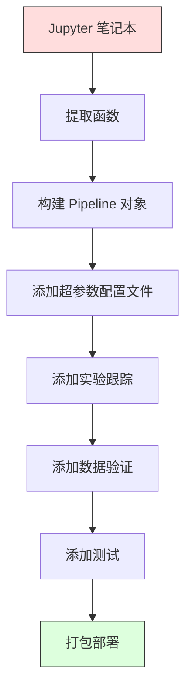

# 机器学习流水线（ML Pipelines）

> 模型（model）不是产品。流水线（pipeline）才是。流水线涵盖了从原始数据到已部署预测的全部过程，而且每一步都必须可复现。

**类型：** 构建（Build）
**语言：** Python
**前置要求：** 第二阶段，第 12 课（超参数调优（Hyperparameter Tuning））
**时间：** ~120 分钟

## 学习目标

- 从零构建一个 ML 流水线，把缺失值填补（imputation）、缩放（scaling）、编码（encoding）和模型训练（model training）串联成一个可复现的对象
- 识别数据泄漏（data leakage）场景，并解释流水线如何通过只在训练数据上拟合转换器（transformers）来防止泄漏
- 构建一个列转换器（ColumnTransformer），对数值特征（numeric features）和类别特征（categorical features）应用不同的预处理（preprocessing）
- 实现流水线序列化（serialization），并证明同一个已拟合流水线在训练和生产环境中会产生一致的结果

## 问题

你有一个笔记本，它会加载数据、用中位数填补缺失值、缩放特征、训练模型并打印准确率。它能跑通。你把它发布了。

一个月后，有人重新训练模型，却得到了不同的结果。中位数是在包含测试数据在内的完整数据集上计算的（数据泄漏）。缩放参数没有被保存，所以推理时使用了不同的统计量。特征工程代码在训练和服务阶段之间靠复制粘贴维护，结果两份代码逐渐偏离。生产环境中的某个类别列出现了编码器从未见过的新取值。

这些并非假设情景。它们正是 ML 系统在生产环境中最常见的失败原因。流水线通过把每个转换步骤打包为一个单一、有序、可复现的对象，解决了这些问题。

## 概念

### 什么是流水线

流水线是先执行一系列有序的数据转换（data transformations），再接上一个模型的过程。每个步骤都把前一步的输出作为自己的输入。整个流水线只在训练数据上拟合一次。在推理（inference）时，同一个已拟合流水线会对新数据执行相同的转换并产出预测。


流水线保证：
- 转换步骤只会在训练数据上拟合（fit），不会发生泄漏
- 在推理时会应用完全相同的转换
- 整个对象可以被序列化并作为一个制品（artifact）部署
- 交叉验证（cross-validation）会在每个折（fold）上单独应用流水线，防止隐蔽的数据泄漏

### 数据泄漏：无声杀手

当测试集或未来数据中的信息污染了训练过程时，就会发生数据泄漏。流水线可以防止最常见的几种泄漏形式。

**有泄漏（错误）：**
```python
X = df.drop("target", axis=1)
y = df["target"]

scaler = StandardScaler()
X_scaled = scaler.fit_transform(X)

X_train, X_test = X_scaled[:800], X_scaled[800:]
y_train, y_test = y[:800], y[800:]
```

缩放器看到了测试数据。均值和标准差中包含了测试样本。这会抬高准确率估计。

**正确：**
```python
X_train, X_test = X[:800], X[800:]

scaler = StandardScaler()
X_train_scaled = scaler.fit_transform(X_train)
X_test_scaled = scaler.transform(X_test)
```

有了流水线，你就不需要再手动时刻提防这个问题。流水线会自动处理好它。

### sklearn 的 `Pipeline`

sklearn 的 `Pipeline` 会把转换器和估计器（estimator）串联起来。它提供 `.fit()`、`.predict()` 和 `.score()`，并按顺序应用全部步骤。

```python
from sklearn.pipeline import Pipeline
from sklearn.preprocessing import StandardScaler
from sklearn.linear_model import LogisticRegression

pipe = Pipeline([
    ("scaler", StandardScaler()),
    ("model", LogisticRegression()),
])

pipe.fit(X_train, y_train)
predictions = pipe.predict(X_test)
```

当你调用 `pipe.fit(X_train, y_train)` 时：
1. 缩放器会对 X_train 调用 `fit_transform`
2. 模型会对缩放后的 X_train 调用 `fit`

当你调用 `pipe.predict(X_test)` 时：
1. 缩放器会对 X_test 调用 `transform`（而不是 `fit_transform`）
2. 模型会对缩放后的 X_test 调用 `predict`

缩放器在拟合阶段永远不会看到测试数据。这就是核心所在。

### ColumnTransformer：为不同列使用不同流水线

真实数据集里既有数值列，也有类别列，它们需要不同的预处理方式。`ColumnTransformer` 正是为此设计的。

```python
from sklearn.compose import ColumnTransformer
from sklearn.preprocessing import StandardScaler, OneHotEncoder
from sklearn.impute import SimpleImputer

numeric_pipe = Pipeline([
    ("impute", SimpleImputer(strategy="median")),
    ("scale", StandardScaler()),
])

categorical_pipe = Pipeline([
    ("impute", SimpleImputer(strategy="most_frequent")),
    ("encode", OneHotEncoder(handle_unknown="ignore")),
])

preprocessor = ColumnTransformer([
    ("num", numeric_pipe, ["age", "income", "score"]),
    ("cat", categorical_pipe, ["city", "gender", "plan"]),
])

full_pipeline = Pipeline([
    ("preprocess", preprocessor),
    ("model", GradientBoostingClassifier()),
])
```

OneHotEncoder 中的 `handle_unknown="ignore"` 对生产环境至关重要。当出现一个新类别时（比如模型从未见过的城市），它会生成一个全零向量，而不是直接崩溃。

### 实验跟踪

流水线让训练过程可复现，但你还需要跨实验跟踪到底发生了什么：用了哪些超参数，使用了哪个数据集版本，指标是什么，运行的是哪份代码。

**MLflow** 是最常见的开源解决方案：

```python
import mlflow

with mlflow.start_run():
    mlflow.log_param("max_depth", 5)
    mlflow.log_param("n_estimators", 100)
    mlflow.log_param("learning_rate", 0.1)

    pipe.fit(X_train, y_train)
    accuracy = pipe.score(X_test, y_test)

    mlflow.log_metric("accuracy", accuracy)
    mlflow.sklearn.log_model(pipe, "model")
```

每次运行都会记录参数、指标、制品以及完整模型。你可以比较不同运行、复现实验中的任意一次，并部署任意模型版本。

**Weights & Biases (wandb)** 提供了同样的能力，只是配套的是托管仪表盘：

```python
import wandb

wandb.init(project="my-pipeline")
wandb.config.update({"max_depth": 5, "n_estimators": 100})

pipe.fit(X_train, y_train)
accuracy = pipe.score(X_test, y_test)

wandb.log({"accuracy": accuracy})
```

### 模型版本管理

完成实验跟踪后，你还需要管理模型版本。哪个模型在线上？哪个在预发布环境？上周跑的是哪个？

MLflow 的模型注册表（Model Registry）提供：
- **版本跟踪：** 每个保存的模型都会得到一个版本号
- **阶段流转：** “Staging”、“Production”、“Archived”
- **审批流程：** 模型必须被显式提升后才能进入生产环境
- **回滚：** 可以立即切回之前的版本

### 使用 DVC 进行数据版本控制

代码用 git 做版本管理。数据也应该被版本管理，但 git 无法很好地处理大文件。DVC（Data Version Control）就是为了解决这个问题。

```
dvc init
dvc add data/training.csv
git add data/training.csv.dvc data/.gitignore
git commit -m "Track training data"
dvc push
```

DVC 会把真实数据存放在远程存储（S3、GCS、Azure）中，并在 git 里保留一个很小的 `.dvc` 文件来记录哈希值。当你 checkout 某个 git commit 时，`dvc checkout` 会还原当时使用的精确数据。

这意味着每个 git commit 都同时固定了代码和数据。完整的可复现性由此实现。

### 可复现实验

一个可复现实验需要四样东西：

1. **固定随机种子：** 为 numpy、random 以及所用框架（torch、sklearn）设置种子
2. **锁定依赖版本：** 在 requirements.txt 或 poetry.lock 中写明精确版本
3. **数据版本化：** 使用 DVC 或类似工具
4. **配置文件：** 所有超参数都放进配置里，不要硬编码

```python
import numpy as np
import random

def set_seed(seed=42):
    random.seed(seed)
    np.random.seed(seed)
    try:
        import torch
        torch.manual_seed(seed)
        torch.cuda.manual_seed_all(seed)
        torch.backends.cudnn.deterministic = True
    except ImportError:
        pass
```

### 从笔记本（Notebook）到生产流水线



典型的演进路径如下：

1. **Notebook 探索：** 快速实验、可视化、提出特征想法
2. **提取函数：** 把预处理、特征工程和评估逻辑移入模块
3. **构建 Pipeline：** 把各个转换步骤串成一个 sklearn Pipeline 或自定义类
4. **配置管理：** 把所有超参数移入 YAML/JSON 配置
5. **实验跟踪：** 加入 MLflow 或 wandb 日志
6. **数据验证：** 在训练前检查模式（schema）、分布以及缺失值模式
7. **测试：** 为转换器编写单元测试，为完整流水线编写集成测试
8. **部署：** 序列化流水线，封装成 API（FastAPI、Flask），再进行容器化

### 常见流水线错误

| 错误 | 为什么不好 | 修复方法 |
|---------|-------------|-----|
| 在切分前就对完整数据进行拟合 | 数据泄漏 | 使用带 `cross_val_score` 的 Pipeline |
| 在流水线之外做特征工程 | 训练和服务阶段的转换不一致 | 把所有转换都放进 Pipeline |
| 不处理未知类别 | 生产环境遇到新取值时会崩溃 | `OneHotEncoder(handle_unknown="ignore")` |
| 列名写死 | 模式变化时就会失效 | 从配置中读取列名列表 |
| 没有数据验证 | 遇到坏数据时会静默地产生错误预测 | 在预测前加入模式检查 |
| 训练/服务偏差 | 模型在线上看到的特征与训练时不同 | 训练和服务共用同一个 Pipeline 对象 |

## 动手构建

`code/pipeline.py` 中的代码从零开始构建了一个完整的 ML 流水线：

### 第 1 步：自定义转换器

```python
class CustomTransformer:
    def __init__(self):
        self.means = None
        self.stds = None

    def fit(self, X):
        self.means = np.mean(X, axis=0)
        self.stds = np.std(X, axis=0)
        self.stds[self.stds == 0] = 1.0
        return self

    def transform(self, X):
        return (X - self.means) / self.stds

    def fit_transform(self, X):
        return self.fit(X).transform(X)
```

### 第 2 步：从零实现流水线

```python
class PipelineFromScratch:
    def __init__(self, steps):
        self.steps = steps

    def fit(self, X, y=None):
        X_current = X.copy()
        for name, step in self.steps[:-1]:
            X_current = step.fit_transform(X_current)
        name, model = self.steps[-1]
        model.fit(X_current, y)
        return self

    def predict(self, X):
        X_current = X.copy()
        for name, step in self.steps[:-1]:
            X_current = step.transform(X_current)
        name, model = self.steps[-1]
        return model.predict(X_current)
```

### 第 3 步：结合流水线的交叉验证

代码演示了：当你把流水线用于交叉验证时，如何防止数据泄漏——缩放器会在每个折的训练数据上分别拟合。

### 第 4 步：使用 sklearn 的完整生产流水线

这里会构建一个完整流水线，包含 `ColumnTransformer`、多条预处理路径和模型，并配合正确的交叉验证与实验日志完成训练。

## 交付成果

本课会产出：
- `outputs/prompt-ml-pipeline.md` -- 一个用于构建和调试 ML 流水线的技能
- `code/pipeline.py` -- 一个从零实现到 sklearn 版本的完整流水线

## 练习

1. 构建一个流水线来处理包含 3 个数值列和 2 个类别列的数据集。使用 `ColumnTransformer` 对数值列应用“中位数填补 + 缩放”，对类别列应用“最高频填补 + one-hot 编码（one-hot encoding）”。使用 5 折交叉验证进行训练。

2. 故意引入数据泄漏：在切分前先对完整数据集拟合缩放器。比较交叉验证分数（有泄漏）和流水线交叉验证分数（干净）的差异。这个差异有多大？

3. 使用 `joblib.dump` 序列化你的流水线。在另一个脚本中加载它并运行预测。验证预测结果完全一致。

4. 给流水线添加一个自定义转换器，为最重要的两个数值列创建二次多项式特征。它应该放在流水线的哪个位置？

5. 为流水线配置 MLflow 跟踪。使用不同的超参数运行 5 组实验。用 MLflow UI（`mlflow ui`）比较这些运行，并选出最好的模型。

## 关键术语

| 术语 | 人们常说 | 实际含义 |
|------|----------------|----------------------|
| Pipeline | “转换链 + 模型” | 一个由已拟合转换器和模型组成的有序序列，会作为一个整体被应用，以防止泄漏 |
| 数据泄漏 | “测试信息泄漏进训练” | 使用训练集之外的信息来构建模型，从而抬高性能估计 |
| ColumnTransformer | “每列不同预处理” | 对不同列子集应用不同流水线，并把结果合并起来 |
| 实验跟踪 | “记录你的运行” | 为每次训练运行记录参数、指标、制品和代码版本 |
| MLflow | “跟踪并部署模型” | 用于实验跟踪、模型注册表和部署的开源平台 |
| DVC | “数据版的 Git” | 面向大数据文件的版本控制系统，在 git 中存储哈希，在远程存储中保存数据 |
| 模型注册表 | “模型版本目录” | 用阶段标签（staging、production、archived）跟踪模型版本的系统 |
| 训练/服务偏差 | “它在 Notebook 里明明能跑” | 数据在训练和推理阶段的处理方式不同，从而导致隐蔽错误 |
| 可复现性 | “同样的代码，同样的结果” | 用相同的代码、数据和配置得到完全一致结果的能力 |

## 延伸阅读

- [scikit-learn Pipeline docs](https://scikit-learn.org/stable/modules/compose.html) -- 官方流水线参考文档
- [MLflow documentation](https://mlflow.org/docs/latest/index.html) -- 实验跟踪与模型注册表
- [DVC documentation](https://dvc.org/doc) -- 数据版本控制
- [Sculley et al., Hidden Technical Debt in Machine Learning Systems (2015)](https://papers.nips.cc/paper/2015/hash/86df7dcfd896fcaf2674f757a2463eba-Abstract.html) -- 关于 ML 系统复杂性的经典论文
- [Google ML Best Practices: Rules of ML](https://developers.google.com/machine-learning/guides/rules-of-ml) -- 实用的生产级 ML 建议
