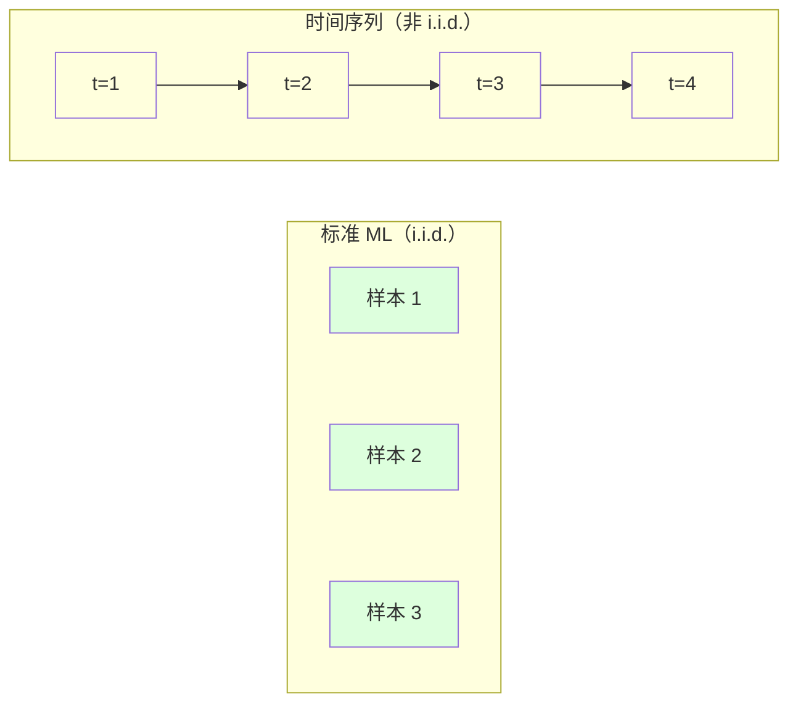
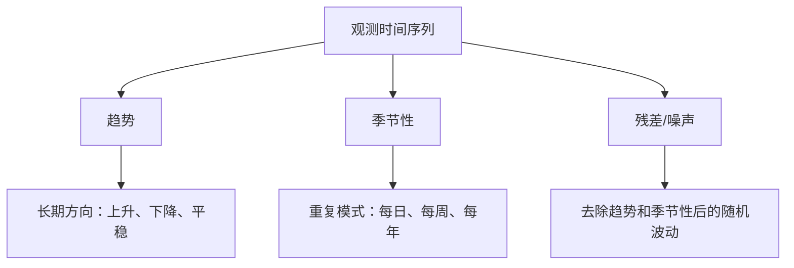
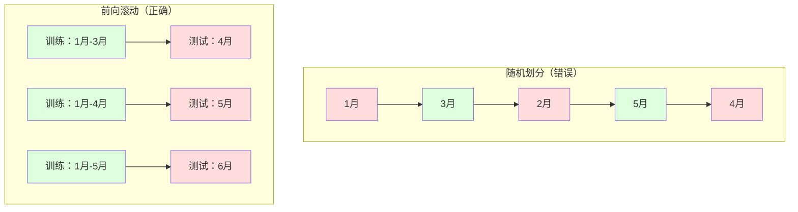

# 时间序列基础

> 如果你先检查平稳性，过去的表现确实能够预测未来结果。

**类型：** 构建
**语言：** Python
**先修要求：** 第 2 阶段，第 01-09 课
**时长：** ~90 分钟

## 学习目标

- 将时间序列（time series）分解为趋势（trend）、季节性（seasonality）和残差（residual）成分，并检验平稳性（stationarity）
- 实现滞后特征（lag features）和滚动统计量（rolling statistics），把时间序列转换为监督学习问题（supervised learning problem）
- 构建前向滚动验证（walk-forward validation）框架，防止未来数据泄漏到训练过程中
- 解释为什么随机训练/测试划分对时间序列无效，并展示它与正确时间划分之间的性能差距

## 问题

你手里有按时间排序的数据：每日销售额、每小时温度、每分钟 CPU 使用率、每周股价。你想预测下一个值、下一周、下一个季度。

于是你拿起标准的机器学习（ML）工具箱：随机训练/测试划分、交叉验证、输入特征矩阵（feature matrix），输出预测结果。结果每一步都错了。

时间序列打破了标准 ML 所依赖的假设。样本不是独立的——今天的温度取决于昨天的温度。随机划分会把未来信息泄漏到过去。那些在回测（backtest）中看起来很棒的特征，在生产环境中却会失效，因为它们依赖的模式会随着时间变化。

一个在随机交叉验证中达到 95% 准确率的模型，在按时间顺序进行的正确评估下可能只有 55%。这不是技术细节，而是纸面上有效的模型和生产中真正有效的模型之间的区别。

本课涵盖基础知识：时间数据为什么不同、如何诚实地评估模型，以及怎样把时间序列变成标准 ML 模型可以消费的特征。

## 概念

### 时间序列有什么不同

标准 ML 假设数据是 i.i.d.——独立同分布（independent and identically distributed）。每个样本都独立于其他样本，并从相同分布中抽取。时间序列同时违背了这两点：

- **不独立。** 今天的股价依赖昨天的股价。本周销量与上周销量相关。
- **非同分布。** 分布会随时间漂移。12 月的销售分布与 3 月不同。

这些违背并不轻微。它们会改变你如何构建特征、如何评估模型，以及哪些算法有效。



在标准 ML 中，样本是可互换的。打乱顺序不会改变任何事情。而在时间序列中，顺序就是一切。打乱顺序会摧毁信号。

### 时间序列的组成部分

每个时间序列都由以下部分组成：



- **趋势**：长期方向。比如收入每年增长 10%，或全球气温持续上升。
- **季节性**：按固定间隔重复出现的模式。零售销售在 12 月激增，空调使用在 7 月达到峰值。
- **残差**：去除趋势和季节性后剩下的部分。如果残差看起来像白噪声（white noise），说明分解已经捕捉到了信号。

### 平稳性

如果一个时间序列的统计性质（均值、方差、自相关）不会随时间变化，那么它就是平稳的。大多数预测方法都假设序列平稳。

**为什么重要：** 非平稳序列的均值会漂移。一个在 1 月数据上训练的模型学到的是一种均值，而 2 月展示的可能是另一种均值，因此模型会系统性出错。

**如何检查：** 在滑动窗口上计算滚动均值和滚动标准差。如果它们发生漂移，序列就是非平稳的。

**如何修复：** 差分（differencing）。不要直接建模原始值，而是建模相邻值之间的变化：

```
diff[t] = value[t] - value[t-1]
```

如果一轮差分之后序列仍未平稳，就再做一次（二阶差分）。大多数真实世界的序列最多只需要两轮。

**示例：**

原始序列： [100, 102, 106, 112, 120]
一次差分： [2, 4, 6, 8]（仍然在向上趋势）
二次差分： [2, 2, 2]（常数——平稳）

原始序列具有二次趋势。一次差分把它变成线性趋势，二次差分则把它拉平。实践中，你很少需要超过两轮。

**正式检验：** 增广 Dickey-Fuller（ADF）检验是判断平稳性的标准统计检验。它的原假设是“该序列非平稳”。如果 p 值低于 0.05，就可以拒绝原假设，并认为序列平稳。我们不会从零实现 ADF（这需要渐近分布表），但代码中的滚动统计方法能提供一个实用的可视化检查。

### 自相关

自相关（autocorrelation）衡量时间 `t` 的值与时间 `t-k`（过去 `k` 步）的值之间有多强的相关性。自相关函数（ACF）会为每个滞后 `k` 绘制这种相关性。

**ACF 能告诉你：**
- 序列会“记住”多远的过去。如果 ACF 在滞后 5 后降为零，那么 5 步之前的值基本无关。
- 是否存在季节性。如果 ACF 在滞后 12（月度数据）处出现峰值，就说明存在年度季节性。
- 应该创建多少个滞后特征。通常使用直到 ACF 变得可忽略之前的那些滞后。

**PACF（偏自相关函数，Partial Autocorrelation Function）** 会去除间接相关。如果今天与 3 天前相关只是因为它们都与昨天相关，那么滞后 3 的 PACF 会是零，而 ACF 不会。

### 滞后特征：把时间序列变成监督学习

标准 ML 模型需要特征矩阵 `X` 和目标 `y`。而时间序列只给你一列数值。连接两者的桥梁就是滞后特征。

以序列 [10, 12, 14, 13, 15] 为例，创建 lag-1 和 lag-2 特征：

| lag_2 | lag_1 | 目标 |
|-------|-------|------|
| 10    | 12    | 14     |
| 12    | 14    | 13     |
| 14    | 13    | 15     |

现在你就得到了一个标准的回归问题。任何 ML 模型（线性回归、随机森林、梯度提升）都可以根据这些滞后来预测目标值。

你还可以继续工程化出更多特征：
- **滚动统计量：** 最近 `k` 个值的均值、标准差、最小值、最大值
- **日历特征：** 星期几、月份、`is_holiday`、`is_weekend`
- **差分值：** 与前一步相比的变化量
- **扩展统计量：** 累积均值、累积和
- **比率特征：** 当前值 / 滚动均值（偏离近期平均值有多远）
- **交互特征：** `lag_1 * day_of_week`（工作日对动量的影响）

**应该用多少个滞后？** 看自相关函数。如果 ACF 在滞后 10 之前都显著，就至少使用 10 个滞后。如果存在每周季节性，则应包含滞后 7（也可能包含 14）。更多滞后会给模型更多历史信息，但也会增加需要拟合的特征数量，从而提高过拟合风险。

**目标对齐陷阱。** 创建滞后特征时，目标必须是时间 `t` 的值，而所有特征都必须来自时间 `t-1` 或更早。如果你不小心把时间 `t` 的值也作为特征放进去，就会得到一个完美预测器——以及一个毫无用处的模型。这是时间序列特征工程中最常见的 bug。

### 前向滚动验证

这是本课最重要的概念。标准的 k 折交叉验证会随机把样本分配到训练集和测试集中。对于时间序列，这会泄漏未来信息。



前向滚动验证的过程是：
1. 用时间 `t` 之前的数据训练
2. 在时间 `t+1` 处预测（或者在多步预测时预测 `t+1` 到 `t+k`）
3. 将窗口向前滑动
4. 重复

每个测试折都只包含出现在全部训练数据之后的数据。没有未来泄漏。这样你才能诚实地估计模型部署后的实际表现。

**扩展窗口（expanding window）** 会把全部历史数据都用于训练（窗口不断变大）。**滑动窗口（sliding window）** 使用固定大小的训练窗口（窗口向前滑动）。如果你相信旧数据仍然有价值，就用扩展窗口；如果世界在变化、旧数据会拖后腿，就用滑动窗口。

### ARIMA 直觉

ARIMA 是经典的时间序列模型，它由三个部分组成：

- **AR（自回归，Autoregressive）：** 用过去的值来预测。AR(p) 使用最近的 `p` 个值。
- **I（差分，Integrated）：** 通过差分实现平稳性。I(d) 表示做 `d` 轮差分。
- **MA（移动平均，Moving Average）：** 用过去的预测误差来预测。MA(q) 使用最近的 `q` 个误差。

ARIMA(p, d, q) 将三者结合起来。你可以根据 ACF/PACF 分析或自动搜索（auto-ARIMA）来选择 `p`、`d`、`q`。

我们不会从零实现 ARIMA——它需要数值优化，这超出了本课范围。关键是理解每个部分的作用，这样你就能解释 ARIMA 的结果，并知道什么时候该用它。

### 何时该用什么

| 方法 | 最适用场景 | 能处理季节性 | 能处理外部特征 |
|----------|---------|-------------------|------------------------|
| 滞后特征 + ML | 含有大量外部特征的表格型问题 | 借助日历特征可以 | 可以 |
| ARIMA | 单变量序列、短期预测 | SARIMA 变体可以 | 不行（ARIMAX 有限支持） |
| 指数平滑 | 简单趋势 + 季节性 | 可以（Holt-Winters） | 不行 |
| Prophet | 商业预测、节假日 | 可以（傅里叶项） | 有限 |
| 神经网络（LSTM、Transformer） | 长序列、多条序列 | 由模型学习 | 可以 |

对于大多数实际问题，滞后特征 + 梯度提升是最强的起点。它能自然处理外部特征，不要求平稳性，也容易调试。

### 预测范围与策略

单步预测只预测未来一个时间步。多步预测则预测多个时间步。常见有三种策略：

**递归式（recursive）：** 每次先预测一步，再把这个预测作为下一步的输入。实现简单，但误差会累积——因为每一步预测都依赖上一步预测，错误会不断放大。

**直接式（direct）：** 为每个预测范围单独训练一个模型。Model-1 预测 `t+1`，Model-5 预测 `t+5`。不会发生误差累积，但每个模型可用的训练样本更少，而且模型之间无法共享信息。

**多输出（multi-output）：** 训练一个模型，同时输出所有预测范围。不同预测范围之间可以共享信息，但需要模型支持多输出（或者需要自定义损失函数）。

对于大多数实际问题，短预测范围（1-5 步）先用递归式，较长预测范围则优先考虑直接式。

### 时间序列中的常见错误

| 错误 | 为什么会发生 | 如何修复 |
|---------|---------------|-----------|
| 随机训练/测试划分 | 沿用了标准 ML 的习惯 | 使用前向滚动或时间划分 |
| 使用未来特征 | 不小心把时间 `t` 的特征算进去了 | 审查每个特征的时间对齐 |
| 对季节性过拟合 | 模型记住了日历模式 | 在测试集中留出完整的一个季节周期 |
| 忽略尺度变化 | 收入翻倍但模式没变 | 建模百分比变化而不是绝对值 |
| 滞后特征太多 | “更多历史一定更好” | 用 ACF 确定相关滞后 |
| 不做差分 | “模型自己会搞定” | 树模型能处理趋势；线性模型需要平稳性 |

## 动手构建

`code/time_series.py` 中的代码从零实现了核心构件。

### 滞后特征创建器

```python
def make_lag_features(series, n_lags):
    n = len(series)
    X = np.full((n, n_lags), np.nan)
    for lag in range(1, n_lags + 1):
        X[lag:, lag - 1] = series[:-lag]
    valid = ~np.isnan(X).any(axis=1)
    return X[valid], series[valid]
```

它会把一维序列转换成特征矩阵：每一行都包含最近 `n_lags` 个值作为特征，而当前值作为目标。

### 前向滚动交叉验证

```python
def walk_forward_split(n_samples, n_splits=5, min_train=50):
    assert min_train < n_samples, "min_train must be less than n_samples"
    step = max(1, (n_samples - min_train) // n_splits)
    for i in range(n_splits):
        train_end = min_train + i * step
        test_end = min(train_end + step, n_samples)
        if train_end >= n_samples:
            break
        yield slice(0, train_end), slice(train_end, test_end)
```

每次划分都确保训练数据严格早于测试数据。训练窗口会随着每个折不断扩展。

### 简单自回归模型

纯 AR 模型其实就是在滞后特征上做线性回归：

```python
class SimpleAR:
    def __init__(self, n_lags=5):
        self.n_lags = n_lags
        self.weights = None
        self.bias = None

    def fit(self, series):
        X, y = make_lag_features(series, self.n_lags)
        # Solve via normal equations
        X_b = np.column_stack([np.ones(len(X)), X])
        theta = np.linalg.lstsq(X_b, y, rcond=None)[0]
        self.bias = theta[0]
        self.weights = theta[1:]
        return self
```

从概念上说，这与第 02 课中的线性回归完全相同，只不过这里应用在同一个变量的时间滞后版本上。

### 平稳性检查

代码会计算滚动统计量，从视觉和数值两个角度评估平稳性：

```python
def check_stationarity(series, window=50):
    rolling_mean = np.array([
        series[max(0, i - window):i].mean()
        for i in range(1, len(series) + 1)
    ])
    rolling_std = np.array([
        series[max(0, i - window):i].std()
        for i in range(1, len(series) + 1)
    ])
    return rolling_mean, rolling_std
```

如果滚动均值发生漂移，或滚动标准差发生变化，那么该序列就是非平稳的。此时应用差分，然后重新检查。

代码还会通过比较序列前半段和后半段来检查平稳性。如果两段的均值差异超过半个标准差，或者方差比超过 2 倍，序列就会被标记为非平稳。

### 自相关

```python
def autocorrelation(series, max_lag=20):
    n = len(series)
    mean = series.mean()
    var = series.var()
    acf = np.zeros(max_lag + 1)
    for k in range(max_lag + 1):
        cov = np.mean((series[:n-k] - mean) * (series[k:] - mean))
        acf[k] = cov / var if var > 0 else 0
    return acf
```

## 使用方式

借助 sklearn，你可以把滞后特征直接交给任意回归器：

```python
from sklearn.linear_model import Ridge
from sklearn.ensemble import GradientBoostingRegressor

X, y = make_lag_features(series, n_lags=10)

for train_idx, test_idx in walk_forward_split(len(X)):
    model = Ridge(alpha=1.0)
    model.fit(X[train_idx], y[train_idx])
    predictions = model.predict(X[test_idx])
```

对于 ARIMA，可以使用 statsmodels：

```python
from statsmodels.tsa.arima.model import ARIMA

model = ARIMA(train_series, order=(5, 1, 2))
fitted = model.fit()
forecast = fitted.forecast(steps=30)
```

`time_series.py` 中的代码演示了这两种方法，并使用前向滚动验证对它们进行比较。

### sklearn 的 TimeSeriesSplit

sklearn 提供了 `TimeSeriesSplit`，它实现了前向滚动验证：

```python
from sklearn.model_selection import TimeSeriesSplit

tscv = TimeSeriesSplit(n_splits=5)
for train_index, test_index in tscv.split(X):
    X_train, X_test = X[train_index], X[test_index]
    y_train, y_test = y[train_index], y[test_index]
    model.fit(X_train, y_train)
    score = model.score(X_test, y_test)
```

这与我们从零实现的 `walk_forward_split` 等价，只是它被整合进了 sklearn 的交叉验证框架。你还可以把它和 `cross_val_score` 一起使用：

```python
from sklearn.model_selection import cross_val_score

scores = cross_val_score(model, X, y, cv=TimeSeriesSplit(n_splits=5))
print(f"Mean score: {scores.mean():.4f} +/- {scores.std():.4f}")
```

### 评估指标

时间序列预测使用的是回归指标，但需要结合时间背景来理解：

- **MAE（平均绝对误差，Mean Absolute Error）：** `|y_true - y_pred|` 的平均值。容易在原始单位下解释。“平均来看，预测会偏差 3.2 度。”
- **RMSE（均方根误差，Root Mean Squared Error）：** 均方误差的平方根。相比 MAE，它对大误差惩罚更重。适合“大错比很多小错更糟糕”的场景。
- **MAPE（平均绝对百分比误差，Mean Absolute Percentage Error）：** `|error / true_value| * 100` 的平均值。与尺度无关，适合跨不同序列比较。但当真实值为零时没有定义。
- **朴素基线比较：** 一定要和简单基线比较。季节性朴素基线会预测“一个周期前”的值（昨天、上周）。如果你的模型连朴素方法都赢不了，那就有问题。

### 滚动特征

代码演示了如何把滚动统计量（7 天和 14 天窗口上的均值、标准差、最小值、最大值）加入滞后特征中。这些特征会提供仅靠滞后特征无法捕捉的近期趋势和波动信息。

例如，如果滚动均值正在上升，就说明存在上升趋势；如果滚动标准差在增加，就说明波动正在变大。这类模式是基于树的模型可以学到、而线性模型很难学到的。

## 交付成果

本课会产出：
- `outputs/prompt-time-series-advisor.md` —— 一个用于构建时间序列问题分析框架的提示词
- `code/time_series.py` —— 滞后特征、前向滚动验证、AR 模型、平稳性检查

### 你必须击败的基线

在构建任何模型之前，先建立基线：

1. **最后一个值（持久性，persistence）。** 预测明天和今天一样。对许多序列来说，这个基线出人意料地难以击败。
2. **季节性朴素法。** 预测今天会和上周同一天（或去年的同一天）一样。如果你的模型无法击败它，就说明它除了季节性之外没有学到任何有用模式。
3. **移动平均。** 预测最近 `k` 个值的平均值。它能平滑噪声，但无法捕捉突然变化。

如果你那套花哨的 ML 模型输给了季节性朴素基线，那你一定有 bug。最常见的原因是：特征发生了未来泄漏、评估方法错误，或者该序列本来就是真随机且不可预测的。

### 实用建议

1. **先画图。** 在做任何建模之前，先画出原始序列。观察趋势、季节性、离群点、结构性断裂（行为模式的突然变化）。30 秒的目视检查，往往比一小时的自动分析更有信息量。

2. **先差分，再建模。** 如果序列存在明显趋势，在创建滞后特征前先做差分。树模型可以处理趋势，但线性模型不行，而差分通常不会带来坏处。

3. **至少留出一个完整的季节周期。** 如果存在每周季节性，测试集至少要覆盖完整一周；如果是每月季节性，至少要覆盖完整一个月。否则你无法评估模型是否真正捕捉到了季节模式。

4. **在生产环境中监控。** 时间序列模型会随着世界变化而逐渐退化。要持续滚动跟踪预测误差。一旦误差开始上升，就用最近的数据重新训练模型。

5. **警惕机制变化。** 一个在疫情前数据上训练的模型，无法预测疫情后的行为。你可以把已知机制变化的指示变量加入特征中，或者使用能够“遗忘”旧数据的滑动窗口。

6. **对偏斜序列做对数变换。** 收入、价格和计数数据通常右偏。取对数可以稳定方差，并把乘法型模式变成加法型模式，便于线性模型处理。先在对数空间中预测，再通过指数变换回到原始单位。

## 练习

1. **平稳性实验。** 生成一个带线性趋势的序列。用滚动统计量检查平稳性。做一次差分，再检查一次。对于二次趋势，需要几轮差分才能平稳？

2. **滞后选择。** 在一个季节性序列（period=7）上计算 ACF。哪些滞后具有最高的自相关？只使用这些滞后来创建特征（而不是连续的滞后）。与使用滞后 1 到 7 相比，准确率是否提升？

3. **前向滚动 vs 随机划分。** 在滞后特征上训练一个 Ridge 回归模型。分别用随机 80/20 划分和前向滚动验证来评估。随机划分会把性能高估多少？

4. **特征工程。** 给滞后特征增加滚动均值（window=7）、滚动标准差（window=7）以及星期几特征。使用前向滚动验证，比较加入与不加入这些额外特征时的准确率。

5. **多步预测。** 把 AR 模型从预测 1 步改为预测 5 步。比较两种策略：(a) 先预测一步，再把该预测作为下一步输入（递归式）；(b) 为每个预测范围训练单独模型（直接式）。哪种更准确？

## 关键术语

| 术语 | 人们常说的话 | 实际含义 |
|------|----------------|----------------------|
| 平稳性 | “统计量不会随时间变化” | 均值、方差和自相关结构随时间保持不变的序列 |
| 差分 | “对相邻值做减法” | 计算 `y[t] - y[t-1]` 以去除趋势并实现平稳性 |
| 自相关（ACF） | “序列与自身的相关性” | 时间序列与其滞后副本之间、随滞后变化的相关性 |
| 偏自相关（PACF） | “只看直接相关” | 在去除所有更短滞后影响后，滞后 `k` 处剩余的自相关 |
| 滞后特征 | “把过去的值当输入” | 使用 `y[t-1]`、`y[t-2]`、...、`y[t-k]` 作为特征来预测 `y[t]` |
| 前向滚动验证 | “尊重时间顺序的交叉验证” | 评估时始终保证训练数据在时间上早于测试数据 |
| ARIMA | “经典时间序列模型” | 自回归积分滑动平均：结合过去的值（AR）、差分（I）和过去的误差（MA） |
| 季节性 | “重复出现的日历模式” | 与日历周期（日、周、年）相关的规则、可预测循环 |
| 趋势 | “长期方向” | 序列水平随时间持续上升或下降 |
| 扩展窗口 | “使用全部历史” | 训练集会随每个折不断增大的前向滚动验证 |
| 滑动窗口 | “固定大小的历史” | 训练集是固定长度并持续向前滑动的前向滚动验证 |

## 延伸阅读

- [Hyndman and Athanasopoulos，《Forecasting: Principles and Practice（第 3 版）》](https://otexts.com/fpp3/) —— 最好的免费时间序列预测教材
- [scikit-learn Time Series Split](https://scikit-learn.org/stable/modules/generated/sklearn.model_selection.TimeSeriesSplit.html) —— sklearn 的前向滚动划分器
- [statsmodels ARIMA 文档](https://www.statsmodels.org/stable/generated/statsmodels.tsa.arima.model.ARIMA.html) —— 带诊断功能的 ARIMA 实现
- [Makridakis et al., The M5 Competition（2022）](https://www.sciencedirect.com/science/article/pii/S0169207021001874) —— 展示 ML 方法与统计方法对比的大规模预测竞赛
