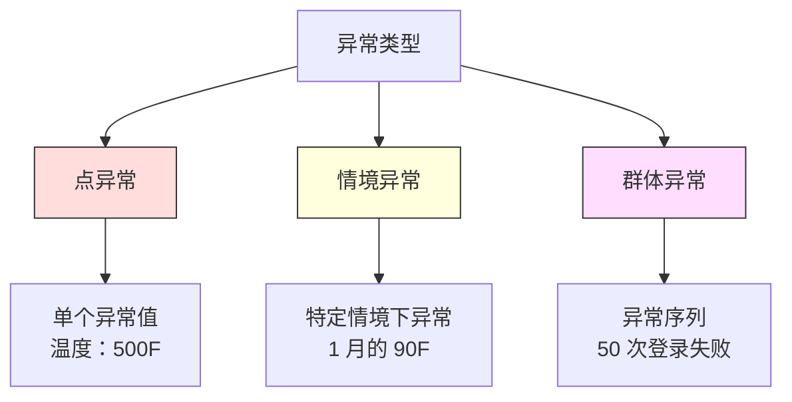
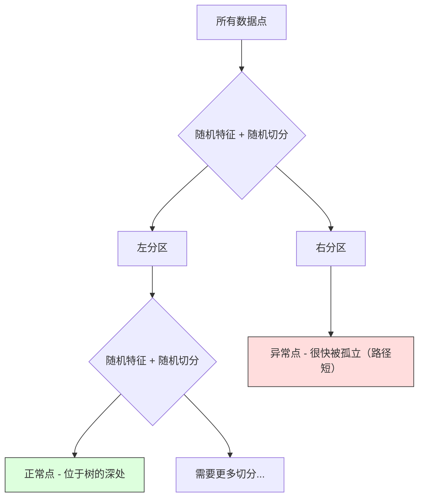

# 异常检测（Anomaly Detection）

> 正常很容易界定。异常就是任何不匹配的东西。

**类型：** 构建
**语言：** Python
**先修要求：** 第 2 阶段，第 01-09 课
**时间：** 约 75 分钟

## 学习目标

- 从零实现 Z 分数（Z-score）、四分位距（IQR）和孤立森林（Isolation Forest）异常检测方法
- 区分点异常（point anomalies）、情境异常（contextual anomalies）和群体异常（collective anomalies），并为每种异常选择合适的检测方法
- 解释为什么异常检测被表述为对正常数据建模，而不是对异常进行分类
- 比较无监督异常检测（unsupervised anomaly detection）与监督分类（supervised classification），并评估新型异常覆盖率与精确率之间的权衡

## 问题

一张信用卡下午 2 点在纽约被使用，接着在 2:05 又在东京被使用。某工厂传感器读数为 150 度，而正常范围是 80-120。某台服务器每秒发送 50,000 个请求，而日均值只有 200。

这些都是异常。发现它们非常重要。欺诈会造成数十亿美元损失。设备故障会带来停机。网络入侵会导致数据损失。

难点在于：你很少有带标签的异常样本。欺诈只占交易的 0.1%。设备故障一年只发生几次。你无法训练一个标准分类器，因为“异常”这一类几乎没有可供学习的样本。即使你有一些标签，你见过的异常类型也不是你将来会遇到的全部类型。明天的欺诈手法会与今天不同。

异常检测将这个问题反了过来。与其学习什么是异常，不如学习什么是正常。任何偏离正常的东西都值得怀疑。这种方法不需要标签，能够适应新类型的异常，并且可以扩展到海量数据集。

## 概念

### 异常类型

并非所有异常都一样：

- **点异常。** 无论上下文如何，单个数据点本身就不寻常。比如温度读数达到 500 度，或者一个平时只花 50 美元的账户突然出现 50,000 美元的交易。
- **情境异常。** 某个数据点在特定上下文下才显得异常。90 度在夏天很正常，但在冬天就是异常。同一个值，在不同上下文中意义不同。
- **群体异常。** 一串数据点作为一个整体显得异常，即使其中每个单独的数据点都可能正常。5 次登录失败很正常，连续 50 次则是暴力破解攻击。

大多数方法检测的是点异常。情境异常需要时间或位置特征。群体异常需要能感知序列的方法。



### 无监督视角

在标准分类中，你会同时拥有两个类别的标签。而在异常检测中，你通常会遇到以下三种情况之一：

1. **完全无监督。** 完全没有标签。你在全部数据上拟合检测器，并希望异常足够稀少，不至于污染“正常”模型。
2. **半监督。** 你拥有一个只包含正常数据的干净数据集。你在这份干净数据上拟合，再对其他所有数据打分。这是在条件允许时最强的设置。
3. **弱监督。** 你有少量带标签的异常。把它们用于评估，而不是训练。用无监督方式训练，然后在带标签的子集上衡量精确率/召回率。

关键洞见在于：异常检测从根本上不同于分类。你建模的是正常数据的分布，而不是两个类别之间的决策边界。

### 监督式 vs 无监督式：权衡

如果你确实有带标签的异常，那么应该把它们用于训练（监督分类），还是只用于评估（无监督检测）？

**监督式（把它当作分类问题）：**
- 能抓住你以前见过的那类异常
- 在已知异常类型上有更高的精确率
- 会完全错过新型异常
- 当新的异常类型出现时需要重新训练
- 需要足够多的异常样本（通常没有这么多）

**无监督式（建模正常模式、标记偏离）：**
- 能抓住任何偏离正常的模式，包括新型异常
- 不需要带标签的异常
- 假阳性率更高（并非所有“不寻常”的情况都是坏事）
- 对分布漂移（distribution shift）更稳健

在实践中，最好的系统通常会把二者结合起来：无监督检测用于广覆盖，监督模型用于已知且高优先级的异常类型，而人工复核用于处理模糊情况。

### Z 分数方法

这是最简单的方法。计算每个特征的均值和标准差。任何距离均值超过 k 个标准差的点都被标记为异常。

```text
z_score = (x - mean) / std
anomaly if |z_score| > threshold
```

默认阈值是 3.0（对于高斯分布（Gaussian distribution），99.7% 的正常数据会落在 3 个标准差以内）。

**优点：** 简单。快速。可解释（“这个值距离正常值有 4.5 个标准差”）。

**缺点：** 假设数据服从正态分布。对训练数据中的离群点很敏感（离群点会拉动均值并放大标准差，使它们更难被检测出来）。在多峰分布（multimodal distributions）上会失败。

**适用场景：** 单特征监控，且数据大致呈钟形分布。比如服务器响应时间、制造公差、基线稳定的传感器读数。

**失效场景：** 多簇数据（例如两个办公地点的温度基线不同）、偏态数据（例如 1000 美元的交易很少见但不算异常）、训练集中包含离群点的数据。

### 四分位距方法

比 Z 分数更稳健。它使用四分位距，而不是均值和标准差。

```
Q1 = 25th percentile
Q3 = 75th percentile
IQR = Q3 - Q1
lower_bound = Q1 - factor * IQR
upper_bound = Q3 + factor * IQR
anomaly if x < lower_bound or x > upper_bound
```

默认 factor 是 1.5。

**优点：** 对离群点稳健（百分位数不会被极端值影响）。适用于偏态分布。不要求正态性。

**缺点：** 只能做单变量检测（对每个特征独立应用）。无法检测只有在多个特征一起考虑时才显得异常的点（某个点在每个单独特征上都可能正常，但在联合空间中是异常的）。

**实践说明：** IQR 中的 1.5 factor 对应箱线图（box plot）里的“须”。落在须之外的点是潜在离群点。把 1.5 改成 3.0 会让检测器更保守（标记更少，假阳性更少）。合适的 factor 取决于你对误报的容忍度。

### 孤立森林

关键洞见是：异常既少见，又与众不同。在对数据进行随机划分时，异常更容易被孤立——它们只需要更少的随机切分就能与其他点分开。



**工作原理：**
1. 构建许多随机树（组成一个孤立森林）
2. 在每个节点，随机选一个特征，并在该特征的最小值和最大值之间随机选一个切分值
3. 持续切分，直到每个点都被孤立（落入自己的叶节点）
4. 异常在所有树上的平均路径长度更短

**为什么有效：** 正常点位于稠密区域。要把其中一个点从邻居中孤立出来，需要很多次随机切分。异常点位于稀疏区域。一两次随机切分就足以把它们隔离出来。

异常分数基于所有树上的平均路径长度，并用随机二叉搜索树的期望路径长度进行归一化：

```
score(x) = 2^(-average_path_length(x) / c(n))
```

其中，`c(n)` 是 n 个样本时的期望路径长度。分数接近 1 表示异常。接近 0.5 表示正常。接近 0 表示“非常正常”（深埋在稠密簇中）。

**优点：** 不需要分布假设。适用于高维数据。扩展性好（相对于样本量是次线性的，因为每棵树只使用一个子样本）。能够处理混合特征类型。

**缺点：** 对稠密区域中的异常不够敏感（掩蔽效应）。当很多特征都无关时，随机切分的效果会变差。

**关键超参数：**
- `n_estimators`：树的数量。100 通常足够。树越多，分数越稳定，但计算越慢。
- `max_samples`：每棵树的样本数。原始论文默认是 256。值更小会让单棵树不那么准确，但会增加多样性。正是这种子采样让孤立森林速度很快——每棵树只看到数据的一小部分。
- 异常比例参数（`contamination`）：预期异常比例。只用于设置阈值，不影响分数本身。

### 局部离群因子（LOF）

LOF 比较某个点周围的局部密度与其邻居周围的密度。一个位于稀疏区域、但周围被稠密区域包围的点，就是异常。

**工作原理：**
1. 对每个点，找到它的 k 个最近邻
2. 计算局部可达密度（local reachability density，即邻域有多稠密）
3. 比较每个点的密度与其邻居的密度
4. 如果某个点的密度明显低于邻居，它就是离群点

**LOF 分数：**
- LOF 接近 1.0 表示与邻居密度相似（正常）
- LOF 大于 1.0 表示密度低于邻居（可能异常）
- LOF 远大于 1.0（例如 2.0+）表示密度显著更低（很可能是异常）

“局部”这部分非常关键。设想一个包含两个簇的数据集：一个是 1000 个点的稠密簇，另一个是 50 个点的稀疏簇。稀疏簇边缘的一个点从全局来看并不罕见——它仍然有 50 个邻居。但如果它周围最近的邻居比它更稠密，那么它在局部上就是异常的。LOF 抓住了这种全局方法会忽略的细微差别。

**优点：** 能检测局部异常（即某个点在自己的邻域中异常，即使它在全局上并不异常）。适用于不同密度的簇。

**缺点：** 在大数据集上速度慢（朴素实现是 O(n^2)）。对 k 的选择敏感。在非常高维的数据中效果不好（维度灾难会影响距离计算）。

### 对比

| 方法 | 假设 | 速度 | 处理高维 | 检测局部异常 |
|--------|------------|-------|-------------------|------------------------|
| Z 分数 | 正态分布 | 非常快 | 是（按特征分别处理） | 否 |
| IQR | 无（按特征分别处理） | 非常快 | 是（按特征分别处理） | 否 |
| 孤立森林 | 无 | 快 | 是 | 部分支持 |
| LOF | 距离是有意义的 | 慢 | 较差 | 是 |

### 评估挑战

评估异常检测器比评估分类器更难：

- **极端类别不平衡。** 当异常只占 0.1% 时，如果把所有数据都预测为“正常”，准确率也有 99.9%。准确率没有意义。
- **AUROC 会误导。** 在高度不平衡的情况下，即使模型在实际阈值下漏掉了大多数异常，AUROC 看起来仍然可能不错。
- **更好的指标：** Precision@k（在前 k 个被标记项中，有多少是真异常）、AUPRC（精确率-召回率曲线，即 precision-recall curve 下的面积）以及固定假阳性率下的召回率。

```mermaid
flowchart LR
    A[原始数据] --> B[仅在正常数据上训练]
    B --> C[为所有测试数据打分]
    C --> D[按异常分数排序]
    D --> E[评估 Top-K 被标记项]
    E --> F[Precision@K / AUPRC 指标]

    style A fill:#f9f,stroke:#333
    style F fill:#9f9,stroke:#333
```

### 异常检测流水线

在实践中，异常检测通常遵循如下工作流：

1. **收集基线数据。** 理想情况下，这是一段你知道没有异常（或只有极少异常）的时期。
2. **特征工程（feature engineering）。** 使用原始特征以及派生特征（滚动统计量、时间特征、比率等）。
3. **训练检测器。** 在基线数据上拟合。模型学习“正常”是什么样子。
4. **为新数据打分。** 每个新观测值都会得到一个异常分数。
5. **阈值选择。** 选择分数截断点。这是业务决策：阈值越高，误报越少，但漏报越多。
6. **告警并调查。** 被标记的点进入人工复核或自动化响应流程。
7. **收集反馈。** 记录被标记项是真异常还是误报。用这些数据来评估检测器，并随着时间推移调整阈值。

这条流水线永远不会“完成”。数据分布会变化，新型异常会出现，阈值也需要调整。要把异常检测当作一个持续演化的系统，而不是一次性模型。

## 动手实现

`code/anomaly_detection.py` 中的代码从零实现了 Z 分数、IQR 和孤立森林。

### Z 分数检测器

```python
def zscore_detect(X, threshold=3.0):
    mean = X.mean(axis=0)
    std = X.std(axis=0)
    std[std == 0] = 1.0
    z = np.abs((X - mean) / std)
    return z.max(axis=1) > threshold
```

简单而且向量化。如果任意一个特征超过阈值，就把该点标记出来。

### IQR 检测器

```python
def iqr_detect(X, factor=1.5):
    q1 = np.percentile(X, 25, axis=0)
    q3 = np.percentile(X, 75, axis=0)
    iqr = q3 - q1
    iqr[iqr == 0] = 1.0
    lower = q1 - factor * iqr
    upper = q3 + factor * iqr
    outside = (X < lower) | (X > upper)
    return outside.any(axis=1)
```

### 从零实现孤立森林

这个从零实现的版本会构建孤立树，对特征空间进行随机划分：

```python
class IsolationTree:
    def __init__(self, max_depth):
        self.max_depth = max_depth

    def fit(self, X, depth=0):
        n, p = X.shape
        if depth >= self.max_depth or n <= 1:
            self.is_leaf = True
            self.size = n
            return self
        self.is_leaf = False
        self.feature = np.random.randint(p)
        x_min = X[:, self.feature].min()
        x_max = X[:, self.feature].max()
        if x_min == x_max:
            self.is_leaf = True
            self.size = n
            return self
        self.threshold = np.random.uniform(x_min, x_max)
        left_mask = X[:, self.feature] < self.threshold
        self.left = IsolationTree(self.max_depth).fit(X[left_mask], depth + 1)
        self.right = IsolationTree(self.max_depth).fit(X[~left_mask], depth + 1)
        return self
```

把一个点孤立出来所需的路径长度决定了它的异常分数。路径越短，越异常。

`IsolationForest` 类对多棵树进行了封装：

```python
class IsolationForest:
    def __init__(self, n_estimators=100, max_samples=256, seed=42):
        self.n_estimators = n_estimators
        self.max_samples = max_samples

    def fit(self, X):
        sample_size = min(self.max_samples, X.shape[0])
        max_depth = int(np.ceil(np.log2(sample_size)))
        for _ in range(self.n_estimators):
            idx = rng.choice(X.shape[0], size=sample_size, replace=False)
            tree = IsolationTree(max_depth=max_depth)
            tree.fit(X[idx])
            self.trees.append(tree)

    def anomaly_score(self, X):
        avg_path = average path length across all trees
        scores = 2.0 ** (-avg_path / c(max_samples))
        return scores
```

归一化因子 `c(n)` 是含有 n 个元素的二叉搜索树中，一次未成功查找的期望路径长度。它等于 `2 * H(n-1) - 2*(n-1)/n`，其中 `H` 是调和数。这个归一化确保不同规模数据集上的分数可以相互比较。

### 演示场景

代码会生成多个测试场景：

1. **带离群点的单簇。** 一个二维高斯簇，异常点被注入到远离中心的位置。这里所有方法都应该有效。
2. **多峰数据。** 三个大小和密度不同的簇。簇与簇之间的点是异常。由于按特征看的取值范围很宽，Z 分数会表现较差。
3. **高维数据。** 50 个特征，但异常只在其中 5 个特征上不同。这个场景测试方法能否在部分特征上发现异常。

每个演示都会用精确率（precision）、召回率（recall）、F1 和 Precision@k 来比较所有方法。

## 使用它

使用 sklearn（这里用的是库实现，而不是从零实现）：

```python
from sklearn.ensemble import IsolationForest
from sklearn.neighbors import LocalOutlierFactor

iso = IsolationForest(n_estimators=100, contamination=0.05, random_state=42)
iso.fit(X_train)
predictions = iso.predict(X_test)

lof = LocalOutlierFactor(n_neighbors=20, contamination=0.05, novelty=True)
lof.fit(X_train)
predictions = lof.predict(X_test)
```

注意，异常比例参数（`contamination`）会设置预期异常比例。这个参数设得是否合适很重要——太低会漏掉异常，太高会制造误报。

`anomaly_detection.py` 中的代码会在同一份数据上，将从零实现的版本与 sklearn 做对比。

### sklearn 的异常比例参数（contamination）

sklearn 中的 `contamination` 参数决定了如何把连续的异常分数转换为二元预测阈值。它不会改变底层分数。

```python
iso_5 = IsolationForest(contamination=0.05)
iso_10 = IsolationForest(contamination=0.10)
```

两者产生的异常分数是一样的。但 `iso_5` 会标记前 5%，而 `iso_10` 会标记前 10%。如果你不知道真实异常率（通常确实不知道），就把 contamination 设为 `"auto"`，并直接处理原始分数。再根据假阳性和假阴性的成本权衡，自行设置阈值。

### 单类支持向量机（One-Class SVM）

这是另一个值得了解的无监督异常检测器。单类支持向量机会在高维特征空间中，为正常数据拟合出一个边界（利用核技巧（kernel trick））。

```python
from sklearn.svm import OneClassSVM

oc_svm = OneClassSVM(kernel="rbf", gamma="auto", nu=0.05)
oc_svm.fit(X_train)
predictions = oc_svm.predict(X_test)
```

`nu` 参数近似表示异常所占比例。单类支持向量机在小到中等规模数据集上效果不错，但无法扩展到非常大的数据（核矩阵会按平方增长）。

### 自编码器方法（预告）

自编码器（Autoencoder）是一类学习压缩并重建数据的神经网络。它在正常数据上训练。测试时，异常会有较高的重建误差，因为网络只学会了重建正常模式。

这部分会在第 3 阶段（深度学习（Deep Learning））中讲到，但原理是一样的：建模正常模式，标记偏离它的情况。

### 集成异常检测

正如集成方法会提升分类效果（第 11 课），组合多个异常检测器也能提升检测效果。最简单的方法是：

1. 运行多个检测器（Z 分数、IQR、孤立森林、LOF）
2. 将每个检测器的分数归一化到 [0, 1]
3. 对归一化后的分数求平均
4. 标记平均分高于阈值的点

这样可以减少假阳性，因为不同方法有不同的失效模式。一个点如果被四种方法全部标记，几乎肯定是异常。只被一种方法标记的点，可能只是该方法的特殊偏差。

更复杂的集成方法会根据每个检测器的估计可靠性为其分配权重（如果有带已知异常的验证集，就在该验证集上测量）。

### 生产环境注意事项

1. **阈值漂移。** 随着数据分布变化，固定阈值会过时。要监控异常分数的分布，并定期调整。
2. **告警疲劳。** 误报太多，操作人员就会停止关注。先从较高阈值开始（告警更少、可靠性更高），随着信任建立再逐步降低。
3. **集成方案。** 在生产环境中，组合多个检测器。只有当多个方法都认为某点异常时才标记它。这样能显著降低假阳性。
4. **特征工程。** 原始特征通常远远不够。加入滚动统计量、比率、距上次事件的时间、领域特定特征。好的特征集比选择哪种检测器更重要。
5. **反馈回路。** 当操作人员调查被标记项并确认或排除后，把结果反馈回系统。随着时间积累带标签的数据，用于评估并改进检测器。

## 交付成果

本课会产出：
- `outputs/skill-anomaly-detector.md` -- 用于选择合适检测器的决策技能文档
- `code/anomaly_detection.py` -- 从零实现 Z 分数、IQR 和孤立森林，并与 sklearn 进行对比

### 选择阈值

异常分数是连续的。你需要一个阈值来做二元决策。这是业务决策，不是技术决策。

考虑两个场景：
- **欺诈检测。** 漏掉欺诈代价很高（拒付、客户信任受损）。误报的代价是人工分析师花 5 分钟调查。此时应把阈值设低一些，以捕获更多欺诈，并接受更多误报。
- **设备维护。** 一次误报意味着一次不必要的停机，成本是 50,000 美元。一次漏报故障意味着 500,000 美元的维修成本。应根据这两类成本来平衡阈值。

在这两种情况下，最优阈值都取决于假阳性与假阴性的成本比。绘制不同阈值下的精确率和召回率，叠加成本函数，然后选择总成本最低的点。

### 扩展到生产环境

在生产环境中做实时异常检测时：

1. **批量训练，在线打分。** 定期（每天、每周）在最近的正常数据上训练模型。每当新观测到达时立即为其打分。
2. **特征计算必须一致。** 如果训练时使用了 30 天滚动统计量，那么为一个新观测计算特征时也必须有 30 天历史数据。要缓冲所需历史。
3. **分数分布监控。** 持续跟踪异常分数的分布。如果中位数分数持续升高，要么是数据在变化，要么是模型已经陈旧。
4. **可解释性（explainability）。** 标记异常时，要说明原因。Z 分数："特征 X 比正常值高出 4.2 个标准差。" 孤立森林："这个点平均只经过 3.1 次切分就被孤立（正常点通常需要 8.5 次）。"

## 练习

1. **阈值调优。** 以 0.5 为步长，把 Z 分数检测器的阈值从 1.0 调到 5.0。绘制每个阈值下的精确率和召回率。你的数据的最佳平衡点在哪里？

2. **多变量异常。** 创建二维数据，使每个特征单独看都正常，但组合起来却异常（例如远离主簇对角线的点）。证明按特征分别做 Z 分数会漏掉这些点，而孤立森林能抓住它们。

3. **从零实现 LOF。** 使用 k 最近邻实现局部离群因子。与 sklearn 的 `LocalOutlierFactor` 在同一份数据上对比。使用 k=10 和 k=50——k 的选择会如何影响结果？

4. **流式异常检测。** 修改 Z 分数检测器，使其能在流式场景中工作：随着新点到达，更新运行中的均值和方差（Welford 在线算法）。然后与同一份数据上的批处理 Z 分数做比较。

5. **真实世界评估。** 选一个带已知异常的数据集（例如 Kaggle 上的信用卡欺诈数据）。使用 precision@100、precision@500 和 AUPRC 评估全部四种方法。哪种方法效果最好？为什么？

## 关键术语

| 术语 | 人们常说的话 | 它的实际含义 |
|------|----------------|----------------------|
| 异常 | “离群点、不寻常的点” | 一个明显偏离正常数据预期模式的数据点 |
| 点异常 | “单个奇怪的值” | 一个不依赖上下文就显得异常的单独观测 |
| 情境异常 | “值本身正常，但情境不对” | 一个在特定上下文（时间、地点等）中异常、但在另一个上下文中可能正常的观测 |
| 孤立森林 | “通过随机切分寻找离群点” | 一组随机树组成的集成方法，它能用比正常点更少的切分把异常隔离出来 |
| 局部离群因子 | “把密度和邻居比较” | 一种标记局部密度远低于邻居密度的数据点的方法 |
| Z 分数 | “距离均值多少个标准差” | `(x - mean) / std`，用标准差单位衡量一个点离中心有多远 |
| IQR | “四分位距” | `Q3 - Q1`，衡量中间 50% 数据的离散程度，常用于稳健的离群点检测 |
| 异常比例参数（Contamination） | “预期异常所占比例” | 一个超参数，用来告诉检测器应当把多大比例的数据标记为异常 |
| Precision@k | “前 k 个告警里有多少是真的” | 只在最可疑的 k 个点上计算的精确率，适合不平衡的异常检测任务 |
| AUPRC | “precision-recall 曲线下面积” | 一个汇总所有阈值下 precision-recall 表现的指标，在类别不平衡时通常比 AUROC 更有意义 |

## 延伸阅读

- [Liu et al., Isolation Forest (2008)](https://cs.nju.edu.cn/zhouzh/zhouzh.files/publication/icdm08b.pdf) -- 孤立森林的原始论文
- [Breunig et al., LOF: Identifying Density-Based Local Outliers (2000)](https://dl.acm.org/doi/10.1145/342009.335388) -- LOF 的原始论文
- [scikit-learn Outlier Detection docs](https://scikit-learn.org/stable/modules/outlier_detection.html) -- sklearn 中所有异常检测器的概览
- [Chandola et al., Anomaly Detection: A Survey (2009)](https://dl.acm.org/doi/10.1145/1541880.1541882) -- 异常检测方法的综合综述
- [Goldstein and Uchida, A Comparative Evaluation of Unsupervised Anomaly Detection Algorithms (2016)](https://journals.plos.org/plosone/article?id=10.1371/journal.pone.0152173) -- 10 种方法在真实数据集上的实证比较
