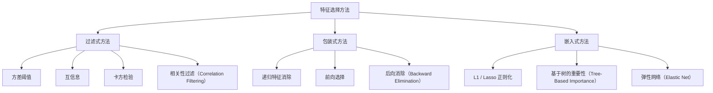
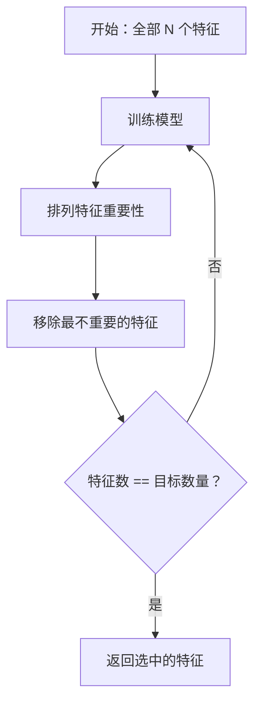
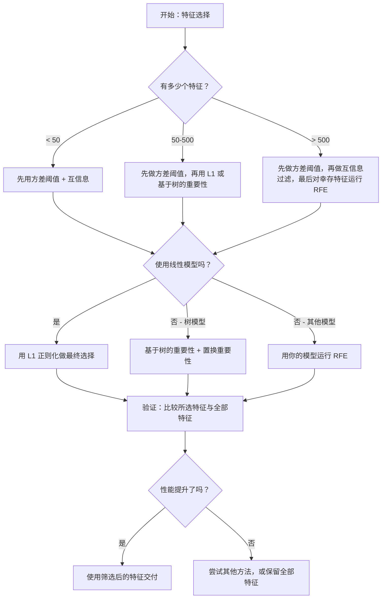

# 特征选择（Feature Selection）

> 特征不是越多越好；选对特征才更重要。

**类型：** 构建
**语言：** Python
**前置条件：** 第 2 阶段，课程 01-09、08（特征工程）
**时间：** ~75 分钟

## 学习目标

- 从零实现过滤式方法（filter methods，如方差阈值（variance threshold）、互信息（mutual information）、卡方检验（chi-squared））以及包装式方法（wrapper methods，如递归特征消除（Recursive Feature Elimination, RFE）、前向选择（forward selection））
- 解释为什么互信息能够捕捉到相关性（correlation）会遗漏的非线性特征—目标关系
- 比较 L1 正则化（L1 regularization，属于嵌入式选择（embedded selection））与 RFE（包装式选择），并评估它们在计算上的权衡
- 构建一个结合多种方法的特征选择流水线（pipeline），并展示其在留出数据（held-out data）上的泛化（generalization）能力提升

## 问题

你有 500 个特征。模型训练缓慢、持续过拟合（overfitting），而且没人能解释它到底学到了什么。于是你继续添加更多特征，希望性能会提升。结果反而更糟。

这就是维度灾难（curse of dimensionality）的典型表现。随着特征数量增长，特征空间的体积会爆炸式增加。数据点会变得稀疏，点与点之间的距离趋于收敛。模型需要指数级更多的数据才能找到真正的模式。噪声特征会淹没信号特征。过拟合会变成默认状态。

特征选择就是解药。剥离噪声，移除冗余，保留那些真正承载目标信息的特征。结果是：训练更快、泛化更好，而且模型终于变得可解释。

目标不是用上所有可用信息，而是用对信息。

## 概念

### 特征选择的三大类别

每一种特征选择方法都属于以下三类之一：



**过滤式方法**会使用统计量独立地为每个特征打分。它们不使用模型。速度快，但会忽略特征之间的交互。

**包装式方法**会训练一个模型来评估特征子集。它们把模型性能作为评分依据。效果通常更好，但代价高，因为需要多次重复训练模型。

**嵌入式方法**会在模型训练过程中直接完成特征选择。L1 正则化会把权重压到零。决策树会优先在最有用的特征上分裂。选择发生在拟合过程中，而不是单独的步骤。

### 方差阈值（Variance Threshold）

这是最简单的过滤器。如果一个特征在样本之间几乎没有变化，那它几乎不携带任何信息。

想象一个特征在 1000 个样本里有 999 个都是 0.0。它的方差几乎为零。任何模型都无法依靠它来区分类别。直接删掉。

```
variance(x) = mean((x - mean(x))^2)
```

设定一个阈值（例如 0.01），删除所有方差低于该阈值的特征。这样无需查看目标变量，就能移除常量特征或近似常量特征。

适用场景：作为其他方法之前的预处理步骤。它几乎零成本地筛掉明显无用的特征。

局限性：某个特征即使方差很高，也可能纯粹只是噪声。方差阈值是必要条件，但不是充分条件。

### 互信息（Mutual Information）

互信息衡量的是：已知特征 X 的取值后，目标 Y 的不确定性减少了多少。

```
I(X; Y) = sum_x sum_y p(x, y) * log(p(x, y) / (p(x) * p(y)))
```

如果 X 和 Y 相互独立，那么 p(x, y) = p(x) * p(y)，于是对数项为零，I(X; Y) = 0。X 对 Y 告诉你的信息越多，互信息就越高。

相对于相关性的关键优势在于：互信息能够捕捉非线性关系。某个特征与目标的相关性可能为零，但它的互信息仍然很高，因为两者关系可能是二次型或周期性的。

对于连续特征，先把它离散到若干分箱（bins）中（基于直方图的估计）。分箱数量会影响估计结果——太少会丢失信息，太多会引入噪声。常见选择是 sqrt(n) 个分箱，或使用 Sturges 法则（1 + log2(n)）。


### 递归特征消除（Recursive Feature Elimination，RFE）

RFE 是一种包装式方法。它利用模型自身的特征重要性进行迭代裁剪：

1. 用全部特征训练模型
2. 按重要性对特征排序（线性模型看系数，树模型看不纯度下降）
3. 删除最不重要的一个或多个特征
4. 重复上述过程，直到只剩下目标数量的特征



RFE 会考虑特征交互，因为模型会同时看到所有剩余特征。移除一个特征后，其它特征的重要性也会随之改变。这使它比过滤式方法更全面。

代价也很明显：你需要训练模型 N - target 次。若有 500 个特征，目标保留 10 个，就意味着要训练 490 次。对于昂贵的模型，这会非常慢。你可以通过每轮删除多个特征来加速（例如每次删掉最差的 10%）。

### L1（Lasso）正则化

L1 正则化会把权重绝对值加入损失函数：

```
loss = prediction_error + alpha * sum(|w_i|)
```

alpha 参数控制特征被裁剪的激进程度。alpha 越高，越多权重会被压到精确的零。

为什么会是精确的零？因为 L1 惩罚会在权重空间中形成一个菱形约束区域。最优解往往会落在这个菱形的顶点上，而顶点处一个或多个权重就是零。L2 正则化（ridge）形成的是圆形约束，权重会收缩，但很少真正变成零。

这就是嵌入式特征选择：模型会在训练过程中学会忽略哪些特征。权重为零的特征，实际上就等于被移除了。

优点：只需一次训练，能够处理相关特征（保留一个，把其余压到零），并且大多数线性模型实现都内置支持。

局限性：只适用于线性模型，无法捕捉非线性的特征重要性。

### 基于树的特征重要性（Tree-Based Feature Importance）

决策树及其集成模型（随机森林（random forests）、梯度提升（gradient boosting））天然就会给特征排出重要性。每一次分裂都会降低不纯度（分类用 Gini 或熵，回归用方差）。能带来更大不纯度下降的特征就更重要。

对于一个包含 T 棵树的随机森林：

```
importance(feature_j) = (1/T) * sum over all trees of
    sum over all nodes splitting on feature_j of
        (n_samples * impurity_decrease)
```

这样就能为每个特征得到一个归一化的重要性分数。它可以自动处理非线性关系和特征交互。

注意：基于树的重要性会偏向拥有大量唯一取值的特征（高基数（high cardinality））。一个随机 ID 列可能看起来很重要，因为它几乎能完美地区分每个样本。可以用置换重要性做一次合理性检查。

### 置换重要性（Permutation Importance）

这是一种模型无关（model-agnostic）的方法：

1. 训练模型，并在验证集上记录基线性能
2. 对每个特征：随机打乱它的取值，测量性能下降幅度
3. 下降越大，这个特征就越重要

如果打乱某个特征后性能几乎不受影响，说明模型并不依赖它。如果性能崩掉了，那这个特征就是关键特征。

置换重要性避免了基于树的重要性中的基数偏差问题。但它很慢：每个特征都要做一次完整评估，而且通常还要重复多次以保证稳定性。

### 对比表

| 方法 | 类型 | 速度 | 非线性 | 特征交互 |
|--------|------|-------|-----------|---------------------|
| 方差阈值 | 过滤式 | 非常快 | 否 | 否 |
| 互信息 | 过滤式 | 快 | 是 | 否 |
| 相关性过滤 | 过滤式 | 快 | 否 | 否 |
| RFE | 包装式 | 慢 | 取决于模型 | 是 |
| L1 / Lasso | 嵌入式 | 快 | 否（线性） | 否 |
| 基于树的重要性 | 嵌入式 | 中等 | 是 | 是 |
| 置换重要性 | 模型无关 | 慢 | 是 | 是 |

### 决策流程图



## 动手构建

### 第 1 步：生成具有已知特征结构的合成数据

```python
import numpy as np


def make_feature_selection_data(n_samples=500, seed=42):
    rng = np.random.RandomState(seed)

    x1 = rng.randn(n_samples)
    x2 = rng.randn(n_samples)
    x3 = rng.randn(n_samples)
    x4 = x1 + 0.1 * rng.randn(n_samples)
    x5 = x2 + 0.1 * rng.randn(n_samples)

    informative = np.column_stack([x1, x2, x3, x4, x5])

    correlated = np.column_stack([
        x1 * 0.9 + 0.1 * rng.randn(n_samples),
        x2 * 0.8 + 0.2 * rng.randn(n_samples),
        x3 * 0.7 + 0.3 * rng.randn(n_samples),
        x1 * 0.5 + x2 * 0.5 + 0.1 * rng.randn(n_samples),
        x2 * 0.6 + x3 * 0.4 + 0.1 * rng.randn(n_samples),
    ])

    noise = rng.randn(n_samples, 10) * 0.5

    X = np.hstack([informative, correlated, noise])
    y = (2 * x1 - 1.5 * x2 + x3 + 0.5 * rng.randn(n_samples) > 0).astype(int)

    feature_names = (
        [f"info_{i}" for i in range(5)]
        + [f"corr_{i}" for i in range(5)]
        + [f"noise_{i}" for i in range(10)]
    )

    return X, y, feature_names
```

我们知道这里的真实情况：特征 0-4 是有信息量的（其中 3 和 4 分别是 0 和 1 的相关副本），特征 5-9 与有信息量特征相关，特征 10-19 则是纯噪声。一个好的选择方法应当把 0-4 排在最前面，把 10-19 排在最后面。

### 第 2 步：方差阈值

```python
def variance_threshold(X, threshold=0.01):
    variances = np.var(X, axis=0)
    mask = variances > threshold
    return mask, variances
```

### 第 3 步：互信息（离散版）

```python
def discretize(x, n_bins=10):
    min_val, max_val = x.min(), x.max()
    if max_val == min_val:
        return np.zeros_like(x, dtype=int)
    bin_edges = np.linspace(min_val, max_val, n_bins + 1)
    binned = np.digitize(x, bin_edges[1:-1])
    return binned


def mutual_information(X, y, n_bins=10):
    n_samples, n_features = X.shape
    mi_scores = np.zeros(n_features)

    y_vals, y_counts = np.unique(y, return_counts=True)
    p_y = y_counts / n_samples

    for f in range(n_features):
        x_binned = discretize(X[:, f], n_bins)
        x_vals, x_counts = np.unique(x_binned, return_counts=True)
        p_x = dict(zip(x_vals, x_counts / n_samples))

        mi = 0.0
        for xv in x_vals:
            for yi, yv in enumerate(y_vals):
                joint_mask = (x_binned == xv) & (y == yv)
                p_xy = np.sum(joint_mask) / n_samples
                if p_xy > 0:
                    mi += p_xy * np.log(p_xy / (p_x[xv] * p_y[yi]))
        mi_scores[f] = mi

    return mi_scores
```

### 第 4 步：递归特征消除

```python
def simple_logistic_importance(X, y, lr=0.1, epochs=100):
    n_samples, n_features = X.shape
    w = np.zeros(n_features)
    b = 0.0

    for _ in range(epochs):
        z = X @ w + b
        pred = 1.0 / (1.0 + np.exp(-np.clip(z, -500, 500)))
        error = pred - y
        w -= lr * (X.T @ error) / n_samples
        b -= lr * np.mean(error)

    return w, b


def rfe(X, y, n_features_to_select=5, lr=0.1, epochs=100):
    n_total = X.shape[1]
    remaining = list(range(n_total))
    rankings = np.ones(n_total, dtype=int)
    rank = n_total

    while len(remaining) > n_features_to_select:
        X_subset = X[:, remaining]
        w, _ = simple_logistic_importance(X_subset, y, lr, epochs)
        importances = np.abs(w)

        least_idx = np.argmin(importances)
        original_idx = remaining[least_idx]
        rankings[original_idx] = rank
        rank -= 1
        remaining.pop(least_idx)

    for idx in remaining:
        rankings[idx] = 1

    selected_mask = rankings == 1
    return selected_mask, rankings
```

### 第 5 步：L1 特征选择

```python
def soft_threshold(w, alpha):
    return np.sign(w) * np.maximum(np.abs(w) - alpha, 0)


def l1_feature_selection(X, y, alpha=0.1, lr=0.01, epochs=500):
    n_samples, n_features = X.shape
    w = np.zeros(n_features)
    b = 0.0

    for _ in range(epochs):
        z = X @ w + b
        pred = 1.0 / (1.0 + np.exp(-np.clip(z, -500, 500)))
        error = pred - y

        gradient_w = (X.T @ error) / n_samples
        gradient_b = np.mean(error)

        w -= lr * gradient_w
        w = soft_threshold(w, lr * alpha)
        b -= lr * gradient_b

    selected_mask = np.abs(w) > 1e-6
    return selected_mask, w
```

### 第 6 步：基于树的重要性（简易决策树）

```python
def gini_impurity(y):
    if len(y) == 0:
        return 0.0
    classes, counts = np.unique(y, return_counts=True)
    probs = counts / len(y)
    return 1.0 - np.sum(probs ** 2)


def best_split(X, y, feature_idx):
    values = np.unique(X[:, feature_idx])
    if len(values) <= 1:
        return None, -1.0

    best_threshold = None
    best_gain = -1.0
    parent_gini = gini_impurity(y)
    n = len(y)

    for i in range(len(values) - 1):
        threshold = (values[i] + values[i + 1]) / 2.0
        left_mask = X[:, feature_idx] <= threshold
        right_mask = ~left_mask

        n_left = np.sum(left_mask)
        n_right = np.sum(right_mask)

        if n_left == 0 or n_right == 0:
            continue

        gain = parent_gini - (n_left / n) * gini_impurity(y[left_mask]) - (n_right / n) * gini_impurity(y[right_mask])

        if gain > best_gain:
            best_gain = gain
            best_threshold = threshold

    return best_threshold, best_gain


def tree_importance(X, y, n_trees=50, max_depth=5, seed=42):
    rng = np.random.RandomState(seed)
    n_samples, n_features = X.shape
    importances = np.zeros(n_features)

    for _ in range(n_trees):
        sample_idx = rng.choice(n_samples, size=n_samples, replace=True)
        feature_subset = rng.choice(n_features, size=max(1, int(np.sqrt(n_features))), replace=False)

        X_boot = X[sample_idx]
        y_boot = y[sample_idx]

        tree_imp = _build_tree_importance(X_boot, y_boot, feature_subset, max_depth)
        importances += tree_imp

    total = importances.sum()
    if total > 0:
        importances /= total

    return importances


def _build_tree_importance(X, y, feature_subset, max_depth, depth=0):
    n_features = X.shape[1]
    importances = np.zeros(n_features)

    if depth >= max_depth or len(np.unique(y)) <= 1 or len(y) < 4:
        return importances

    best_feature = None
    best_threshold = None
    best_gain = -1.0

    for f in feature_subset:
        threshold, gain = best_split(X, y, f)
        if gain > best_gain:
            best_gain = gain
            best_feature = f
            best_threshold = threshold

    if best_feature is None or best_gain <= 0:
        return importances

    importances[best_feature] += best_gain * len(y)

    left_mask = X[:, best_feature] <= best_threshold
    right_mask = ~left_mask

    importances += _build_tree_importance(X[left_mask], y[left_mask], feature_subset, max_depth, depth + 1)
    importances += _build_tree_importance(X[right_mask], y[right_mask], feature_subset, max_depth, depth + 1)

    return importances
```

### 第 7 步：运行所有方法并进行比较

代码文件会在同一个合成数据集上运行全部五种方法，并打印一张对比表，展示每种方法选择了哪些特征。

## 实际使用

在 scikit-learn 中，特征选择可以直接集成进流水线：

```python
from sklearn.feature_selection import (
    VarianceThreshold,
    mutual_info_classif,
    RFE,
    SelectFromModel,
)
from sklearn.linear_model import Lasso, LogisticRegression
from sklearn.ensemble import RandomForestClassifier

vt = VarianceThreshold(threshold=0.01)
X_filtered = vt.fit_transform(X)

mi_scores = mutual_info_classif(X, y)
top_k = np.argsort(mi_scores)[-10:]

rfe_selector = RFE(LogisticRegression(), n_features_to_select=10)
rfe_selector.fit(X, y)
X_rfe = rfe_selector.transform(X)

lasso_selector = SelectFromModel(Lasso(alpha=0.01))
lasso_selector.fit(X, y)
X_lasso = lasso_selector.transform(X)

rf = RandomForestClassifier(n_estimators=100)
rf.fit(X, y)
importances = rf.feature_importances_
```

这些从零实现的版本能让你清楚看到每种方法内部到底发生了什么。方差阈值本质上只是计算 `var(X, axis=0)` 并应用一个掩码。互信息是在列联表中统计联合频率与边际频率。RFE 就是一个不断训练、排序、裁剪的循环。L1 是带有软阈值步骤的梯度下降。基于树的重要性则是在各次分裂中累积不纯度下降。没有什么魔法——只是统计学和循环。

sklearn 版本则额外提供了更强的稳健性（例如，`mutual_info_classif` 使用的是 k-NN 密度估计而不是分箱）、更高的速度（C 实现），以及与流水线的集成能力。

## 交付成果

本课会产出：
- `outputs/skill-feature-selector.md` —— 一份用于选择合适特征选择方法的速查决策树

## 练习

1. **前向选择**：实现与 RFE 相反的过程。从零个特征开始。每一步都加入那个最能提升模型性能的特征。当继续加入特征已经没有帮助时停止。把最终选出的特征与 RFE 的结果对比。哪一个更快？哪一个结果更好？

2. **稳定性选择（stability selection）**：把 L1 特征选择运行 50 次，每次都在随机抽取的数据 80% 子样本上执行，并使用略有不同的 alpha 值。统计每个特征被选中的次数。那些在超过 80% 运行中都被选中的特征可视为“稳定”特征。把这些稳定特征与单次运行的 L1 选择结果对比。哪一种更可靠？

3. **多重共线性检测（multicollinearity detection）**：计算所有特征的相关矩阵（correlation matrix）。实现一个函数：给定相关性阈值（例如 0.9），从每一对高度相关的特征中删除一个（保留那个与目标互信息更高的特征）。在合成数据集上测试，并验证它确实移除了冗余的相关特征。

4. **特征选择流水线**：把方差阈值、互信息过滤和 RFE 串成一个流水线。先移除近零方差特征，再保留互信息排名前 50% 的特征，最后在剩余特征上运行 RFE。把这个流水线与直接在全部特征上运行 RFE 做比较。流水线更快吗？准确率一样吗？

5. **从零实现置换重要性**：实现置换重要性。对每个特征，把它的取值打乱 10 次，测量 F1 分数的平均下降。把这个排序与基于树的重要性排序进行比较。找出它们结论不一致的情况，并解释原因（提示：相关特征）。

## 关键术语

| 术语 | 人们常说 | 实际含义 |
|------|----------------|----------------------|
| 过滤式方法 | “独立地给特征打分” | 一种不训练模型、仅使用统计量对特征进行排序的特征选择方法，逐个特征独立评估 |
| 包装式方法 | “让模型来挑特征” | 一种通过训练模型并以其性能作为选择标准来评估特征子集的特征选择方法 |
| 嵌入式方法 | “模型在训练时自己选特征” | 指特征选择作为模型拟合的一部分发生，例如 L1 正则化把权重压到零 |
| 互信息 | “一个变量能告诉你另一个变量多少信息” | 衡量在已知 X 的情况下，Y 的不确定性减少了多少的指标，既能捕捉线性依赖，也能捕捉非线性依赖 |
| 递归特征消除 | “训练、排序、裁剪、重复” | 一种迭代式包装方法：训练模型、删除最不重要的一个或多个特征，并不断重复，直到达到目标数量 |
| L1 / Lasso 正则化 | “能杀死特征的惩罚项” | 在损失函数中加入权重绝对值之和，从而把不重要特征的权重压到精确的零 |
| 方差阈值 | “删掉常量特征” | 删除那些在样本间方差低于指定阈值的特征，筛掉不携带信息的特征 |
| 特征重要性 | “哪些特征最重要” | 一个衡量各特征对模型预测贡献程度的分数，可由分裂增益（树）或系数大小（线性模型）计算得到 |
| 置换重要性 | “打乱看看伤害有多大” | 通过随机打乱每个特征的取值，并测量模型性能下降幅度来评估特征重要性 |
| 维度灾难 | “特征太多，数据不够” | 随着特征增加，特征空间体积指数级膨胀，导致数据稀疏、距离失去意义的现象 |

## 延伸阅读

- [An Introduction to Variable and Feature Selection (Guyon & Elisseeff, 2003)](https://jmlr.org/papers/v3/guyon03a.html) —— 关于特征选择方法的奠基性综述，至今仍被广泛引用
- [scikit-learn Feature Selection Guide](https://scikit-learn.org/stable/modules/feature_selection.html) —— 关于过滤式、包装式和嵌入式方法的实用参考，附带代码示例
- [Stability Selection (Meinshausen & Buhlmann, 2010)](https://arxiv.org/abs/0809.2932) —— 将子采样与特征选择结合，以获得稳健且可复现的结果
- [Beware Default Random Forest Importances (Strobl et al., 2007)](https://bmcbioinformatics.biomedcentral.com/articles/10.1186/1471-2105-8-25) —— 展示了基于树的重要性中的基数偏差，并提出以条件重要性作为替代方案
