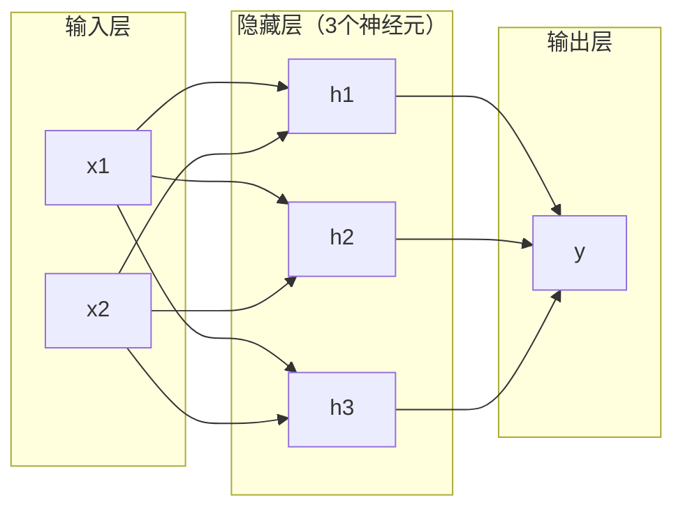
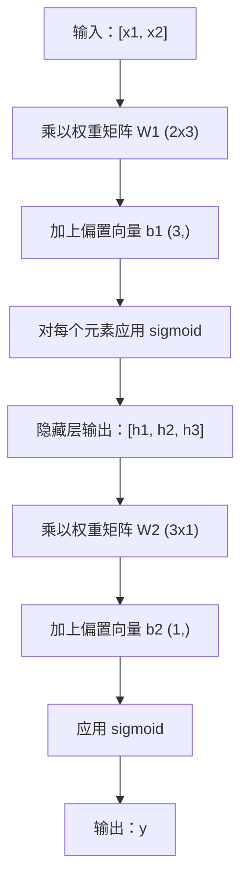

# 多层网络与前向传播 (Multi-Layer Networks and Forward Pass)

> 一个神经元画一条直线。堆叠它们，你可以画出任意形状。

**类型：** 构建
**语言：** Python
**先修条件：** 第01阶段（数学基础），第03.01课（感知机）
**时间：** 约90分钟

## 学习目标

- 从零构建多层网络，包含 Layer 和 Network 类，能完成完整的前向传播
- 追踪数据流经网络各层时的矩阵维度，识别形状不匹配问题
- 解释堆叠非线性激活函数如何使网络能够学习弯曲的决策边界
- 用手动调整 sigmoid 权重的 2-2-1 架构解决 XOR 问题

## 问题背景

单个神经元是一个画线工具。就这样。在数据中画一条直线。人工智能中每个真实问题——图像识别、语言理解、下围棋——都需要曲线。将神经元堆叠成层，就是获得曲线的方式。

1969 年，Minsky 和 Papert 证明了这一限制是致命的：单层网络无法学习 XOR。不是"难以学习"——而是数学上不可能。XOR 真值表将 [0,1] 和 [1,0] 放在一侧，[0,0] 和 [1,1] 放在另一侧。没有任何一条直线能将它们分开。

这几乎断送了神经网络研究超过十年的资金。事后来看，解决方案显而易见：停止使用单层，将神经元堆叠成层。让第一层将输入空间切割成新的特征，让第二层将这些特征组合成单条直线无法做出的决策。

这种堆叠就是多层网络 (multi-layer network)。它是当今所有生产级深度学习模型的基础。前向传播 (forward pass)——数据从输入流经隐藏层到达输出——是你在其他一切工作之前首先需要构建的东西。

## 概念

### 层：输入层、隐藏层、输出层

多层网络由三类层组成：

**输入层 (Input layer)**——严格来说并不算一层，它保存原始数据。两个特征意味着两个输入节点。此处不发生任何计算。

**隐藏层 (Hidden layers)**——实际工作发生的地方。每个神经元接收前一层的所有输出，应用权重和偏置，然后通过激活函数处理结果。称为"隐藏"是因为你在训练数据中永远看不到这些值。

**输出层 (Output layer)**——最终答案。二值分类用一个 sigmoid 神经元。多分类用每类一个神经元。



这是一个 2-3-1 网络。两个输入，三个隐藏神经元，一个输出。每条连接都携带一个权重。每个（除输入外的）神经元都携带一个偏置。

每一层产生一个数字向量，称为隐藏状态 (hidden state)。对于文本，隐藏状态会增加维度——将一个词编码为 768 个数字以捕获语义含义。对于图像，它们会降低维度——将数百万像素压缩成可处理的表示。隐藏状态是学习发生的地方。

### 神经元与激活函数

每个神经元做三件事：

1. 将每个输入乘以对应的权重
2. 对所有乘积求和并加上偏置
3. 将求和结果通过激活函数

目前使用 sigmoid 作为激活函数：

```
sigmoid(z) = 1 / (1 + e^(-z))
```

sigmoid 将任意数值压缩到 (0, 1) 区间。大的正数趋近于 1，大的负数趋近于 0，零映射到 0.5。这条光滑曲线使学习成为可能——不同于感知机的硬阶跃，sigmoid 处处有梯度 (gradient)。

### 前向传播：数据如何流动

前向传播将输入数据逐层推送通过网络，直到到达输出。前向传播过程中不发生任何学习。它是纯粹的计算：乘法、加法、激活，循环往复。



在每一层，依次发生三个操作：

```
z = W * input + b       (linear transformation)
a = sigmoid(z)           (activation)
```

一层的输出成为下一层的输入。这就是整个前向传播。

### 矩阵维度

追踪维度是深度学习中最重要的调试技能。以下是 2-3-1 网络的维度：

| 步骤 | 操作 | 维度 | 结果形状 |
|------|------|------|---------|
| 输入 | x | -- | (2,) |
| 隐藏层线性变换 | W1 * x + b1 | W1: (3, 2), b1: (3,) | (3,) |
| 隐藏层激活 | sigmoid(z1) | -- | (3,) |
| 输出层线性变换 | W2 * h + b2 | W2: (1, 3), b2: (1,) | (1,) |
| 输出层激活 | sigmoid(z2) | -- | (1,) |

规则：第 k 层的权重矩阵 W 的形状为（第 k 层神经元数，第 k-1 层神经元数）。行数对应当前层，列数对应前一层。如果形状不匹配，就是有 bug。

### 通用近似定理 (Universal Approximation Theorem)

1989 年，George Cybenko 证明了一个惊人的结论：具有单个隐藏层和足够多神经元的神经网络，可以以任意精度近似任何连续函数。

这并不意味着单隐藏层总是最好的。它意味着该架构在理论上具备这种能力。实践中，更深的网络（更多层，每层神经元更少）学习相同函数所需的总参数远少于浅而宽的网络。这就是深度学习有效的原因。

直觉：隐藏层中的每个神经元学习一个"凸起"或特征。在正确位置放置足够多的凸起，就能近似任何光滑曲线。神经元越多，凸起越多，近似越好。


### 可组合性 (Composability)

神经网络是可组合的。你可以堆叠它们、串联它们、并行运行它们。Whisper 模型使用一个编码器 (encoder) 网络处理音频，用一个单独的解码器 (decoder) 网络生成文本。现代 LLM 是纯解码器架构。BERT 是纯编码器架构。T5 是编码器-解码器架构。架构选择决定了模型的能力边界。

## 动手实现

纯 Python，无 numpy。所有矩阵运算从零手写。

### 第一步：sigmoid 激活函数

```python
import math

def sigmoid(x):
    x = max(-500.0, min(500.0, x))
    return 1.0 / (1.0 + math.exp(-x))
```

将输入钳制到 [-500, 500] 是为了防止溢出。`math.exp(500)` 是一个大但有限的数。`math.exp(1000)` 则是无穷大。

### 第二步：Layer 类

深度学习中最重要的操作是矩阵乘法 (matrix multiplication)。每一层、每个注意力头、每次前向传播——归根结底都是矩阵乘法。线性层接收输入向量，乘以权重矩阵，加上偏置向量：y = Wx + b。这个简单的公式占神经网络计算量的 90%。

一个层保存一个权重矩阵和一个偏置向量。其 forward 方法接收输入向量，返回激活后的输出。

```python
class Layer:
    def __init__(self, n_inputs, n_neurons, weights=None, biases=None):
        if weights is not None:
            self.weights = weights
        else:
            import random
            self.weights = [
                [random.uniform(-1, 1) for _ in range(n_inputs)]
                for _ in range(n_neurons)
            ]
        if biases is not None:
            self.biases = biases
        else:
            self.biases = [0.0] * n_neurons

    def forward(self, inputs):
        self.last_input = inputs
        self.last_output = []
        for neuron_idx in range(len(self.weights)):
            z = sum(
                w * x for w, x in zip(self.weights[neuron_idx], inputs)
            )
            z += self.biases[neuron_idx]
            self.last_output.append(sigmoid(z))
        return self.last_output
```

权重矩阵的形状为（神经元数，输入数）。每行是一个神经元在所有输入上的权重。forward 方法遍历神经元，计算加权求和加偏置，应用 sigmoid，并收集结果。

### 第三步：Network 类

网络是层的列表。前向传播将它们串联起来：第 k 层的输出送入第 k+1 层。

```python
class Network:
    def __init__(self, layers):
        self.layers = layers

    def forward(self, inputs):
        current = inputs
        for layer in self.layers:
            current = layer.forward(current)
        return current
```

这就是完整的前向传播。四行逻辑。数据进入，流经每一层，从另一端出来。

### 第四步：用手动调整的权重解决 XOR

在第一课中，我们通过组合 OR、NAND 和 AND 感知机来解决了 XOR。现在用 Layer 和 Network 类来做同样的事情。2-2-1 架构：两个输入，两个隐藏神经元，一个输出。

```python
hidden = Layer(
    n_inputs=2,
    n_neurons=2,
    weights=[[20.0, 20.0], [-20.0, -20.0]],
    biases=[-10.0, 30.0],
)

output = Layer(
    n_inputs=2,
    n_neurons=1,
    weights=[[20.0, 20.0]],
    biases=[-30.0],
)

xor_net = Network([hidden, output])

xor_data = [
    ([0, 0], 0),
    ([0, 1], 1),
    ([1, 0], 1),
    ([1, 1], 0),
]

for inputs, expected in xor_data:
    result = xor_net.forward(inputs)
    predicted = 1 if result[0] >= 0.5 else 0
    print(f"  {inputs} -> {result[0]:.6f} (rounded: {predicted}, expected: {expected})")
```

较大的权重（20，-20）使 sigmoid 表现得像阶跃函数。第一个隐藏神经元近似 OR。第二个近似 NAND。输出神经元将它们组合成 AND，即 XOR。

### 第五步：圆形分类

一个更难的问题：将二维点分类为在原点为圆心、半径 0.5 的圆内或圆外。这需要弯曲的决策边界——单个感知机无法做到。

```python
import random
import math

random.seed(42)

data = []
for _ in range(200):
    x = random.uniform(-1, 1)
    y = random.uniform(-1, 1)
    label = 1 if (x * x + y * y) < 0.25 else 0
    data.append(([x, y], label))

circle_net = Network([
    Layer(n_inputs=2, n_neurons=8),
    Layer(n_inputs=8, n_neurons=1),
])
```

使用随机权重时，网络的分类效果不会很好。但前向传播仍然可以运行。这正是要说明的——前向传播只是计算。学习正确的权重是反向传播的工作，第三课将介绍。

```python
correct = 0
for inputs, expected in data:
    result = circle_net.forward(inputs)
    predicted = 1 if result[0] >= 0.5 else 0
    if predicted == expected:
        correct += 1

print(f"Accuracy with random weights: {correct}/{len(data)} ({100*correct/len(data):.1f}%)")
```

随机权重导致准确率很低——通常比猜测多数类还差。训练之后（第三课），这个具有 8 个隐藏神经元的架构将画出一条弯曲的边界，将内部与外部分开。

## 实际使用

PyTorch 用四行代码完成上面的所有工作：

```python
import torch
import torch.nn as nn

model = nn.Sequential(
    nn.Linear(2, 8),
    nn.Sigmoid(),
    nn.Linear(8, 1),
    nn.Sigmoid(),
)

x = torch.tensor([[0.0, 0.0], [0.0, 1.0], [1.0, 0.0], [1.0, 1.0]])
output = model(x)
print(output)
```

`nn.Linear(2, 8)` 就是你的 Layer 类：形状为 (8, 2) 的权重矩阵，形状为 (8,) 的偏置向量。`nn.Sigmoid()` 是你的 sigmoid 函数，逐元素应用。`nn.Sequential` 是你的 Network 类：按顺序串联各层。

差异在于速度和规模。PyTorch 在 GPU 上运行，能处理数百万样本的批次，并为反向传播自动计算梯度 (gradients)。但前向传播的逻辑与你从零构建的完全相同。

## 输出产物

本课产出一个可复用的网络架构设计提示词：

- `outputs/prompt-network-architect.md`

当你需要决定层数、每层神经元数以及给定问题应使用哪种激活函数时，可以使用它。

## 练习

1. 构建一个 2-4-2-1 网络（两个隐藏层），用随机权重在 XOR 数据上运行前向传播。打印中间隐藏层的输出，观察表示在每层如何变换。

2. 将圆形分类器中隐藏层大小从 8 改为 2，再改为 32。每次用随机权重运行前向传播。隐藏神经元的数量会改变输出范围或分布吗？为什么？

3. 在 Network 类上实现一个 `count_parameters` 方法，返回可训练权重和偏置的总数。在 784-256-128-10 网络（经典 MNIST 架构）上测试它。它有多少个参数？

4. 为 3-4-4-2 网络构建前向传播。输入归一化到 0-1 的 RGB 颜色值，观察两个输出。这是一个具有两个类别的简单颜色分类器架构。

5. 用"泄漏阶跃"函数替换 sigmoid：当 z &lt; 0 时返回 0.01 * z，否则返回 1.0。用第四步中相同的手动调整权重在 XOR 上运行前向传播。它还有效吗？为什么光滑的 sigmoid 优于硬截断？

## 关键术语

| 术语 | 人们怎么说 | 实际含义 |
|------|-----------|---------|
| 前向传播 (Forward pass) | "运行模型" | 将输入推送通过每一层——乘以权重、加偏置、激活——以产生输出 |
| 隐藏层 (Hidden layer) | "中间部分" | 输入层和输出层之间的任何层，其值不直接出现在数据中 |
| 多层网络 (Multi-layer network) | "深度神经网络" | 神经元层按顺序堆叠，每层的输出作为下一层的输入 |
| 激活函数 (Activation function) | "非线性" | 线性变换后应用的函数，为决策边界引入曲线 |
| Sigmoid | "S 形曲线" | sigma(z) = 1/(1+e^(-z))，将任意实数压缩到 (0,1)，处处光滑且可微 |
| 权重矩阵 (Weight matrix) | "参数" | 形状为（当前层神经元数，前一层神经元数）的矩阵 W，包含可学习的连接强度 |
| 偏置向量 (Bias vector) | "偏移量" | 矩阵乘法后加上的向量，使神经元在所有输入为零时也能激活 |
| 通用近似 (Universal approximation) | "神经网络能学习任何东西" | 具有足够多神经元的单隐藏层可以近似任何连续函数——但"足够多"可能意味着数十亿 |
| 线性变换 (Linear transformation) | "矩阵乘法步骤" | z = W * x + b，激活前的计算，将输入映射到新空间 |
| 决策边界 (Decision boundary) | "分类器切换的地方" | 输入空间中网络输出跨越分类阈值的曲面 |

## 延伸阅读

- Michael Nielsen，"Neural Networks and Deep Learning"，第1-2章 (http://neuralnetworksanddeeplearning.com/) —— 对前向传播和网络结构最清晰的免费讲解，附有交互式可视化
- Cybenko，"Approximation by Superpositions of a Sigmoidal Function"（1989）—— 通用近似定理的原始论文，出人意料地易读
- 3Blue1Brown，"But what is a neural network?" (https://www.youtube.com/watch?v=aircAruvnKk) —— 20 分钟的可视化讲解，涵盖层、权重和前向传播，帮助建立正确的心智模型
- Goodfellow, Bengio, Courville，"Deep Learning"，第6章 (https://www.deeplearningbook.org/) —— 多层网络的标准参考书，免费在线阅读
