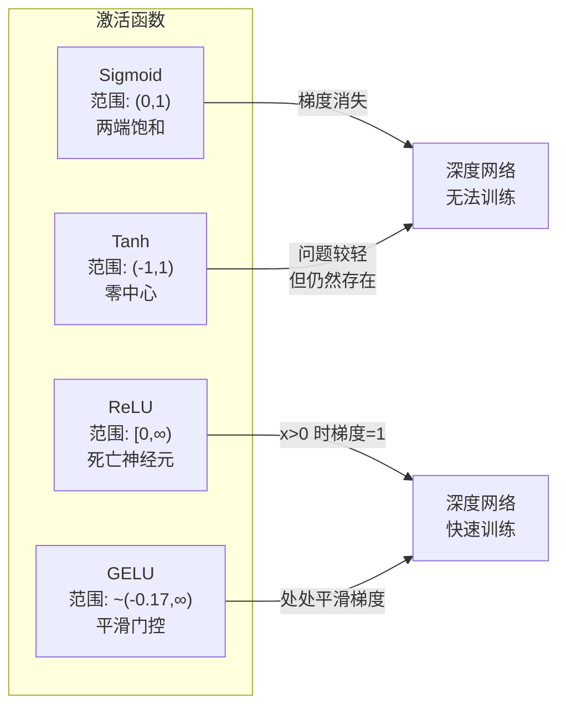
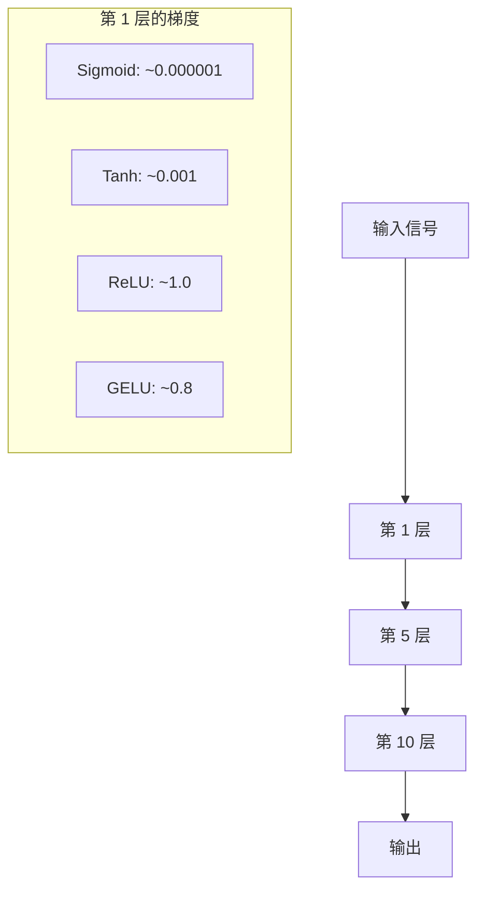
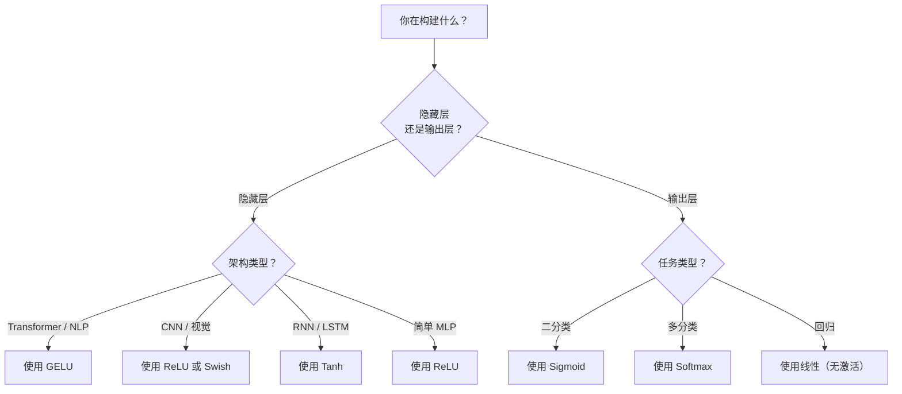

# 激活函数（Activation Functions）

> 没有非线性，你的百层网络不过是一个花哨的矩阵乘法。激活函数是让神经网络能够以曲线思考的门控机制。

**类型：** 构建
**语言：** Python
**前置课程：** 第 03.03 课（反向传播）
**预计时间：** 约 75 分钟

## 学习目标

- 从零实现 sigmoid、tanh、ReLU、Leaky ReLU、GELU、Swish 和 softmax 及其导数
- 通过测量不同激活函数在 10 层以上网络中的激活幅度，诊断梯度消失（vanishing gradient）问题
- 检测 ReLU 网络中的死亡神经元（dead neuron），并解释 GELU 为何能避免这一失效模式
- 针对特定架构（Transformer、CNN、RNN、输出层）选择正确的激活函数

## 问题所在

将两个线性变换叠加：y = W2(W1x + b1) + b2。展开后：y = W2W1x + W2b1 + b2。这不过是 y = Ax + c——一个单一的线性变换。无论叠加多少线性层，结果都会退化为一次矩阵乘法。你的百层网络与单层网络具有完全相同的表达能力。

这不是理论上的玩笑话。这意味着一个深度线性网络字面上无法学习 XOR，无法对螺旋形数据集进行分类，也无法识别人脸。没有激活函数，深度只是幻觉。

激活函数打破了线性性。它通过非线性函数扭曲每层的输出，赋予网络弯曲决策边界、逼近任意函数并真正学习的能力。但选错激活函数，你的梯度会消失为零（深度网络中的 sigmoid）、爆炸至无穷（无界激活函数配合不慎的初始化），或者神经元永久死亡（带有大负偏置的 ReLU）。激活函数的选择直接决定了你的网络究竟能否学习。

## 核心概念

### 为什么非线性是必要的

矩阵乘法具有可合并性。先乘以矩阵 A 再乘以矩阵 B 的结果等同于直接乘以 AB。这意味着叠加十个线性层在数学上等价于拥有一个大矩阵的单层。所有这些参数，所有这些深度——都浪费了。你需要某种东西来打破这种链式关系。这正是激活函数的作用。

以下是证明。一个线性层计算 f(x) = Wx + b。叠加两层：

```
Layer 1: h = W1 * x + b1
Layer 2: y = W2 * h + b2
```

代入：

```
y = W2 * (W1 * x + b1) + b2
y = (W2 * W1) * x + (W2 * b1 + b2)
y = A * x + c
```

等价于一层。在两层之间插入非线性激活函数 g()：

```
h = g(W1 * x + b1)
y = W2 * h + b2
```

现在代入就无法化简了。W2 * g(W1 * x + b1) + b2 无法被简化为单一的线性变换。网络可以表示非线性函数。每增加一个带激活函数的层，就增加了表达能力。

### Sigmoid

神经网络最初使用的激活函数。

```
sigmoid(x) = 1 / (1 + e^(-x))
```

输出范围：(0, 1)。平滑、可微，将任意实数映射到类似概率的值。

其导数：

```
sigmoid'(x) = sigmoid(x) * (1 - sigmoid(x))
```

该导数的最大值为 0.25，出现在 x = 0 处。在反向传播中，梯度在各层之间相乘。十层 sigmoid 意味着梯度最多被乘以 0.25 十次：

```
0.25^10 = 0.000000953674
```

不足原始信号的百万分之一。这就是梯度消失问题（vanishing gradient problem）。浅层的梯度变得极小，权重几乎不再更新。网络看似在学习——损失在后面的层中下降——但前几层实际上是冻结的。深度 sigmoid 网络根本无法训练。

另一个问题：sigmoid 的输出始终为正（0 到 1），这意味着权重的梯度始终同号，会导致梯度下降时出现锯齿形震荡。

### Tanh

sigmoid 的零中心化版本。

```
tanh(x) = (e^x - e^(-x)) / (e^x + e^(-x))
```

输出范围：(-1, 1)。以零为中心，消除了锯齿形震荡问题。

其导数：

```
tanh'(x) = 1 - tanh(x)^2
```

最大导数在 x = 0 处为 1.0——比 sigmoid 好四倍。但梯度消失问题依然存在。对于较大的正负输入，导数趋近于零。十层仍会压垮梯度，只是没那么猛烈。

### ReLU：突破性进展

线性整流单元（Rectified Linear Unit，ReLU）。由 Nair 和 Hinton 于 2010 年在深度学习中推广（该函数本身可追溯至 Fukushima 1969 年的工作），它改变了一切。

```
relu(x) = max(0, x)
```

输出范围：[0, 无穷)。其导数极为简单：

```
relu'(x) = 1  if x > 0
            0  if x <= 0
```

正值输入没有梯度消失问题。梯度恰好为 1，直接透传。这正是深度网络变得可训练的原因——ReLU 在各层之间保持了梯度幅度。

但存在一种失效模式：死亡神经元（dead neuron）问题。如果某个神经元的加权输入始终为负（由于较大的负偏置或不幸的权重初始化），其输出始终为零，梯度始终为零，永远不会更新。它永久死亡了。实际上，ReLU 网络中有 10%–40% 的神经元在训练过程中可能会死亡。

### Leaky ReLU

解决死亡神经元问题最简单的方法。

```
leaky_relu(x) = x        if x > 0
                alpha * x if x <= 0
```

其中 alpha 是一个小常数，通常为 0.01。负侧有一个小斜率而不是零，因此死亡神经元仍然能获得梯度信号并得以恢复。

### GELU：现代默认激活函数

高斯误差线性单元（Gaussian Error Linear Unit，GELU）。由 Hendrycks 和 Gimpel 于 2016 年提出，是 BERT、GPT 及大多数现代 Transformer 的默认激活函数。

```
gelu(x) = x * Phi(x)
```

其中 Phi(x) 是标准正态分布的累积分布函数。实践中使用的近似公式：

```
gelu(x) ~= 0.5 * x * (1 + tanh(sqrt(2/pi) * (x + 0.044715 * x^3)))
```

GELU 处处平滑，允许小的负值（不像 ReLU 那样硬截断为零），并具有概率论意义：它根据每个输入在高斯分布下为正的概率对其进行加权。这种平滑门控在 Transformer 架构中优于 ReLU，因为它提供了更好的梯度流，并完全避免了死亡神经元问题。

### Swish / SiLU

自门控激活函数（self-gated activation），由 Ramachandran 等人于 2017 年通过自动搜索发现。

```
swish(x) = x * sigmoid(x)
```

Swish 的形式是 x * sigmoid(x)。Google 通过对激活函数空间的自动搜索发现了它——用神经网络来设计神经网络的部分组件。

与 GELU 一样，它平滑、非单调，并允许小的负值。两者的区别很微妙：Swish 使用 sigmoid 作为门控，而 GELU 使用高斯累积分布函数。实践中性能几乎相同。Swish 在 EfficientNet 和部分视觉模型中使用，GELU 在语言模型中占主导地位。

### Softmax：输出层激活函数

不用于隐藏层。Softmax 将原始分数向量（logits）转换为概率分布。

```
softmax(x_i) = e^(x_i) / sum(e^(x_j) for all j)
```

每个输出值介于 0 和 1 之间，所有输出之和为 1。这使其成为多类分类任务的标准最终激活函数。最大的 logit 获得最高概率，但与 argmax 不同，softmax 是可微分的，并保留了关于相对置信度的信息。

### 各激活函数形状比较



### 梯度流对比



### 何时选用哪种激活函数



## 动手实现

### 第一步：实现所有激活函数及其导数

每个函数接收一个浮点数并返回一个浮点数。每个导数函数接收相同的输入并返回梯度。

```python
import math

def sigmoid(x):
    x = max(-500, min(500, x))
    return 1.0 / (1.0 + math.exp(-x))

def sigmoid_derivative(x):
    s = sigmoid(x)
    return s * (1 - s)

def tanh_act(x):
    return math.tanh(x)

def tanh_derivative(x):
    t = math.tanh(x)
    return 1 - t * t

def relu(x):
    return max(0.0, x)

def relu_derivative(x):
    return 1.0 if x > 0 else 0.0

def leaky_relu(x, alpha=0.01):
    return x if x > 0 else alpha * x

def leaky_relu_derivative(x, alpha=0.01):
    return 1.0 if x > 0 else alpha

def gelu(x):
    return 0.5 * x * (1 + math.tanh(math.sqrt(2 / math.pi) * (x + 0.044715 * x ** 3)))

def gelu_derivative(x):
    phi = 0.5 * (1 + math.erf(x / math.sqrt(2)))
    pdf = math.exp(-0.5 * x * x) / math.sqrt(2 * math.pi)
    return phi + x * pdf

def swish(x):
    return x * sigmoid(x)

def swish_derivative(x):
    s = sigmoid(x)
    return s + x * s * (1 - s)

def softmax(xs):
    max_x = max(xs)
    exps = [math.exp(x - max_x) for x in xs]
    total = sum(exps)
    return [e / total for e in exps]
```

### 第二步：可视化梯度消亡区域

在 -5 到 5 之间均匀取 100 个点计算梯度。打印文字直方图，显示每个激活函数的梯度接近零的区域。

```python
def gradient_scan(name, derivative_fn, start=-5, end=5, n=100):
    step = (end - start) / n
    near_zero = 0
    healthy = 0
    for i in range(n):
        x = start + i * step
        g = derivative_fn(x)
        if abs(g) < 0.01:
            near_zero += 1
        else:
            healthy += 1
    pct_dead = near_zero / n * 100
    print(f"{name:15s}: {healthy:3d} healthy, {near_zero:3d} near-zero ({pct_dead:.0f}% dead zone)")

gradient_scan("Sigmoid", sigmoid_derivative)
gradient_scan("Tanh", tanh_derivative)
gradient_scan("ReLU", relu_derivative)
gradient_scan("Leaky ReLU", leaky_relu_derivative)
gradient_scan("GELU", gelu_derivative)
gradient_scan("Swish", swish_derivative)
```

### 第三步：梯度消失实验

使用 sigmoid 和 ReLU 分别对 N 层网络进行前向传播，测量激活幅度的变化。

```python
import random

def vanishing_gradient_experiment(activation_fn, name, n_layers=10, n_inputs=5):
    random.seed(42)
    values = [random.gauss(0, 1) for _ in range(n_inputs)]

    print(f"\n{name} through {n_layers} layers:")
    for layer in range(n_layers):
        weights = [random.gauss(0, 1) for _ in range(n_inputs)]
        z = sum(w * v for w, v in zip(weights, values))
        activated = activation_fn(z)
        magnitude = abs(activated)
        bar = "#" * int(magnitude * 20)
        print(f"  Layer {layer+1:2d}: magnitude = {magnitude:.6f} {bar}")
        values = [activated] * n_inputs

vanishing_gradient_experiment(sigmoid, "Sigmoid")
vanishing_gradient_experiment(relu, "ReLU")
vanishing_gradient_experiment(gelu, "GELU")
```

### 第四步：死亡神经元检测器

创建一个 ReLU 网络，输入随机样本，统计从未激活的神经元数量。

```python
def dead_neuron_detector(n_inputs=5, hidden_size=20, n_samples=1000):
    random.seed(0)
    weights = [[random.gauss(0, 1) for _ in range(n_inputs)] for _ in range(hidden_size)]
    biases = [random.gauss(0, 1) for _ in range(hidden_size)]

    fire_counts = [0] * hidden_size

    for _ in range(n_samples):
        inputs = [random.gauss(0, 1) for _ in range(n_inputs)]
        for neuron_idx in range(hidden_size):
            z = sum(w * x for w, x in zip(weights[neuron_idx], inputs)) + biases[neuron_idx]
            if relu(z) > 0:
                fire_counts[neuron_idx] += 1

    dead = sum(1 for c in fire_counts if c == 0)
    rarely_fire = sum(1 for c in fire_counts if 0 < c < n_samples * 0.05)
    healthy = hidden_size - dead - rarely_fire

    print(f"\nDead Neuron Report ({hidden_size} neurons, {n_samples} samples):")
    print(f"  Dead (never fired):     {dead}")
    print(f"  Barely alive (<5%):     {rarely_fire}")
    print(f"  Healthy:                {healthy}")
    print(f"  Dead neuron rate:       {dead/hidden_size*100:.1f}%")

    for i, c in enumerate(fire_counts):
        status = "DEAD" if c == 0 else "WEAK" if c < n_samples * 0.05 else "OK"
        bar = "#" * (c * 40 // n_samples)
        print(f"  Neuron {i:2d}: {c:4d}/{n_samples} fires [{status:4s}] {bar}")

dead_neuron_detector()
```

### 第五步：训练对比——Sigmoid vs ReLU vs GELU

在圆形数据集（圆内的点 = 第 1 类，圆外 = 第 0 类）上，使用三种不同的激活函数训练相同的两层网络，比较收敛速度。

```python
def make_circle_data(n=200, seed=42):
    random.seed(seed)
    data = []
    for _ in range(n):
        x = random.uniform(-2, 2)
        y = random.uniform(-2, 2)
        label = 1.0 if x * x + y * y < 1.5 else 0.0
        data.append(([x, y], label))
    return data


class ActivationNetwork:
    def __init__(self, activation_fn, activation_deriv, hidden_size=8, lr=0.1):
        random.seed(0)
        self.act = activation_fn
        self.act_d = activation_deriv
        self.lr = lr
        self.hidden_size = hidden_size

        self.w1 = [[random.gauss(0, 0.5) for _ in range(2)] for _ in range(hidden_size)]
        self.b1 = [0.0] * hidden_size
        self.w2 = [random.gauss(0, 0.5) for _ in range(hidden_size)]
        self.b2 = 0.0

    def forward(self, x):
        self.x = x
        self.z1 = []
        self.h = []
        for i in range(self.hidden_size):
            z = self.w1[i][0] * x[0] + self.w1[i][1] * x[1] + self.b1[i]
            self.z1.append(z)
            self.h.append(self.act(z))

        self.z2 = sum(self.w2[i] * self.h[i] for i in range(self.hidden_size)) + self.b2
        self.out = sigmoid(self.z2)
        return self.out

    def backward(self, target):
        error = self.out - target
        d_out = error * self.out * (1 - self.out)

        for i in range(self.hidden_size):
            d_h = d_out * self.w2[i] * self.act_d(self.z1[i])
            self.w2[i] -= self.lr * d_out * self.h[i]
            for j in range(2):
                self.w1[i][j] -= self.lr * d_h * self.x[j]
            self.b1[i] -= self.lr * d_h
        self.b2 -= self.lr * d_out

    def train(self, data, epochs=200):
        losses = []
        for epoch in range(epochs):
            total_loss = 0
            correct = 0
            for x, y in data:
                pred = self.forward(x)
                self.backward(y)
                total_loss += (pred - y) ** 2
                if (pred >= 0.5) == (y >= 0.5):
                    correct += 1
            avg_loss = total_loss / len(data)
            accuracy = correct / len(data) * 100
            losses.append(avg_loss)
            if epoch % 50 == 0 or epoch == epochs - 1:
                print(f"    Epoch {epoch:3d}: loss={avg_loss:.4f}, accuracy={accuracy:.1f}%")
        return losses


data = make_circle_data()

configs = [
    ("Sigmoid", sigmoid, sigmoid_derivative),
    ("ReLU", relu, relu_derivative),
    ("GELU", gelu, gelu_derivative),
]

results = {}
for name, act_fn, act_d_fn in configs:
    print(f"\n=== Training with {name} ===")
    net = ActivationNetwork(act_fn, act_d_fn, hidden_size=8, lr=0.1)
    losses = net.train(data, epochs=200)
    results[name] = losses

print("\n=== Final Loss Comparison ===")
for name, losses in results.items():
    print(f"  {name:10s}: start={losses[0]:.4f} -> end={losses[-1]:.4f} (improvement: {(1 - losses[-1]/losses[0])*100:.1f}%)")
```

## 实际应用

PyTorch 以函数式和模块式两种形式提供了以上所有激活函数：

```python
import torch
import torch.nn as nn
import torch.nn.functional as F

x = torch.randn(4, 10)

relu_out = F.relu(x)
gelu_out = F.gelu(x)
sigmoid_out = torch.sigmoid(x)
swish_out = F.silu(x)

logits = torch.randn(4, 5)
probs = F.softmax(logits, dim=1)

model = nn.Sequential(
    nn.Linear(10, 64),
    nn.GELU(),
    nn.Linear(64, 32),
    nn.GELU(),
    nn.Linear(32, 5),
)
```

Transformer 隐藏层：GELU。CNN 隐藏层：ReLU。分类输出层：softmax。回归输出层：无（线性）。概率输出层：sigmoid。就这些。从这些默认值开始，只在有证据的情况下再做改动。

RNN 和 LSTM 使用 tanh 作为隐藏状态，sigmoid 作为门控，但如果你今天从头构建，可能不会用 RNN。如果 ReLU 网络中出现神经元死亡，切换到 GELU。不要随便换用 Leaky ReLU，除非你有明确原因——GELU 解决了死亡神经元问题，并提供更好的梯度流。

## 产出物

本课程产出：
- `outputs/prompt-activation-selector.md` —— 一个可复用的提示词，帮助你为任意架构选择合适的激活函数

## 练习

1. 实现参数化 ReLU（PReLU），其中负斜率 alpha 是一个可学习参数。在圆形数据集上训练，并与固定 Leaky ReLU 进行比较。

2. 将梯度消失实验改为 50 层而非 10 层。绘制每层对应 sigmoid、tanh、ReLU 和 GELU 的信号幅度。每种激活函数的信号在哪一层实际上归零？

3. 实现 ELU（指数线性单元）：elu(x) = x（若 x > 0），alpha * (e^x - 1)（若 x &lt;= 0）。比较其与 ReLU 在相同网络上的死亡神经元比率。

4. 构建一个训练过程中运行的"梯度健康监测器"：每轮训练中计算每层的平均梯度幅度。当任意层的梯度低于 0.001 或超过 100 时打印警告。

5. 将训练对比改为使用第 01 课的 XOR 数据集，而不是圆形数据集。哪种激活函数在 XOR 上收敛最快？为何结果与圆形数据集不同？

## 关键术语

| 术语 | 通俗说法 | 实际含义 |
|------|----------|----------|
| 激活函数（Activation function） | "非线性部分" | 应用于每个神经元输出的函数，打破线性性，使网络能够学习非线性映射 |
| 梯度消失（Vanishing gradient） | "深度网络中梯度消失" | 当激活函数导数小于 1 时，梯度在各层间指数级缩小，导致浅层无法训练 |
| 梯度爆炸（Exploding gradient） | "梯度爆炸" | 当有效乘数超过 1 时，梯度在各层间指数级增长，导致训练不稳定 |
| 死亡神经元（Dead neuron） | "停止学习的神经元" | 输入永久为负的 ReLU 神经元，输出和梯度均为零 |
| Sigmoid | "将值压缩到 0-1" | 逻辑函数 1/(1+e^-x)，历史上很重要，但在深度网络中会导致梯度消失 |
| ReLU | "将负值截断为零" | max(0, x)——使深度学习变得实用的激活函数，保持梯度幅度 |
| GELU | "Transformer 的激活函数" | 高斯误差线性单元，一种平滑激活函数，根据输入为正的概率对其加权 |
| Swish/SiLU | "自门控 ReLU" | x * sigmoid(x)，通过自动搜索发现，用于 EfficientNet |
| Softmax | "将分数转化为概率" | 将 logits 向量归一化为概率分布，所有值在 (0,1) 之间且和为 1 |
| Leaky ReLU | "不会死亡的 ReLU" | max(alpha*x, x)，其中 alpha 很小（0.01），通过允许小的负梯度防止死亡神经元 |
| 饱和（Saturation） | "sigmoid 的平坦部分" | 激活函数导数趋近于零的区域，阻塞梯度流 |
| Logit | "softmax 之前的原始分数" | 最终层在应用 softmax 或 sigmoid 之前的未归一化输出 |

## 延伸阅读

- Nair & Hinton, "Rectified Linear Units Improve Restricted Boltzmann Machines" (2010) -- 引入 ReLU 并实现深度网络训练的论文
- Hendrycks & Gimpel, "Gaussian Error Linear Units (GELUs)" (2016) -- 引入了成为 Transformer 默认激活函数的 GELU
- Ramachandran et al., "Searching for Activation Functions" (2017) -- 通过自动搜索发现 Swish，证明激活函数设计可以自动化
- Glorot & Bengio, "Understanding the difficulty of training deep feedforward neural networks" (2010) -- 诊断梯度消失/爆炸问题并提出 Xavier 初始化的论文
- Goodfellow, Bengio, Courville, "Deep Learning" Chapter 6.3 (https://www.deeplearningbook.org/) -- 对隐藏单元和激活函数的严格处理
