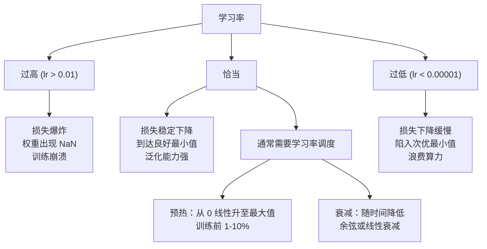
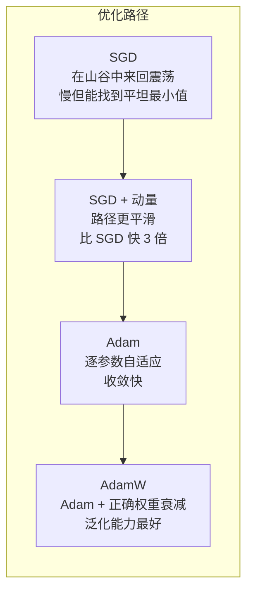
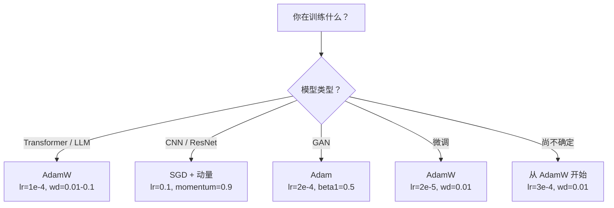

# 优化器（Optimizers）

> 梯度下降告诉你往哪个方向走，却对走多远、走多快只字未提。SGD 是一根指南针，Adam 是带实时路况的 GPS。

**类型：** 构建
**语言：** Python
**前置课程：** 第 03.05 课（损失函数）
**预计时间：** 约 75 分钟

## 学习目标

- 用 Python 从零实现 SGD、带动量的 SGD、Adam 和 AdamW 优化器
- 解释 Adam 的偏差修正如何补偿训练初期零初始化矩估计的偏差
- 在同一任务上演示 AdamW 比 Adam + L2 正则化具有更好的泛化能力
- 针对 Transformer、CNN、GAN 和微调场景选择合适的优化器及默认超参数

## 问题所在

你已经计算好了梯度，知道第 4721 号权重应该减少 0.003 才能降低损失。但 0.003 的单位是什么？以什么为缩放基准？第 1 步和第 1000 步应该移动同样的距离吗？

普通梯度下降对每个参数在每一步都应用相同的学习率：w = w - lr * gradient。这造成了三个让神经网络训练在实践中颇为痛苦的问题。

第一，震荡。损失曲面很少像一个光滑的碗。它更像是一条狭长的山谷。梯度指向山谷的横向（陡峭方向），而非纵向（平缓方向）。梯度下降在狭窄维度上来回反弹，而在有效方向上几乎没有进展。你可能已经见过这种现象：损失快速下降然后趋于平稳，不是因为模型收敛了，而是因为它在来回震荡。

第二，对所有参数使用同一学习率是错误的。有些权重需要大幅更新（它们处于欠拟合阶段），有些则需要微小更新（它们已经接近最优值）。适合前者的学习率会破坏后者，反之亦然。

第三，鞍点（saddle point）。在高维空间中，损失曲面存在大片梯度接近零的平坦区域。普通 SGD 在这些区域以梯度速度爬行，而梯度实际上几乎为零。模型看起来卡住了——实际上并没有，另一侧有可用的下降方向——但 SGD 没有机制来冲破平坦区域。

Adam 解决了所有三个问题。它为每个参数维护两个运行均值——梯度均值（动量，处理震荡）和梯度平方均值（自适应学习率，处理不同量级）。结合对初始步骤的偏差修正，它提供了一个在 80% 的问题上以默认超参数即可运作的优化器。本课程从头构建它，以便你清楚地理解它在另外 20% 的问题上何时以及为何失效。

## 核心概念

### 随机梯度下降（Stochastic Gradient Descent，SGD）

最简单的优化器。在一个小批量（mini-batch）上计算梯度，然后向反方向迈步。

```
w = w - lr * gradient
```

"随机"是指用数据的一个随机子集（mini-batch）来估计梯度，而非使用完整数据集。这种噪声实际上是有益的——它有助于逃离锋利的局部最小值。但噪声也会引起震荡。

学习率是唯一的旋钮。太高：损失发散。太低：训练永远结束不了。最优值取决于架构、数据、批大小以及训练的当前阶段。对于现代网络上的普通 SGD，典型值在 0.01 到 0.1 之间。但即使在单次训练中，理想的学习率也会变化。

### 动量（Momentum）

"球沿山坡滚下"的类比虽然被用滥了，但确实准确。与其只按梯度迈步，不如维护一个累积过去梯度的速度。

```
m_t = beta * m_{t-1} + gradient
w = w - lr * m_t
```

beta（通常为 0.9）控制保留多少历史信息。当 beta = 0.9 时，动量大约等于过去 10 个梯度的均值（1 / (1 - 0.9) = 10）。

为什么这能解决震荡：指向同一方向的梯度会累积，方向翻转的梯度则相互抵消。在那条狭长的山谷中，"横向"分量每步翻转符号并被阻尼，"纵向"分量保持一致并被放大。结果是在有效方向上平滑加速。

实际数字：在条件较差的损失曲面上，纯 SGD 可能需要 10000 步。带动量的 SGD（beta=0.9）在同样的问题上通常只需 3000–5000 步。提速幅度绝非微不足道。

### RMSProp

第一个真正奏效的逐参数自适应学习率方法。由 Hinton 在 Coursera 课程讲义中提出（从未正式发表）。

```
s_t = beta * s_{t-1} + (1 - beta) * gradient^2
w = w - lr * gradient / (sqrt(s_t) + epsilon)
```

s_t 追踪梯度平方的运行均值。梯度持续较大的参数会被一个较大的数除（有效学习率更小）；梯度一直很小的参数则被一个较小的数除（有效学习率更大）。

这解决了"所有参数用同一学习率"的问题。一个已经在获得大幅更新的权重可能已经接近目标——减慢它。一直获得微小更新的权重可能还在欠拟合——加快它。

epsilon（通常为 1e-8）防止当某个参数未被更新时出现除以零的情况。

### Adam：动量 + RMSProp

Adam 结合了两者的思路。它为每个参数维护两个指数移动平均：

```
m_t = beta1 * m_{t-1} + (1 - beta1) * gradient        (first moment: mean)
v_t = beta2 * v_{t-1} + (1 - beta2) * gradient^2       (second moment: variance)
```

**偏差修正（bias correction）** 是大多数讲解跳过的关键细节。在第 1 步，m_1 = (1 - beta1) * gradient。当 beta1 = 0.9 时，这等于 0.1 * gradient——比实际小了十倍。移动平均尚未预热。偏差修正对此进行补偿：

```
m_hat = m_t / (1 - beta1^t)
v_hat = v_t / (1 - beta2^t)
```

第 1 步时，beta1 = 0.9：m_hat = m_1 / (1 - 0.9) = m_1 / 0.1 = 实际梯度。第 100 步时：(1 - 0.9^100) 约为 1.0，修正消失。偏差修正在前约 10 步重要，在约 50 步后已无关紧要。

更新公式：

```
w = w - lr * m_hat / (sqrt(v_hat) + epsilon)
```

Adam 默认值：lr = 0.001，beta1 = 0.9，beta2 = 0.999，epsilon = 1e-8。这些默认值适用于 80% 的问题。当不适用时，先调 lr，再调 beta2，几乎不需要改动 beta1 或 epsilon。

### AdamW：正确实现权重衰减

L2 正则化在损失中加入 lambda * w^2。在普通 SGD 中，这等价于权重衰减（每步从权重中减去 lambda * w）。在 Adam 中，这种等价性被打破了。

Loshchilov & Hutter 的洞见：当你将 L2 加入损失并让 Adam 处理梯度时，自适应学习率也会缩放正则化项。梯度方差大的参数得到的正则化更少，方差小的参数得到的更多。这不是你想要的——你希望正则化与梯度统计量无关，均匀施加。

AdamW 通过在 Adam 更新之后直接对权重应用权重衰减来解决这个问题：

```
w = w - lr * m_hat / (sqrt(v_hat) + epsilon) - lr * lambda * w
```

权重衰减项（lr * lambda * w）不受 Adam 自适应因子的缩放。每个参数都得到相同比例的收缩。

这看起来只是一个细节，实则不然。在几乎每项任务上，AdamW 都能收敛到比 Adam + L2 正则化更好的解。它是 PyTorch 中训练 Transformer、扩散模型及大多数现代架构的默认优化器。BERT、GPT、LLaMA、Stable Diffusion——全部用 AdamW 训练。

### 学习率：最重要的超参数



如果只调一个超参数，就调学习率。学习率 10 倍的变化比任何架构决策都影响更大。常见默认值：

- SGD：lr = 0.01 到 0.1
- Adam/AdamW：lr = 1e-4 到 3e-4
- 微调预训练模型：lr = 1e-5 到 5e-5
- 学习率预热：在前 1-10% 的步骤上线性递增

### 优化器对比



### 各优化器的适用场景



## 动手实现

### 第一步：普通 SGD

```python
class SGD:
    def __init__(self, lr=0.01):
        self.lr = lr

    def step(self, params, grads):
        for i in range(len(params)):
            params[i] -= self.lr * grads[i]
```

### 第二步：带动量的 SGD

```python
class SGDMomentum:
    def __init__(self, lr=0.01, beta=0.9):
        self.lr = lr
        self.beta = beta
        self.velocities = None

    def step(self, params, grads):
        if self.velocities is None:
            self.velocities = [0.0] * len(params)
        for i in range(len(params)):
            self.velocities[i] = self.beta * self.velocities[i] + grads[i]
            params[i] -= self.lr * self.velocities[i]
```

### 第三步：Adam

```python
import math

class Adam:
    def __init__(self, lr=0.001, beta1=0.9, beta2=0.999, epsilon=1e-8):
        self.lr = lr
        self.beta1 = beta1
        self.beta2 = beta2
        self.epsilon = epsilon
        self.m = None
        self.v = None
        self.t = 0

    def step(self, params, grads):
        if self.m is None:
            self.m = [0.0] * len(params)
            self.v = [0.0] * len(params)

        self.t += 1

        for i in range(len(params)):
            self.m[i] = self.beta1 * self.m[i] + (1 - self.beta1) * grads[i]
            self.v[i] = self.beta2 * self.v[i] + (1 - self.beta2) * grads[i] ** 2

            m_hat = self.m[i] / (1 - self.beta1 ** self.t)
            v_hat = self.v[i] / (1 - self.beta2 ** self.t)

            params[i] -= self.lr * m_hat / (math.sqrt(v_hat) + self.epsilon)
```

### 第四步：AdamW

```python
class AdamW:
    def __init__(self, lr=0.001, beta1=0.9, beta2=0.999, epsilon=1e-8, weight_decay=0.01):
        self.lr = lr
        self.beta1 = beta1
        self.beta2 = beta2
        self.epsilon = epsilon
        self.weight_decay = weight_decay
        self.m = None
        self.v = None
        self.t = 0

    def step(self, params, grads):
        if self.m is None:
            self.m = [0.0] * len(params)
            self.v = [0.0] * len(params)

        self.t += 1

        for i in range(len(params)):
            self.m[i] = self.beta1 * self.m[i] + (1 - self.beta1) * grads[i]
            self.v[i] = self.beta2 * self.v[i] + (1 - self.beta2) * grads[i] ** 2

            m_hat = self.m[i] / (1 - self.beta1 ** self.t)
            v_hat = self.v[i] / (1 - self.beta2 ** self.t)

            params[i] -= self.lr * m_hat / (math.sqrt(v_hat) + self.epsilon)
            params[i] -= self.lr * self.weight_decay * params[i]
```

### 第五步：训练对比

使用第 05 课的圆形数据集，用全部四种优化器训练同一个两层网络，比较收敛情况。

```python
import random

def sigmoid(x):
    x = max(-500, min(500, x))
    return 1.0 / (1.0 + math.exp(-x))

def make_circle_data(n=200, seed=42):
    random.seed(seed)
    data = []
    for _ in range(n):
        x = random.uniform(-2, 2)
        y = random.uniform(-2, 2)
        label = 1.0 if x * x + y * y < 1.5 else 0.0
        data.append(([x, y], label))
    return data


class OptimizerTestNetwork:
    def __init__(self, optimizer, hidden_size=8):
        random.seed(0)
        self.hidden_size = hidden_size
        self.optimizer = optimizer

        self.w1 = [[random.gauss(0, 0.5) for _ in range(2)] for _ in range(hidden_size)]
        self.b1 = [0.0] * hidden_size
        self.w2 = [random.gauss(0, 0.5) for _ in range(hidden_size)]
        self.b2 = 0.0

    def get_params(self):
        params = []
        for row in self.w1:
            params.extend(row)
        params.extend(self.b1)
        params.extend(self.w2)
        params.append(self.b2)
        return params

    def set_params(self, params):
        idx = 0
        for i in range(self.hidden_size):
            for j in range(2):
                self.w1[i][j] = params[idx]
                idx += 1
        for i in range(self.hidden_size):
            self.b1[i] = params[idx]
            idx += 1
        for i in range(self.hidden_size):
            self.w2[i] = params[idx]
            idx += 1
        self.b2 = params[idx]

    def forward(self, x):
        self.x = x
        self.z1 = []
        self.h = []
        for i in range(self.hidden_size):
            z = self.w1[i][0] * x[0] + self.w1[i][1] * x[1] + self.b1[i]
            self.z1.append(z)
            self.h.append(max(0.0, z))

        self.z2 = sum(self.w2[i] * self.h[i] for i in range(self.hidden_size)) + self.b2
        self.out = sigmoid(self.z2)
        return self.out

    def compute_grads(self, target):
        eps = 1e-15
        p = max(eps, min(1 - eps, self.out))
        d_loss = -(target / p) + (1 - target) / (1 - p)
        d_sigmoid = self.out * (1 - self.out)
        d_out = d_loss * d_sigmoid

        grads = [0.0] * (self.hidden_size * 2 + self.hidden_size + self.hidden_size + 1)
        idx = 0
        for i in range(self.hidden_size):
            d_relu = 1.0 if self.z1[i] > 0 else 0.0
            d_h = d_out * self.w2[i] * d_relu
            grads[idx] = d_h * self.x[0]
            grads[idx + 1] = d_h * self.x[1]
            idx += 2

        for i in range(self.hidden_size):
            d_relu = 1.0 if self.z1[i] > 0 else 0.0
            grads[idx] = d_out * self.w2[i] * d_relu
            idx += 1

        for i in range(self.hidden_size):
            grads[idx] = d_out * self.h[i]
            idx += 1

        grads[idx] = d_out
        return grads

    def train(self, data, epochs=300):
        losses = []
        for epoch in range(epochs):
            total_loss = 0.0
            correct = 0
            for x, y in data:
                pred = self.forward(x)
                grads = self.compute_grads(y)
                params = self.get_params()
                self.optimizer.step(params, grads)
                self.set_params(params)

                eps = 1e-15
                p = max(eps, min(1 - eps, pred))
                total_loss += -(y * math.log(p) + (1 - y) * math.log(1 - p))
                if (pred >= 0.5) == (y >= 0.5):
                    correct += 1
            avg_loss = total_loss / len(data)
            accuracy = correct / len(data) * 100
            losses.append((avg_loss, accuracy))
            if epoch % 75 == 0 or epoch == epochs - 1:
                print(f"    Epoch {epoch:3d}: loss={avg_loss:.4f}, accuracy={accuracy:.1f}%")
        return losses
```

## 实际应用

PyTorch 优化器支持参数组、梯度裁剪和学习率调度：

```python
import torch
import torch.optim as optim

model = torch.nn.Sequential(
    torch.nn.Linear(784, 256),
    torch.nn.ReLU(),
    torch.nn.Linear(256, 10),
)

optimizer = optim.AdamW(model.parameters(), lr=3e-4, weight_decay=0.01)

scheduler = optim.lr_scheduler.CosineAnnealingLR(optimizer, T_max=100)

for epoch in range(100):
    optimizer.zero_grad()
    output = model(torch.randn(32, 784))
    loss = torch.nn.functional.cross_entropy(output, torch.randint(0, 10, (32,)))
    loss.backward()
    torch.nn.utils.clip_grad_norm_(model.parameters(), max_norm=1.0)
    optimizer.step()
    scheduler.step()
```

固定的模式始终是：zero_grad、前向传播、计算损失、反向传播、（裁剪）、step、（调度）。记住这个顺序。搞错顺序（例如在 optimizer.step() 之前调用 scheduler.step()）是常见的隐蔽 bug 来源。

对于 CNN，许多从业者仍然偏好 SGD + 动量（lr=0.1, momentum=0.9, weight_decay=1e-4）配合阶梯式或余弦调度。SGD 能找到更平坦的最小值，这通常泛化能力更强。对于 Transformer 和 LLM，带预热和余弦衰减的 AdamW 是通用默认选择。没有经过实测的理由，不要与主流做法对抗。

## 产出物

本课程产出：
- `outputs/prompt-optimizer-selector.md` —— 一个决策提示词，用于为任意架构选择合适的优化器和学习率

## 练习

1. 实现 Nesterov 动量，在"前瞻"位置（w - lr * beta * v）而非当前位置计算梯度。在圆形数据集上与标准动量比较收敛情况。

2. 实现学习率预热调度：在前 10% 训练步骤内从 0 线性升至 max_lr，然后余弦衰减至 0。对比 Adam + 预热与无预热 Adam，测量在圆形数据集上达到 90% 准确率所需的轮次数。

3. 追踪 Adam 训练过程中每个参数的有效学习率。有效学习率为 lr * m_hat / (sqrt(v_hat) + eps)。绘制第 10、50 和 200 步后有效学习率的分布情况。所有参数的更新速度相同吗？

4. 实现梯度裁剪（按全局范数裁剪），最大梯度范数设为 1.0。使用高学习率（Adam 的 lr=0.01）分别在有无裁剪的情况下训练。统计在 10 个随机种子中，有无裁剪时各有多少次训练发散（损失变为 NaN）。

5. 比较 Adam 与 AdamW 在权重较大的网络上的表现。将所有权重初始化为 [-5, 5] 之间的随机值（远大于正常值）。使用 weight_decay=0.1 训练 200 轮。绘制两种优化器权重 L2 范数随训练变化的曲线。AdamW 应表现出更快的权重收缩。

## 关键术语

| 术语 | 通俗说法 | 实际含义 |
|------|----------|----------|
| 学习率（Learning rate） | "步长" | 梯度更新的标量乘数；训练中影响最大的单一超参数 |
| SGD | "基础梯度下降" | 随机梯度下降：用 lr * gradient 减去权重，梯度在 mini-batch 上计算 |
| 动量（Momentum） | "滚球类比" | 过去梯度的指数移动均值；阻尼震荡，加速一致方向 |
| RMSProp | "自适应学习率" | 将每个参数的梯度除以其近期梯度的运行均方根；均衡各参数学习率 |
| Adam | "默认优化器" | 结合动量（一阶矩）和 RMSProp（二阶矩），并对初始步骤进行偏差修正 |
| AdamW | "正确的 Adam" | 带解耦权重衰减的 Adam；直接对权重施加正则化，而非通过梯度 |
| 偏差修正（Bias correction） | "运行均值的预热" | 除以 (1 - beta^t) 以补偿 Adam 矩估计零初始化带来的偏差 |
| 权重衰减（Weight decay） | "收缩权重" | 每步减去权重值的一个比例；一种惩罚大权重的正则化方法 |
| 学习率调度（Learning rate schedule） | "随时间改变学习率" | 在训练过程中调整学习率的函数；预热 + 余弦衰减是现代默认方案 |
| 梯度裁剪（Gradient clipping） | "限制梯度范数上限" | 当梯度向量的范数超过阈值时将其缩小；防止梯度爆炸更新 |

## 延伸阅读

- Kingma & Ba, "Adam: A Method for Stochastic Optimization" (2014) -- 包含收敛分析和偏差修正推导的 Adam 原始论文
- Loshchilov & Hutter, "Decoupled Weight Decay Regularization" (2017) -- 证明 L2 正则化与权重衰减在 Adam 中并不等价，并提出了 AdamW
- Smith, "Cyclical Learning Rates for Training Neural Networks" (2017) -- 引入学习率范围测试和循环调度，消除了固定学习率调参的需要
- Ruder, "An Overview of Gradient Descent Optimization Algorithms" (2016) -- 对所有优化器变体的最佳综述，包含清晰的对比和直觉解释
