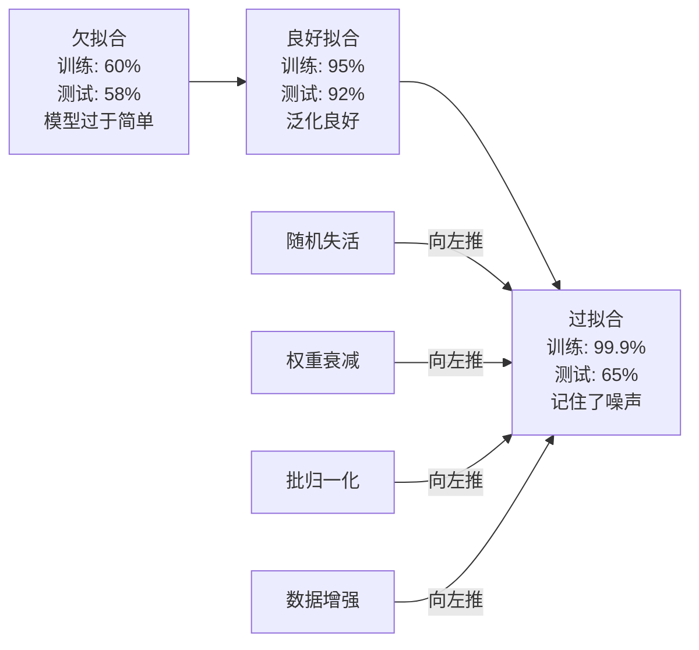
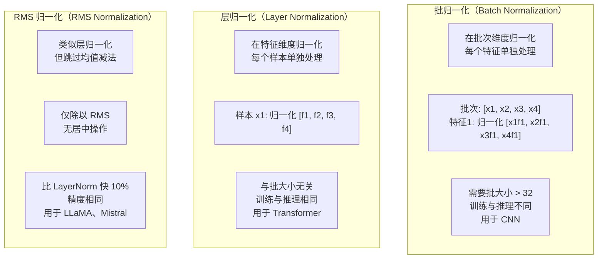
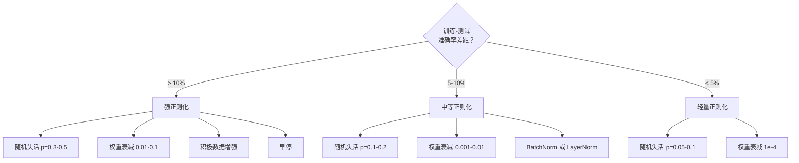

# 正则化

> 你的模型在训练数据上达到 99%，在测试数据上却只有 60%。它死记硬背而不是真正学习。正则化（Regularization）是你对复杂度征收的"税"，用来强制模型泛化。

**类型：** 构建
**语言：** Python
**前置条件：** 第 03.06 课（优化器）
**时间：** 约 75 分钟

## 学习目标

- 从零实现带反向缩放的随机失活（Dropout）、L2 权重衰减（Weight Decay）、批归一化（Batch Normalization）、层归一化（Layer Normalization）和 RMSNorm
- 测量训练集与测试集的准确率差距，通过正则化实验诊断过拟合（Overfitting）
- 解释为什么 Transformer 使用 LayerNorm 而非 BatchNorm，以及为什么现代 LLM 更倾向于使用 RMSNorm
- 根据过拟合的严重程度，选用正确的正则化技术组合

## 问题所在

拥有足够参数的神经网络可以记住任意数据集。这并非假设——Zhang 等人（2017）通过在随机标签的 ImageNet 上训练标准网络证明了这一点。这些网络在完全随机的标签分配下达到了近乎为零的训练损失。它们记住了一百万个随机的输入-输出对，却没有任何可学习的规律。训练损失完美，测试准确率为零。

这就是过拟合问题，模型越大越严重。GPT-3 有 1750 亿个参数，训练集约有 5000 亿个 token。凭借如此庞大的参数量，模型有足够的容量来逐字记忆训练数据的大量片段。若不加正则化，它只会不断输出训练样本，而非学习可泛化的规律。

训练性能与测试性能之间的差距称为过拟合差距。本课中的每种技术都从不同角度消弭这一差距：随机失活迫使网络不依赖任何单一神经元；权重衰减防止任何单一权重过大；批归一化平滑损失曲面，使优化器找到更平坦、泛化性更好的极小值；层归一化做同样的事，但在批归一化失效的场景（小批量、可变长度序列）中仍然奏效；RMSNorm 则通过省去均值计算，使速度提升约 10%。每种技术本身都很简单，组合在一起，便是"死记硬背的模型"与"真正泛化的模型"之间的分水岭。

## 核心概念

### 过拟合谱

每个模型都处于一个从欠拟合（Underfitting，模型过于简单，无法捕捉规律）到过拟合（Overfitting，模型极度复杂，学到了噪声）的连续谱上。甜蜜点在两者之间，而正则化就是从过拟合端将模型推向甜蜜点的工具。



### 随机失活

最简单的正则化技术，也拥有最优雅的解释。训练时，以概率 p 随机将每个神经元的输出置为零。

```
output = activation(z) * mask    where mask[i] ~ Bernoulli(1 - p)
```

当 p = 0.5 时，每次前向传播时有一半神经元被置零。网络必须学习冗余表征，因为它无法预测哪些神经元会可用。这防止了共适应（Co-adaptation）——即神经元学会依赖特定其他神经元的存在。

集成（Ensemble）解释：一个有 N 个神经元并启用随机失活的网络，会产生 2^N 种可能的子网络（每种神经元开/关组合各不相同）。使用随机失活进行训练，近似于同时训练所有 2^N 个子网络，每个子网络使用不同的小批量（Mini-batch）数据。测试时，使用所有神经元（不启用随机失活），并将输出缩放 (1 - p)，以匹配训练期间的期望值。这等价于对 2^N 个子网络预测结果取平均——用单个模型实现大型集成。

实践中，缩放在训练时进行而非测试时（反向随机失活，Inverted Dropout）：

```
During training:  output = activation(z) * mask / (1 - p)
During testing:   output = activation(z)   (no change needed)
```

这种方式更简洁，因为测试代码完全不需要知道随机失活的存在。

默认比率：Transformer 用 p = 0.1，MLP 用 p = 0.5，CNN 用 p = 0.2-0.3。随机失活越大，正则化越强，欠拟合风险越高。

### 权重衰减（L2 正则化）

将所有权重的平方量加入损失：

```
total_loss = task_loss + (lambda / 2) * sum(w_i^2)
```

正则化项的梯度为 lambda * w，这意味着每一步中，每个权重都以与其大小成比例的幅度向零收缩。大权重受到更大惩罚，模型被推向没有任何单个权重主导的解。

为何有助于泛化：过拟合的模型往往拥有大权重，会放大训练数据中的噪声。权重衰减保持权重较小，从而限制模型的有效容量，迫使其依赖鲁棒、可泛化的特征，而非记忆的怪异规律。

超参数 lambda 控制强度，典型值：

- Transformer 上使用 AdamW 时为 0.01
- CNN 上使用 SGD 时为 1e-4
- 严重过拟合时为 0.1

如第 06 课所述：权重衰减与 L2 正则化在 SGD 中等价，但在 Adam 中并不等价。使用 Adam 训练时，务必使用 AdamW（解耦权重衰减）。

### 批归一化

在将每层输出传入下一层之前，在小批量维度上对其归一化。对某层的一个小批量激活值：

```
mu = (1/B) * sum(x_i)           (batch mean)
sigma^2 = (1/B) * sum((x_i - mu)^2)   (batch variance)
x_hat = (x_i - mu) / sqrt(sigma^2 + eps)   (normalize)
y = gamma * x_hat + beta        (scale and shift)
```

gamma 和 beta 是可学习参数，若归一化并非最优，网络可通过它们撤销归一化。若没有这两个参数，就会强制每层的输出为零均值单位方差，而这未必是网络所期望的。

**训练与推理的差异：** 训练时，mu 和 sigma 来自当前小批量。推理时，使用训练期间累积的运行平均值（指数移动平均，momentum = 0.1，即 90% 旧值 + 10% 新值）。

批归一化为何有效至今仍有争议。原论文声称它减少了"内部协变量偏移（Internal Covariate Shift）"（随着早期层更新，层输入分布发生变化）。Santurkar 等人（2018）证明这一解释是错误的。真正的原因是：批归一化使损失曲面更平滑，梯度更具预测性，利普希茨常数（Lipschitz Constants）更小，优化器可以更安全地采用更大的步长。这就是为什么批归一化允许使用更高的学习率并更快收敛。

批归一化有一个根本性的限制：它依赖批次统计量。当批大小为 1 时，均值和方差毫无意义。小批量（< 32）时，统计量噪声大，会损害性能。这对于目标检测（内存限制批大小）和语言建模（序列长度可变）等任务尤为关键。

### 层归一化

在特征维度上归一化，而非在批次维度上。对单个样本：

```
mu = (1/D) * sum(x_j)           (feature mean)
sigma^2 = (1/D) * sum((x_j - mu)^2)   (feature variance)
x_hat = (x_j - mu) / sqrt(sigma^2 + eps)
y = gamma * x_hat + beta
```

D 是特征维度。每个样本独立归一化——不依赖批大小。这就是 Transformer 使用 LayerNorm 而非 BatchNorm 的原因。序列长度可变，批大小往往很小（生成时甚至为 1），且训练与推理时的计算完全相同。

Transformer 中的 LayerNorm 在每个自注意力块和前馈块之后应用（后归一化，Post-LN），或在其之前应用（前归一化，Pre-LN，训练更稳定）。

### RMSNorm

去掉均值减法的层归一化，由 Zhang & Sennrich（2019）提出。

```
rms = sqrt((1/D) * sum(x_j^2))
y = gamma * x / rms
```

仅此而已。无需计算均值，无需 beta 参数。核心观察：LayerNorm 中的重新居中（均值减法）对模型性能贡献极少，却消耗计算资源。去掉后可在保持相同精度的同时降低约 10% 的开销。

LLaMA、LLaMA 2、LLaMA 3、Mistral 以及大多数现代 LLM 都使用 RMSNorm 而非 LayerNorm。在数十亿参数、数万亿 token 的规模下，这 10% 的节省意义重大。

### 归一化方法对比



### 数据增强作为正则化

并非对模型的修改，而是对数据的修改。在保留标签的同时变换训练输入：

- 图像：随机裁剪、翻转、旋转、颜色抖动、Cutout
- 文本：同义词替换、回译、随机删除
- 音频：时间拉伸、音调变换、噪声添加

其效果与正则化完全相同：它增大了训练集的有效规模，使模型更难记住特定样本。若模型每张图像只见过一次原始形式，它可以记住。若它见过每张图像的 50 种增强版本，则被迫学习不变的结构。

### 早停

最简单的正则化器：当验证损失开始上升时停止训练。此时模型尚未过拟合。实践中，每个 epoch 跟踪验证损失，保存最优模型，并继续训练一个"耐心（Patience）"窗口（通常 5-20 个 epoch）。若验证损失在耐心窗口内没有改善，则停止并加载最优保存模型。

### 何时使用何种方法



## 构建实现

### 第一步：随机失活（训练与评估模式）

```python
import random
import math


class Dropout:
    def __init__(self, p=0.5):
        self.p = p
        self.training = True
        self.mask = None

    def forward(self, x):
        if not self.training:
            return list(x)
        self.mask = []
        output = []
        for val in x:
            if random.random() < self.p:
                self.mask.append(0)
                output.append(0.0)
            else:
                self.mask.append(1)
                output.append(val / (1 - self.p))
        return output

    def backward(self, grad_output):
        grads = []
        for g, m in zip(grad_output, self.mask):
            if m == 0:
                grads.append(0.0)
            else:
                grads.append(g / (1 - self.p))
        return grads
```

### 第二步：L2 权重衰减

```python
def l2_regularization(weights, lambda_reg):
    penalty = 0.0
    for w in weights:
        penalty += w * w
    return lambda_reg * 0.5 * penalty

def l2_gradient(weights, lambda_reg):
    return [lambda_reg * w for w in weights]
```

### 第三步：批归一化

```python
class BatchNorm:
    def __init__(self, num_features, momentum=0.1, eps=1e-5):
        self.gamma = [1.0] * num_features
        self.beta = [0.0] * num_features
        self.eps = eps
        self.momentum = momentum
        self.running_mean = [0.0] * num_features
        self.running_var = [1.0] * num_features
        self.training = True
        self.num_features = num_features

    def forward(self, batch):
        batch_size = len(batch)
        if self.training:
            mean = [0.0] * self.num_features
            for sample in batch:
                for j in range(self.num_features):
                    mean[j] += sample[j]
            mean = [m / batch_size for m in mean]

            var = [0.0] * self.num_features
            for sample in batch:
                for j in range(self.num_features):
                    var[j] += (sample[j] - mean[j]) ** 2
            var = [v / batch_size for v in var]

            for j in range(self.num_features):
                self.running_mean[j] = (1 - self.momentum) * self.running_mean[j] + self.momentum * mean[j]
                self.running_var[j] = (1 - self.momentum) * self.running_var[j] + self.momentum * var[j]
        else:
            mean = list(self.running_mean)
            var = list(self.running_var)

        self.x_hat = []
        output = []
        for sample in batch:
            normalized = []
            out_sample = []
            for j in range(self.num_features):
                x_h = (sample[j] - mean[j]) / math.sqrt(var[j] + self.eps)
                normalized.append(x_h)
                out_sample.append(self.gamma[j] * x_h + self.beta[j])
            self.x_hat.append(normalized)
            output.append(out_sample)
        return output
```

### 第四步：层归一化

```python
class LayerNorm:
    def __init__(self, num_features, eps=1e-5):
        self.gamma = [1.0] * num_features
        self.beta = [0.0] * num_features
        self.eps = eps
        self.num_features = num_features

    def forward(self, x):
        mean = sum(x) / len(x)
        var = sum((xi - mean) ** 2 for xi in x) / len(x)

        self.x_hat = []
        output = []
        for j in range(self.num_features):
            x_h = (x[j] - mean) / math.sqrt(var + self.eps)
            self.x_hat.append(x_h)
            output.append(self.gamma[j] * x_h + self.beta[j])
        return output
```

### 第五步：RMSNorm

```python
class RMSNorm:
    def __init__(self, num_features, eps=1e-6):
        self.gamma = [1.0] * num_features
        self.eps = eps
        self.num_features = num_features

    def forward(self, x):
        rms = math.sqrt(sum(xi * xi for xi in x) / len(x) + self.eps)
        output = []
        for j in range(self.num_features):
            output.append(self.gamma[j] * x[j] / rms)
        return output
```

### 第六步：有无正则化的训练对比

```python
def sigmoid(x):
    x = max(-500, min(500, x))
    return 1.0 / (1.0 + math.exp(-x))


def make_circle_data(n=200, seed=42):
    random.seed(seed)
    data = []
    for _ in range(n):
        x = random.uniform(-2, 2)
        y = random.uniform(-2, 2)
        label = 1.0 if x * x + y * y < 1.5 else 0.0
        data.append(([x, y], label))
    return data


class RegularizedNetwork:
    def __init__(self, hidden_size=16, lr=0.05, dropout_p=0.0, weight_decay=0.0):
        random.seed(0)
        self.hidden_size = hidden_size
        self.lr = lr
        self.dropout_p = dropout_p
        self.weight_decay = weight_decay
        self.dropout = Dropout(p=dropout_p) if dropout_p > 0 else None

        self.w1 = [[random.gauss(0, 0.5) for _ in range(2)] for _ in range(hidden_size)]
        self.b1 = [0.0] * hidden_size
        self.w2 = [random.gauss(0, 0.5) for _ in range(hidden_size)]
        self.b2 = 0.0

    def forward(self, x, training=True):
        self.x = x
        self.z1 = []
        self.h = []
        for i in range(self.hidden_size):
            z = self.w1[i][0] * x[0] + self.w1[i][1] * x[1] + self.b1[i]
            self.z1.append(z)
            self.h.append(max(0.0, z))

        if self.dropout and training:
            self.dropout.training = True
            self.h = self.dropout.forward(self.h)
        elif self.dropout:
            self.dropout.training = False
            self.h = self.dropout.forward(self.h)

        self.z2 = sum(self.w2[i] * self.h[i] for i in range(self.hidden_size)) + self.b2
        self.out = sigmoid(self.z2)
        return self.out

    def backward(self, target):
        eps = 1e-15
        p = max(eps, min(1 - eps, self.out))
        d_loss = -(target / p) + (1 - target) / (1 - p)
        d_sigmoid = self.out * (1 - self.out)
        d_out = d_loss * d_sigmoid

        for i in range(self.hidden_size):
            d_relu = 1.0 if self.z1[i] > 0 else 0.0
            d_h = d_out * self.w2[i] * d_relu
            self.w2[i] -= self.lr * (d_out * self.h[i] + self.weight_decay * self.w2[i])
            for j in range(2):
                self.w1[i][j] -= self.lr * (d_h * self.x[j] + self.weight_decay * self.w1[i][j])
            self.b1[i] -= self.lr * d_h
        self.b2 -= self.lr * d_out

    def evaluate(self, data):
        correct = 0
        total_loss = 0.0
        for x, y in data:
            pred = self.forward(x, training=False)
            eps = 1e-15
            p = max(eps, min(1 - eps, pred))
            total_loss += -(y * math.log(p) + (1 - y) * math.log(1 - p))
            if (pred >= 0.5) == (y >= 0.5):
                correct += 1
        return total_loss / len(data), correct / len(data) * 100

    def train_model(self, train_data, test_data, epochs=300):
        history = []
        for epoch in range(epochs):
            total_loss = 0.0
            correct = 0
            for x, y in train_data:
                pred = self.forward(x, training=True)
                self.backward(y)
                eps = 1e-15
                p = max(eps, min(1 - eps, pred))
                total_loss += -(y * math.log(p) + (1 - y) * math.log(1 - p))
                if (pred >= 0.5) == (y >= 0.5):
                    correct += 1
            train_loss = total_loss / len(train_data)
            train_acc = correct / len(train_data) * 100
            test_loss, test_acc = self.evaluate(test_data)
            history.append((train_loss, train_acc, test_loss, test_acc))
            if epoch % 75 == 0 or epoch == epochs - 1:
                gap = train_acc - test_acc
                print(f"    Epoch {epoch:3d}: train_acc={train_acc:.1f}%, test_acc={test_acc:.1f}%, gap={gap:.1f}%")
        return history
```

## 实际使用

PyTorch 提供了所有归一化和正则化模块：

```python
import torch
import torch.nn as nn

model = nn.Sequential(
    nn.Linear(784, 256),
    nn.BatchNorm1d(256),
    nn.ReLU(),
    nn.Dropout(0.3),
    nn.Linear(256, 128),
    nn.BatchNorm1d(128),
    nn.ReLU(),
    nn.Dropout(0.3),
    nn.Linear(128, 10),
)

model.train()
out_train = model(torch.randn(32, 784))

model.eval()
out_test = model(torch.randn(1, 784))
```

`model.train()` / `model.eval()` 的切换至关重要。它开关随机失活，并告知 BatchNorm 是使用批次统计量还是运行统计量。在推理前忘记调用 `model.eval()` 是深度学习中最常见的 Bug 之一。你的测试准确率将随机波动，因为随机失活仍然激活，BatchNorm 使用的是小批量统计量。

对于 Transformer，模式有所不同：

```python
class TransformerBlock(nn.Module):
    def __init__(self, d_model=512, nhead=8, dropout=0.1):
        super().__init__()
        self.attention = nn.MultiheadAttention(d_model, nhead, dropout=dropout)
        self.norm1 = nn.LayerNorm(d_model)
        self.ff = nn.Sequential(
            nn.Linear(d_model, d_model * 4),
            nn.GELU(),
            nn.Linear(d_model * 4, d_model),
            nn.Dropout(dropout),
        )
        self.norm2 = nn.LayerNorm(d_model)
        self.dropout = nn.Dropout(dropout)

    def forward(self, x):
        attended, _ = self.attention(x, x, x)
        x = self.norm1(x + self.dropout(attended))
        x = self.norm2(x + self.ff(x))
        return x
```

LayerNorm 而非 BatchNorm，随机失活 p=0.1 而非 p=0.5。这是 Transformer 的默认值。

## 交付成果

本课产出：
- `outputs/prompt-regularization-advisor.md` —— 一个诊断过拟合并推荐正确正则化策略的提示词

## 练习

1. 实现用于 2D 数据的空间随机失活：不是丢弃单个神经元，而是丢弃整个特征通道。通过将连续特征分组为通道并丢弃整个组来模拟。与 hidden_size=32 的圆形数据集上的标准随机失活相比较训练-测试差距。

2. 将第 05 课的标签平滑与本课的随机失活结合实现。用四种配置训练：两者皆无、仅随机失活、仅标签平滑、两者皆有。测量每种配置的最终训练-测试准确率差距。哪种组合的差距最小？

3. 在圆形数据集网络的隐藏层和激活函数之间添加 BatchNorm 层。在学习率 0.01、0.05 和 0.1 下分别使用和不使用 BatchNorm 进行训练。BatchNorm 应允许在普通网络发散的更高学习率下稳定训练。

4. 实现早停：每个 epoch 跟踪测试损失，保存最优权重，若测试损失在 20 个 epoch 内未改善则停止。将正则化网络训练 1000 个 epoch，报告最优测试准确率出现在哪个 epoch，以及节省了多少 epoch 的计算。

5. 在 4 层网络（不只是 2 层）上对比 LayerNorm 和 RMSNorm。用相同权重初始化两者，训练 200 个 epoch，比较最终准确率、训练速度（每 epoch 时间）以及第一层的梯度量级。验证 RMSNorm 在相同精度下更快。

## 关键术语

| 术语 | 常见说法 | 实际含义 |
|------|---------|---------|
| 过拟合（Overfitting） | "模型记住了数据" | 模型训练性能显著优于测试性能，表明它学到了噪声而非信号 |
| 正则化（Regularization） | "防止过拟合" | 任何约束模型复杂度以提升泛化性的技术：随机失活、权重衰减、归一化、数据增强 |
| 随机失活（Dropout） | "随机删除神经元" | 训练时以概率 p 将神经元置零，强制学习冗余表征；等价于训练集成 |
| 权重衰减（Weight Decay） | "L2 惩罚" | 每步将所有权重减去 lambda * w 向零收缩；通过权重量级惩罚复杂度 |
| 批归一化（Batch Normalization） | "按批次归一化" | 在批次维度上使用批次统计量归一化层输出（训练时），推理时使用运行平均值 |
| 层归一化（Layer Normalization） | "按样本归一化" | 在每个样本的特征维度上归一化；与批大小无关，用于批大小可变的 Transformer |
| RMSNorm | "去掉均值的 LayerNorm" | 均方根归一化；去掉 LayerNorm 的均值减法，速度提升 10%，精度相同 |
| 早停（Early Stopping） | "在过拟合前停止" | 当验证损失不再改善时停止训练；最简单的正则化器，通常与其他技术并用 |
| 数据增强（Data Augmentation） | "用更少数据生成更多数据" | 变换训练输入（翻转、裁剪、噪声）以增大有效数据集规模，强制学习不变性 |
| 泛化差距（Generalization Gap） | "训练-测试分裂" | 训练性能与测试性能的差值；正则化旨在最小化该差距 |

## 延伸阅读

- Srivastava et al., "Dropout: A Simple Way to Prevent Neural Networks from Overfitting" (2014) -- 随机失活原始论文，包含集成解释和大量实验
- Ioffe & Szegedy, "Batch Normalization: Accelerating Deep Network Training by Reducing Internal Covariate Shift" (2015) -- 批归一化及其训练流程的提出，深度学习引用最多的论文之一
- Zhang & Sennrich, "Root Mean Square Layer Normalization" (2019) -- 证明 RMSNorm 在计算量减少的情况下与 LayerNorm 精度相当；已被 LLaMA 和 Mistral 采用
- Zhang et al., "Understanding Deep Learning Requires Rethinking Generalization" (2017) -- 里程碑式论文，证明神经网络可以记住随机标签，挑战了传统泛化观
