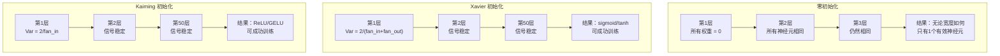
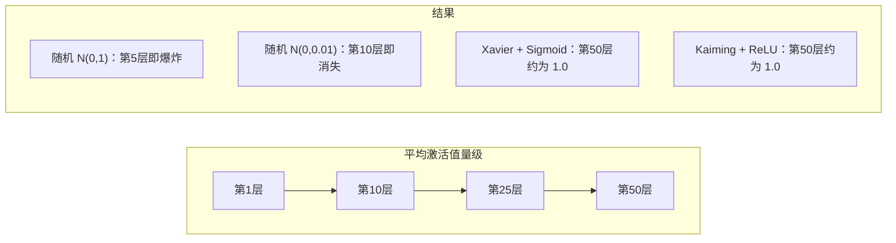
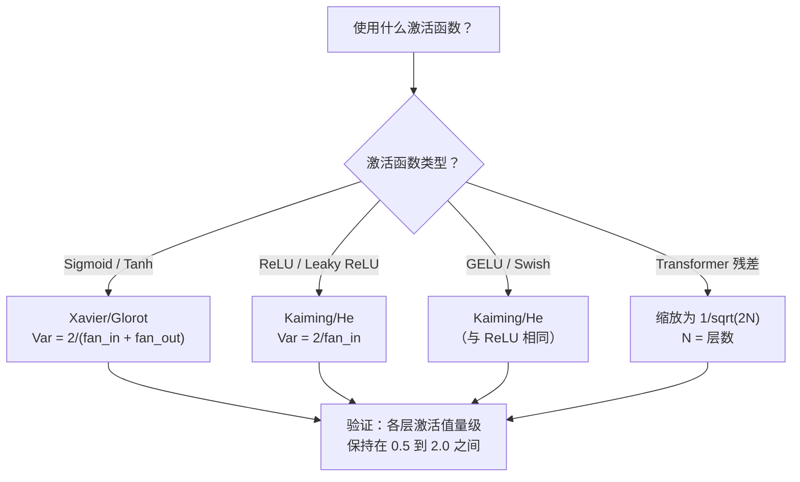

# 权重初始化与训练稳定性

> 初始化错误，训练永远无法启动。初始化正确，50 层网络的训练会像 3 层一样流畅。

**类型：** 构建
**语言：** Python
**前置条件：** 第 03.04 课（激活函数）、第 03.07 课（正则化）
**时间：** 约 90 分钟

## 学习目标

- 实现零初始化、随机初始化、Xavier/Glorot 初始化和 Kaiming/He 初始化策略，并测量其在 50 层网络中对激活值量级的影响
- 推导 Xavier 初始化使用 Var(w) = 2/(fan_in + fan_out) 以及 Kaiming 初始化使用 Var(w) = 2/fan_in 的原因
- 演示零初始化的对称性问题，并解释为何随机规模本身并不充分
- 将正确的初始化策略与激活函数匹配：sigmoid/tanh 用 Xavier，ReLU/GELU 用 Kaiming

## 问题所在

将所有权重初始化为零，什么都学不到。每个神经元计算相同的函数，接收相同的梯度，做出相同的更新。经过 10,000 个 epoch 后，你的 512 个神经元隐藏层仍然是同一个神经元的 512 份副本。你付出了 512 个参数的代价，却只得到 1 个的效果。

将它们初始化得太大，激活值在网络中爆炸。到第 10 层时，数值达到 1e15。到第 20 层时，它们溢出为无穷大。梯度以相反的轨迹重演同样的过程。

从标准正态分布中随机初始化。3 层网络可以工作。但到 50 层时，信号会收缩至零或爆炸为无穷大，取决于随机规模是略微偏小还是略微偏大。"有效"与"崩溃"之间的边界极为微细。

权重初始化（Weight Initialization）是深度学习中最被低估的决策。网络架构有论文，优化器有博客，初始化只是一个脚注。但如果搞错了，其他一切都无关紧要——你的网络在训练开始之前就已死亡。

## 核心概念

### 对称性问题

一层中的每个神经元都有相同的结构：将输入乘以权重，加上偏置，应用激活函数。如果所有权重的初始值相同（零是极端情况），每个神经元的输出相同。在反向传播（Backpropagation）期间，每个神经元接收相同的梯度。在更新步骤中，每个神经元的变化量也相同。

陷入僵局。网络有数百个参数，但它们都同步移动。这称为对称性（Symmetry），随机初始化是打破它的暴力方法。每个神经元从权重空间的不同点出发，因此每个神经元学习不同的特征。

但"随机"还不够。随机性的*规模*决定了网络能否训练。

### 方差通过各层的传播

考虑一个有 fan_in 个输入的单层：

```
z = w1*x1 + w2*x2 + ... + w_n*x_n
```

如果每个权重 wi 来自方差为 Var(w) 的分布，每个输入 xi 的方差为 Var(x)，则输出方差为：

```
Var(z) = fan_in * Var(w) * Var(x)
```

如果 Var(w) = 1，fan_in = 512，输出方差是输入方差的 512 倍。经过 10 层后：512^10 = 1.2e27。信号已经爆炸。

如果 Var(w) = 0.001，每层输出方差收缩为 0.001 * 512 = 0.512。经过 10 层后：0.512^10 = 0.00013。信号已经消失。

目标：选择 Var(w) 使得 Var(z) = Var(x)。信号量级在各层保持不变。

### Xavier/Glorot 初始化

Glorot 和 Bengio（2010）推导出了适用于 sigmoid 和 tanh 激活函数的解。为使前向传播和反向传播中的方差保持不变：

```
Var(w) = 2 / (fan_in + fan_out)
```

实践中，权重从以下分布中采样：

```
w ~ Uniform(-limit, limit)  where limit = sqrt(6 / (fan_in + fan_out))
```

或：

```
w ~ Normal(0, sqrt(2 / (fan_in + fan_out)))
```

这之所以有效，是因为 sigmoid 和 tanh 在零附近近似线性，而正确初始化的激活值就处于这个区间。方差在数十层中保持稳定。

### Kaiming/He 初始化

ReLU 会消灭一半的输出（所有负值变为零）。由于平均有一半的输入被置零，有效 fan_in 减半。Xavier 初始化没有考虑这一点——它低估了所需的方差。

He 等人（2015）调整了公式：

```
Var(w) = 2 / fan_in
```

权重从以下分布中采样：

```
w ~ Normal(0, sqrt(2 / fan_in))
```

因子 2 补偿了 ReLU 将一半激活值置零的影响。没有它，信号每层会收缩约 0.5 倍。经过 50 层：0.5^50 = 8.8e-16。Kaiming 初始化防止了这种情况。

### Transformer 初始化

GPT-2 引入了一种不同的模式。残差连接将每个子层的输出加到其输入上：

```
x = x + sublayer(x)
```

每次加法都会增大方差。有 N 个残差层时，方差与 N 成比例增长。GPT-2 将残差层的权重缩放为 1/sqrt(2N)，其中 N 是层数。这使累积的信号量级保持稳定。

Llama 3（4050 亿参数，126 层）使用类似的方案。若没有这种缩放，残差流在经过 126 层注意力和前馈块后将无限增大。



### 50 层中的激活值量级



### 选择正确的初始化



## 构建实现

### 第一步：初始化策略

四种权重矩阵初始化方式。每种方式都返回一个列表的列表（二维矩阵），有 fan_in 列和 fan_out 行。

```python
import math
import random


def zero_init(fan_in, fan_out):
    return [[0.0 for _ in range(fan_in)] for _ in range(fan_out)]


def random_init(fan_in, fan_out, scale=1.0):
    return [[random.gauss(0, scale) for _ in range(fan_in)] for _ in range(fan_out)]


def xavier_init(fan_in, fan_out):
    std = math.sqrt(2.0 / (fan_in + fan_out))
    return [[random.gauss(0, std) for _ in range(fan_in)] for _ in range(fan_out)]


def kaiming_init(fan_in, fan_out):
    std = math.sqrt(2.0 / fan_in)
    return [[random.gauss(0, std) for _ in range(fan_in)] for _ in range(fan_out)]
```

### 第二步：激活函数

我们需要 sigmoid、tanh 和 ReLU，以便用各自对应的激活函数测试每种初始化策略。

```python
def sigmoid(x):
    x = max(-500, min(500, x))
    return 1.0 / (1.0 + math.exp(-x))


def tanh_act(x):
    return math.tanh(x)


def relu(x):
    return max(0.0, x)
```

### 第三步：经过 50 层的前向传播

将随机数据通过深层网络传递，并在每层测量平均激活值量级。

```python
def forward_deep(init_fn, activation_fn, n_layers=50, width=64, n_samples=100):
    random.seed(42)
    layer_magnitudes = []

    inputs = [[random.gauss(0, 1) for _ in range(width)] for _ in range(n_samples)]

    for layer_idx in range(n_layers):
        weights = init_fn(width, width)
        biases = [0.0] * width

        new_inputs = []
        for sample in inputs:
            output = []
            for neuron_idx in range(width):
                z = sum(weights[neuron_idx][j] * sample[j] for j in range(width)) + biases[neuron_idx]
                output.append(activation_fn(z))
            new_inputs.append(output)
        inputs = new_inputs

        magnitudes = []
        for sample in inputs:
            magnitudes.append(sum(abs(v) for v in sample) / width)
        mean_mag = sum(magnitudes) / len(magnitudes)
        layer_magnitudes.append(mean_mag)

    return layer_magnitudes
```

### 第四步：实验

运行所有组合：零初始化、随机 N(0,1)、随机 N(0,0.01)、Xavier+sigmoid、Xavier+tanh、Kaiming+ReLU。打印关键层处的量级。

```python
def run_experiment():
    configs = [
        ("Zero init + Sigmoid", lambda fi, fo: zero_init(fi, fo), sigmoid),
        ("Random N(0,1) + ReLU", lambda fi, fo: random_init(fi, fo, 1.0), relu),
        ("Random N(0,0.01) + ReLU", lambda fi, fo: random_init(fi, fo, 0.01), relu),
        ("Xavier + Sigmoid", xavier_init, sigmoid),
        ("Xavier + Tanh", xavier_init, tanh_act),
        ("Kaiming + ReLU", kaiming_init, relu),
    ]

    print(f"{'Strategy':<30} {'L1':>10} {'L5':>10} {'L10':>10} {'L25':>10} {'L50':>10}")
    print("-" * 80)

    for name, init_fn, act_fn in configs:
        mags = forward_deep(init_fn, act_fn)
        row = f"{name:<30}"
        for idx in [0, 4, 9, 24, 49]:
            val = mags[idx]
            if val > 1e6:
                row += f" {'EXPLODED':>10}"
            elif val < 1e-6:
                row += f" {'VANISHED':>10}"
            else:
                row += f" {val:>10.4f}"
        print(row)
```

### 第五步：对称性演示

展示零初始化会产生相同的神经元。

```python
def symmetry_demo():
    random.seed(42)
    weights = zero_init(2, 4)
    biases = [0.0] * 4

    inputs = [0.5, -0.3]
    outputs = []
    for neuron_idx in range(4):
        z = sum(weights[neuron_idx][j] * inputs[j] for j in range(2)) + biases[neuron_idx]
        outputs.append(sigmoid(z))

    print("\nSymmetry Demo (4 neurons, zero init):")
    for i, out in enumerate(outputs):
        print(f"  Neuron {i}: output = {out:.6f}")
    all_same = all(abs(outputs[i] - outputs[0]) < 1e-10 for i in range(len(outputs)))
    print(f"  All identical: {all_same}")
    print(f"  Effective parameters: 1 (not {len(weights) * len(weights[0])})")
```

### 第六步：逐层量级报告

打印 50 层中激活值量级的文本条形图。

```python
def magnitude_report(name, magnitudes):
    print(f"\n{name}:")
    for i, mag in enumerate(magnitudes):
        if i % 5 == 0 or i == len(magnitudes) - 1:
            if mag > 1e6:
                bar = "X" * 50 + " EXPLODED"
            elif mag < 1e-6:
                bar = "." + " VANISHED"
            else:
                bar_len = min(50, max(1, int(mag * 10)))
                bar = "#" * bar_len
            print(f"  Layer {i+1:3d}: {bar} ({mag:.6f})")
```

## 实际使用

PyTorch 将这些作为内置函数提供：

```python
import torch
import torch.nn as nn

layer = nn.Linear(512, 256)

nn.init.xavier_uniform_(layer.weight)
nn.init.xavier_normal_(layer.weight)

nn.init.kaiming_uniform_(layer.weight, nonlinearity='relu')
nn.init.kaiming_normal_(layer.weight, nonlinearity='relu')

nn.init.zeros_(layer.bias)
```

当你调用 `nn.Linear(512, 256)` 时，PyTorch 默认使用 Kaiming 均匀初始化。这就是为什么大多数简单网络"开箱即用"的原因——PyTorch 已经做出了正确选择。但当你构建自定义架构或深度超过 20 层时，你需要了解背后发生的事情，并可能需要覆盖默认值。

对于 Transformer，HuggingFace 模型通常在其 `_init_weights` 方法中处理初始化。GPT-2 的实现将残差投影缩放为 1/sqrt(N)。如果你从零构建 Transformer，需要自行添加这一步。

## 交付成果

本课产出：
- `outputs/prompt-init-strategy.md` -- 一个诊断权重初始化问题并推荐正确策略的提示词

## 练习

1. 添加 LeCun 初始化（Var = 1/fan_in，为 SELU 激活设计）。用 LeCun 初始化 + tanh 运行 50 层实验，与 Xavier + tanh 进行比较。

2. 实现 GPT-2 的残差缩放：在加入残差流之前，将每层输出乘以 1/sqrt(2*N)。分别在有无缩放的情况下运行 50 层，测量残差量级增长速度。

3. 创建一个"初始化健康检查"函数，接受网络层维度和激活类型，推荐正确的初始化方式，并在当前初始化会导致问题时发出警告。

4. 分别用 fan_in = 16 和 fan_in = 1024 运行实验。Xavier 和 Kaiming 会适应 fan_in，但随机初始化不会。展示随着层变宽，"有效"和"失效"之间的差距如何扩大。

5. 实现正交初始化（生成随机矩阵，计算其 SVD，使用正交矩阵 U）。与 Kaiming 初始化在 50 层 ReLU 网络上进行比较。

## 关键术语

| 术语 | 常见说法 | 实际含义 |
|------|---------|---------|
| 权重初始化（Weight Initialization） | "随机设置初始权重" | 选择初始权重值的策略，决定网络能否进行训练 |
| 对称性破除（Symmetry Breaking） | "让神经元各不相同" | 使用随机初始化确保神经元学习不同特征，而非计算相同函数 |
| 输入扇入（Fan-in） | "神经元的输入数量" | 输入连接数，决定加权求和中输入方差的累积方式 |
| 输出扇出（Fan-out） | "神经元的输出数量" | 输出连接数，与反向传播时保持梯度方差有关 |
| Xavier/Glorot 初始化 | "sigmoid 初始化" | Var(w) = 2/(fan_in + fan_out)，设计用于保持方差通过 sigmoid 和 tanh 激活 |
| Kaiming/He 初始化 | "ReLU 初始化" | Var(w) = 2/fan_in，考虑了 ReLU 将一半激活值置零的影响 |
| 方差传播（Variance Propagation） | "信号在各层如何增大或缩小" | 基于权重规模分析激活方差逐层变化的数学方法 |
| 残差缩放（Residual Scaling） | "GPT-2 的初始化技巧" | 将残差连接权重缩放为 1/sqrt(2N)，防止方差在 N 个 Transformer 层中增长 |
| 死亡网络（Dead Network） | "什么都学不到" | 因初始化不当导致所有梯度为零或所有激活值饱和的网络 |
| 激活值爆炸（Exploding Activations） | "数值趋于无穷" | 当权重方差过大时，激活值量级在各层呈指数增长 |

## 延伸阅读

- Glorot & Bengio, "Understanding the difficulty of training deep feedforward neural networks" (2010) -- Xavier 初始化原始论文，包含方差分析
- He et al., "Delving Deep into Rectifiers" (2015) -- 为 ReLU 网络引入 Kaiming 初始化
- Radford et al., "Language Models are Unsupervised Multitask Learners" (2019) -- GPT-2 论文，包含残差缩放初始化
- Mishkin & Matas, "All You Need is a Good Init" (2016) -- 层序列单位方差初始化，解析公式的经验替代方案
