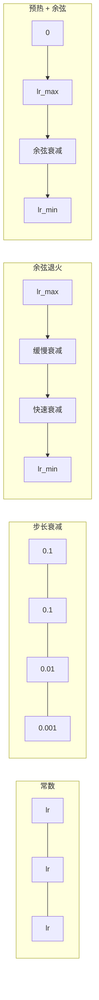
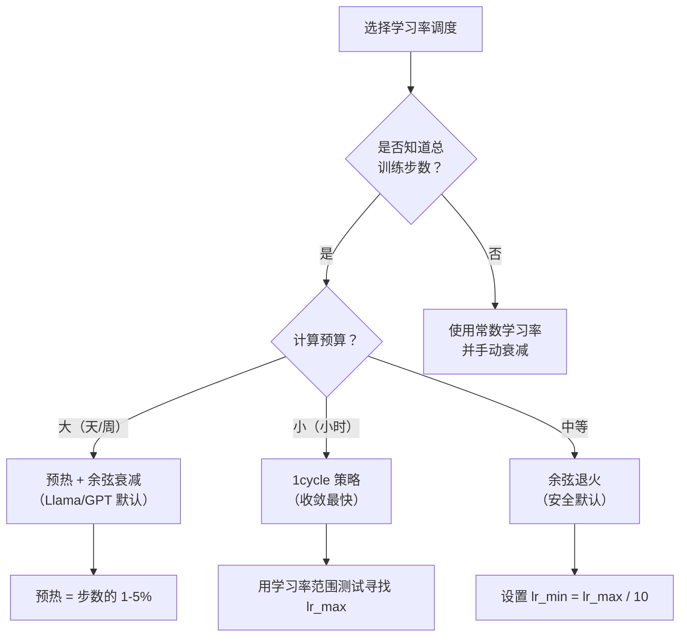
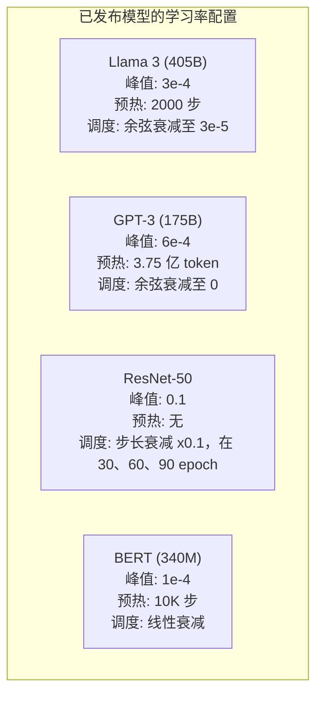

# 学习率调度与预热

> 学习率是最重要的超参数。不是网络架构，不是数据集大小，不是激活函数。是学习率。如果你只调一个参数，就调它。

**类型：** 构建
**语言：** Python
**前置条件：** 第 03.06 课（优化器）、第 03.08 课（权重初始化）
**时间：** 约 90 分钟

## 学习目标

- 从零实现常数调度、步长衰减、余弦退火、预热+余弦以及 1cycle 学习率调度
- 演示学习率选择的三种失败模式：发散（过大）、停滞（过小）和震荡（无衰减）
- 解释为什么基于 Adam 的优化器需要预热（Warmup），以及它如何稳定早期训练
- 在相同任务上比较所有五种调度的收敛速度，并根据给定的训练预算选择合适的调度

## 问题所在

将学习率设为 0.1。训练发散——损失在 3 步内跳到无穷大。设为 0.0001。训练爬行——100 个 epoch 后，模型几乎没有从随机状态移动。设为 0.01。训练在 50 个 epoch 内有效，然后损失在最小值附近震荡，因为步长太大，永远无法到达。

最优学习率并非常数，它在训练中会变化。初期，你希望大步快速覆盖更多空间；训练后期，你希望小步精确落入尖锐极小值。一个 90% 准确率的模型与 95% 准确率的模型之间，往往差的就是调度策略。

过去三年发表的每个主要模型都使用了学习率调度（Learning Rate Schedule）。Llama 3 使用峰值 lr=3e-4，2000 步预热，并余弦衰减至 3e-5。GPT-3 使用 lr=6e-4，在 3.75 亿个 token 上预热。这些都不是随意的选择，而是耗资数百万美元的大量超参数搜索的结果。

你需要理解调度，因为默认值对你的问题可能不适用。微调预训练模型时，正确的调度与从头训练不同。增大批大小时，预热时长需要改变。当训练在第 10,000 步崩溃时，你需要判断这是调度问题还是其他原因。

## 核心概念

### 常数学习率

最简单的方法。选一个数值，每步都使用它。

```
lr(t) = lr_0
```

很少是最优的。对训练结束来说太大（在最小值附近震荡）或对训练开始来说太小（浪费计算在微小步长上）。对于小模型和调试来说还可以，但对训练超过一小时的任何任务来说是糟糕的选择。

### 步长衰减

来自 ResNet 时代的老派方法。在固定 epoch 时将学习率降低一个系数（通常 10 倍）。

```
lr(t) = lr_0 * gamma^(floor(epoch / step_size))
```

gamma = 0.1，step_size = 30 表示：每 30 个 epoch 学习率降低 10 倍。ResNet-50 使用了这种方法——lr=0.1，在 epoch 30、60 和 90 时各降 10 倍。

问题：最优衰减点取决于数据集和架构。换到不同问题时需要重新调整何时降低。过渡很突然——学习率突然变化时损失可能出现峰值。

### 余弦退火

从最大学习率到最小学习率平滑衰减，遵循余弦曲线：

```
lr(t) = lr_min + 0.5 * (lr_max - lr_min) * (1 + cos(pi * t / T))
```

其中 t 是当前步，T 是总步数。

t=0 时，余弦项为 1，lr = lr_max。t=T 时，余弦项为 -1，lr = lr_min。衰减开始时平缓，中间加速，结束时再次平缓。

这是大多数现代训练运行的默认选择，除 lr_max 和 lr_min 外无需调整其他超参数。余弦形状符合经验观察——大多数学习发生在训练中期，你希望在那个关键时期有合理的步长。

### 预热：为什么从小开始

Adam 和其他自适应优化器维护梯度均值和方差的运行估计值。第 0 步时，这些估计值初始化为零。最初几步的梯度更新基于糟糕的统计量。如果在这段时间学习率很大，模型会迈出巨大且方向混乱的步子。

预热（Warmup）解决了这个问题。从极小的学习率开始（通常是 lr_max / warmup_steps 甚至零），在前 N 步内线性提升到 lr_max。到达完整学习率时，Adam 的统计量已经稳定。

```
lr(t) = lr_max * (t / warmup_steps)     for t < warmup_steps
```

典型预热长度：总训练步数的 1-5%。Llama 3 训练了约 1.8 万亿个 token，预热了 2000 步。GPT-3 在 3.75 亿个 token 上进行了预热。

### 线性预热 + 余弦衰减

现代默认组合。线性提升，然后余弦衰减：

```
if t < warmup_steps:
    lr(t) = lr_max * (t / warmup_steps)
else:
    progress = (t - warmup_steps) / (total_steps - warmup_steps)
    lr(t) = lr_min + 0.5 * (lr_max - lr_min) * (1 + cos(pi * progress))
```

这是 Llama、GPT、PaLM 以及大多数现代 Transformer 所使用的方案。预热防止了早期不稳定，余弦衰减使模型稳定落入良好的极小值。

### 1cycle 策略

Leslie Smith（2018）的发现：在训练的前半段将学习率从低值提升到高值，然后在后半段将其降回。这看起来违反直觉——为什么要在训练中途*提高*学习率？

理论依据：高学习率通过向优化轨迹添加噪声来充当正则化。模型在提升阶段探索更多损失曲面，寻找更好的盆地。降低阶段则在找到的最优盆地内进行精化。

```
Phase 1 (0 to T/2):    lr ramps from lr_max/25 to lr_max
Phase 2 (T/2 to T):    lr ramps from lr_max to lr_max/10000
```

1cycle 通常在固定计算预算下比余弦退火训练更快。代价是：必须提前知道总步数。

### 调度形状



### 决策流程图



### 已发布模型的真实数据



## 构建实现

### 第一步：调度函数

每个函数接收当前步数，返回该步的学习率。

```python
import math


def constant_schedule(step, lr=0.01, **kwargs):
    return lr


def step_decay_schedule(step, lr=0.1, step_size=100, gamma=0.1, **kwargs):
    return lr * (gamma ** (step // step_size))


def cosine_schedule(step, lr=0.01, total_steps=1000, lr_min=1e-5, **kwargs):
    if step >= total_steps:
        return lr_min
    return lr_min + 0.5 * (lr - lr_min) * (1 + math.cos(math.pi * step / total_steps))


def warmup_cosine_schedule(step, lr=0.01, total_steps=1000, warmup_steps=100, lr_min=1e-5, **kwargs):
    if total_steps <= warmup_steps:
        return lr * (step / max(warmup_steps, 1))
    if step < warmup_steps:
        return lr * step / warmup_steps
    progress = (step - warmup_steps) / (total_steps - warmup_steps)
    return lr_min + 0.5 * (lr - lr_min) * (1 + math.cos(math.pi * progress))


def one_cycle_schedule(step, lr=0.01, total_steps=1000, **kwargs):
    mid = max(total_steps // 2, 1)
    if step < mid:
        return (lr / 25) + (lr - lr / 25) * step / mid
    else:
        progress = (step - mid) / max(total_steps - mid, 1)
        return lr * (1 - progress) + (lr / 10000) * progress
```

### 第二步：可视化所有调度

打印基于文本的图表，展示每种调度在训练过程中的变化情况。

```python
def visualize_schedule(name, schedule_fn, total_steps=500, **kwargs):
    steps = list(range(0, total_steps, total_steps // 20))
    if total_steps - 1 not in steps:
        steps.append(total_steps - 1)

    lrs = [schedule_fn(s, total_steps=total_steps, **kwargs) for s in steps]
    max_lr = max(lrs) if max(lrs) > 0 else 1.0

    print(f"\n{name}:")
    for s, lr_val in zip(steps, lrs):
        bar_len = int(lr_val / max_lr * 40)
        bar = "#" * bar_len
        print(f"  Step {s:4d}: lr={lr_val:.6f} {bar}")
```

### 第三步：训练网络

与前几课相同的圆形数据集上的简单两层网络，但现在我们改变调度。

```python
import random


def sigmoid(x):
    x = max(-500, min(500, x))
    return 1.0 / (1.0 + math.exp(-x))


def relu(x):
    return max(0.0, x)


def relu_deriv(x):
    return 1.0 if x > 0 else 0.0


def make_circle_data(n=200, seed=42):
    random.seed(seed)
    data = []
    for _ in range(n):
        x = random.uniform(-2, 2)
        y = random.uniform(-2, 2)
        label = 1.0 if x * x + y * y < 1.5 else 0.0
        data.append(([x, y], label))
    return data


def train_with_schedule(schedule_fn, schedule_name, data, epochs=300, base_lr=0.05, **kwargs):
    random.seed(0)
    hidden_size = 8
    total_steps = epochs * len(data)

    std = math.sqrt(2.0 / 2)
    w1 = [[random.gauss(0, std) for _ in range(2)] for _ in range(hidden_size)]
    b1 = [0.0] * hidden_size
    w2 = [random.gauss(0, std) for _ in range(hidden_size)]
    b2 = 0.0

    step = 0
    epoch_losses = []

    for epoch in range(epochs):
        total_loss = 0
        correct = 0

        for x, target in data:
            lr = schedule_fn(step, lr=base_lr, total_steps=total_steps, **kwargs)

            z1 = []
            h = []
            for i in range(hidden_size):
                z = w1[i][0] * x[0] + w1[i][1] * x[1] + b1[i]
                z1.append(z)
                h.append(relu(z))

            z2 = sum(w2[i] * h[i] for i in range(hidden_size)) + b2
            out = sigmoid(z2)

            error = out - target
            d_out = error * out * (1 - out)

            for i in range(hidden_size):
                d_h = d_out * w2[i] * relu_deriv(z1[i])
                w2[i] -= lr * d_out * h[i]
                for j in range(2):
                    w1[i][j] -= lr * d_h * x[j]
                b1[i] -= lr * d_h
            b2 -= lr * d_out

            total_loss += (out - target) ** 2
            if (out >= 0.5) == (target >= 0.5):
                correct += 1
            step += 1

        avg_loss = total_loss / len(data)
        accuracy = correct / len(data) * 100
        epoch_losses.append(avg_loss)

    return epoch_losses
```

### 第四步：对比所有调度

用每种调度训练同一网络，比较最终损失和收敛行为。

```python
def compare_schedules(data):
    configs = [
        ("Constant", constant_schedule, {}),
        ("Step Decay", step_decay_schedule, {"step_size": 15000, "gamma": 0.1}),
        ("Cosine", cosine_schedule, {"lr_min": 1e-5}),
        ("Warmup+Cosine", warmup_cosine_schedule, {"warmup_steps": 3000, "lr_min": 1e-5}),
        ("1cycle", one_cycle_schedule, {}),
    ]

    print(f"\n{'Schedule':<20} {'Start Loss':>12} {'Mid Loss':>12} {'End Loss':>12} {'Best Loss':>12}")
    print("-" * 70)

    for name, schedule_fn, extra_kwargs in configs:
        losses = train_with_schedule(schedule_fn, name, data, epochs=300, base_lr=0.05, **extra_kwargs)
        mid_idx = len(losses) // 2
        best = min(losses)
        print(f"{name:<20} {losses[0]:>12.6f} {losses[mid_idx]:>12.6f} {losses[-1]:>12.6f} {best:>12.6f}")
```

### 第五步：学习率过大与过小

演示三种失败模式：过大（发散）、过小（爬行）和恰当。

```python
def lr_sensitivity(data):
    learning_rates = [1.0, 0.1, 0.01, 0.001, 0.0001]

    print("\nLR Sensitivity (constant schedule, 100 epochs):")
    print(f"  {'LR':>10} {'Start Loss':>12} {'End Loss':>12} {'Status':>15}")
    print("  " + "-" * 52)

    for lr in learning_rates:
        losses = train_with_schedule(constant_schedule, f"lr={lr}", data, epochs=100, base_lr=lr)
        start = losses[0]
        end = losses[-1]

        if end > start or math.isnan(end) or end > 1.0:
            status = "DIVERGED"
        elif end > start * 0.9:
            status = "BARELY MOVED"
        elif end < 0.15:
            status = "CONVERGED"
        else:
            status = "LEARNING"

        end_str = f"{end:.6f}" if not math.isnan(end) else "NaN"
        print(f"  {lr:>10.4f} {start:>12.6f} {end_str:>12} {status:>15}")
```

## 实际使用

PyTorch 在 `torch.optim.lr_scheduler` 中提供了调度器：

```python
import torch
import torch.optim as optim
from torch.optim.lr_scheduler import CosineAnnealingLR, OneCycleLR, StepLR

model = nn.Sequential(nn.Linear(10, 64), nn.ReLU(), nn.Linear(64, 1))
optimizer = optim.Adam(model.parameters(), lr=3e-4)

scheduler = CosineAnnealingLR(optimizer, T_max=1000, eta_min=1e-5)

for step in range(1000):
    loss = train_step(model, optimizer)
    scheduler.step()
```

对于预热 + 余弦，使用 lambda 调度器或 HuggingFace 提供的 `get_cosine_schedule_with_warmup`：

```python
from transformers import get_cosine_schedule_with_warmup

scheduler = get_cosine_schedule_with_warmup(
    optimizer,
    num_warmup_steps=2000,
    num_training_steps=100000,
)
```

HuggingFace 的函数是大多数 Llama 和 GPT 微调脚本所使用的。如有疑问，使用预热 + 余弦，预热步数为总步数的 3-5%。这对几乎所有场景都有效。

## 交付成果

本课产出：
- `outputs/prompt-lr-schedule-advisor.md` -- 一个根据你的训练配置推荐正确学习率调度和超参数的提示词

## 练习

1. 实现指数衰减：lr(t) = lr_0 * gamma^t，其中 gamma = 0.999。与圆形数据集上的余弦退火进行比较。

2. 实现学习率范围测试（Leslie Smith）：在几百步内训练，同时将学习率从 1e-7 指数级增加到 1。绘制损失 vs 学习率的图。最优最大学习率就在损失开始上升之前。

3. 使用预热 + 余弦训练，但改变预热长度：总步数的 0%、1%、5%、10%、20%。找到训练最稳定的最佳点。

4. 实现带热重启的余弦退火（SGDR）：每隔 T 步将学习率重置为 lr_max 并再次衰减。与较长训练运行中的标准余弦进行比较。

5. 构建一个"调度医生"，监控训练损失，在损失稳定时自动从预热切换到余弦，并在损失停滞过长时降低学习率。

## 关键术语

| 术语 | 常见说法 | 实际含义 |
|------|---------|---------|
| 学习率（Learning Rate） | "模型学习的速度" | 乘以梯度以确定参数更新幅度的标量 |
| 调度（Schedule） | "随时间改变学习率" | 将训练步数映射到学习率的函数，旨在优化收敛 |
| 预热（Warmup） | "从小学习率开始" | 在前 N 步内将学习率从接近零线性提升到目标值，以稳定优化器统计量 |
| 余弦退火（Cosine Annealing） | "平滑学习率衰减" | 在训练中按余弦曲线将学习率从 lr_max 降至 lr_min |
| 步长衰减（Step Decay） | "在里程碑处降低学习率" | 在固定 epoch 间隔时将学习率乘以一个系数（通常为 0.1） |
| 1cycle 策略（1cycle Policy） | "先升后降" | Leslie Smith 的方法，在单个周期内先提升再降低学习率，加快收敛 |
| 学习率范围测试（LR Range Test） | "寻找最佳学习率" | 在短期训练中逐渐增大学习率，找到损失开始发散时的值 |
| 带热重启的余弦退火（Cosine with Warm Restarts） | "重置并重复" | 周期性地将学习率重置为 lr_max 并再次衰减（SGDR） |
| 最小学习率（Eta Min） | "学习率的下限" | 调度衰减到的最小学习率 |
| 峰值学习率（Peak Learning Rate） | "最大学习率" | 训练中达到的最高学习率，通常在预热后 |

## 延伸阅读

- Loshchilov & Hutter, "SGDR: Stochastic Gradient Descent with Warm Restarts" (2017) -- 引入余弦退火和热重启
- Smith, "Super-Convergence: Very Fast Training of Neural Networks Using Large Learning Rates" (2018) -- 1cycle 策略论文
- Touvron et al., "Llama 2: Open Foundation and Fine-Tuned Chat Models" (2023) -- 记录了大规模使用的预热 + 余弦调度
- Goyal et al., "Accurate, Large Minibatch SGD: Training ImageNet in 1 Hour" (2017) -- 大批量训练的线性缩放规则和预热
