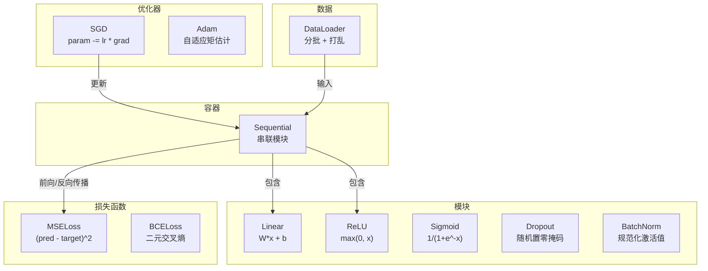
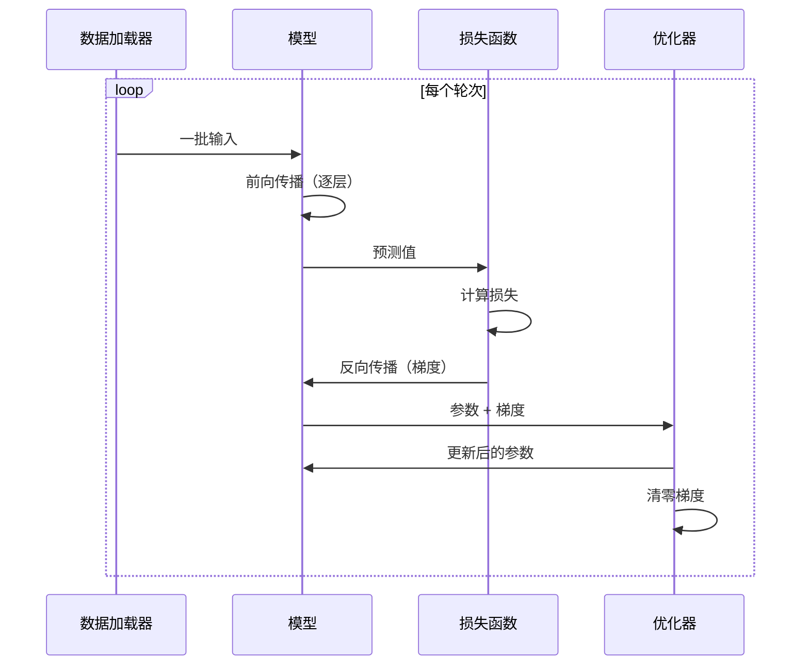
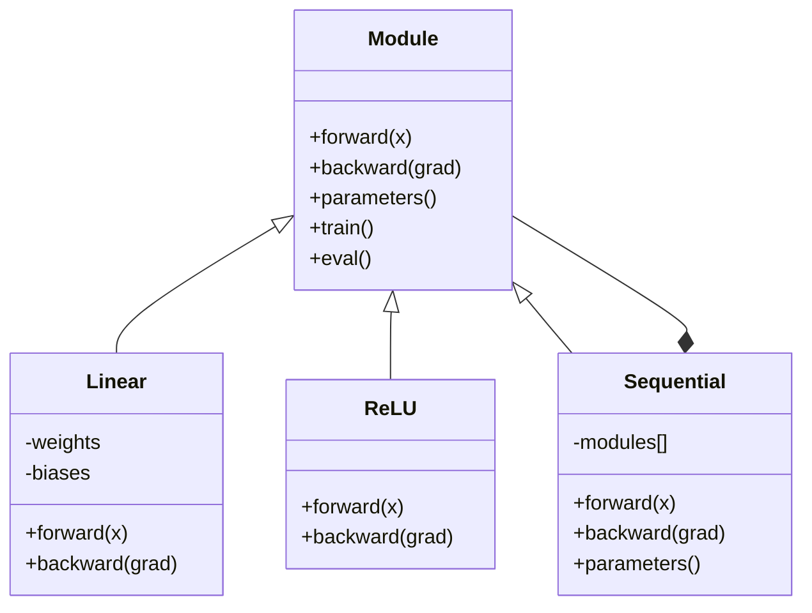

# 构建你自己的迷你框架

> 你已经构建了神经元、层、网络、反向传播、激活函数、损失函数、优化器、正则化、初始化和学习率调度——都是分散的独立模块。现在，将它们串联成一个框架。不是 PyTorch，不是 TensorFlow，而是你自己的框架。

**类型：** 构建
**语言：** Python
**前置知识：** 第03阶段全部内容（第01-09课）
**时长：** 约120分钟

## 学习目标

- 构建一个完整的深度学习框架（约500行），包含 Module、Linear、ReLU、Sigmoid、Dropout、BatchNorm、Sequential、损失函数、优化器和 DataLoader
- 解释模块（Module）抽象的含义——包括 forward、backward、parameters——以及为何需要切换训练/评估模式
- 将所有组件串联为完整的训练循环，在圆形分类任务上训练一个4层网络
- 将你框架中的每个组件映射到对应的 PyTorch 等价物（nn.Module、nn.Sequential、optim.Adam、DataLoader）

## 问题背景

你已经积累了十课的构建模块，散落在各个独立文件中：这里有一个 `Value` 类，那里有一个训练循环，另一个文件里有权重初始化，还有一个文件里有学习率调度。每次训练一个网络，你都要从五个不同的课程中复制粘贴，再手动将它们拼接在一起。

这正是框架所要解决的问题。PyTorch 提供了 `nn.Module`、`nn.Sequential`、`optim.Adam`、`DataLoader` 以及一套将它们整合起来的训练循环模式。TensorFlow 提供了 `keras.Layer`、`keras.Sequential`、`keras.optimizers.Adam`。这些并不神奇，它们只是组织模式，让你无需每次都重新搭建管道就能定义、训练和评估网络。

你将用约500行纯 Python 构建同样的东西，不使用 numpy，不依赖任何外部库。这个框架能够定义任意前馈网络，用 SGD 或 Adam 训练，分批处理数据，应用 Dropout 和批归一化（batch normalization），使用任意激活函数，并支持学习率调度。

完成之后，你将彻底理解在 PyTorch 中写下 `model = nn.Sequential(...)` 时究竟发生了什么。你会明白为什么 `model.train()` 和 `model.eval()` 是独立存在的。你会明白为什么 `optimizer.zero_grad()` 是单独的一步调用。你会理解这一切——因为这都是你自己构建的。

## 核心概念

### 模块（Module）抽象

PyTorch 中每一层都继承自 `nn.Module`。一个模块（Module）承担三项职责：

1. **forward()** — 根据输入计算输出
2. **parameters()** — 返回所有可训练权重
3. **backward()** — 计算梯度（在 PyTorch 中由自动微分（autograd）处理，在我们的框架中需要显式实现）

线性层是模块，ReLU 激活是模块，Dropout 层是模块，批归一化（batch normalization）层是模块。它们都遵循相同的接口。

### 顺序容器（Sequential Container）

`nn.Sequential` 将多个模块串联起来。前向传播（forward pass）：将数据依次送入模块1、模块2、模块3。反向传播（backward pass）：逆序遍历。容器本身也是一个模块——它拥有 forward()、parameters() 和 backward()。这是组合模式：一系列模块的序列本身也是一个模块。

### 训练模式与评估模式

Dropout 在训练时随机置零神经元，在评估时全量通过。批归一化在训练时使用批统计量，在评估时使用滑动平均。`train()` 和 `eval()` 方法用于切换这些行为，每个模块都持有一个 `training` 标志位。

### 优化器（Optimizer）

优化器利用梯度更新参数。SGD：`param -= lr * grad`；Adam：维护动量和方差估计，然后更新。优化器不需要了解网络结构——它只看到一个扁平的参数列表及其对应的梯度。

### 数据加载器（DataLoader）

分批处理出于两方面考虑。其一，对于大规模问题，整个数据集无法全部加载到内存中；其二，小批量梯度下降（mini-batch gradient descent）引入的噪声有助于逃离局部极小值。DataLoader 将数据划分为批次，并在每个轮次（epoch）之间可选地进行打乱。

### 框架架构



### 训练循环



### 模块层次结构



## 动手构建

### 第一步：模块基类

每一层都要实现的抽象接口。

```python
class Module:
    def __init__(self):
        self.training = True

    def forward(self, x):
        raise NotImplementedError

    def backward(self, grad):
        raise NotImplementedError

    def parameters(self):
        return []

    def train(self):
        self.training = True

    def eval(self):
        self.training = False
```

### 第二步：线性层（Linear Layer）

最基础的构建模块。存储权重和偏置，前向传播计算 Wx + b，反向传播计算权重梯度和输入梯度。

```python
import math
import random


class Linear(Module):
    def __init__(self, fan_in, fan_out):
        super().__init__()
        std = math.sqrt(2.0 / fan_in)
        self.weights = [[random.gauss(0, std) for _ in range(fan_in)] for _ in range(fan_out)]
        self.biases = [0.0] * fan_out
        self.weight_grads = [[0.0] * fan_in for _ in range(fan_out)]
        self.bias_grads = [0.0] * fan_out
        self.fan_in = fan_in
        self.fan_out = fan_out
        self.input = None

    def forward(self, x):
        self.input = x
        output = []
        for i in range(self.fan_out):
            val = self.biases[i]
            for j in range(self.fan_in):
                val += self.weights[i][j] * x[j]
            output.append(val)
        return output

    def backward(self, grad):
        input_grad = [0.0] * self.fan_in
        for i in range(self.fan_out):
            self.bias_grads[i] += grad[i]
            for j in range(self.fan_in):
                self.weight_grads[i][j] += grad[i] * self.input[j]
                input_grad[j] += grad[i] * self.weights[i][j]
        return input_grad

    def parameters(self):
        params = []
        for i in range(self.fan_out):
            for j in range(self.fan_in):
                params.append((self.weights, i, j, self.weight_grads))
            params.append((self.biases, i, None, self.bias_grads))
        return params
```

### 第三步：激活函数模块

将 ReLU、Sigmoid 和 Tanh 封装为模块，每个都缓存反向传播所需的中间值。

```python
class ReLU(Module):
    def __init__(self):
        super().__init__()
        self.mask = None

    def forward(self, x):
        self.mask = [1.0 if v > 0 else 0.0 for v in x]
        return [max(0.0, v) for v in x]

    def backward(self, grad):
        return [g * m for g, m in zip(grad, self.mask)]


class Sigmoid(Module):
    def __init__(self):
        super().__init__()
        self.output = None

    def forward(self, x):
        self.output = []
        for v in x:
            v = max(-500, min(500, v))
            self.output.append(1.0 / (1.0 + math.exp(-v)))
        return self.output

    def backward(self, grad):
        return [g * o * (1 - o) for g, o in zip(grad, self.output)]


class Tanh(Module):
    def __init__(self):
        super().__init__()
        self.output = None

    def forward(self, x):
        self.output = [math.tanh(v) for v in x]
        return self.output

    def backward(self, grad):
        return [g * (1 - o * o) for g, o in zip(grad, self.output)]
```

### 第四步：Dropout 模块

训练时随机将元素置零，并将剩余元素按 1/(1-p) 缩放以保持期望值不变。评估时直接透传。

```python
class Dropout(Module):
    def __init__(self, p=0.5):
        super().__init__()
        self.p = p
        self.mask = None

    def forward(self, x):
        if not self.training:
            return x
        self.mask = [0.0 if random.random() < self.p else 1.0 / (1 - self.p) for _ in x]
        return [v * m for v, m in zip(x, self.mask)]

    def backward(self, grad):
        if self.mask is None:
            return grad
        return [g * m for g, m in zip(grad, self.mask)]
```

### 第五步：BatchNorm 模块

在批次内按特征对激活值进行归一化，使其具有零均值和单位方差。维护用于评估模式的滑动统计量。

```python
class BatchNorm(Module):
    def __init__(self, size, momentum=0.1, eps=1e-5):
        super().__init__()
        self.size = size
        self.gamma = [1.0] * size
        self.beta = [0.0] * size
        self.gamma_grads = [0.0] * size
        self.beta_grads = [0.0] * size
        self.running_mean = [0.0] * size
        self.running_var = [1.0] * size
        self.momentum = momentum
        self.eps = eps
        self.x_norm = None
        self.std_inv = None
        self.batch_input = None

    def forward_batch(self, batch):
        batch_size = len(batch)
        output_batch = []

        if self.training:
            mean = [0.0] * self.size
            for sample in batch:
                for j in range(self.size):
                    mean[j] += sample[j]
            mean = [m / batch_size for m in mean]

            var = [0.0] * self.size
            for sample in batch:
                for j in range(self.size):
                    var[j] += (sample[j] - mean[j]) ** 2
            var = [v / batch_size for v in var]

            self.std_inv = [1.0 / math.sqrt(v + self.eps) for v in var]

            self.x_norm = []
            self.batch_input = batch
            for sample in batch:
                normed = [(sample[j] - mean[j]) * self.std_inv[j] for j in range(self.size)]
                self.x_norm.append(normed)
                output = [self.gamma[j] * normed[j] + self.beta[j] for j in range(self.size)]
                output_batch.append(output)

            for j in range(self.size):
                self.running_mean[j] = (1 - self.momentum) * self.running_mean[j] + self.momentum * mean[j]
                self.running_var[j] = (1 - self.momentum) * self.running_var[j] + self.momentum * var[j]
        else:
            std_inv = [1.0 / math.sqrt(v + self.eps) for v in self.running_var]
            for sample in batch:
                normed = [(sample[j] - self.running_mean[j]) * std_inv[j] for j in range(self.size)]
                output = [self.gamma[j] * normed[j] + self.beta[j] for j in range(self.size)]
                output_batch.append(output)

        return output_batch

    def forward(self, x):
        result = self.forward_batch([x])
        return result[0]

    def backward(self, grad):
        if self.x_norm is None:
            return grad
        for j in range(self.size):
            self.gamma_grads[j] += self.x_norm[0][j] * grad[j]
            self.beta_grads[j] += grad[j]
        return [grad[j] * self.gamma[j] * self.std_inv[j] for j in range(self.size)]

    def parameters(self):
        params = []
        for j in range(self.size):
            params.append((self.gamma, j, None, self.gamma_grads))
            params.append((self.beta, j, None, self.beta_grads))
        return params
```

### 第六步：Sequential 容器

串联各模块。前向传播从左到右，反向传播从右到左。

```python
class Sequential(Module):
    def __init__(self, *modules):
        super().__init__()
        self.modules = list(modules)

    def forward(self, x):
        for module in self.modules:
            x = module.forward(x)
        return x

    def backward(self, grad):
        for module in reversed(self.modules):
            grad = module.backward(grad)
        return grad

    def parameters(self):
        params = []
        for module in self.modules:
            params.extend(module.parameters())
        return params

    def train(self):
        self.training = True
        for module in self.modules:
            module.train()

    def eval(self):
        self.training = False
        for module in self.modules:
            module.eval()
```

### 第七步：损失函数

MSE 与二元交叉熵（Binary Cross-Entropy，BCE）。每个函数返回损失值，并提供 backward() 方法返回梯度。

```python
class MSELoss:
    def __call__(self, predicted, target):
        self.predicted = predicted
        self.target = target
        n = len(predicted)
        self.loss = sum((p - t) ** 2 for p, t in zip(predicted, target)) / n
        return self.loss

    def backward(self):
        n = len(self.predicted)
        return [2 * (p - t) / n for p, t in zip(self.predicted, self.target)]


class BCELoss:
    def __call__(self, predicted, target):
        self.predicted = predicted
        self.target = target
        eps = 1e-7
        n = len(predicted)
        self.loss = 0
        for p, t in zip(predicted, target):
            p = max(eps, min(1 - eps, p))
            self.loss += -(t * math.log(p) + (1 - t) * math.log(1 - p))
        self.loss /= n
        return self.loss

    def backward(self):
        eps = 1e-7
        n = len(self.predicted)
        grads = []
        for p, t in zip(self.predicted, self.target):
            p = max(eps, min(1 - eps, p))
            grads.append((-t / p + (1 - t) / (1 - p)) / n)
        return grads
```

### 第八步：SGD 与 Adam 优化器

两者均接受参数列表，并利用梯度更新权重。

```python
class SGD:
    def __init__(self, parameters, lr=0.01):
        self.params = parameters
        self.lr = lr

    def step(self):
        for container, i, j, grad_container in self.params:
            if j is not None:
                container[i][j] -= self.lr * grad_container[i][j]
            else:
                container[i] -= self.lr * grad_container[i]

    def zero_grad(self):
        for container, i, j, grad_container in self.params:
            if j is not None:
                grad_container[i][j] = 0.0
            else:
                grad_container[i] = 0.0


class Adam:
    def __init__(self, parameters, lr=0.001, beta1=0.9, beta2=0.999, eps=1e-8):
        self.params = parameters
        self.lr = lr
        self.beta1 = beta1
        self.beta2 = beta2
        self.eps = eps
        self.t = 0
        self.m = [0.0] * len(parameters)
        self.v = [0.0] * len(parameters)

    def step(self):
        self.t += 1
        for idx, (container, i, j, grad_container) in enumerate(self.params):
            if j is not None:
                g = grad_container[i][j]
            else:
                g = grad_container[i]

            self.m[idx] = self.beta1 * self.m[idx] + (1 - self.beta1) * g
            self.v[idx] = self.beta2 * self.v[idx] + (1 - self.beta2) * g * g

            m_hat = self.m[idx] / (1 - self.beta1 ** self.t)
            v_hat = self.v[idx] / (1 - self.beta2 ** self.t)

            update = self.lr * m_hat / (math.sqrt(v_hat) + self.eps)

            if j is not None:
                container[i][j] -= update
            else:
                container[i] -= update

    def zero_grad(self):
        for container, i, j, grad_container in self.params:
            if j is not None:
                grad_container[i][j] = 0.0
            else:
                grad_container[i] = 0.0
```

### 第九步：数据加载器（DataLoader）

将数据划分为批次，每个轮次可选地进行打乱。

```python
class DataLoader:
    def __init__(self, data, batch_size=32, shuffle=True):
        self.data = data
        self.batch_size = batch_size
        self.shuffle = shuffle

    def __iter__(self):
        indices = list(range(len(self.data)))
        if self.shuffle:
            random.shuffle(indices)
        for start in range(0, len(indices), self.batch_size):
            batch_indices = indices[start:start + self.batch_size]
            batch = [self.data[i] for i in batch_indices]
            inputs = [item[0] for item in batch]
            targets = [item[1] for item in batch]
            yield inputs, targets

    def __len__(self):
        return (len(self.data) + self.batch_size - 1) // self.batch_size
```

### 第十步：在圆形分类任务上训练4层网络

将所有组件串联起来：定义模型，选择损失函数，选择优化器，运行训练循环。

```python
def make_circle_data(n=500, seed=42):
    random.seed(seed)
    data = []
    for _ in range(n):
        x = random.uniform(-2, 2)
        y = random.uniform(-2, 2)
        label = 1.0 if x * x + y * y < 1.5 else 0.0
        data.append(([x, y], [label]))
    return data


def train():
    random.seed(42)

    model = Sequential(
        Linear(2, 16),
        ReLU(),
        Linear(16, 16),
        ReLU(),
        Linear(16, 8),
        ReLU(),
        Linear(8, 1),
        Sigmoid(),
    )

    criterion = BCELoss()
    optimizer = Adam(model.parameters(), lr=0.01)

    data = make_circle_data(500)
    split = int(len(data) * 0.8)
    train_data = data[:split]
    test_data = data[split:]

    loader = DataLoader(train_data, batch_size=16, shuffle=True)

    model.train()

    for epoch in range(100):
        total_loss = 0
        total_correct = 0
        total_samples = 0

        for batch_inputs, batch_targets in loader:
            batch_loss = 0
            for x, t in zip(batch_inputs, batch_targets):
                pred = model.forward(x)
                loss = criterion(pred, t)
                batch_loss += loss

                optimizer.zero_grad()
                grad = criterion.backward()
                model.backward(grad)
                optimizer.step()

                predicted_class = 1.0 if pred[0] >= 0.5 else 0.0
                if predicted_class == t[0]:
                    total_correct += 1
                total_samples += 1

            total_loss += batch_loss

        avg_loss = total_loss / total_samples
        accuracy = total_correct / total_samples * 100

        if epoch % 10 == 0 or epoch == 99:
            print(f"Epoch {epoch:3d} | Loss: {avg_loss:.6f} | Train Accuracy: {accuracy:.1f}%")

    model.eval()
    correct = 0
    for x, t in test_data:
        pred = model.forward(x)
        predicted_class = 1.0 if pred[0] >= 0.5 else 0.0
        if predicted_class == t[0]:
            correct += 1
    test_accuracy = correct / len(test_data) * 100
    print(f"\nTest Accuracy: {test_accuracy:.1f}% ({correct}/{len(test_data)})")

    return model, test_accuracy
```

## 使用示例

以下是你刚刚构建内容的 PyTorch 等价实现：

```python
import torch
import torch.nn as nn
from torch.utils.data import DataLoader, TensorDataset

model = nn.Sequential(
    nn.Linear(2, 16),
    nn.ReLU(),
    nn.Linear(16, 16),
    nn.ReLU(),
    nn.Linear(16, 8),
    nn.ReLU(),
    nn.Linear(8, 1),
    nn.Sigmoid(),
)

criterion = nn.BCELoss()
optimizer = torch.optim.Adam(model.parameters(), lr=0.01)

for epoch in range(100):
    model.train()
    for inputs, targets in dataloader:
        optimizer.zero_grad()
        predictions = model(inputs)
        loss = criterion(predictions, targets)
        loss.backward()
        optimizer.step()

    model.eval()
    with torch.no_grad():
        test_predictions = model(test_inputs)
```

结构完全一致：`Sequential`、`Linear`、`ReLU`、`Sigmoid`、`BCELoss`、`Adam`、`zero_grad`、`backward`、`step`、`train`、`eval`——每一个概念都能一一对应。区别在于 PyTorch 自动处理自动微分（无需在每个模块中实现 backward()），支持 GPU，并经历了多年的工程优化。但骨架是相同的。

现在当你看到 PyTorch 代码时，你清楚地知道每一行背后发生了什么。这种理解正是本课的核心目的。

## 输出产物

本课产出：
- `outputs/prompt-framework-architect.md` — 用于设计神经网络架构的提示词，基于框架抽象

## 练习

1. 添加一个用于多分类的 `SoftmaxCrossEntropyLoss` 类。对预测值做 Softmax，计算交叉熵损失，并处理合并后的反向传播。在3类螺旋数据集上测试。

2. 在优化器中实现学习率调度：添加一个 `set_lr()` 方法，并接入第09课中的余弦调度。在圆形分类器上使用预热（warmup）+ 余弦调度训练，与恒定学习率对比。

3. 为 Sequential 添加 `save()` 和 `load()` 方法，将所有权重序列化到 JSON 文件并能加载回来。验证加载后的模型与原始模型产生相同的预测结果。

4. 在 Adam 优化器中实现权重衰减（weight decay，L2 正则化）。添加一个 `weight_decay` 参数，在每步更新时将权重向零收缩。比较 decay=0 与 decay=0.01 的训练效果。

5. 将逐样本训练循环替换为正确的小批量梯度累积：在批次内所有样本上累积梯度，再除以批次大小，然后执行一次优化器步进。测量这是否改变了收敛速度。

## 关键术语

| 术语 | 通常的说法 | 实际含义 |
|------|-----------|---------|
| 模块（Module） | "一层" | 框架中的基础抽象——任何具有 forward()、backward() 和 parameters() 的对象 |
| 顺序容器（Sequential） | "按顺序堆叠层" | 一种串联模块的容器，前向传播顺序应用，反向传播逆序进行 |
| 前向传播（Forward pass） | "运行网络" | 通过依次经过每个模块来计算输出 |
| 反向传播（Backward pass） | "计算梯度" | 将损失梯度逆向传播经过每个模块，以计算参数梯度 |
| 参数（Parameters） | "可训练权重" | 网络中优化器可以更新的所有值——权重和偏置 |
| 优化器（Optimizer） | "更新权重的东西" | 使用梯度更新参数的算法，实现 SGD、Adam 或其他规则 |
| 数据加载器（DataLoader） | "喂数据的东西" | 将数据集划分为批次的迭代器，可在每个轮次之间进行打乱 |
| 训练模式（Training mode） | "model.train()" | 启用随机行为（如 Dropout 和使用批统计量的批归一化）的标志位 |
| 评估模式（Evaluation mode） | "model.eval()" | 禁用 Dropout 并使用批归一化滑动统计量的标志位 |
| 清零梯度（Zero grad） | "清除梯度" | 在计算下一批次的梯度之前，将所有参数梯度重置为零 |

## 延伸阅读

- Paszke 等，"PyTorch: An Imperative Style, High-Performance Deep Learning Library"（2019）——描述 PyTorch 设计决策的论文
- Chollet，"Deep Learning with Python, Second Edition"（2021）——第3章介绍了 Keras 内部机制，使用相同的模块/层抽象
- Johnson，"Tiny-DNN" (https://github.com/tiny-dnn/tiny-dnn) —— 一个纯头文件 C++ 深度学习框架，用于理解框架内部机制
