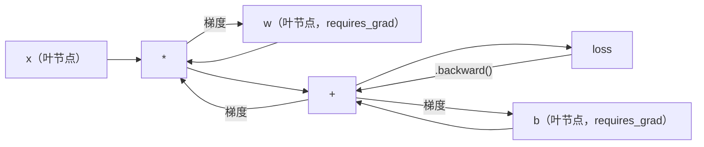
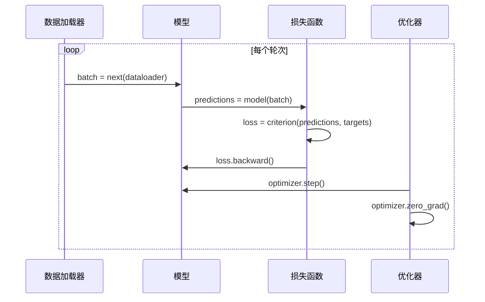

# PyTorch 入门

> 你已经从活塞和曲轴开始构建了引擎。现在，来学习所有人真正在驾驶的那辆车。

**类型：** 构建
**语言：** Python
**前置知识：** 第03.10课（构建你自己的迷你框架）
**时长：** 约75分钟

## 学习目标

- 使用 PyTorch 的 nn.Module、nn.Sequential 和自动微分（autograd）构建并训练神经网络
- 使用 PyTorch 张量（tensor）、GPU 加速以及标准训练循环（zero_grad、forward、loss、backward、step）
- 将你从零构建的迷你框架组件转换为对应的 PyTorch 等价实现
- 对同一任务，分析并比较你的纯 Python 框架与 PyTorch 的训练速度

## 问题背景

你已经有了一个可用的迷你框架：线性层、ReLU、Dropout、批归一化、Adam、DataLoader、训练循环。它能在圆形分类问题上用纯 Python 训练一个4层网络。

但它比 PyTorch 慢了大约500倍。

你的迷你框架用嵌套的 Python 循环逐个样本处理数据，而 PyTorch 将相同的操作分派到运行在 GPU 上的优化 C++/CUDA 内核。在一块 NVIDIA A100 上，PyTorch 在 ImageNet（128万张图片）上训练 ResNet-50（2560万参数）大约需要6小时。你的框架在相同任务上大概需要3000小时——前提是内存没有先耗尽。

速度差距并不是唯一的问题。你的框架不支持 GPU，没有自动微分——你为每个模块手写了 backward()，没有序列化，没有分布式训练，没有混合精度，也没有不靠打印语句就能调试梯度流的方法。

PyTorch 填补了上述每一个空缺，而且保留了你已经构建好的完全相同的思维模型：Module、forward()、parameters()、backward()、optimizer.step()。概念一一对应，语法几乎相同。区别在于 PyTorch 将十年的系统工程成果封装在了你从零设计的同一个接口背后。

## 核心概念

### 为什么 PyTorch 赢了

2015年，TensorFlow 要求你在运行任何内容之前先定义一个静态计算图。你构建图，编译它，然后向其中馈送数据。调试意味着盯着图的可视化结果看。更改架构意味着从头重建整个图。

PyTorch 在2017年以截然不同的理念问世：即时执行（eager execution）。你写 Python，它立即运行。`y = model(x)` 会马上计算出 y，而不是"往图里加一个节点，等之后再计算 y"。这意味着标准的 Python 调试工具都可以用，print() 可以用，pdb 可以用，forward 函数里的 if/else 也可以用。

到2020年，市场已经给出了答案。PyTorch 在 ML 研究论文中的占比从7%（2017年）上升至75%以上（2022年）。Meta、Google DeepMind、OpenAI、Anthropic 和 Hugging Face 都将 PyTorch 作为主要框架。TensorFlow 2.x 随即采用了即时执行——这无异于默认承认 PyTorch 的设计是正确的。

这个教训是：开发体验会复利积累。一个慢10%但调试快50%的框架，每次都会赢。

### 张量（Tensor）

张量（tensor）是一个多维数组，具有三个关键属性：形状（shape）、数据类型（dtype）和设备（device）。

```python
import torch

x = torch.zeros(3, 4)           # shape: (3, 4), dtype: float32, device: cpu
x = torch.randn(2, 3, 224, 224) # batch of 2 RGB images, 224x224
x = torch.tensor([1, 2, 3])     # from a Python list
```

**形状（Shape）** 表示维度。标量的形状为 ()，向量为 (n,)，矩阵为 (m, n)，一批图像为 (batch, channels, height, width)。

**数据类型（Dtype）** 控制精度和内存占用。

| 数据类型 | 位数 | 范围 | 使用场景 |
|---------|------|------|---------|
| float32 | 32 | ~7位有效数字 | 默认训练 |
| float16 | 16 | ~3.3位有效数字 | 混合精度 |
| bfloat16 | 16 | 与 float32 相同的范围，精度较低 | LLM 训练 |
| int8 | 8 | -128 到 127 | 量化推理 |

**设备（Device）** 决定计算在哪里执行。

```python
device = torch.device("cuda" if torch.cuda.is_available() else "cpu")
x = torch.randn(3, 4, device=device)
x = x.to("cuda")
x = x.cpu()
```

每个操作要求所有张量位于同一设备上。这是初学者最常遇到的 PyTorch 报错：`RuntimeError: Expected all tensors to be on the same device`。解决方法是在计算前将所有张量移到同一设备。

**形状变换（Reshaping）** 是常数时间操作——它只改变元数据，不改变数据本身。

```python
x = torch.randn(2, 3, 4)
x.view(2, 12)      # reshape to (2, 12) -- must be contiguous
x.reshape(6, 4)    # reshape to (6, 4) -- works always
x.permute(2, 0, 1) # reorder dimensions
x.unsqueeze(0)     # add dimension: (1, 2, 3, 4)
x.squeeze()        # remove size-1 dimensions
```

### 自动微分（Autograd）

你的迷你框架需要为每个模块手动实现 backward()。PyTorch 不需要。它在前向传播过程中将每个操作记录到一个有向无环图（computational graph，计算图）中，然后反向遍历该图来自动计算梯度。



与你的框架的关键区别：PyTorch 使用基于"磁带"（tape）的自动微分。每个操作在前向传播期间都会追加到"磁带"上。调用 `.backward()` 会以逆序重放磁带。

```python
x = torch.randn(3, requires_grad=True)
y = x ** 2 + 3 * x
z = y.sum()
z.backward()
print(x.grad)  # dz/dx = 2x + 3
```

自动微分的三条规则：

1. 只有 `requires_grad=True` 的叶节点张量才会累积梯度
2. 梯度默认会累积——在每次反向传播之前调用 `optimizer.zero_grad()`
3. `torch.no_grad()` 禁用梯度追踪（在评估时使用）

### nn.Module

`nn.Module` 是 PyTorch 中每个神经网络组件的基类。你已经在第10课中构建了这个抽象。PyTorch 的版本额外增加了自动参数注册、递归模块发现、设备管理和状态字典（state dict）序列化。

```python
import torch.nn as nn

class MLP(nn.Module):
    def __init__(self, input_dim, hidden_dim, output_dim):
        super().__init__()
        self.layer1 = nn.Linear(input_dim, hidden_dim)
        self.relu = nn.ReLU()
        self.layer2 = nn.Linear(hidden_dim, output_dim)

    def forward(self, x):
        x = self.layer1(x)
        x = self.relu(x)
        x = self.layer2(x)
        return x
```

当你在 `__init__` 中将 `nn.Module` 或 `nn.Parameter` 赋值为属性时，PyTorch 会自动注册它。`model.parameters()` 会递归收集每个已注册的参数。这就是为什么你不再需要像在迷你框架中那样手动收集权重。

核心构建模块：

| 模块 | 功能 | 参数数量 |
|------|------|---------|
| nn.Linear(in, out) | Wx + b | in*out + out |
| nn.Conv2d(in_ch, out_ch, k) | 二维卷积 | in_ch*out_ch*k*k + out_ch |
| nn.BatchNorm1d(features) | 规范化激活值 | 2 * features |
| nn.Dropout(p) | 随机置零 | 0 |
| nn.ReLU() | max(0, x) | 0 |
| nn.GELU() | 高斯误差线性单元 | 0 |
| nn.Embedding(vocab, dim) | 查找表 | vocab * dim |
| nn.LayerNorm(dim) | 逐样本归一化 | 2 * dim |

### 损失函数与优化器

PyTorch 内置了你构建过的所有内容的生产就绪版本。

**损失函数**（来自 `torch.nn`）：

| 损失函数 | 任务 | 输入 |
|---------|------|------|
| nn.MSELoss() | 回归 | 任意形状 |
| nn.CrossEntropyLoss() | 多分类 | logits（非 softmax 输出） |
| nn.BCEWithLogitsLoss() | 二分类 | logits（非 sigmoid 输出） |
| nn.L1Loss() | 回归（鲁棒） | 任意形状 |
| nn.CTCLoss() | 序列对齐 | 对数概率 |

注意：`CrossEntropyLoss` 内部将 `LogSoftmax` 和 `NLLLoss` 合并在一起。请传入原始 logits，不要传 softmax 输出。这是一个常见错误，会在不报错的情况下产生错误的梯度。

**优化器**（来自 `torch.optim`）：

| 优化器 | 适用场景 | 典型学习率 |
|--------|---------|-----------|
| SGD(params, lr, momentum) | CNN、经过充分调优的流水线 | 0.01--0.1 |
| Adam(params, lr) | 默认起点 | 1e-3 |
| AdamW(params, lr, weight_decay) | Transformer、微调 | 1e-4--1e-3 |
| LBFGS(params) | 小规模、二阶方法 | 1.0 |

### 训练循环

每个 PyTorch 训练循环都遵循相同的5步模式。你在第10课中已经熟悉了这一点。



标准模式：

```python
for epoch in range(num_epochs):
    model.train()
    for inputs, targets in train_loader:
        inputs, targets = inputs.to(device), targets.to(device)
        optimizer.zero_grad()
        outputs = model(inputs)
        loss = criterion(outputs, targets)
        loss.backward()
        optimizer.step()
```

批次循环内的五行代码，训练了 GPT-4、Stable Diffusion 和 LLaMA。架构会变，数据会变，这五行不变。

### Dataset 与 DataLoader

PyTorch 的 `Dataset` 是一个抽象类，拥有两个方法：`__len__` 和 `__getitem__`。`DataLoader` 在其基础上添加了批处理、打乱和多进程数据加载。

```python
from torch.utils.data import Dataset, DataLoader

class MNISTDataset(Dataset):
    def __init__(self, images, labels):
        self.images = images
        self.labels = labels

    def __len__(self):
        return len(self.labels)

    def __getitem__(self, idx):
        return self.images[idx], self.labels[idx]

loader = DataLoader(dataset, batch_size=64, shuffle=True, num_workers=4)
```

`num_workers=4` 会启动4个进程，在 GPU 训练当前批次的同时并行加载数据。在磁盘受限的工作负载（大图像、音频）中，仅此一项就能使训练速度翻倍。

### GPU 训练

将模型移至 GPU：

```python
device = torch.device("cuda" if torch.cuda.is_available() else "cpu")
model = model.to(device)
```

这会将每个参数和缓冲区递归地移动到 GPU。然后在训练期间移动每个批次：

```python
inputs, targets = inputs.to(device), targets.to(device)
```

**混合精度（Mixed precision）** 通过在 float16 下运行前向/反向传播、同时保留 float32 主权重，在现代 GPU（A100、H100、RTX 4090）上将内存使用减半并将吞吐量翻倍：

```python
from torch.amp import autocast, GradScaler

scaler = GradScaler()
for inputs, targets in loader:
    with autocast(device_type="cuda"):
        outputs = model(inputs)
        loss = criterion(outputs, targets)
    scaler.scale(loss).backward()
    scaler.step(optimizer)
    scaler.update()
    optimizer.zero_grad()
```

### 对比：迷你框架 vs PyTorch vs JAX

| 特性 | 迷你框架（第10课） | PyTorch | JAX |
|------|-----------------|---------|-----|
| 自动微分 | 手动 backward() | 基于磁带的 autograd | 函数式变换 |
| 执行方式 | 即时（Python 循环） | 即时（C++ 内核） | 追踪 + JIT 编译 |
| GPU 支持 | 无 | 有（CUDA, ROCm, MPS） | 有（CUDA, TPU） |
| 速度（MNIST MLP） | ~300秒/轮次 | ~0.5秒/轮次 | ~0.3秒/轮次 |
| 模块系统 | 自定义 Module 类 | nn.Module | 无状态函数（Flax/Equinox） |
| 调试 | print() | print(), pdb, breakpoint() | 困难（JIT 追踪破坏 print） |
| 生态系统 | 无 | Hugging Face, Lightning, timm | Flax, Optax, Orbax |
| 学习曲线 | 你自己构建的 | 中等 | 陡峭（函数式范式） |
| 生产使用 | 玩具问题 | Meta, OpenAI, Anthropic, HF | Google DeepMind, Midjourney |

## 动手构建

使用纯 PyTorch 基础组件训练一个3层 MLP 用于 MNIST 分类，不使用高级封装，不使用 `torchvision.datasets`。我们自己下载和解析原始数据。

### 第一步：从原始文件加载 MNIST

MNIST 以4个 gzip 压缩文件的形式分发：训练图像（60,000 × 28 × 28）、训练标签、测试图像（10,000 × 28 × 28）、测试标签。我们下载它们并解析二进制格式。

```python
import torch
import torch.nn as nn
import struct
import gzip
import urllib.request
import os

def download_mnist(path="./mnist_data"):
    base_url = "https://storage.googleapis.com/cvdf-datasets/mnist/"
    files = [
        "train-images-idx3-ubyte.gz",
        "train-labels-idx1-ubyte.gz",
        "t10k-images-idx3-ubyte.gz",
        "t10k-labels-idx1-ubyte.gz",
    ]
    os.makedirs(path, exist_ok=True)
    for f in files:
        filepath = os.path.join(path, f)
        if not os.path.exists(filepath):
            urllib.request.urlretrieve(base_url + f, filepath)

def load_images(filepath):
    with gzip.open(filepath, "rb") as f:
        magic, num, rows, cols = struct.unpack(">IIII", f.read(16))
        data = f.read()
        images = torch.frombuffer(bytearray(data), dtype=torch.uint8)
        images = images.reshape(num, rows * cols).float() / 255.0
    return images

def load_labels(filepath):
    with gzip.open(filepath, "rb") as f:
        magic, num = struct.unpack(">II", f.read(8))
        data = f.read()
        labels = torch.frombuffer(bytearray(data), dtype=torch.uint8).long()
    return labels
```

### 第二步：定义模型

一个3层 MLP：784 → 256 → 128 → 10。ReLU 激活函数，Dropout 正则化，不使用批归一化以保持简洁。

```python
class MNISTModel(nn.Module):
    def __init__(self):
        super().__init__()
        self.net = nn.Sequential(
            nn.Linear(784, 256),
            nn.ReLU(),
            nn.Dropout(0.2),
            nn.Linear(256, 128),
            nn.ReLU(),
            nn.Dropout(0.2),
            nn.Linear(128, 10),
        )

    def forward(self, x):
        return self.net(x)
```

输出层产生10个原始 logits（每个数字对应一个），不做 softmax——`CrossEntropyLoss` 内部已经处理了这一点。

参数数量：784*256 + 256 + 256*128 + 128 + 128*10 + 10 = 235,146。以现代标准来看非常小，GPT-2 small 有1.24亿参数。这个模型在几秒钟内就能训练完。

### 第三步：训练循环

标准的前向传播—损失—反向传播—更新模式。

```python
def train_one_epoch(model, loader, criterion, optimizer, device):
    model.train()
    total_loss = 0
    correct = 0
    total = 0
    for images, labels in loader:
        images, labels = images.to(device), labels.to(device)
        optimizer.zero_grad()
        outputs = model(images)
        loss = criterion(outputs, labels)
        loss.backward()
        optimizer.step()
        total_loss += loss.item() * images.size(0)
        _, predicted = outputs.max(1)
        correct += predicted.eq(labels).sum().item()
        total += labels.size(0)
    return total_loss / total, correct / total


def evaluate(model, loader, criterion, device):
    model.eval()
    total_loss = 0
    correct = 0
    total = 0
    with torch.no_grad():
        for images, labels in loader:
            images, labels = images.to(device), labels.to(device)
            outputs = model(images)
            loss = criterion(outputs, labels)
            total_loss += loss.item() * images.size(0)
            _, predicted = outputs.max(1)
            correct += predicted.eq(labels).sum().item()
            total += labels.size(0)
    return total_loss / total, correct / total
```

注意评估时使用了 `torch.no_grad()`。这会禁用自动微分，减少内存占用并加快推理速度。没有它，PyTorch 会构建一个你永远不会用到的计算图。

### 第四步：整合所有组件

```python
def main():
    device = torch.device("cuda" if torch.cuda.is_available() else "cpu")

    download_mnist()
    train_images = load_images("./mnist_data/train-images-idx3-ubyte.gz")
    train_labels = load_labels("./mnist_data/train-labels-idx1-ubyte.gz")
    test_images = load_images("./mnist_data/t10k-images-idx3-ubyte.gz")
    test_labels = load_labels("./mnist_data/t10k-labels-idx1-ubyte.gz")

    train_dataset = torch.utils.data.TensorDataset(train_images, train_labels)
    test_dataset = torch.utils.data.TensorDataset(test_images, test_labels)
    train_loader = torch.utils.data.DataLoader(
        train_dataset, batch_size=64, shuffle=True
    )
    test_loader = torch.utils.data.DataLoader(
        test_dataset, batch_size=256, shuffle=False
    )

    model = MNISTModel().to(device)
    criterion = nn.CrossEntropyLoss()
    optimizer = torch.optim.Adam(model.parameters(), lr=1e-3)

    num_params = sum(p.numel() for p in model.parameters())
    print(f"Device: {device}")
    print(f"Parameters: {num_params:,}")
    print(f"Train samples: {len(train_dataset):,}")
    print(f"Test samples: {len(test_dataset):,}")
    print()

    for epoch in range(10):
        train_loss, train_acc = train_one_epoch(
            model, train_loader, criterion, optimizer, device
        )
        test_loss, test_acc = evaluate(
            model, test_loader, criterion, device
        )
        print(
            f"Epoch {epoch+1:2d} | "
            f"Train Loss: {train_loss:.4f} | Train Acc: {train_acc:.4f} | "
            f"Test Loss: {test_loss:.4f} | Test Acc: {test_acc:.4f}"
        )

    torch.save(model.state_dict(), "mnist_mlp.pt")
    print(f"\nModel saved to mnist_mlp.pt")
    print(f"Final test accuracy: {test_acc:.4f}")
```

训练10个轮次后的预期结果：测试准确率约97.8%。CPU 上的训练时间：约30秒。GPU 上：约5秒。在同架构的迷你框架上：约45分钟。

## 使用示例

### 快速对比：迷你框架 vs PyTorch

| 迷你框架（第10课） | PyTorch |
|-----------------|---------|
| `model = Sequential(Linear(784, 256), ReLU(), ...)` | `model = nn.Sequential(nn.Linear(784, 256), nn.ReLU(), ...)` |
| `pred = model.forward(x)` | `pred = model(x)` |
| `optimizer.zero_grad()` | `optimizer.zero_grad()` |
| `grad = criterion.backward()` 然后 `model.backward(grad)` | `loss.backward()` |
| `optimizer.step()` | `optimizer.step()` |
| 不支持 GPU | `model.to("cuda")` |
| 每个模块都需手动实现 backward | Autograd 自动处理 |

接口几乎完全相同，区别在于底层实现。

### 保存与加载模型

```python
torch.save(model.state_dict(), "model.pt")

model = MNISTModel()
model.load_state_dict(torch.load("model.pt", weights_only=True))
model.eval()
```

始终保存 `state_dict()`（参数字典），而不是模型对象本身。直接保存模型对象会使用 pickle，当你重构代码时会出问题。状态字典（state dict）是可移植的。

### 学习率调度（Learning Rate Scheduling）

```python
scheduler = torch.optim.lr_scheduler.CosineAnnealingLR(
    optimizer, T_max=10
)
for epoch in range(10):
    train_one_epoch(model, train_loader, criterion, optimizer, device)
    scheduler.step()
```

PyTorch 内置了15种以上的调度器：StepLR、ExponentialLR、CosineAnnealingLR、OneCycleLR、ReduceLROnPlateau。所有调度器都使用相同的优化器接口。

## 输出产物

本课产出两个产物：

- `outputs/prompt-pytorch-debugger.md` — 用于诊断常见 PyTorch 训练故障的提示词
- `outputs/skill-pytorch-patterns.md` — PyTorch 训练模式的技能参考

## 练习

1. **添加批归一化。** 在每个线性层之后（激活函数之前）插入 `nn.BatchNorm1d`。与仅使用 Dropout 的版本相比，对比测试准确率和训练速度。批归一化应在更少的轮次内达到98%以上。

2. **实现学习率查找器（LR finder）。** 在一个轮次内用指数递增的学习率训练（从 1e-7 到 1.0）。绘制损失 vs 学习率的曲线图。最优学习率就在损失开始上升之前。利用这个方法为 MNIST 模型选择更好的学习率。

3. **移植到 GPU 并使用混合精度。** 在训练循环中加入 `torch.amp.autocast` 和 `GradScaler`。测量在 GPU 上使用与不使用混合精度时的吞吐量（样本/秒）。在 A100 上，预期约有2倍的速度提升。

4. **构建自定义 Dataset。** 下载 Fashion-MNIST（格式与 MNIST 相同，但内容是服装图片）。实现一个具有 `__getitem__` 和 `__len__` 方法的 `FashionMNISTDataset(Dataset)` 类。训练相同的 MLP 并对比准确率。Fashion-MNIST 更难——预期约88%，而非98%。

5. **用 SGD + 动量替换 Adam。** 使用 `SGD(params, lr=0.01, momentum=0.9)` 进行训练，对比收敛曲线。然后加入 `CosineAnnealingLR` 调度器，观察 SGD 是否能在第10轮次追上 Adam。

## 关键术语

| 术语 | 通常的说法 | 实际含义 |
|------|-----------|---------|
| 张量（Tensor） | "多维数组" | 一种有类型、感知设备的数组，每个操作都内置了自动微分支持 |
| 自动微分（Autograd） | "自动反向传播" | 一种基于磁带的系统，在前向传播时记录操作，然后逆向重放以计算精确梯度 |
| nn.Module | "一层" | 任何可微计算块的基类——注册参数，支持嵌套，处理训练/评估模式 |
| 状态字典（state_dict） | "模型权重" | 一个将参数名称映射到张量的有序字典——是训练模型的可移植、可序列化表示 |
| .backward() | "计算梯度" | 逆向遍历计算图，为每个 requires_grad=True 的叶节点张量计算并累积梯度 |
| .to(device) | "移到 GPU" | 将所有参数和缓冲区递归迁移到指定设备（CPU、CUDA、MPS） |
| DataLoader | "数据流水线" | 从 Dataset 中批处理、打乱并可选并行化数据加载的迭代器 |
| 混合精度（Mixed precision） | "使用 float16" | 用 float16 进行前向/反向传播以提升速度，同时保留 float32 主权重以保证数值稳定性 |
| 即时执行（Eager execution） | "立即运行" | 操作在调用时立即执行，而非推迟到后续的编译步骤——这是 PyTorch 与 TF 1.x 的核心设计区别 |
| zero_grad | "重置梯度" | 在下一次反向传播之前将所有参数梯度清零，因为 PyTorch 默认会累积梯度 |

## 延伸阅读

- Paszke 等，"PyTorch: An Imperative Style, High-Performance Deep Learning Library"（2019）——解释 PyTorch 设计权衡的原始论文
- PyTorch 教程："Learning PyTorch with Examples" (https://pytorch.org/tutorials/beginner/pytorch_with_examples.html) —— 官方从张量到 nn.Module 的学习路径
- PyTorch Performance Tuning Guide (https://pytorch.org/tutorials/recipes/recipes/tuning_guide.html) —— 混合精度、DataLoader workers、固定内存（pinned memory）及其他生产优化
- Horace He，"Making Deep Learning Go Brrrr" (https://horace.io/brrr_intro.html) —— 为什么 GPU 训练很快，以及 PyTorch 专属的优化策略
