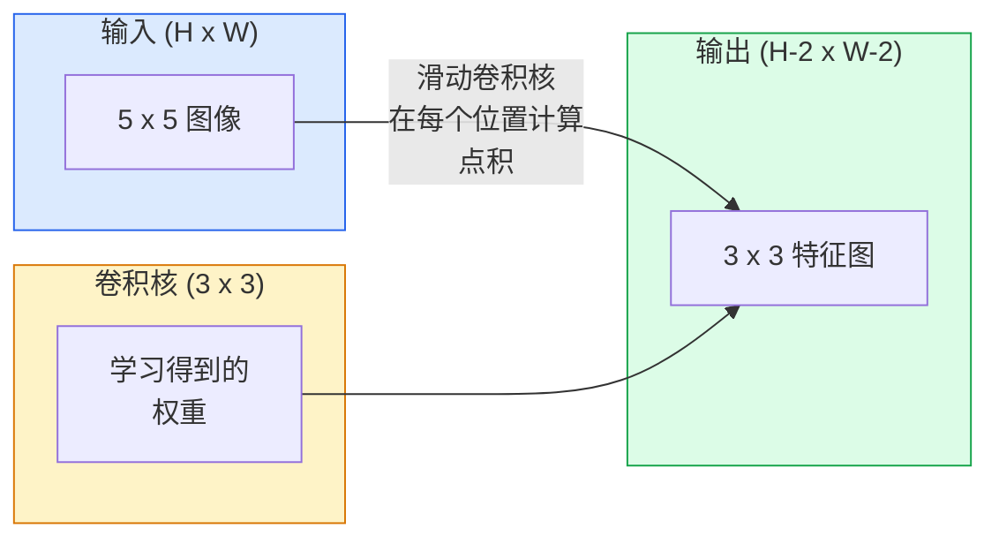
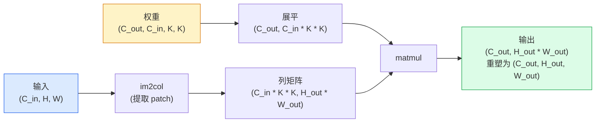

# 从零开始实现卷积 (Convolution)

> 卷积 (convolution) 是一个微小的稠密层 (dense layer)：你把它在图像上滑动，并在每个位置共享同一组权重。

**类型：** 构建
**语言：** Python
**先修内容：** 第 3 阶段（深度学习核心），第 4 阶段第 01 课（图像基础）
**时间：** ~75 分钟

## 学习目标

- 仅使用 NumPy 从零实现二维卷积 (2D convolution)，包括嵌套循环版本和向量化的 `im2col` 版本
- 计算任意输入尺寸、卷积核大小 (kernel size)、padding 和 stride 组合下的输出空间尺寸，并解释 `(H - K + 2P) / S + 1` 公式为何成立
- 手工设计核 (kernel)（边缘、模糊、锐化、Sobel），并解释为什么每一种都会产生对应的激活模式
- 将卷积堆叠成特征提取器 (feature extractor)，并把堆叠深度与感受野 (receptive field) 大小联系起来

## 问题

一个 224x224 的 RGB 图像上的全连接层 (fully connected layer)，每个神经元都需要 224 * 224 * 3 = 150,528 个输入权重。只要一个包含 1,000 个单元的隐藏层，就已经有 1.5 亿个参数——而且此时你还什么有用的东西都没学到。更糟的是，这一层完全不知道左上角的一只狗和右下角的一只狗其实是同一种模式。它把每个像素位置都当作彼此独立的，这对图像来说恰恰是错的：把一只猫平移三个像素，不应该迫使网络重新学习这个概念。

图像模型需要的两个性质是**平移等变性** (translation equivariance)——输入平移时输出也跟着平移——以及**参数共享** (parameter sharing)——同一个特征检测器在所有位置运行。稠密层两者都做不到。卷积则天然同时具备这两点。

卷积并不是为深度学习发明的。它和 JPEG 压缩、Photoshop 里的高斯模糊、工业视觉中的边缘检测，以及所有已经发布过的音频滤波器，使用的是同一种运算。CNN 在 2012 到 2020 年主导 ImageNet 的原因，是卷积正是这类数据的正确先验：相邻的值彼此相关，而且同一种模式可能出现在任何位置。

## 概念

### 一个卷积核 (kernel)，滑动扫描

二维卷积 (2D convolution) 会取一个叫作卷积核 (kernel)（或 filter）的小权重矩阵，在输入上滑动，并在每个位置计算按元素相乘后的和。这个和就成为一个输出像素。



下面看一个具体的 3x3 例子，作用在 5x5 输入上（无 padding，stride 为 1）：

```
Input X (5 x 5):                Kernel W (3 x 3):

  1  2  0  1  2                   1  0 -1
  0  1  3  1  0                   2  0 -2
  2  1  0  2  1                   1  0 -1
  1  0  2  1  3
  2  1  1  0  1

The kernel slides across every valid 3 x 3 window. Output Y is 3 x 3:

 Y[0,0] = sum( W * X[0:3, 0:3] )
 Y[0,1] = sum( W * X[0:3, 1:4] )
 Y[0,2] = sum( W * X[0:3, 2:5] )
 Y[1,0] = sum( W * X[1:4, 0:3] )
 ... and so on
```

这个公式——**共享权重、局部性、滑动窗口**——就是全部核心思想。其余都只是记账问题。

### 输出尺寸公式

给定输入空间尺寸 `H`、kernel size `K`、padding `P`、stride `S`：

```
H_out = floor( (H - K + 2P) / S ) + 1
```

把它记住。你在设计架构时会算它几十次。

| 场景 | H | K | P | S | H_out |
|----------|---|---|---|---|-------|
| 有效卷积，无 padding | 32 | 3 | 0 | 1 | 30 |
| Same 卷积（保持尺寸） | 32 | 3 | 1 | 1 | 32 |
| 下采样 2 倍 | 32 | 3 | 1 | 2 | 16 |
| 2x2 池化 | 32 | 2 | 0 | 2 | 16 |
| 大感受野 | 32 | 7 | 3 | 2 | 16 |

“Same padding” 的意思是：当 `S == 1` 时，选择 `P` 让 `H_out == H`。对于奇数 `K`，这就是 `P = (K - 1) / 2`。这也是 3x3 kernel 能占主导地位的原因——它是最小的、同时仍然拥有中心点的奇数 kernel。

### Padding

如果没有 padding，每做一次卷积，特征图就会缩小一次。叠 20 层之后，你的 224x224 图像会变成 184x184，这既浪费了边界处的计算，又让那些需要形状匹配的残差连接变得麻烦。

```
Zero padding (P = 1) on a 5 x 5 input:

  0  0  0  0  0  0  0
  0  1  2  0  1  2  0
  0  0  1  3  1  0  0
  0  2  1  0  2  1  0       Now the kernel can centre on pixel
  0  1  0  2  1  3  0       (0, 0) and still have three rows and
  0  2  1  1  0  1  0       three columns of values to multiply.
  0  0  0  0  0  0  0
```

实践中你会见到的模式有：`zero`（最常见）、`reflect`（镜像边缘，在生成模型中可以避免生硬边界）、`replicate`（复制边缘）、`circular`（环绕，用于环面类问题）。

### Stride

Stride 是滑动的步长。`stride=1` 是默认值。`stride=2` 会把空间尺寸减半，这是在 CNN 内部进行下采样的经典方式，不需要单独再加池化层——所有现代架构（ResNet、ConvNeXt、MobileNet）都会在某处用带 stride 的卷积替代 max-pool。

```
Stride 1 on a 5 x 5 input, 3 x 3 kernel:

  starts: (0,0) (0,1) (0,2)        -> output row 0
          (1,0) (1,1) (1,2)        -> output row 1
          (2,0) (2,1) (2,2)        -> output row 2

  Output: 3 x 3

Stride 2 on the same input:

  starts: (0,0) (0,2)              -> output row 0
          (2,0) (2,2)              -> output row 1

  Output: 2 x 2
```

### 多个输入通道

真实图像有三个通道。对 RGB 输入做一个 3x3 卷积，实际上是一个 3x3x3 的体：每个输入通道各有一个 3x3 切片。在每个空间位置上，你会跨这三个切片相乘、求和，再加上一个偏置。

```
Input:   (C_in,  H,  W)        3 x 5 x 5
Kernel:  (C_in,  K,  K)        3 x 3 x 3 (one kernel)
Output:  (1,     H', W')       2D map

For a layer that produces C_out output channels, you stack C_out kernels:

Weight:  (C_out, C_in, K, K)   e.g. 64 x 3 x 3 x 3
Output:  (C_out, H', W')       64 x 3 x 3

Parameter count: C_out * C_in * K * K + C_out   (the + C_out is biases)
```

最后这一行就是你在规划模型时要算的东西。一个作用在 3 通道输入上的 64 通道 3x3 卷积，参数量是 `64 * 3 * 3 * 3 + 64 = 1,792`。很便宜。

### im2col 技巧

嵌套循环容易读，但速度慢。GPU 喜欢大矩阵乘法。技巧是：把输入里的每一个感受野窗口都展平成大矩阵里的一列，把 kernel 展平成一行，于是整个卷积就变成一次 matmul。



所有生产级卷积实现，本质上都是这个思路再加上一些 cache-tiling 技巧（direct conv、Winograd、大 kernel 用 FFT conv）。理解了 im2col，就理解了核心。

### 感受野

单个 3x3 卷积会看 9 个输入像素。叠两个 3x3 卷积后，第二层里的一个神经元会看到 5x5 的输入像素。三个 3x3 卷积就是 7x7。一般来说：

```
RF after L stacked K x K convs (stride 1) = 1 + L * (K - 1)

With strides:   RF grows multiplicatively with stride along each layer.
```

“从头到尾全是 3x3” 之所以有效（VGG、ResNet、ConvNeXt），原因就在这里：两个 3x3 卷积看到的输入区域和一个 5x5 卷积相同，但参数更少，而且中间还多了一个非线性。

## 动手实现

### 第 1 步：给数组做 padding

先从最小的原语开始：写一个函数，给 H x W 数组四周补零。

```python
import numpy as np

def pad2d(x, p):
    if p == 0:
        return x
    h, w = x.shape[-2:]
    out = np.zeros(x.shape[:-2] + (h + 2 * p, w + 2 * p), dtype=x.dtype)
    out[..., p:p + h, p:p + w] = x
    return out

x = np.arange(9).reshape(3, 3)
print(x)
print()
print(pad2d(x, 1))
```

这里利用末尾轴的小技巧 `x.shape[:-2]`，让同一个函数无需修改就能处理 `(H, W)`、`(C, H, W)` 或 `(N, C, H, W)`。

### 第 2 步：用嵌套循环实现 2D 卷积

这是参考实现——慢，但没有歧义。原则上，`torch.nn.functional.conv2d` 做的也是这件事。

```python
def conv2d_naive(x, w, b=None, stride=1, padding=0):
    c_in, h, w_in = x.shape
    c_out, c_in_w, kh, kw = w.shape
    assert c_in == c_in_w

    x_pad = pad2d(x, padding)
    h_out = (h + 2 * padding - kh) // stride + 1
    w_out = (w_in + 2 * padding - kw) // stride + 1

    out = np.zeros((c_out, h_out, w_out), dtype=np.float32)
    for oc in range(c_out):
        for i in range(h_out):
            for j in range(w_out):
                hs = i * stride
                ws = j * stride
                patch = x_pad[:, hs:hs + kh, ws:ws + kw]
                out[oc, i, j] = np.sum(patch * w[oc])
        if b is not None:
            out[oc] += b[oc]
    return out
```

四层嵌套循环（输出通道、行、列，再加上对 `C_in`、`kh`、`kw` 的隐式求和）。这是你用来检验所有更快实现的基准真值。

### 第 3 步：用手工设计的 kernel 验证

构造一个竖直 Sobel kernel，把它应用到一张合成的阶跃图像上，观察竖直边缘如何亮起来。

```python
def synthetic_step_image():
    img = np.zeros((1, 16, 16), dtype=np.float32)
    img[:, :, 8:] = 1.0
    return img

sobel_x = np.array([
    [[-1, 0, 1],
     [-2, 0, 2],
     [-1, 0, 1]]
], dtype=np.float32)[None]

x = synthetic_step_image()
y = conv2d_naive(x, sobel_x, padding=1)
print(y[0].round(1))
```

你应该会在第 7 列看到明显的正值（亮度从左向右增加），其余地方则接近 0。这一条打印结果就是你检验数学是否正确的健全性检查 (sanity check)。

### 第 4 步：im2col

把输入中每个 kernel 大小的窗口，都转换成矩阵里的一列。对于 `C_in=3, K=3`，每一列就是 27 个数字。

```python
def im2col(x, kh, kw, stride=1, padding=0):
    c_in, h, w = x.shape
    x_pad = pad2d(x, padding)
    h_out = (h + 2 * padding - kh) // stride + 1
    w_out = (w + 2 * padding - kw) // stride + 1

    cols = np.zeros((c_in * kh * kw, h_out * w_out), dtype=x.dtype)
    col = 0
    for i in range(h_out):
        for j in range(w_out):
            hs = i * stride
            ws = j * stride
            patch = x_pad[:, hs:hs + kh, ws:ws + kw]
            cols[:, col] = patch.reshape(-1)
            col += 1
    return cols, h_out, w_out
```

这里仍然有 Python 循环，但真正的重活现在会交给一次向量化的 matmul。

### 第 5 步：通过 im2col + matmul 实现快速卷积

把四重循环替换成一次矩阵乘法。

```python
def conv2d_im2col(x, w, b=None, stride=1, padding=0):
    c_out, c_in, kh, kw = w.shape
    cols, h_out, w_out = im2col(x, kh, kw, stride, padding)
    w_flat = w.reshape(c_out, -1)
    out = w_flat @ cols
    if b is not None:
        out += b[:, None]
    return out.reshape(c_out, h_out, w_out)
```

正确性检查：同时运行两个实现并比较。

```python
rng = np.random.default_rng(0)
x = rng.normal(0, 1, (3, 16, 16)).astype(np.float32)
w = rng.normal(0, 1, (8, 3, 3, 3)).astype(np.float32)
b = rng.normal(0, 1, (8,)).astype(np.float32)

y_naive = conv2d_naive(x, w, b, padding=1)
y_im2col = conv2d_im2col(x, w, b, padding=1)

print(f"max abs diff: {np.max(np.abs(y_naive - y_im2col)):.2e}")
```

`max abs diff` 应该在 `1e-5` 左右——差异来自浮点数累加顺序，而不是 bug。

### 第 6 步：一组手工设计的 kernel

下面这五个 filter 展示了：即使还没训练，单个卷积层也能表达什么。

```python
KERNELS = {
    "identity": np.array([[0, 0, 0], [0, 1, 0], [0, 0, 0]], dtype=np.float32),
    "blur_3x3": np.ones((3, 3), dtype=np.float32) / 9.0,
    "sharpen": np.array([[0, -1, 0], [-1, 5, -1], [0, -1, 0]], dtype=np.float32),
    "sobel_x": np.array([[-1, 0, 1], [-2, 0, 2], [-1, 0, 1]], dtype=np.float32),
    "sobel_y": np.array([[-1, -2, -1], [0, 0, 0], [1, 2, 1]], dtype=np.float32),
}

def apply_kernel(img2d, kernel):
    x = img2d[None].astype(np.float32)
    w = kernel[None, None]
    return conv2d_im2col(x, w, padding=1)[0]
```

把它们应用到任意灰度图像上时，blur 会让图像变柔和，sharpen 会强化边缘，Sobel-x 会点亮竖直边缘，Sobel-y 会点亮水平边缘。这些正是 AlexNet 和 VGG 的**第一层**训练后卷积最终学到的模式——因为一个好的图像模型，无论后续任务是什么，都需要边缘检测器和 blob 检测器。

## 实际使用

PyTorch 的 `nn.Conv2d` 对同一个运算做了封装，再加上 autograd、CUDA kernel 和 cuDNN 优化。形状语义完全一致。

```python
import torch
import torch.nn as nn

conv = nn.Conv2d(in_channels=3, out_channels=64, kernel_size=3, stride=1, padding=1)
print(conv)
print(f"weight shape: {tuple(conv.weight.shape)}   # (C_out, C_in, K, K)")
print(f"bias shape:   {tuple(conv.bias.shape)}")
print(f"param count:  {sum(p.numel() for p in conv.parameters())}")

x = torch.randn(8, 3, 224, 224)
y = conv(x)
print(f"\ninput  shape: {tuple(x.shape)}")
print(f"output shape: {tuple(y.shape)}")
```

把 `padding=1` 换成 `padding=0`，输出就会降到 222x222。把 `stride=1` 换成 `stride=2`，它就会降到 112x112。和你上面记住的公式完全一致。

## 交付成果

本课会产出：

- `outputs/prompt-cnn-architect.md` —— 一个 prompt：给定输入尺寸、参数预算和目标感受野后，设计出一组 `Conv2d` 层，并在每一步选择正确的 K/S/P。
- `outputs/skill-conv-shape-calculator.md` —— 一个 skill：逐层遍历网络规格，返回每个模块的输出形状、感受野和参数量。

## 练习

1. **（简单）** 给定一个 128x128 灰度输入，以及一组 `[Conv3x3(s=1,p=1), Conv3x3(s=2,p=1), Conv3x3(s=1,p=1), Conv3x3(s=2,p=1)]`，手工计算每一层的输出空间尺寸和感受野。再用一个由虚拟卷积组成的 PyTorch `nn.Sequential` 验证。
2. **（中等）** 扩展 `conv2d_naive` 和 `conv2d_im2col`，让它们接受 `groups` 参数。证明 `groups=C_in=C_out` 会复现 depthwise convolution，并且它的参数量是 `C * K * K`，而不是 `C * C * K * K`。
3. **（困难）** 手工实现 `conv2d_im2col` 的反向传播：给定输出梯度，计算 `x` 和 `w` 的梯度。用相同输入和权重，和 `torch.autograd.grad` 的结果做验证。关键在于：im2col 的梯度是 `col2im`，而且它必须对重叠窗口做累加。

## 关键术语

| 术语 | 人们常说的话 | 它真正的含义 |
|------|----------------|----------------------|
| 卷积 | “滑动一个 filter” | 在每个空间位置上应用一个带共享权重的、可学习的点积；从数学上说它其实是 cross-correlation，但所有人都把它叫作 convolution |
| Kernel / filter | “特征检测器” | 一个形状为 `(C_in, K, K)` 的小权重张量，它与输入窗口做点积后产生一个输出像素 |
| Stride | “你每次跳多远” | 相邻两次 kernel 放置之间的步长；stride 2 会把每个空间维度减半 |
| Padding | “边缘补零” | 在输入周围额外添加数值，让 kernel 可以以边界像素为中心；`same` padding 会让输出尺寸和输入尺寸相等 |
| 感受野 | “这个神经元能看到多少” | 某个输出激活所依赖的原始输入区域；它会随着深度和 stride 增长 |
| im2col | “GEMM 技巧” | 把每个感受野窗口重排成列，让卷积变成一次大型矩阵乘法——这是所有快速卷积 kernel 的核心 |
| Depthwise conv | “每个通道一个 kernel” | 一种满足 `groups == C_in` 的卷积：每个输出通道只从对应的输入通道计算；它是 MobileNet 和 ConvNeXt 的骨干组成部分 |
| 平移等变性 | “输入一平移，输出也平移” | 如果输入平移 k 个像素，输出也会平移 k 个像素；这是共享权重天然带来的性质 |

## 延伸阅读

- [A guide to convolution arithmetic for deep learning (Dumoulin & Visin, 2016)](https://arxiv.org/abs/1603.07285) —— 关于 padding/stride/dilation 的权威图示，几乎所有课程都在默默复用它
- [CS231n: Convolutional Neural Networks for Visual Recognition](https://cs231n.github.io/convolutional-networks/) —— 经典讲义，包括最早的 im2col 解释
- [The Annotated ConvNet (fast.ai)](https://nbviewer.org/github/fastai/fastbook/blob/master/13_convolutions.ipynb) —— 一个 notebook，从手工卷积一路讲到训练好的数字分类器
- [Receptive Field Arithmetic for CNNs (Dang Ha The Hien)](https://distill.pub/2019/computing-receptive-fields/) —— 论文级别、可交互的感受野计算讲解
