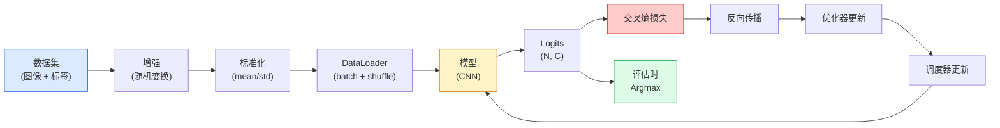

# 图像分类 (Image Classification)

> 分类器 (classifier) 是一个把像素映射为类别概率分布的函数。其他一切都只是管道。

**类型：** 构建
**语言：** Python
**先修内容：** 第 2 阶段第 09 课（模型评估），第 3 阶段第 10 课（迷你框架），第 4 阶段第 03 课（CNN）
**时间：** ~75 分钟

## 学习目标

- 在 CIFAR-10 上构建端到端的图像分类管线：数据集、增强、模型、训练循环、评估
- 解释每个组件（DataLoader、loss、optimizer、scheduler、augmentation）的作用，并预测任意一个组件出错会如何体现在 loss 曲线上
- 从零实现 mixup、cutout 和 label smoothing，并说明各自在哪些场景值得加入
- 读取混淆矩阵 (confusion matrix) 和按类别统计的 precision/recall 表，从总体准确率之外诊断数据集和模型失败模式

## 问题

每个真正落地的视觉任务，在某个层面上都可以归约为图像分类。检测是在对区域做分类。分割是在对像素做分类。检索是在根据与类别中心的相似度做排序。把分类真正做好——数据集循环、增强策略、loss、评估——就是会迁移到这一阶段所有其他任务上的那项能力。

大多数分类 bug 并不在模型里，而是在管线里：错误的标准化、没有打乱的训练集、会扭曲标签的增强、被训练数据污染的验证集切分、在第 30 个 epoch 后悄悄发散的学习率。一个设置正确时本应在 CIFAR-10 上达到 93% 的 CNN，只要管线坏了，常常就只剩 70-75%，而且 loss 曲线从头到尾看起来还挺像那么回事。

本课会手工把整个管线接起来，让每个部分都可以检查。你不会使用任何可能隐藏 bug 的 `torchvision.datasets` 封装。

## 概念

### 分类管线



这个循环里的每一行都可能藏着 bug。交叉熵 (cross-entropy) 接收的是原始 logits，而不是 softmax 输出，所以如果你在 loss 前先写了 `model(x).softmax()`，就会悄悄算出错误的梯度。增强只应用在输入上，不应用在标签上——mixup 除外，因为它两者都混。`optimizer.zero_grad()` 每一步都必须执行一次；漏掉它就会累积梯度，看起来像学习率极不稳定。所有这些 bug 都会把学习曲线压平，但不会报错。

### 交叉熵、logits 和 softmax

分类器会为每张图像输出 `C` 个数字，这些数字叫作未归一化分数 (logits)。对它们应用 softmax，就会得到一个概率分布：

```
softmax(z)_i = exp(z_i) / sum_j exp(z_j)
```

交叉熵衡量的是正确类别负对数概率：

```
CE(z, y) = -log( softmax(z)_y )
        = -z_y + log( sum_j exp(z_j) )
```

右边这种写法才是数值稳定的（log-sum-exp）。PyTorch 的 `nn.CrossEntropyLoss` 把 softmax + NLL 融合成了一个 op，并且直接接收原始 logits。你自己先做 softmax，几乎总是 bug——那样你算的是 `log(softmax(softmax(z)))`，这是一个没有意义的量。

### 为什么增强有效

CNN 对平移具有归纳偏置 (inductive bias)——来自权重共享——但对裁剪、翻转、颜色抖动或遮挡并没有内建不变性。教会它这些不变性的唯一办法，就是给它看能体现这些变化的像素。训练期间的每一个随机变换，本质上都在说：“这两张图的标签相同；去学习那些忽略差异的特征。”

```
Original crop:  "dog facing left"
Flip:           "dog facing right"       <- same label, different pixels
Rotate(+15):    "dog, slight tilt"
Colour jitter:  "dog in warmer light"
RandomErasing:  "dog with patch missing"
```

规则是：增强必须保持标签不变。对手写数字做 Cutout 或旋转，可能会把 “6” 变成 “9”；因此在那类数据集上，你要使用更小的旋转范围，并挑选尊重数字特定不变性的增强。

### Mixup 和 cutmix

普通增强会改变像素，但标签仍保持 one-hot。**Mixup** 和 **cutmix** 则打破了这一点：它们连标签也一起插值。

```
Mixup:
  lambda ~ Beta(a, a)
  x = lambda * x_i + (1 - lambda) * x_j
  y = lambda * y_i + (1 - lambda) * y_j

Cutmix:
  paste a random rectangle of x_j into x_i
  y = area-weighted mix of y_i and y_j
```

为什么它有帮助：模型不会再死记硬背尖锐的 one-hot 目标，而是学会在类别之间进行插值。训练 loss 会升高，测试准确率却会上升。它是任何分类器最便宜的一次鲁棒性升级。

### 标签平滑 (label smoothing)

它可以看作 mixup 的近亲。与其用 `[0, 0, 1, 0, 0]` 训练，不如用 `[eps/C, eps/C, 1-eps, eps/C, eps/C]` 训练，其中 `eps` 可以取 0.1 这样的小值。它会阻止模型产生任意尖锐的 logits，并几乎零成本地改善校准。自 PyTorch 1.10 起，它已经内置在 `nn.CrossEntropyLoss(label_smoothing=0.1)` 中。

### 超越准确率的评估

总体准确率会掩盖类别不平衡。一个 90-10 的二分类器如果永远预测多数类，也有 90% 准确率。真正能告诉你发生了什么的工具是：

- **按类别准确率** —— 每个类别一个数字；能立刻暴露表现不佳的类别。
- **混淆矩阵** —— 一个 `C x C` 网格，其中第 i 行第 j 列表示真实类别 i 被预测成类别 j 的数量；对角线是正确的，非对角线才是你的模型真正“住”的地方。
- **Top-1 / Top-5** —— 正确类别是否出现在前 1 或前 5 个预测里；Top-5 对 ImageNet 很重要，因为像 “Norwich terrier” 和 “Norfolk terrier” 这样的类别本来就确实很容易混淆。
- **校准 (ECE)** —— 当模型给出 0.8 置信度时，它是否真的有 80% 的概率是对的？现代网络往往系统性过度自信；可以用 temperature scaling 或 label smoothing 修复。

## 动手实现

### 第 1 步：一个确定性的合成数据集

CIFAR-10 存在磁盘上。为了让本课可复现且运行更快，我们构建一个看起来像 CIFAR 的合成数据集——32x32 的 RGB 图像，带有模型必须学会的类别特定结构。完全相同的管线，不做任何改动，也能直接用于真实的 CIFAR-10。

```python
import numpy as np
import torch
from torch.utils.data import Dataset


def synthetic_cifar(num_per_class=1000, num_classes=10, seed=0):
    rng = np.random.default_rng(seed)
    X = []
    Y = []
    for c in range(num_classes):
        centre = rng.uniform(0, 1, (3,))
        freq = 2 + c
        for _ in range(num_per_class):
            yy, xx = np.meshgrid(np.linspace(0, 1, 32), np.linspace(0, 1, 32), indexing="ij")
            r = np.sin(xx * freq) * 0.5 + centre[0]
            g = np.cos(yy * freq) * 0.5 + centre[1]
            b = (xx + yy) * 0.5 * centre[2]
            img = np.stack([r, g, b], axis=-1)
            img += rng.normal(0, 0.08, img.shape)
            img = np.clip(img, 0, 1)
            X.append(img.astype(np.float32))
            Y.append(c)
    X = np.stack(X)
    Y = np.array(Y)
    idx = rng.permutation(len(X))
    return X[idx], Y[idx]


class ArrayDataset(Dataset):
    def __init__(self, X, Y, transform=None):
        self.X = X
        self.Y = Y
        self.transform = transform

    def __len__(self):
        return len(self.X)

    def __getitem__(self, i):
        img = self.X[i]
        if self.transform is not None:
            img = self.transform(img)
        img = torch.from_numpy(img).permute(2, 0, 1)
        return img, int(self.Y[i])
```

每个类别都有自己的配色和频率模式，再加上高斯噪声，迫使模型学习信号而不是死记像素。十个类别，每类一千张图像，最后再做一次打乱。

### 第 2 步：标准化与增强

这是每条视觉管线都会有的两个变换。

```python
def standardize(mean, std):
    mean = np.array(mean, dtype=np.float32)
    std = np.array(std, dtype=np.float32)
    def _fn(img):
        return (img - mean) / std
    return _fn


def random_hflip(p=0.5):
    def _fn(img):
        if np.random.random() < p:
            return img[:, ::-1, :].copy()
        return img
    return _fn


def random_crop(pad=4):
    def _fn(img):
        h, w = img.shape[:2]
        padded = np.pad(img, ((pad, pad), (pad, pad), (0, 0)), mode="reflect")
        y = np.random.randint(0, 2 * pad)
        x = np.random.randint(0, 2 * pad)
        return padded[y:y + h, x:x + w, :]
    return _fn


def compose(*fns):
    def _fn(img):
        for fn in fns:
            img = fn(img)
        return img
    return _fn
```

裁剪前先做 reflect padding，而不是 zero padding，因为黑边会变成一种信号，让模型学会以一种没有实际价值的方式去忽略它。

### 第 3 步：Mixup

它会在训练步骤内部混合两张图和两个标签。它被实现成一个 batch transform，因此它和 forward pass 放在一起，而不是写在 dataset 里。

```python
def mixup_batch(x, y, num_classes, alpha=0.2):
    if alpha <= 0:
        return x, torch.nn.functional.one_hot(y, num_classes).float()
    lam = float(np.random.beta(alpha, alpha))
    idx = torch.randperm(x.size(0), device=x.device)
    x_mixed = lam * x + (1 - lam) * x[idx]
    y_onehot = torch.nn.functional.one_hot(y, num_classes).float()
    y_mixed = lam * y_onehot + (1 - lam) * y_onehot[idx]
    return x_mixed, y_mixed


def soft_cross_entropy(logits, soft_targets):
    log_probs = torch.log_softmax(logits, dim=-1)
    return -(soft_targets * log_probs).sum(dim=-1).mean()
```

`soft_cross_entropy` 就是针对 soft label 分布的交叉熵。当目标恰好是 one-hot 时，它就会退化成普通情况。

### 第 4 步：训练循环

完整配方如下：遍历一次数据、每个 batch 只反向传播一次、每个 epoch 只推进一次 scheduler。

```python
import torch
import torch.nn as nn
from torch.utils.data import DataLoader
from torch.optim import SGD
from torch.optim.lr_scheduler import CosineAnnealingLR

def train_one_epoch(model, loader, optimizer, device, num_classes, use_mixup=True):
    model.train()
    total, correct, loss_sum = 0, 0, 0.0
    for x, y in loader:
        x, y = x.to(device), y.to(device)
        if use_mixup:
            x_m, y_soft = mixup_batch(x, y, num_classes)
            logits = model(x_m)
            loss = soft_cross_entropy(logits, y_soft)
        else:
            logits = model(x)
            loss = nn.functional.cross_entropy(logits, y, label_smoothing=0.1)
        optimizer.zero_grad()
        loss.backward()
        optimizer.step()
        loss_sum += loss.item() * x.size(0)
        total += x.size(0)
        # Training accuracy vs the un-mixed labels `y` is only an approximation
        # when mixup is on (the model saw soft targets, not y). Treat it as a
        # rough progress signal; rely on val accuracy for real performance.
        with torch.no_grad():
            pred = logits.argmax(dim=-1)
            correct += (pred == y).sum().item()
    return loss_sum / total, correct / total


@torch.no_grad()
def evaluate(model, loader, device, num_classes):
    model.eval()
    total, correct = 0, 0
    loss_sum = 0.0
    cm = torch.zeros(num_classes, num_classes, dtype=torch.long)
    for x, y in loader:
        x, y = x.to(device), y.to(device)
        logits = model(x)
        loss = nn.functional.cross_entropy(logits, y)
        pred = logits.argmax(dim=-1)
        for t, p in zip(y.cpu(), pred.cpu()):
            cm[t, p] += 1
        loss_sum += loss.item() * x.size(0)
        total += x.size(0)
        correct += (pred == y).sum().item()
    return loss_sum / total, correct / total, cm
```

每次自己写训练循环时，都要检查这五条不变量：

1. 训练前调用 `model.train()`，评估前调用 `model.eval()` —— 它会切换 dropout 和 batchnorm 的行为。
2. 先 `.zero_grad()`，再 `.backward()`。
3. 累积指标时调用 `.item()`，这样就不会有任何东西让计算图继续存活。
4. 评估期间使用 `@torch.no_grad()` —— 节省内存和时间，也能防止一些隐蔽的事故。
5. 直接对原始 logits 做 argmax，而不是对 softmax 做 argmax —— 结果相同，但少一次 op。

### 第 5 步：把一切组装起来

使用上一课的 `TinyResNet`，训练几个 epoch，然后评估。

```python
from main import synthetic_cifar, ArrayDataset
from main import standardize, random_hflip, random_crop, compose
from main import mixup_batch, soft_cross_entropy
from main import train_one_epoch, evaluate
# TinyResNet comes from the previous lesson (03-cnns-lenet-to-resnet).
# Adjust the import path to wherever you stored the previous lesson's code.
from cnns_lenet_to_resnet import TinyResNet  # example placeholder

X, Y = synthetic_cifar(num_per_class=500)
split = int(0.9 * len(X))
X_train, Y_train = X[:split], Y[:split]
X_val, Y_val = X[split:], Y[split:]

mean = [0.5, 0.5, 0.5]
std = [0.25, 0.25, 0.25]
train_tf = compose(random_hflip(), random_crop(pad=4), standardize(mean, std))
eval_tf = standardize(mean, std)

train_ds = ArrayDataset(X_train, Y_train, transform=train_tf)
val_ds = ArrayDataset(X_val, Y_val, transform=eval_tf)

train_loader = DataLoader(train_ds, batch_size=128, shuffle=True, num_workers=0)
val_loader = DataLoader(val_ds, batch_size=256, shuffle=False, num_workers=0)

device = "cuda" if torch.cuda.is_available() else "cpu"
model = TinyResNet(num_classes=10).to(device)
optimizer = SGD(model.parameters(), lr=0.1, momentum=0.9, weight_decay=5e-4, nesterov=True)
scheduler = CosineAnnealingLR(optimizer, T_max=10)

for epoch in range(10):
    tr_loss, tr_acc = train_one_epoch(model, train_loader, optimizer, device, 10, use_mixup=True)
    va_loss, va_acc, _ = evaluate(model, val_loader, device, 10)
    scheduler.step()
    print(f"epoch {epoch:2d}  lr {scheduler.get_last_lr()[0]:.4f}  "
          f"train {tr_loss:.3f}/{tr_acc:.3f}  val {va_loss:.3f}/{va_acc:.3f}")
```

在这个合成数据集上，五个 epoch 内验证准确率就能接近完美；这正是重点：管线是正确的，模型就能学会那些本来可学的东西。把数据集换成真实的 CIFAR-10，同一套循环无需改动也能训练到约 90%。

### 第 6 步：读取混淆矩阵

光看准确率永远不会告诉你模型到底在哪失败。混淆矩阵会。

```python
def print_confusion(cm, labels=None):
    c = cm.shape[0]
    labels = labels or [str(i) for i in range(c)]
    print(f"{'':>6}" + "".join(f"{l:>5}" for l in labels))
    for i in range(c):
        row = cm[i].tolist()
        print(f"{labels[i]:>6}" + "".join(f"{v:>5}" for v in row))
    print()
    tp = cm.diag().float()
    fp = cm.sum(dim=0).float() - tp
    fn = cm.sum(dim=1).float() - tp
    prec = tp / (tp + fp).clamp_min(1)
    rec = tp / (tp + fn).clamp_min(1)
    f1 = 2 * prec * rec / (prec + rec).clamp_min(1e-9)
    for i in range(c):
        print(f"{labels[i]:>6}  prec {prec[i]:.3f}  rec {rec[i]:.3f}  f1 {f1[i]:.3f}")

_, _, cm = evaluate(model, val_loader, device, 10)
print_confusion(cm)
```

行表示真实类别，列表示预测类别。如果类别 3 和 5 之间出现一团明显的非对角计数，说明模型经常把这两类搞混，这就给了你一个起点：去做针对性的数据收集，或者为这两个类设计特定增强。

## 实际使用

`torchvision` 把上面的所有内容都封装成了符合惯用法的组件。对真实的 CIFAR-10 来说，完整管线只要四行外加一个训练循环。

```python
from torchvision.datasets import CIFAR10
from torchvision.transforms import Compose, RandomCrop, RandomHorizontalFlip, ToTensor, Normalize

mean = (0.4914, 0.4822, 0.4465)
std = (0.2470, 0.2435, 0.2616)
train_tf = Compose([
    RandomCrop(32, padding=4, padding_mode="reflect"),
    RandomHorizontalFlip(),
    ToTensor(),
    Normalize(mean, std),
])
eval_tf = Compose([ToTensor(), Normalize(mean, std)])

train_ds = CIFAR10(root="./data", train=True,  download=True, transform=train_tf)
val_ds   = CIFAR10(root="./data", train=False, download=True, transform=eval_tf)
```

有两点要注意：mean/std 是**数据集特定的**——它们是在 CIFAR-10 训练集上计算出来的，而不是 ImageNet——而 reflect pad 是社区默认的裁剪策略。把 ImageNet 的统计值直接粘过来，会默默损失约 1% 的准确率，而且通常要等到有人去 profile 模型时才会发现。

## 交付成果

本课会产出：

- `outputs/prompt-classifier-pipeline-auditor.md` —— 一个 prompt：审计训练脚本是否满足上面的五条不变量，并找出第一处违反之处。
- `outputs/skill-classification-diagnostics.md` —— 一个 skill：给定混淆矩阵和类别名列表，总结每个类别的失败模式，并提出最有影响力的单一修复措施。

## 练习

1. **（简单）** 在合成数据集上，用相同模型分别开启和关闭 mixup 训练五个 epoch。绘制两种情况下的训练与验证 loss。解释为什么开启 mixup 后训练 loss 更高，但验证准确率却相近甚至更好。
2. **（中等）** 实现 Cutout——在每张训练图像里随机清零一个 8x8 方块——并做消融实验，对比无增强、hflip+crop、hflip+crop+cutout、hflip+crop+mixup。汇报每种设置的验证准确率。
3. **（困难）** 构建一条 CIFAR-100 管线（100 个类别，输入尺寸相同），并把一次 ResNet-34 训练复现到距离已发表准确率 1% 以内。附加项：扫描三种学习率和两种 weight decay，把结果记到本地 CSV，并生成最终的 confusion-matrix-top-confusions 表。

## 关键术语

| 术语 | 人们常说的话 | 它真正的含义 |
|------|----------------|----------------------|
| Logits | “原始输出” | 每张图像在 softmax 之前的 `C` 维向量；交叉熵接收的是这个，而不是 softmax 之后的值 |
| 交叉熵 | “那个 loss” | 正确类别的负对数概率；把 log-softmax 和 NLL 稳定地合并在一个 op 里 |
| DataLoader | “那个分 batch 的东西” | 给 dataset 加上打乱、分 batch 和（可选的）多进程加载；一半的训练 bug 都会被甩锅给它 |
| 数据增强 | “随机变换” | 训练时对像素做的、同时保持标签不变的任意变换；它教会 CNN 本身并不原生具备的不变性 |
| Mixup / Cutmix | “把两张图混起来” | 同时混合输入和标签，让分类器学习平滑插值，而不是生硬边界 |
| 标签平滑 | “更软的目标” | 把 one-hot 替换成 `(1-eps, eps/(C-1), ...)`；改善校准，并略微提升准确率 |
| Top-k 准确率 | “Top-5” | 正确类别出现在概率最高的前 k 个预测中；用于类别确实存在歧义的数据集 |
| 混淆矩阵 | “错误都住在这里” | 一个 `C x C` 表，其中条目 `(i, j)` 表示真实类别 i 被预测为 j 的图像数量；对角线是正确的，非对角线告诉你该修什么 |

## 延伸阅读

- [CS231n: Training Neural Networks](https://cs231n.github.io/neural-networks-3/) —— 仍然是单页内最清晰的训练管线讲解
- [Bag of Tricks for Image Classification (He et al., 2019)](https://arxiv.org/abs/1812.01187) —— 那些组合起来能给 ImageNet 上的 ResNet 准确率再加 3-4% 的小技巧
- [mixup: Beyond Empirical Risk Minimization (Zhang et al., 2017)](https://arxiv.org/abs/1710.09412) —— 最初的 mixup 论文；三页理论加上很有说服力的实验
- [Why temperature scaling matters (Guo et al., 2017)](https://arxiv.org/abs/1706.04599) —— 证明现代网络存在失准问题，并用一个标量参数修复它的论文
