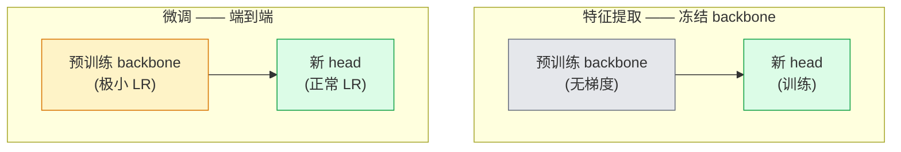

# 迁移学习 (Transfer Learning) 与微调 (Fine-Tuning)

> 别人已经花了一百万 GPU 小时教一个网络认识边缘、纹理和物体部件长什么样。在训练你自己的模型前，你应该先借用这些特征。

**类型：** 构建
**语言：** Python
**先修内容：** 第 4 阶段第 03 课（CNN），第 4 阶段第 04 课（图像分类）
**时间：** ~75 分钟

## 学习目标

- 区分特征提取 (feature extraction) 和微调 (fine-tuning)，并根据数据集大小、领域距离和算力预算选择正确方案
- 加载一个预训练骨干网络 (backbone)，替换它的分类头 (classifier head)，并用不到 20 行代码把“只训练 head”跑到一个可用基线
- 通过判别式学习率 (discriminative learning rates) 逐步解冻各层，让前面更通用的特征得到比后面任务特定特征更小的更新
- 诊断三种常见失败模式：解冻模块学习率过高导致的特征漂移、极小数据集上的 BN 统计量崩坏，以及灾难性遗忘

## 问题

在 ImageNet 上训练一个 ResNet-50 需要大约 2,000 个 GPU 小时。很少有团队会为他们上线的每一个任务都付出这样的预算。几乎所有团队真正上线的，都是一个预训练骨干网络 (backbone)，加上一个在几百或几千张任务特定图像上训练出来的新 head。

这不是偷懒。任何在 ImageNet 上训练过的 CNN，它的第一个卷积块都会学到边缘和类 Gabor filter。接下来的几个块会学到纹理和简单图案。中间的块会学到物体部件。最后的块会学到越来越像那 1,000 个 ImageNet 类别的组合。这个层级结构中前 90% 的部分，几乎可以不做改变地迁移到医学影像、工业检测、卫星数据以及其他所有视觉任务上——因为自然界里可用的边缘和纹理词汇本来就有限。真正需要你训练的是最后那 10%。

把迁移学习做好，有三个 bug 在等着你：学习率太高，把预训练特征直接毁掉；冻结得太多，让模型拿不到足够信息；以及让 BatchNorm 的运行统计量漂移到一个网络其余部分从未学习过的小数据集上。本课会故意把这三类问题都走一遍。

## 概念

### 特征提取 vs 微调

有两种工作模式，取决于你对预训练特征有多信任，以及你手头有多少数据。



经验法则：

| 数据集大小 | 领域距离 | 配方 |
|--------------|-----------------|--------|
| &lt; 1k images | 接近 ImageNet | 冻结 backbone，只训练 head |
| 1k-10k | 接近 | 冻结前 2-3 个 stage，微调其余部分 |
| 10k-100k | 任意 | 使用判别式 LR 进行端到端微调 |
| 100k+ | 远 | 微调全部参数；如果领域足够远，可以考虑从零训练 |

“接近 ImageNet” 大致是指：自然 RGB 照片，且内容看起来像物体。医学 CT、俯视卫星图像和显微图像都属于远领域——这些特征依然有帮助，但你需要允许更多层去适应。

### 为什么冻结会有效

CNN 在 ImageNet 上学到的特征，并不是专门为那 1,000 个类别服务的。它们是为自然图像的统计特性服务的：特定方向的边缘、纹理、对比模式、形状原语。这些统计特性在几乎任何人类能叫出名字的视觉领域里都很稳定。这就是为什么一个在 ImageNet 上训练的模型，只加一个新的线性 head，在不微调 backbone 的情况下零样本评估到 CIFAR-10 上，也能达到 80%+ 的准确率。head 学习的，是该如何给那些已经学到的特征加权，来适应这个任务。

### 判别式学习率

一旦你选择解冻，前面的层就应该比后面的层训练得更慢。前面的层编码的是你想保留的通用特征；后面的层编码的是你需要大幅调整的任务特定结构。

```
Typical recipe:

  stage 0 (stem + first group): lr = base_lr / 100    (mostly fixed)
  stage 1:                       lr = base_lr / 10
  stage 2:                       lr = base_lr / 3
  stage 3 (last backbone group): lr = base_lr
  head:                          lr = base_lr  (or slightly higher)
```

在 PyTorch 里，这只是一组传给 optimizer 的 parameter group。一个模型，五个学习率，不需要额外代码。

### BatchNorm 问题

BN 层持有在 ImageNet 上计算出来的 `running_mean` 和 `running_var` buffer。如果你的任务有不同的像素分布——不同光照、不同传感器、不同色彩空间——这些 buffer 就不对。按优先顺序，你有三个选择：

1. **在 train mode 下微调 BN。** 让 BN 和其余参数一起更新运行统计量。当任务数据集规模中等（>= 5k 样本）时，这是默认选择。
2. **在 eval mode 下冻结 BN。** 保留 ImageNet 的统计量，只训练权重。当你的数据集足够小，以至于 BN 的滑动平均会很噪声时，这才是正确做法。
3. **把 BN 替换成 GroupNorm。** 彻底消除滑动平均问题。在检测和分割骨干网络里，如果每块 GPU 的 batch size 很小，就经常会这么做。

这里搞错了，会悄悄让准确率掉 5-15%。

### Head 设计

分类头 (classifier head) 通常是 1-3 个线性层，再加一个可选的 dropout。每个 torchvision backbone 都自带一个默认 head，你要把它替换掉：

```
backbone.fc = nn.Linear(backbone.fc.in_features, num_classes)          # ResNet
backbone.classifier[1] = nn.Linear(..., num_classes)                    # EfficientNet, MobileNet
backbone.heads.head = nn.Linear(..., num_classes)                       # torchvision ViT
```

对小数据集来说，一个线性层通常就够了。如果任务分布和 backbone 训练分布相距更远，那么加一层隐藏层（Linear -> ReLU -> Dropout -> Linear）会更有帮助。

### 逐层 LR 衰减

这是现代微调（BEiT、DINOv2、ViT-B fine-tune）里比判别式 LR 更平滑的一种版本。不是按 stage 分组，而是让每一层的 LR 都比它上面那层略小一点：

```
lr_layer_k = base_lr * decay^(L - k)
```

当 decay = 0.75 且 L = 12 个 transformer block 时，第一个 block 的训练 LR 是 head LR 的 `0.75^11 ≈ 0.04x`。这在 transformer 微调里比在 CNN 里更重要；对 CNN 而言，按 stage 分组的 LR 通常已经足够。

### 应该评估什么

迁移学习实验需要跟踪两项你在从零训练时通常不会单独打印的指标：

- **仅预训练准确率** —— backbone 冻结时，head 的准确率。这是你的下界。
- **微调后准确率** —— 同一个模型经过端到端训练后的准确率。这是你的上界。

如果微调后的结果还低于仅预训练，那你就有学习率或 BN 方面的 bug。务必把两者都打印出来。

## 动手实现

### 第 1 步：加载预训练 backbone 并检查结构

```python
import torch
import torch.nn as nn
from torchvision.models import resnet18, ResNet18_Weights

backbone = resnet18(weights=ResNet18_Weights.IMAGENET1K_V1)
print(backbone)
print()
print("classifier head:", backbone.fc)
print("feature dim:", backbone.fc.in_features)
```

`ResNet18` 有四个 stage（`layer1..layer4`），外加一个 stem 和一个 `fc` head。每个 torchvision 分类 backbone 都有类似的结构。

### 第 2 步：特征提取——冻结一切，只替换 head

```python
def make_feature_extractor(num_classes=10):
    model = resnet18(weights=ResNet18_Weights.IMAGENET1K_V1)
    for p in model.parameters():
        p.requires_grad = False
    model.fc = nn.Linear(model.fc.in_features, num_classes)
    return model

model = make_feature_extractor(num_classes=10)
trainable = sum(p.numel() for p in model.parameters() if p.requires_grad)
frozen = sum(p.numel() for p in model.parameters() if not p.requires_grad)
print(f"trainable: {trainable:>10,}")
print(f"frozen:    {frozen:>10,}")
```

此时只有 `model.fc` 是可训练的。backbone 只是一个冻结的特征提取器。

### 第 3 步：判别式微调

下面这个工具函数会按照 stage 特定学习率构造 parameter group。

```python
def discriminative_param_groups(model, base_lr=1e-3, decay=0.3):
    stages = [
        ["conv1", "bn1"],
        ["layer1"],
        ["layer2"],
        ["layer3"],
        ["layer4"],
        ["fc"],
    ]
    groups = []
    for i, names in enumerate(stages):
        lr = base_lr * (decay ** (len(stages) - 1 - i))
        params = [p for n, p in model.named_parameters()
                  if any(n.startswith(k) for k in names)]
        if params:
            groups.append({"params": params, "lr": lr, "name": "_".join(names)})
    return groups

model = resnet18(weights=ResNet18_Weights.IMAGENET1K_V1)
model.fc = nn.Linear(model.fc.in_features, 10)
for p in model.parameters():
    p.requires_grad = True

groups = discriminative_param_groups(model)
for g in groups:
    print(f"{g['name']:>10s}  lr={g['lr']:.2e}  params={sum(p.numel() for p in g['params']):>8,}")
```

`decay=0.3` 意味着每个 stage 的训练速率只有下一个 stage 的 30%。`fc` 拿到 `base_lr`，`layer4` 拿到 `0.3 * base_lr`，`conv1` 拿到 `0.3^5 * base_lr ≈ 0.00243 * base_lr`。听起来很夸张；但经验上确实有效。

### 第 4 步：处理 BatchNorm

这是一个用于冻结 BN 运行统计量、但不冻结其权重的辅助函数。

```python
def freeze_bn_stats(model):
    for m in model.modules():
        if isinstance(m, (nn.BatchNorm1d, nn.BatchNorm2d, nn.BatchNorm3d)):
            m.eval()
            for p in m.parameters():
                p.requires_grad = False
    return model
```

在每个 epoch 开始时，先调用 `model.train()`，再调用它。`model.train()` 会把所有层切回训练模式；这个函数只把 BN 层重新切回去。

### 第 5 步：一个最小可用的端到端微调循环

```python
from torch.optim import SGD
from torch.utils.data import DataLoader
from torch.optim.lr_scheduler import CosineAnnealingLR
import torch.nn.functional as F

def fine_tune(model, train_loader, val_loader, device, epochs=5, base_lr=1e-3, freeze_bn=False):
    model = model.to(device)
    groups = discriminative_param_groups(model, base_lr=base_lr)
    optimizer = SGD(groups, momentum=0.9, weight_decay=1e-4, nesterov=True)
    scheduler = CosineAnnealingLR(optimizer, T_max=epochs)

    for epoch in range(epochs):
        model.train()
        if freeze_bn:
            freeze_bn_stats(model)
        tr_loss, tr_correct, tr_total = 0.0, 0, 0
        for x, y in train_loader:
            x, y = x.to(device), y.to(device)
            logits = model(x)
            loss = F.cross_entropy(logits, y, label_smoothing=0.1)
            optimizer.zero_grad()
            loss.backward()
            optimizer.step()
            tr_loss += loss.item() * x.size(0)
            tr_total += x.size(0)
            tr_correct += (logits.argmax(-1) == y).sum().item()
        scheduler.step()

        model.eval()
        va_total, va_correct = 0, 0
        with torch.no_grad():
            for x, y in val_loader:
                x, y = x.to(device), y.to(device)
                pred = model(x).argmax(-1)
                va_total += x.size(0)
                va_correct += (pred == y).sum().item()
        print(f"epoch {epoch}  train {tr_loss/tr_total:.3f}/{tr_correct/tr_total:.3f}  "
              f"val {va_correct/va_total:.3f}")
    return model
```

按照上面的配方，在 CIFAR-10 上跑五个 epoch，就能把 `ResNet18-IMAGENET1K_V1` 从约 70% 的零样本 linear-probe 准确率提升到约 93% 的微调后准确率。如果永远不碰 backbone，只训练 head，结果通常会停在 86% 左右。

### 第 6 步：渐进式解冻

这个 schedule 会从后往前，每个 epoch 解冻一个 stage。它能缓解特征漂移，但代价是需要多跑几个 epoch。

```python
def progressive_unfreeze_schedule(model):
    stages = ["layer4", "layer3", "layer2", "layer1"]
    yielded = set()

    def start():
        for p in model.parameters():
            p.requires_grad = False
        for p in model.fc.parameters():
            p.requires_grad = True

    def unfreeze(epoch):
        if epoch < len(stages):
            name = stages[epoch]
            yielded.add(name)
            for n, p in model.named_parameters():
                if n.startswith(name):
                    p.requires_grad = True
            return name
        return None

    return start, unfreeze
```

在第一个 epoch 前调用一次 `start()`。每个 epoch 开始时调用 `unfreeze(epoch)`。每当可训练参数集合发生变化时，都要重建 optimizer；否则被冻结过的参数还会保留旧的缓存动量，导致优化器行为混乱。

## 实际使用

对大多数真实任务来说，`torchvision.models` 加三行代码就足够了。只有当你碰到默认库设置解决不了的问题时，上面那套更重的机制才有必要。

```python
from torchvision.models import resnet50, ResNet50_Weights

model = resnet50(weights=ResNet50_Weights.IMAGENET1K_V2)
model.fc = nn.Linear(model.fc.in_features, num_classes)
optimizer = torch.optim.AdamW(model.parameters(), lr=1e-4, weight_decay=1e-4)
```

另外两个生产级默认选择：

- `timm` 提供了约 800 个预训练视觉 backbone，并且 API 一致（`timm.create_model("resnet50", pretrained=True, num_classes=10)`）。只要你的微调需求超出 torchvision zoo，它就是标准答案。
- 对 transformer 来说，`transformers.AutoModelForImageClassification.from_pretrained(name, num_labels=N)` 能以和文本模型相同的加载语义给你 ViT / BEiT / DeiT。

## 交付成果

本课会产出：

- `outputs/prompt-fine-tune-planner.md` —— 一个 prompt：根据数据集大小、领域距离和算力预算，在特征提取、渐进式微调和端到端微调之间做选择。
- `outputs/skill-freeze-inspector.md` —— 一个 skill：给定 PyTorch 模型后，报告哪些参数可训练、哪些 BatchNorm 层处于 eval mode，以及 optimizer 实际上是否真的拿到了这些可训练参数。

## 练习

1. **（简单）** 在同一个 synthetic-CIFAR 数据集上，把 `ResNet18` 分别训练成 linear probe（backbone 冻结）和完整微调。把两种准确率并排汇报。解释哪一种差距说明特征迁移得好，哪一种差距说明迁移得不好。
2. **（中等）** 故意引入一个 bug：把 backbone stage 的 `base_lr` 设成 `1e-1`，而不是 head 的学习率。展示训练 loss 如何爆炸，再通过应用 `discriminative_param_groups` 辅助函数把它救回来。记录每个 stage 开始发散时的 LR。
3. **（困难）** 选择一个医学影像数据集（例如 CheXpert-small、PatchCamelyon 或 HAM10000），比较三种方案：(a) ImageNet 预训练、冻结 backbone、线性 head；(b) ImageNet 预训练、端到端微调；(c) 从零训练。汇报各自的准确率和计算成本。数据集多大时，从零训练才开始具备竞争力？

## 关键术语

| 术语 | 人们常说的话 | 它真正的含义 |
|------|----------------|----------------------|
| 特征提取 | “冻结再训练 head” | backbone 参数被冻结，只有新的分类 head 会收到梯度 |
| 微调 | “端到端重新训练” | 所有参数都可训练，且学习率通常远小于从零训练 |
| 判别式 LR | “前面层用更小 LR” | 优化器 parameter group 中，前面 stage 的 LR 只是后面 stage 的一个分数 |
| 逐层 LR 衰减 | “平滑的 LR 梯度” | 每一层的 LR 乘以 `decay^(L - k)`；在 transformer 微调中很常见 |
| 灾难性遗忘 | “模型把 ImageNet 忘了” | 学习率过高，在新任务信号真正学到之前就把预训练特征改写掉了 |
| BN 统计量漂移 | “running mean 不对了” | BatchNorm 的 running_mean/var 来自与当前任务不同的分布，会悄悄伤害准确率 |
| Linear probe | “冻结 backbone + 线性 head” | 用来评估预训练特征质量——冻结表示之上最佳线性分类器的准确率 |
| 灾难性坍塌 | “所有样本都预测成一个类” | 当微调 LR 高到在 head 梯度稳定之前就把特征摧毁时会发生 |

## 延伸阅读

- [How transferable are features in deep neural networks? (Yosinski et al., 2014)](https://arxiv.org/abs/1411.1792) —— 量化不同层特征可迁移性的经典论文
- [Universal Language Model Fine-tuning (ULMFiT, Howard & Ruder, 2018)](https://arxiv.org/abs/1801.06146) —— 最早提出判别式 LR / 渐进式解冻配方的论文；这些思想可以直接迁移到视觉任务中
- [timm documentation](https://huggingface.co/docs/timm) —— 现代视觉 backbone 的参考文档，以及它们训练时使用的精确微调默认值
- [A Simple Framework for Linear-Probe Evaluation (Kornblith et al., 2019)](https://arxiv.org/abs/1805.08974) —— 解释为什么 linear-probe 准确率重要，以及如何正确汇报它
