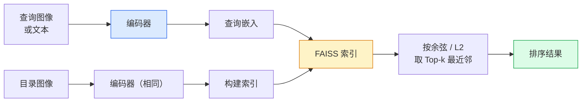

# 图像检索与度量学习 (Image Retrieval & Metric Learning)

> 一个检索系统会按照嵌入空间中的距离对候选项排序。度量学习的任务，就是把这个空间塑造成你想要的样子，让距离真正表达你关心的相似性。

**类型：** 构建
**语言：** Python
**先修要求：** 第 4 阶段第 14 课（ViT），第 4 阶段第 18 课（CLIP）
**时间：** ~45 分钟

## 学习目标

- 解释三元组损失 (triplet loss)、对比损失 (contrastive loss) 和基于代理的度量学习损失 (proxy-based metric learning losses)，并为给定数据集选择正确的方案
- 正确实现 L2 归一化 (L2-normalisation) 与余弦相似度 (cosine similarity)，并审查“同一个实例”和“同一个类别”检索之间的差异
- 构建一个 FAISS 索引，通过文本和图像进行查询，并对保留的查询集报告 recall@K
- 将 DINOv2、CLIP 和 SigLIP 作为现成的嵌入骨干网络使用，并知道各自何时更占优势

## 问题

检索在生产视觉系统中无处不在：重复检测、以图搜图、视觉搜索（“找相似商品”）、人脸重识别、监控场景中的行人重识别、面向电商的实例级匹配。产品层面的问题始终相同：“给定这张查询图像，如何对我的目录进行排序？”

有两个设计决策会决定整个系统。一个是嵌入——由什么模型来产生向量。另一个是索引——如何在大规模下找到最近邻。到 2026 年，这两部分都已经商品化（嵌入用 DINOv2，索引用 FAISS），这反而抬高了要求：真正困难的部分在于定义对你的应用而言 *什么才算相似*，然后把嵌入空间塑造成与这种定义一致的距离结构。

这种塑形过程就是度量学习。它体量不大，但杠杆极高。

## 概念

### 检索概览



### 四类损失函数

| 损失 | 需要 | 优点 | 缺点 |
|------|------|------|------|
| **对比损失 (Contrastive)** | （anchor, positive）+ negatives | 简单，任何成对标签都能用 | 没有足够负样本时收敛较慢 |
| **三元组损失 (Triplet)** | （anchor, positive, negative） | 直观；可直接控制 margin | hard-triplet 挖掘开销高 |
| **NT-Xent / InfoNCE** | 成对样本 + batch 内挖掘的负样本 | 可扩展到大 batch | 需要大 batch 或 momentum queue |
| **基于代理 (Proxy-based, ProxyNCA)** | 仅类别标签 | 快、稳定、无需挖掘 | 在小数据集上可能对代理过拟合 |

对于大多数生产场景，先从一个预训练骨干网络开始；只有当现成嵌入在你的测试集上表现不足时，再加一轮度量学习微调。

### 三元组损失的正式定义

```
L = max(0, ||f(a) - f(p)||^2 - ||f(a) - f(n)||^2 + margin)
```

把锚点 `a` 拉近到正样本 `p`，并把它推离负样本 `n`，同时通过 `margin` 保证两者之间留出间隔。这个三图结构可以推广到任意相似性排序问题。

挖掘策略很重要：简单三元组（`n` 已经离 `a` 很远）带来的损失为零；只有困难三元组才会真正教会网络。半困难挖掘 (semi-hard mining)——即 `n` 比 `p` 更远，但仍落在 margin 内——是 2016 年 FaceNet 的经典配方，直到今天仍然占主导地位。

### 余弦相似度 vs L2

两种度量，两种约定：

- **余弦 (Cosine)**：向量之间的夹角。要求嵌入先做 L2 归一化。
- **L2**：欧氏距离。可以作用于原始嵌入或归一化嵌入，但通常会与 L2 归一化 + 平方 L2 配套使用。

对于大多数现代网络，这两者是等价的：当 `||a|| = ||b|| = 1` 时，`||a - b||^2 = 2 - 2 cos(a, b)`。选择与你的嵌入训练方式一致的约定；把两者混用会在不知不觉中改变“最近”的含义。

### Recall@K

标准检索指标：

```
recall@K = fraction of queries where at least one correct match is in the top K results
```

请并排报告 recall@1、@5、@10。如果 recall@10 高于 0.95，而 recall@1 低于 0.5，说明嵌入空间的整体结构是对的，但排序噪声较大——可以尝试更长时间的微调，或增加一个重排序步骤。

对于重复检测，precision@K 更重要，因为每一个假阳性都会成为用户可见的错误。对于视觉搜索，recall@K 才是产品信号。

### 用一段话理解 FAISS

Facebook AI Similarity Search。事实上的最近邻搜索标准库。三种索引选择：

- `IndexFlatIP` / `IndexFlatL2` —— 暴力搜索、精确、无需训练。适用于最多约 100 万向量。
- `IndexIVFFlat` —— 将空间划分为 K 个单元，只搜索最近的少数几个单元。近似、快速、需要训练数据。
- `IndexHNSW` —— 基于图的索引；多查询场景下速度最快，但索引体积较大。

如果是 10 万向量，你大概率会选择基于余弦相似度的 `IndexFlatIP`。如果是 1000 万，则适合 `IndexIVFFlat`。如果是 1 亿以上，再配合乘积量化 (product quantisation) 的 `IndexIVFPQ`。

### 实例级检索 vs 类别级检索

同一个名字，其实对应两类完全不同的问题：

- **类别级 (Category-level)** —— “在我的目录里找猫。” 条件是类别相似；现成的 CLIP / DINOv2 嵌入通常效果很好。
- **实例级 (Instance-level)** —— “在我的目录里找到 *这个完全相同的商品*。” 需要在同一类别中区分视觉上非常相似的对象；现成嵌入通常表现不够好；度量学习微调就变得重要。

在选模型之前，一定先问清楚你解决的是哪一种。

## 动手构建

### 第 1 步：三元组损失

```python
import torch
import torch.nn.functional as F

def triplet_loss(anchor, positive, negative, margin=0.2):
    d_ap = F.pairwise_distance(anchor, positive, p=2)
    d_an = F.pairwise_distance(anchor, negative, p=2)
    return F.relu(d_ap - d_an + margin).mean()
```

一行代码。对 L2 归一化嵌入和原始嵌入都适用。

### 第 2 步：半困难挖掘

给定一批嵌入和标签，为每个锚点找到最难的半困难负样本。

```python
def semi_hard_negatives(emb, labels, margin=0.2):
    dist = torch.cdist(emb, emb)
    same_class = labels[:, None] == labels[None, :]
    diff_class = ~same_class
    N = emb.size(0)

    positives = dist.clone()
    positives[~same_class] = float("-inf")
    positives.fill_diagonal_(float("-inf"))
    pos_idx = positives.argmax(dim=1)

    semi_hard = dist.clone()
    semi_hard[same_class] = float("inf")
    d_ap = dist[torch.arange(N), pos_idx].unsqueeze(1)
    semi_hard[dist <= d_ap] = float("inf")
    neg_idx = semi_hard.argmin(dim=1)

    fallback_mask = semi_hard[torch.arange(N), neg_idx] == float("inf")
    if fallback_mask.any():
        hardest = dist.clone()
        hardest[same_class] = float("inf")
        neg_idx = torch.where(fallback_mask, hardest.argmin(dim=1), neg_idx)
    return pos_idx, neg_idx
```

每个锚点都会分配到：类内最难的正样本，以及一个距离比正样本更远、但仍落在 margin 内的半困难负样本。

### 第 3 步：Recall@K

```python
def recall_at_k(query_emb, gallery_emb, query_labels, gallery_labels, k=1):
    sim = query_emb @ gallery_emb.T
    _, top_k = sim.topk(k, dim=-1)
    matches = (gallery_labels[top_k] == query_labels[:, None]).any(dim=-1)
    return matches.float().mean().item()
```

对 L2 归一化嵌入来说，按内积取 top-k 与按余弦相似度取 top-k 是等价的。报告“至少命中一个正确邻居”的查询平均比例。

### 第 4 步：把所有部分拼起来

```python
import torch
import torch.nn as nn
from torch.optim import Adam

class Encoder(nn.Module):
    def __init__(self, in_dim=128, emb_dim=64):
        super().__init__()
        self.net = nn.Sequential(
            nn.Linear(in_dim, 128), nn.ReLU(),
            nn.Linear(128, emb_dim),
        )

    def forward(self, x):
        return F.normalize(self.net(x), dim=-1)

torch.manual_seed(0)
num_classes = 6
protos = F.normalize(torch.randn(num_classes, 128), dim=-1)

def sample_batch(bs=32):
    labels = torch.randint(0, num_classes, (bs,))
    x = protos[labels] + 0.15 * torch.randn(bs, 128)
    return x, labels

enc = Encoder()
opt = Adam(enc.parameters(), lr=3e-3)

for step in range(200):
    x, y = sample_batch(32)
    emb = enc(x)
    pos_idx, neg_idx = semi_hard_negatives(emb, y)
    loss = triplet_loss(emb, emb[pos_idx], emb[neg_idx])
    opt.zero_grad(); loss.backward(); opt.step()
```

几百步之后，嵌入簇就会逐渐形成“每个类别一个簇”的结构。

## 使用它

到 2026 年，生产栈通常是这样：

- **DINOv2 + FAISS** —— 通用视觉检索。开箱即用。
- **CLIP + FAISS** —— 当查询是文本时。
- **微调后的 DINOv2 + FAISS** —— 实例级检索、人脸重识别、时尚、电商。
- **Milvus / Weaviate / Qdrant** —— 基于 FAISS 或 HNSW 封装的托管向量数据库。

对于 SOTA 的实例级检索，典型配方是：DINOv2 骨干网络 + 一个嵌入头，在实例标注对上用 triplet 或 InfoNCE 损失做微调，然后用 FAISS 建索引。

## 交付它

本课会产出：

- `outputs/prompt-retrieval-loss-picker.md` —— 一个提示词，用于为给定检索问题在 triplet / InfoNCE / ProxyNCA 之间做选择。
- `outputs/skill-recall-at-k-runner.md` —— 一个技能，用于编写干净的 recall@K 评估脚手架，包含训练 / 验证 / 检索库（train/val/gallery）划分以及正确的数据契约。

## 练习

1. **（简单）** 运行上面的玩具示例。训练前后用 PCA 绘制嵌入，观察 6 个簇如何形成。
2. **（中等）** 添加一个 ProxyNCA 损失实现：每个类别一个可学习“代理”，在余弦相似度上做标准交叉熵。比较它与三元组损失（triplet loss）在玩具数据上的收敛速度。
3. **（困难）** 取 1,000 张 ImageNet 验证集图像，通过 HuggingFace 的 DINOv2 生成嵌入，构建一个 FAISS 扁平索引（flat index），并在“同一批图像作为查询”（结果应为 1.0）以及“保留划分 + ImageNet 标签作为真值”两种设置下报告 recall@{1, 5, 10}。

## 关键术语

| 术语 | 人们常说 | 实际含义 |
|------|----------|----------|
| 度量学习 | “塑造空间” | 训练一个编码器，使其输出空间中的距离反映目标相似性 |
| 三元组损失 | “拉近与推远” | L = max(0, d(a, p) - d(a, n) + margin)；经典的度量学习损失 |
| 半困难挖掘 | “有用的负样本” | 比锚点到正样本更远、但仍在 margin 内的负样本；经验上信息量最大 |
| 基于代理的损失 | “类别原型” | 每个类别一个可学习代理；在“与代理的相似度”上做交叉熵；无需成对挖掘 |
| Recall@K | “前 K 命中率” | 前 K 个结果中至少出现一个正确结果的查询比例 |
| 实例检索 | “找到这个完全一样的东西” | 细粒度匹配；现成特征通常表现不足 |
| FAISS | “那个最近邻库” | Facebook 的最近邻搜索库；支持精确索引和近似索引 |
| HNSW | “图索引” | Hierarchical navigable small world；快速的近似最近邻方法，内存开销较小 |

## 延伸阅读

- [FaceNet: A Unified Embedding for Face Recognition (Schroff et al., 2015)](https://arxiv.org/abs/1503.03832) —— 三元组损失 / 半困难挖掘（triplet loss / semi-hard mining）论文
- [In Defense of the Triplet Loss for Person Re-Identification (Hermans et al., 2017)](https://arxiv.org/abs/1703.07737) —— triplet 微调的实战指南
- [FAISS documentation](https://github.com/facebookresearch/faiss/wiki) —— 所有索引、所有权衡
- [SMoT: Metric Learning Taxonomy (Kim et al., 2021)](https://arxiv.org/abs/2010.06927) —— 现代损失函数及其关系综述
