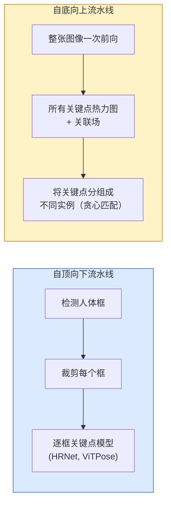

# 关键点检测与姿态估计 (Keypoint Detection & Pose Estimation)

> 姿态是一组有序的关键点。关键点检测器本质上是一个热力图回归器。其余一切都只是工程整理工作。

**类型：** 构建
**语言：** Python
**先修要求：** 第 4 阶段第 06 课（检测 / Detection），第 4 阶段第 07 课（U-Net）
**时间：** ~45 分钟

## 学习目标

- 区分自顶向下和自底向上的姿态估计，并说明各自适用场景
- 用“每个关键点一个高斯目标”的方式为 K 个关键点回归热力图，并在推理时提取关键点坐标
- 解释部件关联场 (Part Affinity Fields, PAFs)，以及自底向上流水线如何把关键点关联成不同实例
- 在生产环境中使用 MediaPipe Pose 或 MMPose 做关键点估计，并理解它们的输出格式

## 问题

关键点任务有很多名字：人体姿态（17 个身体关节）、人脸标志点（landmark，68 或 478 个点）、手部（21 个点）、动物姿态、机器人对象姿态、医学解剖标志点。它们都有同样的结构：在一个对象上检测 K 个离散点，并输出它们的 `(x, y)` 坐标。

姿态估计是动作捕捉、健身应用、体育分析、手势控制、动画、AR 试穿和机器人抓取的基础。二维场景已经很成熟；三维姿态（只用单个摄像头估计世界坐标中的关节位置）则是当前研究前沿。

工程上的关键问题在于规模。单张图像、单个人体姿态是一个 20ms 级问题。拥挤场景下 30 fps 的多人姿态，则是另一个问题，需要完全不同的架构。

## 概念

### 自顶向下 vs 自底向上



- **自顶向下** —— 先检测人，再对每个裁剪框运行单人关键点模型。精度最高；计算量随人数线性增长。
- **自底向上** —— 一次前向同时预测所有关键点和关联场；然后再把它们分组。无论人群规模如何，时间复杂度都近似恒定。

自顶向下（HRNet、ViTPose）是精度王者；自底向上（OpenPose、HigherHRNet）则是拥挤场景的吞吐量王者。

### 热力图回归

不要直接回归 `(x, y)`，而是为每个关键点预测一个 `H x W` 热力图，在真实位置中心放置一个高斯斑点。

```
target[k, y, x] = exp(-((x - cx_k)^2 + (y - cy_k)^2) / (2 sigma^2))
```

推理时，每张热力图的 argmax 就是预测的关键点位置。

为什么热力图比直接回归更有效：网络的空间结构（卷积特征图）天然与空间输出对齐。高斯目标还带来了正则化效果——小的定位误差只会产生小的损失，而不是完全不学习。

### 亚像素定位

argmax 只能给出整数坐标。若要达到亚像素精度，可以对 argmax 及其邻域拟合抛物线，或者使用常见的偏移方向公式 `(dx, dy) = 0.25 * (heatmap[y, x+1] - heatmap[y, x-1], ...)`。

### 部件关联场 (PAFs)

这是 OpenPose 在自底向上关联中的关键技巧。对于每一对相连的关键点（例如左肩到左肘），预测一个 2 通道场，用来编码从一个点指向另一个点的单位向量。要把某个肩膀和某个肘部关联起来，就沿着候选点对之间的连线对 PAF 做积分；积分值最高的那一对会被匹配在一起。

```
For each connection (limb):
  PAF channels: 2 (unit vector x, y)
  Line integral: sum over sample points of (PAF . line_direction)
  Higher integral = stronger match
```

这个方法既优雅，又能在不做逐人裁剪的情况下扩展到任意拥挤程度的人群。

### COCO 关键点

标准的人体姿态数据集：每个人有 17 个关键点，使用 PCK（Percentage of Correct Keypoints）和 OKS（Object Keypoint Similarity）作为指标。OKS 是关键点版本的 IoU，也是 COCO mAP@OKS 实际报告的指标。

### 2D vs 3D

- **2D 姿态** —— 图像坐标；已经具备生产级质量（MediaPipe、HRNet、ViTPose）。
- **3D 姿态** —— 世界 / 相机坐标；仍然是活跃研究方向。常见做法包括：
  - 用一个小 MLP 把 2D 预测提升到 3D（VideoPose3D）。
  - 直接从图像回归 3D（PyMAF、MHFormer）。
  - 用多视角设置（CMU Panoptic）生成真值。

## 动手构建

### 第 1 步：高斯热力图目标

```python
import numpy as np
import torch

def gaussian_heatmap(size, cx, cy, sigma=2.0):
    yy, xx = np.meshgrid(np.arange(size), np.arange(size), indexing="ij")
    return np.exp(-((xx - cx) ** 2 + (yy - cy) ** 2) / (2 * sigma ** 2)).astype(np.float32)

hm = gaussian_heatmap(64, 32, 32, sigma=2.0)
print(f"peak: {hm.max():.3f} at ({hm.argmax() % 64}, {hm.argmax() // 64})")
```

把每个关键点的热力图沿通道维堆叠起来，就得到了完整的目标张量。

### 第 2 步：微型关键点头

一个 U-Net 风格的模型，输出 K 个热力图通道。

```python
import torch.nn as nn
import torch.nn.functional as F

class TinyKeypointNet(nn.Module):
    def __init__(self, num_keypoints=4, base=16):
        super().__init__()
        self.down1 = nn.Sequential(nn.Conv2d(3, base, 3, 2, 1), nn.ReLU(inplace=True))
        self.down2 = nn.Sequential(nn.Conv2d(base, base * 2, 3, 2, 1), nn.ReLU(inplace=True))
        self.mid = nn.Sequential(nn.Conv2d(base * 2, base * 2, 3, 1, 1), nn.ReLU(inplace=True))
        self.up1 = nn.ConvTranspose2d(base * 2, base, 2, 2)
        self.up2 = nn.ConvTranspose2d(base, num_keypoints, 2, 2)

    def forward(self, x):
        h1 = self.down1(x)
        h2 = self.down2(h1)
        h3 = self.mid(h2)
        u1 = self.up1(h3)
        return self.up2(u1)
```

输入 `(N, 3, H, W)`，输出 `(N, K, H, W)`。损失函数是对高斯目标逐像素计算的 MSE。

### 第 3 步：推理——提取关键点坐标

```python
def heatmap_to_coords(heatmaps):
    """
    heatmaps: (N, K, H, W)
    returns:  (N, K, 2) float coordinates in image pixels
    """
    N, K, H, W = heatmaps.shape
    hm = heatmaps.reshape(N, K, -1)
    idx = hm.argmax(dim=-1)
    ys = (idx // W).float()
    xs = (idx % W).float()
    return torch.stack([xs, ys], dim=-1)

coords = heatmap_to_coords(torch.randn(2, 4, 32, 32))
print(f"coords: {coords.shape}")  # (2, 4, 2)
```

推理时只要一行代码。若要进一步达到亚像素精度，就在 argmax 周围做插值细化。

### 第 4 步：合成关键点数据集

很简单：在白色画布上画四个点，然后学习预测它们。

```python
def make_synthetic_sample(size=64):
    img = np.ones((3, size, size), dtype=np.float32)
    rng = np.random.default_rng()
    kps = rng.integers(8, size - 8, size=(4, 2))
    for cx, cy in kps:
        img[:, cy - 2:cy + 2, cx - 2:cx + 2] = 0.0
    hms = np.stack([gaussian_heatmap(size, cx, cy) for cx, cy in kps])
    return img, hms, kps
```

这个任务简单到一个微型模型在一分钟内就能学会。

### 第 5 步：训练

```python
model = TinyKeypointNet(num_keypoints=4)
opt = torch.optim.Adam(model.parameters(), lr=3e-3)

for step in range(200):
    batch = [make_synthetic_sample() for _ in range(16)]
    imgs = torch.from_numpy(np.stack([b[0] for b in batch]))
    hms = torch.from_numpy(np.stack([b[1] for b in batch]))
    pred = model(imgs)
    # Upsample pred to full resolution
    pred = F.interpolate(pred, size=hms.shape[-2:], mode="bilinear", align_corners=False)
    loss = F.mse_loss(pred, hms)
    opt.zero_grad(); loss.backward(); opt.step()
```

## 使用它

- **MediaPipe Pose** —— Google 的生产级姿态估计器；提供 WebGL + 移动端运行时，延迟低于 10ms。
- **MMPose**（OpenMMLab）—— 完整的研究代码库；几乎涵盖所有 SOTA 架构和预训练权重。
- **YOLOv8-pose** —— 单次前向即可完成最快的实时多人姿态估计。
- **transformers HumanDPT / PoseAnything** —— 更新的视觉-语言方法，用于开放词表姿态（任何对象、任何关键点集合）。

## 交付它

本课会产出：

- `outputs/prompt-pose-stack-picker.md` —— 一个提示词，可根据延迟、人群规模以及 2D vs 3D 需求，在 MediaPipe / YOLOv8-pose / HRNet / ViTPose 之间做选择。
- `outputs/skill-heatmap-to-coords.md` —— 一个技能，用于编写所有生产姿态模型都会用到的亚像素热力图转坐标例程。

## 练习

1. **（简单）** 在合成的 4 点数据集上训练这个微型关键点模型。报告 200 步之后预测关键点与真实关键点之间的平均 L2 误差。
2. **（中等）** 加入亚像素细化：给定 argmax 位置，用相邻像素沿 x 和 y 分别拟合一维抛物线。报告相对于整数 argmax 的精度提升。
3. **（困难）** 构建一个 2 人合成数据集，其中每张图像都包含两个 4 关键点模式实例。训练一个带 PAF 的自底向上流水线，预测每个关键点属于哪个实例，并评估 OKS。

## 关键术语

| 术语 | 人们常说 | 实际含义 |
|------|----------|----------|
| 关键点 | “一个标志点（landmark）” | 对象上的某个特定有序点（关节、角点、特征点） |
| 姿态 | “骨架” | 属于同一个实例的一组有序关键点 |
| 自顶向下 | “先检测再姿态” | 两阶段流水线：人体检测器 + 每个裁剪框一个关键点模型；精度最高 |
| 自底向上 | “先姿态后分组” | 单次前向预测全部关键点 + 分组；在人群规模上近似常数时间 |
| 热力图 | “高斯目标” | 每个关键点一个 H x W 张量，在真实位置处达到峰值；首选回归目标 |
| PAF | “部件关联场” | 2 通道单位向量场，编码肢体方向；用于把关键点分组成实例 |
| OKS | “关键点 IoU” | Object Keypoint Similarity；COCO 姿态任务指标 |
| HRNet | “高分辨率网络” | 主导性的自顶向下关键点架构；始终保留高分辨率特征 |

## 延伸阅读

- [OpenPose (Cao et al., 2017)](https://arxiv.org/abs/1812.08008) —— 带 PAF 的自底向上方法；仍然是该路线最好的讲解
- [HRNet (Sun et al., 2019)](https://arxiv.org/abs/1902.09212) —— 自顶向下参考架构
- [ViTPose (Xu et al., 2022)](https://arxiv.org/abs/2204.12484) —— 将普通 ViT 用作姿态骨干网络；在许多基准上仍是当前 SOTA
- [MediaPipe Pose](https://developers.google.com/mediapipe/solutions/vision/pose_landmarker) —— 生产级实时姿态；到 2026 年仍是部署最快的栈
