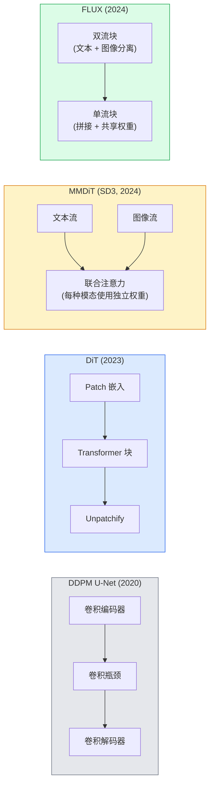

# 扩散 Transformer (Diffusion Transformer) 与校正流 (Rectified Flow)

> U-Net 并不是扩散模型的秘密。把它换成 Transformer，再把噪声日程替换成一条直线流，你就得到了 SD3、FLUX，以及几乎所有 2026 年的文生图模型。

**类型：** 学习 + 构建
**语言：** Python
**前置课程：** 第 4 阶段第 10 课（扩散 DDPM）、第 4 阶段第 14 课（ViT）、第 7 阶段第 02 课（自注意力）
**时长：** ~75 分钟

## 学习目标

- 梳理从 U-Net DDPM（第 10 课）到 Diffusion Transformer（DiT）、MMDiT（SD3）以及单流 + 双流 DiT（FLUX）的演进路径
- 解释校正流 (Rectified Flow)：为什么噪声与数据之间的直线轨迹能让模型用 20 步而不是 1000 步进行采样
- 实现一个不足 100 行的微型 DiT block 和一个不足 100 行的校正流训练循环
- 通过架构、参数量和许可证区分模型变体（SD3、FLUX.1-dev、FLUX.1-schnell、Z-Image、Qwen-Image）

## 问题

第 10 课构建了一个以 U-Net 为去噪器的 DDPM。这个配方在 2020-2023 年间占据统治地位：U-Net + beta schedule + 噪声预测损失。它催生了 Stable Diffusion 1.5、2.1 和 DALL-E 2。

到了 2026 年，所有最先进的文生图模型都已经越过了这一步。Stable Diffusion 3、FLUX、SD4、Z-Image、Qwen-Image、Hunyuan-Image——没有一个再使用 U-Net。它们改用 Diffusion Transformer（DiT）。SD3 和 FLUX 还把 DDPM 的噪声日程替换成校正流，这让从噪声到数据的路径更接近直线，并通过 consistency 或 distilled 变体实现了 1-4 步推理。

这种转变很重要，因为它正是扩散式图像生成变得可控、提示词准确（SD3/SD4 解决了文本渲染问题）、并且足够快到可用于生产的原因。理解 DiT + 校正流，就等于理解 2026 年的生成式图像技术栈。

## 概念

### 从 U-Net 到 Transformer



- **DiT**（Peebles & Xie，2023）—— 用类似 ViT 的 Transformer 处理 latent patch，替换掉 U-Net。条件注入通过自适应层归一化 (adaptive layer norm, AdaLN) 完成。
- **MMDiT**（SD3，Esser et al.，2024）—— 文本 token 和图像 token 使用两条独立权重流，但共享同一个联合注意力。
- **FLUX**（Black Forest Labs，2024）—— 前 N 个 block 像 SD3 一样是双流结构，后续 block 会拼接后共享权重（单流），以在更深层数下提升效率。
- **Z-Image**（2025）—— 一个参数量为 6B 的高效单流 DiT，挑战了“只要规模够大就行”的思路。

### 用一段话理解校正流

DDPM 将前向过程定义为一个带噪声的随机微分方程（SDE），其中 `x_t` 会被逐步污染。学习到的反向过程也是另一个 SDE，需要用 1000 个很小的步长来求解。

校正流则在干净数据和纯噪声之间定义了一条**直线**插值：

```
x_t = (1 - t) * x_0 + t * epsilon,     t in [0, 1]
```

训练一个网络去预测速度 `v_theta(x_t, t) = epsilon - x_0`——也就是沿着从干净数据到噪声这条直线路径的前进方向（`dx_t/dt`）。在采样时，再把这个速度反向积分，让模型从噪声朝数据一步步走回去。得到的常微分方程 (ODE) 与直线更接近，因此采样所需的积分步数要少得多。

SD3 把这件事称为**Rectified Flow Matching**。FLUX、Z-Image 和大多数 2026 年模型都使用相同目标。典型推理配置是 20-30 个 Euler 步（确定性），而旧 DDPM 时代往往需要 50+ 个 DDIM 步。蒸馏 / turbo / schnell / LCM 变体则可以进一步降到 1-4 步。

### AdaLN 条件注入

DiT 通过**自适应层归一化**来接收时间步和类别/文本条件：从条件向量预测 `scale` 和 `shift`，并在 LayerNorm 之后应用。相比 U-Net 中的 FiLM 风格调制，这种方式更干净，也是所有现代 DiT 的默认做法。

```
cond -> MLP -> (scale, shift, gate)
norm(x) * (1 + scale) + shift, then residual add * gate
```

### SD3 和 FLUX 中的文本编码器

- **SD3** 使用三个文本编码器：两个 CLIP 模型 + T5-XXL。它们的嵌入会拼接起来，并作为文本条件送入图像流。
- **FLUX** 使用一个 CLIP-L + T5-XXL。
- **Qwen-Image / Z-Image** 变体使用它们自研、并与基础 LLM 对齐的文本编码器。

文本编码器是 SD3/FLUX 在提示词理解上远强于 SD1.5 的一个重要原因。仅 T5-XXL 就有 4.7B 参数。

### 无分类器引导 (classifier-free guidance, CFG) 仍然适用

校正流改变的是采样器，而不是条件机制。无分类器引导（训练时以 10% 概率丢弃文本，在推理时混合条件与无条件预测）在校正流中完全照常工作。大多数 2026 年模型使用的 guidance scale 在 3.5-5 之间——低于 SD1.5 的 7.5，因为校正流模型默认就会更紧密地遵循提示词。

### Consistency、Turbo、Schnell、LCM

这四个名字本质上说的是同一件事：把一个慢速、多步的模型蒸馏成一个快速、少步的模型。

- **LCM（Latent Consistency Model）** —— 训练一个学生模型，让它从任意中间态 `x_t` 一步预测最终的 `x_0`。
- **SDXL Turbo / FLUX schnell** —— 用对抗式扩散蒸馏训练得到的 1-4 步模型。
- **SD Turbo** —— 适配到 latent diffusion 的 OpenAI 风格一致性模型 (Consistency Models)。

任何新模型做生产部署时，都会同时提供一个“全质量”checkpoint 和一个 “turbo / schnell” 变体。Schnell（德语“快速”，也是 Black Forest Labs 的命名习惯）只需 1-4 步，适合实时流水线。

### 2026 年的模型版图

| 模型 | 规模 | 架构 | 许可证 |
|-------|------|--------------|---------|
| Stable Diffusion 3 Medium | 2B | MMDiT | SAI Community |
| Stable Diffusion 3.5 Large | 8B | MMDiT | SAI Community |
| FLUX.1-dev | 12B | 双流 + 单流 DiT | 非商用 |
| FLUX.1-schnell | 12B | 同上，蒸馏版 | Apache 2.0 |
| FLUX.2 | — | FLUX.1 的迭代版 | 混合 |
| Z-Image | 6B | S3-DiT（Scalable Single-Stream） | 宽松 |
| Qwen-Image | ~20B | DiT + Qwen 文本塔 | Apache 2.0 |
| Hunyuan-Image-3.0 | ~80B | DiT | 研究 |
| SD4 Turbo | 3B | DiT + 蒸馏 | SAI Commercial |

FLUX.1-schnell 是 2026 年开源模型的默认选择。Z-Image 是效率领先者。FLUX.2 和 SD4 则代表当前质量上限。

### 为什么这个阶段性转变如此重要

DDPM + U-Net 可行。DiT + 校正流则**更好、更快，而且扩展起来更干净**。这种转变与 NLP 从 RNN 迁移到 Transformer 十分类似：两种架构都能解决同一个问题，但 Transformer 更容易扩展，因此最终占据主导。2026 年几乎所有关于图像、视频或 3D 生成的论文都使用 DiT 形状的去噪器，而且通常采用校正流目标。U-Net DDPM 现在主要是教学用途（第 10 课）。

## 动手实现

### 第 1 步：带 AdaLN 的 DiT block

```python
import torch
import torch.nn as nn


class AdaLNZero(nn.Module):
    """
    Adaptive LayerNorm with a gate. Predicts (scale, shift, gate) from the conditioning.
    Init such that the whole block starts as identity ("zero init").
    """

    def __init__(self, dim, cond_dim):
        super().__init__()
        self.norm = nn.LayerNorm(dim, elementwise_affine=False)
        self.mlp = nn.Linear(cond_dim, dim * 3)
        nn.init.zeros_(self.mlp.weight)
        nn.init.zeros_(self.mlp.bias)

    def forward(self, x, cond):
        scale, shift, gate = self.mlp(cond).chunk(3, dim=-1)
        h = self.norm(x) * (1 + scale.unsqueeze(1)) + shift.unsqueeze(1)
        return h, gate.unsqueeze(1)


class DiTBlock(nn.Module):
    def __init__(self, dim=192, heads=3, mlp_ratio=4, cond_dim=192):
        super().__init__()
        self.adaln1 = AdaLNZero(dim, cond_dim)
        self.attn = nn.MultiheadAttention(dim, heads, batch_first=True)
        self.adaln2 = AdaLNZero(dim, cond_dim)
        self.mlp = nn.Sequential(
            nn.Linear(dim, dim * mlp_ratio),
            nn.GELU(),
            nn.Linear(dim * mlp_ratio, dim),
        )

    def forward(self, x, cond):
        h, gate1 = self.adaln1(x, cond)
        a, _ = self.attn(h, h, h, need_weights=False)
        x = x + gate1 * a
        h, gate2 = self.adaln2(x, cond)
        x = x + gate2 * self.mlp(h)
        return x
```

`AdaLNZero` 之所以一开始等价于恒等映射，是因为它的 MLP 权重初始化为零。训练会逐渐把整个 block 从恒等状态推开；这会极大提升深层 Transformer 扩散模型的稳定性。

### 第 2 步：一个小型 DiT

```python
def timestep_embedding(t, dim):
    import math
    half = dim // 2
    freqs = torch.exp(-math.log(10000) * torch.arange(half, device=t.device) / half)
    args = t[:, None].float() * freqs[None]
    return torch.cat([args.sin(), args.cos()], dim=-1)


class TinyDiT(nn.Module):
    def __init__(self, image_size=16, patch_size=2, in_channels=3, dim=96, depth=4, heads=3):
        super().__init__()
        self.patch_size = patch_size
        self.num_patches = (image_size // patch_size) ** 2
        self.patch = nn.Conv2d(in_channels, dim, kernel_size=patch_size, stride=patch_size)
        self.pos = nn.Parameter(torch.zeros(1, self.num_patches, dim))
        self.time_mlp = nn.Sequential(
            nn.Linear(dim, dim * 2),
            nn.SiLU(),
            nn.Linear(dim * 2, dim),
        )
        self.blocks = nn.ModuleList([DiTBlock(dim, heads, cond_dim=dim) for _ in range(depth)])
        self.norm_out = nn.LayerNorm(dim, elementwise_affine=False)
        self.head = nn.Linear(dim, patch_size * patch_size * in_channels)

    def forward(self, x, t):
        n = x.size(0)
        x = self.patch(x)
        x = x.flatten(2).transpose(1, 2) + self.pos
        t_emb = self.time_mlp(timestep_embedding(t, self.pos.size(-1)))
        for blk in self.blocks:
            x = blk(x, t_emb)
        x = self.norm_out(x)
        x = self.head(x)
        return self._unpatchify(x, n)

    def _unpatchify(self, x, n):
        p = self.patch_size
        h = w = int(self.num_patches ** 0.5)
        x = x.view(n, h, w, p, p, -1).permute(0, 5, 1, 3, 2, 4).reshape(n, -1, h * p, w * p)
        return x
```

### 第 3 步：校正流训练

```python
import torch.nn.functional as F

def rectified_flow_train_step(model, x0, optimizer, device):
    model.train()
    x0 = x0.to(device)
    n = x0.size(0)
    t = torch.rand(n, device=device)
    epsilon = torch.randn_like(x0)
    x_t = (1 - t[:, None, None, None]) * x0 + t[:, None, None, None] * epsilon

    target_velocity = epsilon - x0
    pred_velocity = model(x_t, t)

    loss = F.mse_loss(pred_velocity, target_velocity)
    optimizer.zero_grad()
    loss.backward()
    optimizer.step()
    return loss.item()
```

把它和 DDPM 的噪声预测损失（第 10 课）对比一下：结构相同，目标不同。我们不再预测噪声 `epsilon`，而是预测**速度** `epsilon - x_0`，它指向直线插值中从数据到噪声的方向。

### 第 4 步：Euler 采样器

校正流是一个 ODE。Euler 方法最简单，而且对于训练良好的校正流模型，在 20+ 步时它几乎和高阶求解器一样准确。

```python
@torch.no_grad()
def rectified_flow_sample(model, shape, steps=20, device="cpu"):
    model.eval()
    x = torch.randn(shape, device=device)
    dt = 1.0 / steps
    t = torch.ones(shape[0], device=device)
    for _ in range(steps):
        v = model(x, t)
        x = x - dt * v
        t = t - dt
    return x
```

20 步。对于一个训练好的模型，这就能生成可与 1000 步 DDPM 相媲美的样本。

### 第 5 步：端到端冒烟测试

```python
import numpy as np

def synthetic_blobs(num=200, size=16, seed=0):
    rng = np.random.default_rng(seed)
    out = np.zeros((num, 3, size, size), dtype=np.float32)
    yy, xx = np.meshgrid(np.arange(size), np.arange(size), indexing="ij")
    for i in range(num):
        cx, cy = rng.uniform(4, size - 4, size=2)
        r = rng.uniform(2, 4)
        mask = (xx - cx) ** 2 + (yy - cy) ** 2 < r ** 2
        colour = rng.uniform(-1, 1, size=3)
        for c in range(3):
            out[i, c][mask] = colour[c]
    return torch.from_numpy(out)
```

在这份数据上用校正流训练一个 `TinyDiT`。训练 500 步后，采样输出应该看起来像一些淡淡的彩色斑点。

## 使用

如果你要用 FLUX / SD3 / Z-Image 做真实图像生成，`diffusers` 为它们全部提供了统一 API：

```python
from diffusers import FluxPipeline, StableDiffusion3Pipeline
import torch

pipe = FluxPipeline.from_pretrained(
    "black-forest-labs/FLUX.1-schnell",
    torch_dtype=torch.bfloat16,
).to("cuda")

out = pipe(
    prompt="a golden retriever surfing a tsunami, hyperrealistic, studio lighting",
    guidance_scale=0.0,           # schnell was trained without CFG
    num_inference_steps=4,
    max_sequence_length=256,
).images[0]
out.save("surf.png")
```

三行代码。四步跑完 `FLUX.1-schnell`。如果想在 20-30 步、配合 CFG 获得更高质量，就把模型 id 换成 `black-forest-labs/FLUX.1-dev`。

对于 SD3：

```python
pipe = StableDiffusion3Pipeline.from_pretrained(
    "stabilityai/stable-diffusion-3.5-large",
    torch_dtype=torch.bfloat16,
).to("cuda")
out = pipe(prompt, guidance_scale=3.5, num_inference_steps=28).images[0]
```

## 交付

本课会产出：

- `outputs/prompt-dit-model-picker.md` —— 一个会根据质量、延迟和许可证约束，在 SD3、FLUX.1-dev、FLUX.1-schnell、Z-Image、SD4 Turbo 之间做选择的提示词。
- `outputs/skill-rectified-flow-trainer.md` —— 一个能写出完整校正流训练循环（含 AdaLN DiT 和 Euler 采样）的 skill。

## 练习

1. **（简单）** 在上面的合成斑点数据集上训练 TinyDiT 500 步。比较使用 10、20 和 50 个 Euler 步产生的样本。
2. **（中等）** 通过把一个学习到的类别嵌入拼接到时间嵌入上，加入文本条件（用颜色区分的 10 类 blob）。分别用类 0、5、9 采样，并验证颜色是否匹配。
3. **（困难）** 对同尺寸网络分别训练一个校正流版本和一个 DDPM 版本，在相同数据上用相同步数训练。计算它们生成样本之间的 Fréchet 距离（FID proxy），并报告哪个收敛更快。

## 关键术语

| 术语 | 人们怎么说 | 实际含义 |
|------|----------------|----------------------|
| DiT | “扩散 Transformer” | 用于替代 U-Net 作为扩散去噪器的 Transformer；工作在 patch 化的 latent 上 |
| AdaLN | “自适应层归一化” | 通过学习到的 scale、shift、gate 在 LayerNorm 后注入时间步/文本条件；是所有现代 DiT 的标准做法 |
| MMDiT | “多模态 DiT（SD3）” | 文本 token 和图像 token 使用独立权重流，但共享联合自注意力 |
| Single-stream / double-stream | “FLUX 技巧” | 前 N 个 block 是双流（每种模态独立权重），后续 block 为单流（concat + 共享权重）以提升效率 |
| Rectified flow | “从噪声到数据的直线路径” | 在数据与噪声之间做线性插值；网络预测速度；推理时所需 ODE 步数更少 |
| Velocity target | “epsilon - x_0” | 校正流中的回归目标；指向从干净数据到噪声的方向 |
| CFG guidance | “classifier-free guidance” | 混合条件和无条件预测；在校正流模型中依然使用 |
| Schnell / turbo / LCM | “1-4 步蒸馏” | 从全质量模型蒸馏得到的少步版本；适合生产实时场景 |

## 延伸阅读

- [Scalable Diffusion Models with Transformers (Peebles & Xie, 2023)](https://arxiv.org/abs/2212.09748) —— DiT 论文
- [Scaling Rectified Flow Transformers (Esser et al., SD3 paper)](https://arxiv.org/abs/2403.03206) —— 大规模 MMDiT 与校正流
- [FLUX.1 model card and technical report (Black Forest Labs)](https://huggingface.co/black-forest-labs/FLUX.1-dev) —— 双流 + 单流细节
- [Z-Image: Efficient Image Generation Foundation Model (2025)](https://arxiv.org/html/2511.22699v1) —— 6B 参数的单流 DiT
- [Elucidating the Design Space of Diffusion (Karras et al., 2022)](https://arxiv.org/abs/2206.00364) —— 各类扩散设计权衡的参考文献
- [Latent Consistency Models (Luo et al., 2023)](https://arxiv.org/abs/2310.04378) —— LCM-LoRA 如何实现 4 步推理
