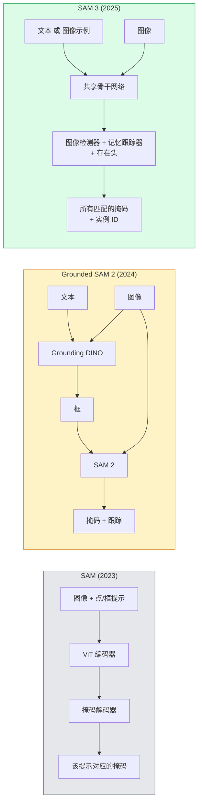

# SAM 3 与开放词汇分割 (Open-Vocabulary Segmentation)

> 给模型一个文本提示和一张图像，它就能返回所有匹配对象的 mask。SAM 3 把这件事变成了一次前向传播。

**类型：** 使用 + 构建
**语言：** Python
**前置课程：** 第 4 阶段第 07 课（U-Net）、第 4 阶段第 08 课（Mask R-CNN）、第 4 阶段第 18 课（CLIP）
**时长：** ~60 分钟

## 学习目标

- 区分 SAM（只支持视觉提示）、Grounded SAM / SAM 2（检测器 + SAM）以及 SAM 3（通过可提示概念分割 (Promptable Concept Segmentation, PCS) 原生支持文本提示）
- 解释 SAM 3 的架构：共享骨干网络 + 图像检测器 + 基于记忆的视频跟踪器 + 存在头 (presence head) + 解耦的检测器-跟踪器 (detector-tracker) 设计
- 使用 Hugging Face `transformers` 中的 SAM 3 集成来完成基于文本提示的检测、分割和视频跟踪
- 根据延迟、概念复杂度和部署目标，在 SAM 3、Grounded SAM 2、YOLO-World 和 SAM-MI 之间做选择

## 问题

2023 年的 SAM 只支持视觉提示：你点击一个点或者画一个框，它就返回一个 mask。如果你想做“把这张照片里所有橙子都给我找出来”，就需要先用 detector（Grounding DINO）产出框，再交给 SAM 去分割每一个实例。Grounded SAM 把它变成了一条流水线，但本质上仍然是两个冻结模型级联，因此不可避免会累积误差。

SAM 3（Meta，2025 年 11 月，ICLR 2026）把这条级联链路压缩掉了。它接收一个简短名词短语或一个图像示例作为提示，并在一次前向传播中返回图像里所有匹配的 mask 和实例 ID。这就是**可提示概念分割 (Promptable Concept Segmentation, PCS)**。再加上 2026 年 3 月的 Object Multiplex 更新（SAM 3.1），它还能够高效地在视频中跟踪同一概念的多个实例。

这节课关注的是这种结构性转变。2D 分割、检测和文本-图像 grounding 已经合并为一个模型。生产中的问题不再是“我要把哪些流水线串起来”，而是“哪个可提示模型能端到端处理我的用例”。

## 概念

### 三代系统



### 可提示概念分割

“概念提示”是一个简短名词短语（`"yellow school bus"`、`"striped red umbrella"`、`"hand holding a mug"`）或一个图像示例。模型会返回图像中所有与该概念匹配实例的分割 mask，以及每个匹配实例对应的唯一实例 ID。

这和经典的视觉提示式 SAM 有三点不同：

1. 不需要逐实例提示——一个文本提示就能返回所有匹配项。
2. 开放词汇 (open-vocabulary) —— 这个概念可以是任何能用自然语言描述的东西。
3. 一次返回多个实例，而不是每个提示只返回一个 mask。

### 关键架构组件

- **共享骨干网络** —— 单个 ViT 处理图像，detector head 和基于记忆的 tracker 都从中读取特征。
- **存在头 (presence head)** —— 预测这个概念是否真的出现在图像中。把“它在不在这里？”和“它在哪里？”解耦，从而减少对不存在概念的误检。
- **解耦的 detector-tracker** —— 图像级检测和视频级跟踪使用不同的 head，因此不会互相干扰。
- **记忆库 (memory bank)** —— 为视频跟踪跨帧存储每个实例的特征（和 SAM 2 使用的是同一种机制）。

### 大规模训练

SAM 3 在**400 万个独特概念**上完成训练，这些概念来自一个通过 AI + 人工审核不断迭代标注与纠错的数据引擎。新的 **SA-CO benchmark** 含有 27 万个独特概念，比此前的 benchmark 大 50 倍。SAM 3 在 SA-CO 上达到了人类表现的 75-80%，并在图像 + 视频 PCS 任务上把现有系统的成绩翻倍。

### SAM 3.1 Object Multiplex

2026 年 3 月更新：**Object Multiplex** 引入了一种共享记忆机制，可以联合跟踪同一概念下的多个实例。此前，如果要跟踪 N 个实例，就需要 N 个独立的记忆库。Multiplex 将其压缩为一个共享记忆，再配合逐实例查询。结果是在不牺牲精度的前提下，大幅加快多目标跟踪速度。

### 为什么 Grounded SAM 在 2026 年仍然重要

- 当你需要替换成特定的开放词汇 detector（DINO-X、Florence-2）时。
- 当 SAM 3 的许可证（在 HF 上受限）成为阻碍时。
- 当你需要比 SAM 3 暴露出来的阈值更细的 detector 控制时。
- 当你在做 detector 组件相关的研究 / 消融实验时。

模块化流水线依然有其位置。但对于大多数生产工作，SAM 3 是更简单的答案。

### YOLO-World vs SAM 3

- **YOLO-World** —— 只是开放词汇 detector（没有 mask）。实时。最适合需要高 fps 边框输出的场景。
- **SAM 3** —— 提供完整的分割 + 跟踪。速度更慢，但输出更丰富。

生产中的分工是：YOLO-World 用于只需要快速检测的流水线（机器人导航、快速看板），SAM 3 用于任何需要 mask 或跟踪的场景。

### SAM-MI 的效率

SAM-MI（2025-2026）针对 SAM 的 decoder 瓶颈进行优化。关键思路：

- **Sparse point prompting** —— 使用少量精心挑选的点，而不是密集提示；将 decoder 调用减少 96%。
- **Shallow mask aggregation** —— 把粗糙的 mask 预测合并成一个更锐利的 mask。
- **Decoupled mask injection** —— decoder 接收预先计算好的 mask 特征，而不是重复运行。

结果：在开放词汇 benchmark 上，相比 Grounded-SAM 约有 ~1.6× 的加速。

### 三种模型的输出格式

它们都会返回同一种总体结构（boxes + labels + scores + masks + IDs），这非常有帮助——你的下游流水线不需要根据运行的是哪一个模型来分支。

## 动手实现

### 第 1 步：构造提示

构建一个辅助函数，把用户输入的句子变成一组 SAM 3 概念提示。这就是“用户输入了什么”和“模型真正消费什么”之间的边界。

```python
def split_concepts(sentence):
    """
    Heuristic splitter for multi-concept prompts.
    Returns list of short noun phrases.
    """
    for sep in [",", ";", "and", "or", "&"]:
        if sep in sentence:
            parts = [p.strip() for p in sentence.replace("and ", ",").split(",")]
            return [p for p in parts if p]
    return [sentence.strip()]

print(split_concepts("cats, dogs and balloons"))
```

SAM 3 每次前向传播只接受一个概念；对于多概念查询，可以循环处理或批量处理。

### 第 2 步：后处理辅助函数

把 SAM 3 的原始输出转换成一份干净的检测列表，使之符合我们第 4 阶段第 16 课流水线约定的接口。

```python
from dataclasses import dataclass
from typing import List

@dataclass
class ConceptDetection:
    concept: str
    instance_id: int
    box: tuple          # (x1, y1, x2, y2)
    score: float
    mask_rle: str       # run-length encoded


def rle_encode(binary_mask):
    flat = binary_mask.flatten().astype("uint8")
    runs = []
    prev, count = flat[0], 0
    for v in flat:
        if v == prev:
            count += 1
        else:
            runs.append((int(prev), count))
            prev, count = v, 1
    runs.append((int(prev), count))
    return ";".join(f"{v}x{c}" for v, c in runs)
```

游程长度编码 (run-length encoded, RLE) 可以让响应负载在拥有许多高分辨率 mask 时依然保持较小。SAM 2、SAM 3、Grounded SAM 2 都可以使用同一种格式。

### 第 3 步：统一的开放词汇分割接口

把你手头的任何后端（SAM 3、Grounded SAM 2、YOLO-World + SAM 2）包装到同一个方法后面。后端变了，你的下游代码不需要跟着变。

```python
from abc import ABC, abstractmethod
import numpy as np

class OpenVocabSeg(ABC):
    @abstractmethod
    def detect(self, image: np.ndarray, concept: str) -> List[ConceptDetection]:
        ...


class StubOpenVocabSeg(OpenVocabSeg):
    """
    Deterministic stub used for pipeline testing when real models are not loaded.
    """
    def detect(self, image, concept):
        h, w = image.shape[:2]
        return [
            ConceptDetection(
                concept=concept,
                instance_id=0,
                box=(w * 0.2, h * 0.3, w * 0.5, h * 0.8),
                score=0.89,
                mask_rle="0x100;1x50;0x200",
            ),
            ConceptDetection(
                concept=concept,
                instance_id=1,
                box=(w * 0.55, h * 0.25, w * 0.85, h * 0.75),
                score=0.74,
                mask_rle="0x80;1x40;0x220",
            ),
        ]
```

真正的 `SAM3OpenVocabSeg` 子类会包装 `transformers.Sam3Model` 和 `Sam3Processor`。

### 第 4 步：Hugging Face 中的 SAM 3 用法（参考）

对于真实模型，`transformers` 的集成方式如下：

```python
from transformers import Sam3Processor, Sam3Model
import torch

processor = Sam3Processor.from_pretrained("facebook/sam3")
model = Sam3Model.from_pretrained("facebook/sam3").eval()

inputs = processor(images=pil_image, return_tensors="pt")
inputs = processor.set_text_prompt(inputs, "yellow school bus")

with torch.no_grad():
    outputs = model(**inputs)

masks = processor.post_process_masks(
    outputs.masks, inputs.original_sizes, inputs.reshaped_input_sizes
)
boxes = outputs.boxes
scores = outputs.scores
```

一个提示，一次调用，返回所有匹配项。

### 第 5 步：量化 Grounded SAM 2 原本免费提供给你的东西

一个诚实的基准问题：当你在真实流水线中把 Grounded SAM 2 替换为 SAM 3 时，会发生什么？

- 延迟：SAM 3 少了一次前向传播（不再需要单独 detector），但模型本身更重；通常总体持平或略快一些。
- 精度：SAM 3 在稀有概念或组合概念（“striped red umbrella”）上明显更好。对常见的单词概念则相近。
- 灵活性：Grounded SAM 2 允许你替换 detector（DINO-X、Florence-2、Grounding DINO 1.5）；SAM 3 则是单体式模型。

结论：SAM 3 是 2026 年开放词汇分割的默认选择。当你需要 detector 灵活性或不同许可证条款时，Grounded SAM 2 仍然是正确答案。

## 使用

生产部署模式：

- **实时标注** —— SAM 3 + CVAT 的 label-as-text-prompt 功能。标注员选择标签名；SAM 3 为所有匹配实例预标注。然后再审核与修正。
- **视频分析** —— 使用 SAM 3.1 Object Multiplex 做多目标跟踪；把视频帧送入基于记忆的 tracker。
- **机器人** —— SAM 3 用于开放词汇操控（“pick up the red cup”）；作为规划原语运行。
- **医学影像** —— 在医学概念上微调过的 SAM 3；需要在 HF 上申请访问权限。

Ultralytics 在它的 Python 包中封装了 SAM 3：

```python
from ultralytics import SAM

model = SAM("sam3.pt")
results = model(image_path, prompts="yellow school bus")
```

接口与 YOLO 和 SAM 2 保持一致。

## 交付

本课会产出：

- `outputs/prompt-open-vocab-stack-picker.md` —— 一个会根据延迟、概念复杂度和许可证，在 SAM 3 / Grounded SAM 2 / YOLO-World / SAM-MI 之间做选择的提示词。
- `outputs/skill-concept-prompt-designer.md` —— 一个能把用户话语转成高质量 SAM 3 概念提示（切分、消歧、回退策略）的 skill。

## 练习

1. **（简单）** 在 10 张图像上运行 SAM 3，概念提示由你自己选择。再在同一批图像上与 SAM 2 + Grounding DINO 1.5 对比。报告每个模型漏掉了哪些概念。
2. **（中等）** 在 SAM 3 之上构建一个“点击包含 / 点击排除”UI：文本提示先返回候选实例；用户再点击决定哪些应被视为正样本。最终把概念集合输出为 JSON。
3. **（困难）** 在一个自定义概念集合（例如 5 类电子元件）上微调 SAM 3，每类各有 20 张标注图像。与同一测试集上的零样本 SAM 3 做对比；测量 mask IoU 的提升。

## 关键术语

| 术语 | 人们怎么说 | 实际含义 |
|------|----------------|----------------------|
| Open-vocabulary segmentation | “按文本做分割” | 为自然语言描述的对象生成 mask，而不是限定在固定标签集合中 |
| PCS | “可提示概念分割” | SAM 3 的核心任务——给定一个名词短语或图像示例，分割所有匹配实例 |
| Concept prompt | “文本输入” | 简短名词短语或图像示例；不是完整句子 |
| Presence head | “它在这里吗？” | SAM 3 中在定位前先判断概念是否存在于图像中的模块 |
| SA-CO | “SAM 3 benchmark” | 含 27 万概念的开放词汇分割 benchmark；规模比此前开放词汇 benchmark 大 50 倍 |
| Object Multiplex | “SAM 3.1 更新” | 基于共享记忆的多目标跟踪；可快速联合跟踪许多实例 |
| Grounded SAM 2 | “模块化流水线” | detector + SAM 2 级联；在 detector 可替换性很重要时仍然有价值 |
| SAM-MI | “高效 SAM 变体” | 通过 Mask Injection 实现相对 Grounded-SAM 1.6x 加速 |

## 延伸阅读

- [SAM 3: Segment Anything with Concepts (arXiv 2511.16719)](https://arxiv.org/abs/2511.16719)
- [SAM 3.1 Object Multiplex (Meta AI, March 2026)](https://ai.meta.com/blog/segment-anything-model-3/)
- [SAM 3 model page on Hugging Face](https://huggingface.co/facebook/sam3)
- [Grounded SAM 2 tutorial (PyImageSearch)](https://pyimagesearch.com/2026/01/19/grounded-sam-2-from-open-set-detection-to-segmentation-and-tracking/)
- [Ultralytics SAM 3 docs](https://docs.ultralytics.com/models/sam-3/)
- [SAM3-I: Instruction-aware SAM (arXiv 2512.04585)](https://arxiv.org/abs/2512.04585)
