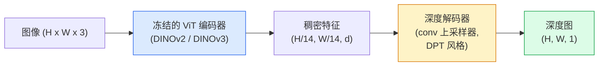

# 单目深度 (Monocular Depth) 与几何估计 (Geometry Estimation)

> 深度图 (depth map) 是一种单通道图像，其中每个像素都表示到相机的距离。过去，如果没有双目或 LiDAR，仅从一帧 RGB 图像来预测它几乎是不可能的。到了 2026 年，一个冻结的 ViT 编码器加上一个轻量级头部，就能把误差做到只比真实值高几个百分点。

**类型：** 构建 + 使用
**语言：** Python
**前置要求：** 第 4 阶段第 14 课（ViT）、第 4 阶段第 17 课（自监督视觉）、第 4 阶段第 07 课（U-Net）
**时间：** ~60 分钟

## 学习目标

- 区分相对深度 (relative depth) 与度量深度 (metric depth)，并说明每个生产模型（MiDaS、Marigold、Depth Anything V3、ZoeDepth）分别解决哪一种
- 使用 Depth Anything V3（DINOv2 主干）为任意单张图像预测深度，无需任何标定
- 解释为什么单目深度从单张图像中居然可行（透视线索、纹理梯度、学习到的先验），以及它无法恢复什么（绝对尺度、被遮挡的几何）
- 使用深度图和小孔相机内参 (pinhole camera intrinsics) 将 2D 检测提升为 3D 点

## 问题

深度是 2D 计算机视觉中缺失的那一个轴。给定 RGB，你知道物体出现在图像平面的哪里；你并不知道它们有多远。深度传感器（双目系统、LiDAR、飞行时间传感器）可以直接解决这个问题，但它们价格高、脆弱，而且量程有限。

单目深度估计 (monocular depth estimation)——即从单张 RGB 帧预测深度——过去的输出往往模糊且不可靠。到 2026 年，大型预训练编码器改变了这一点：Depth Anything V3 使用冻结的 DINOv2 主干，并能在室内、室外、医疗和卫星等多个领域泛化出深度图。Marigold 将深度重构为一个条件扩散问题。ZoeDepth 则回归真实的度量距离。

深度也是连接 2D 检测与 3D 理解的桥梁：把检测框中的像素乘上深度，你就能把 2D 物体提升进一个 3D 点云 (point cloud)。这正是所有 AR 遮挡系统、所有避障流水线，以及所有“拿起杯子”机器人背后的核心。

## 概念

### 相对深度 (relative depth) vs 度量深度 (metric depth)

- **相对深度** —— 有顺序的 `z` 值，但没有真实世界单位。“像素 A 比像素 B 更近，但距离比例并没有锚定到米。”
- **度量深度** —— 从相机出发、以米为单位的绝对距离。要求模型已经学到了图像线索与真实距离之间的统计关系。

MiDaS 和 Depth Anything V3 产生相对深度。Marigold 产生相对深度。ZoeDepth、UniDepth 和 Metric3D 产生度量深度。度量模型对相机内参很敏感；相对模型则不敏感。

### 编码器-解码器 (encoder-decoder) 模式



Depth Anything V3 会冻结编码器，只训练 DPT 风格的解码器。编码器提供丰富特征；解码器把这些特征插值回图像分辨率并回归深度。

### 为什么单张图像也能产生深度

一张 2D 图像中包含许多与深度相关的单目线索 (monocular cues)：

- **透视** —— 3D 中平行的线在 2D 中会汇聚。
- **纹理梯度** —— 远处表面的纹理更小、更密。
- **遮挡顺序** —— 较近的物体会遮挡较远的物体。
- **尺寸恒常性** —— 已知物体（汽车、人）提供近似尺度。
- **大气透视** —— 在室外场景中，远处物体看起来更朦胧、更偏蓝。

在数十亿张图像上训练过的 ViT 会把这些线索内化。只要数据足够、主干足够强，单目深度即便没有任何显式 3D 监督，也能达到合理精度。

### 单目深度做不到什么

- **没有内参或场景中已知物体时的绝对度量尺度**。网络可以预测“杯子比勺子远两倍”，但不知道杯子距离是 1 米还是 10 米。
- **被遮挡的几何** —— 椅子的背面不可见，因此无法可靠推断。
- **真正无纹理 / 强反射表面** —— 镜子、玻璃、纯色墙面。网络会给出看似合理但实际上错误的深度。

### 2026 年的 Depth Anything V3

- 使用原版 DINOv2 ViT-L/14 作为编码器（冻结）。
- DPT 解码器。
- 在来自多样数据源的带位姿图像对上训练（除光度一致性之外，无需显式深度监督）。
- 能从**任意数量的视觉输入中预测空间一致的几何，无论是否已知相机位姿**。
- 在单目深度、任意视角几何、视觉渲染、相机位姿估计等任务上达到 SOTA。

这就是 2026 年你需要深度时可直接调用的即插即用模型。

### Marigold —— 用于深度的扩散 (diffusion)

Marigold（Ke et al., CVPR 2024）把深度估计重构为条件式图像到图像扩散。条件：RGB。目标：深度图。它使用一个预训练的 Stable Diffusion 2 U-Net 作为主干。输出的深度图在物体边界处异常锐利。代价：推理速度比前馈模型更慢（10-50 个去噪步骤）。

### 内参与小孔相机 (pinhole camera)

要把一个深度为 `d` 的像素 `(u, v)` 提升为相机坐标系中的 3D 点 `(X, Y, Z)`：

```
fx, fy, cx, cy = camera intrinsics
X = (u - cx) * d / fx
Y = (v - cy) * d / fy
Z = d
```

内参可以来自 EXIF 元数据、标定板，或单目内参估计器（Perspective Fields、UniDepth）。没有内参时，你仍然可以通过假设 60-70° 的视场角和适中的主点位置来渲染点云——足够做可视化，但不适合做测量。

### 评估

两个标准指标：

- **AbsRel**（绝对相对误差）：`mean(|d_pred - d_gt| / d_gt)`。越低越好。生产模型通常在 0.05-0.1。
- **delta &lt; 1.25**（阈值精度）：满足 `max(d_pred/d_gt, d_gt/d_pred) &lt; 1.25` 的像素占比。越高越好。SOTA 可达 0.9+。

对于相对深度（Depth Anything V3、MiDaS），评估会使用这两个指标的尺度和平移不变版本。

## 构建它

### 第 1 步：深度指标

```python
import torch

def abs_rel_error(pred, target, mask=None):
    if mask is not None:
        pred = pred[mask]
        target = target[mask]
    return (torch.abs(pred - target) / target.clamp(min=1e-6)).mean().item()


def delta_accuracy(pred, target, threshold=1.25, mask=None):
    if mask is not None:
        pred = pred[mask]
        target = target[mask]
    ratio = torch.maximum(pred / target.clamp(min=1e-6), target / pred.clamp(min=1e-6))
    return (ratio < threshold).float().mean().item()
```

评估前一定要先屏蔽无效深度像素（零、NaN、饱和）。

### 第 2 步：尺度-平移对齐 (scale-and-shift alignment)

对于相对深度模型，在计算指标前要先把预测结果对齐到真实值。对 `a * pred + b = target` 做最小二乘拟合：

```python
def align_scale_shift(pred, target, mask=None):
    if mask is not None:
        p = pred[mask]
        t = target[mask]
    else:
        p = pred.flatten()
        t = target.flatten()
    A = torch.stack([p, torch.ones_like(p)], dim=1)
    coeffs, *_ = torch.linalg.lstsq(A, t.unsqueeze(-1))
    a, b = coeffs[:2, 0]
    return a * pred + b
```

在评估 MiDaS / Depth Anything 时，应先运行 `align_scale_shift`，再计算 `abs_rel_error`。

### 第 3 步：把深度提升为点云

```python
import numpy as np

def depth_to_point_cloud(depth, intrinsics):
    H, W = depth.shape
    fx, fy, cx, cy = intrinsics
    v, u = np.meshgrid(np.arange(H), np.arange(W), indexing="ij")
    z = depth
    x = (u - cx) * z / fx
    y = (v - cy) * z / fy
    return np.stack([x, y, z], axis=-1)


depth = np.random.uniform(0.5, 4.0, (240, 320))
intr = (320.0, 320.0, 160.0, 120.0)
pc = depth_to_point_cloud(depth, intr)
print(f"point cloud shape: {pc.shape}  (H, W, 3)")
```

一个函数，覆盖所有 3D 提升应用。把点云导出成 `.ply`，再用 MeshLab 或 CloudCompare 打开。

### 第 4 步：用合成深度场景做冒烟测试

```python
def synthetic_depth(size=96):
    yy, xx = np.meshgrid(np.arange(size), np.arange(size), indexing="ij")
    # Floor: linear gradient from near (top) to far (bottom)
    depth = 1.0 + (yy / size) * 4.0
    # Box in the middle: closer
    mask = (np.abs(xx - size / 2) < size / 6) & (np.abs(yy - size * 0.6) < size / 6)
    depth[mask] = 2.0
    return depth.astype(np.float32)


gt = torch.from_numpy(synthetic_depth(96))
pred = gt + 0.3 * torch.randn_like(gt)  # simulated prediction
aligned = align_scale_shift(pred, gt)
print(f"before align  absRel = {abs_rel_error(pred, gt):.3f}")
print(f"after align   absRel = {abs_rel_error(aligned, gt):.3f}")
```

### 第 5 步：Depth Anything V3 的用法（参考）

```python
import torch
from transformers import pipeline
from PIL import Image

pipe = pipeline(task="depth-estimation", model="LiheYoung/depth-anything-v2-large")

image = Image.open("street.jpg").convert("RGB")
out = pipe(image)
depth_np = np.array(out["depth"])
```

三行代码。`out["depth"]` 是一个 PIL 灰度图；把它转成 numpy 以便做数学运算。若要切换到 Depth Anything V3，只需在发布后替换 model id；API 不变。

## 使用它

- **Depth Anything V3**（Meta AI / ByteDance，2024-2026）—— 相对深度的默认选择。生产环境中使用 ViT-large 主干时最快的模型。
- **Marigold**（ETH，2024）—— 视觉质量最高，但推理较慢。
- **UniDepth**（ETH，2024）—— 带相机内参估计的度量深度。
- **ZoeDepth**（Intel，2023）—— 度量深度；较老，但仍然可靠。
- **MiDaS v3.1** —— 传统但稳定；适合做对比基线。

典型集成模式：

1. RGB 帧到达。
2. 深度模型生成深度图。
3. 检测器生成框。
4. 将框的中心点通过深度提升到 3D；如果有点云，则与之融合。
5. 下游用途：AR 遮挡、路径规划、物体尺寸估计、替代双目。

对于实时场景，Depth Anything V2 Small（INT8 量化）在消费级 GPU 上、518x518 分辨率可达到约 30 fps。

## 交付它

本课会产出：

- `outputs/prompt-depth-model-picker.md` —— 根据延迟、是否需要度量深度或相对深度，以及场景类型，在 Depth Anything V3、Marigold、UniDepth、MiDaS 之间进行选择。
- `outputs/skill-depth-to-pointcloud.md` —— 一个技能，用正确的内参处理和 `.ply` 导出，从深度图构建点云。

## 练习

1. **（简单）** 在你桌面的任意 10 张图像上运行 Depth Anything V2。把深度保存为灰度 PNG 并检查。找出一个预测深度看起来不对的物体，并解释为什么单目线索失效了。
2. **（中等）** 给定来自 Depth Anything V2 的 RGB + 深度，将其提升为点云并用 `open3d` 渲染。比较两个场景（室内 / 室外），并说明哪个看起来更可信。
3. **（困难）** 取五组仅在某个已知物体位置上不同的图像对（例如瓶子向前移动了 30 cm）。用 UniDepth 在两张图上预测度量深度。报告预测的距离差值与真实 30 cm 的对比。

## 关键术语

| 术语 | 人们常说 | 实际含义 |
|------|----------|----------|
| 单目深度 | “单张图像深度” | 从一帧 RGB 中估计深度，不用双目也不用 LiDAR |
| 相对深度 | “有序深度” | 只有顺序的 z 值，没有真实世界单位 |
| 度量深度 | “绝对距离” | 以米为单位的深度；需要标定或用度量监督训练过的模型 |
| AbsRel | “绝对相对误差” | |d_pred - d_gt| / d_gt 的平均值；标准深度指标 |
| Delta 准确率 | “delta &lt; 1.25” | 预测值位于真实值 25% 范围内的像素占比 |
| 小孔相机 | “fx, fy, cx, cy” | 用于把 (u, v, d) 提升到 (X, Y, Z) 的相机模型 |
| DPT | “Dense Prediction Transformer” | 叠加在冻结 ViT 编码器之上的、基于 conv 的深度解码器 |
| DINOv2 主干 | “它之所以有效的原因” | 无需深度标签、却能跨领域泛化的自监督特征 |

## 延伸阅读

- [Depth Anything V3 paper page](https://depth-anything.github.io/) —— 使用 DINOv2 编码器的 SOTA 单目深度
- [Marigold (Ke et al., CVPR 2024)](https://marigoldmonodepth.github.io/) —— 基于扩散的深度估计
- [UniDepth (Piccinelli et al., 2024)](https://arxiv.org/abs/2403.18913) —— 带内参的度量深度
- [MiDaS v3.1 (Intel ISL)](https://github.com/isl-org/MiDaS) —— 经典的相对深度基线
- [DINOv3 blog post (Meta)](https://ai.meta.com/blog/dinov3-self-supervised-vision-model/) —— 提升深度精度的编码器家族
