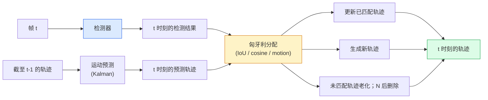

# 多目标跟踪 (Multi-Object Tracking) 与视频记忆 (Video Memory)

> 跟踪就是检测加关联 (association)。在每一帧都做检测。把当前帧的检测结果按 ID 匹配到上一帧的轨迹。

**类型：** 构建
**语言：** Python
**前置要求：** 第 4 阶段第 06 课（YOLO Detection）、第 4 阶段第 08 课（Mask R-CNN）、第 4 阶段第 24 课（SAM 3）
**时间：** ~60 分钟

## 学习目标

- 区分基于检测的跟踪 (tracking-by-detection) 与基于查询的跟踪 (query-based tracking)，并说出这些算法家族（SORT、DeepSORT、ByteTrack、BoT-SORT、SAM 2 memory tracker、SAM 3.1 Object Multiplex）
- 从零实现经典基于检测跟踪所需的 IoU + 匈牙利分配 (Hungarian assignment)
- 解释 SAM 2 的记忆库 (memory bank)，以及为什么它比基于 IoU 的关联更能处理遮挡
- 读懂三个跟踪指标（MOTA、IDF1、HOTA），并根据具体使用场景判断哪个最重要

## 问题

检测器只能告诉你单帧中物体在哪里。跟踪器则告诉你：在帧 `t` 中的哪个检测，与帧 `t-1` 中的哪个检测其实是同一个物体。没有它，你就无法统计有多少物体跨过一条线、在遮挡中持续跟住一个球，或者知道“4 号车已经在这个车道里待了 8 秒”。

跟踪对所有面向视频的产品都至关重要：体育分析、监控、自动驾驶、医学视频分析、野生动物监测、文字标记计数。核心构件都是共享的：逐帧检测器、运动模型（Kalman filter 或更强的东西）、关联步骤（在 IoU / 余弦相似度 / 学习特征上运行匈牙利算法），以及轨迹生命周期（生成、更新、终止）。

2026 年带来了两种新模式：**基于 SAM 2 记忆的跟踪**（用特征记忆代替运动模型关联）以及 **SAM 3.1 Object Multiplex**（为同一概念的多个实例共享记忆）。本课先走一遍经典栈，再介绍基于记忆的方法。

## 概念

### 基于检测的跟踪



你在 2026 年会遇到的每个跟踪器，都是这个循环的某种变体。差别在于：

- **SORT**（2016）：Kalman filter + IoU Hungarian。简单、快速、没有外观模型。
- **DeepSORT**（2017）：SORT + 每条轨迹一个基于 CNN 的外观特征（ReID embedding）。更能处理交叉穿行。
- **ByteTrack**（2021）：把低置信度检测作为第二阶段来关联；不需要外观特征，但在 MOT17 上表现顶尖。
- **BoT-SORT**（2022）：Byte + 相机运动补偿 + ReID。
- **StrongSORT / OC-SORT** —— ByteTrack 的后代，拥有更好的运动与外观建模。

### 用一段话理解 Kalman filter

Kalman filter 会为每条轨迹维护一个状态 `(x, y, w, h, dx, dy, dw, dh)` 及其协方差。每一帧先用恒速模型对状态做**预测**，再用匹配到的检测做**更新**。当预测不确定性很高时，更新会更相信检测结果。这带来了平滑轨迹，也让系统可以在短暂遮挡（1-5 帧）期间继续维持轨迹。

每个经典跟踪器都会在运动预测步骤里使用 Kalman filter。

### 匈牙利算法

给定一个 `M x N` 的代价矩阵（轨迹 x 检测），找出使总代价最小的一对一分配。代价通常是 `1 - IoU(track_bbox, detection_bbox)`，或者外观特征的负余弦相似度。运行时间为 O((M+N)^3)；当 M、N 不超过约 1000 时，通过 `scipy.optimize.linear_sum_assignment` 在 Python 中已经足够快。

### ByteTrack 的关键思想

标准跟踪器会丢掉低置信度检测（&lt; 0.5）。ByteTrack 会保留它们作为**第二阶段候选**：在轨迹先与高置信度检测匹配之后，未匹配的轨迹会再尝试与低置信度检测匹配，并使用稍微宽松一点的 IoU 阈值。这能恢复短遮挡，并减少人群附近的 ID switch。

### 基于 SAM 2 记忆的跟踪

SAM 2 处理视频的方式，是维护一个按实例组织的时空特征**记忆库**。给定某一帧上的提示（点击、框、文本），它会把该实例编码进记忆。之后在每一帧里，记忆会与新帧特征做交叉注意力，解码器则输出该实例在新帧中的掩码。

没有 Kalman filter，也没有匈牙利分配。关联被隐式地包含在记忆注意力操作之中。

优点：
- 对大幅遮挡很稳健（记忆能在多帧之间携带实例身份）。
- 与 SAM 3 的文本提示结合时支持开放词汇。
- 不需要单独的运动模型。

缺点：
- 对很多目标做跟踪时，比 ByteTrack 更慢。
- 记忆库会增长；上下文窗口因此受限。

### SAM 3.1 Object Multiplex

以往的 SAM 2 / SAM 3 跟踪会为每个实例维护一个独立记忆库。50 个物体，就有 50 个记忆库。Object Multiplex（2026 年 3 月）把这些记忆库折叠成一个共享记忆，再配合**按实例区分的查询 token**。其代价相对于实例数量呈次线性增长。

Multiplex 已经成为 2026 年人群跟踪的默认方案：演唱会人群、仓库工人、交通路口。

### 三个你必须知道的指标

- **MOTA（Multi-Object Tracking Accuracy）** —— 1 - (FN + FP + ID switches) / GT。它按错误类型加权，是一个把检测失败和关联失败混在一起的单一指标。
- **IDF1（ID F1）** —— ID precision 与 recall 的调和平均。它专门关注每条真实轨迹在时间上保持 ID 的能力。对那些对 ID switch 很敏感的任务，它比 MOTA 更好。
- **HOTA（Higher Order Tracking Accuracy）** —— 将结果拆分为检测准确率（DetA）和关联准确率（AssA）。自 2020 年以来，它已经成为社区标准，也是最全面的指标。

对于监控（谁是谁）：你应该报告 IDF1。对于体育分析（统计传球）：HOTA。对于一般学术对比：HOTA。

## 构建它

### 第 1 步：基于 IoU 的代价矩阵

```python
import numpy as np


def bbox_iou(a, b):
    """
    a, b: (N, 4) arrays of [x1, y1, x2, y2].
    Returns (N_a, N_b) IoU matrix.
    """
    ax1, ay1, ax2, ay2 = a[:, 0], a[:, 1], a[:, 2], a[:, 3]
    bx1, by1, bx2, by2 = b[:, 0], b[:, 1], b[:, 2], b[:, 3]
    inter_x1 = np.maximum(ax1[:, None], bx1[None, :])
    inter_y1 = np.maximum(ay1[:, None], by1[None, :])
    inter_x2 = np.minimum(ax2[:, None], bx2[None, :])
    inter_y2 = np.minimum(ay2[:, None], by2[None, :])
    inter = np.clip(inter_x2 - inter_x1, 0, None) * np.clip(inter_y2 - inter_y1, 0, None)
    area_a = (ax2 - ax1) * (ay2 - ay1)
    area_b = (bx2 - bx1) * (by2 - by1)
    union = area_a[:, None] + area_b[None, :] - inter
    return inter / np.clip(union, 1e-8, None)
```

### 第 2 步：最小化的 SORT 风格跟踪器

为简洁起见，这里省略了固定恒速的 Kalman；我们只使用简单的 IoU 关联。在生产环境里，Kalman 预测是必不可少的。`sort` Python 包提供了完整版本。

```python
from scipy.optimize import linear_sum_assignment


class Track:
    def __init__(self, tid, bbox, frame):
        self.id = tid
        self.bbox = bbox
        self.last_frame = frame
        self.hits = 1

    def update(self, bbox, frame):
        self.bbox = bbox
        self.last_frame = frame
        self.hits += 1


class SimpleTracker:
    def __init__(self, iou_threshold=0.3, max_age=5):
        self.tracks = []
        self.next_id = 1
        self.iou_threshold = iou_threshold
        self.max_age = max_age

    def step(self, detections, frame):
        if not self.tracks:
            for d in detections:
                self.tracks.append(Track(self.next_id, d, frame))
                self.next_id += 1
            return [(t.id, t.bbox) for t in self.tracks]

        track_boxes = np.array([t.bbox for t in self.tracks])
        det_boxes = np.array(detections) if len(detections) else np.empty((0, 4))

        iou = bbox_iou(track_boxes, det_boxes) if len(det_boxes) else np.zeros((len(track_boxes), 0))
        cost = 1 - iou
        cost[iou < self.iou_threshold] = 1e6

        matched_track = set()
        matched_det = set()
        if cost.size > 0:
            row, col = linear_sum_assignment(cost)
            for r, c in zip(row, col):
                if cost[r, c] < 1.0:
                    self.tracks[r].update(det_boxes[c], frame)
                    matched_track.add(r); matched_det.add(c)

        for i, d in enumerate(det_boxes):
            if i not in matched_det:
                self.tracks.append(Track(self.next_id, d, frame))
                self.next_id += 1

        self.tracks = [t for t in self.tracks if frame - t.last_frame <= self.max_age]
        return [(t.id, t.bbox) for t in self.tracks]
```

60 行代码。输入逐帧检测，输出逐帧轨迹 ID。真实系统会再加上 Kalman 预测、ByteTrack 的第二阶段重匹配，以及外观特征。

### 第 3 步：合成轨迹测试

```python
def synthetic_frames(num_frames=20, num_objects=3, H=240, W=320, seed=0):
    rng = np.random.default_rng(seed)
    starts = rng.uniform(20, 200, size=(num_objects, 2))
    velocities = rng.uniform(-5, 5, size=(num_objects, 2))
    frames = []
    for f in range(num_frames):
        dets = []
        for i in range(num_objects):
            cx, cy = starts[i] + f * velocities[i]
            dets.append([cx - 10, cy - 10, cx + 10, cy + 10])
        frames.append(dets)
    return frames


tracker = SimpleTracker()
for f, dets in enumerate(synthetic_frames()):
    tracks = tracker.step(dets, f)
```

三个做直线运动的物体，应该在全部 20 帧中都保持自己的 ID。

### 第 4 步：ID-switch 指标

```python
def count_id_switches(tracks_per_frame, gt_per_frame):
    """
    tracks_per_frame:  list of list of (track_id, bbox)
    gt_per_frame:      list of list of (gt_id, bbox)
    Returns number of ID switches.
    """
    prev_assignment = {}
    switches = 0
    for tracks, gts in zip(tracks_per_frame, gt_per_frame):
        if not tracks or not gts:
            continue
        t_boxes = np.array([b for _, b in tracks])
        g_boxes = np.array([b for _, b in gts])
        iou = bbox_iou(g_boxes, t_boxes)
        for g_idx, (gt_id, _) in enumerate(gts):
            j = iou[g_idx].argmax()
            if iou[g_idx, j] > 0.5:
                t_id = tracks[j][0]
                if gt_id in prev_assignment and prev_assignment[gt_id] != t_id:
                    switches += 1
                prev_assignment[gt_id] = t_id
    return switches
```

这是一个简化版、接近 IDF1 的指标：统计一个真实物体被分配到的预测轨迹 ID 改变了多少次。真正的 MOTA / IDF1 / HOTA 工具链可以在 `py-motmetrics` 和 `TrackEval` 中找到。

## 使用它

2026 年生产中常见的跟踪器：

- `ultralytics` —— 内置 YOLOv8 + ByteTrack / BoT-SORT。`results = model.track(source, tracker="bytetrack.yaml")`。默认选择。
- `supervision`（Roboflow）—— ByteTrack 封装器加标注工具。
- SAM 2 / SAM 3.1 —— 通过 `processor.track()` 做基于记忆的跟踪。
- 自定义栈：检测器（YOLOv8 / RT-DETR）+ `sort-tracker` / `OC-SORT` / `StrongSORT`。

如何选择：

- 行人 / 汽车 / 箱子，且需要 30+ fps：**使用 ultralytics 的 ByteTrack**。
- 在拥挤场景中跟踪同一类别的大量实例：**SAM 3.1 Object Multiplex**。
- 遮挡严重且外观可区分：**DeepSORT / StrongSORT**（ReID 特征）。
- 体育 / 复杂交互：**BoT-SORT** 或学习式跟踪器（MOTRv3）。

## 交付它

本课会产出：

- `outputs/prompt-tracker-picker.md` —— 根据场景类型、遮挡模式和延迟预算，在 SORT / ByteTrack / BoT-SORT / SAM 2 / SAM 3.1 之间做选择。
- `outputs/skill-mot-evaluator.md` —— 编写一个完整的评估框架，对照真实轨迹计算 MOTA / IDF1 / HOTA。

## 练习

1. **（简单）** 用 3、10、30 个物体运行上面的合成跟踪器。分别报告 ID-switch 数量。找出纯 IoU 关联从哪里开始失效。
2. **（中等）** 在关联之前加入一个恒速 Kalman 预测步骤。展示短时遮挡（2-3 帧）不再导致 ID switch。
3. **（困难）** 将 SAM 2 的基于记忆跟踪器（通过 `transformers`）集成为另一种跟踪后端。在一段 30 秒的人群视频上同时运行 SimpleTracker 和 SAM 2，并为 5 个显著人物手工标注真实 ID，比较两者的 ID-switch 数量。

## 关键术语

| 术语 | 人们常说 | 实际含义 |
|------|----------|----------|
| 基于检测的跟踪 | “先检测再关联” | 逐帧检测器 + 在 IoU / 外观上做匈牙利分配 |
| Kalman filter | “运动预测” | 线性动力学 + 协方差，用于平滑轨迹预测和处理遮挡 |
| 匈牙利算法 | “最优分配” | 求解最小代价二分图匹配问题；`scipy.optimize.linear_sum_assignment` |
| ByteTrack | “低置信度第二遍” | 将未匹配轨迹与低置信度检测重匹配，以恢复短遮挡 |
| DeepSORT | “SORT + 外观” | 为跨帧匹配加入 ReID 特征；更能保持 ID |
| 记忆库 | “SAM 2 的技巧” | 跨帧存储的按实例时空特征；用交叉注意力代替显式关联 |
| Object Multiplex | “SAM 3.1 共享记忆” | 单个共享记忆加按实例查询，用于快速多目标跟踪 |
| HOTA | “现代跟踪指标” | 拆分检测准确率和关联准确率；社区标准 |

## 延伸阅读

- [SORT (Bewley et al., 2016)](https://arxiv.org/abs/1602.00763) —— 最小化的基于检测跟踪论文
- [DeepSORT (Wojke et al., 2017)](https://arxiv.org/abs/1703.07402) —— 加入外观特征
- [ByteTrack (Zhang et al., 2022)](https://arxiv.org/abs/2110.06864) —— 低置信度第二阶段
- [BoT-SORT (Aharon et al., 2022)](https://arxiv.org/abs/2206.14651) —— 相机运动补偿
- [HOTA (Luiten et al., 2020)](https://arxiv.org/abs/2009.07736) —— 分解式跟踪指标
- [SAM 2 video segmentation (Meta, 2024)](https://ai.meta.com/sam2/) —— 基于记忆的跟踪器
- [SAM 3.1 Object Multiplex (Meta, March 2026)](https://ai.meta.com/blog/segment-anything-model-3/) —— 共享记忆的多目标跟踪
