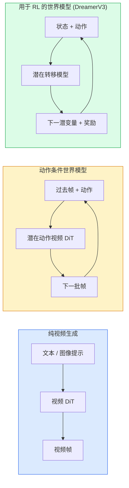

# 世界模型 (World Models) 与视频扩散 (Video Diffusion)

> 一个能预测场景未来几秒钟的视频模型，就是一个世界模拟器 (world simulator)。如果再把动作作为条件加入这个预测，你就得到了一台学得的游戏引擎。

**类型：** 学习 + 构建
**语言：** Python
**前置要求：** 第 4 阶段第 10 课（Diffusion）、第 4 阶段第 12 课（Video Understanding）、第 4 阶段第 23 课（DiT + Rectified Flow）
**时间：** ~75 分钟

## 学习目标

- 解释纯视频生成模型 (pure video generation model)（Sora 2）与动作条件世界模型 (action-conditioned world model)（Genie 3、DreamerV3）之间的差异
- 描述视频 DiT：时空 patch (spatio-temporal patches)、3D 位置编码、跨 `(T, H, W)` token 的联合注意力 (joint attention)
- 追踪世界模型如何接入机器人：VLM 规划 → 视频模型模拟 → 逆动力学 (inverse dynamics) 输出动作
- 根据具体用例（创意视频、交互式模拟、自动驾驶合成）在 Sora 2、Genie 3、Runway GWM-1 Worlds、Wan-Video 和 HunyuanVideo 之间做选择

## 问题

视频生成与世界建模 (world modelling) 在 2026 年汇合了。一个能够生成连贯一分钟视频的模型，从某种意义上说，已经学会了世界如何运动：物体恒常性、重力、因果关系、风格。如果你再把动作（向左走、打开门）作为条件加入这种预测，视频模型就会变成一个可学习的模拟器，能够取代游戏引擎、驾驶模拟器或机器人环境。

现实影响非常具体。Genie 3 只用一张图像就能生成可游玩的环境。Runway GWM-1 Worlds 能合成无限可探索场景。Sora 2 可以生成带同步音频、并建模了物理规律的一分钟视频。NVIDIA Cosmos-Drive、Wayve Gaia-2 和 Tesla DrivingWorld 能生成逼真的驾驶视频，用作自动驾驶训练数据。世界模型范式正在悄悄接管机器人领域的 sim-to-real。

本课是第 4 阶段的“全景图”课程。它把图像生成、视频理解和智能体推理连接成了当前主流研究正在转向的架构模式。

## 概念

### 世界建模的三大家族



- **Sora 2** 是由提示驱动的纯视频生成。没有动作接口。你无法在 rollout 过程中途“操控”它。
- **Genie 3**、**GWM-1 Worlds**、**Mirage / Magica** 是动作条件世界模型。它们会从观测视频中推断潜在动作，再用动作来条件化未来帧预测。具有交互性——你按键或移动相机，场景就会响应。
- **DreamerV3** 和经典 RL 世界模型家族会在潜在空间中、带显式动作条件地进行预测，并在奖励信号上训练。视觉性更弱；但对样本效率高的 RL 更有用。

### 视频 DiT 架构

```
Video latent:          (C, T, H, W)
Patchify (spatial):    grid of P_h x P_w patches per frame
Patchify (temporal):   group P_t frames into a temporal patch
Resulting tokens:      (T / P_t) * (H / P_h) * (W / P_w) tokens
```

位置编码是 3D 的：对每个 `(t, h, w)` 坐标使用 rotary 或 learned embedding。注意力可以是：

- **全联合** —— 所有 token 都注意所有 token。若有 N 个 token，则复杂度为 O(N^2)。对长视频来说代价高得难以接受。
- **分离式** —— 交替执行时间注意力（相同空间位置，跨时间：`(H*W) * T^2`）和空间注意力（相同步长，跨空间：`T * (H*W)^2`）。TimeSformer 和多数视频 DiT 都使用这种方式。
- **窗口式** —— 在 `(t, h, w)` 上使用局部窗口。Video Swin 使用这种方式。

2026 年的每个视频扩散模型都会使用这三种模式之一，再加上 AdaLN 条件化（第 23 课）和 rectified flow。

### 动作条件化：潜在动作模型 (latent action models)

Genie 会通过判别式地预测一对连续帧之间的动作，为每一帧学习一个**潜在动作**。模型的解码器随后以推断出的潜在动作为条件——而不是显式的键盘按键。在推理时，用户可以指定一个潜在动作（或从新的先验中采样一个），模型就会生成与该动作一致的下一帧。

Sora 则完全跳过动作接口。它的解码器从过去的时空 token 预测下一批时空 token。提示只负责起点；生成过程的中途没有任何东西来操控它。

### 物理合理性 (physical plausibility)

Sora 2 在 2026 年发布时明确宣传了**物理合理性**：重量、平衡、物体恒常性、因果关系。团队通过人工打分的合理性分数来衡量；相比 Sora 1，该模型在掉落物体、角色碰撞，以及有意失败的动作（比如跳跃没跳上）上都有明显改进。

合理性仍然是最主要的失败模式。2024-2025 年那些人们吃意面或从玻璃杯喝水的视频，暴露了模型缺乏持久物体表征的问题。2026 年模型（Sora 2、Runway Gen-5、HunyuanVideo）有所缓解，但并未彻底消除这些问题。

### 自动驾驶世界模型

驾驶世界模型会根据轨迹、边界框或导航地图，生成逼真的道路场景。用途包括：

- **Cosmos-Drive-Dreams**（NVIDIA）—— 为 RL 训练生成数分钟驾驶视频。
- **Gaia-2**（Wayve）—— 基于轨迹条件的场景合成，用于策略评估。
- **DrivingWorld**（Tesla）—— 模拟不同天气、时段和交通条件。
- **Vista**（ByteDance）—— 反应式驾驶场景合成。

它们可以替代昂贵的真实世界角落案例采集——例如夜间乱穿马路的行人、结冰路口、少见车型——否则你需要行驶数百万英里才能采到这些数据。

### 机器人栈：VLM + 视频模型 + 逆动力学

正在出现的三组件机器人闭环：

1. **VLM** 解析目标（“拿起红色杯子”），并规划高层动作序列。
2. **视频生成模型** 模拟执行每个动作后会看到什么——预测未来 N 帧的观测。
3. **逆动力学模型** 提取能够产生这些观测的具体电机指令。

这取代了奖励塑形和样本密集型 RL。世界模型负责想象；逆动力学负责把执行闭环接上。Genie Envisioner 是一种实现方式；许多研究团队都在向这一结构收敛。

### 评估

- **视觉质量** —— FVD（Fréchet Video Distance）、用户研究。
- **提示对齐** —— 每帧的 CLIPScore、类似 VQA 的评估。
- **物理合理性** —— 在基准套件上进行人工评分（Sora 2 的内部基准、VBench）。
- **可控性**（针对交互式世界模型）—— 动作 → 观测一致性；你能否回到先前状态？

### 2026 年的模型版图

| 模型 | 用途 | 参数量 | 输出 | 许可证 |
|-------|------|--------|------|---------|
| Sora 2 | 文本到视频、音频 | — | 1 分钟 1080p + 音频 | 仅 API |
| Runway Gen-5 | 文本/图像到视频 | — | 10 秒片段 | API |
| Runway GWM-1 Worlds | 交互式世界 | — | 无限 3D rollout | API |
| Genie 3 | 从图像生成交互式世界 | 11B+ | 可游玩帧 | 研究预览 |
| Wan-Video 2.1 | 开放式文本到视频 | 14B | 高质量片段 | 非商业 |
| HunyuanVideo | 开放式文本到视频 | 13B | 10 秒片段 | 宽松 |
| Cosmos / Cosmos-Drive | 自动驾驶模拟 | 7-14B | 驾驶场景 | NVIDIA 开放 |
| Magica / Mirage 2 | AI 原生游戏引擎 | — | 可修改的世界 | 产品 |

## 构建它

### 第 1 步：用于视频的 3D patchify

```python
import torch
import torch.nn as nn


class VideoPatch3D(nn.Module):
    def __init__(self, in_channels=4, dim=64, patch_t=2, patch_h=2, patch_w=2):
        super().__init__()
        self.proj = nn.Conv3d(
            in_channels, dim,
            kernel_size=(patch_t, patch_h, patch_w),
            stride=(patch_t, patch_h, patch_w),
        )
        self.patch_t = patch_t
        self.patch_h = patch_h
        self.patch_w = patch_w

    def forward(self, x):
        # x: (N, C, T, H, W)
        x = self.proj(x)
        n, c, t, h, w = x.shape
        tokens = x.reshape(n, c, t * h * w).transpose(1, 2)
        return tokens, (t, h, w)
```

一个 stride 等于 kernel 的 3D conv 就充当了时空 patch 化器。token 网格会从 `(T, H, W)` 变成 `(T/2, H/2, W/2)`。

### 第 2 步：3D 旋转位置编码 (Rotary Position Embeddings, RoPE)

Rotary Position Embeddings（RoPE）会沿 `t`、`h`、`w` 三个轴分别应用：

```python
def rope_3d(tokens, t_dim, h_dim, w_dim, grid):
    """
    tokens: (N, T*H*W, D)
    grid: (T, H, W) sizes
    t_dim + h_dim + w_dim == D
    """
    T, H, W = grid
    n, seq, d = tokens.shape
    if t_dim + h_dim + w_dim != d:
        raise ValueError(f"t_dim+h_dim+w_dim ({t_dim}+{h_dim}+{w_dim}) must equal D={d}")
    assert seq == T * H * W
    t_idx = torch.arange(T, device=tokens.device).repeat_interleave(H * W)
    h_idx = torch.arange(H, device=tokens.device).repeat_interleave(W).repeat(T)
    w_idx = torch.arange(W, device=tokens.device).repeat(T * H)
    # Simplified: just scale channels by frequencies. Real RoPE rotates pairs.
    freqs_t = torch.exp(-torch.log(torch.tensor(10000.0)) * torch.arange(t_dim // 2, device=tokens.device) / (t_dim // 2))
    freqs_h = torch.exp(-torch.log(torch.tensor(10000.0)) * torch.arange(h_dim // 2, device=tokens.device) / (h_dim // 2))
    freqs_w = torch.exp(-torch.log(torch.tensor(10000.0)) * torch.arange(w_dim // 2, device=tokens.device) / (w_dim // 2))
    emb_t = torch.cat([torch.sin(t_idx[:, None] * freqs_t), torch.cos(t_idx[:, None] * freqs_t)], dim=-1)
    emb_h = torch.cat([torch.sin(h_idx[:, None] * freqs_h), torch.cos(h_idx[:, None] * freqs_h)], dim=-1)
    emb_w = torch.cat([torch.sin(w_idx[:, None] * freqs_w), torch.cos(w_idx[:, None] * freqs_w)], dim=-1)
    return tokens + torch.cat([emb_t, emb_h, emb_w], dim=-1)
```

这里使用的是简化的加性形式。真正的 RoPE 会按频率旋转成对通道；但位置编码所携带的信息是一样的。

### 第 3 步：分离注意力块 (divided attention block)

```python
class DividedAttentionBlock(nn.Module):
    def __init__(self, dim=64, heads=2):
        super().__init__()
        self.time_attn = nn.MultiheadAttention(dim, heads, batch_first=True)
        self.space_attn = nn.MultiheadAttention(dim, heads, batch_first=True)
        self.ln1 = nn.LayerNorm(dim)
        self.ln2 = nn.LayerNorm(dim)
        self.ln3 = nn.LayerNorm(dim)
        self.mlp = nn.Sequential(nn.Linear(dim, 4 * dim), nn.GELU(), nn.Linear(4 * dim, dim))

    def forward(self, x, grid):
        T, H, W = grid
        n, seq, d = x.shape
        # time attention: same (h, w), across t
        xt = x.view(n, T, H * W, d).permute(0, 2, 1, 3).reshape(n * H * W, T, d)
        a, _ = self.time_attn(self.ln1(xt), self.ln1(xt), self.ln1(xt), need_weights=False)
        xt = (xt + a).reshape(n, H * W, T, d).permute(0, 2, 1, 3).reshape(n, seq, d)
        # space attention: same t, across (h, w)
        xs = xt.view(n, T, H * W, d).reshape(n * T, H * W, d)
        a, _ = self.space_attn(self.ln2(xs), self.ln2(xs), self.ln2(xs), need_weights=False)
        xs = (xs + a).reshape(n, T, H * W, d).reshape(n, seq, d)
        xs = xs + self.mlp(self.ln3(xs))
        return xs
```

时间注意力会在每个空间位置内跨时间进行注意；空间注意力则会在每一帧内跨位置进行注意。于是我们得到两个 O(T^2 + (HW)^2) 操作，而不是一个 O((THW)^2) 操作。这就是 TimeSformer 和所有现代视频 DiT 的核心。

### 第 4 步：组装一个小型视频 DiT

```python
class TinyVideoDiT(nn.Module):
    def __init__(self, in_channels=4, dim=64, depth=2, heads=2):
        super().__init__()
        self.patch = VideoPatch3D(in_channels=in_channels, dim=dim, patch_t=2, patch_h=2, patch_w=2)
        self.blocks = nn.ModuleList([DividedAttentionBlock(dim, heads) for _ in range(depth)])
        self.out = nn.Linear(dim, in_channels * 2 * 2 * 2)

    def forward(self, x):
        tokens, grid = self.patch(x)
        for blk in self.blocks:
            tokens = blk(tokens, grid)
        return self.out(tokens), grid
```

这不是一个能工作的完整视频生成器；它只是一个结构演示，用来说明每个部件的形状都能正确对上。

### 第 5 步：检查形状

```python
vid = torch.randn(1, 4, 8, 16, 16)  # (N, C, T, H, W)
model = TinyVideoDiT()
out, grid = model(vid)
print(f"input  {tuple(vid.shape)}")
print(f"tokens grid {grid}")
print(f"output {tuple(out.shape)}")
```

在 patch 之后，预期 `grid = (4, 8, 8)`，`out = (1, 256, 32)`；头部随后会把它投影回每个 token 对应的时空 patch，准备再反 patch 化回视频。

## 使用它

2026 年生产环境中的常见访问模式：

- **Sora 2 API**（OpenAI）—— 文本到视频，同步音频。价格高端。
- **Runway Gen-5 / GWM-1**（Runway）—— 图像到视频、交互式世界。
- **Wan-Video 2.1 / HunyuanVideo** —— 开源、自托管。
- **Cosmos / Cosmos-Drive**（NVIDIA）—— 自动驾驶模拟的开放权重。
- **Genie 3** —— 研究预览，需申请访问。

如果你要构建一个交互式世界模型演示：先用 Wan-Video 获得画质，再叠加一个潜在动作适配器来增加交互性。若是做自动驾驶仿真：Cosmos-Drive 是 2026 年开放参考实现。

对于机器人，现实中常见的栈是：

1. 语言目标 -> VLM（Qwen3-VL）-> 高层规划。
2. 规划 -> 潜在动作视频模型 -> 想象 rollout。
3. Rollout -> 逆动力学模型 -> 低层动作。
4. 动作被执行 -> 观测被反馈回第 1 步。

## 交付它

本课会产出：

- `outputs/prompt-video-model-picker.md` —— 根据任务、许可证和延迟，在 Sora 2 / Runway / Wan / HunyuanVideo / Cosmos 之间做选择。
- `outputs/skill-physical-plausibility-checks.md` —— 一个技能，定义自动化检查（物体恒常性、重力、连续性），在任何生成视频上线前运行。

## 练习

1. **（简单）** 对一个 5 秒 360p 视频，在 patch-t=2、patch-h=8、patch-w=8 的设置下计算 token 数量。推理这一规模下注意力所需的内存。
2. **（中等）** 将上面的分离注意力块替换为一个全联合注意力块，并测量形状与参数量。解释为什么真实视频模型必须使用分离注意力。
3. **（困难）** 构建一个最小的潜在动作视频模型：准备 `(frame_t, action_t, frame_{t+1})` 三元组数据集（任意简单 2D 游戏即可），训练一个以动作嵌入为条件的小型视频 DiT，并展示不同动作会产生不同的下一帧。

## 关键术语

| 术语 | 人们常说 | 实际含义 |
|------|----------|----------|
| 世界模型 | “学得的模拟器” | 给定状态和动作，预测未来观测的模型 |
| 视频 DiT | “时空 transformer” | 带 3D patch 化与分离注意力的扩散 transformer |
| 潜在动作 | “推断出的控制” | 从帧对中推断出的离散或连续动作潜变量；用于条件化下一帧生成 |
| 分离注意力 | “先时间再空间” | 每个块里做两次注意力——先跨时间，再跨空间——以让 O(N^2) 仍可管理 |
| 物体恒常性 | “东西得一直真实存在” | 视频模型必须学会的场景属性；在食物、玻璃器皿上是经典失败模式 |
| FVD | “Fréchet Video Distance” | FID 在视频上的对应物；主要视觉质量指标 |
| 逆动力学模型 | “从观测到动作” | 给定（状态、下一状态），输出连接两者的动作；闭合机器人回路 |
| Cosmos-Drive | “NVIDIA 驾驶模拟” | 用于 RL 与评估的开放权重自动驾驶世界模型 |

## 延伸阅读

- [Sora technical report (OpenAI)](https://openai.com/index/video-generation-models-as-world-simulators/)
- [Genie: Generative Interactive Environments (Bruce et al., 2024)](https://arxiv.org/abs/2402.15391) —— 潜在动作世界模型
- [TimeSformer (Bertasius et al., 2021)](https://arxiv.org/abs/2102.05095) —— 用于视频 transformer 的分离注意力
- [DreamerV3 (Hafner et al., 2023)](https://arxiv.org/abs/2301.04104) —— 用于 RL 的世界模型
- [Cosmos-Drive-Dreams (NVIDIA, 2025)](https://research.nvidia.com/labs/toronto-ai/cosmos-drive-dreams/) —— 驾驶世界模型
- [Top 10 Video Generation Models 2026 (DataCamp)](https://www.datacamp.com/blog/top-video-generation-models)
- [From Video Generation to World Model — survey repo](https://github.com/ziqihuangg/Awesome-From-Video-Generation-to-World-Model/)
