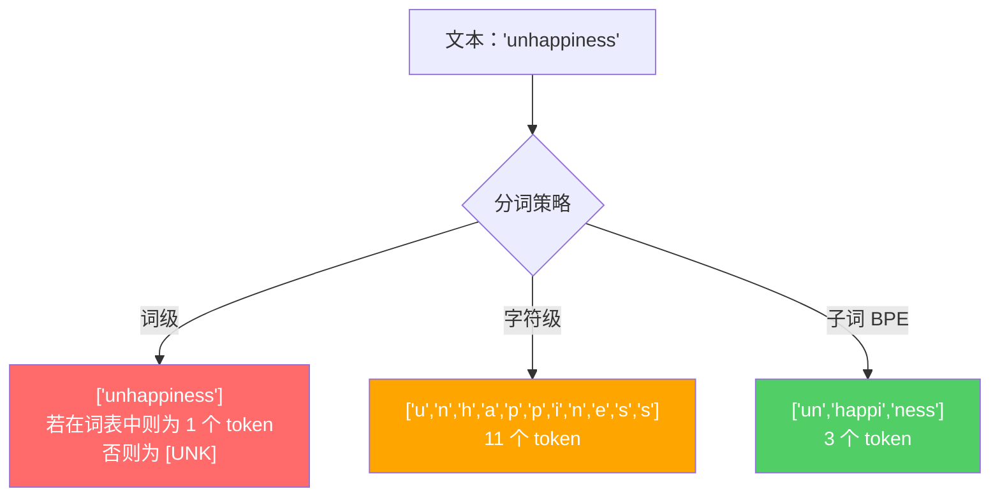
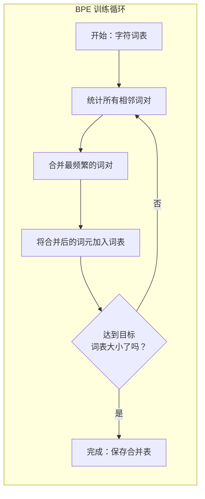
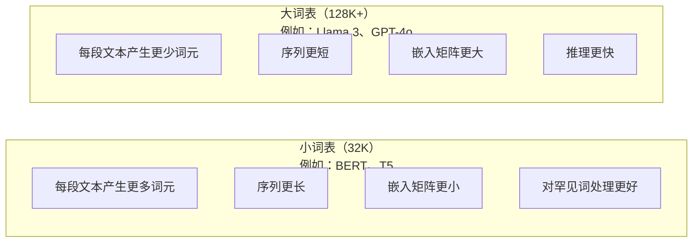

# 分词器：BPE、WordPiece、SentencePiece

> 你的 LLM 读的不是英语。它读的是整数。分词器（tokenizer）决定这些整数承载的是意义，还是浪费。

**类型：** 构建
**语言：** Python
**前置要求：** 阶段 05（NLP 基础 / NLP Foundations）
**时间：** ~90 分钟

## 学习目标

- 从零实现 BPE、WordPiece 和 Unigram 分词算法，并比较它们的合并策略
- 解释词表（vocabulary）大小如何影响模型效率：太小会产生更长的序列，太大会浪费嵌入（embedding）参数
- 分析不同语言和代码中的分词伪影，识别特定分词器在哪些地方会失效
- 使用 tiktoken 和 sentencepiece 库对文本进行分词，并检查生成的词元 ID（token IDs）

## 问题

你的 LLM 读的不是英语。它其实不读任何语言。它读的是数字。

从 “Hello, world!” 到 [15496, 11, 995, 0] 之间的桥梁，就是分词器。每个单词、每个空格、每个标点符号，都必须先被转换成整数，模型才能处理。这种转换并不是中立的。它会把一套假设烘焙进模型里，而这些假设之后无法撤销。

如果这里做错了，模型就会浪费容量，用多个词元去编码本来很常见的词。比如 “unfortunately” 可能会变成四个词元，而不是一个。你那 128K 的上下文窗口（context window）在面对大量多音节词文本时，等于瞬间缩水了 75%。如果这里做对了，同样的上下文窗口就能容纳两倍的意义。所谓“这个模型很擅长处理代码”和“这个模型一遇到 Python 就卡壳”之间的差别，往往就取决于分词器是怎么训练出来的。

你对 GPT-4 或 Claude 发出的每一次 API 调用，都是按词元计费的。模型每生成一个词元，都要消耗算力。表示同样输出所需的词元越少，端到端推理（inference）就越快。分词不是预处理（preprocessing）。它就是架构（architecture）本身的一部分。

## 概念

### 三种失败的方案（以及一个胜出的方案）

把文本转换成数字，显而易见的方法有三种。其中两种在大规模场景下行不通。

**词级分词（word-level tokenization）** 会按空格和标点切分。“The cat sat” 会变成 ["The", "cat", "sat"]。很简单。但 “tokenization” 怎么办？“GPT-4o” 怎么办？像德语复合词 “Geschwindigkeitsbegrenzung” 这样的词又怎么办？词级分词需要一个巨大的词表，才能覆盖每种语言里的每个词。漏掉一个词，你就会得到令人头疼的 `[UNK]` 词元——也就是模型在说：“我完全不知道这是什么。” 仅英语就有超过一百万种词形。再加上代码、URL、科学计数法以及另外 100 多种语言，你需要的几乎是一个无限大的词表。

**字符级分词（character-level tokenization）** 走向了另一个极端。“hello” 会变成 ["h", "e", "l", "l", "o"]。词表极小（几百个字符而已），也永远不会出现未知词元。但序列会变得极长。本来只需要 10 个词级词元的一句话，可能会变成 50 个字符级词元。模型必须重新学会把 “t”、“h”、“e” 组合起来理解成 “the”——也就是把注意力容量浪费在一个人类三岁就学会的事情上。

**子词分词（subword tokenization）** 找到了折中点。常见词保持完整：“the” 就是一个词元。罕见词被拆成有意义的片段：“unhappiness” 会变成 ["un", "happi", "ness"]。词表规模依然可控（30K 到 128K 个词元），序列也足够短。未知词元基本消失了，因为任何单词都可以由子词片段拼出来。

所有现代 LLM 都使用子词分词。GPT-2、GPT-4、BERT、Llama 3、Claude——全都是。问题只在于它们选用了哪种算法。



### BPE：字节对编码（Byte Pair Encoding）

BPE 原本是一个贪心压缩算法，后来被改造成了分词算法。它的核心思想简单到可以写在一张索引卡上。

从单个字符开始。统计训练语料中每一对相邻字符。把出现频率最高的那一对合并成一个新词元。重复这个过程，直到达到目标词表大小。

下面是在一个很小的语料上运行 BPE 的过程，语料只包含 “lower”、“lowest” 和 “newest” 这几个词：

```
Corpus (with word frequencies):
  "lower"  x5
  "lowest" x2
  "newest" x6

Step 0 -- Start with characters:
  l o w e r       (x5)
  l o w e s t     (x2)
  n e w e s t     (x6)

Step 1 -- Count adjacent pairs:
  (e,s): 8    (s,t): 8    (l,o): 7    (o,w): 7
  (w,e): 13   (e,r): 5    (n,e): 6    ...

Step 2 -- Merge most frequent pair (w,e) -> "we":
  l o we r        (x5)
  l o we s t      (x2)
  n e we s t      (x6)

Step 3 -- Recount and merge (e,s) -> "es":
  l o we r        (x5)
  l o we s t      (x2)    <- 'es' only forms from 'e'+'s', not 'we'+'s'
  n e we s t      (x6)    <- wait, the 'e' before 'we' and 's' after 'we'

Actually tracking this precisely:
  After "we" merge, remaining pairs:
  (l,o): 7   (o,we): 7   (we,r): 5   (we,s): 8
  (s,t): 8   (n,e): 6    (e,we): 6

Step 3 -- Merge (we,s) -> "wes" or (s,t) -> "st" (tied at 8, pick first):
  Merge (we,s) -> "wes":
  l o we r        (x5)
  l o wes t       (x2)
  n e wes t       (x6)

Step 4 -- Merge (wes,t) -> "west":
  l o we r        (x5)
  l o west        (x2)
  n e west        (x6)

...continue until target vocab size reached.
```

这张合并表（merge table）本身就是分词器。要对新文本进行编码，就按学到这些合并规则的顺序依次应用。训练语料决定了哪些合并会存在，而这个选择会永久塑造模型所看到的世界。



### 字节级 BPE（byte-level BPE，GPT-2、GPT-3、GPT-4）

标准 BPE 作用于 Unicode 字符。字节级 BPE 则作用于原始字节（0-255）。这样一来，你的基础词表就恰好是 256 个元素，能够处理任何语言或编码，而且永远不会生成未知词元。

GPT-2 引入了这种做法。基础词表覆盖了所有可能的字节，BPE 合并则建立在这之上。OpenAI 的 tiktoken 库用字节级 BPE 实现了以下这些词表规模：

- GPT-2：50,257 个词元
- GPT-3.5/GPT-4：约 100,256 个词元（cl100k_base 编码）
- GPT-4o：200,019 个词元（o200k_base 编码）

### 词片（WordPiece，BERT）

WordPiece 看起来和 BPE 很像，但它选择合并对象的方式不同。它不是看原始频率，而是最大化训练数据的似然：

```
BPE merge criterion:      count(A, B)
WordPiece merge criterion: count(AB) / (count(A) * count(B))
```

BPE 问的是：“哪一对出现得最多？” WordPiece 问的是：“哪一对一起出现的频率，比随机情况下的预期高得更多？” 这个细微差别会产生不同的词表。WordPiece 偏好那些“共同出现令人意外”的合并，而不只是单纯高频的合并。

WordPiece 还会给续接子词加上 “##” 前缀：

```
"unhappiness" -> ["un", "##happi", "##ness"]
"embedding"   -> ["em", "##bed", "##ding"]
```

“##” 前缀告诉你，这个片段会接在前一个词元后面。BERT 使用的 WordPiece 词表大小是 30,522。BERT 本身使用的就是 WordPiece；不过像 RoBERTa 这样的相关模型，分词器实际上改用了 BPE。

### 句片分词（SentencePiece，Llama、T5）

SentencePiece 把输入视为原始的 Unicode 字符流，其中包括空白字符。它没有预分词（pre-tokenization）步骤，也没有任何依赖特定语言的词边界规则。这让它真正做到了与语言无关——它可以处理中文、日文、泰文以及其他那些不靠空格分词的语言。

SentencePiece 支持两种算法：
- **BPE 模式**：与标准 BPE 相同的合并逻辑，但直接作用于原始字符序列
- **Unigram 模式**：从一个很大的词表开始，迭代移除那些对总体似然影响最小的词元。这与 BPE 正好相反——它不是“合并”，而是“剪枝”。

Llama 2 使用的是 SentencePiece BPE，词表大小为 32,000。T5 使用的是 SentencePiece Unigram，词表大小同样为 32,000。注意：Llama 3 已切换为基于 tiktoken 的字节级 BPE 分词器，词表大小为 128,256。

### 词表大小的权衡

这是真正的工程决策，而且后果是可以量化的。



来看具体数字。对于一个拥有 4,096 维嵌入、词表大小为 128K 的模型，仅嵌入矩阵一项就是 128,000 x 4,096 = 5.24 亿个参数。若词表大小是 32K，则只有 1.31 亿个参数。光是分词器的选择，就会带来 4 亿参数的差距。

但更大的词表会更激进地压缩文本。同一段英文，如果在 32K 词表下要 100 个词元，在 128K 词表下可能只要 70 个。这意味着生成阶段前向计算的次数减少了 30%。对于要服务数百万次请求的模型来说，这会直接降低算力成本。

趋势已经很清楚：词表规模正在不断变大。GPT-2 用的是 50,257。GPT-4 用的是约 100K。Llama 3 用的是 128K。GPT-4o 用的是 200K。

| 模型 | 词表大小 | 分词器类型 | 每个英文单词的平均词元数 |
|-------|-----------|----------------|---------------------------|
| BERT | 30,522 | WordPiece | ~1.4 |
| GPT-2 | 50,257 | 字节级 BPE | ~1.3 |
| Llama 2 | 32,000 | SentencePiece BPE | ~1.4 |
| GPT-4 | ~100,256 | 字节级 BPE | ~1.2 |
| Llama 3 | 128,256 | 字节级 BPE（tiktoken） | ~1.1 |
| GPT-4o | 200,019 | 字节级 BPE | ~1.0 |

### 多语言税

主要基于英语训练出来的分词器，对其他语言往往非常不友好。在 GPT-2 的分词器里，韩语平均每个词要拆成 2 到 3 个词元。中文可能更糟。这意味着韩语用户实际拥有的上下文窗口，可能只有英语用户的一半——却要付出同样的价格，只换来更低的信息密度。

这也是为什么 Llama 3 把词表从 32K 一口气扩大到 128K。给非英语文字系统分配更多词元，就意味着不同语言之间能获得更公平的压缩效果。

## 动手构建

### 第 1 步：字符级分词器

先从最基础的做起。字符级分词器会把每个字符映射到它的 Unicode 码点。不需要训练，不会有未知词元，就是一一对应的直接映射。

```python
class CharTokenizer:
    def encode(self, text):
        return [ord(c) for c in text]

    def decode(self, tokens):
        return "".join(chr(t) for t in tokens)
```

“hello” 会变成 [104, 101, 108, 108, 111]。每个字符都是一个词元。这就是我们后面要超越的基线。

### 第 2 步：从零实现 BPE 分词器

现在进入真正的实现。我们直接在原始字节上训练（和 GPT-2 一样），统计词对，合并最频繁的那一对，并按顺序记录每一次合并。合并表就是分词器本身。

```python
from collections import Counter

class BPETokenizer:
    def __init__(self):
        self.merges = {}
        self.vocab = {}

    def _get_pairs(self, tokens):
        pairs = Counter()
        for i in range(len(tokens) - 1):
            pairs[(tokens[i], tokens[i + 1])] += 1
        return pairs

    def _merge_pair(self, tokens, pair, new_token):
        merged = []
        i = 0
        while i < len(tokens):
            if i < len(tokens) - 1 and tokens[i] == pair[0] and tokens[i + 1] == pair[1]:
                merged.append(new_token)
                i += 2
            else:
                merged.append(tokens[i])
                i += 1
        return merged

    def train(self, text, num_merges):
        tokens = list(text.encode("utf-8"))
        self.vocab = {i: bytes([i]) for i in range(256)}

        for i in range(num_merges):
            pairs = self._get_pairs(tokens)
            if not pairs:
                break
            best_pair = max(pairs, key=pairs.get)
            new_token = 256 + i
            tokens = self._merge_pair(tokens, best_pair, new_token)
            self.merges[best_pair] = new_token
            self.vocab[new_token] = self.vocab[best_pair[0]] + self.vocab[best_pair[1]]

        return self

    def encode(self, text):
        tokens = list(text.encode("utf-8"))
        for pair, new_token in self.merges.items():
            tokens = self._merge_pair(tokens, pair, new_token)
        return tokens

    def decode(self, tokens):
        byte_sequence = b"".join(self.vocab[t] for t in tokens)
        return byte_sequence.decode("utf-8", errors="replace")
```

训练循环就是 BPE 的核心：统计词对，合并赢家，重复执行。每一次合并都会减少总词元数。经过 `num_merges` 轮之后，词表会从 256（基础字节）增长到 256 + num_merges。

编码时必须严格按照学习到这些合并的原始顺序来应用。这一点非常关键。如果第 1 次合并产生了 “th”，第 5 次合并产生了 “the”，那么编码时就必须先应用第 1 次合并，这样第 5 次合并时才能由 “th” + “e” 组成 “the”。

解码则是反向过程：根据词表查出每个词元 ID 对应的内容，把字节拼接起来，再解码成 UTF-8。

### 第 3 步：编码与解码往返验证

```python
corpus = (
    "The cat sat on the mat. The cat ate the rat. "
    "The dog sat on the log. The dog ate the frog. "
    "Natural language processing is the study of how computers "
    "understand and generate human language. "
    "Tokenization is the first step in any NLP pipeline."
)

tokenizer = BPETokenizer()
tokenizer.train(corpus, num_merges=40)

test_sentences = [
    "The cat sat on the mat.",
    "Natural language processing",
    "tokenization pipeline",
    "unhappiness",
]

for sentence in test_sentences:
    encoded = tokenizer.encode(sentence)
    decoded = tokenizer.decode(encoded)
    raw_bytes = len(sentence.encode("utf-8"))
    ratio = len(encoded) / raw_bytes
    print(f"'{sentence}'")
    print(f"  Tokens: {len(encoded)} (from {raw_bytes} bytes) -- ratio: {ratio:.2f}")
    print(f"  Roundtrip: {'PASS' if decoded == sentence else 'FAIL'}")
```

压缩比（compression ratio）能告诉你这个分词器有多高效。比值为 0.50，表示分词后的词元数只有原始字节数的一半。越低越好。在训练语料上，这个比值会比较漂亮；而在像 “unhappiness” 这样不在分布内（out-of-distribution）的文本上，比值就会更差——因为分词器会退回到更接近字符级的编码方式来处理未见过的模式。

### 第 4 步：与 tiktoken 对比

```python
import tiktoken

enc = tiktoken.get_encoding("cl100k_base")

texts = [
    "The cat sat on the mat.",
    "unhappiness",
    "Hello, world!",
    "def fibonacci(n): return n if n < 2 else fibonacci(n-1) + fibonacci(n-2)",
    "Geschwindigkeitsbegrenzung",
]

for text in texts:
    our_tokens = tokenizer.encode(text)
    tiktoken_tokens = enc.encode(text)
    tiktoken_pieces = [enc.decode([t]) for t in tiktoken_tokens]
    print(f"'{text}'")
    print(f"  Our BPE:   {len(our_tokens)} tokens")
    print(f"  tiktoken:  {len(tiktoken_tokens)} tokens -> {tiktoken_pieces}")
```

tiktoken 使用的算法完全一样，只不过它是在数百 GB 文本上训练、执行了 100,000 次合并。算法本身没有区别。真正的差别在于训练数据，以及合并次数。你这个只在一小段文本上训练了 40 次合并的分词器，当然无法和 tiktoken 在超大语料上训练出的 100K 合并结果竞争。但底层机制是同一个。

### 第 5 步：词表分析

```python
def analyze_vocabulary(tokenizer, test_texts):
    total_tokens = 0
    total_chars = 0
    token_usage = Counter()

    for text in test_texts:
        encoded = tokenizer.encode(text)
        total_tokens += len(encoded)
        total_chars += len(text)
        for t in encoded:
            token_usage[t] += 1

    print(f"Vocabulary size: {len(tokenizer.vocab)}")
    print(f"Total tokens across all texts: {total_tokens}")
    print(f"Total characters: {total_chars}")
    print(f"Avg tokens per character: {total_tokens / total_chars:.2f}")

    print(f"\nMost used tokens:")
    for token_id, count in token_usage.most_common(10):
        token_bytes = tokenizer.vocab[token_id]
        display = token_bytes.decode("utf-8", errors="replace")
        print(f"  Token {token_id:4d}: '{display}' (used {count} times)")

    unused = [t for t in tokenizer.vocab if t not in token_usage]
    print(f"\nUnused tokens: {len(unused)} out of {len(tokenizer.vocab)}")
```

这会把你词表里的 Zipf 分布暴露得很清楚。少数词元会占据绝大多数使用次数（比如空格、“the”、“e”）。大多数词元则很少出现。生产环境中的分词器就是围绕这种分布来优化的——常见模式会得到更短的词元 ID，罕见模式则用更长的表示。

## 实际使用

你从零实现的 BPE 已经能工作了。现在来看看生产级工具到底是什么样子。

### tiktoken（OpenAI）

```python
import tiktoken

enc = tiktoken.get_encoding("cl100k_base")

text = "Tokenizers convert text to integers"
tokens = enc.encode(text)
print(f"Tokens: {tokens}")
print(f"Pieces: {[enc.decode([t]) for t in tokens]}")
print(f"Roundtrip: {enc.decode(tokens)}")
```

tiktoken 是用 Rust 编写、通过 Python 绑定暴露出来的。它每秒可以编码数百万个词元。还是同样的 BPE 算法，只是实现达到了工业级强度。

### Hugging Face tokenizers

```python
from tokenizers import Tokenizer
from tokenizers.models import BPE
from tokenizers.trainers import BpeTrainer
from tokenizers.pre_tokenizers import ByteLevel

tokenizer = Tokenizer(BPE())
tokenizer.pre_tokenizer = ByteLevel()

trainer = BpeTrainer(vocab_size=1000, special_tokens=["<pad>", "<eos>", "<unk>"])
tokenizer.train(["corpus.txt"], trainer)

output = tokenizer.encode("The cat sat on the mat.")
print(f"Tokens: {output.tokens}")
print(f"IDs: {output.ids}")
```

Hugging Face 的 tokenizers 库底层同样是 Rust。它能在几秒内对 GB 级语料完成 BPE 训练。这就是你在训练自己的模型时会真正使用的工具。

### 加载 Llama 的分词器

```python
from transformers import AutoTokenizer

tokenizer = AutoTokenizer.from_pretrained("meta-llama/Llama-3.1-8B")

text = "Tokenizers are the unsung heroes of LLMs"
tokens = tokenizer.encode(text)
print(f"Token IDs: {tokens}")
print(f"Tokens: {tokenizer.convert_ids_to_tokens(tokens)}")
print(f"Vocab size: {tokenizer.vocab_size}")

multilingual = ["Hello world", "Hola mundo", "Bonjour le monde"]
for text in multilingual:
    ids = tokenizer.encode(text)
    print(f"'{text}' -> {len(ids)} tokens")
```

Llama 3 的 128K 词表，对非英语文本的压缩效果明显好于 GPT-2 的 50K 词表。你可以亲自验证——把同一句话用多种语言写出来，然后分别编码并统计词元数。

## 交付

这一课会产出 `outputs/prompt-tokenizer-analyzer.md` —— 一个可复用的提示词，用来分析任意文本与模型组合下的分词效率。把一段文本样本喂给它，它就会告诉你哪一个模型的分词器处理得最好。

## 练习

1. 修改 BPE 分词器，让它在每一步合并时都打印当前词表。观察 “t” + “h” 如何变成 “th”，再看 “th” + “e” 如何变成 “the”。跟踪常见英文单词是怎样一块一块被拼出来的。

2. 给 BPE 分词器加入特殊词元（`&lt;pad>`、`&lt;eos>`、`&lt;unk>`）。给它们分配 ID 0、1、2，并相应地平移其他所有词元的 ID。然后实现一个预分词步骤，在执行 BPE 之前先按空白字符切分。

3. 实现 WordPiece 的合并准则（使用似然比，而不是频率）。在同一个语料、相同合并次数的条件下，同时训练 BPE 和 WordPiece。比较两者生成的词表——哪一个会产生更符合语言学直觉的子词？

4. 构建一个多语言分词效率基准。准备 10 句英语、西班牙语、中文、韩语和阿拉伯语句子。使用 tiktoken（cl100k_base）分别进行分词，并测量每种语言平均每个字符对应多少个词元。把每种语言的“多语言税”量化出来。

5. 用更大的语料来训练你的 BPE 分词器（比如下载一篇维基百科文章）。调节合并次数，使它在同一段文本上的压缩比能逼近 tiktoken，并控制在 10% 以内。这会逼着你真正理解语料规模、合并次数与压缩质量之间的关系。

## 关键术语

| 术语 | 人们怎么说 | 实际含义 |
|------|----------------|----------------------|
| 词元（Token） | “一个单词” | 模型词表中的一个单位——它可能是字符、子词、单词，甚至是多词片段 |
| BPE | “某种压缩玩意儿” | 字节对编码——不断合并最常见的相邻词元对，直到达到目标词表大小 |
| 词片（WordPiece） | “BERT 的分词器” | 类似 BPE，但它合并时最大化的是似然比 count(AB)/(count(A)*count(B))，而不是原始频率 |
| 句片分词（SentencePiece） | “一个分词器库” | 一种与语言无关的分词器，直接在原始 Unicode 上工作，不做预分词，并支持 BPE 与 Unigram 算法 |
| 词表大小 | “它认识多少单词” | 唯一词元的总数：GPT-2 有 50,257，BERT 有 30,522，Llama 3 有 128,256 |
| 词元增殖率（Fertility） | “这不是分词器术语吧” | 平均每个词对应多少个词元——用来衡量不同语言上的分词效率（1.0 最理想，3.0 表示模型要多做三倍的工作） |
| 字节级 BPE | “GPT 的分词器” | BPE 直接作用于原始字节（0-255），而不是 Unicode 字符，因此任何输入都不会出现未知词元 |
| 合并表（Merge table） | “那个分词器文件” | 训练过程中学到的、有顺序的词对合并列表——它本身就是分词器，而且顺序非常重要 |
| 预分词（Pre-tokenization） | “按空格切开” | 在子词分词之前先应用的规则：如按空白切分、数字分离、标点处理 |
| 压缩比（Compression ratio） | “分词器有多高效” | 生成词元数除以输入字节数——越低表示压缩越好、推理越快 |

## 延伸阅读

- [Sennrich et al., 2016 ——《Neural Machine Translation of Rare Words with Subword Units》](https://arxiv.org/abs/1508.07909) —— 这篇论文把 BPE 引入了 NLP，把一个 1994 年的压缩算法变成了现代分词的基石
- [Kudo & Richardson, 2018 ——《SentencePiece: A simple and language independent subword tokenizer》](https://arxiv.org/abs/1808.06226) —— 与语言无关的分词方法，让多语言模型真正变得可行
- [OpenAI tiktoken 仓库](https://github.com/openai/tiktoken) —— Rust 编写、带 Python 绑定的生产级 BPE 实现，被 GPT-3.5/4/4o 使用
- [Hugging Face Tokenizers 文档](https://huggingface.co/docs/tokenizers) —— 具备 Rust 性能的生产级分词器训练文档
