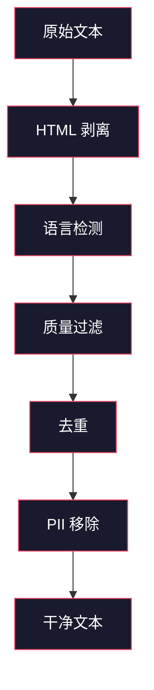
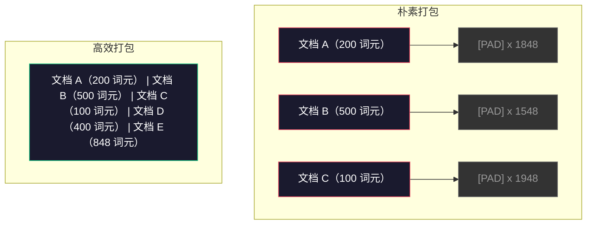

# 预训练的数据管道（Data Pipelines）

> 模型是一面镜子。你喂给它什么数据，它就映照什么数据。你喂垃圾，它就会以完美流畅的方式映照垃圾。

**类型：** 构建
**语言：** Python
**前置要求：** 第 10 阶段，第 01-02 课（分词器、构建分词器）
**时间：** 约 90 分钟

## 学习目标

- 构建一个流式（streaming）数据管道，在不将全部文本加载进内存的前提下，对 TB 级文本进行分词、分块、打乱与分批
- 实现真实预训练管道中使用的数据质量过滤器，包括去重（deduplication）、语言检测（language detection）和内容过滤（content filtering）
- 创建固定长度的训练序列（sequences），并正确处理注意力掩码（attention masks）与文档边界
- 分析管道吞吐量，确保数据加载器（dataloader）能跟上 GPU 训练速度

## 问题

你已经有了一个分词器（tokenizer）。现在你需要数据。

不是一个数据集。不是一个 CSV 文件。而是数 TB 的文本——完成清洗、去重、质量过滤、分词为固定长度序列，并以足够快的随机批次（batches）提供出去，快到你的 8-GPU 集群永远不用等待下一个批次。

大多数人以为训练 LLM 的关键在于模型架构。其实不是。Llama 3 使用了 15.6 万亿个词元（token）。GPT-3 使用了 3000 亿个。DeepSeek-V2 使用了 8.1 万亿个。三者的架构大体相同：由注意力层和前馈层堆叠而成的变换器块（transformer blocks）。输出质量的差异，压倒性地来自数据。

DeepMind 的 Chinchilla 论文把这件事讲得非常精确。对于给定的计算预算，模型参数量与训练词元数之间存在一个最优比例。Chinchilla 表明，2022 年的大多数模型都严重训练不足——它们的参数太多，而看到的数据太少。一个在 1.4 万亿词元上训练的 70B 参数模型（符合 Chinchilla 最优）优于一个在 3000 亿词元上训练的 280B 模型（Gopher）。

你的数据管道决定了模型学到的是语言，还是噪声。

## 概念

### 数据从哪里来

每个大语言模型都会在多种来源的混合数据上训练。对大多数实验室来说，精确配比是严密保守的秘密，但我们已经知道足够多的信息，可以理解主要类别。

| 来源 | 规模 | 质量 | 使用方 |
|--------|------|---------|---------|
| Common Crawl | 原始数据约 250 TB | 低（需要重度过滤） | GPT-3、Llama、大多数开源模型 |
| Wikipedia | 约 20 GB | 高 | 每个主流 LLM |
| GitHub 代码 | 约 1 TB+ | 中（大量重复、失效代码） | StarCoder、CodeLlama、DeepSeek-Coder |
| 图书（BookCorpus、Pile） | 约 100 GB | 高 | GPT-2、GPT-3、早期模型 |
| 学术论文（arXiv、S2ORC） | 约 100 GB | 对 STEM 很高 | Llama、Galactica |
| StackOverflow、Reddit | 约 100 GB | 中 | Llama、Falcon |
| 精选网页（C4、RefinedWeb） | 约 5 TB | 中高（已预过滤） | T5、Falcon |

Llama 3 披露了它的数据配比：大约 50% 网页数据、25% 代码、13% 图书和学术论文、8% 数学数据，以及 4% 多语言网页数据。总量为 15.6 万亿个词元，原始文本来源超过 5 TB。

配比和总规模一样重要。网页数据过多，模型就会变成 Reddit 鹦鹉。代码太少，它就不会编程。数学太少，它的推理能力就会失效。把这个配比调对，是训练 LLM 最难的部分之一，而且没有公式——只能靠实验和评估。

### 数据清洗

原始网页数据非常脏。一个典型的 Common Crawl 转储通常包含：

- HTML 标签和 JavaScript
- 模板化的页眉、页脚、导航菜单
- 重复页面（完全重复和近重复）
- 机器生成的垃圾内容
- 个人身份信息（Personally Identifiable Information，PII）
- 低质量文本（关键词列表、SEO 垃圾）
- 以文本形式编码的非文本内容

清洗不是可选项。它决定了你的模型是能生成连贯段落，还是会输出夹杂商品列表的 HTML 标签。



每一步都在消除一类噪声：

**HTML 剥离（HTML stripping）：** 去掉所有标记，只保留用户可见的文本内容。像 `trafilatura` 或 `readability` 这样的库会提取文章正文，同时丢弃导航、广告和模板噪声。

**语言检测（Language detection）：** 使用 fastText 的语言识别模型（lid.176.bin）对每个文档分类。只保留你的目标语言。一个被判定为英语但置信度低于 0.8 的文档，大概率并不是干净的英语文本。

**质量过滤（Quality filtering）：** 这里开始变得有意思了。RefinedWeb（Falcon 背后的数据集）使用基于困惑度（perplexity）的过滤器：先在 Wikipedia 上训练一个小语言模型，再给每个文档打分。高困惑度意味着文档不像 Wikipedia——很可能是垃圾内容、关键词列表或机器生成内容。困惑度高于阈值的文档会被移除。

**去重（Deduplication）：** 这是影响最大的单一步骤。Common Crawl 中存在海量重复页面——法律免责声明、cookie 提示、服务条款。对重复内容训练既浪费算力，也会导致模型逐字记忆并复述特定段落。

**PII 移除（PII removal）：** 包括姓名、电子邮箱地址、电话号码、社会安全号码。结构化 PII 可用正则表达式检测，语境中的姓名则可用 NER 模型识别。

### 用 MinHash 去重

精确去重很容易：给每个文档做哈希，删除重复项。但真正的问题是近重复。两篇相同新闻文章，只是周围广告略有不同，它们就是近重复。内容有 95% 相同，但按字节比较又并不一致。

MinHash + 局部敏感哈希（Locality-Sensitive Hashing，LSH）可以高效解决这个问题。


思路如下：

1. **分片（Shingling）：** 把每个文档转换为 n-gram 集合（例如单词或字符的 5-gram）。`"the quick brown fox"` 在按 3 个词做 shingle 时，会变成 {"the quick brown", "quick brown fox"}。

2. **MinHash：** 对每个文档的 shingle 集合，计算 k 个哈希值。每个哈希值都是在不同哈希函数下，所有 shingle 的最小哈希值。这会形成一个固定大小的“签名”，用来近似任意两个文档之间的 Jaccard 相似度。

3. **LSH：** 按 MinHash 签名的多个频带（bands）将文档分桶。落在同一桶中的文档就是候选近重复项。这样就不用比较所有文档对——只比较候选项即可。

4. **验证（Verify）：** 对每个候选对计算精确的 Jaccard 相似度。如果相似度超过阈值（通常是 0.8），就移除其中一个副本。

Llama 团队报告称，他们通过去重大约删除了 38% 的网页数据。这不是一个小数字。超过三分之一的 Common Crawl 都是重复或近重复内容。

### 序列打包

你的模型期望输入是固定长度序列。你的文档长度却是可变的。有些只有 50 个词元，有些却有 50,000 个词元。

朴素做法：把每个文档都填充到最大序列长度。这样会在填充词元（padding tokens）上浪费大量算力，而这些词元对学习没有任何贡献。

更好的做法：把多个文档打包进同一个序列，中间用序列结束词元（end-of-sequence token）分隔。一个 2048 词元的序列，可能包含三篇较短文档，并在它们之间插入 `[EOS]` 词元。



注意力掩码必须设置正确。同一个打包序列中，文档 A 的词元不应当关注到文档 B 的词元。这就需要块对角（block-diagonal）的注意力掩码（attention mask）。

长文档会在序列边界处被截断或切分成多个块。切分点很重要：如果在句子中间切开，模型看到的就是不完整的思想。有些管道会在可能的情况下，把切分点对齐到段落或句子边界。

### Chinchilla 缩放定律

对于固定的计算预算 C（以 FLOPs 衡量），最优模型大小 N 和数据集大小 D 满足：

```
N_opt ~ C^0.5
D_opt ~ C^0.5
```

在实践中，这意味着你应该大致等比例地扩展模型大小和数据集大小。参数量增加 10 倍的模型，大约也需要增加 10 倍训练词元，才能达到相同的损失（loss）。

| 模型 | 参数量 | 训练词元数 | 是否符合 Chinchilla 最优？ |
|-------|-----------|----------------|-------------------|
| GPT-3 | 175B | 300B | 否（训练不足 3-4 倍） |
| Chinchilla | 70B | 1.4T | 是（设计即如此） |
| Llama 2 | 70B | 2T | 过度训练（有意为之） |
| Llama 3 | 70B | 15T | 严重过度训练 |

Llama 3 是有意违背 Chinchilla 定律的。Meta 发现，在远超计算最优比例的更多数据上继续训练，能得到更适合推理的模型。额外训练成本只需支付一次，但更小的模型会在后续服务阶段永久更便宜。这有时被称为“推理最优（inference-optimal）”缩放方法，并自 2024 年起成为行业标准。

## 动手构建

### 第 1 步：文本清洗

剥离 HTML、归一化空白字符、移除非文本内容。我们将使用公共领域文本（Project Gutenberg）作为小型语料库（corpus）。

```python
import re

def clean_text(text):
    text = re.sub(r"<[^>]+>", "", text)
    text = re.sub(r"http\S+", "", text)
    text = re.sub(r"[^\x20-\x7E\n]", "", text)
    text = re.sub(r"\n{3,}", "\n\n", text)
    text = re.sub(r" {2,}", " ", text)
    return text.strip()

def quality_filter(text, min_words=50, max_ratio_caps=0.3, max_ratio_special=0.1):
    words = text.split()
    if len(words) < min_words:
        return False
    caps_ratio = sum(1 for w in words if w.isupper()) / len(words)
    if caps_ratio > max_ratio_caps:
        return False
    special_chars = sum(1 for c in text if not c.isalnum() and not c.isspace())
    if special_chars / max(len(text), 1) > max_ratio_special:
        return False
    return True
```

这个质量过滤器能抓住 SEO 垃圾（全大写）、机器生成噪声（特殊字符占比高）以及占位页面（太短）。仅这三项检查，就足以从网页抓取数据中清掉多得惊人的垃圾。

### 第 2 步：MinHash 去重

从零实现 MinHash。不需要任何外部库——只用 `hashlib`。

```python
import hashlib
from collections import defaultdict

def get_shingles(text, k=5):
    words = text.lower().split()
    if len(words) < k:
        return set()
    return {" ".join(words[i:i+k]) for i in range(len(words) - k + 1)}

def minhash_signature(shingles, num_hashes=128):
    signature = []
    for i in range(num_hashes):
        min_hash = float("inf")
        for shingle in shingles:
            h = int(hashlib.sha256(f"{i}:{shingle}".encode()).hexdigest(), 16)
            min_hash = min(min_hash, h)
        signature.append(min_hash)
    return signature

def lsh_buckets(signature, bands=16):
    rows_per_band = len(signature) // bands
    buckets = []
    for b in range(bands):
        start = b * rows_per_band
        band_data = tuple(signature[start:start + rows_per_band])
        bucket_hash = hashlib.md5(str(band_data).encode()).hexdigest()
        buckets.append((b, bucket_hash))
    return buckets

def deduplicate(documents, threshold=0.8, num_hashes=128, bands=16):
    signatures = []
    shingle_sets = []
    for doc in documents:
        shingles = get_shingles(doc)
        shingle_sets.append(shingles)
        signatures.append(minhash_signature(shingles, num_hashes))

    bucket_map = defaultdict(list)
    for doc_idx, sig in enumerate(signatures):
        for band_id, bucket_hash in lsh_buckets(sig, bands):
            bucket_map[(band_id, bucket_hash)].append(doc_idx)

    duplicate_pairs = set()
    for bucket_docs in bucket_map.values():
        if len(bucket_docs) < 2:
            continue
        for i in range(len(bucket_docs)):
            for j in range(i + 1, len(bucket_docs)):
                duplicate_pairs.add((bucket_docs[i], bucket_docs[j]))

    removed = set()
    for i, j in duplicate_pairs:
        if i in removed or j in removed:
            continue
        s1, s2 = shingle_sets[i], shingle_sets[j]
        if not s1 or not s2:
            continue
        jaccard = len(s1 & s2) / len(s1 | s2)
        if jaccard >= threshold:
            removed.add(j)

    return [doc for idx, doc in enumerate(documents) if idx not in removed], len(removed)
```

`num_hashes=128` 和 `bands=16` 这两个参数控制精确率-召回率权衡。更多哈希值会带来更准确的相似度估计。更多频带（band）会提高召回率（抓到更多重复项），但代价是误报更多。对于典型网页文本，这组值效果不错。

### 第 3 步：分词并打包序列

把清洗并去重后的文本做分词，然后打包成训练所需的固定长度序列。

```python
def tokenize_corpus(documents, tokenizer):
    all_tokens = []
    for doc in documents:
        tokens = tokenizer.encode(doc)
        all_tokens.extend(tokens)
        all_tokens.append(tokenizer.eos_id)
    return all_tokens

def pack_sequences(token_ids, seq_length, pad_id=0):
    sequences = []
    attention_masks = []
    for i in range(0, len(token_ids), seq_length):
        seq = token_ids[i:i + seq_length]
        mask = [1] * len(seq)
        if len(seq) < seq_length:
            pad_count = seq_length - len(seq)
            seq = seq + [pad_id] * pad_count
            mask = mask + [0] * pad_count
        sequences.append(seq)
        attention_masks.append(mask)
    return sequences, attention_masks
```

### 第 4 步：训练用数据加载器（DataLoader）

产出随机化批次的打包序列。这正是训练循环要消费的数据。

```python
import random

class PreTrainingDataLoader:
    def __init__(self, sequences, attention_masks, batch_size, shuffle=True):
        self.sequences = sequences
        self.attention_masks = attention_masks
        self.batch_size = batch_size
        self.shuffle = shuffle

    def __len__(self):
        return (len(self.sequences) + self.batch_size - 1) // self.batch_size

    def __iter__(self):
        indices = list(range(len(self.sequences)))
        if self.shuffle:
            random.shuffle(indices)
        for start in range(0, len(indices), self.batch_size):
            batch_idx = indices[start:start + self.batch_size]
            batch_seqs = [self.sequences[i] for i in batch_idx]
            batch_masks = [self.attention_masks[i] for i in batch_idx]
            yield batch_seqs, batch_masks
```

### 第 5 步：数据集统计

计算真正重要的指标：总词元数、唯一词元数、压缩率、文档长度分布。

```python
from collections import Counter

def compute_statistics(documents, token_ids, sequences, tokenizer_vocab_size):
    total_chars = sum(len(d) for d in documents)
    total_tokens = len(token_ids)
    unique_tokens = len(set(token_ids))
    compression_ratio = total_chars / total_tokens

    doc_lengths = [len(d.split()) for d in documents]
    avg_doc_length = sum(doc_lengths) / max(len(doc_lengths), 1)
    max_doc_length = max(doc_lengths) if doc_lengths else 0
    min_doc_length = min(doc_lengths) if doc_lengths else 0

    token_counts = Counter(token_ids)
    top_tokens = token_counts.most_common(10)

    non_pad_tokens = sum(sum(1 for t in seq if t != 0) for seq in sequences)
    total_positions = sum(len(seq) for seq in sequences)
    utilization = non_pad_tokens / max(total_positions, 1)

    stats = {
        "total_documents": len(documents),
        "total_characters": total_chars,
        "total_tokens": total_tokens,
        "unique_tokens": unique_tokens,
        "vocab_utilization": unique_tokens / tokenizer_vocab_size,
        "compression_ratio": compression_ratio,
        "avg_doc_length_words": avg_doc_length,
        "max_doc_length_words": max_doc_length,
        "min_doc_length_words": min_doc_length,
        "num_sequences": len(sequences),
        "sequence_utilization": utilization,
        "top_10_tokens": top_tokens,
    }
    return stats
```

压缩率告诉你，这个分词器在当前语料上的效率如何。英语文本通常会压缩到大约每个词元 3-4 个字符。如果你看到每个词元只有 1.5 个字符，说明分词器切得太碎了。如果你看到 8+，说明它学到了非常特定领域的合并规则（merge）。

序列利用率告诉你，打包后的序列里有多少是真实数据，多少是填充。低于 90% 就意味着你的打包效率不高——你在填充词元上浪费算力。

## 使用它

### 与 HuggingFace Datasets 对比

通过 HuggingFace 的 datasets 库加载同一份语料，并比较管道速度。

```python
from datasets import load_dataset
from transformers import AutoTokenizer

ds = load_dataset("wikitext", "wikitext-2-raw-v1", split="train")
tokenizer = AutoTokenizer.from_pretrained("meta-llama/Meta-Llama-3-8B")

import time

start = time.time()
tokenized = ds.map(
    lambda x: tokenizer(x["text"], truncation=True, max_length=2048),
    batched=True,
    num_proc=4,
)
hf_time = time.time() - start
total_tokens = sum(len(t) for t in tokenized["input_ids"])
print(f"HuggingFace: {total_tokens:,} tokens in {hf_time:.2f}s ({total_tokens/hf_time:,.0f} tokens/sec)")
```

HuggingFace 管道底层使用 Rust 分词器（tokenizer），并在 4 个 CPU 核心上并行处理。你用纯 Python 写的管道会慢 10-50 倍。这个差距就是为什么生产团队会使用编译型分词器。算法是一样的，差别在实现语言。

## 交付它

本课会产出一个用于验证和调试 LLM 训练管道中数据质量的提示词。参见 `outputs/prompt-data-quality-checker.md`。

## 练习

1. **简单：** 使用一个简单启发式方法（字符集分析）为清洗管道加入语言检测。只保留英文文档，并测量会移除多少文档。
2. **中等：** 在 MinHash 近重复检测之外，再使用 SHA-256 哈希实现精确去重。对一个网页抓取得到的语料，对比两种方法分别捕获了多少重复项。
3. **困难：** 构建基于困惑度的质量过滤器。在 Wikipedia 文本上训练一个小型二元（bigram）语言模型，用困惑度给每个文档打分，并移除分数最低的 20%。比较在过滤数据与未过滤数据上训练时的模型输出质量。

## 关键术语

| 术语 | 人们常说什么 | 它真正的意思 |
|------|----------------|----------------------|
| Common Crawl | “整个互联网” | 一个每月抓取网页的非营利项目——原始数据约 250TB，是大多数 LLM 训练数据的起点 |
| MinHash | “某种哈希技巧” | 一种用固定大小签名估计集合间 Jaccard 相似度的技术——支持大规模近重复检测 |
| LSH | “局部敏感哈希” | 一种把相似项分到同一桶中的方法——将两两比较从 O(n^2) 降到接近线性 |
| 序列打包（Sequence packing） | “把文档拼起来” | 在正确注意力掩码的配合下，把多个文档装进固定长度序列——消除填充浪费 |
| Chinchilla 缩放（Chinchilla scaling） | “用更多数据训练” | 在固定计算预算下，最优性能要求模型大小与训练词元数大致等比例扩展 |
| 词元生育度（Fertility） | “每个词对应多少词元” | 每个词平均分成多少词元——GPT-4 的英语约为 1.3，非拉丁文字脚本通常更高 |
| 数据混合（Data mixing） | “选择训练数据” | 代码、文本、数学、多语言数据之间的比例——没有公式，只能实验 |
| 困惑度过滤器（Perplexity filter） | “质量打分” | 用一个小语言模型给文档打分——高困惑度意味着文本不像干净的参考数据 |
| 去重（Deduplication） | “去掉副本” | 去除完全重复和近重复文档——通常能移除 30-40% 的原始网页数据 |
| 注意力掩码（Attention mask） | “该看哪些词元” | 一种二值掩码，用于阻止打包序列中跨文档边界的注意力 |

## 延伸阅读

- [Hoffmann et al., 2022 -- Training Compute-Optimal Large Language Models (Chinchilla)](https://arxiv.org/abs/2203.15556) -- 改变我们理解数据规模方式的论文
- [Penedo et al., 2023 -- The RefinedWeb Dataset for Falcon LLM](https://arxiv.org/abs/2306.01116) -- 如何把 Common Crawl 过滤为高质量数据
- [Touvron et al., 2023 -- Llama 2: Open Foundation and Fine-Tuned Chat Models](https://arxiv.org/abs/2307.09288) -- Llama 2 的数据管道细节
- [Lee et al., 2022 -- Deduplicating Training Data Makes Language Models Better](https://arxiv.org/abs/2107.06499) -- 为什么去重比你想的更重要
- [Broder, 1997 -- On the Resemblance and Containment of Documents](https://ieeexplore.ieee.org/document/666900) -- 最初的 MinHash 论文
- [Meta, 2024 -- Llama 3 Technical Report](https://arxiv.org/abs/2407.21783) -- 15.6T 词元、数据混合比例和过滤流程
