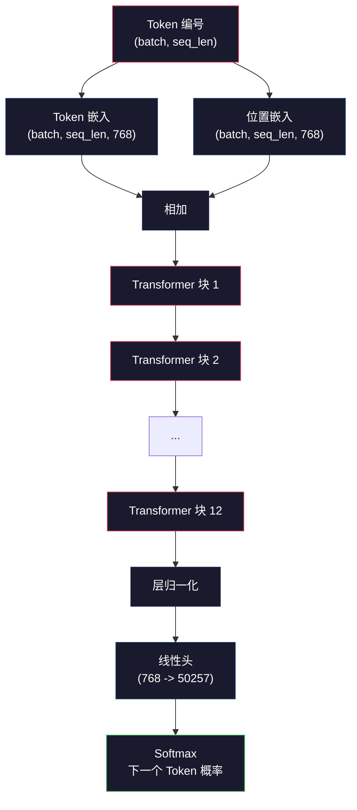
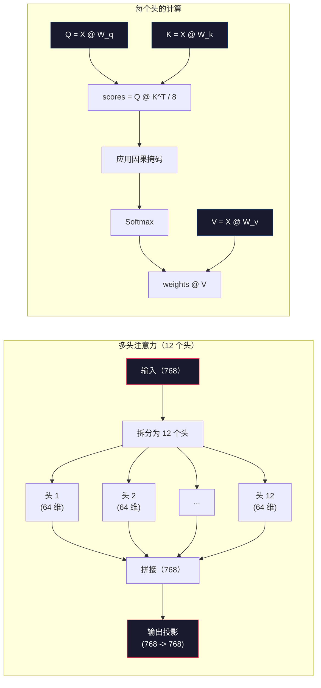
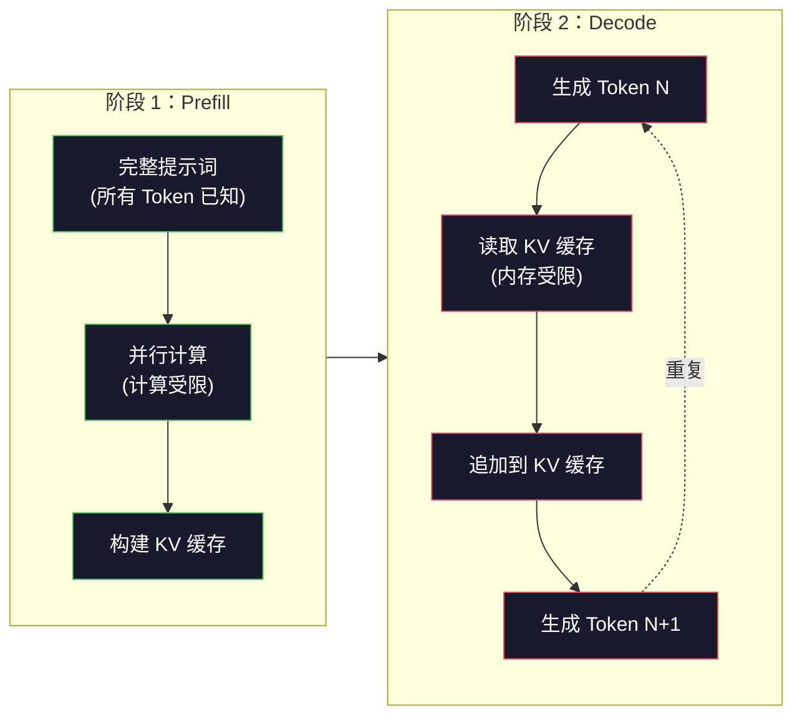

# 预训练（Pre-Training）一个迷你 GPT（124M 参数）

> GPT-2 Small 有 1.24 亿个参数。这意味着 12 层 Transformer、12 个注意力头，以及 768 维嵌入。你可以在单张 GPU 上用几小时从零训练它。大多数人从不这样做，而是直接使用预训练检查点（pre-trained checkpoints）。但如果你没有亲手训练过一个模型，你其实并不真正理解你正在拿来做产品的模型内部发生了什么。

**类型：** 构建
**语言：** Python（使用 numpy）
**前置要求：** 第 10 阶段，第 01-03 课（分词器、构建分词器、数据管道）
**时间：** 约 120 分钟

## 学习目标

- 从零实现完整的 GPT-2 架构（124M 参数）：Token 嵌入、位置嵌入、Transformer 块，以及语言模型头（language model head）
- 使用下一个 Token 预测和交叉熵损失（cross-entropy loss）在文本语料上训练 GPT 模型
- 使用温度采样（temperature sampling）和 top-k/top-p 过滤实现自回归（autoregressive）文本生成
- 监控训练损失曲线，并验证模型确实学会了连贯的语言模式

## 问题

你知道 Transformer 是什么。你看过那些图。你能背出 “attention is all you need”，也能在白板上画出写着 “Multi-Head Attention” 的方框。

但这并不意味着你理解了模型生成文本时到底发生了什么。

GPT-2 Small（使用权重绑定）里有 124,438,272 个参数。每一个参数，都是通过运行训练循环（training loop）设定出来的：前向传播、计算损失、反向传播、更新权重。12 个 Transformer 块。每个块 12 个注意力头。一个 768 维的嵌入空间。一个包含 50,257 个 Token 的词表。模型每生成一个 Token，这 1.24 亿个参数都会参与同一条矩阵乘法链：输入一串 Token ID，输出下一个 Token 的概率分布。

如果你从未亲手搭过这个东西，那你面对的就是一个黑盒。你可以调用 API。你可以做微调（fine-tune）。但当事情出问题时——模型开始幻觉、不断重复、拒绝遵循指令——你脑中并没有一个关于*为什么*会这样的心智模型。

本课会从零构建 GPT-2 Small。不是用 PyTorch，而是用 numpy。每一次矩阵乘法都看得见。每一个梯度都由你的代码算出来。你将亲眼看到这 1.24 亿个数字如何协同起来预测下一个词。

## 核心概念

### GPT 架构

GPT 是一种自回归（autoregressive）语言模型。所谓“自回归”，就是它一次生成一个 Token，而且每个 Token 都以之前所有 Token 为条件。它的架构是由一叠 Transformer 解码器块（decoder blocks）组成的。

下面是从 Token ID 到下一个 Token 概率的完整计算图：

1. 输入 Token ID。形状：`(batch_size, seq_len)`。
2. 查找 Token 嵌入。每个 ID 映射到一个 768 维向量。形状：`(batch_size, seq_len, 768)`。
3. 查找位置嵌入。每个位置（0、1、2、……）映射到一个 768 维向量。形状相同。
4. 将 Token 嵌入与位置嵌入相加。
5. 通过 12 个 Transformer 块。
6. 最终层归一化（layer normalization）。
7. 线性投影到词表大小。形状：`(batch_size, seq_len, vocab_size)`。
8. 经过 Softmax 得到概率。

这就是整个模型。没有卷积。没有循环结构。只有嵌入、注意力、前馈网络（feedforward networks）和层归一化，重复堆叠 12 次。



### Transformer 块

这 12 个块都遵循同样的模式。它采用预归一化（pre-norm）结构（GPT-2 使用 pre-norm，而不是原始 Transformer 那种后归一化（post-norm））：

1. LayerNorm
2. 多头自注意力（Multi-Head Self-Attention）
3. 残差连接（把输入加回来）
4. LayerNorm
5. 前馈网络（Feed-Forward Network，MLP）
6. 残差连接（把输入加回来）

残差连接至关重要。没有它们，梯度在反向传播时传到第 1 个块之前就会消失。有了它们，梯度就能通过 “skip” 路径从损失直接流向任意层。这就是为什么你可以堆 12、32，甚至 96 个块（据传 GPT-4 用了 120 个）。

### 注意力：核心机制

自注意力（self-attention）让每个 Token 都能查看它之前的所有 Token，并决定应该对每个 Token 分配多少注意力。下面是数学形式。

对序列中的每个 Token 位置，从输入中计算三个向量：
- **Query（Q）**：我在寻找什么？
- **Key（K）**：我包含什么？
- **Value（V）**：我携带什么信息？

```
Q = input @ W_q    (768 -> 768)
K = input @ W_k    (768 -> 768)
V = input @ W_v    (768 -> 768)

attention_scores = Q @ K^T / sqrt(d_k)
attention_scores = mask(attention_scores)   # causal mask: -inf for future positions
attention_weights = softmax(attention_scores)
output = attention_weights @ V
```

因果掩码（causal mask）是 GPT 之所以具备自回归性质的关键。位置 5 可以关注位置 0-5，但不能关注 6、7、8 等未来位置。这能防止模型在训练时通过偷看未来 Token 来“作弊”。

**多头注意力（multi-head attention）** 会把 768 维空间拆成 12 个头，每个头 64 维。每个头学习一种不同的注意力模式。一个头可能跟踪句法关系（主谓一致），另一个头可能跟踪语义相似性（同义词），还有一个头可能跟踪位置邻近性（相邻词）。12 个头的输出会被拼接起来，再投影回 768 维。



除以 `sqrt(d_k)`——也就是 `sqrt(64) = 8`——就是缩放（scaling）。没有这一步，高维向量的点积会变得很大，把 Softmax 推进梯度几乎为零的区域。这是原始论文《Attention Is All You Need》中的关键洞见之一。

### KV 缓存：为什么推理这么快

训练时，你一次处理整个序列。推理（inference）时，你一次生成一个 Token。如果不做优化，生成第 N 个 Token 时，需要重新计算前面 N-1 个 Token 的全部注意力。这意味着每生成一个 Token 的代价是 `O(N^2)`，整个长度为 N 的序列总代价是 `O(N^3)`。

KV 缓存（KV cache）解决了这个问题。在为每个 Token 计算出 K 和 V 之后，把它们存起来。生成第 N+1 个 Token 时，你只需要为新 Token 计算 Q，然后读取之前所有 Token 缓存好的 K 和 V。这让 K 和 V 计算的单 Token 成本从 `O(N)` 降到 `O(1)`。注意力分数的计算仍然是 `O(N)`，因为你还是要关注所有历史位置，但你避免了在输入上重复做矩阵乘法。

对于拥有 12 层、12 个头的 GPT-2，KV 缓存为每个 Token 存储 `2 (K + V) x 12 层 x 12 头 x 64 维 = 18,432` 个值。对一个 1024 Token 的序列来说，FP32 下大约是 75MB。对于有 128 层的 Llama 3 405B，单条序列的 KV 缓存可以超过 10GB。这就是为什么长上下文推理是内存受限（memory-bound）的。

### Prefill 与 Decode：推理的两个阶段

当你把提示词（prompt）发送给 LLM 时，推理会经历两个截然不同的阶段。

**Prefill** 会并行处理整个提示词。因为所有 Token 都已知，所以模型可以同时计算所有位置的注意力。这个阶段是计算受限（compute-bound）的——GPU 正以满吞吐量进行矩阵乘法。对于 A100 上一个 1000 Token 的提示词，prefill 大约需要 20-50ms。

**Decode** 会一次生成一个 Token。每个新 Token 都依赖之前的所有 Token。这个阶段是内存受限（memory-bound）的——瓶颈是从 GPU 内存读取模型权重和 KV 缓存，而不是矩阵运算本身。GPU 的计算核心大多在等待内存读取时空转。对 GPT-2 来说，每一步 decode 的耗时几乎差不多，不管矩阵乘法需要多少 FLOPs，因为真正的约束是内存带宽。

这种区别对生产系统很重要。Prefill 吞吐量随 GPU 计算能力扩展（更多 FLOPS = 更快的 prefill）。Decode 吞吐量随内存带宽扩展（更快的内存 = 更快的 decode）。这就是为什么 NVIDIA 的 H100 相比 A100 更强调内存带宽提升——它会直接加速 Token 生成。



### 训练循环

训练 LLM 的本质就是预测下一个 Token。给定 Token `[0, 1, 2, ..., N-1]`，去预测 Token `[1, 2, 3, ..., N]`。损失函数就是模型预测概率分布与真实下一个 Token 之间的交叉熵。

一次训练步骤：

1. **前向传播**：让一个 batch 依次通过全部 12 个块。得到每个位置的 logits（Softmax 前的分数）。
2. **计算损失**：对 logits 和目标 Token（输入整体右移一位）计算交叉熵。
3. **反向传播**：用反向传播为全部 1.24 亿个参数计算梯度。
4. **优化器步骤**：更新权重。GPT-2 使用带学习率预热（warmup）和余弦衰减的 Adam。

学习率调度的重要性往往超出你的预期。GPT-2 会在前 2,000 步里把学习率从 0 预热到峰值，然后沿着余弦曲线衰减。一开始就用很高的学习率会让模型发散。后期一直维持高学习率会导致训练震荡。先预热再衰减的模式被几乎所有主流 LLM 采用。

### GPT-2 Small：参数数字

| 组件 | 形状 | 参数量 |
|-----------|-------|------------|
| Token 嵌入 | (50257, 768) | 38,597,376 |
| 位置嵌入 | (1024, 768) | 786,432 |
| 每个块的注意力（W_q、W_k、W_v、W_out） | 4 x (768, 768) | 2,359,296 |
| 每个块的 FFN（升维 + 降维） | (768, 3072) + (3072, 768) | 4,718,592 |
| 每个块的 LayerNorm（2x） | 2 x 768 x 2 | 3,072 |
| 最终 LayerNorm | 768 x 2 | 1,536 |
| **每个块合计** | | **7,080,960** |
| **总计（12 个块）** | | **85,054,464 + 39,383,808 = 124,438,272** |

输出投影（logits head）与 Token 嵌入矩阵共享权重。这叫做权重绑定（weight tying）——它把参数量减少了 3800 万，并提升了效果，因为它强制模型在输入和输出上使用同一个表示空间。

## 动手实现

### 第 1 步：嵌入层

Token 嵌入会把 50,257 个可能的 Token 中的每一个映射为一个 768 维向量。位置嵌入则加入每个 Token 在序列中所处位置的信息。两者相加。

```python
import numpy as np

class Embedding:
    def __init__(self, vocab_size, embed_dim, max_seq_len):
        self.token_embed = np.random.randn(vocab_size, embed_dim) * 0.02
        self.pos_embed = np.random.randn(max_seq_len, embed_dim) * 0.02

    def forward(self, token_ids):
        seq_len = token_ids.shape[-1]
        tok_emb = self.token_embed[token_ids]
        pos_emb = self.pos_embed[:seq_len]
        return tok_emb + pos_emb
```

初始化时使用 0.02 的标准差来自 GPT-2 论文。如果太大，最初几次前向传播就会产生极端值，导致训练不稳定。如果太小，初始输出对所有输入几乎一样，使早期梯度信号失去意义。

### 第 2 步：带因果掩码的自注意力

先从单头注意力开始。因果掩码会在 Softmax 之前把未来位置设为负无穷，从而保证每个位置只能关注它自己以及它之前的位置。

```python
def attention(Q, K, V, mask=None):
    d_k = Q.shape[-1]
    scores = Q @ K.transpose(0, -1, -2 if Q.ndim == 4 else 1) / np.sqrt(d_k)
    if mask is not None:
        scores = scores + mask
    weights = np.exp(scores - scores.max(axis=-1, keepdims=True))
    weights = weights / weights.sum(axis=-1, keepdims=True)
    return weights @ V
```

这个 Softmax 实现会在取指数之前先减去最大值。否则，`exp(large_number)` 会溢出为无穷大。这是一个数值稳定性技巧，不会改变输出，因为对于任意常数 `c`，都有 `softmax(x - c) = softmax(x)`。

### 第 3 步：多头注意力

把 768 维输入拆成 12 个头，每个头 64 维。每个头独立计算注意力。然后把结果拼接起来，再投影回 768 维。

```python
class MultiHeadAttention:
    def __init__(self, embed_dim, num_heads):
        self.num_heads = num_heads
        self.head_dim = embed_dim // num_heads
        self.W_q = np.random.randn(embed_dim, embed_dim) * 0.02
        self.W_k = np.random.randn(embed_dim, embed_dim) * 0.02
        self.W_v = np.random.randn(embed_dim, embed_dim) * 0.02
        self.W_out = np.random.randn(embed_dim, embed_dim) * 0.02

    def forward(self, x, mask=None):
        batch, seq_len, d = x.shape
        Q = (x @ self.W_q).reshape(batch, seq_len, self.num_heads, self.head_dim).transpose(0, 2, 1, 3)
        K = (x @ self.W_k).reshape(batch, seq_len, self.num_heads, self.head_dim).transpose(0, 2, 1, 3)
        V = (x @ self.W_v).reshape(batch, seq_len, self.num_heads, self.head_dim).transpose(0, 2, 1, 3)

        scores = Q @ K.transpose(0, 1, 3, 2) / np.sqrt(self.head_dim)
        if mask is not None:
            scores = scores + mask
        weights = np.exp(scores - scores.max(axis=-1, keepdims=True))
        weights = weights / weights.sum(axis=-1, keepdims=True)
        attn_out = weights @ V

        attn_out = attn_out.transpose(0, 2, 1, 3).reshape(batch, seq_len, d)
        return attn_out @ self.W_out
```

`reshape-transpose-reshape` 这一套是多头注意力里最容易让人困惑的部分。过程是这样的：`(batch, seq_len, 768)` 张量先变成 `(batch, seq_len, 12, 64)`，再变成 `(batch, 12, seq_len, 64)`。这样 12 个头就各自拥有一个 `(seq_len, 64)` 矩阵来执行注意力。注意力算完后，再把过程反过来：`(batch, 12, seq_len, 64)` 变回 `(batch, seq_len, 12, 64)`，再变回 `(batch, seq_len, 768)`。

### 第 4 步：Transformer 块

一个完整的 Transformer 块：LayerNorm，多头注意力加残差，LayerNorm，前馈网络加残差。

```python
class LayerNorm:
    def __init__(self, dim, eps=1e-5):
        self.gamma = np.ones(dim)
        self.beta = np.zeros(dim)
        self.eps = eps

    def forward(self, x):
        mean = x.mean(axis=-1, keepdims=True)
        var = x.var(axis=-1, keepdims=True)
        return self.gamma * (x - mean) / np.sqrt(var + self.eps) + self.beta


class FeedForward:
    def __init__(self, embed_dim, ff_dim):
        self.W1 = np.random.randn(embed_dim, ff_dim) * 0.02
        self.b1 = np.zeros(ff_dim)
        self.W2 = np.random.randn(ff_dim, embed_dim) * 0.02
        self.b2 = np.zeros(embed_dim)

    def forward(self, x):
        h = x @ self.W1 + self.b1
        h = np.maximum(0, h)  # GELU approximation: ReLU for simplicity
        return h @ self.W2 + self.b2


class TransformerBlock:
    def __init__(self, embed_dim, num_heads, ff_dim):
        self.ln1 = LayerNorm(embed_dim)
        self.attn = MultiHeadAttention(embed_dim, num_heads)
        self.ln2 = LayerNorm(embed_dim)
        self.ffn = FeedForward(embed_dim, ff_dim)

    def forward(self, x, mask=None):
        x = x + self.attn.forward(self.ln1.forward(x), mask)
        x = x + self.ffn.forward(self.ln2.forward(x))
        return x
```

前馈网络会先把 768 维输入扩展到 3,072 维（4 倍），应用一次非线性，再投影回 768 维。这种“先扩后缩”的模式让模型在每个位置上都拥有一个更“宽”的内部表示。GPT-2 使用的是 GELU 激活，但这里为了简化，我们使用 ReLU——对于理解架构来说，这点差异并不大。

### 第 5 步：完整 GPT 模型

堆叠 12 个 Transformer 块。在最前面加上嵌入层，在最后面加上输出投影。

```python
class MiniGPT:
    def __init__(self, vocab_size=50257, embed_dim=768, num_heads=12,
                 num_layers=12, max_seq_len=1024, ff_dim=3072):
        self.embedding = Embedding(vocab_size, embed_dim, max_seq_len)
        self.blocks = [
            TransformerBlock(embed_dim, num_heads, ff_dim)
            for _ in range(num_layers)
        ]
        self.ln_f = LayerNorm(embed_dim)
        self.vocab_size = vocab_size
        self.embed_dim = embed_dim

    def forward(self, token_ids):
        seq_len = token_ids.shape[-1]
        mask = np.triu(np.full((seq_len, seq_len), -1e9), k=1)

        x = self.embedding.forward(token_ids)
        for block in self.blocks:
            x = block.forward(x, mask)
        x = self.ln_f.forward(x)

        logits = x @ self.embedding.token_embed.T
        return logits

    def count_parameters(self):
        total = 0
        total += self.embedding.token_embed.size
        total += self.embedding.pos_embed.size
        for block in self.blocks:
            total += block.attn.W_q.size + block.attn.W_k.size
            total += block.attn.W_v.size + block.attn.W_out.size
            total += block.ffn.W1.size + block.ffn.b1.size
            total += block.ffn.W2.size + block.ffn.b2.size
            total += block.ln1.gamma.size + block.ln1.beta.size
            total += block.ln2.gamma.size + block.ln2.beta.size
        total += self.ln_f.gamma.size + self.ln_f.beta.size
        return total
```

注意这里的权重绑定：`logits = x @ self.embedding.token_embed.T`。输出投影复用了 Token 嵌入矩阵（转置后）。这不只是一个节省参数的小技巧。它意味着模型在“理解”Token（嵌入）和“预测”Token（输出）时使用的是同一个向量空间。

### 第 6 步：训练循环

如果你真的要训练一个拥有 124M 参数的模型，你需要 GPU 和 PyTorch。这个训练循环是在纯 numpy 中演示其工作机制，使用的是一个较小的模型，也能跑得动。我们用一个迷你模型（4 层、4 个头、128 维）来让它变得可操作。

```python
def cross_entropy_loss(logits, targets):
    batch, seq_len, vocab_size = logits.shape
    logits_flat = logits.reshape(-1, vocab_size)
    targets_flat = targets.reshape(-1)

    max_logits = logits_flat.max(axis=-1, keepdims=True)
    log_softmax = logits_flat - max_logits - np.log(
        np.exp(logits_flat - max_logits).sum(axis=-1, keepdims=True)
    )

    loss = -log_softmax[np.arange(len(targets_flat)), targets_flat].mean()
    return loss


def train_mini_gpt(text, vocab_size=256, embed_dim=128, num_heads=4,
                   num_layers=4, seq_len=64, num_steps=200, lr=3e-4):
    tokens = np.array(list(text.encode("utf-8")[:2048]))
    model = MiniGPT(
        vocab_size=vocab_size, embed_dim=embed_dim, num_heads=num_heads,
        num_layers=num_layers, max_seq_len=seq_len, ff_dim=embed_dim * 4
    )

    print(f"Model parameters: {model.count_parameters():,}")
    print(f"Training tokens: {len(tokens):,}")
    print(f"Config: {num_layers} layers, {num_heads} heads, {embed_dim} dims")
    print()

    for step in range(num_steps):
        start_idx = np.random.randint(0, max(1, len(tokens) - seq_len - 1))
        batch_tokens = tokens[start_idx:start_idx + seq_len + 1]

        input_ids = batch_tokens[:-1].reshape(1, -1)
        target_ids = batch_tokens[1:].reshape(1, -1)

        logits = model.forward(input_ids)
        loss = cross_entropy_loss(logits, target_ids)

        if step % 20 == 0:
            print(f"Step {step:4d} | Loss: {loss:.4f}")

    return model
```

损失一开始会接近 `ln(vocab_size)`——对于一个 256 Token 的字节级词表来说，就是 `ln(256) = 5.55`。随机模型会给每个 Token 分配相同概率。随着训练推进，损失会下降，因为模型学会了预测常见模式：比如在 `t` 后面是 `th`，句号后面常跟空格，等等。

在生产环境中，你会使用 Adam 优化器、梯度累积（gradient accumulation）、学习率预热（learning rate warmup）和梯度裁剪（gradient clipping）。前向传播—损失—反向传播—更新这条循环本身并没有变化。只是优化器更复杂而已。

### 第 7 步：文本生成

生成就是使用训练好的模型一次预测一个 Token。每次预测都从输出分布中进行采样（或者贪心地直接取 argmax）。

```python
def generate(model, prompt_tokens, max_new_tokens=100, temperature=0.8):
    tokens = list(prompt_tokens)
    seq_len = model.embedding.pos_embed.shape[0]

    for _ in range(max_new_tokens):
        context = np.array(tokens[-seq_len:]).reshape(1, -1)
        logits = model.forward(context)
        next_logits = logits[0, -1, :]

        next_logits = next_logits / temperature
        probs = np.exp(next_logits - next_logits.max())
        probs = probs / probs.sum()

        next_token = np.random.choice(len(probs), p=probs)
        tokens.append(next_token)

    return tokens
```

温度（temperature）控制随机性。温度 1.0 使用原始分布。温度 0.5 会让分布更尖锐（更确定——模型更常选它最偏好的结果）。温度 1.5 会让分布更平坦（更随机——低概率 Token 获得更大的机会）。温度 0.0 就是贪心解码（永远选最高概率 Token）。

之所以需要 `tokens[-seq_len:]` 这个窗口，是因为模型有最大上下文长度（GPT-2 是 1024）。一旦超过这个长度，你就必须丢掉最老的 Token。这就是大家常说的“上下文窗口（context window）”。

## 试一试

### 完整训练与生成演示

```python
corpus = """The transformer architecture has revolutionized natural language processing.
Attention mechanisms allow the model to focus on relevant parts of the input.
Self-attention computes relationships between all pairs of positions in a sequence.
Multi-head attention splits the representation into multiple subspaces.
Each attention head can learn different types of relationships.
The feedforward network provides nonlinear transformations at each position.
Residual connections enable gradient flow through deep networks.
Layer normalization stabilizes training by normalizing activations.
Position embeddings give the model information about token ordering.
The causal mask ensures autoregressive generation during training.
Pre-training on large text corpora teaches the model general language understanding.
Fine-tuning adapts the pre-trained model to specific downstream tasks."""

model = train_mini_gpt(corpus, num_steps=200)

prompt = list("The transformer".encode("utf-8"))
output_tokens = generate(model, prompt, max_new_tokens=100, temperature=0.8)
generated_text = bytes(output_tokens).decode("utf-8", errors="replace")
print(f"\nGenerated: {generated_text}")
```

在一个小语料和一个小模型上，生成文本最多也只能算半连贯。它会从训练文本里学到一些字节级模式，但无法像 GPT-2 那样，依靠 40GB 训练数据和完整的 124M 参数架构进行泛化。这里的重点不是输出质量，而是你可以追踪每一步：嵌入查找、注意力计算、前馈变换、logit 投影、Softmax 和采样。每个操作都是可见的。

## 交付成果

本课会产出 `outputs/prompt-gpt-architecture-analyzer.md`——一个用于分析任意 GPT 风格模型架构选择的提示词（prompt）。把模型卡（model card）或技术报告喂给它，它就会拆解参数分配、注意力设计和扩展决策。

## 练习

1. 把模型改成使用 24 层和 16 个头，而不是 12/12。数一下参数量。把深度翻倍，与把宽度（嵌入维度）翻倍相比，差别是什么？

2. 实现 GELU 激活函数（`GELU(x) = x * 0.5 * (1 + erf(x / sqrt(2)))`），并替换前馈网络里的 ReLU。分别用两种激活训练 500 步，比较最终损失。

3. 给生成函数加入 KV cache。在第一次前向传播之后，为每一层保存 K 和 V 张量，并在后续 Token 上复用它们。测量加速效果：分别在有缓存和无缓存的情况下生成 200 个 Token，比较实际耗时（wall-clock time）。

4. 实现 top-k 采样（只考虑概率最高的 k 个 Token）和 top-p 采样（核采样，nucleus sampling：只考虑累计概率超过 p 的最小 Token 集合）。比较在温度 0.8 下，`top-k=50` 与 `top-p=0.95` 的输出质量。

5. 做一个训练损失曲线绘图器。训练模型 1000 步，并绘制损失相对于步数的曲线。识别其中三个阶段：初期快速下降（学习常见字节）、中期较慢下降（学习字节模式）、平台期（在小语料上过拟合）。无论你训练的是一个 128 维模型还是 GPT-4，这条曲线的形状都是一样的。

## 关键术语

| 术语 | 人们常说 | 实际含义 |
|------|----------------|----------------------|
| 自回归（Autoregressive） | “它一次生成一个词” | 每个输出 Token 都以所有先前 Token 为条件——模型预测的是 `P(token_n \| token_0, ..., token_{n-1})` |
| 因果掩码（Causal mask） | “它看不到未来” | 一个由 `-infinity` 组成的上三角矩阵，在训练时阻止注意力指向未来位置 |
| 多头注意力（Multi-head attention） | “多种注意力模式” | 把 Q、K、V 拆成并行的多个头（例如 GPT-2 中是 12 个头，每个头 64 维），让每个头学习不同类型的关系 |
| KV Cache | “为了提速做缓存” | 存储前面 Token 已计算出的 Key 和 Value 张量，从而在自回归生成时避免重复计算 |
| Prefill | “处理提示词” | 推理的第一阶段，所有提示词 Token 会并行处理——在 GPU FLOPS 上是计算受限的 |
| Decode | “生成 Token” | 推理的第二阶段，Token 会一个一个生成——在 GPU 带宽上是内存受限的 |
| 权重绑定（Weight tying） | “共享嵌入” | 对输入 Token 嵌入和输出投影头使用同一个矩阵——在 GPT-2 中可节省 3800 万参数 |
| 残差连接（Residual connection） | “跳跃连接” | 把输入直接加到子层输出上（`x + sublayer(x)`）——让梯度能在深层网络中传播 |
| 层归一化（Layer normalization） | “把激活归一化” | 沿特征维度做均值 0、方差 1 的归一化，并带有可学习的缩放和偏置参数 |
| 交叉熵损失（Cross-entropy loss） | “预测错了多少” | `-log(分配给正确下一个 Token 的概率)`，在所有位置上求平均——这是标准的 LLM 训练目标 |

## 延伸阅读

- [Radford et al., 2019 -- "Language Models are Unsupervised Multitask Learners" (GPT-2)](https://cdn.openai.com/better-language-models/language_models_are_unsupervised_multitask_learners.pdf) —— 提出 124M 到 1.5B 参数家族的 GPT-2 论文
- [Vaswani et al., 2017 -- "Attention Is All You Need"](https://arxiv.org/abs/1706.03762) —— 提出缩放点积注意力和多头注意力的原始 Transformer 论文
- [Llama 3 Technical Report](https://arxiv.org/abs/2407.21783) —— Meta 如何把 GPT 架构扩展到 405B 参数和 16K GPU
- [Pope et al., 2022 -- "Efficiently Scaling Transformer Inference"](https://arxiv.org/abs/2211.05102) —— 系统化阐述 prefill vs decode 与 KV cache 分析的论文
