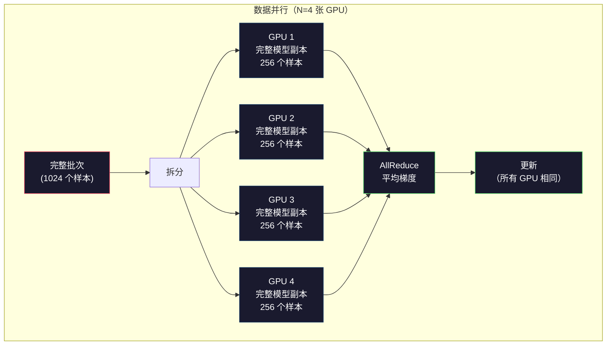
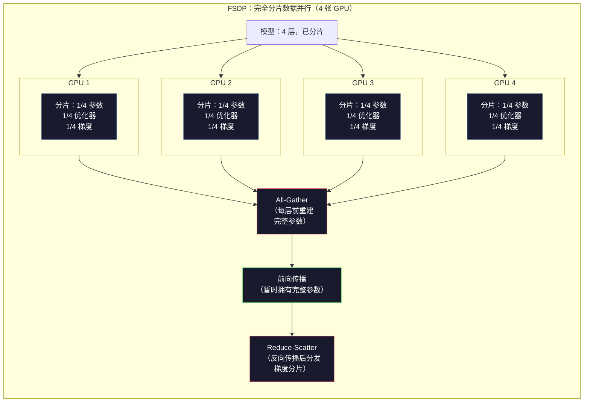
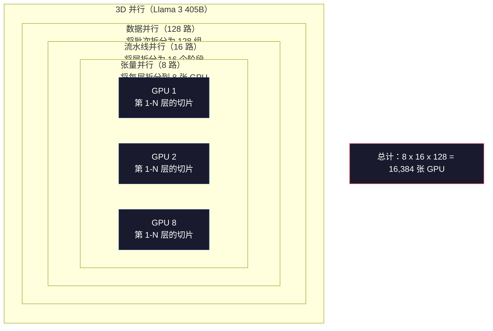

# 扩展：分布式训练（Distributed Training）、FSDP、DeepSpeed

> 你的 124M 模型已经能在单张 GPU 上训练。现在试试 70 亿参数。模型装不进显存。单机处理数据要花上数周。在这种规模下，分布式训练不是可选项，而是唯一的前进路径。

**类型：** 构建  
**语言：** Python  
**前置条件：** 第 10 阶段，第 04 课（预训练一个迷你 GPT）  
**时长：** ~120 分钟

## 学习目标

- 解释三种并行方式——数据并行（data parallelism）、张量并行（tensor parallelism）和流水线并行（pipeline parallelism）——以及它们分别在何种模型规模和集群规模下必不可少
- 使用 PyTorch DDP 实现数据并行训练，并在多张 GPU 之间同步梯度
- 计算给定模型规模的内存预算（权重 + 优化器状态 + 梯度 + 激活值（activations）），从而确定最低硬件要求
- 配置完全分片数据并行（Fully Sharded Data Parallel, FSDP）或 DeepSpeed ZeRO 阶段，将模型状态分片到多张 GPU 上，以容纳超出单卡显存的模型

## 问题

一个 7B 参数模型在 FP16 下，仅权重就需要 14GB。Adam 优化器会为每个参数额外存储两份副本（第一矩估计和第二矩估计）。这又多出 28GB。反向传播（backpropagation）时的梯度再增加 14GB。在还没存下任何一个激活值之前，你就已经用掉了 56GB。

NVIDIA A100 拥有 80GB 显存。

80GB 里已经吃掉了 56GB。还剩 24GB 留给激活值——也就是前向传播时计算出的中间值，而这些值必须保留到反向传播时使用。对于一个 2048 token 序列和 4096 隐藏维度的模型，单层激活值大约占用 64MB。若有 32 层，每个样本就需要 2GB。批大小为 8 时需要 16GB。你只有 24GB。批大小到 12 就会爆掉。

现在试试 70B 参数。仅权重：FP16 下 140GB。单张 GPU 根本放不下。你至少需要 2 张 A100（2 x 80GB = 160GB）才能只把权重装进去。再加上优化器状态和梯度，需求会高得多：最少也要 3 张 GPU，现实中通常要 8-16 张，取决于分片策略。

Llama 3 405B 使用 16,384 张 NVIDIA H100 GPU 完成训练。这次训练仅算力成本估计就高达 1 亿美元。DeepSeek V3 通过在架构上做出更聪明的设计（专家混合（Mixture of Experts, MoE）意味着每个 token 只激活一部分参数）以及提升训练效率，将一个可比模型的训练成本降到了大约 560 万美元。

本课介绍让大规模训练成为可能的四种策略：数据并行、张量并行、流水线并行，以及完全分片数据并行。你会先用纯 Python 模拟每一种方法，理解其机制，然后再接触真正的分布式训练框架。

## 核心概念

### 为什么必须分布式化

下面是真实模型的显存账本。每个数字都经过计算，而不是估算。

| 模型 | 参数量 | 权重（FP16） | Adam 状态 | 梯度（FP16） | 总计（不含激活值） |
|-------|--------|---------------|------------|----------------|----------------------|
| GPT-2 Small | 124M | 248 MB | 992 MB | 248 MB | 1.5 GB |
| Llama 3 8B | 8B | 16 GB | 64 GB | 16 GB | 96 GB |
| Llama 3 70B | 70B | 140 GB | 560 GB | 140 GB | 840 GB |
| Llama 3 405B | 405B | 810 GB | 3,240 GB | 810 GB | 4,860 GB |

“Adam 状态”这一列才是真正的杀手。Adam 会为每个参数存储运行中的均值（m）和方差（v），而且都用 FP32。对一个 70B 模型来说，就是 70B x 4 bytes x 2 = 560GB。光优化器本身就需要 7 张 A100。

单张 H100 也只有 80GB。Llama 3 405B 至少需要 61 张 H100 才能装下权重、优化器和梯度。再把激活值算进去，数量还会继续上涨。Meta 使用 16,384 张 GPU，不是因为他们想这么做，而是因为他们必须这么做。

### 数据并行

这是最简单的分布式策略。把整个模型复制到 N 张 GPU 上。把每个训练批次均分成 N 份。每张 GPU 都在自己的数据分片上运行一次前向和反向传播。反向传播结束后，在所有 GPU 之间对梯度求平均。随后，每张 GPU 都用同一组平均梯度更新自己的权重副本，从而保持所有副本同步。

**优点：** 吞吐量近似线性扩展。N 张 GPU 每步能处理 N 倍数据。通信主要是梯度平均，而且可以与计算重叠。

**缺点：** 每张 GPU 都要持有完整的模型、优化器状态和梯度副本。对于 70B 模型，每张 GPU 需要 840GB。数据并行无法降低单卡显存占用，它只能缩短训练时间。

**数学关系：** 有效批大小 = 每卡批大小 x N。若 N=64 且每卡批大小为 16，则有效批大小为 1,024。Llama 3 每步使用的有效批大小为 1600 万个 token。



### 张量并行

把单个层拆分到多张 GPU 上。一次矩阵乘法会被分配到多张 GPU 上，每张卡计算结果的一部分。

以前馈层中的一个形状为 (8192, 8192) 的权重矩阵为例。若采用 4 路张量并行，每张 GPU 持有一个 (8192, 2048) 的分片。每张 GPU 都用输入乘上自己的分片，产生部分结果。然后再通过全归约（all-reduce）或全量收集（all-gather）把这些部分结果组合起来，得到完整输出。

**优点：** 降低单张 GPU 上的模型权重显存占用。一个 70B 模型若拆到 8 张 GPU 上，每张 GPU 只需持有约 8.75B 参数对应的权重。

**缺点：** 每一层之后都需要快速的 GPU 间通信。每次矩阵乘法（matmul）后的全归约都会引入延迟。这在 NVLink 下效果很好（同一节点内 GPU 间带宽可达 900 GB/s），但跨节点通过 InfiniBand 时效果较差（400 Gb/s，大约 50 GB/s）。因此，张量并行几乎总是局限在单个节点内部（8 张 GPU）。

**真实用法：** Megatron-LM 开创了张量并行。Llama 3 405B 在每个节点内部使用 8 路张量并行。

### 流水线并行

按层来拆分模型。GPU 1 运行第 1-8 层。GPU 2 运行第 9-16 层。GPU 3 运行第 17-24 层。GPU 4 运行第 25-32 层。数据沿着流水线流动：GPU 1 算完自己的层并把激活值发送给 GPU 2，GPU 2 再算自己的层并发送给 GPU 3，以此类推。

**优点：** GPU 之间通信量很小——只需传递层边界上的激活值，这相比梯度或权重要小得多。由于带宽需求较低，它也适用于跨节点。

**缺点：** 存在流水线气泡（pipeline bubble）。当 GPU 4 正在处理微批（micro-batches）1 的前向传播时，GPU 1、2、3 处于空闲状态（它们已经把自己的部分前传完了）。反向传播时情况会反过来。若采用朴素流水线方式，N 个流水线阶段的 GPU 利用率只有 1/N。

**GPipe 和 PipeDream** 通过把批次拆成多个微批来解决气泡问题。GPU 1 一完成微批 1 的前向传播，就能立刻开始处理微批 2。这样就能让不同流水线阶段的计算相互重叠。若有 M 个微批和 N 个阶段，气泡占比（bubble fraction）会降到 (N-1)/M。若 N=4 且使用 M=16 个微批，则气泡为 3/16 = 18.75% 的空闲时间。

### FSDP：完全分片数据并行

FSDP 将数据并行的可扩展性与分片的内存效率结合起来。它不再让每张 GPU 都持有完整模型副本，而是只持有 1/N 的参数、梯度和优化器状态。

在某一层前向传播之前，FSDP 会执行一次 **全量收集（all-gather）**，把所有 GPU 上的完整参数收集到每张 GPU 的内存中。前向传播结束后，每张 GPU 会丢弃不属于自己的参数。反向传播期间，会再次执行 all-gather 来重建参数，以便计算梯度。反向传播结束后，**归约散播（reduce-scatter）** 会把梯度分片分发出去，使每张 GPU 只保存 1/N 的梯度。

**70B 模型在 8 张 GPU 上的计算：**

| 组件 | 不使用 FSDP | 使用 FSDP |
|-----------|-------------|-----------|
| 权重（FP16） | 每张 GPU 140 GB | 每张 GPU 17.5 GB |
| Adam 状态（FP32） | 每张 GPU 560 GB | 每张 GPU 70 GB |
| 梯度（FP16） | 每张 GPU 140 GB | 每张 GPU 17.5 GB |
| **总计** | **每张 GPU 840 GB** | **每张 GPU 105 GB** |

如果不使用 FSDP，你无法把 70B 模型塞进单张 80GB GPU。即便在 8 张 GPU 上使用 FSDP，每张 GPU 也要 105GB——等等，这还是放不下。你至少需要 16 张 GPU 才能把每卡占用降到 80GB 以下，或者把 FSDP 与激活检查点（activation checkpointing）结合使用（在反向传播时重算激活值，而不是始终存储它们）。

由于每层前都要执行 all-gather，它的通信成本高于普通数据并行。但显存节省让原本不可能的训练任务变得可行。



### DeepSpeed ZeRO

DeepSpeed 的 ZeRO（Zero Redundancy Optimizer）在概念上与 FSDP 完全一致，只是由 Microsoft 独立开发。它定义了三个阶段，而且每个阶段都更激进地做分片：

| 阶段 | 分片内容 | 内存节省 | 通信 |
|-------|--------|---------------|---------------|
| ZeRO-1 | 仅优化器状态 | 约 4 倍降低 | 与数据并行相同 |
| ZeRO-2 | + 梯度 | 约 8 倍降低 | 略高一些 |
| ZeRO-3 | + 参数 | 约 Nx 降低（N 张 GPU） | 每层一次 all-gather |

ZeRO-3 等价于 FSDP。名称不同，机制相同。PyTorch 在 DeepSpeed 证明这一概念之后，将 FSDP 作为原生实现加入框架。

DeepSpeed 还引入了 ZeRO-Offload（把优化器状态卸载到 CPU RAM，容量更大、成本更低）和 ZeRO-Infinity（卸载到 NVMe SSD）。这些方法用计算速度换取内存容量——被卸载的操作会更慢，但能释放 GPU 显存。

### 混合精度训练

现代训练会同时使用多种浮点格式：

- **前向传播：** FP16 或 BF16（16 位）。显存只有 FP32 的一半。矩阵乘法（matmul）在张量核心（tensor cores）上的速度可达 2 倍。
- **主权重：** FP32（32 位）。由优化器维护，用于在权重更新时保持数值精度。
- **损失缩放（loss scaling）：** 在反向传播前先把 loss 乘上一个大常数，避免 FP16 梯度下溢到 0；在优化器更新前再除以同一个常数。

BF16（Brain Float 16）与 FP32 拥有相同的指数范围（8 个指数位），但精度更低（7 个尾数位，而 FP32 为 23 个）。它很少需要损失缩放，因为它能表示相同范围的数值。FP16 只有 5 个指数位和 10 个尾数位——它能表示更细的数值粒度，但在极端量级下更容易上溢或下溢。

Google 的 TPU 原生支持 BF16。NVIDIA 的 A100 和 H100 同时支持 FP16 和 BF16。整个行业已经基本转向 BF16，因为它消除了损失缩放带来的麻烦。

**7B 模型的内存对比：**

| 精度 | 权重 | 优化器 | 梯度 | 总计 |
|-----------|---------|-----------|-----------|-------|
| 全部使用 FP32 | 28 GB | 56 GB | 28 GB | 112 GB |
| 混合（BF16 + FP32 主副本） | 14 GB | 56 GB | 14 GB | 84 GB |

混合精度在这个模型上节省了 28GB。但优化器状态无论如何都保留在 FP32——绝大多数显存都耗在这里。

### Megatron-LM 与 3D 并行

真正的大规模训练会同时组合这三种并行方式：

- 跨节点组做 **数据并行**（扩大批大小）
- 在单个节点内部做 **张量并行**（把层拆到 8 张 GPU 上）
- 跨节点做 **流水线并行**（把层组拆到多台机器上）

Llama 3 405B 在 16,384 张 H100 上的配置：
- 每个节点内部 8 路张量并行（每节点 8 张 GPU）
- 跨节点 16 路流水线并行（16 个流水线阶段）
- 剩余维度上做 128 路数据并行（16,384 / 8 / 16 = 128）

这种 3D 分解（8 x 16 x 128 = 16,384）就是你扩展到上千张 GPU 的方法。每张 GPU 都看到不同的数据分片（数据并行），持有每一层的一部分切片（张量并行），并负责不同的一组层（流水线并行）。

DeepSeek V3 采取了不同路线。它的专家混合架构每个 token 只激活 671B 参数中的 37B。这意味着每张 GPU 只需要计算（并为之保存激活值）当前激活的那些参数。他们使用 2,048 张 H800 GPU 完成训练——不到 Meta GPU 数量的 1/8——成本为 560 万美元，而 Meta 的估算成本约为 1 亿美元。



## 动手构建

### 第 1 步：模拟数据并行

把一个批次拆分到模拟 GPU 上。每张 GPU 都在自己的分片上计算一次前向传播。然后对“梯度”求平均（这里把它们模拟为 loss 值）。

```python
import numpy as np

def simulate_data_parallelism(data, num_gpus, model_fn):
    batch_size = len(data)
    shard_size = batch_size // num_gpus
    remainder = batch_size % num_gpus

    gpu_losses = []
    gpu_gradients = []

    offset = 0
    for gpu_id in range(num_gpus):
        extra = 1 if gpu_id < remainder else 0
        shard = data[offset:offset + shard_size + extra]
        offset += shard_size + extra

        loss, grad = model_fn(shard)
        gpu_losses.append(loss)
        gpu_gradients.append(grad)

    avg_loss = np.mean(gpu_losses)
    avg_gradient = np.mean(gpu_gradients, axis=0)

    return avg_loss, avg_gradient
```

全归约（all-reduce）操作——也就是对梯度求平均——是数据并行中唯一的通信步骤。在实际系统里，这通常由 NVIDIA GPU 上的 NCCL 库完成，它实现的是环形全归约（ring all-reduce）：每张 GPU 向相邻节点发送自己 1/N 的梯度，同时从另一个邻居接收 1/N；经过 N-1 步后，每张 GPU 都拿到了完整的平均结果。总通信量为：2 x gradient_size x (N-1)/N；当 N 很大时，会逼近 2 倍梯度大小。

### 第 2 步：模拟张量并行

把一个权重矩阵拆分到多张 GPU 上。每张 GPU 计算一次部分矩阵乘法。然后把结果组合起来。

```python
def simulate_tensor_parallelism(input_data, weight_matrix, num_gpus):
    d_in, d_out = weight_matrix.shape
    assert d_out % num_gpus == 0, f"d_out {d_out} not divisible by num_gpus {num_gpus}"
    shard_size = d_out // num_gpus

    partial_results = []
    for gpu_id in range(num_gpus):
        start = gpu_id * shard_size
        end = start + shard_size
        weight_shard = weight_matrix[:, start:end]

        partial = input_data @ weight_shard
        partial_results.append(partial)

    full_output = np.concatenate(partial_results, axis=-1)

    direct_output = input_data @ weight_matrix
    error = np.abs(full_output - direct_output).max()

    return full_output, error
```

这个误差应该精确为 0（或者只剩机器精度误差）。张量并行在数学上是完全精确的——它与在单张 GPU 上计算完整 matmul 的结果相同。这里沿输出维度做拆分，因此每张 GPU 负责输出列中的不同块，最后通过拼接重建完整结果。

对于列并行线性层（column-parallel linear layers，拆分输出维度），你要做拼接。对于行并行（row-parallel，拆分输入维度），你要做求和。在 transformer 的 FFN 中，第一层线性层（expand）使用列并行，第二层线性层（contract）使用行并行。这样可以避免在两层之间执行一次 all-reduce。

### 第 3 步：模拟流水线并行

把模型的层拆分到虚拟 GPU 上。展示气泡问题：前面的阶段会在后面的阶段计算时处于空闲。

```python
def simulate_pipeline_parallelism(num_layers, num_stages, num_microbatches):
    layers_per_stage = num_layers // num_stages

    timeline = {}
    clock = 0

    for mb in range(num_microbatches):
        for stage in range(num_stages):
            start_time = max(
                timeline.get((stage, mb - 1, "fwd"), (0, 0))[1] if mb > 0 else 0,
                timeline.get((stage - 1, mb, "fwd"), (0, 0))[1] if stage > 0 else 0,
            )
            end_time = start_time + layers_per_stage
            timeline[(stage, mb, "fwd")] = (start_time, end_time)

    last_fwd_end = max(v[1] for v in timeline.values())

    for mb in range(num_microbatches - 1, -1, -1):
        for stage in range(num_stages - 1, -1, -1):
            deps = [last_fwd_end]
            if mb < num_microbatches - 1 and (stage, mb + 1, "bwd") in timeline:
                deps.append(timeline[(stage, mb + 1, "bwd")][1])
            if stage < num_stages - 1 and (stage + 1, mb, "bwd") in timeline:
                deps.append(timeline[(stage + 1, mb, "bwd")][1])
            start_time = max(deps)
            end_time = start_time + layers_per_stage
            timeline[(stage, mb, "bwd")] = (start_time, end_time)

    total_time = max(v[1] for v in timeline.values())
    compute_time = num_microbatches * num_stages * layers_per_stage * 2
    bubble_fraction = 1.0 - compute_time / (total_time * num_stages)

    return timeline, total_time, bubble_fraction
```

当有 4 个阶段、1 个微批时，气泡占比高达 75%——任意时刻四张 GPU 里有三张是空闲的。若使用 16 个微批，这个比例会降到约 19%。消除气泡的代价是内存：你必须同时保存所有“在途”微批的激活值。

### 第 4 步：内存计算器

精确计算任意模型规模训练所需的内存。

```python
def memory_calculator(
    params_billions,
    precision_bytes=2,
    optimizer="adam",
    num_gpus=1,
    sharding="none",
    sequence_length=2048,
    batch_size_per_gpu=1,
    hidden_dim=None,
    num_layers=None,
):
    params = params_billions * 1e9

    weight_memory = params * precision_bytes

    if optimizer == "adam":
        optimizer_memory = params * 4 * 2
    elif optimizer == "sgd":
        optimizer_memory = params * 4
    else:
        optimizer_memory = 0

    gradient_memory = params * precision_bytes

    total_no_activation = weight_memory + optimizer_memory + gradient_memory

    if hidden_dim and num_layers:
        activation_per_layer = (
            sequence_length * batch_size_per_gpu * hidden_dim * precision_bytes * 4
        )
        activation_memory = activation_per_layer * num_layers
    else:
        activation_memory = params * precision_bytes * 0.5

    if sharding == "fsdp" or sharding == "zero3":
        weight_memory /= num_gpus
        optimizer_memory /= num_gpus
        gradient_memory /= num_gpus
    elif sharding == "zero2":
        optimizer_memory /= num_gpus
        gradient_memory /= num_gpus
    elif sharding == "zero1":
        optimizer_memory /= num_gpus

    per_gpu_total = weight_memory + optimizer_memory + gradient_memory + activation_memory
    return {
        "params_billions": params_billions,
        "weights_gb": weight_memory / 1e9,
        "optimizer_gb": optimizer_memory / 1e9,
        "gradients_gb": gradient_memory / 1e9,
        "activations_gb": activation_memory / 1e9,
        "per_gpu_total_gb": per_gpu_total / 1e9,
        "total_across_gpus_gb": per_gpu_total * num_gpus / 1e9,
        "fits_on_80gb": per_gpu_total / 1e9 <= 80,
        "num_gpus": num_gpus,
        "sharding": sharding,
    }
```

这个计算器回答了每个机器学习工程师都会问的问题：“我到底需要多少张 GPU？” 把模型规模喂进去，看看它能不能装下。不断调整分片策略，直到每张 GPU 的总占用降到 80GB 以下。

### 第 5 步：混合精度模拟

比较 FP32、FP16 和混合精度训练之间的内存占用。

```python
def mixed_precision_comparison(params_billions):
    params = params_billions * 1e9

    fp32_weights = params * 4
    fp32_optimizer = params * 4 * 2
    fp32_gradients = params * 4
    fp32_total = fp32_weights + fp32_optimizer + fp32_gradients

    fp16_weights = params * 2
    fp16_master = params * 4
    fp16_optimizer = params * 4 * 2
    fp16_gradients = params * 2
    fp16_total = fp16_weights + fp16_master + fp16_optimizer + fp16_gradients

    mixed_weights = params * 2
    mixed_optimizer = params * 4 * 2
    mixed_gradients = params * 2
    mixed_total = mixed_weights + mixed_optimizer + mixed_gradients

    return {
        "fp32_total_gb": fp32_total / 1e9,
        "fp16_with_master_gb": fp16_total / 1e9,
        "mixed_bf16_gb": mixed_total / 1e9,
        "savings_vs_fp32": 1 - mixed_total / fp32_total,
    }
```

对大多数人来说，最大的意外是：混合精度并不会把内存减半。优化器状态（Adam 的 m 和 v）无论使用什么精度都保留在 FP32。对于一个 7B 模型，FP32 训练需要 112GB。混合精度需要 84GB。这只是减少了 25%，不是 50%。真正占大头的是优化器。

## 使用

### 运行全部模拟

```python
def run_all_demos():
    print("=" * 70)
    print("DATA PARALLELISM SIMULATION")
    print("=" * 70)

    np.random.seed(42)
    data = np.random.randn(64, 32)
    weight = np.random.randn(32, 16)

    def model_fn(batch):
        output = batch @ weight
        loss = np.mean(output ** 2)
        grad = 2 * batch.T @ (batch @ weight) / len(batch)
        return loss, grad

    for n_gpus in [1, 2, 4, 8]:
        loss, grad = simulate_data_parallelism(data, n_gpus, model_fn)
        print(f"  {n_gpus} GPUs: loss={loss:.4f}, grad_norm={np.linalg.norm(grad):.4f}")

    print()
    print("=" * 70)
    print("TENSOR PARALLELISM SIMULATION")
    print("=" * 70)

    x = np.random.randn(4, 8192)
    W = np.random.randn(8192, 8192)

    for n_gpus in [1, 2, 4, 8]:
        output, error = simulate_tensor_parallelism(x, W, n_gpus)
        print(f"  {n_gpus} GPUs: output_shape={output.shape}, max_error={error:.2e}")

    print()
    print("=" * 70)
    print("PIPELINE PARALLELISM SIMULATION")
    print("=" * 70)

    for n_mb in [1, 4, 8, 16, 32]:
        _, total_t, bubble = simulate_pipeline_parallelism(32, 4, n_mb)
        print(f"  {n_mb:2d} micro-batches: total_time={total_t:4d}, bubble={bubble:.1%}")

    print()
    print("=" * 70)
    print("MEMORY CALCULATOR")
    print("=" * 70)

    configs = [
        (7, "none", 1),
        (7, "fsdp", 8),
        (70, "none", 1),
        (70, "fsdp", 8),
        (70, "fsdp", 16),
        (405, "fsdp", 64),
        (405, "fsdp", 128),
    ]

    print(f"  {'Model':>8} {'Sharding':>8} {'GPUs':>5} {'Per-GPU':>10} {'Fits 80GB':>10}")
    print("  " + "-" * 50)
    for params, shard, gpus in configs:
        result = memory_calculator(params, num_gpus=gpus, sharding=shard)
        fits = "Yes" if result["fits_on_80gb"] else "No"
        print(f"  {params:>6}B {shard:>8} {gpus:>5} {result['per_gpu_total_gb']:>8.1f}GB {fits:>10}")

    print()
    print("=" * 70)
    print("MIXED PRECISION COMPARISON")
    print("=" * 70)

    for params_b in [7, 13, 70, 405]:
        result = mixed_precision_comparison(params_b)
        print(f"  {params_b}B: FP32={result['fp32_total_gb']:.0f}GB, "
              f"Mixed BF16={result['mixed_bf16_gb']:.0f}GB, "
              f"Savings={result['savings_vs_fp32']:.0%}")
```

## 交付成果

本课会产出 `outputs/prompt-distributed-training-planner.md`——一个提示词（prompt），它接收模型规模和可用硬件，然后生成一份完整的分布式训练方案：并行策略、内存预算、通信开销以及预期吞吐量。

## 练习

1. 修改内存计算器，把激活检查点（activation checkpointing）考虑进去。启用检查点后，只在每隔 K 层的位置保存激活值（典型的 K=1，意味着全部重算）。展示内存与计算之间的权衡：检查点能节省多少内存？训练又会变慢多少（完整检查点大致会多出 33% 计算量）？

2. 扩展流水线并行模拟，实现 PipeDream 使用的 1F1B（one forward, one backward）调度。将其与朴素调度在 4 个阶段、8 个微批下的气泡占比做比较。1F1B 调度的峰值显存应该更低，因为它会更早启动反向传播。

3. 实现一个梯度累积（gradient accumulation）模拟器。不要在每个微批之后都执行 all-reduce，而是先在本地累计 K 步梯度，再做一次 all-reduce。展示这种方法如何把通信量降低 K 倍，同时产生完全相同的最终梯度（因此训练结果也相同）。

4. 构建一个成本估算器。给定模型规模、目标 token 数量、GPU 类型（A100 为 $2/小时，H100 为 $3.50/小时）以及并行策略，估算总训练成本（美元）。并与已知成本做校验：据报道，Llama 3 405B 约耗资 1 亿美元，DeepSeek V3 约耗资 560 万美元。

5. 在内存计算器中加入 ZeRO-Offload。假设每个节点有 512GB CPU RAM 和 2TB NVMe。展示把优化器状态卸载到 CPU 后，如何让 70B 模型在 4 张 GPU 上训练，而不是 16 张，但代价是优化器步骤会慢 30-50%。

## 关键术语

| 术语 | 常见说法 | 实际含义 |
|------|----------------|----------------------|
| 数据并行 | “把模型复制到每张 GPU 上” | 每张 GPU 处理不同的数据分片；每一步之后通过 all-reduce 对梯度求平均 |
| 张量并行 | “把一层拆到多张 GPU 上” | 对权重矩阵做分区，让每张 GPU 计算 matmul 的一部分；需要高速 NVLink 互连 |
| 流水线并行 | “把不同层拆到不同 GPU 上” | 每张 GPU 运行不同的一组层；数据以微批形式流过流水线，以减少气泡 |
| FSDP | “把所有东西都分片” | Fully Sharded Data Parallel——每张 GPU 持有 1/N 的权重、梯度和优化器状态；计算前执行 all-gather |
| ZeRO | “DeepSpeed 版的 FSDP” | Zero Redundancy Optimizer，共有 3 个阶段：分片优化器（Stage 1），+ 梯度（Stage 2），+ 参数（Stage 3） |
| All-reduce | “在所有 GPU 之间求平均” | 一种集合通信操作，每张 GPU 最终都会得到所有 GPU 输入的和（或平均值）——通常实现为 ring all-reduce |
| All-gather | “从所有 GPU 收集” | 一种集合通信操作，每张 GPU 最终都会得到所有 GPU 数据拼接后的结果——FSDP 用它来重建完整参数 |
| Reduce-scatter | “先求和再分发” | 一种集合通信操作，先对数据做归约（求和），再把不同块分发到不同 GPU——FSDP 用它来做梯度分片 |
| 混合精度 | “用半精度训练” | 前向/反向使用 FP16/BF16，优化器状态使用 FP32——大约节省 25% 显存，而不是 50%，因为优化器才是大头 |
| 流水线气泡 | “流水线里的空闲时间” | GPU 因等待上一阶段传来数据而处于空闲的时间占比——可通过使用更多微批来降低 |

## 延伸阅读

- [Rajbhandari et al., 2020 -- "ZeRO: Memory Optimizations Toward Training Trillion Parameter Models"](https://arxiv.org/abs/1910.02054) -- 定义三阶段分片的 DeepSpeed ZeRO 论文
- [Shoeybi et al., 2020 -- "Megatron-LM: Training Multi-Billion Parameter Language Models Using Model Parallelism"](https://arxiv.org/abs/1909.08053) -- NVIDIA 针对 transformer 的张量并行方法
- [Narayanan et al., 2021 -- "Efficient Large-Scale Language Model Training on GPU Clusters Using Megatron-LM"](https://arxiv.org/abs/2104.04473) -- 结合数据、张量和流水线的 3D 并行
- [Zhao et al., 2023 -- "PyTorch FSDP: Experiences on Scaling Fully Sharded Data Parallel"](https://arxiv.org/abs/2304.11277) -- PyTorch 原生 FSDP 的实现经验
- [Llama 3 Technical Report](https://arxiv.org/abs/2407.21783) -- 使用 16,384 张 GPU 进行 3D 并行训练的细节
- [DeepSeek-V3 Technical Report](https://arxiv.org/abs/2412.19437) -- MoE 架构如何把训练成本降低一个数量级
