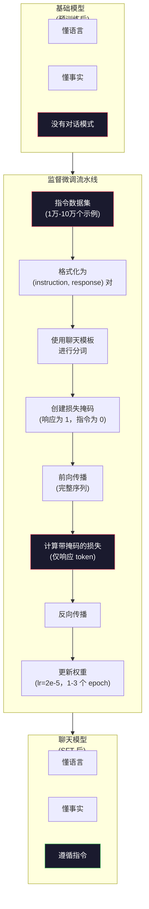

# 指令微调（Instruction Tuning，SFT）

> 基础模型只会预测下一个词元（token）。仅此而已。它不会遵循指令、回答问题，也不会拒绝有害请求。SFT 是连接词元预测器与实用助手的桥梁。你曾经对话过的每个模型——Claude、GPT、Llama Chat——都经历过这一步。

**类型：** 构建
**语言：** Python（使用 numpy）
**前置要求：** 第 10 阶段，第 04 课（预训练一个 Mini GPT）
**时间：** ~90 分钟

## 学习目标

- 实现监督微调（Supervised Fine-Tuning，SFT），把基础语言模型转换为能够遵循指令的助手
- 使用带有 system、user 和 assistant 角色的聊天模板（chat template）来格式化训练数据，并对非 assistant 词元屏蔽损失
- 解释为什么 SFT 是必要的：基础模型会续写文本，而不是回答问题
- 通过在留出的指令集上比较基础模型与微调模型的响应，评估 SFT 质量

## 问题

你在第 04 课中训练了一个模型。它可以在给定序列的情况下预测下一个词元。给它输入 “The transformer architecture”，它可能会续写成 “has revolutionized natural language processing.”。对于一个下一个词元预测器来说，这已经很厉害了。

现在试试这个：给它输入 “What is the capital of France?”。基础模型不会回答 “Paris.”。它会延续模式。它可能输出 “What is the capital of Germany? What is the capital of Spain?”，因为它从包含问题列表的文档中学到了这种模式。或者它可能输出 “is a question that many people ask”，因为那是一个合理的下一个词元续写。模型没有*回答*这个概念。它只知道*续写*。

这就是 GPT-3（基础模型，发布于 2020 年 6 月）与 ChatGPT（经过指令微调，发布于 2022 年 11 月）之间的差距。相同的架构。相同的预训练（pre-training）。区别在于 20,000 到 100,000 个精心构造的（instruction, response）样本对，它们教会了模型遵循对话模式。

Stanford Alpaca 证明了你不需要数百万个样本。2023 年 3 月，他们只用 GPT-3.5 生成的 52,000 个指令-响应样本对，就对 Llama 7B 进行了微调。总成本：600 美元。结果是一个能够遵循指令、回答问题并进行对话的聊天机器人。虽然不如 ChatGPT，但对 600 美元和几小时训练来说，效果已经惊人地接近了。

Meta 的 Llama 2 Chat 在初始 SFT 阶段只使用了大约 27,000 个高质量样本。关键洞见是：质量比数量更重要。由熟练标注员编写的 27,000 个样本，胜过从互联网抓取的 100 万个嘈杂样本。

## 概念

### SFT 实际上做了什么

监督微调（Supervised Fine-Tuning，SFT）延续了与预训练相同的训练循环——前向传播、计算损失、反向传播、更新权重——只是使用了不同类型的数据。你训练的不再是原始文本，而是结构化对话：

```json
{
  "system": "You are a helpful assistant.",
  "user": "What is the capital of France?",
  "assistant": "The capital of France is Paris."
}
```

模型早已知道 Paris 是 France 的首都。它在对 Wikipedia、教材和网页的预训练中学到了这一点。SFT 不会教模型新的事实。它教的是一种新的*行为*：当你看到一个问题时，生成一个答案；当你看到一条指令时，生成一个补全；当你看到一个有害请求时，生成一个拒绝。

可以这样理解：预训练给模型知识，SFT 给模型礼貌。

### 数据格式

有三种格式主导着行业。它们编码的是同样的信息——谁说了什么——只是分隔符不同。

**Alpaca 格式**（Stanford，2023 年 3 月）：

```json
{
  "instruction": "Summarize the following article in 3 sentences.",
  "input": "The European Central Bank raised interest rates...",
  "output": "The ECB increased rates by 25 basis points..."
}
```

简单而且使用广泛。`input` 字段是可选的——许多指令并不需要额外上下文。Stanford 以这种格式发布了 52,000 个样本，由 GPT-3.5 以 600 美元生成。这开启了开源指令微调运动。

**ShareGPT 格式**（社区，2023）：

```json
{
  "conversations": [
    {"from": "system", "value": "You are a helpful assistant."},
    {"from": "human", "value": "What causes tides?"},
    {"from": "gpt", "value": "Tides are caused by the gravitational pull of the Moon..."},
    {"from": "human", "value": "How often do they occur?"},
    {"from": "gpt", "value": "Most coastal areas experience two high tides and two low tides per day..."}
  ]
}
```

它支持多轮对话。按照惯例，`from` 字段使用 “human” 和 “gpt”，无论实际模型是什么。Vicuna 是在 70,000 段从用户分享的 ChatGPT 对话记录中抓取的 ShareGPT 对话上训练的。

**ChatML 格式**（OpenAI，许多开源模型都在使用）：

```
<|im_start|>system
You are a helpful assistant.<|im_end|>
<|im_start|>user
What is the capital of France?<|im_end|>
<|im_start|>assistant
The capital of France is Paris.<|im_end|>
```

它使用特殊词元（`&lt;|im_start|>`、`&lt;|im_end|>`）来分隔角色。这些词元会在微调期间加入分词器（tokenizer）的词表。Qwen、Yi 以及许多其他模型都使用 ChatML。

这三种格式做的事情其实相同：它们告诉模型“这是指令，这是响应，学会这种模式”。

### 为什么它有效

模型已经通过预训练掌握了语言。它见过数十亿个“问题后接答案”“指令后接补全”以及“人与人对话”的例子。这些模式早就编码进权重里了。

SFT 会把这种潜在能力集中起来。模型不再需要根据上下文自己判断应该回答问题还是续写文档；SFT 会显式地在对话模式上进行训练。几千个样本之后，模型就学会了：当你看到 assistant 角色标记时，生成一个有帮助的响应。

这就是为什么 27,000 个样本就够了。你不是在教模型英语。你不是在教它世界知识。你是在教它一种简单行为：响应指令。知识本来就已经在那里了。

### 掩码损失

这是 SFT 中最重要的技术细节，而大多数教程都会跳过它。

在预训练期间，你会对每个词元计算损失。模型学习预测序列中的每一个下一个词元。在 SFT 期间，你只对*响应*词元计算损失。指令词元只是上下文，模型不会因为“预测”错了它们而受到惩罚。

为什么？因为你不希望模型学会*生成*指令。你希望它学会*响应*指令。如果你也对指令词元计算损失，那你实际上是在把 “What is the capital of France?” 当作模型自己提出的问题来训练它预测。这会浪费梯度信号，也会让模型对自己的角色产生混淆。

在实践中，你需要创建一个损失掩码（loss mask）：响应词元为 1，指令词元为 0。在求平均之前，先把逐词元损失乘上这个掩码。

```
Tokens:    [SYS] You are helpful [USER] What is the capital? [ASST] Paris is the capital [EOS]
Loss mask:   0    0    0     0      0     0   0  0     0       1     1    1   1     1      1
```

只有 `[ASST]` 之后的词元会对损失产生贡献。模型在前向传播时会看到完整对话（它需要指令来生成正确响应），但它只会根据自己对响应预测得有多好来更新权重。

### 训练超参数

SFT 使用的超参数与预训练截然不同。你不是从零开始训练。你是在调整一个已经能工作的模型。

| 参数 | 预训练（Llama 2 7B） | SFT（Llama 2 Chat） |
|-----------|---------------------------|---------------------|
| 学习率 | 3e-4（峰值） | 2e-5 |
| Epoch 数 | 1（单次遍历数据） | 2 |
| 批大小 | 4M tokens | 64 个示例 |
| 预热步数 | 2,000 | 0-100 |
| 权重衰减 | 0.1 | 0.0-0.1 |
| 数据规模 | 2T tokens | 27,000 个示例 |

SFT 的学习率低了 15 倍。这一点至关重要。微调时使用高学习率会摧毁预训练知识。模型会“忘记”自己学过的内容，并对小规模微调数据集过拟合。这就是灾难性遗忘（catastrophic forgetting）。

两个 epoch 意味着模型会看到每个训练样本两次。对小数据集训练超过 3 个 epoch 会导致记忆化——模型开始逐字复现训练样本，而不是进行泛化。

### 灾难性遗忘

微调会破坏通用能力。如果你在遵循指令的数据上训练得太久，模型会失去写代码、做数学或生成创意文本的能力。它会变得非常擅长训练数据中的特定格式，却在其他事情上变得很糟。

三种缓解方法：

1. **低学习率。** 1e-5 到 5e-5。更小的更新意味着对预训练特征的破坏更少。

2. **短训练。** 1-3 个 epoch。在模型过拟合之前停止。

3. **混入预训练数据。** Llama 2 Chat 在 SFT 数据集中混入了少量（2-5%）原始预训练数据。这会在学习新指令遵循行为的同时“提醒”模型保留其通用能力。

### 真实数字

在单张 NVIDIA A100 80GB GPU 上，用 10,000 个高质量指令对微调一个 7B 模型大约需要 1 小时。计算如下：

- 10,000 个样本 x 平均 512 个词元 = 5.12M tokens
- 2 个 epoch = 总计 10.24M tokens
- A100 对 7B 模型微调的吞吐量：约 3,000 tokens/秒
- 10.24M / 3,000 = 约 3,400 秒 = 约 57 分钟

对于我们的 mini GPT（4 层，128 维），训练几乎是瞬时完成的。重点在于理解机制，而不是规模。



## 动手构建

### 第 1 步：指令数据集

创建一个合成的指令数据集。在生产环境中，Scale AI 和 Anthropic 这样的公司会雇用人工标注员来编写这些数据。我们将以程序化方式创建它们，以演示这种格式。

```python
import numpy as np

INSTRUCTION_DATA = [
    {
        "instruction": "What is the capital of France?",
        "response": "The capital of France is Paris."
    },
    {
        "instruction": "Explain gravity in one sentence.",
        "response": "Gravity is the force that attracts objects with mass toward each other."
    },
    {
        "instruction": "Write a haiku about the ocean.",
        "response": "Waves crash on the shore, salt and foam beneath the sun, endless blue expanse."
    },
    {
        "instruction": "What is 15 multiplied by 7?",
        "response": "15 multiplied by 7 is 105."
    },
    {
        "instruction": "Name three programming languages.",
        "response": "Three programming languages are Python, Rust, and TypeScript."
    },
    {
        "instruction": "Summarize photosynthesis.",
        "response": "Photosynthesis converts sunlight, water, and carbon dioxide into glucose and oxygen."
    },
    {
        "instruction": "What year did World War II end?",
        "response": "World War II ended in 1945."
    },
    {
        "instruction": "Define machine learning.",
        "response": "Machine learning is a field where algorithms learn patterns from data to make predictions."
    },
]
```

8 个样本非常少。Stanford Alpaca 使用了 52,000 个。但无论你有 8 个还是 52,000 个，机制都完全一样：分词、加掩码、只在响应上计算损失。

### 第 2 步：使用聊天模板进行分词

把指令-响应对转换为带有特殊角色标记的词元序列。这些标记告诉模型指令在哪里结束、响应从哪里开始。

```python
SPECIAL_TOKENS = {
    "INST_START": 253,
    "INST_END": 254,
    "RESP_START": 255,
}


def tokenize_instruction_pair(instruction, response, vocab_size=256):
    inst_tokens = list(instruction.encode("utf-8"))
    resp_tokens = list(response.encode("utf-8"))

    inst_tokens = [min(t, vocab_size - 4) for t in inst_tokens]
    resp_tokens = [min(t, vocab_size - 4) for t in resp_tokens]

    tokens = (
        [SPECIAL_TOKENS["INST_START"]]
        + inst_tokens
        + [SPECIAL_TOKENS["INST_END"]]
        + [SPECIAL_TOKENS["RESP_START"]]
        + resp_tokens
    )

    return tokens


def create_loss_mask(tokens):
    mask = np.zeros(len(tokens), dtype=np.float32)
    in_response = False

    for i, token in enumerate(tokens):
        if token == SPECIAL_TOKENS["RESP_START"]:
            in_response = True
            continue
        if in_response:
            mask[i] = 1.0

    return mask
```

损失掩码对指令词元全部为 0，对响应词元全部为 1。`RESP_START` 词元本身的掩码为 0，因为它是分隔符，不属于响应内容的一部分。

### 第 3 步：带掩码的交叉熵损失

标准交叉熵，但要乘上损失掩码。只有响应词元会对梯度产生贡献。

```python
def masked_cross_entropy_loss(logits, targets, loss_mask):
    batch, seq_len, vocab_size = logits.shape
    logits_flat = logits.reshape(-1, vocab_size)
    targets_flat = targets.reshape(-1)
    mask_flat = loss_mask.reshape(-1)

    max_logits = logits_flat.max(axis=-1, keepdims=True)
    log_softmax = logits_flat - max_logits - np.log(
        np.exp(logits_flat - max_logits).sum(axis=-1, keepdims=True)
    )

    per_token_loss = -log_softmax[np.arange(len(targets_flat)), targets_flat]

    masked_loss = per_token_loss * mask_flat
    num_response_tokens = mask_flat.sum()
    if num_response_tokens == 0:
        return 0.0
    loss = masked_loss.sum() / num_response_tokens

    return loss
```

分母是 `num_response_tokens`，而不是 `seq_len`。如果你按总序列长度去除，较长的指令会稀释梯度信号。按响应词元数量去除，可以确保无论指令多长，每个响应词元的权重都相同。

### 第 4 步：SFT 训练循环

复用第 04 课中的 MiniGPT。训练循环看起来与预训练几乎完全相同，只是加入了指令格式化和带掩码的损失。

```python
import sys
import os
sys.path.insert(0, os.path.join(os.path.dirname(__file__), "..", "..", "04-pre-training-mini-gpt", "code"))
from main import MiniGPT, LayerNorm, FeedForward, MultiHeadAttention, TransformerBlock, Embedding


def sft_train(model, dataset, num_epochs=2, lr=2e-5, seq_len=64):
    formatted_data = []
    for example in dataset:
        tokens = tokenize_instruction_pair(example["instruction"], example["response"])
        mask = create_loss_mask(tokens)
        formatted_data.append((tokens, mask))

    print(f"SFT Training: {len(formatted_data)} examples, {num_epochs} epochs, lr={lr}")
    print(f"Total tokens: {sum(len(t) for t, _ in formatted_data):,}")
    print()

    losses = []

    for epoch in range(num_epochs):
        epoch_loss = 0.0
        num_batches = 0

        indices = np.random.permutation(len(formatted_data))

        for idx in indices:
            tokens, mask = formatted_data[idx]

            if len(tokens) < 3:
                continue
            if len(tokens) > seq_len:
                tokens = tokens[:seq_len]
                mask = mask[:seq_len]

            input_ids = np.array(tokens[:-1]).reshape(1, -1)
            target_ids = np.array(tokens[1:]).reshape(1, -1)
            loss_mask = np.array(mask[1:]).reshape(1, -1)

            logits = model.forward(input_ids)
            loss = masked_cross_entropy_loss(logits, target_ids, loss_mask)

            batch_size, s_len, v_size = logits.shape
            probs = np.exp(logits - logits.max(axis=-1, keepdims=True))
            probs = probs / probs.sum(axis=-1, keepdims=True)
            dlogits = probs.copy()
            dlogits[np.arange(batch_size)[:, None], np.arange(s_len), target_ids] -= 1.0

            mask_expanded = loss_mask[:, :, np.newaxis]
            num_resp = loss_mask.sum()
            if num_resp > 0:
                dlogits = dlogits * mask_expanded / num_resp

            for block in model.blocks:
                block.ffn.W1 -= lr * np.random.randn(*block.ffn.W1.shape) * 0.01
                block.ffn.W2 -= lr * np.random.randn(*block.ffn.W2.shape) * 0.01
                block.ffn.b1 -= lr * np.random.randn(*block.ffn.b1.shape) * 0.01
                block.ffn.b2 -= lr * np.random.randn(*block.ffn.b2.shape) * 0.01

            epoch_loss += loss
            num_batches += 1
            losses.append(loss)

        avg_loss = epoch_loss / max(num_batches, 1)
        print(f"Epoch {epoch + 1}/{num_epochs} | Avg Loss: {avg_loss:.4f}")

    return model, losses
```

学习率是 2e-5，与 Llama 2 Chat 保持一致。对比预训练里使用的 3e-4——小了 15 倍。梯度被加上了掩码：指令词元产生的梯度为零。只有响应词元会推动权重更新。

### 第 5 步：比较基础模型与 SFT 模型

SFT 的核心目标是行为变化。我们通过检查模型对“指令格式输入”的响应与对“原始文本续写”的响应，来衡量这种变化。

```python
def generate_response(model, prompt_tokens, max_new_tokens=50, temperature=0.8):
    tokens = list(prompt_tokens)
    seq_len = model.embedding.pos_embed.shape[0]

    for _ in range(max_new_tokens):
        context = np.array(tokens[-seq_len:]).reshape(1, -1)
        logits = model.forward(context)
        next_logits = logits[0, -1, :]

        next_logits = next_logits / max(temperature, 1e-8)
        probs = np.exp(next_logits - next_logits.max())
        probs = probs / probs.sum()
        probs = np.clip(probs, 1e-10, 1.0)
        probs = probs / probs.sum()

        next_token = np.random.choice(len(probs), p=probs)
        tokens.append(int(next_token))

    return tokens


def evaluate_instruction_following(model, instructions):
    print("Evaluating instruction following:")
    print("-" * 50)

    for instruction in instructions:
        tokens = (
            [SPECIAL_TOKENS["INST_START"]]
            + [min(t, 252) for t in list(instruction.encode("utf-8"))]
            + [SPECIAL_TOKENS["INST_END"]]
            + [SPECIAL_TOKENS["RESP_START"]]
        )

        output = generate_response(model, tokens, max_new_tokens=30, temperature=0.6)
        response_start = len(tokens)
        response_tokens = output[response_start:]
        response_bytes = bytes([t for t in response_tokens if t < 128])
        response_text = response_bytes.decode("utf-8", errors="replace")

        print(f"  Q: {instruction}")
        print(f"  A: {response_text[:80]}")
        print()
```

对于一个只有 8 个样本的小模型来说，这些响应不会有实际意义。这是意料之中的。重要的是*结构*：模型学会在响应标记之后生成输出，而不是继续生成更多指令。

### 第 6 步：衡量灾难性遗忘

比较模型在 SFT 前后进行下一个词元预测的能力。如果 SFT 损害了通用能力，那么原始文本上的损失就会上升。

```python
def measure_forgetting(model, test_text, seq_len=64):
    tokens = np.array(list(test_text.encode("utf-8")[:512]))

    total_loss = 0.0
    num_windows = 0

    for start in range(0, len(tokens) - seq_len - 1, seq_len):
        input_ids = tokens[start:start + seq_len].reshape(1, -1)
        target_ids = tokens[start + 1:start + seq_len + 1].reshape(1, -1)

        logits = model.forward(input_ids)

        batch, s_len, vocab_size = logits.shape
        logits_flat = logits.reshape(-1, vocab_size)
        targets_flat = target_ids.reshape(-1)

        max_logits = logits_flat.max(axis=-1, keepdims=True)
        log_softmax = logits_flat - max_logits - np.log(
            np.exp(logits_flat - max_logits).sum(axis=-1, keepdims=True)
        )

        loss = -log_softmax[np.arange(len(targets_flat)), targets_flat].mean()
        total_loss += loss
        num_windows += 1

    return total_loss / max(num_windows, 1)
```

在真实微调中，你会在整个训练过程中跟踪这个指标。如果原始文本损失上升超过 10-15%，说明你的 SFT 过于激进。降低学习率，或者减少 epoch 数。

## 使用它

### 完整 SFT 流水线演示

```python
if __name__ == "__main__":
    np.random.seed(42)

    test_text = """The transformer architecture processes sequences through self-attention.
Each layer applies multi-head attention followed by a feedforward network.
Residual connections and layer normalization stabilize deep networks.
The model learns to predict the next token given all previous tokens."""

    print("=" * 70)
    print("INSTRUCTION TUNING (SFT) DEMO")
    print("=" * 70)
    print()

    model = MiniGPT(
        vocab_size=256, embed_dim=128, num_heads=4,
        num_layers=4, max_seq_len=128, ff_dim=512
    )
    print(f"Model: {model.count_parameters():,} parameters")
    print(f"Config: 4 layers, 4 heads, 128 dims (mini GPT from Lesson 04)")
    print()

    print("PRE-SFT: Measuring base model loss on raw text")
    base_loss = measure_forgetting(model, test_text)
    print(f"  Base model loss: {base_loss:.4f}")
    print()

    print("=" * 70)
    print("SFT TRAINING")
    print("=" * 70)

    model, losses = sft_train(
        model, INSTRUCTION_DATA, num_epochs=3, lr=2e-5, seq_len=128
    )

    print()
    print("POST-SFT: Measuring fine-tuned model loss on raw text")
    sft_loss = measure_forgetting(model, test_text)
    print(f"  SFT model loss: {sft_loss:.4f}")
    print(f"  Change: {((sft_loss - base_loss) / base_loss * 100):+.1f}%")
    if abs(sft_loss - base_loss) / base_loss < 0.15:
        print("  Minimal forgetting (< 15% change)")
    else:
        print("  Significant forgetting detected")
    print()

    print("=" * 70)
    print("INSTRUCTION FOLLOWING EVALUATION")
    print("=" * 70)
    print()

    test_instructions = [
        "What is the capital of France?",
        "Name a programming language.",
        "Define gravity.",
    ]
    evaluate_instruction_following(model, test_instructions)

    print("=" * 70)
    print("DATA FORMAT EXAMPLES")
    print("=" * 70)
    print()

    for i, example in enumerate(INSTRUCTION_DATA[:3]):
        tokens = tokenize_instruction_pair(example["instruction"], example["response"])
        mask = create_loss_mask(tokens)
        resp_count = int(mask.sum())
        total_count = len(tokens)
        print(f"  Example {i + 1}: {total_count} tokens, {resp_count} response tokens ({resp_count/total_count:.0%} of sequence)")
        print(f"    Instruction: {example['instruction']}")
        print(f"    Response: {example['response']}")
        print()

    print("=" * 70)
    print("TRAINING LOSS CURVE")
    print("=" * 70)
    print()

    if losses:
        window = max(1, len(losses) // 5)
        for i in range(0, len(losses), window):
            chunk = losses[i:i + window]
            avg = sum(chunk) / len(chunk)
            print(f"  Steps {i:3d}-{i + len(chunk) - 1:3d}: avg loss = {avg:.4f}")
```

## 交付

本课会产出 `outputs/prompt-sft-data-curator.md`——一个帮助你为 SFT 设计和整理指令数据集的提示词。给定目标能力（代码生成、数学、对话），它会生成一份数据收集计划，其中包含格式规范、质量标准和多样性要求。

## 练习

1. 添加 system prompt 支持。修改 `tokenize_instruction_pair`，使其接受一条 system message，并在 instruction 前面拼接进去。创建 5 个带有不同 system prompt（“You are a poet”“You are a math tutor”）的示例，并验证模型在训练期间能看到不同的 system prompt。

2. 实现数据混合。创建一个函数，接收 SFT 数据集和一个原始文本语料库，然后生成训练批次，其中 5% 的样本是原始文本（无掩码），95% 的样本是指令对（带掩码）。运行 3 个 epoch，并将遗忘指标与纯 SFT 训练进行比较。

3. 构建数据质量评分器。对每个指令-响应对，计算：（a）响应的词元长度，（b）指令与响应长度比，（c）词表多样性（唯一词元数 / 词元总数）。过滤掉响应长度 &lt; 10 个词元或多样性 &lt; 0.3 的样本。展示过滤如何影响最终损失。

4. 实现多轮对话训练。扩展分词逻辑，使其能处理 3 轮对话（user-assistant-user-assistant-user-assistant）。损失掩码应覆盖三个 assistant 回合。通过打印一个示例的词元-掩码对齐结果，验证掩码是否正确。

5. 比较学习率。分别用 lr=1e-4、lr=2e-5 和 lr=1e-6 对同一个模型训练三次。绘制损失曲线。1e-4 的运行应表现为初始快速下降但最终损失更高（过拟合）。1e-6 的运行几乎不会变化。2e-5 的运行应是最佳平衡点。

## 关键术语

| 术语 | 人们会怎么说 | 实际含义 |
|------|----------------|----------------------|
| SFT | “在对话上做微调” | 监督微调（Supervised Fine-Tuning）：在（instruction, response）对上继续训练，并且只在响应词元上计算损失 |
| Instruction tuning | “教模型遵循指令” | 在显式的指令-响应对上训练，让基础模型学会对话模式，而不是新知识 |
| Loss masking | “忽略提示词” | 将指令词元的损失设为零，让梯度只从响应词元预测中流动 |
| ChatML | “聊天标记语言” | 一种 token 格式，使用 `&lt;\|im_start\|>` 和 `&lt;\|im_end\|>` 分隔符来标记对话数据中的说话者角色 |
| Alpaca format | “斯坦福的格式” | 一种带有 instruction/input/output 字段的 JSON 格式，用于 5.2 万条由 GPT-3.5 生成、成本为 600 美元的示例 |
| Catastrophic forgetting | “模型变笨了” | 微调会因为梯度更新把通用知识覆盖成任务特定模式，从而破坏预训练能力 |
| Weight tying | “共享嵌入” | 对输入词元嵌入和输出预测头使用同一个矩阵，从而节省参数并提升一致性 |
| Chat template | “你如何格式化提示词” | 用于为模型组织对话的特定 token 序列（角色标记、分隔符） |

## 延伸阅读

- [Ouyang et al., 2022 -- "Training language models to follow instructions with human feedback" (InstructGPT)](https://arxiv.org/abs/2203.02155) —— OpenAI 引入 instruction tuning + RLHF 的论文
- [Taori et al., 2023 -- "Stanford Alpaca: An Instruction-following LLaMA Model"](https://github.com/tatsu-lab/stanford_alpaca) —— 以 600 美元制作 5.2 万条指令样本，证明 SFT 在小数据集上也有效
- [Touvron et al., 2023 -- "Llama 2: Open Foundation and Fine-Tuned Chat Models"](https://arxiv.org/abs/2307.09288) —— Meta 使用 2.7 万条高质量样本的 SFT + RLHF 流水线
- [Chiang et al., 2023 -- "Vicuna: An Open-Source Chatbot Impressing GPT-4"](https://lmsys.org/blog/2023-03-30-vicuna/) —— 基于 7 万段 ShareGPT 对话进行训练
- [Zhou et al., 2023 -- "LIMA: Less Is More for Alignment"](https://arxiv.org/abs/2305.11206) —— 证明 1,000 条精心整理的样本就可以匹配更大数据集上的 SFT 效果
